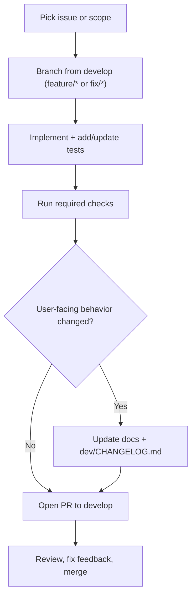

# Contributing

Thanks for contributing! We welcome bug reports, docs fixes, and code
contributions of all sizes.

## Code of Conduct

Be respectful and constructive. We are committed to a welcoming environment
for everyone.

## Before you start

- For non-trivial changes, open or comment on an issue first so we can align on scope.
- Keep docs and UX tables/controls lists in sync with actual behavior.
- Update `dev/CHANGELOG.md` for user-facing changes.

## Contributor workflow



## Development setup

You need Rust stable (latest). Install from <https://rustup.rs>.

Install prerequisites listed in `guides/INSTALL.md`, then build:

```bash
cd src && cargo build --release --bin voiceterm
```

## Code style

- Rust: `cargo fmt` and `cargo clippy --workspace --all-features -- -D warnings`.
- Keep changes focused; prefer small, reviewable commits.

## Commit message style

- Use imperative mood ("Add feature", not "Added feature").
- Keep the first line concise (under 72 characters).
- Reference the issue number if applicable (for example `Fix #42`).

## Tests

Start with the basic test suite:

```bash
cd src && cargo test
```

For overlay-only changes:

```bash
cd src && cargo test --bin voiceterm
```

Targeted checks mirrored in CI (run when relevant):

```bash
# Perf smoke (voice metrics)
cd src && cargo test --no-default-features legacy_tui::tests::perf_smoke_emits_voice_metrics -- --nocapture

# Memory guard (thread cleanup)
cd src && cargo test --no-default-features legacy_tui::tests::memory_guard_backend_threads_drop -- --nocapture

# Mutation testing (heavy; usually on demand)
cd src && cargo mutants --timeout 300 -o mutants.out
python3 ../dev/scripts/check_mutation_score.py --path mutants.out/outcomes.json --threshold 0.80
```

## Pull requests

- Explain the problem, the approach, and any tradeoffs.
- Include test output or notes on what was run.
- If UI output or flags change, update screenshots and docs that mention them.

We aim to review PRs within a few days.

## Security

For security concerns, see `.github/SECURITY.md`.
