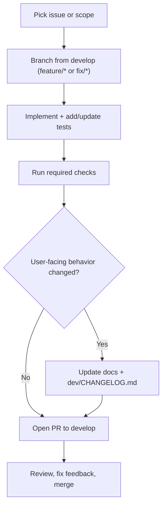

# Contributing

Thanks for contributing! We welcome bug reports, docs fixes, and code
contributions of all sizes.

## Code of Conduct

Be respectful and constructive. We are committed to a welcoming environment
for everyone.

## Before you start

- For non-trivial changes, open or comment on an issue first so we can align on scope.
- Keep docs and UX tables/controls lists in sync with actual behavior.
- Update `dev/CHANGELOG.md` for user-facing changes.
- Start from `develop`, not `master`, for normal feature and fix work.

## Contributor workflow


```mermaid
flowchart TD
    A["Pick issue or scope"] --> B["Branch from develop (feature/* or fix/*)"]
    B --> C["Implement + add/update tests"]
    C --> D["Run required checks"]
    D --> E{"User-facing behavior changed?"}
    E -->|Yes| F["Update docs + dev/CHANGELOG.md"]
    E -->|No| G["Open PR to develop"]
    F --> G
    G --> H["Review, fix feedback, merge"]
```

## Development setup

You need Rust stable and the repo prerequisites from `AGENTS.md` /
`dev/guides/DEVELOPMENT.md`.

Install prerequisites listed in `guides/INSTALL.md`, then verify the repo tool
surface:

```bash
python3 dev/scripts/devctl.py list
```

## Code style

- Rust: `cargo fmt` and `cargo clippy --workspace --all-features -- -D warnings`.
- Keep changes focused; prefer small, reviewable commits.
- Prefer the repo `devctl` checks instead of raw one-off commands when you want
  the current guarded workflow.

## Commit message style

- Use imperative mood ("Add feature", not "Added feature").
- Keep the first line concise (under 72 characters).
- Reference the issue number if applicable (for example `Fix #42`).

## Tests

Start with the repo guard path:

```bash
python3 dev/scripts/devctl.py check --profile ci
```

Useful follow-ups when you want a narrower pass:

```bash
python3 dev/scripts/devctl.py docs-check --user-facing
python3 dev/scripts/devctl.py hygiene
```

If you need raw Rust commands for a targeted runtime check:

```bash
python3 dev/scripts/devctl.py guard-run --cwd rust -- cargo test --bin voiceterm
```

## Pull requests

- Explain the problem, the approach, and any tradeoffs.
- Include test output or notes on what was run.
- If UI output or flags change, update screenshots and docs that mention them.
- Keep README and guide links current when adding a new user-visible surface.

We aim to review PRs within a few days.

## Security

For security concerns, see `.github/SECURITY.md`.
