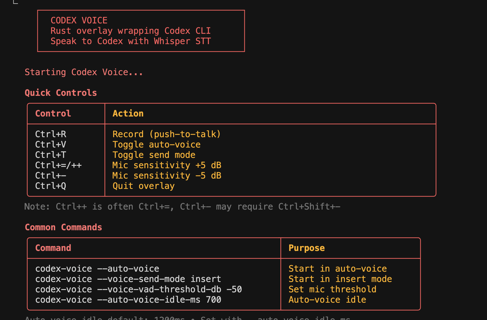

# Codex Voice


[](LICENSE)

[](https://github.com/jguida941/codex-voice/actions/workflows/rust_tui.yml)
[](https://github.com/jguida941/codex-voice/actions/workflows/mutation-testing.yml)

**Rust voice overlay for the official Codex CLI. Speak to Codex using local Whisper speech-to-text.**

Voice transcription runs entirely on your machine via `whisper.cpp`. The overlay wraps Codex in a PTY,
preserving its native TUI while injecting voice transcripts.



## Contents

- [Quick Start](#quick-start)
- [Logs](#logs-opt-in)
- [Controls](#controls-essentials)
- [Features](#features)
- [UI modes](#ui-modes)
- [macOS App](#macos-app-folder-picker)
- [Project layout](#project-layout-contributor-view)
- [Docs](#docs)
- [How It Works](#how-it-works)
- [License](#license)

## Quick Start

```bash
# Install Codex CLI
npm install -g @openai/codex

# Clone and install Codex Voice
git clone https://github.com/jguida941/codex-voice.git
cd codex-voice
./install.sh

# Run from any project
cd ~/my-project
codex-voice
```

First run downloads a Whisper model if missing. For other install options (Homebrew, macOS app,
manual), see [docs/INSTALL.md](docs/INSTALL.md).
Want the shortest path? See [QUICK_START.md](QUICK_START.md).

## Logs (opt-in)

Logs are disabled by default. To enable debug logs:
`codex-voice --logs` (add `--log-content` for prompt/response snippets).

## Controls (essentials)

| Key | Action |
|-----|--------|
| `Ctrl+R` | Start voice capture |
| `Ctrl+V` | Toggle auto-voice mode |
| `Ctrl+T` | Toggle send mode (auto vs insert) |
| `Ctrl+]` | Increase mic threshold +5 dB |
| `Ctrl+\` | Decrease mic threshold -5 dB (or `Ctrl+/`) |
| `Ctrl+Q` | Exit overlay |
| `Ctrl+C` | Forward to Codex |

For full behavior notes (insert mode, transcript queueing, long dictation), see
[docs/USAGE.md](docs/USAGE.md).

## Features

- Voice input via microphone (Whisper STT)
- Fast local transcription (~250ms after speech ends), no cloud API calls
- Rust overlay preserves the full Codex TUI (PTY passthrough)
- Auto-voice mode with queued transcripts when Codex is busy
- Optional Python fallback when native capture is unavailable

## UI modes

- `codex-voice` (default): lightweight overlay with a single status line.
- `rust_tui`: full-screen Rust TUI (primarily for IPC/dev workflows).
- **Codex Voice.app** (macOS): folder picker that launches `codex-voice` in the chosen directory.

## macOS App (folder picker)

Double-click **Codex Voice.app** and choose your project folder. It launches the
`codex-voice` overlay in a Terminal window.


## Project layout (contributor view)

- `rust_tui/src/bin/codex_overlay/main.rs` - overlay entrypoint
- `rust_tui/src/audio/recorder.rs` - CPAL capture + resample
- `rust_tui/src/mic_meter.rs` - mic meter + threshold recommendation
- `rust_tui/src/stt.rs` - Whisper transcription
- `scripts/codex_voice.py` - optional Python fallback

## Docs

- [QUICK_START.md](QUICK_START.md)
- [docs/INSTALL.md](docs/INSTALL.md)
- [docs/USAGE.md](docs/USAGE.md)
- [docs/CLI_FLAGS.md](docs/CLI_FLAGS.md)
- [docs/TROUBLESHOOTING.md](docs/TROUBLESHOOTING.md)
- [docs/active/BACKLOG.md](docs/active/BACKLOG.md)
- [docs/active/MODULARIZATION_PLAN.md](docs/active/MODULARIZATION_PLAN.md)
- [docs/dev/ARCHITECTURE.md](docs/dev/ARCHITECTURE.md)
- [docs/dev/DEVELOPMENT.md](docs/dev/DEVELOPMENT.md)
- [docs/dev/SDLC.md](docs/dev/SDLC.md)
- [CONTRIBUTING.md](.github/CONTRIBUTING.md)
- [SECURITY.md](.github/SECURITY.md)
- [docs/CHANGELOG.md](docs/CHANGELOG.md)

## How It Works

Codex Voice runs the Codex CLI in a real PTY and forwards raw ANSI output directly to your terminal.
Voice transcripts are injected as keystrokes, so Codex stays fully native. See
[docs/dev/ARCHITECTURE.md](docs/dev/ARCHITECTURE.md) for diagrams and data flow.

## License

MIT. See [LICENSE](LICENSE).
