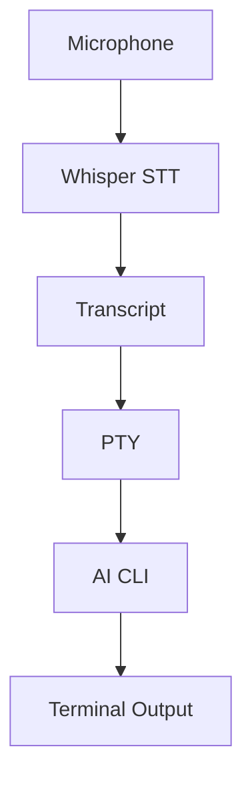

<p align="center">
  
</p>

<p align="center">
  
  
  
  
  <a href="https://github.com/jguida941/voiceterm/releases"></a>
  <a href="LICENSE"></a>
  <a href="https://ratatui.rs"></a>
</p>

<p align="center">
  <a href="https://github.com/jguida941/voiceterm/actions/workflows/rust_ci.yml"></a>
  <a href="https://github.com/jguida941/voiceterm/actions/workflows/mutation-testing.yml"></a>
</p>

Voice input for AI CLIs. Talk instead of type.
Runs Whisper locally with ~250ms latency. No cloud, no API keys.

## Quick Nav

- [Install and Start](#install-and-start)
- [How It Works](#how-it-works)
- [Requirements](#requirements)
- [Supported AI CLIs](#supported-ai-clis)
- [UI Tour](#ui-tour)
- [Controls](#controls)
- [Guides Index](guides/README.md)
- [Engineering History](dev/history/ENGINEERING_EVOLUTION.md)
- [Developer Index](dev/README.md)
- [Documentation](#documentation)
- [Support](#support)

## Install and Start

Install one supported AI CLI first:

**Codex:**

```bash
npm install -g @openai/codex
```

**Claude Code:**

```bash
curl -fsSL https://claude.ai/install.sh | bash
```

Then choose one VoiceTerm setup path:

<details open>
<summary><strong>Homebrew (recommended)</strong></summary>

```bash
brew tap jguida941/voiceterm
brew install voiceterm
cd ~/your-project
voiceterm
```

If needed, authenticate once:

```bash
voiceterm --login --codex
voiceterm --login --claude
```

</details>

<details>
<summary><strong>PyPI (pipx / pip)</strong></summary>

```bash
pipx install voiceterm
# or: python3 -m pip install --user voiceterm

cd ~/your-project
voiceterm
```

If needed, authenticate once:

```bash
voiceterm --login --codex
voiceterm --login --claude
```

</details>

<details>
<summary><strong>From source</strong></summary>

```bash
git clone https://github.com/jguida941/voiceterm.git
cd voiceterm
./scripts/install.sh
```

</details>

<details>
<summary><strong>macOS App</strong></summary>

Double-click `app/macos/VoiceTerm.app`, pick a folder, and it opens Terminal
with VoiceTerm running.
</details>

For model options and startup/IDE tuning:

- [Install Guide](guides/INSTALL.md)
- [Whisper docs](guides/WHISPER.md)
- [Troubleshooting](guides/TROUBLESHOOTING.md)

## How It Works



VoiceTerm wraps your AI CLI in a PTY and adds voice input.
You talk → Whisper transcribes locally → text gets typed into the CLI.
All CLI output passes through unchanged.

## Requirements

- macOS or Linux (Windows needs WSL2)
- Microphone access
- ~0.5 GB disk for the default small model (base is ~142 MB, medium is ~1.5 GB)

## Features

| Feature | Description |
|---------|-------------|
| **Local STT** | Whisper runs on your machine - no cloud calls |
| **~250ms latency** | Fast transcription through whisper.cpp |
| **PTY passthrough** | CLI UI stays unchanged |
| **Auto-voice** | Hands-free mode - no typing needed |
| **Transcript queue** | Speak while CLI is busy, types when ready |
| **Project voice macros** | Expand trigger phrases from `.voiceterm/macros.yaml` before typing |
| **Macros toggle** | Runtime ON/OFF control for macro expansion from Settings |
| **Built-in voice navigation** | Spoken actions for scroll up/down, show/copy last error, and explain last error |
| **Adaptive HUD telemetry** | Compact meter/latency trend chips that adapt to recording, busy, and idle states |
| **Backends** | Primary support for Codex and Claude Code |
| **Themes** | 11 built-in themes including ChatGPT, Catppuccin, Dracula, Nord, Tokyo Night, Gruvbox |

## Voice Recording


## Supported AI CLIs

VoiceTerm is optimized for Codex and Claude Code.
For canonical backend support status and experimental backend notes, see
[Usage Guide -> Backend Support](guides/USAGE.md#backend-support).
For backend configuration details, see the [Usage Guide](guides/USAGE.md).

### Codex

```bash
npm install -g @openai/codex
voiceterm
voiceterm --codex   # explicit (optional)
voiceterm --login --codex
```


### Claude Code

```bash
curl -fsSL https://claude.ai/install.sh | bash
voiceterm --claude
voiceterm --login --claude
```


## UI Tour

### Theme Picker


Use `Ctrl+Y` to open the picker (or `Ctrl+G` to quick-cycle themes), then use
↑/↓ to move and Enter to select, or type the theme number.

### Settings Menu


Mouse control is enabled by default, and Settings (`Ctrl+O`) covers the main
runtime toggles: send mode, auto-voice, macros, HUD style/border, right-panel
telemetry, latency display, and wake-word controls (wake toggle,
sensitivity, cooldown; default OFF).
In Full HUD mode, the right-panel visualizer (`Ribbon`, `Dots`, `Heartbeat`)
is shown on the main status row (top-right lane).
On `xterm-256color` terminals, VoiceTerm now keeps your selected theme
instead of forcing ANSI fallback (ANSI fallback remains for ANSI16 terminals).
Advanced style-pack previews can also switch glyph families (`unicode`/`ascii`)
for HUD meters/icons and overlay chrome symbols (footer close marker, slider
track/knob) via `VOICETERM_STYLE_PACK_JSON`; see `guides/USAGE.md`.
See the [Usage Guide](guides/USAGE.md) for full behavior and configuration details.

## Controls

For complete keybindings and behavior details, see:

- [Core Controls](guides/USAGE.md#core-controls)
- [Settings Menu](guides/USAGE.md#settings-menu)
- [Voice Modes](guides/USAGE.md#voice-modes)

CLI option reference uses a themed, grouped layout via
`voiceterm --help` (or `voiceterm -h`).

Detailed control behavior and voice command coverage live in
[guides/USAGE.md](guides/USAGE.md). For release-by-release behavior deltas, see
[dev/CHANGELOG.md](dev/CHANGELOG.md). For pre-release validation process and
manual QA, use [dev/DEVELOPMENT.md](dev/DEVELOPMENT.md).

## Engineering History

Want the design and process timeline?

- [Engineering Evolution and SDLC Timeline](dev/history/ENGINEERING_EVOLUTION.md)
- [Developer Index](dev/README.md)

## Voice Macros

Voice macros are project-local voice shortcuts defined in
`.voiceterm/macros.yaml`.

Startup default: `Settings -> Macros` starts as `OFF` (safe mode). Turn it on
when you want macro expansion.

Quick setup:

```bash
# Interactive wizard (recommended)
./scripts/macros.sh wizard

# or generate a pack directly
./scripts/macros.sh install --pack safe-core
```

Packs:

- `safe-core`: low-risk git/GitHub inspection commands
- `power-git`: write actions (commit/push/PR/issue) in `insert` mode by default
- `full-dev`: safe-core + power-git + codex-voice maintainer checks/release helpers

If you use GitHub macros, the wizard checks `gh` availability/auth and can
prompt for `gh auth login`.

Example:

- You say: `run tests`
- VoiceTerm types: `cargo test --all-features`

When it runs:

- `Settings -> Macros = ON`: if a spoken trigger matches, VoiceTerm expands it
  before typing into the CLI.
- `Settings -> Macros = OFF`: VoiceTerm skips expansion and types your
  transcript exactly as spoken.

See [Project Voice Macros](guides/USAGE.md#project-voice-macros) for the file
format, templates, and matching rules.

This repository includes a starter macro pack at `.voiceterm/macros.yaml` with
expanded git/GitHub voice workflows plus codex-voice check/release commands.

## Documentation

Use this order if you're new:

1. Start with [Quick Start](QUICK_START.md).
2. Use the [Guides Index](guides/README.md) for task-based navigation.
3. Use [Troubleshooting](guides/TROUBLESHOOTING.md) as the single issue hub.

| Users | Developers |
|-------|------------|
| [Guides Index](guides/README.md) | [Developer Index](dev/README.md) |
| [Quick Start](QUICK_START.md) | [Engineering History](dev/history/ENGINEERING_EVOLUTION.md) |
| [Install Guide](guides/INSTALL.md) | [Master Plan](dev/active/MASTER_PLAN.md) |
| [Usage Guide](guides/USAGE.md) | [Development](dev/DEVELOPMENT.md) |
| [CLI Flags](guides/CLI_FLAGS.md) | [Architecture](dev/ARCHITECTURE.md) |
| [Whisper & Languages](guides/WHISPER.md) | [ADRs](dev/adr/README.md) |
| [Troubleshooting Hub](guides/TROUBLESHOOTING.md) | [Changelog](dev/CHANGELOG.md) |
| [User Scripts](scripts/README.md) | [Dev Scripts](dev/scripts/README.md) |
| [Contributing](.github/CONTRIBUTING.md) | [History Index](dev/history/README.md) |

## Support

- Troubleshooting: [guides/TROUBLESHOOTING.md](guides/TROUBLESHOOTING.md)
- Bug reports and feature requests: [GitHub Issues](https://github.com/jguida941/voiceterm/issues)
- Security concerns: [.github/SECURITY.md](.github/SECURITY.md)

## Contributing

PRs welcome. See [CONTRIBUTING.md](.github/CONTRIBUTING.md).
Before opening a PR, run `python3 dev/scripts/devctl.py check --profile prepush`.
For governance/docs consistency, also run `python3 dev/scripts/devctl.py hygiene`.

## License

MIT - [LICENSE](LICENSE)
