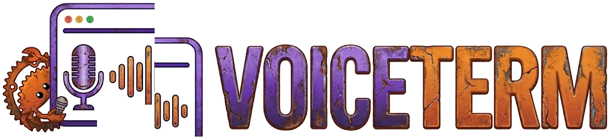
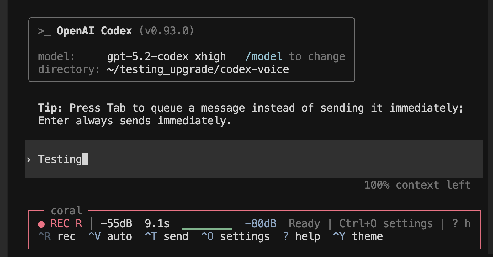
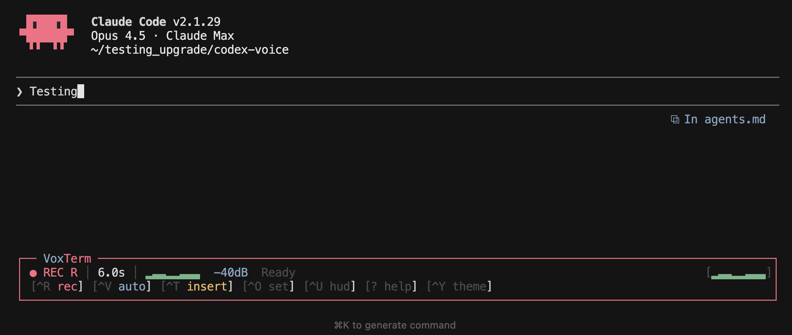
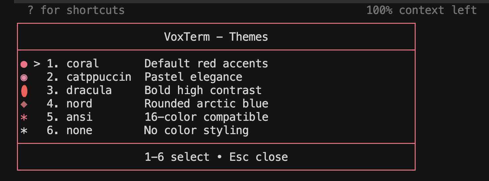
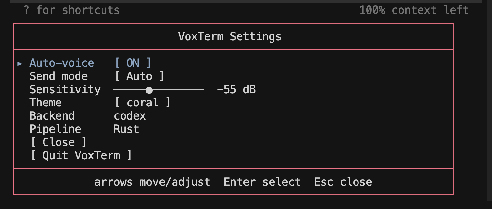

<p align="center">
  
</p>

<p align="center">
  
  
  
  
  <a href="https://ratatui.rs"></a>
</p>

<p align="center">
  <a href="https://github.com/jguida941/voiceterm/releases"></a>
  <a href="LICENSE"></a>
  <a href="https://github.com/jguida941/voiceterm/actions/workflows/rust_ci.yml"></a>
  <a href="https://github.com/jguida941/voiceterm/actions/workflows/mutation-testing.yml"></a>
  <a href="https://codecov.io/gh/jguida941/voiceterm"></a>
</p>

**VoiceTerm** gives you voice control for AI CLIs in your normal terminal.
It supports a fully hands-free flow: say the wake phrase (`hey codex` /
`hey claude`), speak your prompt, then say `send` or `submit`.
You can also use one-shot commands like `hey codex send` or
`hey claude send`.
Completely hands-free, no keyboard needed.

Whisper runs locally by default. No cloud API keys required.
Release history: [dev/CHANGELOG.md](dev/CHANGELOG.md).

## Quick Nav

- [Hands-Free Quick Start](#hands-free-quick-start)
- [Install and Start](#install-and-start)
- [Requirements](#requirements)
- [Features](#features)
- [Supported Backends](#supported-ai-clis)
- [Controls](#controls)
- [Guides Index](guides/README.md)
- [Documentation](#documentation)
- [Support](#support)

## Install and Start

Install one supported AI CLI first:

**Codex:**

```bash
npm install -g @openai/codex
```

**Claude Code:**

```bash
curl -fsSL https://claude.ai/install.sh | bash
```

Then choose one VoiceTerm setup path:

<details open>
<summary><strong>Homebrew (recommended)</strong></summary>

```bash
brew tap jguida941/voiceterm
brew install voiceterm
cd ~/your-project
voiceterm
```

If needed, authenticate once:

```bash
voiceterm --login --codex
voiceterm --login --claude
```

</details>

<details>
<summary><strong>PyPI (pipx / pip)</strong></summary>

```bash
pipx install voiceterm
# or: python3 -m pip install --user voiceterm

cd ~/your-project
voiceterm
```

If needed, authenticate once:

```bash
voiceterm --login --codex
voiceterm --login --claude
```

</details>

<details>
<summary><strong>From source</strong></summary>

Requires Rust toolchain. See [Install Guide](guides/INSTALL.md) for details.

```bash
git clone https://github.com/jguida941/voiceterm.git
cd voiceterm
./scripts/install.sh
```

</details>

<details>
<summary><strong>macOS App</strong></summary>

Double-click `app/macos/VoiceTerm.app`, pick a folder, and it opens Terminal
with VoiceTerm running.
</details>

For model options and startup/IDE tuning:

- [Install Guide](guides/INSTALL.md)
- [Whisper docs](guides/WHISPER.md)
- [Troubleshooting](guides/TROUBLESHOOTING.md)

## How It Works

VoiceTerm listens to your mic, converts speech to text on your machine, and
types the result into your AI CLI input.



## Requirements

- macOS or Linux (Windows needs WSL2)
- Microphone access
- ~0.5 GB disk for the default small model (base is ~142 MB, medium is ~1.5 GB)

## Features

### Main features

| Feature | What it does |
|---------|---------------|
| **Local speech-to-text** | Whisper runs on your machine (no cloud calls) |
| **Fast voice-to-text** | A local Whisper engine turns speech into text quickly |
| **Terminal passthrough** | Your CLI layout and behavior stay the same |
| **Auto-voice** | You can talk hands-free instead of typing |
| **Wake mode + voice send** | Say `hey codex`/`hey claude`, then say `send`/`submit` in insert mode |
| **Image mode** | Turn on `Image mode` in Settings to have `Ctrl+R` capture picture prompts (`IMG` badge) |
| **Transcript queue** | If the CLI is busy, VoiceTerm waits and sends text when ready |
| **Codex + Claude support** | Primary support for Codex and Claude Code |

### Everyday tools

- **Voice macros**: expand phrases from `.voiceterm/macros.yaml` and toggle them on/off in Settings
- **Voice navigation**: spoken `scroll`, `send`, `show last error`, `copy last error`, and `explain last error`
- **Developer guard mode**: launch with `--dev` to enable deferred dev-only experiments (`DEV` badge), use `Ctrl+D` to open the in-session Dev panel, and add `--dev-log` to write session JSONL diagnostics
- **Transcript history**: use `Ctrl+H` to search and replay past text into the active CLI
- **Notification history**: use `Ctrl+N` to review recent status notifications
- **Saved settings**: keeps your settings in `~/.config/voiceterm/config.toml`
- **Built-in themes**: 11 themes including ChatGPT, Catppuccin, Dracula, Nord, Tokyo Night, and Gruvbox
- **Style-pack border routing**: `VOICETERM_STYLE_PACK_JSON` supports `components.overlay_border` and `components.hud_border` (HUD applies when border mode is `theme`)

For full behavior details and controls, see [guides/USAGE.md](guides/USAGE.md).

## Supported AI CLIs

VoiceTerm is optimized for Codex and Claude Code.
For full backend status and setup details, see
[Usage Guide -> Backend Support](guides/USAGE.md#backend-support).

### Codex


### Claude Code



## Hands-Free Quick Start

```bash
voiceterm --auto-voice --wake-word --voice-send-mode insert
```

Think of this like Alexa for your terminal:

1. Say the wake phrase (`hey codex` or `hey claude`)
2. Speak your prompt
3. Say `send` (or `submit`)

## UI Tour

### Theme Picker


Press `Ctrl+Y` to open Theme Studio and choose `Theme picker`.
Use `Ctrl+G` to quick-cycle themes.

### Settings Menu



Mouse control is enabled by default. Open Settings with `Ctrl+O`.
For details, use:

- [Settings Menu](guides/USAGE.md#settings-menu)
- [Themes](guides/USAGE.md#themes)
- [HUD styles](guides/USAGE.md#hud-styles)

### Transcript History

Use `Ctrl+H` to open transcript history, type to filter, and press `Enter` to
replay into the active CLI input. Mouse click selection is also supported.
History rows are labeled by source (`mic`, `you`, `ai`); only `mic` and `you`
rows are replayable, and `ai` rows are output-only.
Detailed behavior: [Transcript History](guides/USAGE.md#transcript-history).

### Help Overlay

Press `?` to open grouped shortcuts (`Recording`, `Mode`, `Appearance`,
`Sensitivity`, `Navigation`) with clickable Docs/Troubleshooting links on
terminals that support clickable links. Details: [Core Controls](guides/USAGE.md#core-controls).

## Controls

For shortcuts and behavior, see:

- [Core Controls](guides/USAGE.md#core-controls)
- [Settings Menu](guides/USAGE.md#settings-menu)
- [Voice Modes](guides/USAGE.md#voice-modes)

For CLI flags and command-line options:

- `voiceterm --help` (or `voiceterm -h`)
- [CLI Flags](guides/CLI_FLAGS.md)

## Voice Macros

Voice macros are project-local shortcuts in `.voiceterm/macros.yaml`.
Turn macros on in Settings when you want phrase expansion.
Setup and examples: [Project Voice Macros](guides/USAGE.md#project-voice-macros).

## Documentation

Use this order if you're new:

1. Start with [Quick Start](QUICK_START.md).
2. Use the [Guides Index](guides/README.md) for task-based navigation.
3. Use [Troubleshooting](guides/TROUBLESHOOTING.md) as the single issue hub.

User docs:

- [Guides Index](guides/README.md)
- [Quick Start](QUICK_START.md)
- [Install Guide](guides/INSTALL.md)
- [Usage Guide](guides/USAGE.md)
- [CLI Flags](guides/CLI_FLAGS.md)
- [Troubleshooting](guides/TROUBLESHOOTING.md)

Developer docs:

- [Developer Index](dev/README.md)
- [Engineering History](dev/history/ENGINEERING_EVOLUTION.md)

## Support

- Troubleshooting: [guides/TROUBLESHOOTING.md](guides/TROUBLESHOOTING.md)
- Bug reports and feature requests: [GitHub Issues](https://github.com/jguida941/voiceterm/issues)
- Security concerns: [.github/SECURITY.md](.github/SECURITY.md)

## Contributing

PRs welcome. See [CONTRIBUTING.md](.github/CONTRIBUTING.md).
Before opening a PR, run `python3 dev/scripts/devctl.py check --profile prepush`.
For governance/docs consistency, also run `python3 dev/scripts/devctl.py hygiene`.

## License

MIT - [LICENSE](LICENSE)
