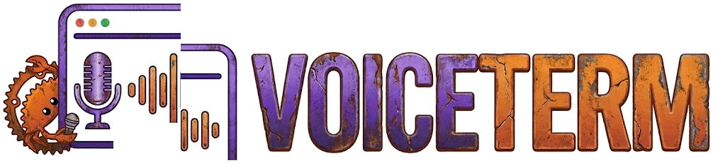
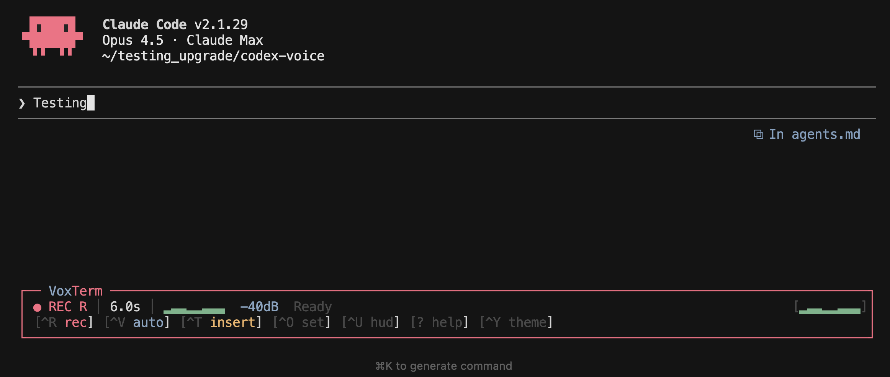
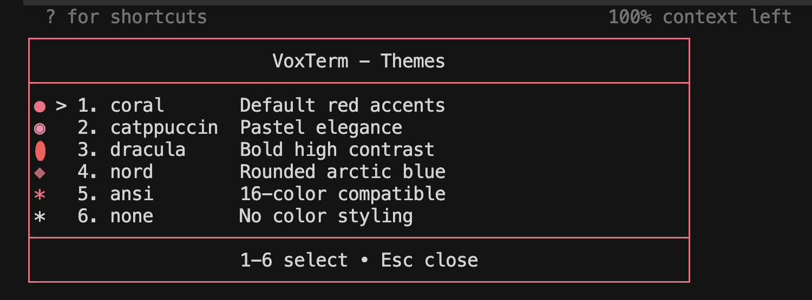
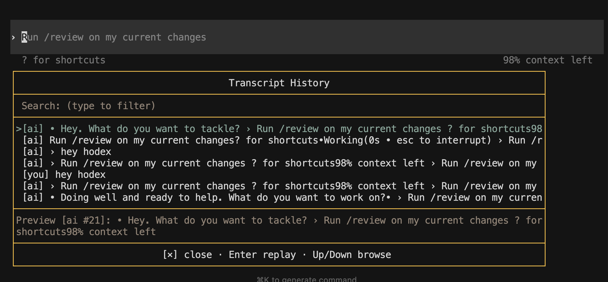
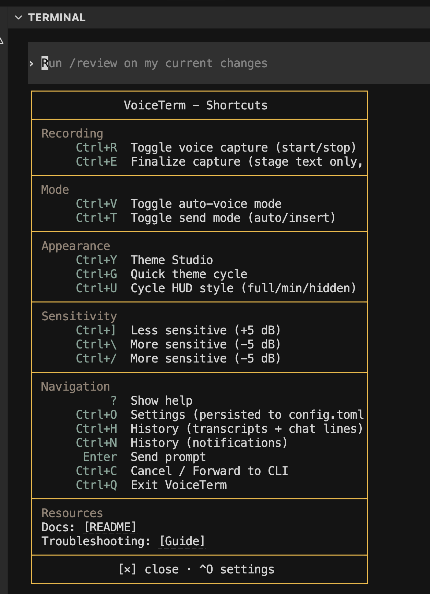

<p align="center">
  
</p>

<p align="center">
  
  
  
  
  <a href="https://ratatui.rs"></a>
</p>

<p align="center">
  <a href="https://github.com/jguida941/voiceterm/releases"></a>
  <a href="LICENSE"></a>
  <a href="https://github.com/jguida941/voiceterm/actions/workflows/rust_ci.yml"></a>
  <a href="https://codecov.io/gh/jguida941/voiceterm"></a>
</p>

Low-latency Rust terminal overlay for Codex and Claude Code with local Whisper
STT, PTY passthrough, wake words, macros, and a customizable HUD.

Whisper runs locally by default - no cloud API keys required.
Release history: [CHANGELOG](CHANGELOG.md).

If you are new, use this path:

1. [Quick Start](QUICK_START.md)
2. [Install Guide](guides/INSTALL.md)
3. [Usage Guide](guides/USAGE.md)
4. [Troubleshooting](guides/TROUBLESHOOTING.md)

## Quick Nav

- [Install and Start](#install-and-start)
- [How It Works](#how-it-works)
- [Hands-Free Quick Start](#hands-free-quick-start)
- [Features](#features)
- [Supported Backends](#supported-ai-clis)
- [IDE Support](#ide-support)
- [UI Overview](#ui-overview)
- [Controls](#controls)
- [Documentation](#documentation)
- [Contributing](#contributing)
- [For Developers](#for-developers)
- [Support](#support)

## Install and Start

Install one supported AI CLI first:

**Codex:**

```bash
npm install -g @openai/codex
```

**Claude Code:**

```bash
npm install -g @anthropic-ai/claude-code
```

Anthropic also provides a native installer:
`curl -fsSL https://claude.ai/install.sh | bash`.

Then choose one VoiceTerm setup path:

<details open>
<summary><strong>Homebrew (recommended)</strong></summary>

```bash
brew tap jguida941/voiceterm
brew install voiceterm
cd ~/your-project
voiceterm
```

If needed, authenticate once:

```bash
voiceterm --login --codex
voiceterm --login --claude
```

</details>

<details>
<summary><strong>PyPI (pipx / pip)</strong></summary>

```bash
pipx install voiceterm
# or: python3 -m pip install --user voiceterm

cd ~/your-project
voiceterm
```

If needed, authenticate once:

```bash
voiceterm --login --codex
voiceterm --login --claude
```

</details>

<details>
<summary><strong>From source</strong></summary>

Requires Rust toolchain. See [Install Guide](guides/INSTALL.md) for details.

```bash
git clone https://github.com/jguida941/voiceterm.git
cd voiceterm
./scripts/install.sh
```

If you are running from source while developing, run:

```bash
make ci
make build
./scripts/start.sh
```

`scripts/start.sh` selects or downloads a Whisper model before launching the
local release binary. Running `rust/target/release/voiceterm` directly requires
an explicit `--whisper-model-path` unless the model is under the repository's
`whisper_models/` directory.

</details>

<details>
<summary><strong>macOS App</strong></summary>

Double-click `app/macos/VoiceTerm.app`, pick a folder, and it opens Terminal
with VoiceTerm running.
</details>

For model options and startup tuning:

- [Install Guide](guides/INSTALL.md)
- [Whisper docs](guides/WHISPER.md)
- [Troubleshooting](guides/TROUBLESHOOTING.md)

## How It Works

VoiceTerm listens to your mic, converts speech to text on your machine, and
types the result into your AI CLI input.


## Requirements

- macOS or Linux (Windows needs WSL2)
- Microphone access
- ~0.5 GB disk for the default small model (base is ~142 MB, medium is ~1.5 GB)

## Hands-Free Quick Start

VoiceTerm supports a fully hands-free workflow - no typing needed at all.

```bash
voiceterm --auto-voice --wake-word --voice-send-mode insert
```

1. Say the wake phrase (`hey codex` or `hey claude`)
2. Speak your prompt
3. Say `send` or `submit` to deliver it

## Features

### Main features

| Feature | What it does |
|---------|---------------|
| **Local speech-to-text** | Whisper runs on your machine - no cloud calls needed |
| **Fast voice-to-text** | Local Whisper turns speech into text quickly |
| **Keep your CLI as-is** | Your backend CLI layout and behavior stay the same |
| **Auto voice mode** | Keep listening on so you can talk instead of typing |
| **Wake mode + voice send** | Say `hey codex`/`hey claude`, then say `send`/`submit` |
| **Image prompts** | Use `Ctrl+X` for screenshot prompts, or enable persistent image mode |
| **Live dictation** | Dictate the next instruction while an agent is working; Codex stages it immediately, while Claude delivers it when ready |
| **Codex + Claude support** | Primary support for Codex and Claude Code |

### Everyday tools

| Tool | What it does |
|------|--------------|
| **Voice navigation** | Spoken `scroll`, `send`, `show last error`, `copy last error`, `explain last error` |
| **Voice macros** | Expand phrases from `.voiceterm/macros.yaml` - see [Voice Macros](#voice-macros) |
| **Built-in themes** | 11 themes including ChatGPT, Catppuccin, Dracula, Nord, Tokyo Night, and Gruvbox |
| **Transcript history** | `Ctrl+H` to search and replay past text |
| **Notification history** | `Ctrl+N` to review recent status messages |
| **Saved settings** | Stored in `~/.config/voiceterm/config.toml` |
| **HUD controls** | Mouse and keyboard both work by default |
| **Live Theme Studio** | Preview HUD borders, style, panel, colors, and glyph changes immediately without repainting the conversation |

For full details: [Usage Guide](guides/USAGE.md).

## Supported AI CLIs

VoiceTerm is optimized for Codex and Claude Code.
For full backend status and setup details, see
[Usage Guide - Backend Support](guides/USAGE.md#backend-support).

| Backend | Status | Notes |
|---|---|---|
| Codex | Supported | Default backend |
| Claude Code | Supported | Full support on current releases |
| Gemini CLI | Experimental | Not working in current releases |
| Other/custom backends | Experimental | See the usage guide for current limits |



## IDE Support

| IDE host | Codex | Claude Code | Notes |
|---|---|---|---|
| Cursor terminal | Fully supported | Fully supported | Recommended host |
| JetBrains terminals (IntelliJ, PyCharm, WebStorm, CLion) | Fully supported | Fully supported | Validated with current Codex and Claude terminal flows |
| AntiGravity | Not yet supported | Not yet supported | Not available in current releases |
| Other IDE terminals | Unverified | Unverified | Treat as experimental |

For more IDE details: [Usage Guide - IDE Compatibility](guides/USAGE.md#ide-compatibility).

## UI Overview

### Theme Studio

Press `Ctrl+Y` to edit HUD and theme visuals. Theme Studio keeps a live HUD
preview beneath its isolated panel, so border, HUD style, right-panel, color,
and glyph changes appear immediately without scrolling or repainting the
conversation.

For details: [Theme Studio](guides/USAGE.md#settings-menu) ·
[HUD styles](guides/USAGE.md#hud-styles).

### Theme Picker



For details: [Themes](guides/USAGE.md#themes) ·
[CLI Flags](guides/CLI_FLAGS.md#themes--display).

### Settings Menu


For details: [Settings Menu](guides/USAGE.md#settings-menu) ·
[Themes](guides/USAGE.md#themes) ·
[HUD styles](guides/USAGE.md#hud-styles).

### Transcript History

`Ctrl+H` opens conversation history with `mic`, `you`, and `ai` rows. You can
search all rows and replay microphone/user inputs; AI output remains read-only.



For details: [Transcript History](guides/USAGE.md#transcript-history).

### Shortcuts Overlay

Press `Shift+?` to open the shortcuts overlay with grouped hotkeys and
clickable links to Docs and Troubleshooting.



For details: [Core Controls](guides/USAGE.md#core-controls).

## Controls

For shortcuts and behavior, see:

- [Core Controls](guides/USAGE.md#core-controls)
- [Settings Menu](guides/USAGE.md#settings-menu)
- [Voice Modes](guides/USAGE.md#voice-modes)

For CLI flags and command-line options:

- `voiceterm --help` (or `voiceterm -h`)
- [CLI Flags](guides/CLI_FLAGS.md)

## Voice Macros

***Note: Voice macros are still in development and may have rough edges.***

Voice macros are project-local shortcuts in `.voiceterm/macros.yaml`.
Turn macros on in Settings when you want phrase expansion.
Setup and examples: [Project Voice Macros](guides/USAGE.md#project-voice-macros).

## Documentation

Start with the shortest useful doc for your goal:

| Audience | Document |
|---|---|
| User | [Quick Start](QUICK_START.md) |
| User | [Guides Index](guides/README.md) |
| User | [Install Guide](guides/INSTALL.md) |
| User | [Usage Guide](guides/USAGE.md) |
| User | [CLI Flags](guides/CLI_FLAGS.md) |
| User | [Troubleshooting](guides/TROUBLESHOOTING.md) |
| Developer | [Contributor Guide](.github/CONTRIBUTING.md) |
| Developer | [Scripts](scripts/README.md) |

## Contributing

PRs welcome. See [CONTRIBUTING.md](.github/CONTRIBUTING.md).
Before opening a PR, run:

- `make ci`
- `make integration`
- `markdownlint -c .markdownlint.yaml -p .markdownlintignore README.md QUICK_START.md CHANGELOG.md guides/*.md scripts/*.md scripts/tests/*.md app/*.md pypi/*.md .github/*.md .github/ISSUE_TEMPLATE/*.md .github/PULL_REQUEST_TEMPLATE/*.md .github/workflows/README.md`

## For Developers

Looking to contribute or dig into the codebase? Start with the
[Contributor Guide](.github/CONTRIBUTING.md), the [scripts reference](scripts/README.md),
and the Rust source under `rust/`.

**When do I run what?**

| When | Command |
|------|---------|
| Quick sanity check while coding | `make check` |
| Before pushing to GitHub | `make prepush` |
| Full CI-equivalent check locally | `make ci` |
| Rust tests only | `cd rust && cargo test --bin voiceterm` |
| PyPI launcher tests | `python3 -m unittest discover -s pypi/tests` |
| Integration smoke test | `make integration` |
| Validate release versions | `make release-check V=X.Y.Z` |

## Support

- Troubleshooting:
  [guides/TROUBLESHOOTING.md](guides/TROUBLESHOOTING.md)
- Bug reports and feature requests:
  [GitHub Issues](https://github.com/jguida941/voiceterm/issues)
- Security concerns:
  [.github/SECURITY.md](.github/SECURITY.md)

## License

VoiceTerm is source-available under the proprietary evaluation license in
[LICENSE](LICENSE).

- No third-party commercial use, production use, hosting, redistribution, or
  derivative commercialization is allowed without prior written permission.
- Separate commercial or production rights require a direct written license
  from the Licensor.
