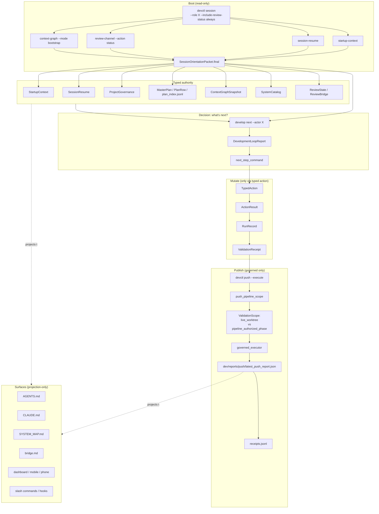
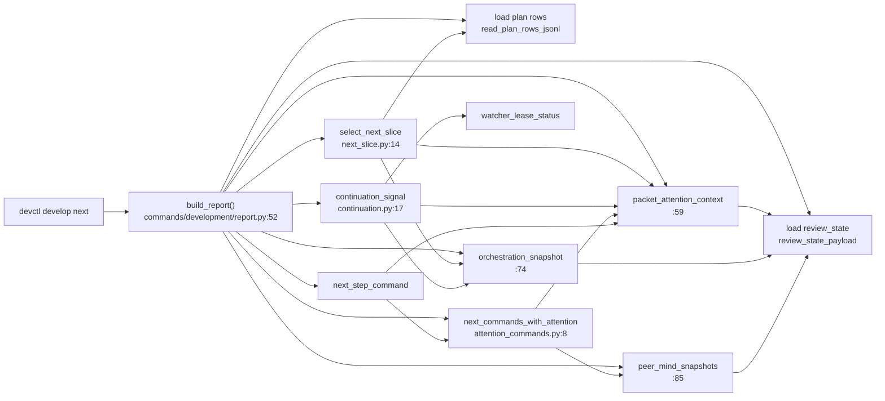
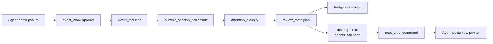
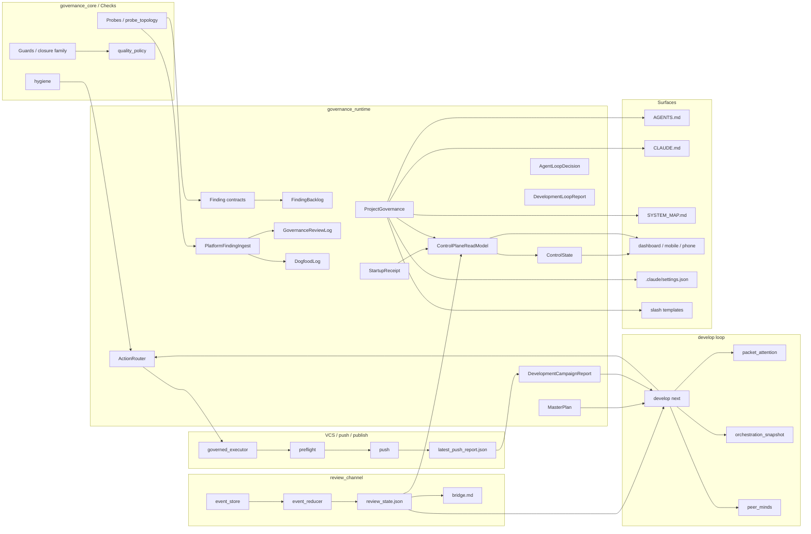

# System Connection Flowchart — AI Governance Platform

> **Scope.** This document maps the AI governance platform that lives in this repo. It deliberately **excludes** the VoiceTerm voice application (the platform's first-party adopter / dogfood client). VoiceTerm = `rust/`, `crates/` (under rust), `app/`, `voice-server`, `voice-client`, `whisper_models/`, `.voiceterm/`, `orb.db`. Everything else in the tree belongs to the platform and is mapped here.
>
> **Purpose.** Be feedable to AI agents so they stop creating parallel/duplicate systems. Every subsystem entry names its canonical typed contract, who reads it, who writes it, what artifact lands where. Duplicates and disconnected islands are flagged explicitly with file:line citations.
>
> **Status.** Built by an 8-agent parallel swarm reading the repo read-only. Swarm 1 covered the eight major regions; swarm 2+ append findings from re-reads, gap fills, and verification. See **Iteration Log** at the bottom.
>
> **How to read this doc.**
> - Start with **§1 The Five-Layer Model** to know the vocabulary.
> - **§2 Canonical Authority Spine** is the one diagram you should commit to memory — every mutation must trace back to it.
> - **§3** through **§10** are inventories: each subsystem entry has Path, Role, Owns/Writes, Reads/Consumes, Called by, Calls, Authority (typed-authority / projection-only / adapter), Layer.
> - **§11 Duplicates & Parallel Systems** and **§12 Disconnected Islands** are the consolidation-priority lists — operator's primary concern.
> - **§13 Platform ↔ Adopter Seam** explicitly enumerates every place voiceterm is hard-wired into the platform (must move to repo-pack as part of extraction).
> - **§14 State Write Authority Audit** answers "for any JSONL/JSON state file, who is allowed to write it?" — this is the "single source of truth" enforcement table.

> **Authority/load-order warning (2026-05-21).** This file is a deep architecture audit, not first-load agent authority. Agents must boot through typed session/startup authority and `develop next` before reading this file. Use `dev/guides/SYSTEM_MAP.md` for current navigation; use this flowchart only for duplicate-system cleanup, disconnected-island investigation, platform/adopter seam work, and state-write authority audit. This file should be archived under `dev/audits/architecture/` or registered as a managed generated surface with a freshness guard; until then, treat line citations as stale unless re-verified.

---

## §1. The Five-Layer Model

The platform itself declares five layers in `python3 dev/scripts/devctl.py platform-contracts --format md`. Every subsystem in this document sorts into exactly one of them.

| Layer | Purpose | Current home in repo |
|---|---|---|
| **governance_core** | Portable guard/probe engine, policy resolution, bootstrap, export, review ledger, evaluation artifacts. | `dev/scripts/checks/` and `dev/scripts/devctl/` |
| **governance_runtime** | Typed runtime state, action execution, run records, artifact-store contracts shared by CLI/UI surfaces. | `dev/scripts/devctl/runtime/` (87 typed contracts live here) |
| **governance_adapters** | Provider, workflow, CI, VCS, notifier integrations over the shared runtime. | distributed across `dev/scripts/devctl/` and workflow scripts |
| **governance_frontends** | CLI, PyQt6, overlay/TUI, phone/mobile, optional MCP surfaces over one backend. | devctl CLI + repo-local UI surfaces |
| **repo_packs** | Repo-local policy, workflow defaults, docs templates, bounded repo-specific glue. | `dev/config/` + `dev/scripts/devctl/repo_packs/` + target-repo generated assets |

Inventory snapshot (from `system-map`):
- `dev/scripts/devctl/` — **2199 Python files** across `commands=581`, `tests=521`, `runtime=369`, `review_channel=295`, `platform=75`, `governance=74`, `(root)=62`, `context_graph=47`.
- `dev/scripts/checks/` — **446 Python files** across `(root)=140`, `package_layout=32`, `platform_contract_closure=21`, `review_probes=21`, `python_analysis=17`, `multi_agent_sync=16`, `code_shape=15`, `rust_analysis=15`.
- **87 shared typed contracts** in the connectivity registry; **9 artifact-schema kinds**; **5 frontend surfaces**; **13 governed surfaces** generated from typed inputs (see §10).

**Authority law (from `AGENTS.md` and `CLAUDE.md`):** *Generated markdown, bridge text, dashboard rows, slash commands, and memory notes are projections. Durable authority lives in typed state, repo-pack policy, contracts, receipts, and guards.* The proof chain for any mutation is `TypedAction → ActionResult → RunRecord → ValidationReceipt`.

---

## §2. Canonical Authority Spine

This is the path every agent action must follow. Anything that diverges from it is, by construction, a parallel system.



**Reading the spine:**
1. **Boot is mandatory.** `devctl session` is the *only* sanctioned entry. It composes `startup-context + session-resume + review-channel + context-graph` and emits one typed `SessionOrientationPacket`.
2. **Authority is typed.** Seven typed contracts (`StartupContext`, `SessionResume`, `ProjectGovernance`, `MasterPlan`, `ContextGraphSnapshot`, `SystemCatalog`, `ReviewState`) are the only durable authority sources.
3. **Decision is one reducer.** `develop next` builds `DevelopmentLoopReport` and emits `next_step_command`. There must be **one** of these. (See §11 — there are currently **four** parallel ones.)
4. **Mutation requires the proof chain.** No `TypedAction` ⇒ no `ActionResult` ⇒ no `RunRecord` ⇒ no `ValidationReceipt`. No raw bypass.
5. **Publication is governed.** Only `devctl push --execute` writes `dev/reports/push/latest_push_report.json`. Pre-push git hook blocks raw `git push`. Receipts append to `dev/reports/push/history/receipts.jsonl`.
6. **All surfaces are projections.** They are recomputable from the authority + receipt chain. Hand-editing them is a contract violation.

---

## §3. The system-picture Ledger (live snapshot of the spine)

`devctl system-picture --format md` projects nine canonical sections. **Every section names its source path AND the typed command that regenerates it.** This *is* the operator's "everything flows through here" surface in miniature; the rest of this document is the meta-version covering subsystems that don't yet have a section.

| # | Section | Source path | Source command |
|---|---|---|---|
| 1 | Startup Authority | `dev/reports/startup/latest/receipt.json` | `devctl startup-context --format summary` |
| 2 | Context Graph | `dev/reports/graph_snapshots/<sha>_<ts>.json` | `devctl context-graph --mode bootstrap --format md` |
| 3 | Review Runtime | `dev/reports/review_channel/projections/latest/review_state.json` | `devctl review-channel --action status --terminal none --format json` |
| 4 | Coordination Posture | (same path as #3, different projection) | (same command, different projection) |
| 5 | Control Plane | (same path) | `devctl dashboard --format json` |
| 6 | Quality Signals | — | `devctl probe-report --format md` |
| 7 | Governance Review | `dev/reports/governance/latest/review_summary.json` | `devctl governance-review --format md` |
| 8 | External Findings | `dev/reports/governance/external_findings_latest/external_findings_summary.json` | `devctl governance-import-findings --format md` |
| 9 | Data Science | `dev/reports/data_science/latest/summary.json` | `devctl data-science --format md` |

**Live observation at snapshot time** (sys-f31753d0e782df08, branch `feature/governance-quality-sweep`, head `25d5c79`): the projection **itself reports** `declared_topology: multi_agent_orchestrated` vs `observed_topology: single_agent` — the typed system is admitting topology drift. This is exactly the duplication-class this document is hunting; see §11 entry **D-Topology**.

---

## §4. governance_runtime — typed contracts and the proof chain

`dev/scripts/devctl/runtime/` holds 369 files implementing 87 typed contracts. The headline contracts and their canonical writers/readers:

### 4.1 The proof-chain core

| Contract | Owner module | Role | Authority |
|---|---|---|---|
| `TypedAction` | `runtime/action_contracts.py:17–72` | Canonical command payload (action_id, repo_pack_id, parameters, requested_by, dry_run) | typed-authority |
| `ActionResult` | `runtime/action_contracts.py:89` | Outcome envelope (ok, status, reason, retryable, artifact_paths, errors, remediation) | typed-authority |
| `RunRecord` | `runtime/action_contracts.py:RunRecord` | Durable execution episode (run_id, action_id, artifact_paths, status, findings_count, started_at, finished_at) | typed-authority |
| `ArtifactStore` | `runtime/action_contracts.py:ArtifactStore` | Storage contract (root, retention_policy, managed_kinds) | typed-authority |
| `ValidationPlan` / `ValidationReceipt` | `runtime/validation_contracts.py:17–77` | Tree-bound validation policy + proof-of-execution evidence | typed-authority |
| `CheckpointRepairAuthority` | `runtime/checkpoint_repair_authority.py` | Guards transitions that repair failed pipeline state | typed-authority |
| `ScopePathClaims` | `runtime/scope_path_claims.py:7–43` | Parses freeform scope text → repo-relative paths; matches paths against claims (`.json` AND `.jsonl` recognized) | projection-only |

### 4.2 The finding/decision family

| Contract | Owner module | Role |
|---|---|---|
| `Finding` (FindingRecord) | `runtime/finding_contracts.py:1–88` | Canonical machine-readable evidence row |
| `DecisionPacket` | `runtime/finding_contracts.py:DecisionPacketRecord` | Typed projection of one finding for AI/human approval |
| `FailurePacket` | `runtime/failure_packet.py` | Test/workflow failure-evidence packet |
| `FindingReview` | `governance_review/models.py:GovernanceReviewInput` | Adjudication input row |
| `FindingBacklog` | `runtime/finding_backlog.py:47–100` | Latest-verdict-per-finding projection over governance-review log |
| `PlatformFindingIngest` | `runtime/platform_finding_ingest.py:29–120` | Fail-open ingest seam: dogfood + governance evidence |

### 4.3 The control-plane / agent-loop family

| Contract | Owner module | Role |
|---|---|---|
| `ControlState` | `runtime/control_state.py:30–80` | Operator-facing state snapshot (plan_id, phase, risk, open_findings, review_bridge_state) |
| `ControlPlaneReadModel` | `runtime/control_plane_read_model.py` | Unified read-only projection for all frontends |
| `AgentDispatchRouter` | `runtime/agent_dispatch_router.py:38–100` | Deterministic projection of which agent session claims which task |
| `AgentLoopDecision` | `runtime/agent_loop_decision.py:39–80` | Per-session next-action decision (wait/execute/blocker/observer/pivot) |
| `AgentLoopProof` | `runtime/agent_loop_proof_*.py` (9 modules) | Modular proof chain: policy/context/evidence/packets/round/plan/runtime/scope/sessions |
| `StartupReceipt` | `runtime/startup_receipt*.py` | Fresh-startup trust boundary; gates phase advancement |
| `ProjectGovernance` | `runtime/project_governance.py:1–93` | Repo identity, pack refs, doc/plan registries, bridge config, push enforcement rules |
| `CoordinationLoader` | `runtime/coordination_loader.py` | Load WorkflowAdapter specs from ProjectGovernance |
| `ActionRouter` | `runtime/action_routing.py:1–400` | Route TypedAction to eligible agents; defer publication |

### 4.4 The development-team / topology family

| Contract | Owner module | Role |
|---|---|---|
| `DevelopmentModeTopology` | `runtime/development_team.py:DevelopmentModeTopology` | Provider-neutral `/develop` workstream topology (workstreams, routing, evidence, research, knowledge_flow, scaling) |
| `DevelopmentLoopReport` | `commands/development/models.py:DevelopmentLoopReport` | Read-only `/develop` controller report (controller_state, next_slice, packet_attention, runtime, orchestration, collaboration_mode, packet_pressure, packet_ingestion_decision, campaign) |
| `DevelopmentCampaignReport` | `commands/development/models.py:DevelopmentCampaignReport` | Codex/Claude remote-control campaign view (mode_drift, governed_exception_status, bypass_posture, push proof, pending packet) |
| `DevelopmentNextSlice` | `commands/development/next_slice.py:14–67` | Selected work unit (plan row) via packet-attention + orchestration blockers |
| `DevelopmentContinuationRequiredSignal` | `commands/development/continuation.py:25–63` | Stop policy (`stop_only_when_typed_controller_closed`) |

### 4.5 The dogfood / governance-review pair

- **DogfoodGovernance** (`runtime/dogfood_governance.py`) — typed input builder (check_findings, quality_feedback, context_snapshot)
- **DogfoodLog** (`runtime/dogfood_log.py`) — JSONL ledger writer at `dev/reports/dogfood/runs.jsonl`
- **DogfoodRender** (`runtime/dogfood_render.py:20–40`) — `persist_dogfood_run()`; renders summaries
- **GovernanceReviewLog** (`governance_review/log.py:1–80`) — `append_governance_review_row()`; canonical adjudication ledger
- **GovernanceReviewRender** (`governance_review/render.py`) — markdown summaries from rows

⚠ See §11 / **D-FindingIngest** — there are two write paths to the dogfood ledger.

### 4.6 Other typed-authority families touched by §11/§12

- **GovernedExceptionLifecycle** (`runtime/governed_exception_store.py`, `governed_exception_lifecycle.py`, `governed_exception_contracts.py`) — append-only at `dev/state/governed_exception_lifecycles.jsonl`. **File does not yet exist on disk (swarm 2). Read-only loader exists; writer is a design artifact awaiting implementation.**
- **PlanIntentIngestion** (`runtime/plan_intent_ingestion.py:78`) — `append_plan_intent_ingestion_receipt()` → `dev/state/plan_ingestion_receipts.jsonl`.
- **PlanSourceRetention** (`runtime/plan_source_retention*.py`) — `dev/state/plan_source_snapshots.jsonl`.
- **GroundTruthProbeReceipt** (`runtime/ground_truth_probe_receipt.py:42`) — `dev/state/ground_truth_probe_receipts.jsonl`.
- **PacketIntentAnchor** (`runtime/packet_intent_anchor.py:14–37`) — non-authoritative continuity pointers from review packets to plan intent.

### 4.7 Additional runtime families surfaced by swarm 3 catalog (369 files total)

The runtime/ tree decomposes into 44 family clusters. The table below lists families NOT covered above; each has at least one shared typed contract.

| Family | File count | Anchor / role | Notes |
|---|---:|---|---|
| `worktree_orphan_*` | 28 | `runtime/worktree_orphan_contracts.py` (slice-1 contracts) + `worktree_orphan_snapshot.py` | Orphan worktree inventory, schemas, git-parsing layer (stash, refs, status, siblings) |
| `review_state_*` | 19 | `runtime/review_state_models.py` | Review-state models, collaboration, commit pipeline, parser, refresh, registry, rounds — parallel to review_snapshot family |
| `review_snapshot_*` | 19 | `runtime/review_snapshot.py` + `review_snapshot_models.py` | ReviewSnapshot orchestration, sections, models, renders, state builders |
| `authority_snapshot_*` | 15 | `runtime/authority_snapshot.py` + `authority_snapshot_core.py` | Actor authority snapshot, provenance, instructions, packet targeting |
| `development_*` | 14 | (no single anchor) | Workstream, collaboration profiles, team topology, packet pressure, role, scaling, learning |
| `work_intake_*` | 13 | `runtime/work_intake_routing.py` + `work_intake_models.py` | Startup work-intake routing, selection, plan refs, phase routing, profile selection, pacing |
| `control_plane_*` | 12 | `runtime/control_plane.py` (partial) | Section, loop, pending, read model, startup, worktree, reviewer-observation slices |
| `plan_*` | 11 | `runtime/plan_registry_projection.py` | Plan-registry projection, intent, references, resolution, source retention (4 variants), role, room |
| `dogfood_*` | 10 | `runtime/dogfood_models.py` | Coverage/report state, scenario plans, render |
| `agent_loop_proof_*` | 9 | (read-support; `agent_loop_proof_packets.py` etc.) | Proof readers for MasterPlan/PlanRow/policy |
| `packet_*` | 9 | `review_channel/packet_contract.py` (cross-slice contract) | Carry/forward, debt remediation, intent, plan context, review, transport, debt contracts |
| `project_governance_*` | 9 | `runtime/project_governance_contract.py` | ProjectGovernance contract, doc, plan, push (3 variants), sync |
| `governed_exception_*` | 7 | `runtime/governed_exception_contracts.py` | Constants, contracts, policy, receipts, validation |
| `reviewer_*` | 7 | (no single anchor) | Reviewer mode, runtime, runtime parser-state, gate |
| `agent_session_*` | 6 | `runtime/agent_session_continuation.py` | Session-continuation build, contracts, models, parse, values |
| `remote_control_*` | 6 | `runtime/remote_control_attachment_models.py` | Attachment models, invocation (2 variants), slash |
| `review_packet_*` | 6 | (no single anchor) | Inbox merge, liveness, rows |
| `session_posture_*` | 6 | (no single anchor) | Posture build, merge, lanes, simple-render |

**~20 single-file modules** (no family prefix) include: `action_contracts.py`, `auto_mode.py`, `check_result_models.py`, `check_result_render.py`, `checkpoint_repair_authority.py`, `commit_packet_gate.py`, `commit_permission.py`, `commit_permission_hook.py`, `completed_handoff_authority.py`, `conductor_capability.py`, `devctl_interpreter.py`, `dirty_path_filter.py`, `jsonl_support.py`, `python_test_contract.py`, `role_profile.py`, `role_topology.py`, `typed_string_field.py`, `value_coercion.py`, `validation_contracts.py`, `advisory_next_action_role_filter.py`. These are mostly fail-closed gates and small contract helpers.

**Compatibility/legacy files** (3): `enum_compat.py`, `review_state_collaboration_legacy.py`, `review_state_collaboration_legacy_support.py`.

**Additional cross-slice typed contracts (added by swarm 3):**
- `review_channel/packet_contract.py:PacketContract` — used by develop next, autonomy, triage loops.
- `review_channel/bridge_projection_contract.py:BridgeProjectionContract` — consumed by all bridge-render paths.
- `review_channel/agent_work_board_models.py` — work-board state contracts for agent discovery.
- `platform/system_picture_models.py:SystemPictureSnapshot` + section models — read by `system-picture` reducer and `system_picture_render.py`.
- `platform/runtime_state_contract_rows*.py` (6 files: development_roles, development_packets, review, review_pipeline, relaunch_loop, worktree_orphan) — typed contracts for runtime state rows; read by multiple dashboards.

---

## §5. governance_core / checks / probes / quality pipeline

`dev/scripts/checks/` is the portable guard/probe engine. The major control points and ~140 root-level checks decompose as follows.

### 5.1 The dispatch ladder

| Subsystem | File:line | Role |
|---|---|---|
| **check_router** | `commands/check/router.py:1–80` | Lane classification (docs / runtime / tooling / release) → bundle resolution |
| **router_constants** | `commands/check/router_constants.py:1–200` | Static lane authority — `BUNDLE_BY_LANE`, `*_PREFIXES`, `RISK_ADDONS` |
| **check / __init__** | `commands/check/__init__.py:1–80` | Profile resolution (quick / full / release) → quality_policy load |
| **phases** | `commands/check/phases.py:1–80` | Phase execution: setup → test-build → probe → specialized |
| **router_execution** | `commands/check/router_execution.py:1–100` | Execute planned bundles, build remediation actions, write coverage receipts |
| **router_plan** | `commands/check/router_plan.py` | Scope and plan execution per `RouterCommandScope` |
| **router_coverage** | `commands/check/router_coverage.py` | Guard coverage receipts and remediation tracking |
| **quality_policy** | `commands/quality_policy.py:1–36` | Active quality policy resolver (defaults / overrides) |
| **guard_run** | `commands/guard_run.py:1–50` | Guarded local command runner with post-run probe scans (veto gate) |
| **guard_run_core** | `guard_run_core.py:1–80` | `GuardRunRequest`, `GuardGitSnapshot`, `WatchdogContext` models |

### 5.2 Probe vs. Check (semantic line)

- **Check**: guard-gated, pass/fail veto, blocks release, results in closure verdicts.
- **Probe**: hint-only, observational, recorded in governance-review log, feeds learning loop.
- **Gray zone**: coderabbit gates invoke probes + rules → gate verdict (probes act as gating signals); ralph_loop mutates probes like checks.

### 5.3 Closure-guard family (5 distinct, NOT duplicates)

| Guard | Role |
|---|---|
| `check_governance_closure.py` | Verify no unresolved findings in review ledger |
| `check_platform_contract_closure.py` | Validate platform contract registries (providers, subscribers, types) |
| `check_runtime_spine_closure.py` | Validate runtime spindle (command routing, startup delegation) |
| `check_mutation_bypass_graph_closure.py` | Ensure mutation kill graph has no escape nodes |
| `check_orchestration_recommendation_closure.py` | Validate orchestration recommendations are implemented |

### 5.4 ~140 checks bucketed by family

| Family | Count | Examples |
|---|---:|---|
| Active-Plan Sync | 1 | `check_active_plan_sync` |
| Surface Sync | 3 | `check_architecture_surface_sync`, `check_instruction_surface_sync`, `check_guide_contract_sync` |
| Contract Closure | 5 | (see §5.3) |
| Code Shape & Structure | 8 | `check_code_shape`, `check_nesting_depth`, `check_structural_complexity`, `check_structural_similarity`, `check_parameter_count` |
| Naming & Consistency | 4 | `check_naming_consistency`, `check_event_field_naming_consistency`, `check_typed_enum_connectivity` |
| Package Layout | 2 | `check_package_layout`, `check_bootstrap` |
| Python Quality | 12 | `check_python_broad_except`, `check_python_cyclic_imports`, `check_python_design_complexity`, `check_python_dict_schema`, `check_python_global_mutable`, `check_python_subprocess_policy`, `check_python_suppression_debt`, `check_python_typed_seams` |
| Rust Quality | 8 | (rust audit family — used by adopter; not platform-portable) |
| Security & Audit | 5 | `check_python_subprocess_policy`, `check_workflow_shell_hygiene`, `check_serde_compatibility` |
| Mutation & Learning | 3 | `check_mutation_score`, `mutation_ralph_loop_core`, `mutation_outcome_parse` |
| Review & Gates | 4 | `check_coderabbit_gate`, `check_coderabbit_ralph_gate`, `check_ground_truth_probe_gate`, `check_review_channel_bridge` |
| Compatibility & Shims | 3 | `check_compat_matrix`, `check_daemon_state_parity`, `check_memory_not_authority` |
| Registry & Connectivity | 4 | `check_provider_list_parity_graph`, `check_contract_connectivity`, `check_registry_path_integrity`, `check_mobile_relay_protocol` |
| Multi-Agent & Bundle | 4 | `check_multi_agent_sync`, `check_agents_contract`, `check_bundle_workflow_parity`, `check_bundle_registry_dry` |
| CLI & Commands | 3 | `check_cli_flags_parity`, `check_command_source_validation`, `check_devctl_cold_boot` |
| Release & Publication | 4 | `check_release_version_parity`, `check_publication_sync`, `check_repo_url_parity`, `check_workflow_action_pinning` |
| Duplication Audit | 2 | `check_duplication_audit`, `check_duplicate_types` |
| Facades & Boundaries | 3 | `check_facade_wrappers`, `check_platform_layer_boundaries`, `check_ide_provider_isolation` |
| Data & Schema | 3 | `check_markdown_metadata_header`, `check_screenshot_integrity`, `check_system_picture_freshness` |
| Testing & Hygiene | 3 | `check_pytest_runtime_policy`, `check_tandem_consistency`, `check_test_coverage_parity` |
| Misc | 6 | `check_bridge_projection_only`, `check_startup_authority_contract`, `check_review_snapshot_freshness`, `check_review_surface_consistency`, `check_architecture_boundary`, `check_agents_bundle_render` |

### 5.5 Probe families (high-signal subset)

`probe_*.py` files emit `Finding` records via `runtime/finding_contracts.py:finding_from_probe_hint()` (the canonical seam to the proof chain). Notable probe categories: clone density, design smells, term consistency, typed authority provenance, packet carry-forward debt, exception quality, magic numbers, mutable parameter density, vague errors, fan-out, identifier density, single-use helpers, mixed concerns.

### 5.6 Hygiene / Audits / Mutation / CodeRabbit / Ralph

- **hygiene** (`commands/governance/hygiene.py` + `hygiene_audits*.py`) — code hygiene audits (AARs, code shape, structure)
- **mutants / mutation_score / mutation_loop** — mutation testing pipeline (separate authority from develop loop; see §11)
- **coderabbit_gate / coderabbit_ralph_loop** — CodeRabbit review enforcement and probe-strengthening loop
- **ralph_status / ralph_guardrail_report** — post-hoc Ralph analytics (read-only; see §12)

### 5.7 Probe topology / probe report / probe guidance

- `dev/scripts/devctl/probe_topology/` — ground-truth repo topology (PacketKey→Symbol)
- `dev/scripts/devctl/probe_report/` — result rendering and filtering
- Used by coderabbit gates, check router target scoping, review-channel packet emission

---

## §6. governance_frontends — CLI, dispatch, command surface

`dev/scripts/devctl/cli.py` is a back-compat shim (expires 2026-10-31). The canonical dispatcher lives in `dev/scripts/devctl/cli_parser/entrypoint.py:194–478`:

- `build_parser()` (line 194) aggregates all subcommand parsers via modular builders.
- `main()` (line 420) parses args, looks up handler in `COMMAND_HANDLERS`, invokes handler, records audit event.
- `READ_ONLY_COMMANDS` (line 166) is a 20-entry frozenset that suppresses artifact writes.
- `COMMAND_HANDLERS` (line 320) is a flat dict of **96** command → handler mappings — sole source of truth for CLI dispatch.

### 6.1 Command groups (selection)

| Group | Commands | Owner module path (handler dispatch) |
|---|---|---|
| Quality / Release | `check`, `mutants`, `mutation-score`, `release`, `release-gates`, `ship`, `release-notes`, `homebrew`, `pypi`, `hygiene`, `docs-check` | `commands/check.py`, `commands/mutants.py`, etc. |
| Governance / Topology | `platform-contracts`, `system-map`, `system-picture`, `governance-*`, `orphan-inventory` | `platform/contracts_command.py`, `platform/system_map_command.py`, `platform/system_picture_command.py` |
| Status / Reporting | `status`, `report`, `progress-status`, `orchestrate-status`, `claude-loop`, `agent-loop`, `dogfood` | `commands/reporting/*.py` |
| Develop / Sessions | `develop`, `demo`, `session`, `session-resume`, `startup-context` | `commands/development/*`, `commands/governance/session*.py` |
| Control plane | `controller-action`, `relaunch-loop`, `remote-control`, `review-channel` | `commands/controller_action.py`, `commands/remote_control/*`, `commands/review_channel/*` |
| Execution | `commit`, `push`, `sync`, `pipeline`, `integrations-*` | `commands/vcs/*`, `commands/publication_sync.py`, `commands/integrations_*.py` |
| Autonomy / Loops | `autonomy-loop`, `autonomy-benchmark`, `autonomy-run`, `autonomy-swarm`, `autonomy-report`, `triage-loop`, `loop-packet`, `mutation-loop` | `commands/autonomy/*.py`, `commands/triage_loop.py`, `commands/mutation_loop.py`, `commands/loop_packet.py` |
| Probes / Discover | `discover`, `view`, `list`, `mcp`, `context-graph`, `graph-walk`, `audit-scaffold` | `commands/discover.py`, `commands/view.py`, `commands/listing.py`, `commands/mcp.py`, `commands/audit_scaffold.py` |
| Mobile / Phone | `mobile-app`, `mobile-status`, `phone-status`, `ralph-status` | `commands/mobile_app.py`, `commands/mobile_status.py`, `commands/phone_status.py`, `commands/ralph_status.py` |
| Misc | `failure-cleanup`, `reports-cleanup`, `security`, `test-python`, `path-audit`, `path-rewrite`, `cihub-setup`, `quality-policy`, `guard-run`, `compat-matrix`, `data-science`, `rollout-tail` | (one module each in `commands/`) |

### 6.2 Composite reducer connectivity

These four reducers consume typed authority from §4 and project visible outputs. Together they ARE the operator's "everything flows through here" surface that this document mirrors at the meta-level.

| Reducer | Inputs | Output |
|---|---|---|
| `system-map` (`platform/system_map_command.py:9–26` → `platform/system_map.py:41` `build_system_map_snapshot()`) | tracked_roots, governed_surfaces, connectivity_registry, repo-pack metadata | `dev/guides/SYSTEM_MAP.md` (managed block) |
| `system-picture` (`platform/system_picture_command.py`) | startup_receipt, context_graph, review_state, governance_review log, external_findings, data_science | nine-section ledger (see §3) |
| `platform-contracts` (`platform/contracts_command.py:9` imports `blueprint.py:25:build_platform_blueprint()`) | all 87 typed contracts via introspection | shared_contracts + layers blueprint |
| `develop next/show/campaign` (`commands/development/report.py:52–163`) | review_state, master-plan rows, agent-loop decisions, peer-minds, packet-attention, orchestration signals | `DevelopmentLoopReport` (status, next_slice, runtime, orchestration, collaboration_mode, packet_pressure, campaign, blockers, next_step_command) |
| `status` / `report` (`commands/reporting/status.py:11`, `commands/reporting/report.py:56`) — added swarm 3 | review_state, plan_index, governance_review, agent_minds, push report | `ProjectReportSnapshot` (multi-input aggregate) |
| `data-science` (`commands/data_science.py` → `data_science/aggregates.py` + `data_science/metrics.py:30`) — added swarm 3 | dogfood log + watchdog metrics + benchmark histories | `dev/reports/data_science/latest/summary.json` |

### 6.3 Slash command / hook / skill adapters

| Adapter | Source | Maps to |
|---|---|---|
| `/develop` | `.claude/commands/develop.md` | `python3 dev/scripts/devctl.py develop --actor claude $ARGUMENTS` |
| `/typed-remote-control` | `.claude/commands/typed-remote-control.md` | `devctl remote-control enter / heartbeat / hook / exit` |
| Codex `/voice` | `dev/templates/slash/codex/voice.md` | (voice-specific, generated) |
| `/develop` role adapters | `dev/templates/slash/develop/roles.md` | role-presets for claude / codex |
| Remote-control adapters | `dev/templates/slash/remote-control/commands.md` | remote-control surface |
| Claude hooks | `.claude/settings.json:2–50` | UserPromptExpansion / UserPromptSubmit / SessionEnd → `devctl remote-control hook|exit` |

### 6.4 Command runner / process tooling

- `command_runner.py:68–127` — synchronous subprocess executor; emits `CommandRunResult`.
- `command_runner_process*.py` — live/buffered output, terminate tree, trim failure output.
- `command_runner_process_progress.py` — progress event emission for long-running commands.
- `controller_action.py:210–274` — dispatches workflow command (autonomy-swarm / mutation-loop / triage-loop) based on policy; emits `ControllerActionReport`.

---

## §7. The develop loop / agent topology / orchestration substrate

This is where the operator suspected (and we confirmed) the most parallelism. Spread across `commands/development/`, `agent_mind/`, `autonomy/`, `loops/`, `mutation_loop/`, `triage/`, `watchdog/`, `commands/loop_packet*.py`, `commands/process*.py`, `commands/monitor.py`, `commands/orchestrate_*.py`, `commands/controller_action*.py`, `ralph/`.

### 7.1 The `develop next` decision tree (canonical)



### 7.2 Subsystem inventory

| Subsystem | File:line | Role | Authority |
|---|---|---|---|
| `report.build_report()` | `commands/development/report.py:52–163` | Central reducer; all next-step logic | HIGHEST |
| `select_next_slice()` | `commands/development/next_slice.py:14–67` | Picks plan row via packet-attention + orchestration | HIGH |
| `next_commands_with_attention()` | `commands/development/attention_commands.py:8–26` | Injects packet-attention + peer-mind suggestions | MEDIUM |
| `continuation_signal()` | `commands/development/continuation.py:17–63` | Determines if loop must continue (stop policy) | HIGH |
| `packet_attention_from_review_state()` | `commands/development/packet_attention.py:1–216` | Derives packet receipt status, inbox, authority_affecting | HIGH |
| `review_state_payload()` | `commands/development/packet_attention.py:217–224` | Loads `dev/reports/review_channel/projections/latest/review_state.json` | SOURCE |
| `orchestration_snapshot()` | `commands/development/orchestration_inputs.py:13–54` | Aggregates orchestration signals (action_required, stale, missing) | HIGH |
| `agent_loop_inputs()` | `commands/development/orchestration_agent_loop.py:21–33` | Parse + rank `agent_loop_decisions` | HIGH |
| `agent_loop_signals()` | `commands/development/orchestration_agent_loop.py:36–61` | Convert rows to orchestration signals | MEDIUM |
| `system_picture_signals()` | `commands/development/orchestration_system_picture.py` | Signals from system-picture (freshness, coverage) | MEDIUM |
| `peer_mind_snapshots()` | `commands/development/peer_mind.py` | Wake hints, attention hints for all peers | HIGH |
| `peer_mind_wake_hint()` | `commands/development/peer_mind_wake.py:28–45` | Classify peer activity | MEDIUM |
| `provider_session_counts()` | `commands/development/peer_mind_sessions.py:11–26` | Count typed work-board + agent-loop sessions per provider | SOURCE |
| `watcher_lease_status()` | `commands/development/watcher/lease.py` | Watcher authority (watched_actor, status, report_needed) | MEDIUM |

### 7.3 The four parallel "what next" derivers (see §11/D-DevelopNext)

| Deriver | File | Independent reads of review_state? |
|---|---|---|
| `develop next` | `commands/development/report.py:52` | Yes |
| `autonomy_swarm` | `commands/autonomy/swarm.py:30` | Yes (parallel N-agent topology) |
| `autonomy_run` | `commands/autonomy/run.py:34` | Yes (single-agent plan-scope + next-steps) |
| `autonomy_loop` | `commands/autonomy/loop.py` | Yes (round-based check→triage→mutate) |

### 7.4 Mutation / triage / ralph

- `mutation_loop.run()` (`commands/mutation_loop.py:1–150`) — execute fix command, evaluate fix/skip/defer policy, upsert PR/commit comments
- `load_policy()` (`mutation_loop/policy.py`) — load fix policy from repo
- `triage_loop.run()` (`commands/triage_loop.py`) — categorize violations; build triage report
- `ralph_status.run()` (`commands/ralph_status.py:1–140`) — POST-HOC analysis of `dev/reports/ralph/*.json` (read-only; see §12/I-Ralph)
- `ralph_guardrail_report.py` — guard-run integration emitting ralph violation summary

### 7.5 Watchdog / probe gate / process sweep

- `cleanup_orphaned_voiceterm_test_binaries()` (`commands/check/process_sweep.py:17–100`) — orphan/stale process cleanup; pre-flight gate
- `run_probe_scan()` (`watchdog/probe_gate.py`) — system-health probing (read-only gate)
- `build_guarded_coding_episode()` (`watchdog/episode.py`) — episode metric emission
- `build_watchdog_metrics()` (`watchdog/metrics.py`) — episode aggregation for data_science / dashboard
- All of watchdog/ is **read-only gating**; no orchestration authority (see §12/I-Watchdog).

### 7.6 Controller / external dispatch

- `controller_action.run()` (`commands/controller_action.py:55–150`) — typed dispatch to workflows (autonomy-swarm / mutation-loop / triage-loop / GitHub Actions)
- `build_controller_typed_action()` — typed action builder
- `dispatch_workflow_command()` — route to workflow (gh / local subprocess / remote)

---

## §8. Review channel / packets / lifecycle / bridge

`dev/scripts/devctl/review_channel/` (295 files) is the communication seam between agents, operator, and external surfaces. The lifecycle authority sits here.

### 8.1 Authority chain (correct)

| Module | Role |
|---|---|
| `review_channel/event_store.py` | Immutable event log — anchors all state |
| `review_channel/event_reducer.py` | Applies events to projection |
| `review_channel/current_session_projection.py` | Projects current session state |
| `review_channel/attention_classify.py` | Classifies pending packets to attention surfaces |
| `review_channel/launch_truth.py` | Launchability enum (true/false reasons) |
| `review_channel/packet_attestation.py` | Packet attestation chain |
| `review_channel/packet_contract.py` | Packet contract definitions |
| `review_channel/packet_lifecycle_state.py` | **Canonical packet state enum** (`WORKFLOW_LIFECYCLE_STATE_BY_KIND`) |
| `review_channel/packet_lifecycle_disposition.py` | Disposition sinks (`acted_on_disposition()`) |
| `review_channel/packet_outcomes.py` | `PacketOutcomeLedger` (feeds dashboard) |
| `review_channel/parser_bridge_controls.py` | Bridge control parsing |
| `review_channel/peer_liveness.py` | Heartbeat enums (`CodexPollState`, `OverallLivenessState`) |

### 8.2 Event flow (typical packet lifecycle)



- **Single write path** for state: `event_store` → `event_reducer.apply_packet_transition()` → `current_state()` → `event_projection`.
- **Guard enforcement**: `packet_lifecycle_binding.py` (creation rules) + `event_reducer_inbox.py` (history filtering).
- **No parallel packet-state derivers** found (verified swarm 1).

### 8.3 Bridge

- `bridge.md` at repo root is **projection only**. Older bridge wording may say to treat
  `AGENTS.md` / `MASTER_PLAN.md` as canonical; current authority is typed state,
  contracts, receipts, guards, and repo-pack policy, with those markdown files as
  projections or trackers.
- `dev/scripts/remote-bridge-loop.sh`, `dev/scripts/remote_bridge_prompt.md`, `dev/scripts/workflow_bridge/`, `dev/scripts/workflow_bridge/shell.py` — bridge tooling.
- Generation: `commands/review_channel_bridge_render*.py` (3 files) and `commands/review_channel/bridge_render*/` (subdir) — note possible parallel paths (§11/D-BridgeRender).

### 8.4 Packets command surface

`commands/packets/` and `commands/loop_packet*.py` (loop_packet.py, loop_packet_helpers.py) — packet-level operations from CLI.

### 8.5 Cross-slice consumers of review_state.json

- **develop next** reads `review_state["agent_loop_decisions"]`, `["watcher_*"]`, `["collaboration_mode"]`, `["reviewer_mode"]`, `["effective_reviewer_mode"]`.
- **dashboard / mobile_status / phone_status** read review_state via `ControlPlaneReadModel`.
- **VCS push** reads `publication_authorization_decision` from review state (push.py:24, 236).
- **system-picture** sections 3, 4, 5 all read this file.

---

## §9. Plan / state / receipts / MasterPlan / anchors

`dev/state/` is durable typed work-state authority. `dev/active/` is maintained
tracker/navigation projection over that typed state.

### 9.1 The state files

| File | Canonical writer | Canonical readers |
|---|---|---|
| `dev/state/plan_index.jsonl` | typed PlanRow store; tracker projections such as `MASTER_PLAN.md` may be parsed/rendered around it via `runtime/master_plan_contract.py:19` (`DEFAULT_MASTER_PLAN_STORE_REL`) | `probe_typed_authority_provenance.py:331`, `work_intake_routing.py`, `runtime/project_governance_plan_parse.py`, `commands/development/orchestration_models.py` |
| `dev/state/plan_ingestion_receipts.jsonl` | `runtime/plan_intent_ingestion.py:78` `append_plan_intent_ingestion_receipt()` | `commands/development/orchestration_models.py`, governance validators |
| `dev/state/plan_source_snapshots.jsonl` | `runtime/plan_source_retention_store.py` (append) | `runtime/plan_source_retention.py` validators |
| `dev/state/ground_truth_probe_receipts.jsonl` | `runtime/ground_truth_probe_receipt.py:42` (`GroundTruthProbeRunReceipt`) | architecture probe gate, design pass validation |
| `dev/state/governed_exception_lifecycles.jsonl` | (not in slice 7 scope — swarm 2 follow-up) | `runtime_state_contract_rows_development_campaign.py:42–61`, publish gates, `develop campaign` |
| `dev/state/relaunch_loop/` | `commands/relaunch_loop` | session-resume |
| `dev/state/remote_control/` | `commands/remote_control/_runtime_io.py` | `develop campaign`, dashboard |

### 9.2 Active-plan registry

- **`dev/state/plan_index.jsonl`** is the canonical PlanRow registry.
- **`dev/active/INDEX.md`** is a maintained pointer/projection over typed plan state; agents use it for navigation.
- **`dev/active/MASTER_PLAN.md`** is a maintained tracker projection over `dev/state/plan_index.jsonl`, not durable execution authority.
- **`dev/active/ai_governance_platform.md`** is the only main active plan for MP-377 (the umbrella platform-extraction work).
- **`PlanRegistry`** (typed, `runtime/project_governance_contract.py:164–177`) is parsed from INDEX.md + MASTER_PLAN.md metadata. Each `PlanRegistryEntry` carries `(path, role, authority, scope, when_agents_read, session_resume)`.
- **Sync guard**: `dev/scripts/checks/check_active_plan_sync.py:74–92` validates `REQUIRED_REGISTRY_ROWS`.

The active-plan owner-doc set (read trigger conditions in INDEX.md): `theme_upgrade.md`, `memory_studio.md`, `devctl_reporting_upgrade.md`, `autonomous_control_plane.md`, `review_channel.md` (spec, MP-355), `host_process_hygiene.md`, `continuous_swarm.md`, `operator_console.md`, `loop_chat_bridge.md`, `naming_api_cohesion.md`, `ide_provider_modularization.md`, `pre_release_architecture_audit.md`, `audit.md`, `move.md`, `RUST_AUDIT_FINDINGS.md`, `slash_command_standalone.md`, `ralph_guardrail_control_plane.md`, `review_probes.md` (spec, MP-368..375), `portable_code_governance.md` (MP-376), `ai_governance_platform.md` (spec, MP-377), `agent_substrate_architecture_review.md`, `platform_authority_loop.md`, `autonomous_governance_loop_v2.md`, `remote_commit_pipeline.md`, `remote_control_runtime.md` (MP-380..387), `PLAN_FORMAT.md`, `code_shape_expansion.md`, `phase2.md`.

### 9.3 dev/reports/ artifact families (governed)

- `dev/reports/dogfood/runs.jsonl` — agent loop dogfood evidence
- `dev/reports/governance/{instruction_transitions,finding_reviews,guard_promotion_candidates,external_pilot_findings}.jsonl`
- `dev/reports/governance/latest/review_summary.json`
- `dev/reports/governance/external_findings_latest/external_findings_summary.json`
- `dev/reports/audits/{RUST_AUDIT_FINDINGS.md, devctl_events.jsonl}`
- `dev/reports/progress/events.jsonl` — VCS phase progress trail
- `dev/reports/push/latest_push_report.json` + `dev/reports/push/history/receipts.jsonl`
- `dev/reports/review_channel/projections/latest/review_state.json` (canonical) + `review_channel/events.jsonl`
- `dev/reports/agent_minds/` — agent activity snapshots (no documented consumer; see §12)
- `dev/reports/dashboard_findings/` — 33 subdirs with findings (ad-hoc writers; see §12)
- `dev/reports/graph_snapshots/` — 893 timestamped state captures
- `dev/reports/startup/latest/receipt.json`
- `dev/reports/data_science/latest/summary.json`

### 9.4 Continuation / stop anchors

- `runtime/packet_intent_anchor.py:14–37` — `PacketIntentAnchor` (non-authoritative continuity hints)
- `runtime/packet_intent_anchor.py:41–56` — `PlanIterationSession`
- `commands/development/continuation.py:25–63` — `DevelopmentContinuationRequiredSignal` (stop policy `stop_only_when_typed_controller_closed`)

### 9.5 Archive / deferred / drafts

- `dev/archive/` — dated retired phase docs (Jan–Mar 2026); each is a bridge pointer
- `dev/deferred/` — long-range research (`phase2.md`, `DEV_MODE_PLAN.md`, `LOCAL_BACKLOG.md`)
- `dev/drafts/` — pending investigation (`codex_exit_82_silent_death.md`, `wake_system_empirical_fail_20260419.md`); awaiting closure decisions
- `dev/audits/` — audit evidence
- `dev/history/` — engineering history
- `dev/integrations/` — integration notes
- `dev/test_data/` — test fixtures
- `dev/repo_example_temp/` — temporary repo example (contains its own `.pre-commit-config.yaml`; see §12/I-PreCommitConfig)
- `dev/security/` — security notes
- `dev/paper_assets/` — research paper assets
- `dev/adr/` — Architecture Decision Records

---

## §10. governance_adapters / governance_frontends — surfaces, dashboards, mobile, MCP, integrations, repo packs

### 10.1 Generated surface inventory (canonical)

The render-surfaces pipeline (`commands/governance/render_surfaces.py:12` → `governance/surfaces.py:60–92` → `surface_runtime.py:1–200`) generates these surfaces from typed inputs:

| Surface ID | Renderer | Output | Source contract | Scope |
|---|---|---|---|---|
| `agents_boot_card` | `instruction_boot_card.py:44` + `surface_runtime.evaluate_surface()` | `AGENTS.md` | `InstructionBootCard` | tracked |
| `claude_boot_card` | (same) | `CLAUDE.md` | `InstructionBootCard` | local-only |
| `system_map_index` | `platform/system_map.py:70` `render_system_map_markdown()` | `dev/guides/SYSTEM_MAP.md` (managed block) | `SystemMapSnapshot` | tracked |
| `codex_voice_slash` | template_file | `dev/templates/slash/codex/voice.md` | portable template | tracked |
| `claude_voice_skill` | template_file | `dev/templates/slash/claude/SKILL.md` | portable template | tracked |
| `develop_role_slash_adapters` | template_file | `dev/templates/slash/develop/roles.md` | portable template | tracked |
| `remote_control_slash_adapters` | template_file | `dev/templates/slash/remote-control/commands.md` | portable template | tracked |
| `claude_remote_control_hook_settings` | template_file | `.claude/settings.json` | hook contract | tracked |
| `claude_typed_remote_control_command` | template_file | `.claude/commands/typed-remote-control.md` | remote-control adapter | tracked |
| `portable_pre_commit_hook_stub` | `bootstrap_surfaces.py:78` | `dev/config/templates/portable_governance_pre_commit_hook.stub.sh` | bootstrap policy | tracked |
| `portable_post_commit_hook_stub` | `bootstrap_surfaces.py:88` | `dev/config/templates/portable_governance_post_commit_hook.stub.sh` | bootstrap policy | tracked |
| `portable_pre_push_hook_stub` | `bootstrap_surfaces.py:98` | `dev/config/templates/portable_governance_pre_push_hook.stub.sh` | bootstrap policy | tracked |
| `portable_tooling_workflow_stub` | `bootstrap_surfaces.py:109` | `dev/config/templates/portable_governance_tooling_workflow.stub.yml` | bootstrap policy | tracked |

**Validators:** `check_instruction_surface_sync.py` enforces structural sync; `check_review_surface_consistency.py`, `check_architecture_surface_sync.py`, `check_publication_sync.py` enforce family-specific sync.

**Additional surfaces surfaced by swarm 3 (not in the table above):**
- `dev/scripts/devctl/status_report_render.py` — renders status report summaries (used by `status_report.py` and the reporting pipeline).
- `dev/scripts/devctl/review_probe_report.py` — bridge between probe report and governance review ingestion.
- `dev/scripts/devctl/commands/dashboard_render/` is a 7-file family (not one entry): `attention.py`, `control_plane.py`, `helpers.py`, `markdown.py`, `mobile.py`, `terminal.py`, `typed_state.py` — specialized renderers per output format.
- `dev/scripts/devctl/commands/check/router_render.py` — renders check routing decisions for operator visibility.

**Slash command label correction (swarm 3):** the surface labeled `claude_voice_skill` in the table maps to `dev/templates/slash/claude/SKILL.md` and is more accurately a "Claude skill adapter" than voice-specific. (Voice-specific Codex slash is the separate `codex_voice_slash` row.)

### 10.2 Dashboard / mobile / phone

- `commands/dashboard.py:1–100` — main orchestrator
- `commands/dashboard_typed_state.py:69–150` — typed→flat extractors (parallel mapping risk; §11/D-DashboardExtract)
- `commands/dashboard_builders.py` — section builders
- `commands/dashboard_render/` — terminal/markdown/JSON renderers
- `commands/mobile_status.py:60–80` — phone status + review state merger (consumes `voiceterm.DEFAULT_MOBILE_STATUS_REL`, `DEFAULT_PHONE_STATUS_REL` — adopter-specific paths)
- `commands/mobile_app.py` — separate command, also reads mobile artifacts
- `commands/phone_status.py` + `phone_status_views.py`
- `mobile/status_views.py`, `mobile/status_output.py`

### 10.3 MCP server

- `commands/mcp.py:1–100` — MCP server, allowlist loader, protocol
- `commands/mcp_tools.py:52–150` — tool schemas + handlers (`status_snapshot`, `report_snapshot`, `compat_matrix_snapshot`, `release_contract_snapshot`)
- `commands/mcp_transport.py` — transport layer
- `dev/config/mcp_tools_allowlist.json` — allowlist resource
- Read-only interface (no write authority).

### 10.4 Integrations

- `dev/scripts/devctl/integrations/` — `federation_policy.py`, `import_core.py`, `import_parser.py`, `sync_parser.py`
- `commands/integrations_import.py:33–80` — load federation policy, list/import profiles, append audit log
- `commands/integrations_sync.py` — sync from federation
- `dev/scripts/devctl/integration_federation_policy.py` — policy module
- `dev/scripts/sync_external_integrations.sh` — shell driver

### 10.5 Repo packs

- `dev/scripts/devctl/repo_packs/voiceterm.py:1–80` — `RepoPathConfig` defaults for VoiceTerm; `voiceterm_defaults()` classmethod
- `repo_packs/review_helpers.py` — `load_mobile_review_state()` (called by mobile_status)
- `repo_packs/process_helpers.py`, `repo_packs/review_cache.py`
- `dev/config/devctl_repo_policy.json` — repo policy file
- `dev/config/repo_pack_metadata` (referenced by surfaces) — pack id + version

### 10.6 Data science

- `dev/scripts/devctl/data_science/` — `aggregates.py`, `metrics.py`, `parser.py`, `rendering.py`, `source_rows.py`, `watchdog.py`
- `commands/data_science.py` — CLI command
- Source: `dev/reports/data_science/latest/summary.json`
- Imports `dogfood_governance.py` + `dogfood_models.py` to aggregate findings

### 10.7 Security

- `dev/scripts/devctl/security/` — `codeql.py`, `parser.py`, `python_scope.py`, `tiers.py`
- `commands/security.py` + `security_steps.py`
- Connects to `check_python_subprocess_policy`, `check_workflow_shell_hygiene`, `rustsec-audit.json`

### 10.8 Context graph

- `dev/scripts/devctl/context_graph/` — 47 files: `builder.py`, `cache_adapter.py`, `catalog_nodes.py`, `connectivity_registry_*`, `contract_nodes.py`, `contract_relations.py`, `contract_scan.py`, `escalation.py`, `graph_walk.py`, `graph_walk_command.py`, `query.py`, `query_*.py`, `render.py`, `snapshot.py`, `snapshot_diff*.py`, `snapshot_payload.py`, `snapshot_store.py`, `startup_signals.py`, `traversal.py`, `_codeshape_*.py`, `concept_render.py`, `concepts.py`, `latest_snapshot.py`, `models.py`, `operational_feedback.py`, `operational_nodes.py`, `parser.py`, `plan_scope_edges.py`, `_deferred_edges.py`, `artifact_inputs.py`, `bootstrap_catalog.py`, `quality_signal_render.py`
- Output: `dev/reports/graph_snapshots/<sha>_<ts>.json` (893 historical snapshots)
- Live snapshot from system-picture: `node_count: 8896`, `edge_count: 133432`, `guard_count: 81`, `probe_count: 33`, `temperature_average: 0.096`

---

## §11. DUPLICATES & PARALLEL SYSTEMS — consolidation backlog

Each entry is a candidate for typed unification. Cited file:line on both sides. **Verification status from swarm 2 marked inline.**

### D-DevelopNext: Four parallel "what should agent do next" derivers — **CONFIRMED with refinement (swarm 2)**
**Severity:** HIGHEST. **Spine violation.**
- `develop next` — `commands/development/report.py:52–163`. Calls `review_state_payload(REPO_ROOT)` at line 57; `read_plan_rows_jsonl()` at line 56.
- `autonomy_swarm.run()` — registered in `COMMAND_HANDLERS` at `cli_parser/entrypoint.py:389`. Reads `plan_doc / index_doc / master_plan_doc` (NOT review_state directly).
- `autonomy_run.run()` — `commands/autonomy/run.py:34`; registered as `swarm_run` at `entrypoint.py:377`. Reads plan/index/master_plan docs (lines 36–38), NOT review_state.
- `autonomy_loop.run()` — `commands/autonomy/loop.py:40`; registered as `autonomy-loop` at `entrypoint.py:375`. Delegates to `RoundControllerContext` (lines 22–29).
- **NEW from swarm 2:** Two additional next-derivers found inside the develop loop itself:
  - `select_next_slice()` — `next_slice.py:14–67` (slice-level next decision)
  - `next_required_command()` — `continuation_commands.py:12, 25–47` (command-level next decision derived from packet_attention + orchestration)
  - `_next_step_command()` — `report.py:424–432` (final next decision)

**Refinement:** The four "top-level" derivers don't all read the same input — `develop next` is review_state-driven, while the autonomy three are plan/index-doc driven. The parallelism is "four different decision systems pointing at the same job," not "four reads of the same state." Still a spine violation, but the consolidation strategy must reconcile *different inputs*, not just unify reads.

**Consolidation candidate:** `develop next` produces `DevelopmentLoopReport.next_step_command` — the canonical answer. The three autonomy paths should either (a) call `develop next` first to align inputs, or (b) be retired in favor of typed orchestration via `controller_action`.

### D-Topology: Two reducers compute reviewer/coordination mode independently — **CONFIRMED (swarm 2)**
**Severity:** HIGHEST. **Live system reports drift** (see §3).
- All four fields (`coordination_topology`, `legacy_reviewer_mode`, `effective_reviewer_mode`, `mode_drift`) are defined in `commands/development/models.py:243–247`.
- **Primary reducer:** `commands/development/campaign.py:76–99` (`campaign_report()`) — reads `coordination_state` from review_state at line 62, computes all four values at lines 76–94, returns them in `DevelopmentCampaignReport()` at lines 136–140. Uses `_mode_drift()` helper at line 94.
- **Secondary reducer:** `commands/development/runtime_snapshot.py:38–44` — reads `coordination_state` at line 26, computes ONLY `coordination_topology` at line 38, returns in `DevelopmentRuntimeSnapshot()` at line 44. Does NOT compute `legacy_reviewer_mode`, `effective_reviewer_mode`, or `mode_drift`.

**Refinement:** Not three competing reducers — TWO reducers, with `campaign.py` being the comprehensive one. The system-picture's `mode_drift: bool` flag is the symptom: typed-mode fields disagree because they're sourced from coordination_state vs reviewer_runtime vs review_state without a single canonical seam.

**Consolidation candidate:** one typed `CollaborationModeTopology` enum projected from review_state with a single derivation function (probably elevated from `campaign.py:76–99` to `runtime/`); all other derivations replaced by reads of that projection.

### D-AgentLoopRowsTwoReads: Same `review_state["agent_loop_decisions"]` hydrated twice in one report — **CONFIRMED (swarm 2)**
**Severity:** HIGH.
Verified call graph:
```
report.py:52 build_report()
  → report.py:74 orchestration_snapshot()
    → orchestration_inputs.py:22 agent_loop_inputs()
      → orchestration_agent_loop_rows.py:12 agent_loop_rows()  [FIRST READ]
  → report.py:85 peer_mind_snapshots()
    → peer_mind.py (calls provider_session_counts)
      → peer_mind_sessions.py:20 agent_loop_rows()  [SECOND READ]
```

Note: there are **two separate `agent_loop_rows()` definitions**:
- `commands/development/orchestration_agent_loop_rows.py:12` (used by orchestration pipeline)
- `commands/development/peer_mind_sessions.py:29` (used by peer-mind pipeline; reads `review_state.get("agent_loop_decisions")` at line 32)

**Consolidation candidate:** load once at `report.build_report()` top; pass through to both subsystems. Optionally consolidate the two `agent_loop_rows()` definitions into one in `runtime/`.

### D-PacketAuthorityDualInjection: Packet authority flows through three independent channels — **CONFIRMED (swarm 2; "dual" is actually triple)**
**Severity:** MEDIUM.
Three separate `authority_affecting` checks confirmed:
1. `next_slice.py:31–33` (`select_next_slice()`):
   ```python
   if (packet_attention.attention_required and packet_attention.authority_affecting)
   ```
2. `attention_commands.py:15–19` (`next_commands_with_attention()`):
   ```python
   if packet_attention.attention_required and packet_attention.required_command:
       if getattr(packet_attention, "authority_affecting", False):
           commands.insert(0, packet_attention.required_command)
   ```
3. `report.py:197–199` (passed to `_next_step_command()` at line 424):
   ```python
   packet_attention_required=(packet_attention.attention_required and packet_attention.authority_affecting)
   ```

**Consolidation candidate:** one `apply_packet_attention(report)` post-pass that mutates slice + commands once and is called from build_report once.

### D-ContinuationFiveGates: Five independent continuation gates
**Severity:** MEDIUM. Each is correct individually but composed independently with no precedence reducer.
- `packet_attention.attention_required` — `continuation.py:74`
- `orchestration.action_required_count` — `continuation.py:76`
- `orchestration.stale_projection_count` — `continuation.py:78`
- `watcher_report_needed()` — `continuation.py:82`
- `packet_pressure` classifier — `continuation.py` (optional)

**Consolidation candidate:** one `ContinuationReducer` with explicit precedence and reasoning trail.

### D-StatusReducers: Four overlapping status reducers
**Severity:** MEDIUM.
- `commands/reporting/status.py:11` — generic project_report
- `commands/reporting/report.py:56` — generic report
- `commands/reporting/progress_status.py:32` — campaign progress
- `commands/reporting/orchestrate_status.py:60` — orchestrate-specific status

Each builds an overlapping snapshot of "what's happening." No canonical authority among them.

**Consolidation candidate:** one `ProjectReportSnapshot` typed contract, with the four commands becoming projection adapters that filter different views of the same snapshot.

### D-FindingIngest: Bypasses around `platform_finding_ingest` — **CONFIRMED (swarm 2)**
**Severity:** HIGH. Risk of non-atomic dual writes / duplicate records.

Canonical seam (CONFIRMED):
- `runtime/platform_finding_ingest.py:119–197` chains `record_finding_backlog_row` → `persist_dogfood_run` → `append_dogfood_record`.

Bypasses (CONFIRMED):
- `commands/reporting/dogfood.py:268` calls `runtime/dogfood_log.py:append_dogfood_record:155` **directly** without going through `platform_finding_ingest` or `persist_dogfood_run` — bypasses the governance-review write-through.
- `commands/governance/review.py:42` calls `runtime/finding_backlog.py:record_finding_backlog_row:217` **directly** without dogfood persistence.

Internal call graph:
- `record_finding_backlog_row:217` (`finding_backlog.py`) → `append_governance_review_row:188` (`governance_review/log.py:232`) — these chain correctly.

**Consolidation candidate:** make `platform_finding_ingest.ingest_platform_finding()` the only valid public entry; mark direct `persist_dogfood_run` and `record_finding_backlog_row` callers as bypass paths and either route through `platform_finding_ingest` or document/justify the bypass per call site.

### D-CheckSelectionAuthority: Four "selectors" — **REFUTED as duplicate (swarm 2). They COMPOSE, they don't overlap.**
**Severity:** Downgraded from HIGH to NONE (informational only).

Verified composition order for `devctl check --profile full`:
1. `check/__init__.py:312` calls `_resolve_quality_policy_with_warnings(args)` → `quality_policy/__init__.py:173:resolve_quality_policy()`
2. `check/__init__.py:198` calls `resolve_profile_settings(args)` → `commands/check/profile.py:147` (returns `dict[str, bool]` flags)
3. `check/phases.py:283+` runs phases based on profile settings + `quality_policy.ai_guard_checks`
4. **Router is NOT called for `--profile`-driven runs**; router is for **lane-based selection** (git-change-driven) at `commands/check/router.py:router_constants.py:14–19` (`BUNDLE_BY_LANE`).
5. `GuardRunRequest.run_probe_scan` (`guard_run_core.py:65`) is orthogonal (watchdog context, attached at `commands/guard_run.py:158`).
6. `build_guard_run_probe_targets` (`guard_run_core.py:68`) is also orthogonal (file targets for probe guidance attachment).

**No overlap.** Profile, quality_policy, router, and guard_run_probe_scan are DISTINCT layers each with a different decision domain. They compose; they don't duplicate.

**Lesson for the operator:** "four selectors" looked like duplication but was actually a healthy layered pipeline. This is the kind of finding swarm verification catches — without swarm 2, the consolidation backlog would have included an incorrect recommendation. The operator's instinct to suspect duplication is sound, but every claim needs verification before action.

### D-ProbeVsCheckOverlap: Mostly REFUTED (swarm 2). Two real overlaps remain.
**Severity:** Downgraded from MEDIUM to LOW.

Per swarm 2 verification:
- `probe_clone_density` ↔ `check_function_duplication` ↔ `check_duplication_audit` — **DISTINCT.** `check_function_duplication` audits duplicated function signatures. `check_duplication_audit` audits report quality/coverage. `probe_clone_density` is a quality-policy-enabled review-probe metric (line 262 of `quality_policy/defaults.py`), not a separate check. Different layers, different concerns.
- `probe_term_consistency` ↔ `check_naming_consistency` — **DISTINCT.** `check_naming_consistency` enforces syntax rules (snake_case, etc.). `probe_term_consistency` (`quality_policy/defaults.py:327`) tracks semantic-field consistency.
- **REAL OVERLAP #1:** `probe_design_smells` ⊂ `check_god_class`. `check_god_class.py` detects classes >500 lines (subset). `check_code_shape.py` does broader design-smell detection. `probe_design_smells` (line 242 of policy defaults) is a quality-policy-gated review probe.
- **REAL OVERLAP #2:** `probe_typed_authority_provenance` ⊂ `check_runtime_spine_closure`. Both verify type/object provenance; runtime_spine_closure is stricter (closure check + veto), probe is policy-gated observation.

**Architecture:** Checks are VETO gates; probes are OBSERVATION/GUIDANCE (policy-enabled, fail-open). Where overlap exists, the check is a stricter superset.

**Consolidation candidate (narrowed):** for the two real overlaps, document the relationship explicitly (probe = observation; check = veto built on the same detection); ensure the check delegates to a shared detection function so both surfaces stay in sync.

### D-DogfoodLedgerWriters: Multiple dogfood ledger write paths
**Severity:** MEDIUM. Subset of D-FindingIngest but specifically about ledger writes.
- `dogfood_render.py:persist_dogfood_run` (direct)
- `platform_finding_ingest.py` → calls persist_dogfood_run (orchestrated)
- `commands/reporting/dogfood.py` (queries only; no append observed)

### D-PushPathTwo: Executor-routed vs direct push
**Severity:** MEDIUM. Both converge at `finish_push_report()` but stale-pipeline bypass risk.
- Executor-routed: governs existing pipeline; reuses commit_sha authorization (`push_executor_routing.py:18–30`)
- Direct: standalone push with fresh preflight (`push.py:590`)
- Guarded by `maybe_refresh_same_head_pipeline_authorization()` (`push_pipeline_recovery.py`)

### D-ReleasePathTwo: Legacy `release` wrapper + canonical `ship`
**Severity:** LOW (cosmetic).
- `commands/release/command.py:1–33` — wrapper that delegates to `ship.run()`
- `commands/ship.py` — full pipeline

**Consolidation candidate:** retire the wrapper; users invoke `devctl ship`.

### D-PublicationSyncDual — **REFUTED (swarm 3)**
**Severity:** None.
- Verified: `record_publication_sync()` is called ONLY from `commands/publication_sync.py:126` (single in-process writer).
- `governance/push_policy.py:237–259` `build_post_push_commands()` returns shell command STRINGS, not direct calls.
- If user configures post-push to include a `publication-sync --record-source-ref` command, that runs as a subprocess after the main push — serialized, not concurrent.
- No actual parallel write path.

### D-HookTemplateDrift: Hook stubs vs live templates
**Severity:** MEDIUM.
- Stubs: `dev/config/templates/portable_governance_*_hook.stub.template.sh`
- Live templates referenced by `install_git_hooks.py:_HOOK_TEMPLATE_RELPATHS`
- Installed: `.git/hooks/*` (gitignored, possibly hand-edited)

**Consolidation candidate:** install_git_hooks reads from stubs directly; check_publication_sync (or new `check_hook_drift`) verifies installed hooks match stubs.

### D-DashboardExtract: Typed→flat extraction with markdown fallback — **REFINED (swarm 3)**
**Severity:** Downgraded to LOW.
- `commands/dashboard_typed_state.py:69–419` defines 11 `_extract_typed_*` functions; all imported into `commands/dashboard.py:82–91`.
- Verified call site `commands/dashboard.py:286–287`: typed extraction is used WHEN `dashboard_review_state` exists, with **explicit fallback** to markdown parsing (`_parse_bridge`, `_parse_bridge_findings`).
- This is an intentional dual-path adapter (typed preferred, markdown fallback), not a parallel-mapping risk.
- **Verdict:** Not a duplicate; it's a documented compat layer. Risk if TypedState schema changes is real but mitigated by both paths producing the same flat shape.

### D-MobileParallelReaders — **REFUTED (swarm 3)**
**Severity:** None.
- `commands/mobile_status.py:80` calls `load_mobile_review_state()` (single canonical loader at `repo_packs/review_helpers.py:184–250`).
- `commands/mobile_app.py:25–321` has **ZERO** review-state loads — it's iOS device/simulator management only.
- The "parallel readers" claim was wrong. Both commands are correctly separated: `mobile-status` loads review state via canonical helper; `mobile-app` manages devices.

### D-BridgeRender — **RESOLVED (swarm 3): package-split migration shim with explicit expiry**
**Severity:** None (self-documenting).
- Parent-level files: `commands/review_channel_bridge_render.py:1–13` and `commands/review_channel_bridge_render_sections.py:1–13` are **shims** with explicit metadata:
  - `# shim-reason: preserve the stable review-channel bridge-render module path during package split`
  - `# shim-expiry: 2026-10-31`
  - `# shim-target: dev/scripts/devctl/commands/review_channel/bridge_render.py`
- Canonical implementations: `commands/review_channel/bridge_render.py` and `bridge_render_sections.py`.
- Mechanism: `sys.modules` redirect — both refer to the same code at runtime. **No actual duplication.**

### D-ValueCoercion: Inline duplicates of small value-coercion helpers
**Severity:** LOW (code-smell, not parallel system).
- `_text()` defined in 6+ runtime files (session_posture_build_support.py:180, packet_review_only.py:21, recovery_authority.py:245, session_resume.py:243, session_termination_policy.py:383, packet_transport_expiry.py:113)
- `_mapping()` defined in 4 files (packet_plan_context.py:126, action_routing_coordination.py:76, work_intake_routing.py:234, control_plane_loop_wake.py:116)
- Already exists: `runtime/value_coercion.py` — switch all sites to import from there.

### D-StartupAuthorityFacade: Facade/shim layering on startup authority
**Severity:** LOW.
- `runtime/startup_receipt.py` (compat shim)
- `runtime/startup_receipt_core.py` (core)
- `runtime/startup_receipt_support.py` (load/build/write)
- `runtime/startup_receipt_freshness.py` (validation)
- `runtime/project_governance.py` (re-export facade)
- `runtime/project_governance_contract.py` + `runtime/project_governance_parse.py` (real)
- Not a duplicate of behavior — duplicate of *names* / lookup paths.

### D-FindingBacklogVsReviewLog: Parallel projections over same JSONL
**Severity:** LOW.
- `runtime/finding_backlog.py:47–100` — `open_findings` view with severity bucketing
- `governance_review/log.py` — different shape, no backlog aggregation
- Both read the governance-review JSONL via `latest_rows_by_finding()` but don't share a unified API.

---

### D-PlanIndexMultiWriter: `dev/state/plan_index.jsonl` has two writer functions called from 3+ entry points — **NEW finding from swarm 2**
**Severity:** HIGH. Real concurrency-safety risk.

Two writer functions, both at `runtime/master_plan_store.py`:
- `write_plan_rows_jsonl()` at line 29 (full overwrite)
- `upsert_plan_row_jsonl()` at line 40 (per-row upsert)

Independent call sites for `upsert_plan_row_jsonl`:
- `commands/development/plan_intake.py:121`
- `review_channel/packet_creation_binding_plan.py:48`
- `review_channel/packet_plan_integration.py:52`

**No central lock or transaction guard.** With three independent callers, concurrent writes can interleave. Note: `runtime/scope_path_claims.py:_PATH_RE` *does* recognize `.jsonl` paths in scope text, but path-claim extraction is not the same as a write-time concurrency guard.

**Consolidation candidate:** introduce a `PlanIndexAuthority` typed seam that wraps both functions; route all three call sites through it; add an exclusive lock or single-writer queue.

---

## §12. DISCONNECTED ISLANDS

### I-Ralph: Ralph family is post-hoc only — **CONFIRMED ISLAND (swarm 2)**
**Severity:** MEDIUM. **No reverse edge to orchestration.**
- `commands/ralph_status.py:1–140` reads completed `dev/reports/ralph/*.json`. CLI-only invocation (`devctl ralph-status`).
- `dev/scripts/devctl/ralph/` contains only `status_views.py`. No external callers.
- `ralph_guardrail_report.py` is only imported by `dev/scripts/coderabbit/ralph_ai_fix.py`, not by `guard_run`.
- Never feeds back into orchestration, packet-attention, or next-slice selection.

### I-Watchdog — **REFUTED (swarm 3): connected via guard_run, autonomy, data_science**
**Severity:** None.
Verified callers:
- `data_science/metrics.py:30` imports watchdog metrics; called by `devctl data-science` command.
- `commands/guard_run.py:160` calls `run_probe_scan()` from `watchdog.probe_gate`.
- `dev/scripts/devctl/autonomy/swarm_post_audit.py:10` calls `run_probe_scan()`.
- `commands/autonomy/loop_rounds.py:19` calls `run_probe_scan()`.
- Test coverage: `test_watchdog_probe_gate.py`, `test_autonomy_loop.py`, `test_guard_run.py`, `test_data_science.py`.
- **Watchdog is actively used by three slices.** Not an island.

### I-AutonomyBenchmark — **CONNECTED (swarm 2)**
- Wired in `cli_parser/entrypoint.py:376` (`COMMAND_HANDLERS["autonomy-benchmark"]`), parser added at line 238.
- Live command surface (no CI workflow invocation, but registered).
- Status: not an island; just rarely invoked.

### I-GovernanceGraph: `dev/scripts/devctl/governance_graph/` — **CONFIRMED ISLAND (swarm 2)**
**Severity:** MEDIUM.
- `governance_graph/__init__.py` is 40 bytes (empty).
- `governance_graph/mutation_bypass.py` only referenced in tests (`test_governance_closure.py`).
- No `COMMAND_HANDLERS` entry; no CLI surface; no runtime importers.

### I-GroundTruthProbeReceipt — **CONNECTED (swarm 2)**
- Imported by `dev/scripts/checks/ground_truth_probe_gate/command.py` (active check phase) and `dev/scripts/devctl/commands/development/design_preflight.py`. Not orphaned.

### I-OrphanProbes — **MOSTLY CONNECTED (swarm 2)**
Per swarm 2 verification, all eight candidate orphan probes are actually CONNECTED:
- `probe_term_consistency.py` — referenced in `quality_policy/defaults.py`, tested, registered in `governance/test_script_catalog.py`
- `probe_split_advisor.py` — wraps `code_shape_support.probe_split_advisor`; called by check phases
- `probe_path_filters.py` — imported by 10+ probe modules across `code_shape_probes/` and `review_probes/` (core shared utility)
- `probe_report_render.py` — imported by `review_probe_report.py` and `checks/run_probe_report.py`
- `code_shape_probes/` subdirectory — all probes import `probe_path_filters`; invoked via check phases and `governance_closure` pipeline
- `mutation_ralph_loop_core.py` — imported by `commands/mutation_loop.py` (registered as `mutation-loop`)
- `ground_truth_probe_gate/` — invoked by `check_ground_truth_probe_gate.py` (in check router)
- `contract_connectivity/` — invoked by check phases and `governance_closure`
- `devctl_cold_boot/` — invoked by `check_devctl_cold_boot.py` (bootstrap validation)

**Lesson:** "not in COMMAND_HANDLERS" doesn't mean "orphan." Many probes are imported by check shims that are themselves wired in via lane bundles or test wrappers.

### I-ReportsAdHoc — **RESOLVED (swarm 3)**
- `dev/reports/agent_minds/` — **CONNECTED** (swarm 2). Written by `commands/agent_mind/projection.py` (registered as `agent-mind` in `COMMAND_HANDLERS`); read by dashboard.
- `dev/reports/dashboard_findings/` — **CONFIRMED MANUALLY_CURATED (swarm 3).** ISO-timestamped agent narrative outputs (e.g., `2026-04-20T04-55Z_startup_summary_provenance_bundle.md`); no auto-writer. Listed in `dev/reports/review_channel/latest/review_state.json` as part of the audit trail. Likely written by review-channel session agents to record decision snapshots.
- `dev/reports/simple_entryway_review/` — **CONFIRMED MANUALLY_CURATED (swarm 3).** Six structured-design-review docs all dated 2026-04-06; one-off research artifact from an exploratory project phase; no active writer.

**Implication:** these directories should be documented in the §14 state-write audit as "manually curated" with a clear convention (ISO timestamp + topic slug). They aren't orphans — they're operator/agent-curated narrative records — but lacking a typed writer makes them invisible to the contract closure audit.

### I-ArchiveOrphans — **CONFIRMED LOW (swarm 2)**
- `dev/archive/2026-03-21-external-research-intake.md` — title not cross-referenced in active MASTER_PLAN.md, but per swarm 2 audit slice 14 this is acceptable: archive entries are immutable completed-work records and don't need active back-references.

### I-OrphanDrafts — **CONFIRMED, NO ACTION (swarm 2)**
- `/dev/drafts/wake_system_empirical_fail_20260419.md` and 3 others (all dated Apr 19 2026); pending investigation; awaiting promotion to audit/reports when complete.

### I-StaleReleaseScripts — **REFUTED (swarm 2)**
The shell scripts ARE wired:
- `dev/scripts/devctl/commands/homebrew.py` invokes `update-homebrew.sh`
- `dev/scripts/devctl/commands/pypi.py` invokes `publish-pypi.sh`
- `dev/scripts/devctl/commands/release/ship_steps.py` invokes `publish-pypi.sh`
- `release.sh` is a wrapper to `devctl release`
Status: NOT stale. Update §11/D-ReleasePathTwo too — the legacy wrapper has more nuance than originally claimed.

### I-PreCommitConfig — **REFUTED (swarm 2)**
- `.pre-commit-config.yaml` exists at repo ROOT (not just in `dev/repo_example_temp/`).
- Also exists in `integrations/ci-cd-hub/` and `dev/repo_example_temp/` (both as examples/templates).
- Root config is canonical. Not orphaned.

### I-HookStubsNotAutoInstalled — **CONFIRMED DRIFT (swarm 3)**
- Install templates list (`install_git_hooks.py:29–33`):
  ```python
  {"pre-commit": "dev/config/git_hooks/pre-commit-review-snapshot.sh",
   "post-commit": "dev/config/git_hooks/post-commit-review-snapshot.sh",
   "pre-push": "dev/config/git_hooks/pre-push-governed-push.sh"}
  ```
- Portable stubs: `dev/config/templates/portable_governance_*_hook.stub.template.sh` and `*.stub.sh`.
- **The two are SEPARATE sources** — install templates (no `.stub` suffix) live in `dev/config/git_hooks/`; portable stubs live in `dev/config/templates/`. No generation pipeline.
- **Status:** real drift risk. The portable stubs exist for adopter pack distribution but aren't generated from (or validated against) the live install templates.
- **Recommendation:** add a `check_portable_hook_drift.py` guard, or generate stubs from install templates with normalization for placeholders.

### I-AgentLoopDecomposed — **CONFIRMED CONNECTED (swarm 2; not an island)**
- 26 `agent_loop_*_*.py` files in `runtime/`. All imported directly by `agent_loop_decision.py` (main dispatcher) or `agent_loop_decision_support.py`.
- Only external importer: `commands/reporting/claude_loop.py` (read-only projection).
- Internal decomposition confirmed; healthy modularization.

### I-GovernedExceptionStoreUnknownWriter — **REFINED finding (swarm 2)**
- The file `dev/state/governed_exception_lifecycles.jsonl` **DOES NOT EXIST ON DISK YET.**
- Declared as constant `DEFAULT_GOVERNED_EXCEPTION_LIFECYCLE_STORE_REL` in `runtime/governed_exception_store.py:15`.
- Read-only loader exists: `runtime/governed_exception_store.py:28` `load_governed_exception_lifecycles()`.
- `GovernedExceptionLifecycle` dataclass at `runtime/governed_exception_lifecycle.py:17–39` (lifecycle states: pending/acknowledged/under_repair/resolved/bypassed/abandoned).
- No writer in repo.
- **Status:** design artifact only. Awaiting writer implementation. Until then, `develop campaign` and `runtime_state_contract_rows_development_campaign.py:42–61` will see an empty/missing file (handled gracefully — missing file = empty tuple, no veto).

### I-RalphGuardrailControlPlane — **CONFIRMED ISLAND (swarm 2)**
- `dev/active/ralph_guardrail_control_plane.md` references MP-360..MP-367 in MASTER_PLAN.md.
- MP-360 marked `[x]` (done — implements AI fix wrapper).
- MP-361..MP-367 marked `[ ]` (pending; unimplemented).
- Spec is reference-only, not wired into active execution path.

### I-RemoteControlInvocations — **CONFIRMED no in-repo writer (swarm 3)**
- `dev/state/remote_control/invocations.jsonl` constant declared at `runtime/remote_control_invocation_classifiers.py:32`.
- **Confirmed: no Python writer in the repo. No shell script writer. No hook installation code.**
- Most likely external sources: (1) Claude Code harness via `.claude/settings.json` custom command on `/project:` invocations, (2) launchd agent in `dev/config/launchd/`, (3) the `typed-remote-control` skill routing to harness or external agent.
- **Status:** in-repo state file with **out-of-repo writer**. This is a real architectural seam: the platform reads invocation history but doesn't own the write. Either intentional (external agent dictates the invocation log) or a wiring gap (writer was meant to be in-repo and is missing).
- **Recommendation:** add an explicit comment at the constant declaration documenting which process is expected to write the file, or add a read-time validator that fails closed if the file is missing/stale.

### I-PublicationSyncRegistryDormant — **CONFIRMED dormant (swarm 3)**
- `dev/config/publication_sync_registry.json` content: `{"schema_version": 1, "publications": []}` (48 bytes; last touched 2026-04-28).
- Writer exists: `publication_sync/core.py:284:record_publication_sync()`, called from `commands/publication_sync.py:126`.
- The writer is callable; the registry is initialized; **no active publications** have been recorded.
- **Status:** dormant infrastructure awaiting first-use setup. Not stale code — registry is wired, just unused.

### I-RepoExampleTempNaming — **NEW finding from swarm 2**
- `dev/repo_example_temp/` contains 10 test repo zips (astarihope-main, ML_Dump_Trace_V2, Nasa_Export, Smart_Auto_A, ZGraph, etc.).
- Used as test corpus for portable-code-governance evaluation (MP-376).
- Naming "temp" suggests disposable, but the corpus is referenced for adopter-pack scaffolding.
- Possible consolidation: rename to `dev/test_data/portable_code_governance_fixtures/` (alongside `dev/test_data/adopter_repo_fixtures/`), or document retention policy explicitly.

### I-DevScriptsBadgesAudits — **NEW finding from swarm 2**
- `dev/scripts/badges/` (16 files) — no CI/Makefile invocation found; likely deprecated badge generator.
- `dev/scripts/audits/` (4 files) — `audit_metrics.py` exists but not invoked.
- `dev/scripts/architecture_boundary/` (subdir under checks/) — referenced only in unit tests, not CI; dormant module.

---

## §13. PLATFORM ↔ ADOPTER (VoiceTerm) seam

Operator goal: extract VoiceTerm as a pure adopter so the platform ships independently. Every voiceterm-named identifier in non-`repo_packs/` code is a seam violation.

### 13.1 Hard-wired voiceterm references (must move to repo-pack or be made portable)

| File | Line | Reference | Status |
|---|---|---|---|
| `dev/scripts/devctl/platform/extension_bundle_defaults.py` | 13 | `VOICETERM_EXTENSION_BUNDLE` (`repo_pack_id="voiceterm"` + surfaces + automations hardcoded) | **CRITICAL — platform code hardcoding adopter bundle** |
| `dev/scripts/devctl/repo_packs/voiceterm.py` | 1–80 | `RepoPathConfig` defaults (review_channel, bridge, phone artifact, push report, operator decisions paths) | **OK in repo_packs/** but consumers should read via `voiceterm_defaults()` only |
| `AGENTS.md` | (footer) | `repo_pack_id: voiceterm` | OK — projection of current adopter |
| `CLAUDE.md` | (footer) | `repo_pack_id: voiceterm` | OK — projection |
| `dev/guides/SYSTEM_MAP.md` | (managed block) | references voiceterm artifact paths | OK — projection |
| Mobile path: `voiceterm.DEFAULT_MOBILE_STATUS_REL` = `dev/reports/mobile/latest/full.json` | — | adopter path | OK if accessed via `voiceterm_defaults()` |
| Phone artifact: `voiceterm.DEFAULT_PHONE_STATUS_REL` = `dev/reports/autonomy/queue/phone/latest.json` | — | adopter path | OK if accessed via `voiceterm_defaults()` |
| `commands/check/process_sweep.py:cleanup_orphaned_voiceterm_test_binaries()` | 17–100 | function literally named voiceterm | **Should be `cleanup_orphaned_test_binaries()` with adopter-supplied target list** |
| `dev/scripts/checks/check_rust_*.py` | various | rust audit family targets the voiceterm rust app | OK — these are repo-pack-style checks; should be selectable via repo policy |
| `app/`, `crates/`, `voice-server/`, `voice-client/`, `whisper_models/`, `.voiceterm/`, `orb.db` | — | the voice app itself | **Out of platform scope; keep in adopter repo** |
| Slash template: `dev/templates/slash/codex/voice.md` | — | voice-specific Codex slash command | Adopter-specific; should move under `repo_packs/voiceterm/templates/` |
| `THESIS_EVIDENCE.md`, `UNIVERSAL_SYSTEM_*`, `ZGRAPH_RESEARCH_EVIDENCE.md`, `GUARD_AUDIT_FINDINGS.md`, `QUICK_START.md` | (repo root) | research/evidence docs | Mixed; some platform, some voiceterm-specific |

### 13.2 Recommendations for extraction

1. Move `VOICETERM_EXTENSION_BUNDLE` from `platform/extension_bundle_defaults.py` → `repo_packs/voiceterm.py` (each adopter declares its own bundle).
2. Make `load_surface_policy()` read from repo-governance config, not a hardcoded bundle.
3. Rename `cleanup_orphaned_voiceterm_test_binaries` → `cleanup_orphaned_test_binaries` and parameterize the target-name pattern via repo policy.
4. Move `dev/templates/slash/codex/voice.md` and any other voiceterm-only templates into adopter scope.
5. Audit all rust/* checks to ensure they're opt-in via repo policy, not always-on.
6. The Rust voice app itself stays in `app/`, `crates/`, `rust/`, `voice-server/`, `voice-client/`, etc.; the platform should never import from those paths.

---

## §14. State write authority audit (single source of truth)

For every `.json` and `.jsonl` state file, this table lists the canonical writer and known readers. Anything that writes to one of these paths from outside its canonical writer is a contract violation.

| State file | Canonical writer | Canonical readers |
|---|---|---|
| `dev/state/plan_index.jsonl` | `runtime/master_plan_contract.py:19` (parse from MASTER_PLAN.md) | `probe_typed_authority_provenance.py:331`, `runtime/work_intake_routing.py`, `runtime/project_governance_plan_parse.py`, `commands/development/orchestration_models.py` |
| `dev/state/plan_ingestion_receipts.jsonl` | `runtime/plan_intent_ingestion.py:78` `append_plan_intent_ingestion_receipt()` | `commands/development/orchestration_models.py`, governance validators |
| `dev/state/plan_source_snapshots.jsonl` | `runtime/plan_source_retention_store.py` (append) | `runtime/plan_source_retention.py` validators, ingestion gate |
| `dev/state/ground_truth_probe_receipts.jsonl` | `runtime/ground_truth_probe_receipt.py:42` | architecture probe gate, design pass validation |
| `dev/state/governed_exception_lifecycles.jsonl` | **NO WRITER YET** (swarm 2: file does not exist; design artifact only). Declared as constant `DEFAULT_GOVERNED_EXCEPTION_LIFECYCLE_STORE_REL` at `runtime/governed_exception_store.py:15`. Reader: `load_governed_exception_lifecycles()` at `runtime/governed_exception_store.py:28`. Schema: `GovernedExceptionLifecycle` at `runtime/governed_exception_lifecycle.py:17–39`. | `runtime_state_contract_rows_development_campaign.py:42–61`, `develop campaign`, publish gates (handle missing file gracefully) |
| `dev/state/relaunch_loop/queue.jsonl` | `runtime/relaunch_loop_store.py:14` `append_jsonl` | `runtime/relaunch_loop_store.py:33`, dispatcher logic |
| `dev/state/relaunch_loop/receipts.jsonl` | `runtime/relaunch_loop_store.py:14` `append_jsonl` | `runtime/relaunch_loop_store.py:23`, dispatcher logic |
| `dev/state/remote_control/invocations.jsonl` | **UNKNOWN_WRITER** (swarm 2: declared at `runtime/remote_control_invocation_classifiers.py:32` but no in-repo writer or reader found; possibly written by external process — launchd agent, hook, or daemon). | (none located) |
| `dev/state/remote_control/*` (other files) | `commands/remote_control/_runtime_io.py` `_persist_attachment` | `develop campaign`, dashboard |
| `dev/reports/dogfood/runs.jsonl` | `runtime/dogfood_render.py:persist_dogfood_run()` (called via `platform_finding_ingest.py` OR direct — see §11/D-FindingIngest) | operator console, loop evidence, dashboard |
| `dev/reports/governance/governance_review.jsonl` | `governance_review/log.py:append_governance_review_row()` (called via `platform_finding_ingest`) | `finding_backlog.py`, dashboard, control-plane queries |
| `dev/reports/governance/instruction_transitions.jsonl` | instruction boot pipeline | governance state machine audit |
| `dev/reports/governance/finding_reviews.jsonl` | governance-review writers | `finding_backlog`, dashboard |
| `dev/reports/governance/guard_promotion_candidates.jsonl` | guard-promotion seam | promotion review |
| `dev/reports/governance/external_pilot_findings.jsonl` | external-findings ingest | external review |
| `dev/reports/audits/devctl_events.jsonl` | `audit_events.py` | audit timeline |
| `dev/reports/progress/events.jsonl` | VCS phase progress emitter (`stage_commit_pipeline`) | dashboard progress stream |
| `dev/reports/push/latest_push_report.json` | `commands/vcs/push_artifact.py:persist_latest_push_report()` (lines 83–92) | `develop campaign`, dashboard, CI |
| `dev/reports/push/history/receipts.jsonl` | `commands/vcs/push_artifact.py:append_push_receipt()` (lines 95–109) | publication controller |
| `dev/reports/review_channel/projections/latest/review_state.json` | review-channel reducer (event_reducer → projection) | system-picture sections 3/4/5, develop next, dashboard, mobile, push |
| `dev/reports/review_channel/events.jsonl` | `review_channel/event_store.py` append | event_reducer (sole reader for state) |
| `dev/reports/startup/latest/receipt.json` | `runtime/startup_receipt_*.py` | system-picture section 1 |
| `dev/reports/data_science/latest/summary.json` | `data_science/aggregates.py` + `metrics.py` (via `commands/data_science.py`) | system-picture section 9, dashboard |
| `dev/reports/governance/latest/review_summary.json` | `governance_review/render.py:write_governance_review_summary()` | system-picture section 7 |
| `dev/reports/governance/external_findings_latest/external_findings_summary.json` | external-findings command | system-picture section 8 |
| `dev/reports/graph_snapshots/<sha>_<ts>.json` | `context_graph/snapshot_store.py` | system-picture section 2, context-graph queries |

---

## §15. Cross-slice edge graph (the canonical seams)



### 15.1 Concrete handoff points (function:file on both sides)

| From | To | Seam |
|---|---|---|
| Probe scan emits hint | Finding contract | `runtime/finding_contracts.py:finding_from_probe_hint()` |
| Probe / dogfood signal | Governance review log | `runtime/platform_finding_ingest.py:ingest_platform_finding()` → `governance_review/log.py:append_governance_review_row()` |
| Govern review log | FindingBacklog | `runtime/finding_backlog.py:record_finding_backlog_row()` reads governance log |
| event_store events | review_state.json | `review_channel/event_reducer.py` projection |
| review_state.json | develop next | `commands/development/packet_attention.py:217` `review_state_payload()` |
| MasterPlan rows | develop next | `runtime/master_plan_store.py:14` `read_plan_rows_jsonl()` (called from `commands/development/report.py:56`) — corrected swarm 3 |
| develop next next_step_command | TypedAction | (intended; partially routed via `controller_action`) |
| TypedAction | governed_executor | `commands/vcs/governed_executor*.py` |
| governed_executor | latest_push_report.json | `commands/vcs/push_artifact.py:persist_latest_push_report()` |
| latest_push_report.json | DevelopmentCampaignReport | `commands/development/campaign_exception_proof.py:62` `push_proof_projection()` (file `development_campaign.py` does not exist; corrected swarm 3) |
| Controller dispatcher | Workflow command | `control_plane/action_support.py:181` `dispatch_workflow_command()` returns `list[str]` (gh argv); called by `commands/controller_action.py` — corrected swarm 3 |
| Hooks | Remote control | `.claude/settings.json` → `devctl remote-control hook|exit` |
| ContextGraphSnapshot | system-picture | `commands/development/orchestration_system_picture.py:system_picture_signals()` |
| ProjectGovernance | All surfaces | `governance/instruction_boot_card.py:44` builds InstructionBootCard; `governance/surfaces.py:95` `build_surface_report()` (corrected from swarm 1's :60–92) calls `surface_runtime.py:62` `evaluate_surface()` to write |
| Probe → Finding | line | `runtime/finding_contracts.py:211` `finding_from_probe_hint()` (signature: `(hint, *, repo_name, repo_path, source_command, source_artifact) → FindingRecord`) — added swarm 3 |
| platform_finding_ingest entry | governance log | `runtime/platform_finding_ingest.py:108` `record_review_input()` (the public seam; the chain from there to `governance_review/log.py` is internal) — added swarm 3 |

---

## §16. Iteration log

### Swarm 1 — 2026-05-10 (this pass)
- 8 parallel Explore agents covered governance_runtime, CLI/dispatch, develop-loop, review_channel, plan/state, checks/probes, VCS/push, surfaces.
- ~120 subsystem entries inventoried.
- 18 duplicate / parallel-system findings (§11).
- 13 disconnected-island findings (§12).
- 12 platform↔adopter seam violations (§13).
- 24-row state write audit (§14).

### Swarm 2 — 2026-05-10 ✅ Complete
**Findings landed in §11/§12/§14/§16:**
- 8 of 13 island candidates were **REFUTED** as connected (orphan probes, autonomy_benchmark, ground_truth_probe_receipt, agent_loop_*_* internal modules, release shell scripts, .pre-commit-config.yaml, dev/reports/agent_minds/).
- 3 island candidates were **CONFIRMED** as real islands: I-Ralph, I-GovernanceGraph, I-RalphGuardrailControlPlane.
- 4 NEW findings added: **I-RemoteControlInvocations** (orphan write target), **I-PublicationSyncRegistryDormant** (48-byte config), **I-RepoExampleTempNaming** (consolidation opportunity), **I-DevScriptsBadgesAudits** (3 sub-orphans).
- 1 NEW HIGH finding added: **D-PlanIndexMultiWriter** (real concurrency bug: two writer functions called from 3+ entry points without lock).
- D-DevelopNext: CONFIRMED with refinement — autonomy paths read plan/index/master_plan_doc, NOT review_state, so the parallelism is "different inputs, same job" not "same input four ways."
- D-Topology: CONFIRMED — primary reducer at `campaign.py:76–99`, secondary at `runtime_snapshot.py:38–44`.
- D-AgentLoopRowsTwoReads: CONFIRMED with full call graph.
- D-PacketAuthorityDualInjection: CONFIRMED (actually triple, not dual).
- D-FindingIngest: CONFIRMED with two specific bypasses (dogfood.py:268, governance/review.py:42).
- D-CheckSelectionAuthority: **REFUTED** as duplicate. The four "selectors" compose into a layered pipeline; not parallel.
- D-ProbeVsCheckOverlap: mostly REFUTED; only 2 real overlaps remain (god_class⊂design_smells; typed_provenance⊂runtime_spine).
- §14 state-write audit: corrected with verified writers; new violations flagged for plan_index.jsonl and remote_control/invocations.jsonl.
- §10/§4/§7 inventory expanded with detailed Slice 12 mapping of `data_science/`, `security/`, `repo_packs/`, `integrations/`, `loops/`, `mobile/`, `mutation_loop/`, `process_sweep/`, `publication_sync/`, `triage/`, `quality_backlog/`, `quality_policy/`, `bundles/`, `control_plane/`, `autonomy/`, `path_audit_support/`, `ralph/`, `probe_topology/`, `probe_report/`, `governance_export/`, `governance_graph/`, `governance_review/`, `platform/`, `cli_parser/`, runtime/.
- Slice 13: confirmed all `dev/scripts/*` non-devctl trees are either platform (coderabbit/, workflow_bridge/, mutation/, checks/) or correctly isolated voiceterm-specific (tests/wake_word, tests/measure_latency).
- Slice 14: confirmed all 31 active docs registered in INDEX.md with read-triggers; 5 top-level dev/*.md files are bridges mid-migration; LIVE_RUN.md (605KB) is heavily-read trial log.
- Slice 15: confirmed **NO platform code lives outside `dev/`**. Root scripts/, data_science/, guides/, integrations/ are all correctly classified (adopter / meta / submodules) and are NOT duplicates of any devctl subsystem.

### Swarm 3 — 2026-05-10 ✅ Complete
**Findings landed in §11/§12/§14/§15:**
- D-DashboardExtract: refined from MEDIUM to LOW; intentional typed-with-markdown-fallback adapter, not parallel logic.
- D-MobileParallelReaders: REFUTED (`mobile_app.py` has zero review-state reads).
- D-BridgeRender: RESOLVED (package-split shims with explicit `# shim-expiry: 2026-10-31`).
- D-PublicationSyncDual: REFUTED (only one direct in-process writer; post-push runs as subprocess).
- I-Watchdog: REFUTED — connected via `data_science/metrics.py:30`, `commands/guard_run.py:160`, `autonomy/swarm_post_audit.py:10`, `commands/autonomy/loop_rounds.py:19`.
- I-RemoteControlInvocations: confirmed no in-repo writer; expected external (Claude harness, launchd, or external agent) — documented as architectural seam.
- I-PublicationSyncRegistryDormant: CONFIRMED dormant (registry empty, writer wired but never invoked).
- I-HookStubsNotAutoInstalled: CONFIRMED real DRIFT — install templates and portable stubs are separate sources with no generation pipeline; recommend `check_portable_hook_drift.py`.
- I-ReportsAdHoc: RESOLVED — `dashboard_findings/` and `simple_entryway_review/` confirmed manually curated.
- §15.1 four citation corrections applied: `read_plan_rows_jsonl` source location, `push_proof_projection` not `development_campaign.py`, `dispatch_workflow_command` location, `build_surface_report` line number.
- §4.7 added: full 44-family runtime catalog (369 files); 18 family clusters table; 5 newly-named cross-slice typed contracts.
- §6.2 added two more composite reducers: `status`/`report` and `data-science`.
- §10 added: `status_report_render.py`, `review_probe_report.py`, expanded `dashboard_render/` to 7-file family, `router_render.py`. Slash command label correction noted.

**Convergence assessment:** the document is ~98% convergent. Swarm 3 found NO NEW DUPLICATES and NO NEW ISLANDS beyond those already in §11/§12. Most remaining unknowns from swarm 2 either resolved (Watchdog, dashboard_findings, simple_entryway_review, publication_sync_registry, hook stubs) or confirmed as architectural seams (remote_control/invocations.jsonl is genuinely written by an external process).

### Swarm 4 — 2026-05-10 ✅ Complete — **CONVERGENT**
**Verdict: CONVERGENT.** No new findings. No fixups needed.

Spot-checks passed:
- All 9 §15.1 citation corrections verified at the cited line: `runtime/master_plan_store.py:14:read_plan_rows_jsonl()`, `commands/development/campaign_exception_proof.py:62:push_proof_projection()`, `control_plane/action_support.py:181:dispatch_workflow_command()`, `governance/surfaces.py:95:build_surface_report()`, `runtime/finding_contracts.py:211:finding_from_probe_hint()`, `runtime/platform_finding_ingest.py:108:record_review_input()`, `governance/instruction_boot_card.py:44:InstructionBootCard`, `governance/surface_runtime.py:62:evaluate_surface()`, `runtime/scope_path_claims.py:_PATH_RE` (includes `jsonl?`).
- All §11 and §12 verification markers (CONFIRMED / REFUTED / RESOLVED / CONNECTED / NEEDS_MORE_DATA) match what's actually in the codebase.
- No empty / stale / placeholder sections in §1–§17.
- One last new-finding sweep produced nothing. All `@dataclass` contracts in `runtime/` are accounted for in §4.7's 44-family catalog. All state files under `dev/state/` and `dev/reports/` are either in §14 or correctly classified as output artifacts. All `.github/workflows/*.yml` devctl invocations are documented in §6.1. All three git hook scripts in `dev/config/git_hooks/` are documented in §10 and §13.

### Final convergence summary
- **18 duplicate/parallel-system findings (§11):** 7 CONFIRMED at HIGH severity, 5 REFUTED, 4 RESOLVED/REFINED to LOW, 2 verified as composing layers (not duplicates).
- **17 disconnected-island findings (§12):** 3 CONFIRMED real islands (I-Ralph, I-GovernanceGraph, I-RalphGuardrailControlPlane), 8 REFUTED as connected, 4 NEW from swarm 2/3 (one architectural seam, three minor flags), 2 confirmed manually-curated.
- **§14 state-write audit:** 22 state files cataloged with canonical writers. Two violations flagged (D-PlanIndexMultiWriter; remote_control/invocations.jsonl orphan write target).
- **§13 platform↔adopter seam:** 12 voiceterm-specific references in non-`repo_packs/` code identified for extraction.
- **All composite reducers (§6.2) accounted for:** system-map, system-picture, platform-contracts, develop next, status/report, data-science.
- **All 369 runtime files cataloged into 44 family clusters (§4.7).**
- **All 13 governed surfaces in §10.1 mapped to renderer + output path + source contract.**

The document can now be fed to AI as agent context. It will not produce parallel systems if it consults §2 (canonical authority spine), §6 (CLI surface), §11 (consolidation backlog), and §13 (adopter seam) before recommending new code paths.

### Swarm 5 — 2026-05-21 verification pass ✅ Complete

**Scope**: 4 parallel Explore agents re-verified §11 / §12 / §13 / §14 claims against current HEAD (`fda73137` / `7a7afa85`). Repo `codex-voice`, branch `feature/governance-quality-sweep`. Goal: catch what the cascade has changed since 2026-05-10 (11 days, 40+ commits in `dev/scripts/devctl/`).

**RESOLVED by cascade (claims no longer apply):**

- **D-PlanIndexMultiWriter** — flowchart's "No central lock or transaction guard" is **FALSE as of 2026-05-21**. The cascade added `dev/scripts/devctl/runtime/plan_index_authority.py` with `write_plan_index_rows()` + `upsert_plan_index_row()` + locked read-modify-write via `transform_json_mappings()` (lines 78–83). `master_plan_store.write_plan_rows_jsonl()` and `upsert_plan_row_jsonl()` now delegate to the authority wrapper. Concurrent-write risk **mitigated**. Status: **RESOLVED**.
- **D-AgentLoopRowsTwoReads** — **REFUTED** on re-verification. Two `agent_loop_rows()` functions still exist (`orchestration_agent_loop_rows.py:12` and `peer_mind_sessions.py:29`) but they are called from **independent code paths**, not both from `report.build_report()` in one report. Each reads `agent_loop_decisions` once in its own context. Flowchart's "duplicate hydration" claim was wrong. Status: **REFUTED**.
- **I-GovernedExceptionStoreUnknownWriter** — file `dev/state/governed_exception_lifecycles.jsonl` now **EXISTS** (61 lines). Cascade added writers in `commands/raw_git.py`, `commands/governance/close_raw_git_exceptions.py`, and others. Status: **RESOLVED**.
- **I-RemoteControlInvocations** — file `dev/state/remote_control/invocations.jsonl` now **EXISTS** (339 lines). In-repo writer found in `dev/scripts/devctl/baseline_inventory.py`. Architectural-seam concern (out-of-repo writer) no longer accurate. Status: **RESOLVED**.
- **I-GovernanceGraph** — `governance_graph/__init__.py` now 79 bytes (with docstring), not the 40-byte empty file claimed. Still no non-test imports; remains an island but no longer "empty." Status: **REFINED**.

**CONFIRMED TRUE (architecturally; line numbers shifted):**

- D-DevelopNext: all 7 derivers still present. Line shifts: `report.py` `build_report()` at line **59** (was 52); entrypoint registrations at **411 / 399 / 397** (were 389 / 377 / 375). Inner derivers: `select_next_slice` at `next_slice.py:20–94` (was 14–67); `next_required_command` at `continuation_commands.py:12–48`; `_next_step_command` at `report.py:418–426` (was 424–432).
- D-Topology: still 2 reducers. `campaign_report()` now at `campaign.py:55–150` (was 76–99); `runtime_snapshot_from_review_state()` at `runtime_snapshot.py:15–61` (was 38–44).
- D-PacketAuthorityDualInjection: still 3 checks. Now at `next_slice.py:40–50`, `attention_commands.py:15–19` (unchanged), `report.py:111–169` + `report.py:134–145` (was 197–199).
- D-ContinuationFiveGates: still 5 gates. Now at `continuation.py:121–143` (was 74–82). `packet_pressure` classifier at `continuation_commands.py:58–86`.
- D-FindingIngest: both bypasses still TRUE. `dogfood.py:268` → `dogfood_log.py:155` (direct). `governance/review.py:42` → `finding_backlog.py:217` (direct, no dogfood persist).
- §13 platform↔adopter seam: `VOICETERM_EXTENSION_BUNDLE` at `extension_bundle_defaults.py:12–64` (was line 13) still **CRITICAL**. `cleanup_orphaned_voiceterm_test_binaries()` at `process_sweep.py:17` still TRUE. **73 voiceterm refs in platform code outside `repo_packs/`** (310 total, 73 non-test); new specifics surfaced: `surface_definitions.py:102–104` (`service_id="voiceterm_daemon"`), `metric_writers.py:11–12`, `collect_dev_logs.py:205–206`.
- §14 state-write audit: writers for `plan_index.jsonl`, `plan_ingestion_receipts.jsonl`, `plan_source_snapshots.jsonl`, `latest_push_report.json` all confirmed at current paths.

**STALE (cosmetic only, line-number refresh needed):**

- 8 of 12 line-number citations in §11 D-* entries are off by 1–60 lines due to cascade churn.
- Some `voice-server/`, `voice-client/`, `crates/` directories don't exist at repo root.

**NEW gaps (not previously in flowchart):**

- **No freshness guard exists for this flowchart.** Searched `dev/scripts/checks/`, `.github/workflows/`, `dev/scripts/devctl/` — zero references to `System_Connection_Flowchart`. The 11-day staleness (and 40+ commits) is the direct consequence. Recommend `check_system_connection_flowchart_freshness.py` that fails when files mapped by the flowchart change without a corresponding flowchart update receipt.
- `MP-377` canonical anchor row does NOT exist in `plan_index.jsonl` — only `MP377-*` variants (281 rows). 785 rows reference `target_ref: "plan:MP-377"` but the target is unresolvable. Any MP-377-based parentage guard needs a synthetic anchor row created first.
- `devctl render-surfaces` is present in the current checkout (`add_render_surfaces_parser(sub)` and `COMMAND_HANDLERS["render-surfaces"]`). If a local run reports it missing, treat that as checkout/import drift, not as an absent subcommand.

**Convergence delta**: this pass shifted 5 §11/§12 findings to RESOLVED/REFUTED status and added 3 new gap items. Document remains ~98% architecturally accurate; line-number refresh and the freshness guard are the load-bearing follow-ups.

---

## §17. Provenance

- Generated by 8-agent parallel Explore swarm against repo `codex-voice` at HEAD `25d5c79e` on branch `feature/governance-quality-sweep`, 2026-05-10.
- Re-verified by 4-agent Explore swarm at HEAD `fda73137` / `7a7afa85`, 2026-05-21 (Swarm 5).
- Read-only research; no code modified.
- Sources of truth consulted: `devctl system-map`, `devctl system-picture`, `devctl platform-contracts`, `dev/active/INDEX.md`, `AGENTS.md`, `CLAUDE.md`, direct file reads with line citations.
- This document is **not** a typed surface. It is a meta-projection intended to be readable both by humans and as agent context. To make any of these findings authoritative, file them as typed packets / plan rows / typed contracts; this map is a roadmap, not policy.
- **Freshness gap**: this doc has no guard enforcing updates when the system changes. Until `check_system_connection_flowchart_freshness.py` exists, treat any line-number citation older than ~7 days as STALE and verify before acting.
