# VoiceTerm (Rust Overlay) Architecture

This document explains how the Rust overlay works today.
**VoiceTerm** runs the selected backend CLI (Codex or Claude) inside a
**PTY** (pseudo-terminal) and adds voice capture plus a small status overlay
without replacing the backend UI.

A new developer should be able to read this document and understand the full
system in under ten minutes.

## Contents

- [Goals](#goals)
- [Architecture Decision Records (ADRs)](#architecture-decision-records-adrs)
- [System Overview (Rust Only)](#system-overview-rust-only)
- [Components](#components)
- [Threads and Channels](#threads-and-channels)
- [Startup Sequence](#startup-sequence)
- [Core Flows](#core-flows)
- [Operational Workflows (Dev/CI/Release)](#operational-workflows-devcirelease)
- [Custom Ralph Loop Architecture](#custom-ralph-loop-architecture)
- [Autonomy Swarm Workflow](#autonomy-swarm-workflow)
- [Overlay State Machine](#overlay-state-machine)
- [Whisper Integration (Rust)](#whisper-integration-rust)
- [Voice Error and Fallback Flow](#voice-error-and-fallback-flow)
- [Logging and privacy](#logging-and-privacy)
- [STT behavior (non-streaming)](#stt-behavior-non-streaming)
- [Audio device behavior](#audio-device-behavior)
- [Timing and Latency](#timing-and-latency)
- [Safety and External Dependencies](#safety-and-external-dependencies)
- [Resource Lifecycle](#resource-lifecycle)
- [Prompt Detection (Auto-Voice)](#prompt-detection-auto-voice)
- [PTY Handling and Resize](#pty-handling-and-resize)
- [Output Serialization](#output-serialization)
- [Key Files](#key-files)
- [Config Knobs](#config-knobs)
- [Debugging and Logs](#debugging-and-logs)

## Goals

- Preserve the **full CLI TUI** -- pass raw ANSI output through unchanged.
- Add **voice capture** and **auto-voice** without corrupting terminal output.
- Keep a **minimal overlay** -- just a bottom status line and an optional help panel; no full-screen custom UI.

## Supported Backends

| Backend | Flag | Status | Notes |
|---------|------|--------|-------|
| Codex | `voiceterm` (default) | Tested | Full support |
| Claude Code | `voiceterm --claude` | Tested | Full support |
| Gemini CLI | `voiceterm --gemini` | Experimental | Currently not working |
| Aider | `voiceterm --backend aider` | Experimental | Untested |
| OpenCode | `voiceterm --backend opencode` | Experimental | Untested |

**Primary supported backends:** Codex and Claude Code.

- **Backend selection** is handled by `rust/src/backend/`, which provides preset configurations for Codex and Claude.
- Additional presets (Gemini, Aider, OpenCode) exist but are experimental and outside the primary support matrix.
- Gemini is currently nonfunctional. Aider and OpenCode are untested.

## Naming Conventions

- Use `backend`/`provider` for generic, multi-backend code.
- Use `codex`/`claude`/`gemini` only for provider-specific code and assets.
- The overlay binary lives under `rust/src/bin/voiceterm/` -- the directory name matches the shipped binary.
- Legacy names that were Codex-specific but generic in purpose were migrated under Track G in `dev/archive/2026-02-06-modularization-plan.md`.

## Architecture Decision Records (ADRs)

We track key decisions in **ADRs** so the rationale stays visible over time.
See `dev/adr/README.md` for the index, process, and template.

## System Overview (Rust Only)

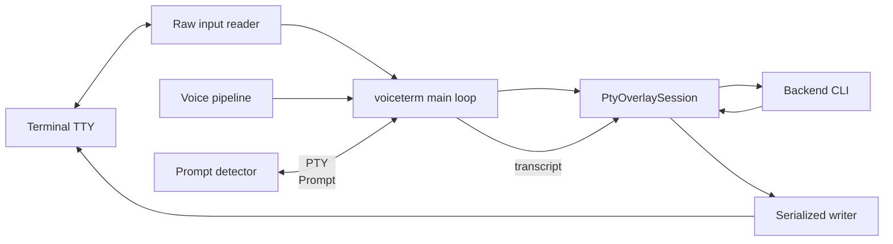

### What this means

- The **terminal is the frontend** -- the overlay does not replace the backend's UI.
- The overlay **injects transcripts** into the PTY as if the user typed them.
- The **status line** is drawn at the bottom of the screen using ANSI cursor-save/restore sequences.

## Components

| Component | Path | Purpose |
|-----------|------|---------|
| Rust Overlay | `rust/src/bin/voiceterm/main.rs` | PTY passthrough UI with voice overlay |
| Voice Pipeline | `rust/src/voice.rs` | Audio capture orchestration + STT |
| PTY Session | `rust/src/pty_session/` | Raw PTY passthrough and prompt-safe output |
| IPC Mode | `rust/src/ipc/` | JSON IPC integration mode |
| Auth Helpers | `rust/src/auth.rs` | Backend authentication helpers |
| Diagnostics | `rust/src/doctor.rs` | `--doctor` environment report |
| Terminal Restore | `rust/src/terminal_restore.rs` | Panic-safe terminal cleanup |
| Telemetry | `rust/src/telemetry.rs` | Structured trace logging |
| Python fallback | `scripts/python_fallback.py` | Optional fallback STT pipeline |

## Threads and Channels

VoiceTerm uses several dedicated threads so that audio work, user input, and
terminal output never block each other.

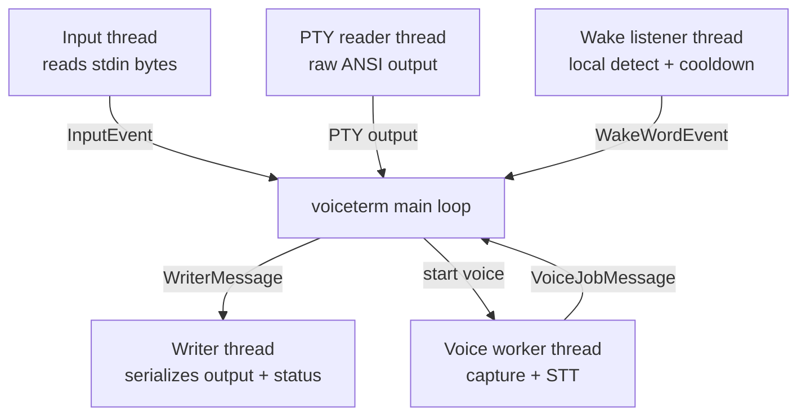

### Why each thread exists

- **Input thread** -- intercepts overlay hotkeys (voice, send mode, theme picker, help, sensitivity, exit) without blocking the backend CLI.
- **PTY reader** -- keeps ANSI output intact while replying to terminal queries (DSR/DA).
- **Writer thread** -- prevents output and status/help overlay from interleaving on screen.
- **Voice thread** -- keeps audio capture and Whisper transcription off the main loop.
- **Wake listener thread** -- runs local hotword detection behind an opt-in toggle and sends bounded wake events that reuse the main capture pipeline.

## Startup Sequence

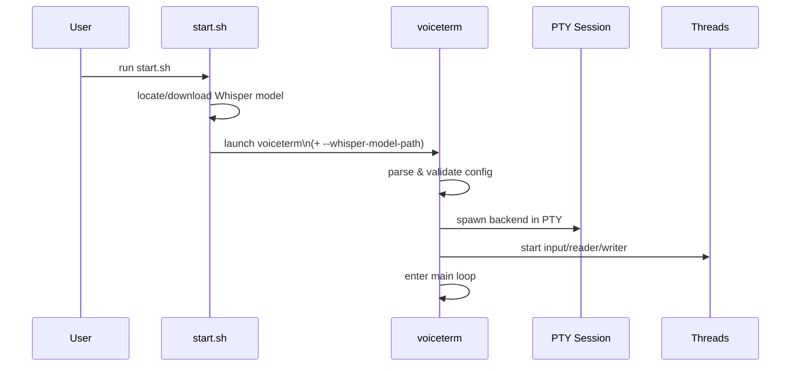

## Core Flows

### 1) Keyboard -> Backend -> Terminal

User keystrokes travel through the input thread, into the PTY, and back out
to the terminal as raw ANSI output.

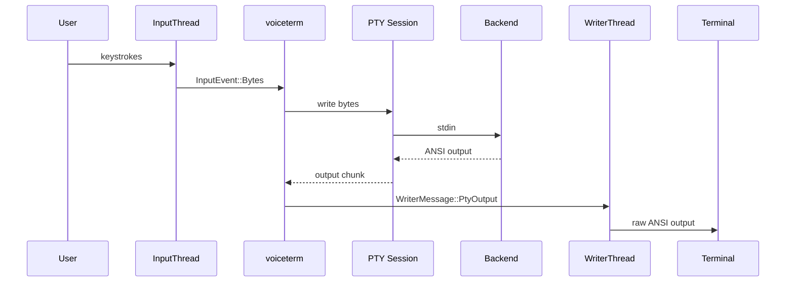

### 2) Voice -> Whisper -> Transcript -> Backend

Voice capture converts speech to text and injects the transcript into the PTY
as if the user typed it.

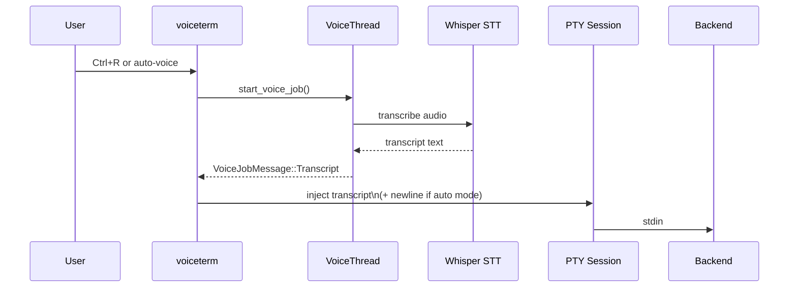

### 3) Auto-Voice (Prompt Detection)

When **auto-voice** is enabled, the overlay watches PTY output for a prompt
and starts recording automatically.

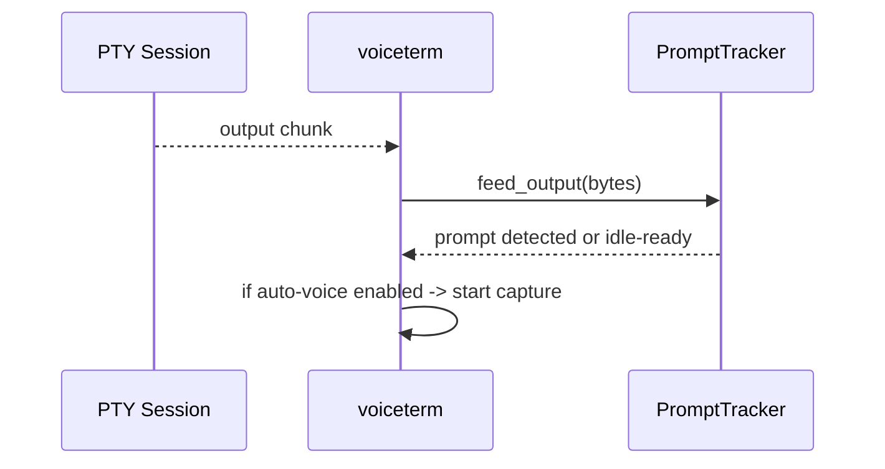

### 4) Transcript Queue + Send Modes

When the CLI is busy (output streaming), transcripts are queued and sent once
the next prompt appears or the transcript idle timer fires. **Send mode**
controls whether a newline is added automatically.

- Before queue/send, transcripts pass through project **voice-macro expansion** from `.voiceterm/macros.yaml` (if present).
- A runtime **Macros** toggle in Settings gates that transform:
  - `ON` -- macro expansion enabled.
  - `OFF` -- raw transcript injection (no macro rewrite).
- **Auto send** -- inject transcript + newline immediately when safe to send.
- **Insert** -- inject transcript only (no newline); user presses Enter to send.
- **Enter while recording (insert mode)** -- stops capture early and transcribes what was recorded.

## Operational Workflows (Dev/CI/Release)

This section documents engineering workflows that keep runtime behavior and
release quality stable.
When workflow mechanics change (dev loop, CI lanes, release flow), update this
section in the same change.

### 1) Local Feature Workflow

1. Link work in `dev/active/MASTER_PLAN.md`.
2. Implement code + tests in one change.
3. Run local verification (`python3 dev/scripts/devctl.py check --profile ci` minimum).
4. For latency-sensitive work, also run `./dev/scripts/tests/measure_latency.sh --ci-guard`.
5. For wake-word runtime/matching changes, run `bash dev/scripts/tests/wake_word_guard.sh`.
6. Update docs (`dev/CHANGELOG.md` for user-facing changes, plus related guides/dev docs).
7. Run governance hygiene audit (`python3 dev/scripts/devctl.py hygiene`) for archive/ADR/scripts sync.
8. Run docs-integrity guards:
   - `python3 dev/scripts/checks/check_cli_flags_parity.py` -- keeps clap schema and `guides/CLI_FLAGS.md` in sync.
   - `python3 dev/scripts/checks/check_screenshot_integrity.py --stale-days 120` -- checks doc image references and flags stale screenshots.
9. Confirm no accidental root `--*` artifact files before push (`find . -maxdepth 1 -type f -name '--*'`).

For tooling/process/CI governance changes, `python3 dev/scripts/devctl.py docs-check --strict-tooling`
also requires updating `dev/history/ENGINEERING_EVOLUTION.md` in the same change.

Primary command entrypoint: `dev/scripts/devctl.py`.

### 2) CI Workflow Lanes

| Workflow | File | Purpose |
|---|---|---|
| Rust CI | `.github/workflows/rust_ci.yml` | fmt + clippy + workspace tests |
| Voice Mode Guard | `.github/workflows/voice_mode_guard.yml` | macros-toggle and send-mode regression tests |
| Wake Word Guard | `.github/workflows/wake_word_guard.yml` | wake-word regression + soak guardrails (false-positive + matcher-latency checks) |
| Perf Smoke | `.github/workflows/perf_smoke.yml` | validates `voice_metrics\|...` logging contract |
| Latency Guardrails | `.github/workflows/latency_guard.yml` | synthetic latency regression checks (`measure_latency.sh --ci-guard`) |
| Memory Guard | `.github/workflows/memory_guard.yml` | repeated thread/resource cleanup test |
| Mutation Testing | `.github/workflows/mutation-testing.yml` | scheduled sharded mutation testing with aggregated score enforcement |
| Autonomy Controller | `.github/workflows/autonomy_controller.yml` | bounded autonomy-controller orchestration (`devctl autonomy-loop`) with checkpoint packet/queue artifacts, phone-ready status snapshots, and optional guarded PR promote path |
| Autonomy Run | `.github/workflows/autonomy_run.yml` | one-command guarded autonomy swarm pipeline (`devctl autonomy-run`) with scope checks, reviewer lane, governance gates, plan-evidence append, and artifact upload |
| Security Guard | `.github/workflows/security_guard.yml` | RustSec advisory policy gate -- fails on high/critical CVSS, yanked, or unsound crates |
| Parser Fuzz Guard | `.github/workflows/parser_fuzz_guard.yml` | property-fuzz parser/ANSI-OSC boundary regression lane |
| Docs Lint | `.github/workflows/docs_lint.yml` | markdown style/readability checks for key user/developer docs |
| Lint Hardening | `.github/workflows/lint_hardening.yml` | strict maintainer clippy subset via `devctl check --profile maintainer-lint` -- catches redundant clones/closures, risky wrap casts, and dead-code drift |
| Tooling Control Plane | `.github/workflows/tooling_control_plane.yml` | devctl unit tests, shell-script integrity, and docs governance policy lane -- runs `docs-check --strict-tooling`, conditional strict user-facing docs-check, `hygiene`, markdownlint, CLI flag parity, screenshot integrity, and root artifact guard |

### Custom Ralph Loop Architecture

This repo owns a custom Ralph/Wiggum loop implementation.
It is not a direct runtime dependency on code inside `integrations/*`.

Core loop surfaces:

1. `devctl triage-loop` for CodeRabbit backlog remediation loops.
2. `devctl mutation-loop` for mutation score reporting/remediation loops.
3. Policy gates in `dev/config/control_plane_policy.json`.
4. Workflow wrappers in `.github/workflows/coderabbit_ralph_loop.yml` and
   `.github/workflows/mutation_ralph_loop.yml`.

Simple loop flow:

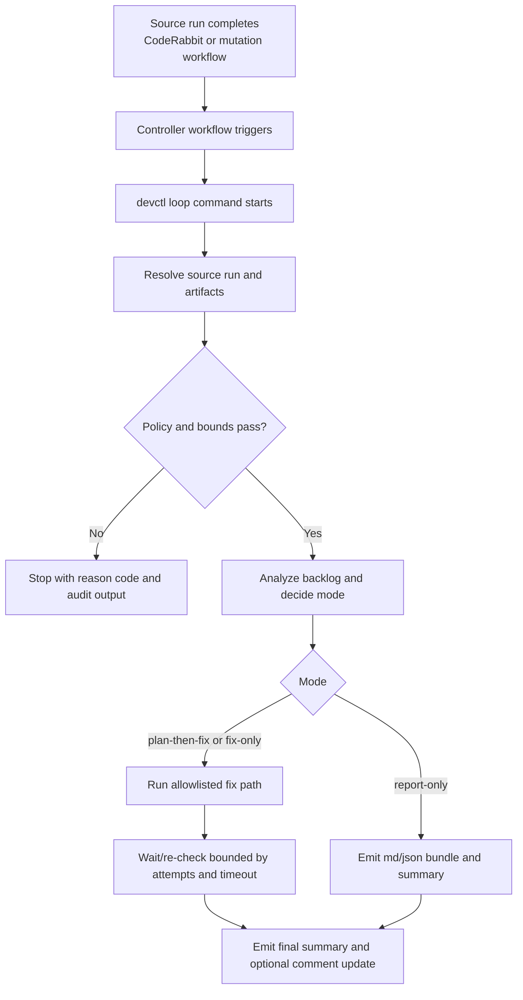

Why this implementation is different from generic community loop examples:

1. Source-run correlation is explicit (`source_run_id` + `source_run_sha`) to
   avoid picking unrelated branch runs.
2. Notify/comment behavior is deterministic (`summary-only` vs
   `summary-and-comment`) with idempotent marker updates.
3. Fix paths are policy-gated and bounded (mode, branch allowlist, attempt caps,
   command-prefix allowlist, reason codes, audit traces).
4. Outputs are structured for downstream control surfaces (packet/queue files,
   phone-safe snapshots, and automation reports).

How your other repos fit:

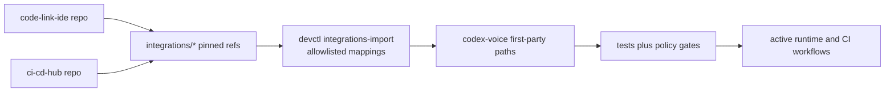

This keeps ownership clear:

1. All repos are yours.
2. Runtime loop behavior is owned and enforced in `codex-voice`.
3. Federated repos provide reusable patterns/components through controlled import.

### Autonomy Swarm Workflow

Use `autonomy-swarm` when the operator wants bounded parallel lanes with one
command and auditable artifacts.

Use `autonomy-run` when the operator wants that swarm flow plus automatic
governance checks and active-plan evidence append in one guarded command.

Execution contract:

1. Adaptive planner selects lane count from metadata (`lines/files`, complexity
   keywords, prompt-token estimate) unless explicit `--agents` is set.
2. Worker fanout runs bounded `autonomy-loop` lanes in parallel.
3. Default reviewer reservation: with execution runs and selected count >1,
   one slot is reserved for `AGENT-REVIEW`.
4. Post-audit digest runs automatically through `autonomy-report`
   (`--no-post-audit` disables; `--no-reviewer-lane` disables reviewer slot).

Guarded pipeline contract (`autonomy-run`):

1. Load active plan scope (`plan-doc`, `INDEX`, `MASTER_PLAN` token checks).
2. Derive the next unchecked plan checklist items into one swarm prompt.
3. Execute `autonomy-swarm` with reviewer lane + post-audit enabled.
4. Run governance checks (`check_active_plan_sync`, `check_multi_agent_sync`,
   `docs-check --strict-tooling`, `orchestrate-status`, `orchestrate-watch`).
5. Append one run entry to plan-doc `Progress Log` + `Audit Evidence`.

Artifact contract:

- Swarm bundle: `dev/reports/autonomy/swarms/<run-label>/summary.{md,json}`
- Per-lane outputs/logs: `dev/reports/autonomy/swarms/<run-label>/AGENT-*/`
- Auto digest: `dev/reports/autonomy/library/<run-label>-digest/summary.{md,json}`
- Guarded run bundle: `dev/reports/autonomy/runs/<run-label>/summary.{md,json}`

This keeps execution and audit evidence coupled by default instead of requiring
two separate operator commands.

### 4) Release Workflow (Master Branch)

1. Finalize release metadata (`rust/Cargo.toml`, `dev/CHANGELOG.md`).
2. Verify release scope -- at minimum run CI-profile checks; use `devctl check --profile release` when wake/soak/mutation gates are required.
3. Create and push release tag/notes via `python3 dev/scripts/devctl.py release --version X.Y.Z`.
4. Publish GitHub release using generated notes (`gh release create vX.Y.Z --title "vX.Y.Z" --notes-file /tmp/voiceterm-release-vX.Y.Z.md`).
5. Publish PyPI package via `python3 dev/scripts/devctl.py pypi --upload`.
6. Verify published PyPI version (`https://pypi.org/pypi/voiceterm/X.Y.Z/json`).
7. Update Homebrew tap via `python3 dev/scripts/devctl.py homebrew --version X.Y.Z`.
8. Sync release snapshot in `dev/active/MASTER_PLAN.md`.

### 5) Security Posture and Risk Controls

- VoiceTerm is **local-first** -- it runs backend CLIs on the same host and does not add hosted control planes.
- Backend child processes inherit the invoking user's OS privileges, so host-level least privilege remains the primary boundary.
- Claude permission prompts are enabled by default; `--claude-skip-permissions` intentionally weakens that guard.
- Use `--claude-skip-permissions` only in isolated/trusted environments (sandbox, container, or throwaway workspace) and avoid untrusted repositories.
- **Supply-chain risk** is gated in CI by `security_guard.yml`, which enforces RustSec policy thresholds with `dev/scripts/checks/check_rustsec_policy.py` and a documented temporary exception list at `dev/security/rustsec_allowlist.md`.

## Overlay State Machine

The voice overlay cycles through four states during a capture:

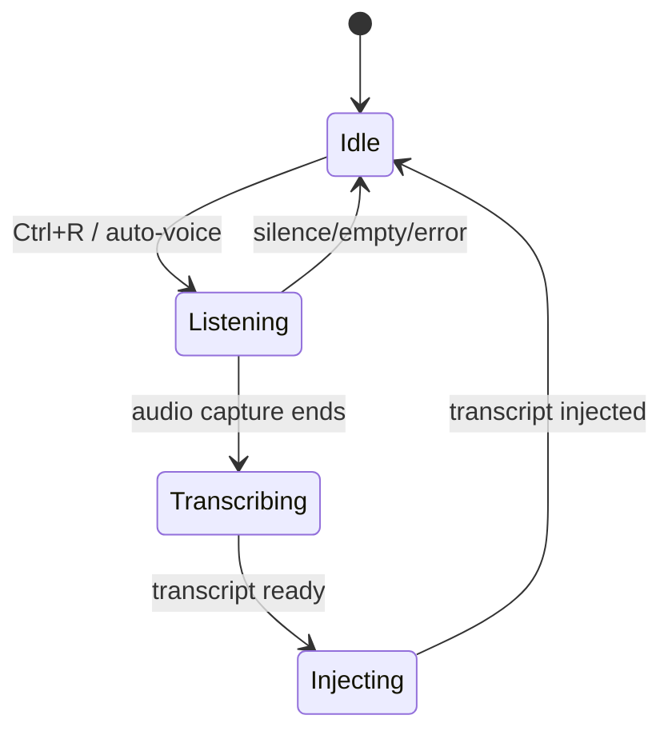

- **Idle** -- waiting for user input or an auto-voice trigger.
- **Listening** -- microphone is recording.
- **Transcribing** -- Whisper is converting audio to text.
- **Injecting** -- transcript is being written into the PTY.

## Whisper Integration (Rust)

### Primary path

`stt::Transcriber` uses **whisper-rs** with a GGML model resolved from
`--whisper-model-path` or auto-discovered from `--whisper-model` (default
`small`) in the repo `whisper_models/` directory.

### Fallback

If native capture is unavailable or fails, VoiceTerm falls back to the Python
pipeline (`scripts/python_fallback.py`) unless `--no-python-fallback` is set.

### Common setup

- `./scripts/setup.sh models --base` downloads `whisper_models/ggml-base.en.bin`.
- `start.sh` passes `--whisper-model-path` into `voiceterm` when a model is found.

## Voice Error and Fallback Flow

This flowchart shows how VoiceTerm decides between native capture and the
Python fallback, and where errors surface.

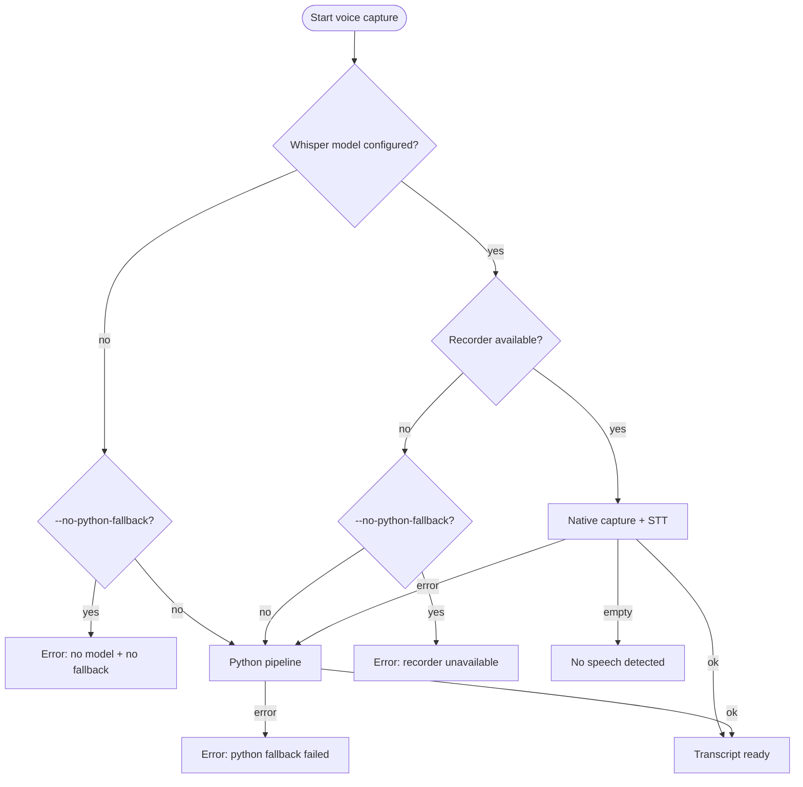

### Fallback requirements

- The Python fallback needs `python3`, `ffmpeg`, and the `whisper` CLI on PATH.
- Use `--no-python-fallback` to force native Whisper and surface errors early.
- When the fallback is active, overlay status/logs show `Python` pipeline context. Recording/state visuals remain mode-first (`AUTO`/`PTT`) in Full HUD.

## Logging and privacy

- **File logs** are opt-in -- enable with `--logs` (add `--log-content` to include prompt/transcript snippets).
- Debug logs **rotate** to avoid unbounded growth.
- **Structured trace logs** (JSON) write to the temp dir when logging is enabled. Override the path with `VOICETERM_TRACE_LOG`.
- **Prompt detection logs** are opt-in via `--prompt-log` or `VOICETERM_PROMPT_LOG` (disabled by `--no-logs`).

## STT behavior (non-streaming)

- Transcription is **non-streaming** -- each capture is fully recorded before Whisper runs.
- There is no chunk overlap. Latency scales with capture length and model size.

## Audio device behavior

- The **input device** is chosen at startup.
- Device hotplug/recovery is not implemented. If the mic disconnects, restart VoiceTerm or pick another device.

## Timing and Latency

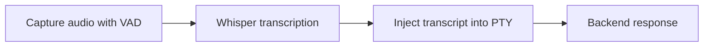

### Timing observability

- Voice capture logs emit: `voice_metrics|capture_ms=...|speech_ms=...|...`
- If `--log-timings` is set, also logs: `timing|phase=voice_capture|record_s=...|stt_s=...|chars=...`

## Safety and External Dependencies

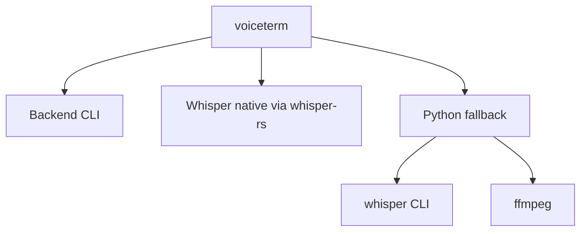

### Safety constraints in code

- **CLI binary paths** are validated (`--codex-cmd`, `--python-cmd`, `--ffmpeg-cmd`, `--whisper-cmd`).
- `--ffmpeg-device` is restricted to block shell metacharacters.
- `--whisper-model-path` must exist and is canonicalized before use.
- The overlay only intercepts control hotkeys. All other bytes go directly to the backend CLI.

## Resource Lifecycle

This diagram shows how VoiceTerm starts up, runs, and shuts down cleanly.

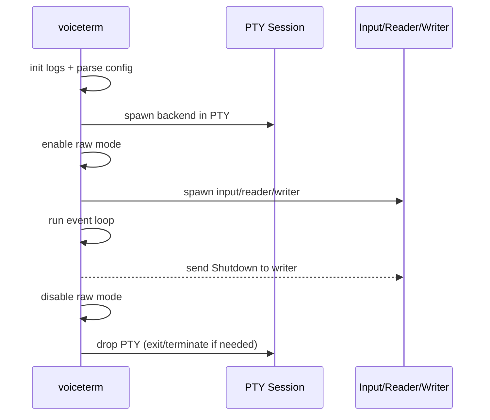

## Prompt Detection (Auto-Voice)

The prompt detector figures out when the backend CLI is waiting for input so
that auto-voice can start recording.

- Strip ANSI escape sequences from PTY output.
- Track the current line and the last completed line.
- If a regex is provided (`--prompt-regex`), match against it.
- Otherwise, **learn** the prompt from the first idle line and match it later.
- Fallback -- if no prompt pattern is known, trigger auto-voice after an idle timeout.

## PTY Handling and Resize

**`PtyOverlaySession`** manages the backend CLI's pseudo-terminal.

### Spawning

- Uses `openpty` to create a PTY pair and forks the backend CLI into the child side.
- The child calls `setsid()`, so the backend runs as a session/process-group leader.

### Terminal queries

- The overlay **replies to terminal queries** (DSR/DA) but leaves all other ANSI output intact.

### Window resize

- On `SIGWINCH`, VoiceTerm calls `ioctl(TIOCSWINSZ)` to update the PTY size and forwards `SIGWINCH` to the PTY process group (with a direct-PID fallback).

### Cleanup on drop

- PTY sessions attempt a graceful `exit`, then send `SIGTERM`/`SIGKILL` to the PTY process group (with a direct-PID fallback), and reap the direct child to prevent orphan/zombie buildup.

### Session-lease reaping

- Before spawning a new PTY, VoiceTerm scans stale **session-lease files** (which store owner PID + backend PID metadata). It reaps only leases whose owner process is gone, so multi-session runtime stays supported while orphaned backends from crashed sessions are cleaned automatically.
- As a secondary fail-safe, the session guard also sweeps detached backend CLIs (`PPID=1`) that are old enough, not tied to active lease files, and no longer share a TTY with any live shell process. This catches stale backend leftovers that escaped lease-based ownership tracking.

## Output Serialization

All terminal output is serialized through one **writer thread** to avoid
interleaving PTY output with the status line or help overlay. The status line
and overlay use ANSI save/restore sequences and redraw only after quiet output
intervals to avoid corrupting the backend's screen.

## Visual System (Overlay)

### Status line modules

- The **enhanced status line** is driven by `StatusLineState` -- it tracks mode, pipeline, sensitivity, message, and duration.
- `StatusLineState` keeps bounded telemetry history buffers (meter + latency) for compact **sparkline** rendering.

### HUD rendering

- **Compact HUD** is context-aware (`recording`, `busy queue`, `idle`) and picks display modules accordingly.
- **Full HUD** uses a conservative writer path (compatible with the `v1.0.53` draw model) and clears stale HUD/overlay rows on resize before redraw to prevent ghost frames in IDE terminals.
- The **startup splash** is automatically skipped in JetBrains IDE terminals (PyCharm/IntelliJ/CLion/WebStorm) to avoid alternate-screen handoff artifacts.

### Themes

- **Theme selection** uses `--theme` with automatic fallback based on terminal color capability and `NO_COLOR`.
- Theme palette resolution is centralized through the runtime **style resolver** (`theme/style_pack.rs`) so all built-in themes flow through one style-pack path.
- Optional style-pack payload override (`VOICETERM_STYLE_PACK_JSON`) is schema-validated and migrated by `theme/style_schema.rs`. Invalid or unsupported payloads fall back to built-in base-theme palettes. Valid overrides can reroute border glyph sets and status-lane indicator families (including processing/responding lanes).
- Settings migration guidance: Theme Studio foundation changes do not alter existing Settings theme/HUD controls or persisted settings keys yet.

### Persistent settings

- Runtime settings are backed by `persistent_config.rs` and stored at `~/.config/voiceterm/config.toml` (override with `VOICETERM_CONFIG_DIR`).
- Explicit CLI flags remain authoritative for each launch.

### Overlay and panel modules

- **Help overlay** -- toggled with `?`, rendered by the writer thread above the status line.
- **Transcript history overlay** -- toggled with `Ctrl+H`, supports type-to-filter search, stores source-tagged entries (`mic`, `you`, `ai`) from PTY input/output streams, and only replays replayable rows (`mic`/`you`) into active PTY input.
- **Session memory logging** (`--session-memory`) -- writes newline-delimited `user`/`assistant` records to markdown for project-local conversation archives.
- **Codex/Claude prompt safety** -- enforced by `prompt/claude_prompt_detect.rs`: interactive approval/permission prompts and reply/composer prompt markers trigger temporary HUD suppression (zero reserved rows) and automatic restore on user response or timeout.
- **Mic meter output** (`--mic-meter`) -- renders a bar display for ambient/speech levels.
- **Session summary** -- prints on exit when activity is present.

## Key Files

### Event loop and main binary

- `rust/src/bin/voiceterm/main.rs` -- main loop, input handling, prompt detection (binary: `voiceterm`)
- `rust/src/bin/voiceterm/event_loop.rs` -- event loop orchestration + select-loop coordination
- `rust/src/bin/voiceterm/event_loop/input_dispatch.rs` -- keyboard/mouse dispatch + settings/hotkey actions
- `rust/src/bin/voiceterm/event_loop/output_dispatch.rs` -- PTY output handling + redraw-safe output routing
- `rust/src/bin/voiceterm/event_loop/overlay_dispatch.rs` -- overlay open/close transitions + overlay mode state updates
- `rust/src/bin/voiceterm/event_loop/periodic_tasks.rs` -- timer-driven tasks (spinner, status expiry, meter cadence)
- `rust/src/bin/voiceterm/event_loop/tests.rs` -- event-loop regression coverage for overlay/input/output behavior
- `rust/src/bin/voiceterm/event_state.rs` -- event loop state, deps, and timers shared by the main loop

### Wake word and startup

- `rust/src/bin/voiceterm/wake_word.rs` -- wake listener runtime ownership, local detector lifecycle, and wake event channel wiring
- `rust/src/bin/voiceterm/banner.rs` -- startup splash + banner configuration
- `rust/src/bin/voiceterm/terminal.rs` -- terminal sizing, modes, and signal handling
- `rust/src/bin/voiceterm/arrow_keys.rs` -- arrow key normalization helpers

### Writer and output

- `rust/src/bin/voiceterm/writer/` -- serialized output, status line, help overlay
- `rust/src/bin/voiceterm/writer/state.rs` -- writer state + message handling
- `rust/src/bin/voiceterm/writer/render.rs` -- status/overlay rendering + clear helpers
- `rust/src/bin/voiceterm/writer/mouse.rs` -- mouse enable/disable output
- `rust/src/bin/voiceterm/writer/sanitize.rs` -- status text sanitization + truncation

### Status line

- `rust/src/bin/voiceterm/status_line/` -- status line layout + formatting modules
- `rust/src/bin/voiceterm/status_line/format.rs` -- status banner/line formatting
- `rust/src/bin/voiceterm/status_line/buttons.rs` -- button layout + click positions
- `rust/src/bin/voiceterm/status_line/layout.rs` -- breakpoints + banner height
- `rust/src/bin/voiceterm/status_line/animation.rs` -- status animation helpers
- `rust/src/bin/voiceterm/status_line/state.rs` -- status line state enums + structs
- `rust/src/bin/voiceterm/status_line/text.rs` -- display width + truncation helpers
- `rust/src/bin/voiceterm/status_style.rs` -- status message categorization + styling

### HUD and visuals

- `rust/src/bin/voiceterm/hud/` -- HUD modules (ribbon/dots/heartbeat/meter/latency)
- `rust/src/bin/voiceterm/icons.rs` -- status line icons/glyphs
- `rust/src/bin/voiceterm/color_mode.rs` -- color mode detection + overrides

### Theme system

- `rust/src/bin/voiceterm/theme/` -- color palettes and theme selection
- `rust/src/bin/voiceterm/theme/style_pack.rs` -- runtime style-pack resolution + fallback policy
- `rust/src/bin/voiceterm/theme/style_schema.rs` -- versioned style-pack schema parse/migration helpers
- `rust/src/bin/voiceterm/theme/capability_matrix.rs` -- framework capability matrix + parity helpers
- `rust/src/bin/voiceterm/theme/texture_profile.rs` -- terminal texture tier detection + fallback policy
- `rust/src/bin/voiceterm/theme/dependency_baseline.rs` -- ecosystem dependency pin/compat baseline
- `rust/src/bin/voiceterm/theme/widget_pack.rs` -- curated widget-pack registry + maturity gates
- `rust/src/bin/voiceterm/theme/rule_profile.rs` -- conditional style-rule profile engine + deterministic merge
- `rust/src/bin/voiceterm/theme_ops.rs` -- theme picker selection + theme cycling helpers
- `rust/src/bin/voiceterm/theme_picker.rs` -- interactive theme picker overlay

### Overlays and panels

- `rust/src/bin/voiceterm/help.rs` -- shortcut help overlay rendering
- `rust/src/bin/voiceterm/overlays.rs` -- overlay rendering helpers
- `rust/src/bin/voiceterm/transcript_history.rs` -- transcript history model + searchable overlay renderer
- `rust/src/bin/voiceterm/session_memory.rs` -- opt-in markdown conversation memory logger
- `rust/src/bin/voiceterm/persistent_config.rs` -- persistent runtime settings load/apply/save flow
- `rust/src/bin/voiceterm/toast.rs` -- toast center model + history overlay formatter

### Prompt detection

- `rust/src/bin/voiceterm/prompt/` -- prompt detection + logging modules
- `rust/src/bin/voiceterm/prompt/claude_prompt_detect.rs` -- Codex/Claude interactive prompt detection + HUD suppression policy
- `rust/src/bin/voiceterm/prompt/tracker.rs` -- prompt tracking + idle detection
- `rust/src/bin/voiceterm/prompt/regex.rs` -- prompt regex resolution
- `rust/src/bin/voiceterm/prompt/logger.rs` -- prompt log writer + rotation
- `rust/src/bin/voiceterm/prompt/strip.rs` -- ANSI stripping for prompt matching

### Voice capture

- `rust/src/bin/voiceterm/voice_control/` -- voice capture manager + drain logic
- `rust/src/bin/voiceterm/voice_control/manager.rs` -- voice capture lifecycle + start helpers
- `rust/src/bin/voiceterm/voice_control/drain.rs` -- voice-drain orchestration + message fanout
- `rust/src/bin/voiceterm/voice_control/drain/transcript_delivery.rs` -- transcript transform/queue/send flow
- `rust/src/bin/voiceterm/voice_control/drain/message_processing.rs` -- status updates, latency display, and preview lifecycle
- `rust/src/bin/voiceterm/voice_control/drain/auto_rearm.rs` -- auto-voice rearm/finalize behavior after drain outcomes
- `rust/src/bin/voiceterm/voice_control/drain/tests.rs` -- drain-path regression coverage
- `rust/src/bin/voiceterm/voice_control/pipeline.rs` -- pipeline selection helpers
- `rust/src/bin/voiceterm/voice_macros.rs` -- project macro loader + transcript trigger expansion

### Transcript and session

- `rust/src/bin/voiceterm/transcript/` -- transcript queue + delivery helpers
- `rust/src/bin/voiceterm/session_stats.rs` -- session counters + summary output
- `rust/src/bin/voiceterm/cli_utils.rs` -- CLI helper utilities

### Input handling

- `rust/src/bin/voiceterm/input/` -- input parsing + event mapping
- `rust/src/bin/voiceterm/input/event.rs` -- input event enum
- `rust/src/bin/voiceterm/input/parser.rs` -- input parser + CSI handling
- `rust/src/bin/voiceterm/input/mouse.rs` -- SGR mouse parsing
- `rust/src/bin/voiceterm/input/spawn.rs` -- input thread loop

### Configuration

- `rust/src/bin/voiceterm/config/` -- overlay CLI config + backend resolution
- `rust/src/bin/voiceterm/config/cli.rs` -- overlay CLI flags + enums
- `rust/src/bin/voiceterm/config/backend.rs` -- backend resolution + prompt patterns
- `rust/src/bin/voiceterm/config/theme.rs` -- theme/color-mode resolution
- `rust/src/bin/voiceterm/config/util.rs` -- backend command helpers

### Settings and buttons

- `rust/src/bin/voiceterm/settings_handlers.rs` -- settings actions + toggles
- `rust/src/bin/voiceterm/settings/` -- settings overlay layout + menu state
- `rust/src/bin/voiceterm/buttons.rs` -- HUD button layout + registry
- `rust/src/bin/voiceterm/button_handlers.rs` -- HUD button registry + action handling
- `rust/src/bin/voiceterm/audio_meter/` -- mic meter visuals (`--mic-meter`)

### Shared library modules

- `rust/src/backend/` -- provider registry + backend presets (Codex/Claude/Gemini/etc.)
- `rust/src/codex/` -- Codex CLI runtime (CodexJobRunner + CodexCliBackend)
- `rust/src/legacy_tui/` -- Codex-specific TUI state + logging (legacy path)
- `rust/src/legacy_ui.rs` -- Codex-specific TUI renderer (legacy path)
- `rust/src/pty_session/` -- raw PTY passthrough + query replies
- `rust/src/voice.rs` -- voice capture job orchestration
- `rust/src/audio/` -- CPAL recorder + VAD
- `rust/src/stt.rs` -- Whisper transcription
- `rust/src/config/` -- CLI flags + validation
- `rust/src/ipc/` -- JSON IPC mode + protocol/router entrypoints
- `rust/src/ipc/session.rs` -- IPC loop orchestration + command dispatch
- `rust/src/ipc/session/loop_runtime.rs` -- command dispatch + active-job draining helpers for the IPC loop
- `rust/src/ipc/session/event_processing/` -- non-blocking Codex/Claude/voice/auth event processors
- `rust/src/auth.rs` -- backend auth helpers
- `rust/src/doctor.rs` -- diagnostics report
- `rust/src/telemetry.rs` -- tracing/JSON logs
- `rust/src/terminal_restore.rs` -- terminal restore guard

## Other Binaries

- `rust/src/bin/voice_benchmark.rs` -- voice pipeline benchmark harness
- `rust/src/bin/latency_measurement.rs` -- latency measurement tool
- `rust/src/bin/test_crash.rs` -- crash logger test binary
- `rust/src/bin/test_utf8_bug.rs` -- UTF-8 regression test binary

## Cargo Features

- `high-quality-audio` (default) -- enables high-quality resampling via `rubato`
- `vad_earshot` (default) -- enables the Earshot VAD backend
- `mutants` -- test-only hooks for mutation testing

## Config Knobs

Full CLI reference: `guides/CLI_FLAGS.md`.

### Overlay Flags

| Flag | Purpose |
|------|---------|
| `--backend <NAME\|CMD>` | Backend preset or custom command string |
| `--codex` | Shorthand for Codex backend |
| `--claude` | Shorthand for Claude backend |
| `--gemini` | Shorthand for Gemini backend (experimental) |
| `--login` | Run backend login before starting |
| `--prompt-regex` | Override prompt detection pattern |
| `--prompt-log` | Prompt detection log path |
| `--auto-voice` | Start in auto-voice mode |
| `--auto-voice-idle-ms` | Idle timeout before auto-voice triggers |
| `--transcript-idle-ms` | Idle timeout before queued transcripts flush |
| `--voice-send-mode` | `auto` vs `insert` transcript handling |
| `--theme` | Status line theme |
| `--no-color` | Disable color output |
| `--hud-right-panel` | Right-side HUD panel selection |
| `--hud-right-panel-recording-only` | Animate right panel only while recording |
| `--hud-style` | Full/minimal/hidden HUD |
| `--minimal-hud` | Shorthand for minimal HUD |

Project-local config:

- `.voiceterm/macros.yaml` (optional) -- defines transcript trigger expansions before PTY injection.

### Core CLI Flags

| Flag | Purpose |
|------|---------|
| `--codex-cmd` | Codex binary path |
| `--claude-cmd` | Claude binary path |
| `--codex-arg` | Extra args for Codex (repeatable) |
| `--python-cmd` | Python interpreter for fallback scripts |
| `--pipeline-script` | Python fallback pipeline script |
| `--term` | TERM value passed to the backend CLI |
| `--input-device` | Preferred microphone |
| `--list-input-devices` | List microphones and exit |
| `--doctor` | Diagnostics report and exit |
| `--mic-meter` | Run mic calibration |
| `--mic-meter-ambient-ms` | Ambient calibration duration |
| `--mic-meter-speech-ms` | Speech calibration duration |
| `--sounds` | Enable notification sounds |
| `--sound-on-complete` | Beep on transcript completion |
| `--sound-on-error` | Beep on voice capture error |
| `--persistent-codex` | Keep a persistent Codex PTY session |
| `--logs` | Enable debug logging |
| `--no-logs` | Disable logging (overrides `--logs`) |
| `--log-content` | Allow content snippets in logs |
| `--log-timings` | Enable verbose timing logs |
| `--session-memory` | Enable markdown session-memory logging |
| `--session-memory-path` | Override markdown session-memory log path |
| `--claude-skip-permissions` | Skip Claude IPC permission prompts |
| `--whisper-cmd` | Whisper CLI path (python fallback) |
| `--whisper-model` | Whisper model name |
| `--whisper-model-path` | Whisper model file path |
| `--whisper-beam-size` | Beam size (native pipeline) |
| `--whisper-temperature` | Sampling temperature |
| `--ffmpeg-cmd` | FFmpeg binary path |
| `--ffmpeg-device` | FFmpeg input device override |
| `--seconds` | Fallback recording duration |
| `--voice-sample-rate` | Audio sample rate |
| `--voice-max-capture-ms` | Max capture duration |
| `--voice-silence-tail-ms` | Trailing silence to stop capture |
| `--voice-min-speech-ms-before-stt` | Minimum speech before STT |
| `--voice-lookback-ms` | Audio retained before silence stop |
| `--voice-buffer-ms` | Audio buffer budget |
| `--voice-channel-capacity` | Frame channel capacity |
| `--voice-stt-timeout-ms` | STT timeout before fallback |
| `--voice-vad-threshold-db` | VAD sensitivity threshold |
| `--voice-vad-frame-ms` | VAD frame size |
| `--voice-vad-smoothing-frames` | VAD smoothing window |
| `--voice-vad-engine` | VAD implementation |
| `--lang` | Whisper language code |
| `--no-python-fallback` | Disable python STT fallback |
| `--json-ipc` | JSON IPC mode |

### Environment Variables

| Variable | Purpose |
|----------|---------|
| `VOICETERM_CWD` | Run backend CLI in a chosen directory |
| `VOICETERM_MODEL_DIR` | Whisper model storage path (install/start scripts) |
| `VOICETERM_INSTALL_DIR` | Override install location |
| `VOICETERM_NO_STARTUP_BANNER` | Skip startup splash |
| `VOICETERM_PROMPT_REGEX` | Override prompt detection |
| `VOICETERM_PROMPT_LOG` | Prompt detection log path |
| `VOICETERM_LOGS` | Enable logging (same as `--logs`) |
| `VOICETERM_NO_LOGS` | Disable logging |
| `VOICETERM_LOG_CONTENT` | Allow content in logs |
| `VOICETERM_TRACE_LOG` | Structured trace log path |
| `VOICETERM_SESSION_MEMORY_PATH` | Default path for `--session-memory-path` |
| `CLAUDE_CMD` | Override Claude CLI path |
| `VOICETERM_PROVIDER` | IPC default provider |
| `NO_COLOR` | Standard color disable flag |

## Debugging and Logs

- **Logs are opt-in** -- enable with `--logs` (add `--log-content` for prompt/transcript snippets).
- **Debug log** -- `${TMPDIR}/voiceterm_tui.log` (created only when logs are enabled).
- **Trace log (JSON)** -- `${TMPDIR}/voiceterm_trace.jsonl` (override with `VOICETERM_TRACE_LOG`).
- **Prompt detection log** -- only when `--prompt-log` or `VOICETERM_PROMPT_LOG` is set.
- Use `--no-python-fallback` to force native Whisper and surface errors early.
