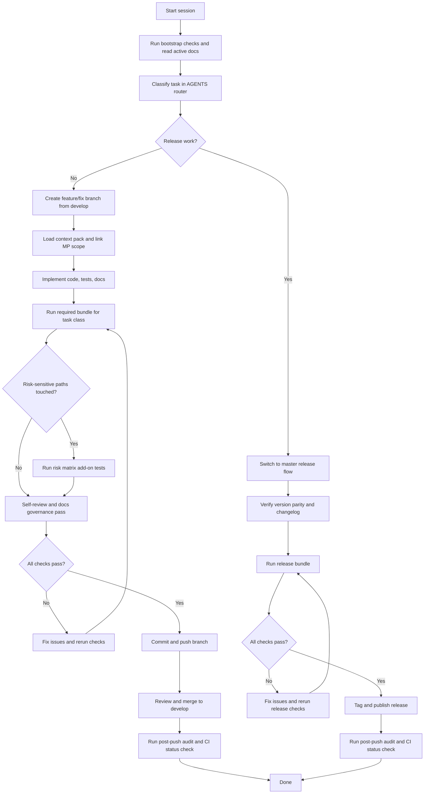
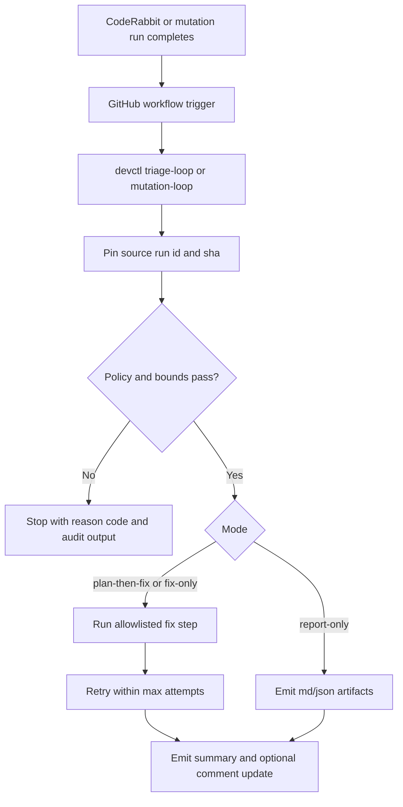
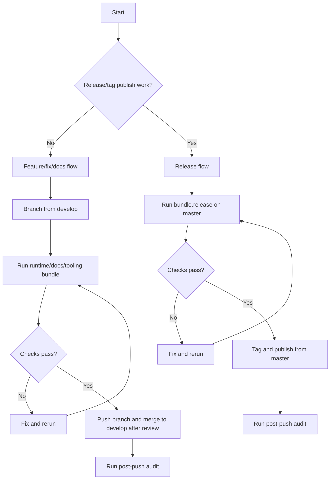

# Development

## Contents

- [Workflow ownership and routing](#workflow-ownership-and-routing)
- [End-to-end lifecycle flow](#end-to-end-lifecycle-flow)
- [What checks protect us](#what-checks-protect-us)
- [Ralph/Wiggum Loop Model](#ralphwiggum-loop-model)
- [When to push where](#when-to-push-where)
- [Project structure](#project-structure)
- [Building](#building)
- [Testing](#testing)
- [Manual QA checklist](#manual-qa-checklist)
- [Contribution workflow](#contribution-workflow)
- [Handoff paper trail template](#handoff-paper-trail-template)
- [Pre-refactor docs readiness checklist](#pre-refactor-docs-readiness-checklist)
- [Screenshot refresh capture matrix](#screenshot-refresh-capture-matrix)
- [Engineering quality review protocol](#engineering-quality-review-protocol)
- [Code style](#code-style)
- [Testing philosophy](#testing-philosophy)
- [CI/CD Workflow](#cicd-workflow)

## Fast Path

Already know the feature area? Use this short loop:

1. Read `AGENTS.md`, then `dev/active/INDEX.md` and `dev/active/MASTER_PLAN.md`.
2. Make your code, test, and doc changes in one scoped commit.
3. Run the bundle that matches your change type (`bundle.runtime`, `bundle.docs`, or `bundle.tooling`).
4. Run any risk-matrix add-ons listed in `AGENTS.md` for the paths you touched.
5. Push to a branch off `develop` (or `master` for releases only).

## Workflow ownership and routing

Each doc owns a specific part of the workflow:

- **`AGENTS.md`** -- which workflow to follow (read this first).
- **`dev/DEVELOPMENT.md`** (this file) -- exact commands and verification steps.
- **`dev/scripts/README.md`** -- tooling and release command reference.
- **`dev/active/INDEX.md`** -- registry of active planning docs and when to read them.
- **`dev/active/MASTER_PLAN.md`** -- source of truth for current work.
- **`dev/active/theme_upgrade.md`** -- Theme + Overlay Studio spec (visual architecture, research, redesign).
- **`dev/active/loop_chat_bridge.md`** -- loop artifact-to-chat suggestion coordination runbook (`MP-338`).
- **`dev/active/MULTI_AGENT_WORKTREE_RUNBOOK.md`** -- parallel worktree orchestration for this cycle.

Start with `AGENTS.md` to pick your task class, then come back here for commands.

## End-to-end lifecycle flow

This chart shows the full loop: start a session, implement, verify, and (optionally) release.



## What checks protect us

Run the checks that match your change type before pushing.
CI runs the same families, so catching issues locally saves round-trips.

### Runtime and UI changes

| You changed... | Run locally | CI workflow |
|---|---|---|
| Rust runtime, UI behavior, or flags | `python3 dev/scripts/devctl.py check --profile ci` | `rust_ci.yml` |
| Perf, latency, wake-word, parser, workers, or security-sensitive code | `python3 dev/scripts/devctl.py check --profile prepush` plus risk-specific tests in `AGENTS.md` | `perf_smoke.yml`, `latency_guard.yml`, `wake_word_guard.yml`, `memory_guard.yml`, `parser_fuzz_guard.yml`, `security_guard.yml` |

### Docs and governance changes

| You changed... | Run locally | CI workflow |
|---|---|---|
| User docs (`README`, `guides/*`, `QUICK_START`) | `python3 dev/scripts/devctl.py docs-check --user-facing` | `tooling_control_plane.yml` (conditional) |
| Tooling/process/CI docs or scripts | `python3 dev/scripts/devctl.py docs-check --strict-tooling` | `tooling_control_plane.yml` |
| CodeRabbit review integration and backlog routing | `python3 dev/scripts/devctl.py triage --no-cihub --external-issues-file .cihub/coderabbit/priority.json --format md` | `coderabbit_triage.yml` |
| CodeRabbit medium/high backlog auto-remediation loop | `python3 dev/scripts/devctl.py triage-loop --repo owner/repo --branch develop --mode plan-then-fix --max-attempts 3 --source-event workflow_dispatch --notify summary-and-comment --comment-target auto --format md` | `coderabbit_ralph_loop.yml` |
| Mutation score remediation loop (report-only default) | `python3 dev/scripts/devctl.py mutation-loop --repo owner/repo --branch develop --mode report-only --threshold 0.80 --max-attempts 3 --format md` | `mutation_ralph_loop.yml` |
| Autonomous controller loop (bounded rounds/hours/tasks + queue packets + phone status snapshots) | `python3 dev/scripts/devctl.py autonomy-loop --repo owner/repo --plan-id acp-poc-001 --branch-base develop --mode report-only --max-rounds 6 --max-hours 4 --max-tasks 24 --checkpoint-every 1 --format json` | `autonomy_controller.yml` |
| Guarded plan-scoped swarm pipeline (scope load + swarm + reviewer + governance + plan evidence append) | `python3 dev/scripts/devctl.py autonomy-run --plan-doc dev/active/autonomous_control_plane.md --mp-scope MP-338 --mode report-only --run-label ops-guarded --format md` | `tooling_control_plane.yml` (governance/docs checks) |
| Human-readable autonomy digest bundle (dated md/json + charts) | `python3 dev/scripts/devctl.py autonomy-report --source-root dev/reports/autonomy --library-root dev/reports/autonomy/library --run-label daily-ops --format md` | `tooling_control_plane.yml` |
| Adaptive multi-agent autonomy planner/executor (Claude/Codex worker sizing up to 20 lanes) | `python3 dev/scripts/devctl.py autonomy-swarm --question-file dev/active/autonomous_control_plane.md --adaptive --min-agents 4 --max-agents 20 --plan-only --format md` | `tooling_control_plane.yml` (governance/docs checks) |
| Live swarm execution with reserved reviewer lane + automatic audit digest | `python3 dev/scripts/devctl.py autonomy-swarm --agents 10 --question-file dev/active/autonomous_control_plane.md --mode report-only --run-label ops-live --format md` | `tooling_control_plane.yml` (governance/docs checks) |
| Loop output to chat suggestion handoff | `python3 dev/scripts/devctl.py triage-loop --repo owner/repo --branch develop --mode report-only --source-event workflow_dispatch --notify summary-only --emit-bundle --format md` + update `dev/active/loop_chat_bridge.md` | `tooling_control_plane.yml` (docs/governance contract checks) |
| Federated repo links/import workflow (your other repos) | `python3 dev/scripts/devctl.py integrations-sync --status-only --format md` and `python3 dev/scripts/devctl.py integrations-import --list-profiles --format md` | `tooling_control_plane.yml` |
| Agent/process contracts | `python3 dev/scripts/checks/check_agents_contract.py` | `tooling_control_plane.yml` |
| Active plan/index/spec sync | `python3 dev/scripts/checks/check_active_plan_sync.py` | `tooling_control_plane.yml` |

## Ralph/Wiggum Loop Model

`codex-voice` runs a custom Ralph/Wiggum implementation through `devctl`
commands and guarded workflows.

Your other repos (`code-link-ide`, `ci-cd-hub`) are federated sources for
patterns and selective imports, not the runtime loop executor.



What is different about this model:

1. Source-run correlation is explicit to avoid analyzing the wrong run.
2. Comment publishing is idempotent to avoid spam.
3. Fix paths are allowlisted and bounded by policy.
4. Outputs are structured for phone/controller/report surfaces.
5. Shared loop `gh` helpers treat `gh api` endpoints specially and never pass
   `--repo` for API subcommands.

### Release and quality drift checks

| You changed... | Run locally | CI workflow |
|---|---|---|
| Release version fields | `python3 dev/scripts/checks/check_release_version_parity.py` | `tooling_control_plane.yml` |
| CLI docs vs clap schema | `python3 dev/scripts/checks/check_cli_flags_parity.py` | `tooling_control_plane.yml` |
| Screenshot links/staleness | `python3 dev/scripts/checks/check_screenshot_integrity.py --stale-days 120` | `tooling_control_plane.yml` |
| Rust/Python source-file shape drift | `python3 dev/scripts/checks/check_code_shape.py` | `tooling_control_plane.yml` |
| Rust lint-debt growth (`#[allow]`, `unwrap/expect`) | `python3 dev/scripts/checks/check_rust_lint_debt.py` | `tooling_control_plane.yml` |
| Rust best-practices non-regression (`#[allow(reason)]`, `unsafe` docs, `mem::forget`) | `python3 dev/scripts/checks/check_rust_best_practices.py` | `tooling_control_plane.yml` |
| Accidental root argument files | `find . -maxdepth 1 -type f -name '--*'` | `tooling_control_plane.yml` |

## When to push where

### Normal work (features, fixes, docs)

1. Branch from `develop` (`feature/<topic>` or `fix/<topic>`).
2. Run the matching bundle (`bundle.runtime`, `bundle.docs`, or `bundle.tooling`).
3. Fix any failures, then commit and push.
4. Merge to `develop` only after review and green checks.
5. Run `bundle.post-push`.

### Release/tag/publish work

1. Work on `master` only.
2. Run `bundle.release`.
3. Fix failures and rerun until green.
4. Tag and publish from `master`.
5. Run `bundle.post-push` and verify CI status.

Never push feature work directly to `master`.

Visual version:



`AGENTS.md` stays the source of truth for exact bundle contents and branch policy.

## Project structure

```text
voiceterm/
├── .github/
│   ├── CONTRIBUTING.md   # Contribution guidelines
│   ├── SECURITY.md       # Security policy
│   └── workflows/        # CI workflows
├── app/
│   ├── macos/VoiceTerm.app # macOS double-click launcher
│   └── windows/          # Windows launcher (planned placeholder)
├── AGENTS.md             # SDLC policy and release checklist
├── QUICK_START.md        # Fast setup and commands
├── guides/
│   ├── CLI_FLAGS.md        # Full CLI and env reference
│   ├── INSTALL.md          # Install options and PATH notes
│   ├── TROUBLESHOOTING.md  # Common issues and fixes
│   ├── USAGE.md            # Controls and overlay behavior
│   └── WHISPER.md          # Whisper model guidance
├── dev/
│   ├── ARCHITECTURE.md     # Architecture diagrams and data flow
│   ├── CHANGELOG.md        # Release history
│   ├── DEVELOPMENT.md      # Build/test workflow
│   ├── active/             # Active plans and work in progress
│   ├── archive/            # Completed work entries
│   ├── adr/                # Architecture decision records
│   └── scripts/            # Developer scripts
│       ├── release.sh         # Legacy adapter -> devctl release
│       ├── generate-release-notes.sh # Markdown notes from git diff history
│       ├── publish-pypi.sh    # Legacy adapter -> devctl pypi
│       ├── update-homebrew.sh # Legacy adapter -> devctl homebrew (+ tap formula desc sync)
│       ├── check_mutation_score.py # Mutation score helper
│       ├── check_cli_flags_parity.py # clap/docs CLI parity guard
│       ├── check_screenshot_integrity.py # image reference + stale-age guard
│       ├── check_code_shape.py # Rust/Python God-file drift guard
│       ├── check_rust_lint_debt.py # Rust lint-debt non-regression guard
│       ├── check_rust_best_practices.py # Rust best-practices non-regression guard
│       ├── tests/             # Test scripts
│       └── devctl/            # Modular maintainer CLI package internals
│           ├── process_sweep.py # Shared process parser/cleanup helpers
│           ├── security_parser.py # Shared CLI parser wiring for security command
│           ├── commands/check_profile.py # Shared check-profile normalization
│           ├── commands/security.py # Local RustSec + optional workflow scanner gates
│           ├── status_report.py # Shared status/report payload + markdown renderer
│           └── commands/ship_*.py # Ship step helper modules
├── img/                 # Screenshots
├── integrations/        # Pinned federated repo links (code-link-ide, ci-cd-hub)
├── Makefile             # Developer tasks
├── src/                 # Rust overlay + voice pipeline
│   └── src/
│       ├── bin/voiceterm/main.rs # Overlay entry point
│       ├── bin/voiceterm/banner.rs # Startup splash + banner config
│       ├── bin/voiceterm/custom_help.rs # Themed CLI help renderer
│       ├── bin/voiceterm/help.rs # Shortcut overlay rendering
│       ├── bin/voiceterm/onboarding.rs # First-run onboarding state persistence
│       ├── bin/voiceterm/overlay_frame.rs # Shared overlay frame layout helpers
│       ├── bin/voiceterm/status_messages.rs # Reusable status message builders
│       ├── bin/voiceterm/terminal.rs # Terminal sizing + signal handling
│       ├── bin/voiceterm/event_loop/ # Event-loop dispatch modules + tests
│       ├── bin/voiceterm/audio_meter/ # Mic meter UI (`--mic-meter`)
│       ├── bin/voiceterm/hud/ # HUD modules and right panel visuals
│       ├── bin/voiceterm/status_line/ # Status line layout + formatting
│       ├── bin/voiceterm/settings/ # Settings overlay
│       ├── bin/voiceterm/transcript/ # Transcript queue + delivery
│       ├── bin/voiceterm/voice_control/ # Voice capture lifecycle + drain orchestration
│       ├── bin/voiceterm/voice_control/drain/ # Voice drain helpers + tests
│       ├── bin/voiceterm/input/ # Input parsing + events
│       ├── bin/voiceterm/writer/ # Output writer + overlays
│       ├── bin/voiceterm/theme/ # Theme definitions
│       ├── legacy_tui/   # Codex TUI state + logging (legacy)
│       ├── audio/       # CPAL recording, VAD, resample
│       ├── backend/     # AI CLI backend presets (overlay)
│       ├── codex/       # Codex-specific backend + PTY worker (TUI/IPC)
│       ├── config/      # CLI flags + validation
│       ├── ipc/         # JSON IPC mode + protocol/router/session loop
│       ├── ipc/session/ # IPC non-blocking event processing helpers
│       ├── pty_session/ # PTY wrapper
│       ├── voice.rs     # Voice capture orchestration
│       ├── mic_meter.rs # Ambient/speech level sampler
│       ├── stt.rs       # Whisper transcription
│       ├── auth.rs      # Backend auth helpers
│       ├── doctor.rs    # Diagnostics report
│       ├── telemetry.rs # Structured trace logging
│       ├── terminal_restore.rs # Panic-safe terminal restore
│       └── legacy_ui.rs  # Codex TUI rendering (legacy)
├── scripts/
│   ├── README.md        # Script documentation
│   ├── install.sh       # One-time installer
│   ├── start.sh         # Linux/macOS launcher
│   ├── setup.sh         # Model download and setup
│   └── python_fallback.py # Python fallback pipeline
├── whisper_models/      # Whisper GGML models
└── bin/                 # Install wrapper (created by install.sh)
```

Note: `rust/` is the Rust workspace root and the crate lives under `rust/src/`.
`dev/active/MASTER_PLAN.md` is the canonical execution tracker.

## Building

```bash
# Rust overlay
cd rust && cargo build --release --bin voiceterm

# Rust backend (optional dev binary)
cd rust && cargo build --release
```

## Testing

```bash
# Rust tests
cd rust && cargo test

# Overlay tests
cd rust && cargo test --bin voiceterm

# Perf smoke (voice metrics)
cd rust && cargo test --no-default-features legacy_tui::tests::perf_smoke_emits_voice_metrics -- --nocapture

# Wake-word regression + soak guardrails
bash dev/scripts/tests/wake_word_guard.sh

# Memory guard (thread cleanup)
cd rust && cargo test --no-default-features legacy_tui::tests::memory_guard_backend_threads_drop -- --nocapture

# Security advisory policy (matches security_guard.yml)
python3 dev/scripts/devctl.py security
# Optional strict workflow scan (requires zizmor installed):
python3 dev/scripts/devctl.py security --with-zizmor --require-optional-tools
# Manual fallback:
cargo install cargo-audit --locked
cd rust && (cargo audit --json > ../rustsec-audit.json || true)
python3 ../dev/scripts/checks/check_rustsec_policy.py --input ../rustsec-audit.json --min-cvss 7.0 --fail-on-kind yanked --fail-on-kind unsound --allowlist-file ../dev/security/rustsec_allowlist.md

# Unsafe/FFI governance (for PTY/stt unsafe changes)
# 1) update invariants checklist doc:
#    dev/security/unsafe_governance.md
cd rust && cargo test pty_session::tests::pty_cli_session_drop_terminates_descendants_in_process_group -- --nocapture
cd rust && cargo test pty_session::tests::pty_overlay_session_drop_terminates_descendants_in_process_group -- --nocapture
cd rust && cargo test stt::tests::transcriber_restores_stderr_after_failed_model_load -- --nocapture

# Parser/ANSI boundary property-fuzz coverage
cd rust && cargo test pty_session::tests::prop_find_csi_sequence_respects_bounds -- --nocapture
cd rust && cargo test pty_session::tests::prop_find_osc_terminator_respects_bounds -- --nocapture
cd rust && cargo test pty_session::tests::prop_split_incomplete_escape_preserves_original_bytes -- --nocapture

# Mutation tests (single run; CI enforces 80% minimum score)
cd rust && cargo mutants --timeout 300 -o mutants.out --json
python3 ../dev/scripts/checks/check_mutation_score.py --glob "mutants.out/**/outcomes.json" --threshold 0.80 --max-age-hours 72

# Mutation tests (sharded, mirrors CI approach)
cd rust && cargo mutants --baseline skip --timeout 180 --shard 1/8 -o mutants.out --json
python3 ../dev/scripts/checks/check_mutation_score.py --glob "mutants.out/**/outcomes.json" --threshold 0.80 --max-age-hours 72

# Historical CI shard artifacts are useful for hotspot triage only.
# Final release gating must use a fresh full-shard aggregate for the current SHA.

# Mutation tests (offline/sandboxed; use a writable cache)
rsync -a ~/.cargo/ /tmp/cargo-home/
cd rust && CARGO_HOME=/tmp/cargo-home CARGO_TARGET_DIR=/tmp/cargo-target CARGO_NET_OFFLINE=true cargo mutants --timeout 300 -o mutants.out --json
python3 ../dev/scripts/checks/check_mutation_score.py --glob "mutants.out/**/outcomes.json" --threshold 0.80 --max-age-hours 72

# Mutation helper script (module filter + offline env)
python3 ../dev/scripts/mutants.py --module overlay --offline --cargo-home /tmp/cargo-home --cargo-target-dir /tmp/cargo-target

# Summarize top paths with survived mutants
python3 ../dev/scripts/mutants.py --results-only --top 10

# Plot hotspots (top 25% by default)
python3 ../dev/scripts/mutants.py --results-only --plot --plot-scope dir --plot-top-pct 25
```

`--results-only` auto-detects the most recent `outcomes.json` under `rust/mutants.out/`.
`check_mutation_score.py` now prints the source path + age and supports
`--max-age-hours` to fail on stale outcomes.
Mutation runs can be long; plan to run them overnight and use Ctrl+C to stop if needed.

## Dev CLI (devctl)

`devctl` is the unified CLI for common developer workflows.

- See `AGENTS.md` for which bundle to run (`bundle.runtime`, `bundle.docs`, `bundle.tooling`, `bundle.release`).
- See this section for exact command syntax.
- See `dev/DEVCTL_AUTOGUIDE.md` for automation-first loop orchestration (`triage-loop`, Ralph mode controls, and proposal artifacts).
- `devctl check` automatically sweeps orphaned and stale test processes before and after each run (stale active threshold: `>=600s`).
- `devctl check` runs independent setup gates (`fmt`, `clippy`, AI guard scripts) and test/build phases in parallel batches by default.

```bash
# Core checks (fmt, clippy, tests, build)
python3 dev/scripts/devctl.py check

# Match CI scope (fmt-check + clippy + tests)
python3 dev/scripts/devctl.py check --profile ci
# Optional: tune or disable parallel check batches
python3 dev/scripts/devctl.py check --profile ci --parallel-workers 2
python3 dev/scripts/devctl.py check --profile ci --no-parallel
# Optional: disable automatic orphaned/stale test-process cleanup sweep
python3 dev/scripts/devctl.py check --profile ci --no-process-sweep-cleanup

# Pre-push scope (CI + perf + mem loop)
python3 dev/scripts/devctl.py check --profile prepush

# Maintainer lint-hardening lane (strict clippy policy subset)
python3 dev/scripts/devctl.py check --profile maintainer-lint

# AI guard lane (code-shape + lint-debt + Rust best-practices guards)
python3 dev/scripts/devctl.py check --profile ai-guard

# Release verification lane (wake guard + mutation score + strict remote CI/CodeRabbit gates)
python3 dev/scripts/devctl.py check --profile release

# Quick scope (fmt-check + clippy only)
python3 dev/scripts/devctl.py check --profile quick

# Mutants wrapper (offline cache)
python3 dev/scripts/devctl.py mutants --module overlay --offline \
  --cargo-home /tmp/cargo-home --cargo-target-dir /tmp/cargo-target

# Mutants wrapper (run one shard)
python3 dev/scripts/devctl.py mutants --module overlay --shard 1/8

# Check mutation score only
python3 dev/scripts/devctl.py mutation-score --threshold 0.80 --max-age-hours 72

# Docs check (user-facing changes must update docs + changelog)
python3 dev/scripts/devctl.py docs-check --user-facing

# Tooling/release docs policy (change-class aware + deprecated-command guard)
python3 dev/scripts/devctl.py docs-check --strict-tooling

# Post-commit docs check over a commit range (works on clean trees)
python3 dev/scripts/devctl.py docs-check --user-facing --since-ref origin/develop

# Governance hygiene audit (archive + ADR + scripts docs + orphaned voiceterm test-process guard)
python3 dev/scripts/devctl.py hygiene
# Optional: remove detected dev/scripts/**/__pycache__ dirs after local test runs
python3 dev/scripts/devctl.py hygiene --fix

# Audit metrics summary + charts (scientific audit-cycle evidence)
python3 dev/scripts/audits/audit_metrics.py \
  --input dev/reports/audits/baseline-events.jsonl \
  --output-md dev/reports/audits/baseline-metrics.md \
  --output-json dev/reports/audits/baseline-metrics.json \
  --chart-dir dev/reports/audits/charts
# devctl now auto-emits one event row per command run (override cycle/source as needed)
DEVCTL_AUDIT_CYCLE_ID=baseline-2026-02-24 DEVCTL_EXECUTION_SOURCE=script_only \
python3 dev/scripts/devctl.py status --ci --format md

# Security guard (RustSec policy + optional workflow scanner)
python3 dev/scripts/devctl.py security
python3 dev/scripts/devctl.py security --with-zizmor --require-optional-tools

# AGENTS + active-plan contract + release parity guards
python3 dev/scripts/checks/check_agents_contract.py
python3 dev/scripts/checks/check_active_plan_sync.py
python3 dev/scripts/checks/check_release_version_parity.py

# CLI schema/docs parity check (clap long flags vs guides/CLI_FLAGS.md)
python3 dev/scripts/checks/check_cli_flags_parity.py

# Screenshot reference integrity + stale-age report
python3 dev/scripts/checks/check_screenshot_integrity.py --stale-days 120

# Source-shape guard (blocks new Rust/Python God-file growth)
python3 dev/scripts/checks/check_code_shape.py

# Rust lint-debt non-regression guard (changed-file growth only)
python3 dev/scripts/checks/check_rust_lint_debt.py

# Rust best-practices non-regression guard (changed-file growth only)
python3 dev/scripts/checks/check_rust_best_practices.py

# Release/distribution control plane
python3 dev/scripts/devctl.py release --version X.Y.Z
# Optional metadata prep (Cargo/PyPI/app plist/changelog)
python3 dev/scripts/devctl.py release --version X.Y.Z --prepare-release
python3 dev/scripts/devctl.py ship --version X.Y.Z --verify --tag --notes --github --yes
# One-command prep + verify + tag + notes + GitHub release
python3 dev/scripts/devctl.py ship --version X.Y.Z --prepare-release --verify --tag --notes --github --yes
CI=1 python3 dev/scripts/checks/check_coderabbit_gate.py --branch master
CI=1 python3 dev/scripts/checks/check_coderabbit_ralph_gate.py --branch master
gh run list --workflow publish_pypi.yml --limit 1
gh run list --workflow publish_homebrew.yml --limit 1
gh workflow run release_preflight.yml -f version=X.Y.Z -f verify_docs=true
gh workflow run publish_homebrew.yml -f version=X.Y.Z -f release_branch=master
gh workflow run coderabbit_ralph_loop.yml -f branch=develop -f max_attempts=3 -f execution_mode=plan-then-fix
gh workflow run mutation_ralph_loop.yml -f branch=develop -f execution_mode=report-only -f threshold=0.80

# Manual fallback (local PyPI/Homebrew publish)
python3 dev/scripts/devctl.py pypi --upload --yes
python3 dev/scripts/devctl.py homebrew --version X.Y.Z
python3 dev/scripts/devctl.py ship --version X.Y.Z --pypi --verify-pypi --homebrew --yes

# Generate a report (JSON/MD)
python3 dev/scripts/devctl.py report --format json --output /tmp/devctl-report.json

# Include recent GitHub Actions runs (requires gh auth)
python3 dev/scripts/devctl.py status --ci --format md

# Bounded CodeRabbit medium/high loop with report/fix artifacts
python3 dev/scripts/devctl.py triage-loop --repo owner/repo --branch develop --mode plan-then-fix --max-attempts 3 --source-event workflow_dispatch --notify summary-and-comment --comment-target auto --emit-bundle --bundle-dir .cihub/coderabbit --bundle-prefix coderabbit-ralph-loop --mp-proposal --format md --output /tmp/coderabbit-ralph-loop.md --json-output /tmp/coderabbit-ralph-loop.json
# Bounded mutation loop with report-only default and policy-gated fix mode
python3 dev/scripts/devctl.py mutation-loop --repo owner/repo --branch develop --mode report-only --threshold 0.80 --max-attempts 3 --emit-bundle --bundle-dir .cihub/mutation --bundle-prefix mutation-ralph-loop --format md --output /tmp/mutation-ralph-loop.md --json-output /tmp/mutation-ralph-loop.json
# Bounded autonomy controller loop with checkpoint packet + queue artifacts
# (also refreshes phone-ready status snapshots under dev/reports/autonomy/queue/phone/)
python3 dev/scripts/devctl.py autonomy-loop --repo owner/repo --plan-id acp-poc-001 --branch-base develop --mode report-only --max-rounds 6 --max-hours 4 --max-tasks 24 --checkpoint-every 1 --loop-max-attempts 1 --packet-out dev/reports/autonomy/packets --queue-out dev/reports/autonomy/queue --format json --output /tmp/autonomy-controller.json
# Human-readable autonomy digest bundle (dated md/json + charts)
python3 dev/scripts/devctl.py autonomy-report --source-root dev/reports/autonomy --library-root dev/reports/autonomy/library --run-label daily-ops --format md --output /tmp/autonomy-report.md --json-output /tmp/autonomy-report.json
# Full guarded plan-scoped swarm path (scope load + swarm + reviewer + governance + plan-evidence append)
python3 dev/scripts/devctl.py autonomy-run --plan-doc dev/active/autonomous_control_plane.md --mp-scope MP-338 --agents 10 --mode report-only --run-label swarm-guarded --format md --output /tmp/autonomy-run.md --json-output /tmp/autonomy-run.json
# Adaptive autonomy swarm (metadata-based sizing + optional token-budget cap)
python3 dev/scripts/devctl.py autonomy-swarm --question "large runtime refactor touching parser/security/workspace" --prompt-tokens 48000 --token-budget 120000 --max-agents 20 --parallel-workers 6 --dry-run --no-post-audit --run-label swarm-plan --format md --output /tmp/autonomy-swarm.md --json-output /tmp/autonomy-swarm.json
# Live swarm defaults (reserves AGENT-REVIEW lane when possible + auto-runs post-audit digest)
python3 dev/scripts/devctl.py autonomy-swarm --agents 10 --question-file dev/active/autonomous_control_plane.md --mode report-only --run-label swarm-live --format md --output /tmp/autonomy-swarm-live.md --json-output /tmp/autonomy-swarm-live.json

# Include guarded Dev Mode JSONL summaries (event counts + latency)
python3 dev/scripts/devctl.py status --dev-logs --format md
python3 dev/scripts/devctl.py report --dev-logs --dev-sessions-limit 10 --format md

# Pipe report output to a CLI that accepts stdin (requires login)
python3 dev/scripts/devctl.py report --format md --pipe-command codex
python3 dev/scripts/devctl.py report --format md --pipe-command claude
# If your CLI needs a stdin flag, pass it via --pipe-args.
```

Implementation layout:

- `dev/scripts/devctl.py`: thin entrypoint wrapper
- `dev/scripts/devctl/cli.py`: argument parsing and dispatch
- `dev/scripts/devctl/commands/`: per-command implementations
- `dev/scripts/devctl/common.py`: shared helpers (run_cmd, env, output)
- `dev/scripts/devctl/collect.py`: git/CI/mutation summaries for reports

Legacy shell scripts in `dev/scripts/*.sh` are compatibility adapters and should not be the canonical maintainer workflow.

## Manual QA checklist

- [ ] Auto-voice status visibility: Full HUD keeps mode label (`AUTO`/`PTT`) while active-state text (`Recording`/`Processing`) and meter remain visible.
- [ ] Queue flush works in both insert and auto send modes.
- [ ] Prompt logging is off by default unless explicitly enabled.
- [ ] Two terminals can run independently without shared state leaks.

## Contribution workflow

- Open or comment on an issue for non-trivial changes so scope and UX expectations are aligned.
- Keep UX tables/controls lists and docs in sync with behavior.
- Update `dev/CHANGELOG.md` for user-facing changes and note verification steps in PRs.

## Handoff paper trail template

For substantive sessions, include this in the PR description or handoff summary:

```md
## Session Handoff

- Scope:
- Code/doc paths touched:

### Verification

- `python3 dev/scripts/devctl.py check --profile ci`
- `python3 dev/scripts/devctl.py docs-check --strict-tooling`
- `python3 dev/scripts/devctl.py hygiene` audits archive/ADR/scripts governance and flags orphaned/stale `target/debug/deps/voiceterm-*` test binaries (`stale` = active for `>=600s`); `--fix` also removes detected `dev/scripts/**/__pycache__` directories.
- `python3 dev/scripts/checks/check_agents_contract.py`
- `python3 dev/scripts/checks/check_active_plan_sync.py`
- `python3 dev/scripts/checks/check_release_version_parity.py`
- `python3 dev/scripts/checks/check_cli_flags_parity.py`
- `python3 dev/scripts/checks/check_screenshot_integrity.py --stale-days 120`
- `python3 dev/scripts/checks/check_code_shape.py`
- `python3 dev/scripts/checks/check_rust_lint_debt.py`
- `python3 dev/scripts/checks/check_rust_best_practices.py`

### Documentation decisions

- `README.md`: updated | no change needed (reason)
- `QUICK_START.md`: updated | no change needed (reason)
- `guides/USAGE.md`: updated | no change needed (reason)
- `guides/CLI_FLAGS.md`: updated | no change needed (reason)
- `guides/INSTALL.md`: updated | no change needed (reason)
- `guides/TROUBLESHOOTING.md`: updated | no change needed (reason)
- `dev/ARCHITECTURE.md`: updated | no change needed (reason)
- `dev/DEVELOPMENT.md`: updated | no change needed (reason)
- `dev/scripts/README.md`: updated | no change needed (reason)
- `dev/history/ENGINEERING_EVOLUTION.md`: updated | no change needed (reason)

### Screenshots

- Refreshed: (list `img/...` files)
- Deferred with reason:

### Follow-ups

- MP items:
- Risks/unknowns:
- Rust references consulted (for non-trivial Rust changes):
```

Root artifact prevention: run `find . -maxdepth 1 -type f -name '--*'` and remove accidental files before push.

## Pre-refactor docs readiness checklist

Use this checklist before larger UI/behavior refactors to avoid documentation drift:

- [ ] `README.md` updated (features list, screenshots, quick overview).
- [ ] `QUICK_START.md` updated (install steps and common commands).
- [ ] `guides/USAGE.md` updated (controls, status messages, theme list).
- [ ] `guides/CLI_FLAGS.md` updated (flags and defaults).
- [ ] `guides/INSTALL.md` updated (dependencies, setup steps, PATH notes).
- [ ] `guides/TROUBLESHOOTING.md` updated (new known issues/fixes).
- [ ] `img/` screenshots refreshed if UI output/controls changed.

## Screenshot refresh capture matrix

Use this matrix whenever UI/overlay behavior changes so screenshot updates are
targeted instead of ad-hoc.

| Surface | Image path | Refresh trigger |
|---|---|---|
| Recording flow | `img/recording.png` | Record/processing/responding lane visuals or controls row changes |
| Settings overlay | `img/settings.png` | Settings rows, footer hints, slider visuals, read-only/lock labels |
| Theme picker | `img/theme-picker.png` | Theme list visuals, lock/dim behavior, picker footer text |
| Hidden HUD | `img/hidden-hud.png` | Hidden launcher text/buttons, collapsed/open behavior, muted styling |
| Transcript history overlay | `img/transcript-history.png` | Search row, selection/replay behavior, footer controls |
| Help overlay | `img/help-overlay.png` | Shortcut grouping, footer controls, docs/troubleshooting links |
| Claude prompt-safe state | `img/claude-prompt-suppression.png` | HUD suppression/resume behavior around Claude approval prompts |

Docs governance guardrails:

- `python3 dev/scripts/checks/check_cli_flags_parity.py` keeps clap long flags and `guides/CLI_FLAGS.md` synchronized.
- `python3 dev/scripts/checks/check_screenshot_integrity.py --stale-days 120` verifies image references and reports stale screenshots.
- `python3 dev/scripts/checks/check_code_shape.py` blocks Rust/Python source-file shape drift (new oversized files, oversized-file growth, and path-level hotspot growth budgets for Phase 3C decomposition targets).
- `python3 dev/scripts/checks/check_rust_lint_debt.py` blocks non-regressive growth of `#[allow(...)]` attributes and non-test `unwrap/expect` call-sites in changed Rust files.
- `python3 dev/scripts/checks/check_rust_best_practices.py` blocks non-regressive growth of reason-less `#[allow(...)]`, undocumented `unsafe { ... }` blocks, public `unsafe fn` surfaces without `# Safety` docs, and `std::mem::forget`/`mem::forget` usage in changed Rust files.
- `python3 dev/scripts/devctl.py docs-check --strict-tooling` now also requires `dev/history/ENGINEERING_EVOLUTION.md` when tooling/process/CI surfaces change and enforces markdown metadata-header normalization (`Status`/`Last updated`/`Owner`).
- `devctl` structured status reports for `check`/`triage` now emit UTC timestamps for deterministic run-correlation across local + CI artifacts.
- `python3 dev/scripts/checks/check_agents_contract.py` validates required `AGENTS.md` SOP sections/bundles/router rows.
- `python3 dev/scripts/checks/check_active_plan_sync.py` validates `dev/active/INDEX.md` registry coverage, tracker authority, active-doc cross-link integrity, and `MP-*` scope parity between index/spec docs and `MASTER_PLAN`.
- `python3 dev/scripts/checks/check_release_version_parity.py` validates Cargo/PyPI/macOS release version parity.
- `find . -maxdepth 1 -type f -name '--*'` catches accidental root-level argument artifact files.

## Engineering quality review protocol

Use this protocol for non-trivial runtime/tooling Rust changes.

1. Validate approach against official Rust references before coding:
   - Rust Book: `https://doc.rust-lang.org/book/`
   - Rust Reference: `https://doc.rust-lang.org/reference/`
   - Rust API Guidelines: `https://rust-lang.github.io/api-guidelines/`
   - Rustonomicon (unsafe/FFI): `https://doc.rust-lang.org/nomicon/`
   - Standard library docs: `https://doc.rust-lang.org/std/`
   - Clippy lint index: `https://rust-lang.github.io/rust-clippy/master/`
2. Keep names stable and behavior-oriented:
   - function and type names should describe behavior, not implementation detail
   - prefer explicit domain terms over ambiguous abbreviations
3. Keep modules cohesive and bounded:
   - split files before they become multi-domain “god files”
   - consolidate duplicated helpers shared by status/theme/settings/overlay paths
4. Make debt visible:
   - avoid adding `#[allow(...)]` without clear rationale and follow-up plan
   - avoid non-test `unwrap/expect` unless failure is provably unrecoverable
5. Capture review evidence in handoff:
   - list which Rust references were consulted
   - note tradeoffs made for naming, API shape, and scalability

## Code style

- Rust: run `cargo fmt` and `cargo clippy --workspace --all-features -- -D warnings`.
- Keep changes small and reviewable; avoid unrelated refactors.
- Prefer explicit error handling in user-facing flows (status line + logs) so failures are observable.

## Testing philosophy

- Favor fast unit tests for parsing, queueing, and prompt detection logic.
- Add regression tests when fixing a reported bug.
- Run at least `cargo test` locally for most changes; add targeted bin tests for overlay-only work.

## CI/CD Workflow

GitHub Actions lanes used by this repo:

| Workflow | File | What it checks |
|----------|------|----------------|
| Rust TUI CI | `.github/workflows/rust_ci.yml` | Build, test, clippy, fmt |
| Voice Mode Guard | `.github/workflows/voice_mode_guard.yml` | Focused macros toggle + send-mode label regressions |
| Wake Word Guard | `.github/workflows/wake_word_guard.yml` | Wake-word regression + soak guardrails |
| Perf Smoke | `.github/workflows/perf_smoke.yml` | Perf smoke test + metrics verification |
| Latency Guard | `.github/workflows/latency_guard.yml` | Synthetic latency regression guardrails |
| Memory Guard | `.github/workflows/memory_guard.yml` | 20x memory guard loop |
| Mutation Testing | `.github/workflows/mutation-testing.yml` | sharded scheduled mutation run + aggregated 80% score gate |
| Mutation Ralph Loop | `.github/workflows/mutation_ralph_loop.yml` | bounded follow-up mutation remediation loop with report-only default, optional policy-gated fix attempts, and artifact/comment outputs |
| Security Guard | `.github/workflows/security_guard.yml` | RustSec advisory policy gate (high/critical threshold + yanked/unsound fail list) |
| Parser Fuzz Guard | `.github/workflows/parser_fuzz_guard.yml` | property-fuzz parser/ANSI-OSC boundary coverage |
| Coverage Upload | `.github/workflows/coverage.yml` | rust coverage via `cargo llvm-cov` + Codecov upload (OIDC) |
| Docs Lint | `.github/workflows/docs_lint.yml` | markdown style/readability checks for key published docs |
| Lint Hardening | `.github/workflows/lint_hardening.yml` | maintainer lint-hardening profile (`devctl check --profile maintainer-lint`) with strict clippy subset for redundant clones/closures, risky wrap casts, and dead-code drift |
| CodeRabbit Triage Bridge | `.github/workflows/coderabbit_triage.yml` | normalizes CodeRabbit review/check signals into triage artifacts and blocks unresolved medium/high findings |
| CodeRabbit Ralph Loop | `.github/workflows/coderabbit_ralph_loop.yml` | branch-scoped always-on (configurable) medium/high backlog loop with mode controls (`report-only`, `plan-then-fix`, `fix-only`) and optional auto-fix command |
| Autonomy Controller | `.github/workflows/autonomy_controller.yml` | bounded controller orchestration (`autonomy-loop`) with checkpoint packet/queue artifacts and optional PR promote step under protected merge flow |
| Autonomy Run | `.github/workflows/autonomy_run.yml` | one-command guarded swarm pipeline (`autonomy-run`) with plan-scope validation, reviewer lane, governance checks, and run artifact upload |
| Tooling Control Plane | `.github/workflows/tooling_control_plane.yml` | devctl unit tests, shell adapter integrity, and docs governance policy (`docs-check --strict-tooling` with Engineering Evolution enforcement, metadata-header normalization guard, conditional strict user-facing docs-check, hygiene, AGENTS contract guard, active-plan sync guard, release-version parity guard, markdownlint, CLI flag parity, screenshot integrity, code-shape guard, rust lint-debt guard, root artifact guard) |
| Release Preflight | `.github/workflows/release_preflight.yml` | manual release-gate workflow (runtime CI + docs/governance bundle + release distribution dry-run smoke for requested version) |
| Publish PyPI | `.github/workflows/publish_pypi.yml` | publishes `voiceterm` to PyPI when a GitHub release is published (requires both CodeRabbit gate and Ralph gate success for release commit) |
| Publish Homebrew | `.github/workflows/publish_homebrew.yml` | updates `homebrew-voiceterm` tap formula when a GitHub release is published or manual dispatch is requested (requires both CodeRabbit gate and Ralph gate success for release commit) |

Workflow hardening baseline:

- Keep all workflow action refs pinned to commit SHAs (`uses: ...@<40-hex>`).
- Keep explicit top-level `permissions:` and `concurrency:` in every workflow.
- Prefer `contents: read` defaults, and elevate to `contents: write` only on jobs
  that must commit/push automation artifacts.

**Before pushing, run locally (recommended):**

```bash
# Core CI (matches rust_ci.yml)
make ci

# Full push/PR suite (adds perf smoke + memory guard loop)
make prepush

# Governance/doc architecture hygiene
python3 dev/scripts/devctl.py hygiene
python3 dev/scripts/devctl.py hygiene --fix
python3 dev/scripts/devctl.py docs-check --strict-tooling
python3 dev/scripts/checks/check_agents_contract.py
python3 dev/scripts/checks/check_active_plan_sync.py
python3 dev/scripts/checks/check_release_version_parity.py
python3 dev/scripts/checks/check_cli_flags_parity.py
python3 dev/scripts/checks/check_screenshot_integrity.py --stale-days 120
python3 dev/scripts/checks/check_code_shape.py
python3 dev/scripts/checks/check_rust_lint_debt.py
python3 dev/scripts/checks/check_rust_best_practices.py
find . -maxdepth 1 -type f -name '--*'

# Security advisory policy gate (matches security_guard.yml)
python3 dev/scripts/devctl.py security
# Optional strict workflow scan (requires zizmor installed):
python3 dev/scripts/devctl.py security --with-zizmor --require-optional-tools
# Manual fallback:
cargo install cargo-audit --locked
cd rust && (cargo audit --json > ../rustsec-audit.json || true)
python3 ../dev/scripts/checks/check_rustsec_policy.py --input ../rustsec-audit.json --min-cvss 7.0 --fail-on-kind yanked --fail-on-kind unsound --allowlist-file ../dev/security/rustsec_allowlist.md

# Parser property-fuzz lane (matches parser_fuzz_guard.yml)
cd rust && cargo test pty_session::tests::prop_find_csi_sequence_respects_bounds -- --nocapture
cd rust && cargo test pty_session::tests::prop_find_osc_terminator_respects_bounds -- --nocapture
cd rust && cargo test pty_session::tests::prop_split_incomplete_escape_preserves_original_bytes -- --nocapture

# Markdown style/readability checks for key docs
markdownlint -c dev/config/markdownlint.yaml -p dev/config/markdownlint.ignore README.md QUICK_START.md DEV_INDEX.md guides/*.md dev/README.md scripts/README.md pypi/README.md app/README.md
```

**Manual equivalents (if you prefer direct cargo commands):**

```bash
cd rust

# Format code
cargo fmt

# Lint (must pass with no warnings)
cargo clippy --workspace --all-features -- -D warnings

# Run tests
cargo test --workspace --all-features

# Check mutation score (optional, CI enforces this)
cargo mutants --timeout 300 -o mutants.out --json
python3 ../dev/scripts/checks/check_mutation_score.py --glob "mutants.out/**/outcomes.json" --threshold 0.80 --max-age-hours 72
```

**Check CI status:** [GitHub Actions](https://github.com/jguida941/voiceterm/actions)

## Releasing

Routing note: use `AGENTS.md` -> `Release SOP (master only)` for required
gating, docs governance, and post-push audit sequencing.

### Version bump

1. Keep version parity across all release surfaces:
   - `rust/Cargo.toml`
   - `pypi/pyproject.toml`
   - `app/macos/VoiceTerm.app/Contents/Info.plist` (`CFBundleShortVersionString`, `CFBundleVersion`)
2. Update `dev/CHANGELOG.md` with release notes for `X.Y.Z`.
3. Verify parity before tagging:

   ```bash
   python3 dev/scripts/checks/check_release_version_parity.py
   rg -n '^version = ' rust/Cargo.toml pypi/pyproject.toml
   plutil -p app/macos/VoiceTerm.app/Contents/Info.plist | rg 'CFBundleShortVersionString|CFBundleVersion'
   ```

4. Commit: `git commit -m "Release vX.Y.Z"`

### Create GitHub release

Preflight auth/deployment prerequisites:

```bash
gh auth status -h github.com
gh secret list | rg PYPI_API_TOKEN
gh secret list | rg HOMEBREW_TAP_TOKEN
```

```bash
# Canonical control plane
python3 dev/scripts/devctl.py release --version X.Y.Z
# Optional: auto-prepare metadata files before release/tag
python3 dev/scripts/devctl.py release --version X.Y.Z --prepare-release
# Optional: workflow-first one-command path
python3 dev/scripts/devctl.py ship --version X.Y.Z --prepare-release --verify --tag --notes --github --yes

# Create release on GitHub
gh release create vX.Y.Z --title "vX.Y.Z" --notes-file /tmp/voiceterm-release-vX.Y.Z.md
```

`devctl release` auto-generates `/tmp/voiceterm-release-vX.Y.Z.md` from the git
compare range (previous tag to current tag). You can also generate it manually:

```bash
python3 dev/scripts/devctl.py release-notes --version X.Y.Z
```

Publishing the GitHub release triggers `.github/workflows/publish_pypi.yml`,
which publishes the matching `voiceterm` version to PyPI, and
`.github/workflows/publish_homebrew.yml`, which updates the Homebrew tap
formula metadata (URL/version/SHA and canonical description text).

### Publish PyPI package

Default path: automatic from GitHub Actions when release is published.

```bash
# Monitor the publish workflow
gh run list --workflow publish_pypi.yml --limit 1
gh run list --workflow publish_homebrew.yml --limit 1
# then watch the latest run:
# gh run watch <run-id>
```

Manual fallback (if workflow is unavailable):

```bash
python3 dev/scripts/devctl.py pypi --upload --yes
```

Verify the published version appears (replace `X.Y.Z`):

```bash
curl -fsSL https://pypi.org/pypi/voiceterm/X.Y.Z/json | rg '"version"'
```

### Update Homebrew tap

```bash
# Local fallback control plane (workflow path is preferred)
python3 dev/scripts/devctl.py homebrew --version X.Y.Z
```

Optional manual workflow trigger:

```bash
gh workflow run publish_homebrew.yml -f version=X.Y.Z -f release_branch=master
gh workflow run coderabbit_ralph_loop.yml -f branch=develop -f max_attempts=3 -f execution_mode=plan-then-fix
```

Legacy wrappers (`dev/scripts/release.sh`, `dev/scripts/publish-pypi.sh`,
`dev/scripts/update-homebrew.sh`) remain for compatibility and route into
`devctl`.

Users can then upgrade:

```bash
brew update && brew upgrade voiceterm
```

See `scripts/README.md` for full script documentation.

## Local development tips

**Test with different backends:**

```bash
voiceterm              # Codex (default)
voiceterm --claude     # Claude Code
voiceterm --gemini     # Gemini CLI (experimental; not fully validated)
```

**Debug logging:**

```bash
voiceterm --logs                    # Enable debug log
tail -f $TMPDIR/voiceterm_tui.log   # Watch log output
tail -f $TMPDIR/voiceterm_trace.jsonl  # Watch structured trace output (JSON)
```
