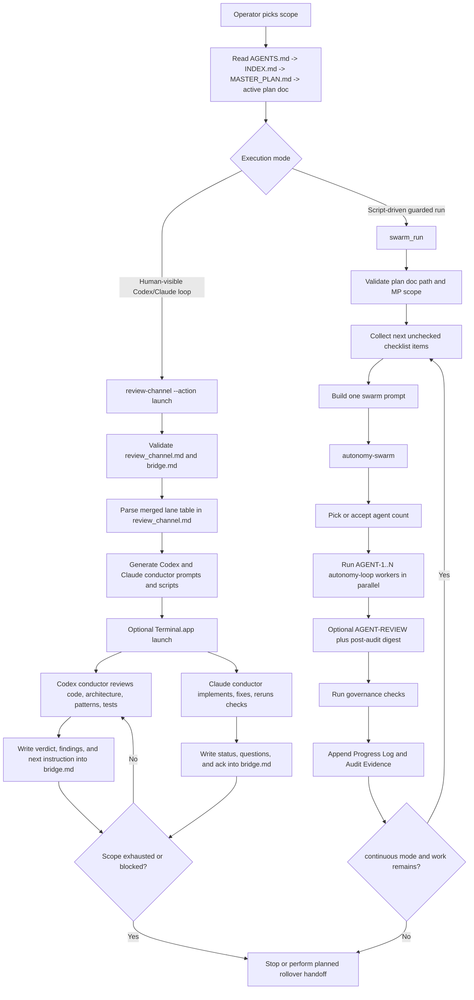
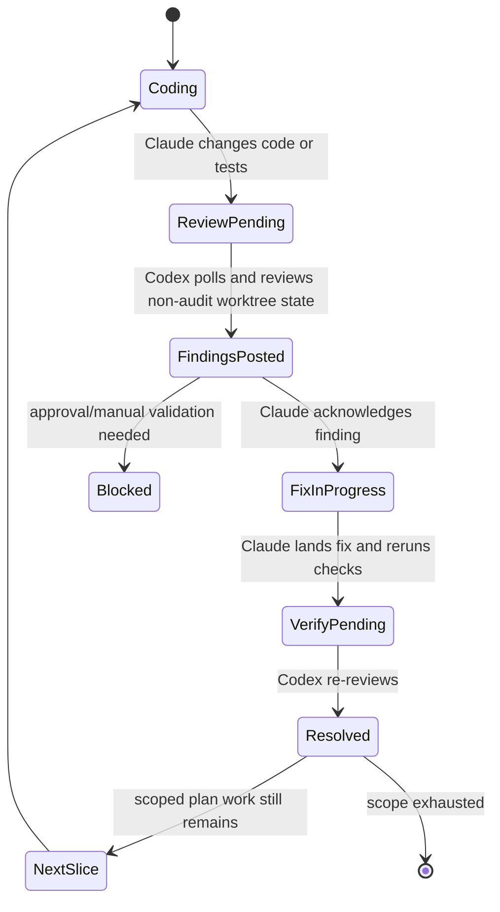
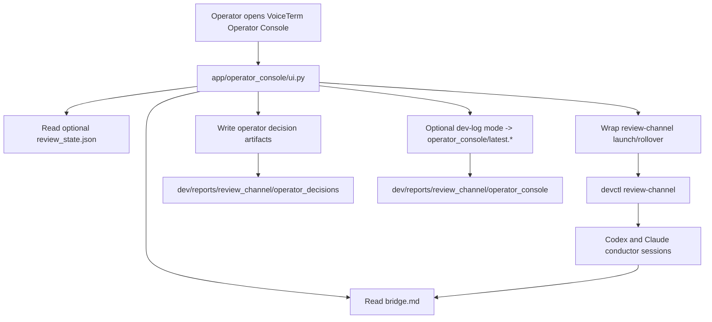
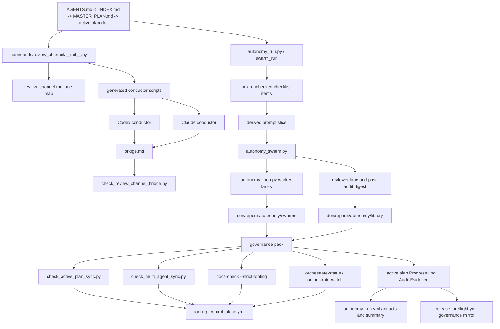

# Codex/Claude Agent Collaboration System

This guide explains the current Python orchestration stack that drives the
VoiceTerm Codex/Claude collaboration system.

It focuses on what exists today in the repo, how the layers fit together, and
where the live state actually lives.

## Short Description

Use this when you want a plain-language description of the system:

> VoiceTerm uses a Python orchestration layer to run a plan-driven
> Codex/Claude agent collaboration system. The live bootstrap path
> (`review-channel`) launches a Codex reviewer conductor and a Claude implementer
> conductor from the active plan, keeps them synchronized through the
> repo-visible `bridge.md` bridge, and lets them iterate until the scoped
> checklist is exhausted or a real blocker appears. The more automated path
> (`swarm_run`) reads the next unchecked plan items, fans out bounded worker
> lanes through `autonomy-swarm` and `autonomy-loop`, runs governance checks,
> and writes proof back into the active plan and report artifacts.

Short version:

> A Python control plane launches Codex to review, Claude to implement, keeps them
> in sync through a tracked bridge file, and can also run the same work through
> guarded swarm-style execution modes with automatic checks and evidence
> capture.

Current-state note:

1. The live coordination path today is the markdown bridge in
   [`../active/review_channel.md`](../active/review_channel.md) plus
   [`../../bridge.md`](../../bridge.md).
2. The structured `review_event` / `review_state` channel is planned, but it
   is not yet the live authority.
3. `autonomy-swarm` and `swarm_run` are execution features inside this system,
   not the name of the whole system.

## Open These Files First

If you want to inspect the system directly, open these in order:

1. [`../../AGENTS.md`](../../AGENTS.md)
2. [`../active/INDEX.md`](../active/INDEX.md)
3. [`../active/MASTER_PLAN.md`](../active/MASTER_PLAN.md)
4. [`../active/review_channel.md`](../active/review_channel.md)
5. [`../../bridge.md`](../../bridge.md)
6. [`../active/continuous_swarm.md`](../active/continuous_swarm.md)
7. [`../scripts/devctl/commands/review_channel/__init__.py`](../scripts/devctl/commands/review_channel/__init__.py)
8. [`../scripts/devctl/commands/autonomy_run.py`](../scripts/devctl/commands/autonomy_run.py)
9. [`../scripts/devctl/commands/autonomy_swarm.py`](../scripts/devctl/commands/autonomy_swarm.py)
10. [`../scripts/devctl/commands/autonomy_loop.py`](../scripts/devctl/commands/autonomy_loop.py)
11. [`../active/operator_console.md`](../active/operator_console.md)
12. [`../../app/operator_console/run.py`](../../app/operator_console/run.py)
13. [`../../app/operator_console/logging_support.py`](../../app/operator_console/logging_support.py)

## The Layers

| Layer | Current authority or command | Purpose |
|---|---|---|
| Scope and policy | [`../../AGENTS.md`](../../AGENTS.md), [`../active/INDEX.md`](../active/INDEX.md), [`../active/MASTER_PLAN.md`](../active/MASTER_PLAN.md) | Decide what the collaboration system is allowed to do and what work is next. |
| Human-visible bootstrap | `python3 dev/scripts/devctl.py review-channel --action launch` | Starts the current Codex and Claude conductor sessions. |
| Live coordination bridge | [`../../bridge.md`](../../bridge.md) | Holds the current reviewer verdict, open findings, next instruction, and Claude ack. |
| Bridge contract guard | `python3 dev/scripts/checks/check_review_channel_bridge.py` | Fails if the live bridge is missing required sections, markers, hash/poll metadata, or ownership rules. |
| Planned rollover handoff | `python3 dev/scripts/devctl.py review-channel --action rollover` | Writes a repo-visible handoff bundle before fresh conductor sessions take over. |
| VoiceTerm Operator Console | `./scripts/operator_console.sh --dev-log` | Opens the thin PyQt6 VoiceTerm Operator Console over the bridge and `review-channel` commands, auto-installs PyQt6 when missing, and can persist diagnostics under the repo-visible report tree. |
| Adaptive worker fanout | `python3 dev/scripts/devctl.py autonomy-swarm ...` | Picks a lane count, runs bounded worker lanes in parallel, and reserves a reviewer lane when possible. |
| Per-lane bounded worker | `python3 dev/scripts/devctl.py autonomy-loop ...` | Executes one bounded automation lane with packet, queue, and status artifacts. |
| Guarded plan runner | `python3 dev/scripts/devctl.py swarm_run ...` | Validates active-plan scope, derives the next plan steps, runs the bounded swarm execution mode, runs governance, and appends evidence to the plan doc. |

## System Flow



## Live Review Loop

This is the current back-and-forth between Codex and Claude while the markdown
bridge is active.



Current bridge rules:

1. Codex is the reviewer conductor.
2. Claude is the coding conductor.
3. The conductors coordinate through `bridge.md`, not hidden memory.
4. Codex must keep polling the non-`bridge.md` worktree while code is
   moving.
5. When one slice is accepted and scoped plan work still remains, Codex must
   promote the next unchecked scoped plan item instead of idling.

## What The Commands Actually Do

### `review-channel`

Current implementation:

1. Reads the active review plan at
   [`../active/review_channel.md`](../active/review_channel.md).
2. Verifies the transitional markdown bridge is still active.
3. Verifies [`../../bridge.md`](../../bridge.md) exists.
4. Parses the 8+8 merged lane table for Codex and Claude.
5. Generates one conductor launch script per provider.
6. Seeds each conductor with the repo bootstrap chain and lane ownership rules.
7. Optionally opens local Terminal.app windows.

The implementation lives in:

1. [`../scripts/devctl/commands/review_channel/__init__.py`](../scripts/devctl/commands/review_channel/__init__.py)
2. [`../scripts/devctl/review_channel/core.py`](../scripts/devctl/review_channel/core.py)
3. [`../scripts/devctl/review_channel/handoff.py`](../scripts/devctl/review_channel/handoff.py)

### `autonomy-swarm`

Current implementation:

1. Reads the question or prompt file.
2. Uses diff size, file count, prompt size, and difficulty keywords to
   recommend an agent count unless `--agents` is explicitly set.
3. Runs bounded `autonomy-loop` workers in parallel.
4. Reserves `AGENT-REVIEW` when reviewer lane plus post-audit are enabled and
   the swarm has more than one lane.
5. Writes one swarm summary bundle under
   [`../reports/autonomy/swarms/`](../reports/autonomy/swarms/).

The implementation lives in:

1. [`../scripts/devctl/commands/autonomy_swarm.py`](../scripts/devctl/commands/autonomy_swarm.py)
2. [`../scripts/devctl/commands/autonomy_swarm_core.py`](../scripts/devctl/commands/autonomy_swarm_core.py)
3. [`../scripts/devctl/autonomy/swarm_helpers.py`](../scripts/devctl/autonomy/swarm_helpers.py)

### `autonomy-loop`

Current implementation:

1. Runs one bounded worker lane.
2. Enforces policy and branch caps.
3. Produces queue packets, phone status, and checkpoint artifacts.
4. Stops on configured round, hour, or task limits.

The implementation lives in:

1. [`../scripts/devctl/commands/autonomy_loop.py`](../scripts/devctl/commands/autonomy_loop.py)
2. [`../scripts/devctl/commands/autonomy_loop_rounds.py`](../scripts/devctl/commands/autonomy_loop_rounds.py)

### `swarm_run`

Current implementation:

1. Verifies the plan doc exists in the active-doc chain.
2. Verifies the requested `MP-*` scope exists in
   [`../active/MASTER_PLAN.md`](../active/MASTER_PLAN.md).
3. Collects the next unchecked checklist items from the plan doc.
4. Builds a single prompt for the next slice.
5. Runs `autonomy-swarm`.
6. Runs governance commands after the swarm completes.
7. Appends a dated entry to the plan doc `Progress Log` and `Audit Evidence`.
8. In `--continuous` mode, repeats until the plan is complete, a cycle fails,
   or the configured cycle limit is reached.

The implementation lives in:

1. [`../scripts/devctl/commands/autonomy_run.py`](../scripts/devctl/commands/autonomy_run.py)
2. [`../scripts/devctl/autonomy/run_helpers.py`](../scripts/devctl/autonomy/run_helpers.py)
3. [`../scripts/devctl/autonomy/run_plan.py`](../scripts/devctl/autonomy/run_plan.py)

## Where The State Lives

If you want to inspect the system while it is running, these are the important
files and directories:

| Path | What it tells you |
|---|---|
| [`../active/MASTER_PLAN.md`](../active/MASTER_PLAN.md) | The canonical queue and active execution state. |
| [`../active/review_channel.md`](../active/review_channel.md) | The lane map, bridge rules, and future review-channel design. |
| [`../active/continuous_swarm.md`](../active/continuous_swarm.md) | The current hardening plan for the continuous Codex/Claude loop. |
| [`../active/operator_console.md`](../active/operator_console.md) | The execution-plan doc for the optional VoiceTerm Operator Console lane. |
| [`../../bridge.md`](../../bridge.md) | The live current-state bridge between Codex and Claude today. |
| [`../reports/review_channel/rollovers/`](../reports/review_channel/rollovers/) | Planned handoff bundles for session rollover. |
| [`../../app/operator_console/`](../../app/operator_console/) | The optional PyQt6 thin-wrapper app over the current review-channel workflow. |
| [`../reports/review_channel/operator_console/`](../reports/review_channel/operator_console/) | Repo-visible Operator Console diagnostics artifacts when `--dev-log` is enabled. |
| [`../reports/autonomy/swarms/`](../reports/autonomy/swarms/) | Per-swarm summary plus per-agent worker artifacts. |
| [`../reports/autonomy/runs/`](../reports/autonomy/runs/) | Guarded `swarm_run` bundles with governance logs. |
| [`../reports/autonomy/library/`](../reports/autonomy/library/) | Post-audit digest bundles and summarized autonomy reports. |

## Optional VoiceTerm Operator Console Layer

The VoiceTerm Operator Console is intentionally non-canonical and thin. It is
a PyQt6 desktop wrapper over repo-visible artifacts and existing repo
commands, not a second runtime.

1. It reads [`../../bridge.md`](../../bridge.md) and optional
   structured `review_state` JSON when present.
2. It wraps `devctl review-channel --action launch` and `--action rollover`
   instead of cloning launcher logic.
3. It writes repo-visible operator decision artifacts and optional diagnostics
   artifacts under `dev/reports/review_channel/`.
4. Rust still owns PTY/runtime/session behavior, and `devctl` still owns
   policy, launcher, and orchestration semantics.
5. The PyQt surface is operator-first: it themes the shared screen for long
   sessions, shows a diagnostics pane in-app, and can persist both high-level
   event logs plus raw launcher output when `--dev-log` is enabled.



## Artifact And State Flow

This chart shows where authority, live coordination, worker artifacts, and CI
evidence move through the system.



## Key Files By Responsibility

Use this map when you need to answer "where does this part of the system live?"
without hunting across the repo.

| Responsibility | Primary file or directory | What it owns |
|---|---|---|
| Repo execution policy | [`../../AGENTS.md`](../../AGENTS.md) | The mandatory SOP, task router, bundles, risk matrix, and branch policy. |
| Active-doc registry | [`../active/INDEX.md`](../active/INDEX.md) | Which active docs exist, their role, and when agents should read them. |
| Global execution tracker | [`../active/MASTER_PLAN.md`](../active/MASTER_PLAN.md) | The authoritative MP scope queue and multi-agent coordination board. |
| Live review-channel contract | [`../active/review_channel.md`](../active/review_channel.md) | The merged Codex/Claude lane table, bridge rules, and planned future channel design. |
| Live reviewer/implementer bridge | [`../../bridge.md`](../../bridge.md) | The current reviewer findings, Claude acknowledgements, and poll/hash metadata. |
| Live launcher | [`../scripts/devctl/commands/review_channel/__init__.py`](../scripts/devctl/commands/review_channel/__init__.py) | Launches or rolls over the current markdown-bridge reviewer/implementer sessions. |
| Operator Console UI | [`../../app/operator_console/ui.py`](../../app/operator_console/ui.py) | Renders the themed read-first shared-screen wrapper and diagnostics pane over bridge state plus `review-channel` commands. |
| Operator Console diagnostics | [`../../app/operator_console/logging_support.py`](../../app/operator_console/logging_support.py) | Persists high-level event logs, structured NDJSON events, and raw command output when `--dev-log` is enabled. |
| Guarded plan runner | [`../scripts/devctl/commands/autonomy_run.py`](../scripts/devctl/commands/autonomy_run.py) | Runs `swarm_run`, validates scope, executes the swarm, and appends plan evidence. |
| Swarm fanout logic | [`../scripts/devctl/commands/autonomy_swarm.py`](../scripts/devctl/commands/autonomy_swarm.py) | Chooses lane count, reserves reviewer lanes, and coordinates worker execution. |
| Bounded worker lane | [`../scripts/devctl/commands/autonomy_loop.py`](../scripts/devctl/commands/autonomy_loop.py) | Enforces max rounds, hours, tasks, and execution mode per worker. |
| Governance bundle authority | [`../scripts/devctl/bundle_registry.py`](../scripts/devctl/bundle_registry.py) | Canonical source for bundle command lists used locally and in CI. |
| `swarm_run` governance pack | [`../scripts/devctl/autonomy/run_helpers.py`](../scripts/devctl/autonomy/run_helpers.py) | Defines the post-swarm checks and orchestrator reporting commands. |
| Plan evidence appender | [`../scripts/devctl/autonomy/run_plan.py`](../scripts/devctl/autonomy/run_plan.py) | Writes `Progress Log` and `Audit Evidence` entries back into the active plan. |
| Collaboration guard scripts | [`../scripts/checks/`](../scripts/checks/) | Enforces bridge, plan, workflow, naming, compat, and Rust quality contracts. |
| CI/CD workflow mirrors | [`../../.github/workflows/`](../../.github/workflows/) | Runs the same policy model in push/PR, manual autonomy, and release lanes. |

## Guardrails

The collaboration system is intentionally not free-form. These checks keep the
system honest:

1. [`../scripts/checks/check_review_channel_bridge.py`](../scripts/checks/check_review_channel_bridge.py)
   keeps the markdown bridge valid while it is the live transport.
2. [`../scripts/checks/check_active_plan_sync.py`](../scripts/checks/check_active_plan_sync.py)
   ensures active docs and [`../active/MASTER_PLAN.md`](../active/MASTER_PLAN.md)
   stay in sync.
3. [`../scripts/checks/check_multi_agent_sync.py`](../scripts/checks/check_multi_agent_sync.py)
   keeps the lane table and merged swarm state aligned.
4. [`../scripts/devctl/commands/docs_check.py`](../scripts/devctl/commands/docs_check.py)
   backs `docs-check --strict-tooling` so docs and process contracts do not drift.
5. [`../scripts/devctl/commands/orchestrate_status.py`](../scripts/devctl/commands/orchestrate_status.py)
   and [`../scripts/devctl/commands/orchestrate_watch.py`](../scripts/devctl/commands/orchestrate_watch.py)
   keep the control plane visible after `swarm_run`.

## Why This Is Not Just "Keep Going Until Green"

The system is not an unconstrained retry loop. It is a guarded collaboration
runtime with explicit authority, state, bounds, and verification.

1. Authority is loaded first from [`../../AGENTS.md`](../../AGENTS.md),
   [`../active/INDEX.md`](../active/INDEX.md), and
   [`../active/MASTER_PLAN.md`](../active/MASTER_PLAN.md).
2. Codex and Claude have separate roles. Codex reviews and Claude implements.
3. Live coordination is stored in tracked repo-visible state, primarily
   [`../../bridge.md`](../../bridge.md), not hidden chat memory.
4. The launch path fails closed when the markdown bridge is inactive.
5. Automated execution is bounded by explicit round, hour, and task caps.
6. Non-report execution modes are policy-gated instead of always-on.
7. Governance checks run after execution and before plan evidence is accepted.
8. CI/CD workflows mirror the same guards instead of letting local automation
   drift from release policy.

## Exact Guard Scripts

These are the core scripts that make the collaboration path strict instead of
generic:

1. [`../scripts/checks/check_review_channel_bridge.py`](../scripts/checks/check_review_channel_bridge.py)
   validates the live markdown bridge contract. It checks required headings in
   [`../../bridge.md`](../../bridge.md), required bootstrap markers,
   tracked-file safety, `Last Codex poll` freshness, local poll formatting, and
   the 64-character non-audit worktree hash.
2. [`../scripts/checks/check_multi_agent_sync.py`](../scripts/checks/check_multi_agent_sync.py)
   validates parity between the Multi-Agent Coordination Board in
   [`../active/MASTER_PLAN.md`](../active/MASTER_PLAN.md) and the lane tables in
   [`../active/review_channel.md`](../active/review_channel.md). It checks
   lane/MP/worktree/branch alignment, instruction and ledger tables, handoff
   token collisions, signer requirements, and end-of-cycle signoff.
3. [`../scripts/checks/check_active_plan_sync.py`](../scripts/checks/check_active_plan_sync.py)
   validates the active-doc registry. It checks tracker authority,
   required rows, `MP-*` scope parity, discovery links, execution-plan
   contract sections, and release snapshot metadata freshness.
4. [`../scripts/checks/check_code_shape.py`](../scripts/checks/check_code_shape.py)
   prevents new Rust/Python God-file growth and stale loose path overrides.
5. [`../scripts/checks/check_workflow_shell_hygiene.py`](../scripts/checks/check_workflow_shell_hygiene.py)
   and [`../scripts/checks/check_workflow_action_pinning.py`](../scripts/checks/check_workflow_action_pinning.py)
   keep workflow implementation quality and action pinning aligned with policy.
6. [`../scripts/checks/check_naming_consistency.py`](../scripts/checks/check_naming_consistency.py),
   [`../scripts/checks/check_compat_matrix.py`](../scripts/checks/check_compat_matrix.py),
   and [`../scripts/checks/compat_matrix_smoke.py`](../scripts/checks/compat_matrix_smoke.py)
   keep naming and compatibility contracts from drifting.
7. [`../scripts/checks/check_rust_test_shape.py`](../scripts/checks/check_rust_test_shape.py),
   [`../scripts/checks/check_rust_lint_debt.py`](../scripts/checks/check_rust_lint_debt.py),
   [`../scripts/checks/check_rust_best_practices.py`](../scripts/checks/check_rust_best_practices.py),
   and [`../scripts/checks/check_rust_runtime_panic_policy.py`](../scripts/checks/check_rust_runtime_panic_policy.py)
   keep runtime quality debt from quietly growing under the collaboration loop.
8. [`../scripts/checks/check_agents_contract.py`](../scripts/checks/check_agents_contract.py)
   validates the process contract in [`../../AGENTS.md`](../../AGENTS.md) so
   the collaboration path cannot quietly drift away from repo policy.
9. [`../scripts/checks/check_bundle_workflow_parity.py`](../scripts/checks/check_bundle_workflow_parity.py)
   keeps the bundle registry, rendered AGENTS bundle sections, and workflow
   enforcement aligned.
10. [`../scripts/checks/check_release_version_parity.py`](../scripts/checks/check_release_version_parity.py)
    keeps version metadata aligned across Rust, PyPI, app metadata, changelog,
    and release-tracker state.

## Exact Command Path

These are the main command surfaces and what they enforce:

1. [`../scripts/devctl/commands/review_channel/__init__.py`](../scripts/devctl/commands/review_channel/__init__.py)
   handles the live conductor bootstrap. `--action launch` verifies the bridge,
   parses the merged Codex/Claude lane table, generates one conductor script per
   provider, and can open local Terminal.app sessions. `--action rollover`
   writes a repo-visible handoff bundle before fresh conductor sessions take
   over.
2. [`../scripts/devctl/commands/autonomy_run.py`](../scripts/devctl/commands/autonomy_run.py)
   handles `swarm_run`. It validates active-plan scope, collects unchecked
   checklist items, derives the prompt, runs the swarm, runs governance, and
   appends `Progress Log` plus `Audit Evidence` entries back into the active
   plan via [`../scripts/devctl/autonomy/run_plan.py`](../scripts/devctl/autonomy/run_plan.py).
3. [`../scripts/devctl/autonomy/run_helpers.py`](../scripts/devctl/autonomy/run_helpers.py)
   defines the governance command pack used by `swarm_run`:
   `check_active_plan_sync.py`, `check_multi_agent_sync.py`,
   `docs-check --strict-tooling`, `orchestrate-status`, and
   `orchestrate-watch`.
4. [`../scripts/devctl/commands/autonomy_swarm.py`](../scripts/devctl/commands/autonomy_swarm.py)
   handles bounded multi-agent fanout. It can auto-size agent count from diff
   size, file count, prompt size, and difficulty keywords through
   [`../scripts/devctl/autonomy/swarm_helpers.py`](../scripts/devctl/autonomy/swarm_helpers.py),
   reserves `AGENT-REVIEW` when applicable, and writes swarm bundles under
   [`../reports/autonomy/swarms/`](../reports/autonomy/swarms/).
5. [`../scripts/devctl/commands/autonomy_loop.py`](../scripts/devctl/commands/autonomy_loop.py)
   handles one bounded worker lane. It enforces branch policy, max rounds, max
   hours, max tasks, and policy-gated execution modes, then writes packet,
   queue, and phone-status artifacts.
6. [`../scripts/devctl/bundle_registry.py`](../scripts/devctl/bundle_registry.py)
   is the canonical command authority for runtime, docs, tooling, release, and
   post-push bundles. The collaboration system is expected to route through the
   same registry-backed guard model as the rest of the repo.

## Execution Sequence

These are the exact high-level sequences a developer should expect from the
current implementation.

### Human-visible review-channel sequence

1. Read [`../../AGENTS.md`](../../AGENTS.md), [`../active/INDEX.md`](../active/INDEX.md),
   [`../active/MASTER_PLAN.md`](../active/MASTER_PLAN.md), and the active
   review spec at [`../active/review_channel.md`](../active/review_channel.md).
2. Run `python3 dev/scripts/devctl.py review-channel --action launch`.
3. [`../scripts/devctl/commands/review_channel/__init__.py`](../scripts/devctl/commands/review_channel/__init__.py)
   calls launcher prerequisites, which refuse to continue if the markdown
   bridge is inactive or required files are missing.
4. The launcher parses the merged lane table, filters Codex vs Claude lanes,
   resolves terminal profile settings, and generates one launch script per
   provider session.
5. The Codex reviewer and Claude implementer sessions start, usually in Terminal.app
   unless `--terminal none` is used for dry-run or inspection mode.
6. Codex reviews the non-audit worktree state and writes findings, verdicts,
   and the next instruction into [`../../bridge.md`](../../bridge.md).
7. Claude implements, reruns checks, and writes status plus acknowledgement
   back into [`../../bridge.md`](../../bridge.md).
8. The loop repeats until the current scoped work is accepted, blocked, or the
   operator triggers a repo-visible rollover handoff.

### Guarded `swarm_run` sequence

1. Read the same authority chain, then resolve the target plan doc and `MP-*`
   scope.
2. Run `python3 dev/scripts/devctl.py swarm_run ...` against that plan doc.
3. [`../scripts/devctl/commands/autonomy_run.py`](../scripts/devctl/commands/autonomy_run.py)
   verifies the plan path exists in the active-doc chain and that the MP scope
   exists in [`../active/MASTER_PLAN.md`](../active/MASTER_PLAN.md).
4. [`../scripts/devctl/autonomy/run_helpers.py`](../scripts/devctl/autonomy/run_helpers.py)
   collects the next unchecked checklist items and derives a prompt slice.
5. `swarm_run` shells into `autonomy-swarm`, which chooses or accepts the lane
   count, reserves `AGENT-REVIEW` when applicable, and starts bounded
   `autonomy-loop` workers.
6. Each worker lane stops at configured max rounds, hours, tasks, or policy
   boundaries and writes run artifacts under
   [`../reports/autonomy/swarms/`](../reports/autonomy/swarms/).
7. After the swarm finishes, `swarm_run` executes the governance pack:
   `check_active_plan_sync.py`, `check_multi_agent_sync.py`,
   `docs-check --strict-tooling`, `orchestrate-status`, and
   `orchestrate-watch`.
8. If governance succeeds, `swarm_run` appends dated `Progress Log` and
   `Audit Evidence` entries to the active plan doc. In `--continuous` mode, it
   loops back to the next unchecked checklist slice.

## What Runs When

This is the practical "what do we run and when?" view for developers and
operators.

| When | Command or workflow | What happens |
|---|---|---|
| Session bootstrap | `bundle.bootstrap` from [`../../AGENTS.md`](../../AGENTS.md) | Confirms branch/worktree context, reads the active-doc chain, and verifies `devctl` is installed. |
| Starting the live reviewer/implementer loop | `python3 dev/scripts/devctl.py review-channel --action launch --format md` | Validates the bridge, parses lane ownership, generates launch scripts, and starts Codex/Claude conductor sessions. |
| Handing live sessions to fresh conductors | `python3 dev/scripts/devctl.py review-channel --action rollover --format md` | Writes a repo-visible handoff bundle under [`../reports/review_channel/rollovers/`](../reports/review_channel/rollovers/) before the old sessions exit. |
| Running one guarded plan slice locally | `python3 dev/scripts/devctl.py swarm_run --plan-doc ... --mp-scope ... --mode report-only --format md` | Validates scope, runs `autonomy-swarm`, executes the governance pack, and appends plan evidence. |
| Running multiple guarded plan slices locally | `python3 dev/scripts/devctl.py swarm_run --continuous ...` | Repeats the same cycle until scope is exhausted, a guard fails, or the continuous-cycle cap is reached. |
| VoiceTerm Operator Console | `./scripts/operator_console.sh --dev-log` | Opens the thin PyQt6 VoiceTerm Operator Console, reads repo-visible bridge state, wraps launch/rollover, auto-installs PyQt6 when missing, and can persist event logs plus raw command output under `dev/reports/review_channel/operator_console/`. |
| After tooling/process/CI doc changes | `bundle.tooling` from [`../../AGENTS.md`](../../AGENTS.md) | Runs strict tooling docs, hygiene, orchestrator status/watch, bridge/plan/workflow guards, code-shape, naming, compat, and Rust quality debt guards. |
| Push/PR on tooling/docs/governance paths | [`../../.github/workflows/tooling_control_plane.yml`](../../.github/workflows/tooling_control_plane.yml) | Re-runs the tooling/governance guard model in CI with unit tests, shell integrity, docs policy, and parity checks. |
| Manual CI autonomy run | [`../../.github/workflows/autonomy_run.yml`](../../.github/workflows/autonomy_run.yml) | Runs the same `swarm_run` pipeline in GitHub Actions, uploads artifacts, and hard-fails if the final JSON report is not OK. |
| Scheduled freshness monitoring | [`../../.github/workflows/orchestrator_watchdog.yml`](../../.github/workflows/orchestrator_watchdog.yml) | Periodically runs `orchestrate-status` and `orchestrate-watch` when the repo variable enables it. |
| Manual release gate on `master` | [`../../.github/workflows/release_preflight.yml`](../../.github/workflows/release_preflight.yml) | Enforces release branch policy, version/secrets checks, release gates, runtime/security bundles, and the release governance mirror before publish. |
| Release publish flows after tag | [`../../.github/workflows/publish_pypi.yml`](../../.github/workflows/publish_pypi.yml), [`../../.github/workflows/publish_homebrew.yml`](../../.github/workflows/publish_homebrew.yml), [`../../.github/workflows/publish_release_binaries.yml`](../../.github/workflows/publish_release_binaries.yml), [`../../.github/workflows/release_attestation.yml`](../../.github/workflows/release_attestation.yml) | Consume the shared release-gates path and only run after release publication events. |

## Guard Timing Matrix

This matrix makes clear what each guard shapes and when it is expected to run.

| Guard or command | What it shapes | Local use | CI/CD use |
|---|---|---|---|
| [`../scripts/checks/check_review_channel_bridge.py`](../scripts/checks/check_review_channel_bridge.py) | The markdown bridge contract, poll freshness, bootstrap markers, tracked-file safety, and reviewed worktree hash. | Run before trusting or launching the live review loop. | `tooling_control_plane.yml`, `release_preflight.yml` |
| [`../scripts/checks/check_active_plan_sync.py`](../scripts/checks/check_active_plan_sync.py) | The active-doc registry, execution-plan contract sections, MP scope parity, and discovery links. | Run after plan or active-doc changes and inside `swarm_run` governance. | `tooling_control_plane.yml`, `release_preflight.yml`, `swarm_run` governance, `bundle.*` |
| [`../scripts/checks/check_multi_agent_sync.py`](../scripts/checks/check_multi_agent_sync.py) | The `MASTER_PLAN.md` multi-agent board, lane-table parity, branch/worktree alignment, and signoff structure. | Run after lane or review-channel changes and inside `swarm_run` governance. | `tooling_control_plane.yml`, `release_preflight.yml`, `swarm_run` governance, `bundle.*` |
| [`../scripts/checks/check_agents_contract.py`](../scripts/checks/check_agents_contract.py) | The repo SOP and AGENTS contract surface. | Run for tooling/process/governance changes. | `tooling_control_plane.yml`, `release_preflight.yml` |
| [`../scripts/checks/check_bundle_workflow_parity.py`](../scripts/checks/check_bundle_workflow_parity.py) | Alignment between `bundle_registry.py`, rendered AGENTS bundle docs, and workflow enforcement. | Run for tooling/process/CI changes. | `tooling_control_plane.yml`, `release_preflight.yml` |
| [`../scripts/checks/check_release_version_parity.py`](../scripts/checks/check_release_version_parity.py) | Version alignment across Rust, PyPI, app metadata, changelog, and release-tracker state. | Run for release prep and general release-surface changes. | `tooling_control_plane.yml`, `release_preflight.yml`, release publish gates |
| [`../scripts/checks/check_code_shape.py`](../scripts/checks/check_code_shape.py) | File-size growth, stale loose-path overrides, and architecture drift into oversized files. | Run in tooling/runtime bundles after source or script changes. | `tooling_control_plane.yml`, `release_preflight.yml`, runtime/docs bundles |
| [`../scripts/checks/check_workflow_shell_hygiene.py`](../scripts/checks/check_workflow_shell_hygiene.py) | Workflow shell quality and anti-pattern prevention. | Run when `.github/workflows/` or tooling scripts change. | `tooling_control_plane.yml`, `workflow_lint.yml`, `release_preflight.yml` |
| [`../scripts/checks/check_workflow_action_pinning.py`](../scripts/checks/check_workflow_action_pinning.py) | Pinned GitHub Actions and supply-chain workflow discipline. | Run when workflow files change. | `tooling_control_plane.yml`, `workflow_lint.yml`, `release_preflight.yml` |
| [`../scripts/checks/check_naming_consistency.py`](../scripts/checks/check_naming_consistency.py), [`../scripts/checks/check_compat_matrix.py`](../scripts/checks/check_compat_matrix.py), and [`../scripts/checks/compat_matrix_smoke.py`](../scripts/checks/compat_matrix_smoke.py) | Host/provider naming contracts plus compatibility schema and runtime parity. | Run for provider/tooling/runtime contract changes. | `tooling_control_plane.yml`, `release_preflight.yml`, runtime/docs bundles |
| [`../scripts/checks/check_rust_test_shape.py`](../scripts/checks/check_rust_test_shape.py), [`../scripts/checks/check_rust_lint_debt.py`](../scripts/checks/check_rust_lint_debt.py), [`../scripts/checks/check_rust_best_practices.py`](../scripts/checks/check_rust_best_practices.py), and [`../scripts/checks/check_rust_runtime_panic_policy.py`](../scripts/checks/check_rust_runtime_panic_policy.py) | Non-regression on Rust test structure, lint debt, safety rules, and runtime panic policy. | Run in runtime/tooling/release bundles when Rust surfaces are touched. | `tooling_control_plane.yml`, `release_preflight.yml`, runtime CI lanes |
| [`../scripts/devctl/commands/orchestrate_status.py`](../scripts/devctl/commands/orchestrate_status.py) and [`../scripts/devctl/commands/orchestrate_watch.py`](../scripts/devctl/commands/orchestrate_watch.py) | Operator visibility and freshness/SLA status for orchestration state. | Run after `swarm_run` or when debugging stale control-plane state. | `tooling_control_plane.yml`, `orchestrator_watchdog.yml`, `release_preflight.yml`, `swarm_run` governance |

## CI/CD Parity

The collaboration path is wired into real workflow gates, not just local shell
commands:

1. [`../../.github/workflows/tooling_control_plane.yml`](../../.github/workflows/tooling_control_plane.yml)
   runs devctl unit tests plus docs and governance policy. It explicitly runs
   `check_review_channel_bridge.py`, `check_active_plan_sync.py`,
   `check_multi_agent_sync.py`, CLI parity, screenshot integrity, code-shape,
   workflow-shell hygiene, workflow action-pinning, naming consistency, and the
   Rust quality guards.
2. [`../../.github/workflows/autonomy_run.yml`](../../.github/workflows/autonomy_run.yml)
   runs the guarded `swarm_run` pipeline in CI, publishes run artifacts, and
   enforces the final JSON result from `swarm_run`.
3. [`../../.github/workflows/release_preflight.yml`](../../.github/workflows/release_preflight.yml)
   is the release-side mirror. It is master-only, verifies version parity,
   checks shared release gates, runs `check --profile release`, runs the
   commit-scoped AI guard suite, runs release security, and re-runs the release
   governance bundle including `check_review_channel_bridge.py`,
   `check_publication_sync.py`, `check_active_plan_sync.py`, and
   `check_multi_agent_sync.py`.
4. [`../../.github/workflows/orchestrator_watchdog.yml`](../../.github/workflows/orchestrator_watchdog.yml)
   is the freshness watchdog. It runs every 15 minutes and on manual dispatch
   when the repo variable enables it, and it reports or fails on stale
   orchestration state through `orchestrate-status` and `orchestrate-watch`.
5. The publish-side workflows consume the same release-gates path after a
   release is published:
   [`../../.github/workflows/publish_pypi.yml`](../../.github/workflows/publish_pypi.yml),
   [`../../.github/workflows/publish_homebrew.yml`](../../.github/workflows/publish_homebrew.yml),
   [`../../.github/workflows/publish_release_binaries.yml`](../../.github/workflows/publish_release_binaries.yml),
   and [`../../.github/workflows/release_attestation.yml`](../../.github/workflows/release_attestation.yml).

## Failure Modes

These are the main ways the system intentionally stops instead of guessing.

1. `review-channel` fails closed when the markdown bridge is not the active
   transport, required files are missing, the lane table cannot be parsed, or
   rollover arguments are invalid. The failure is intentional so stale or
   malformed bridge state does not bootstrap live sessions.
2. [`../scripts/checks/check_review_channel_bridge.py`](../scripts/checks/check_review_channel_bridge.py)
   fails when `bridge.md` loses required headings or bootstrap markers, the
   `Last Codex poll` value goes stale, the local-poll timestamp format drifts,
   the non-audit worktree hash is malformed, or the bridge looks unsafe to
   treat as tracked state.
3. [`../scripts/checks/check_multi_agent_sync.py`](../scripts/checks/check_multi_agent_sync.py)
   fails when [`../active/MASTER_PLAN.md`](../active/MASTER_PLAN.md) and
   [`../active/review_channel.md`](../active/review_channel.md) disagree about
   lane ownership, scope, worktree, branch, ledger, or signoff structure.
4. [`../scripts/checks/check_active_plan_sync.py`](../scripts/checks/check_active_plan_sync.py)
   fails when the active-doc chain is incomplete, tracker authority drifts,
   execution-plan contract sections are missing, or discovery docs no longer
   point at the active plan set.
5. `swarm_run` fails when the requested plan doc is not in the active-doc
   chain, the `MP-*` token is unknown, `autonomy-swarm` returns non-zero,
   governance commands fail, or the plan-evidence append step cannot update the
   active plan.
6. [`../../.github/workflows/autonomy_run.yml`](../../.github/workflows/autonomy_run.yml)
   intentionally captures the `swarm_run` exit code and JSON output, uploads
   them as artifacts, then fails the workflow in a dedicated final step if the
   report is missing or not OK. That prevents partial success from being
   mistaken for a green run.
7. [`../../.github/workflows/tooling_control_plane.yml`](../../.github/workflows/tooling_control_plane.yml)
   fails whenever unit tests, shell integrity, docs policy, or any governance
   guard fails on push/PR.
8. [`../../.github/workflows/release_preflight.yml`](../../.github/workflows/release_preflight.yml)
   fails when it is not running on `master`, version format is invalid, release
   secrets are missing, shared release gates are red, runtime/security lanes
   fail, or the release governance bundle detects drift.

## How To Debug A Broken Run

Use this order so you debug the authority chain before you debug symptoms.

1. Re-open the authority chain in order:
   [`../../AGENTS.md`](../../AGENTS.md),
   [`../active/INDEX.md`](../active/INDEX.md),
   [`../active/MASTER_PLAN.md`](../active/MASTER_PLAN.md), and the specific
   active plan doc or [`../active/review_channel.md`](../active/review_channel.md).
2. If the live reviewer/implementer path is broken, inspect the launcher without
   opening terminals:

   ```bash
   python3 dev/scripts/devctl.py review-channel --action launch --terminal none --dry-run --format md
   ```

3. Run the bridge and plan guards directly so you see the first contract
   failure instead of a later cascade:

   ```bash
   python3 dev/scripts/checks/check_review_channel_bridge.py
   python3 dev/scripts/checks/check_active_plan_sync.py
   python3 dev/scripts/checks/check_multi_agent_sync.py
   ```

4. If `swarm_run` is broken, reproduce it in `report-only` dry-run mode with
   the same plan doc and MP scope, then inspect the emitted run directory under
   [`../reports/autonomy/runs/`](../reports/autonomy/runs/) and swarm artifacts
   under [`../reports/autonomy/swarms/`](../reports/autonomy/swarms/).
5. If the failure looks like stale orchestration state, run:

   ```bash
   python3 dev/scripts/devctl.py orchestrate-status --format md
   python3 dev/scripts/devctl.py orchestrate-watch --stale-minutes 120 --format md
   ```

6. If CI failed, map the failing workflow back to the "First local command"
   table in [`../../.github/workflows/README.md`](../../.github/workflows/README.md)
   and rerun the same command locally before making changes.
7. If release automation failed, start with
   `python3 dev/scripts/checks/check_release_version_parity.py`, then rerun
   `python3 dev/scripts/devctl.py release-gates --branch master --sha <sha> --format md`
   before touching publish workflows.

## Architecture Summary You Can Reuse

Use this when you need the non-generic technical description:

> VoiceTerm does not run an unconstrained "keep fixing until green" loop.
> It runs a governed Codex/Claude agent collaboration system.
>
> `review-channel` launches Codex as the reviewer conductor and Claude as the
> implementer conductor from the active plan, keeps them synchronized through the
> tracked `bridge.md` bridge, and fails closed if that bridge is not the
> active operating mode.
>
> `swarm_run` is the guarded execution mode on top of that collaboration model.
> It validates active-plan scope, derives the next unchecked checklist items,
> runs bounded worker fanout through `autonomy-swarm` and `autonomy-loop`, then
> runs the governance pack and appends audit evidence back into the active plan.
>
> The key point is that collaboration is repo-visible, plan-scoped,
> policy-gated, bounded, and mirrored into CI/CD. It is not just "tell an LLM
> to keep trying until tests pass."

Architecturally, this is closer to a governed control plane or blackboard-style
runtime than to a prompt -> code -> retry loop.

## Senior-Level Read

If you want the blunt engineering read, it is this:

1. The strongest part of the current design is repo-visible coordination state.
   `bridge.md`, the active plan chain, and generated report artifacts make
   coordination inspectable, diffable, auditable, and recoverable instead of
   hiding execution state inside one model's context window.
2. Reviewer/implementer role separation is real architecture, not prompt styling.
   Codex and Claude do not self-approve the same work by default; the system
   explicitly separates implementation from review.
3. Plan-driven execution is the second big strength. The loop is supposed to
   descend from `MASTER_PLAN.md` and the relevant active plan doc before work
   starts, which keeps scope grounded in repo authority instead of agent
   improvisation.
4. The guard layer is what makes the system serious. Bridge validation,
   active-plan sync, multi-agent sync, bundle parity, and workflow parity push
   policy ahead of execution rather than treating governance as an afterthought.
5. The bounded swarm model matters. Round caps, hour caps, task caps,
   reviewer-lane reservation, and post-run governance keep the system from
   turning into an unbounded autonomous retry loop.
6. CI/CD parity is a real differentiator. The same control-plane ideas are
   mirrored into workflow gates instead of being local-only operator ritual.

Current limits are also clear:

1. The markdown bridge is the weakest machine boundary. It is human-readable
   and useful today, but it is still vulnerable to formatting drift, section
   clobbering, merge friction, and state ambiguity compared with structured
   artifacts.
2. Conductor prompts are still heavy. More of the current authority chain
   should be loaded incrementally from repo state instead of relying on large
   static bootstrap payloads forever.
3. Terminal.app launch is practical local orchestration, not a durable runtime
   substrate. It works as a bootstrap surface, but it is not the end-state
   control-plane process model.
4. State is still split across `MASTER_PLAN.md`, `review_channel.md`,
   `bridge.md`, and `dev/reports/`, so the final authority model needs to
   keep shrinking toward one append-only event log plus one reduced state
   snapshot with markdown as a projection.

If one next step should be prioritized, it is Phase 1 of MP-355:
`dev/reports/review_channel/events/trace.ndjson` plus
`dev/reports/review_channel/state/latest.json` as canonical authority, with
markdown retained only as an operator-friendly projection.

## Current Versus Planned

| Today | Planned next |
|---|---|
| `review-channel` supports `launch` and `rollover` | richer `post`, `status`, `watch`, `inbox`, `ack`, and `history` actions |
| `bridge.md` is the live cross-agent bridge | structured `review_event` / `review_state` artifacts under `dev/reports/review_channel/` |
| terminal-based conductors are the active review surface | overlay-native shared review screen |
| `swarm_run --continuous` is the repo-native hands-off fallback | tighter peer-liveness, context-rotation, and proof-gated template extraction |

## Commands To Open First

```bash
# Inspect the current live bootstrap without opening terminals
python3 dev/scripts/devctl.py review-channel --action launch --terminal none --dry-run --format md

# Launch the live Codex and Claude conductors
python3 dev/scripts/devctl.py review-channel --action launch --format md

# Run one guarded plan-scoped swarm cycle
python3 dev/scripts/devctl.py swarm_run --plan-doc dev/active/autonomous_control_plane.md --mp-scope MP-338 --mode report-only --run-label swarm-guarded --format md

# Keep cycling until the current checklist scope is exhausted or a cycle fails
python3 dev/scripts/devctl.py swarm_run --plan-doc dev/active/autonomous_control_plane.md --mp-scope MP-338 --mode report-only --continuous --continuous-max-cycles 10 --run-label swarm-continuous --format md
```
