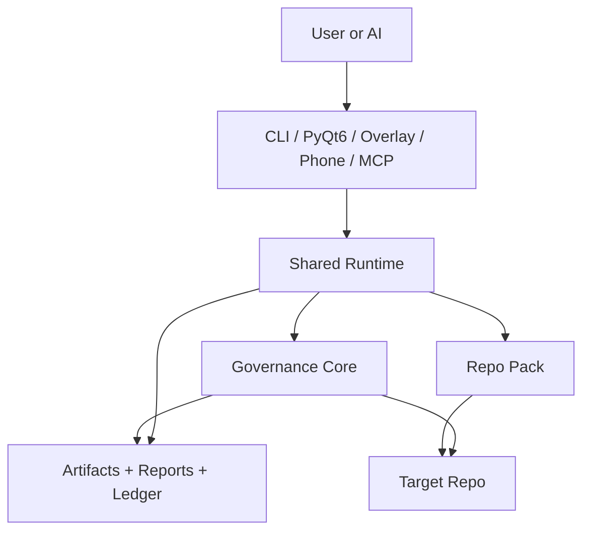
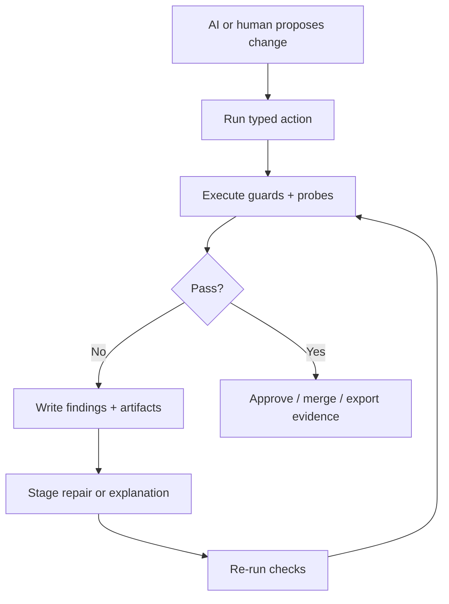
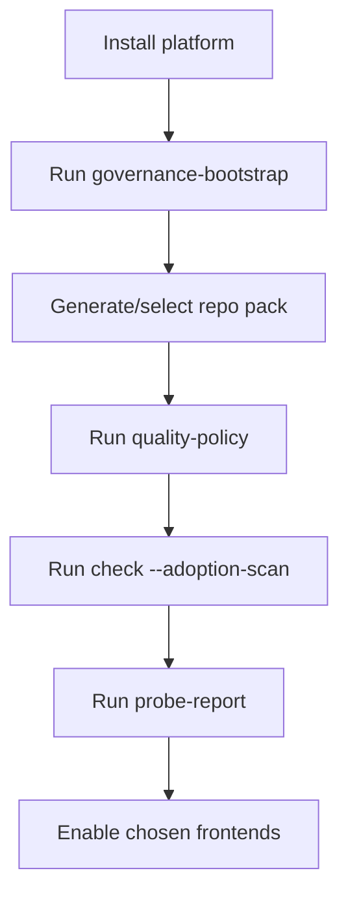

# AI Governance Platform

**Status**: active reference  |  **Last updated**: 2026-03-13 | **Owner:** Tooling/control plane/product architecture

This guide is the maintainable "whitepaper plus flowchart" for the reusable AI
governance platform direction.

Use `dev/active/ai_governance_platform.md` for tracked execution state, the
consolidated architecture assessment, and the phase-by-phase implementation
roadmap.
Use this guide for the durable product thesis, platform shape, and system
flows.
It is a companion guide, not a second active execution plan for this scope.

## Core Thesis

The main architectural claim is simple:

Prompt instructions are useful, but executable local control is what makes
AI-assisted engineering reliable.

For repo-local coding work, quality should be enforced by commands, policies,
tests, typed actions, and artifacts that run the same way every time. The AI
can suggest, explain, draft, and repair, but the environment must own the
deterministic contract.

In this system:

1. `devctl`-style CLI execution is the canonical authority.
2. Guards/probes/policies are executable contracts, not prompt suggestions.
3. MCP, PyQt6, phone/mobile, and overlay/TUI surfaces are adapters or clients.
4. Another repo should adopt the system by installing the platform and selecting
   a repo pack, not by forking VoiceTerm-specific Python files.

This is stronger than "CLI is better than MCP."

The real thesis is:

Executable governance beats prompt-only governance for engineering work.

## What The Product Actually Is

The reusable product is not only a guard pack.

It is one platform with five layers:

1. Portable governance core:
   guards, probes, policy resolution, export, bootstrap, review ledger, and
   metrics/evaluation artifacts.
2. Shared runtime:
   typed actions, control state, loop orchestration, artifact storage, and run
   records.
3. Adapters:
   provider, workflow, VCS, CI, and notification integrations.
4. Frontends:
   CLI, PyQt6 dashboard, overlay/TUI, phone/mobile, and optional MCP adapter.
5. Repo packs:
   repo-local policy, docs templates, workflow defaults, and bounded
   repo-specific glue.

Above those five layers sits the adopter/integration layer: VoiceTerm,
operator shells, mobile shells, generated skills/hooks, and future repo-local
wrappers should consume the platform rather than become a second backend for
it.

VoiceTerm should be one consumer of that platform, not the permanent home of
all platform logic.

Scope-preservation rule:

- the target is the full system becoming modular and callable
- tandem loops, control-plane loops, PyQt6 surfaces, overlay/TUI, mobile
  surfaces, hooks, and generated skills are all consumers of one backend, not
  separate products with separate backend authority
- if a local improvement deepens direct VoiceTerm coupling or creates a second
  backend, it is a regression against the platform direction even if the local
  code looks cleaner

## What Should Be Portable

These pieces should work across arbitrary repos:

- policy resolution
- hard guards and advisory probes
- package/layout contract evaluation
- adoption scan and bootstrap
- governance export and review ledger
- context-pack building, budget policy, and usage telemetry
- typed action contract
- run/artifact/state schemas
- provider adapters
- workflow adapters
- dashboard/backend protocol

## What Should Stay Repo-Local

These pieces belong in repo packs or product integrations:

- canonical doc lists
- path/layout rules specific to one repo
- workflow defaults and branch policy
- repo-specific allowlists and thresholds
- product-specific UX or branding
- repo-specific fix loops that have not yet been generalized

Portable does not mean "every rule is generic."
It means repo-specific behavior is isolated behind an explicit boundary.

Agentic-first rule:

- Build the platform around deterministic, machine-readable contracts that both
  humans and agents can consume.
- Prefer declarative repo policy over hidden code conventions.
- Make failures actionable: every guard should explain the violated contract and
  the repair direction, not just say "bad structure".

Projection rule:

- Treat `json`/`jsonl` as the canonical machine surface for commands, packets,
  metrics, and replayable evidence.
- Treat `md`, flowcharts, hotspot diagrams, and handoff summaries as human
  projections over the same payload, not as the only authority.
- When different audiences need different detail levels (agent, junior dev,
  senior reviewer, operator), project those tiers from one shared evidence
  record instead of inventing separate result schemas per audience.
- When a machine-first surface also writes an artifact to disk, prefer a
  compact machine-readable receipt on stdout and keep the full payload in the
  artifact; terminal output should act as a control channel, not the primary
  document channel for AI loops.
- Apply that receipt rule to JSON-canonical report/packet surfaces, not
  indiscriminately to every human-first CLI command in the repo.

## Do Not Copy Every File By Hand

The right packaging model is not "give the user copies of every file."

That approach does not scale and it guarantees drift.

The right model is:

1. Install one reusable platform package.
2. Run one bootstrap command against the target repo.
3. Generate or choose one repo pack / repo policy.
4. Emit the minimum repo-local files the system requires.
5. Keep the platform upgradeable without re-copying the whole codebase.

Repo-local generated assets may include:

- `dev/config/devctl_repo_policy.json`
- `dev/guides/PORTABLE_GOVERNANCE_SETUP.md`
- local instruction surfaces such as `CLAUDE.md`
- starter hook/workflow stubs rendered from repo-pack policy
- selected workflow templates
- repo-pack docs/runbook files

That is very different from copying the entire internals tree into every repo.

Current machine-readable blueprint surface:

```bash
python3 dev/scripts/devctl.py platform-contracts --format md
python3 dev/scripts/devctl.py platform-contracts --format json
python3 dev/scripts/devctl.py render-surfaces --format md
python3 dev/scripts/devctl.py render-surfaces --format json
python3 dev/scripts/devctl.py render-surfaces --write --format md
```

That command is the executable source of truth for the shared layer model,
runtime contracts, repo-local boundaries, and current portability status.

Current machine-first projection examples already in repo:

- `dev/reports/probes/latest/review_packet.{json,md}`
- `dev/reports/data_science/latest/summary.{json,md}`
- `dev/reports/autonomy/**/summary.{json,md}`
- `dev/reports/governance/latest/review_summary.{json,md}`

The platform direction should keep extending that pattern until every
AI-facing or operator-facing surface has one compact machine payload and any
number of human-friendly renders layered on top.

Current executable runtime seam:

- `dev/scripts/devctl/runtime/control_state.py` now defines the first shared
  `ControlState` contract used by both `devctl mobile-status` and the PyQt6
  Operator Console phone snapshot loader.
- `mobile-status` still emits the legacy `controller_payload` and
  `review_payload` JSON for compatibility, but it now also emits one
  `control_state` object so downstream clients can stop re-deriving the same
  review/controller fields from nested dicts.
- `dev/scripts/devctl/runtime/review_state.py` now defines the next shared
  review-channel contract used by the PyQt6 Operator Console review/session/
  collaboration readers. It normalizes `review_state.json` and `full.json`
  artifacts into typed session, queue, bridge, packet, and agent-registry
  state instead of leaving each surface to parse raw dicts independently.
- This is the right extraction pattern for the rest of the system: add typed
  runtime contracts first, then keep legacy projections only at the outer I/O
  boundary until all consumers have moved.

## Canonical Execution Model

Use this mental model:



Interpretation:

- the frontend is not the authority
- the runtime owns typed actions and state
- the core owns enforcement and evidence
- the repo pack injects repo-local behavior without polluting the core

## Governed Coding Loop

This is the operational loop the product should make repeatable:



The important point is that the loop is artifact-backed and rerunnable.
The model is not trusted to remember what the rules were.

## Context Is A Bounded Resource

Better AI coding results do not count as a product win if the system only works
by dumping huge amounts of repository state into the model.

The platform should treat context the same way it treats any other runtime
resource: bounded, measured, and operator-visible.

That means:

1. Every AI-facing mode should have a declared context tier:
   bootstrap, full-repo scan, focused fix, review, or remediation.
1.1 Keep collaboration mode separate from objective profile: the same backend
   should be able to run those tiers under `active_dual_agent`,
   `single_agent`, or script-first/tool-driven flows instead of treating
   "refactor mode" as a separate subsystem.
2. Repo packs should define budget defaults and reserved headroom for those
   modes instead of leaving prompt size to ad hoc caller behavior.
3. The runtime should estimate context size before dispatch and record actual
   provider usage when that data is available.
4. Oversized runs should summarize, prune, split, or fail explicitly; they
   should not silently send "everything."
5. Usage docs should explain when to run a full-repo pass versus a focused
   slice and what rough context/cost band each mode implies.
6. Runtime evidence should capture artifact size, content-hash, and estimated
   token cost so agents can avoid rereading unchanged payloads and operators
   can compare code-quality gains against context spend.

## Repo Adoption Flow

Another repo should come online through this path:



If onboarding requires manual file hunting or bespoke engine edits, the
platform boundary is still wrong.

## Surface Hierarchy

The system should have one authority stack:

1. Core engine and runtime contracts
2. Repo pack policy and typed actions
3. CLI as the default execution surface
4. GUI/dashboard/mobile/MCP as thin clients

That means:

- PyQt6 should not become a second backend
- MCP should not become the authority layer
- prompt text should not become the safety mechanism
- release/safety guarantees should stay in executable code paths

## Required Product Deliverables

To make this real, the platform needs concrete artifacts:

1. An installable package/workspace boundary.
2. A canonical repo-pack schema.
3. A bootstrap/setup command for new repos.
4. A typed action/state/runtime contract shared by all frontends.
5. A dashboard protocol so PyQt6, overlay, and phone/mobile reuse one backend.
6. A context-budget contract plus usage telemetry and rollout guidance.
7. An export path for evidence, review packets, and external analysis.
8. A public-facing thesis/whitepaper derived from this guide.

## Architectural Rules

1. One backend contract, many frontends.
2. One repo-pack boundary, not scattered repo-specific conditionals.
3. One executable safety path, not duplicate prompt-only policy.
4. One evidence model, not hidden chat memory.
5. One upgrade path for other repos, not manual tree copying.

## Where We Go Next

The next architecture steps should be:

1. Finish extracting the portable governance core already tracked in
   `MP-376`.
2. Extend the first landed runtime contract set (`ControlState`,
   `ReviewState`) and add the rest of the shared runtime contracts for
   actions, artifacts, and run records.
3. Add budget-aware context packing and usage telemetry before broader
   packaging hides prompt cost behind a nicer frontend.
4. Move Ralph, mutation, review-channel, and process-hygiene flows onto those
   shared contracts.
5. Make the PyQt6 console and future mobile surfaces thin clients over that
   runtime.
6. Package VoiceTerm as a first-party adopter/repo pack instead of the only
   host repo.

## Naming Layers

Do not collapse the whole product into a tiny slash-command list.

Use three naming layers:

1. Backend command/action ids:
   the stable technical contract (`review-channel`, `swarm_run`,
   `controller-action`, `governance-bootstrap`, `governance-export`,
   `probe-report`, `tandem-validate`, `platform-contracts`, `mobile-status`,
   `release-gates`, `ship`).
2. User-facing goal groups:
   simple intent buckets like `inspect`, `review`, `fix`, `run`, `control`,
   `adopt`, `publish`.
3. Client-specific wrappers:
   skills, slash commands, PyQt6 buttons, VoiceTerm actions, phone/mobile
   controls that all resolve back to the same backend actions.

That is how the system stays both simple and complete:

1. the backend keeps the full architecture surface
2. the user sees simpler names
3. every client still drives the same system

## Decision Summary

If you want the short architectural answer:

- Yes, everything important should be modular.
- No, users should not need copies of every internal file.
- Yes, the system should be callable from any repo.
- The way to get there is package + runtime contracts + repo packs +
  budget-aware context handling + bootstrap, not manual copying and not
  prompt-only guidance.
