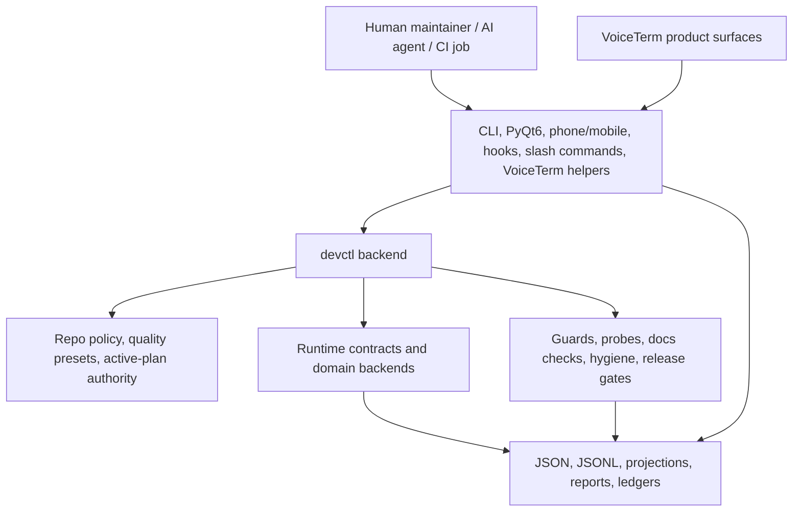
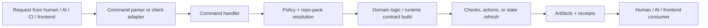

# Devctl Architecture

**Status**: active reference  |  **Last updated**: 2026-03-16 | **Owner:** tooling/control plane

This guide is the plain-language map of the `devctl` system and how it fits
into the larger VoiceTerm control plane.

Use this guide when you need the whole picture:

- what `devctl` is
- what it owns
- how it connects to VoiceTerm, PyQt6, phone/mobile, CI, and AI agents
- how command naming should stay simple and consistent
- how a portable naming guard and a future `map` command should fit the system

Use `dev/scripts/README.md` for the full command catalog.
Use `dev/guides/ARCHITECTURE.md` for the Rust overlay/runtime.
Use `dev/active/ai_governance_platform.md` for the long-range extraction plan.

## One-Sentence Summary

`devctl` is the repo's control-plane backend: one Python entrypoint that turns
engineering workflows, AI coordination, policy, and machine-readable artifacts
into a reusable system instead of a pile of shell habits.

## Whole System at a Glance

The full system is bigger than `devctl`, but `devctl` is the backend center of
gravity for tooling, AI workflow control, and machine-readable state.



Read it this way:

- `devctl` is the backend that runs policy, checks, orchestration, and artifact emission.
- Frontends are transport and presentation layers.
- The Rust overlay is part of the product, but it is not the only authority.
- AI agents should read repo-visible plans, policies, and artifacts instead of depending on hidden chat memory.

## What Devctl Owns

Inside the `devctl` system:

- `dev/scripts/devctl.py`
- `dev/scripts/devctl/**`
- `dev/scripts/checks/**`
- repo policy and portable presets under `dev/config/**`
- machine-readable artifacts under `dev/reports/**`

Outside the `devctl` system, but connected to it:

- Rust VoiceTerm runtime and overlay
- PyQt6 Operator Console
- phone/mobile readers and controllers
- MCP or future hook/slash-command transports
- active-plan markdown docs as execution and operator state

Simple rule:

- `devctl` owns execution logic, policy, and artifacts
- clients own presentation and transport
- plans/docs own human execution state

## The Main Layers

| Layer | Main paths | Plain-language job |
|---|---|---|
| Entry | `dev/scripts/devctl.py` | one command door into the system |
| Command layer | `dev/scripts/devctl/commands/` | parse intent and route work |
| Policy layer | `bundle_registry.py`, `script_catalog.py`, `quality_policy*.py`, `dev/config/**` | decide what runs and what rules apply |
| Domain backends | `review_channel/`, `autonomy/`, `governance/`, `watchdog/`, `process_sweep/`, `security/` | implement one owned workflow family each |
| Runtime contracts | `dev/scripts/devctl/runtime/` | typed shared state for clients and commands |
| Repo-pack boundary | `dev/scripts/devctl/repo_packs/` | inject repo-specific defaults without hardcoding one repo forever |
| Artifact/output layer | `dev/reports/**`, `runtime/machine_output.py` | persist machine-readable truth and delivery receipts |
| Check/probe layer | `dev/scripts/checks/**` | fail on real regressions and report softer smells |

## The Important Rule: One Backend, Many Clients

Do not think of `devctl` as "just the CLI."

Think of it as one backend serving many clients:

- command-line maintainers
- AI agents
- CI workflows
- PyQt6 views
- phone/mobile views
- future slash commands and hooks

That means:

- logic should live in reusable backend modules
- clients should call the backend or read its artifacts
- we should not duplicate workflow logic in every frontend

## Standalone Pieces, One System

The target shape is:

1. a set of pieces that work by themselves
2. one full app that composes those same pieces cleanly

Examples:

- `check` and `probe-report` should be useful without VoiceTerm
- `map` should be useful without PyQt6
- the future service/controller path should be useful without chat
- VoiceTerm, PyQt6, phone/mobile, and hooks should all become better by using
  those same pieces instead of re-implementing them

Bad shape:

- feature only works inside one UI
- feature only works through one prompt ritual
- feature only works when hidden chat state survives

Good shape:

- standalone command or API
- shared typed contract
- reusable artifact output
- integrated app path over the same backend

## How We Prevent Drift

The system stays understandable only if every kind of consistency has one
clear owner.

Use this rule:

1. naming drift is prevented by the naming contract and wrapper mapping guard
2. state drift is prevented by typed runtime contracts
3. action drift is prevented by typed action contracts
4. artifact drift is prevented by versioned JSON/JSONL/SQLite contracts
5. lifecycle drift is prevented by one service/controller contract
6. UI/docs drift is prevented by projection rules and generated surfaces
7. cross-client drift is prevented by parity fixtures and contract-sync guards
8. repo portability drift is prevented by repo-pack boundaries

If a behavior exists but does not have a clear owner in that stack, it is a
future drift bug.

### The canonical order

When two layers disagree, trust this order:

1. typed runtime/action/artifact contracts
2. repo policy and repo-pack config
3. generated surfaces and machine projections
4. markdown/operator docs
5. chat memory or operator habit

That order is what keeps the architecture understandable when the system grows.

## How a Request Moves Through the System



The output is not just terminal text.
The real backend contract is usually one of these:

- typed Python objects
- JSON payloads
- JSONL ledgers
- projection files
- stable report bundles

Markdown is important, but usually as a readable projection over stronger machine authority.

## The Stable Command Language We Should Keep

This is the KISS naming contract for public words.
One word should mean one thing everywhere.

| Word | Meaning | Must stay simple |
|---|---|---|
| `check` | run blocking quality gates | fail or pass |
| `probe` | surface non-blocking smells | advise, not block |
| `status` | show current state once | read-only snapshot |
| `watch` | repeat a read-only view on cadence | no hidden mutation |
| `report` | summarize existing evidence | explain, do not steer |
| `launch` | start long-running sessions | explicit side effect |
| `ensure` | verify a loop/service is healthy and start bounded support paths when allowed | honest lifecycle term |
| `heartbeat` | liveness update only | not semantic completion |
| `checkpoint` | advance owned truth | explicit write |
| `promote` | move to the next approved step | queue/state advance |
| `render` | generate readable surfaces from stronger inputs | deterministic output |
| `export` | package data for other consumers/repos | portable boundary |
| `map` | explain how parts connect | structure and flow, not execution |

Naming rules:

1. Prefer common words over clever words.
2. Use one public word for one action family.
3. Keep read-only verbs separate from state-changing verbs.
4. If a name needs a paragraph to explain, the name is bad.
5. If two names mean almost the same thing, pick one and retire the other.

### Two naming layers

We should keep two naming layers, not one confused pile:

- canonical backend ids
  - stable technical command/action words that the runtime, docs, tests, and policy all share
- friendly wrappers
  - beginner-facing aliases, slash commands, skill names, and UI labels that resolve to the same canonical ids

That means:

- backend semantics stay stable
- beginner and agent UX can stay simpler
- the guard should validate the mapping between the two layers so wrapper copy does not drift into a second behavior model
- one shared command-goal taxonomy should drive grouped discovery surfaces
  like `devctl list`, startup guides, wrappers, and future `map` hints so
  each client does not invent its own command grouping

## Current Building Blocks We Already Have

The repo already contains the seeds of the portable system you are asking for.

| Need | Current seed |
|---|---|
| portable backend blueprint | `devctl platform-contracts` |
| generated AI/dev startup surfaces | `devctl render-surfaces` |
| repo-visible review/control state | `review-channel`, `phone-status`, `mobile-status`, runtime contracts |
| topology and connection scanning | `probe_topology_*` backend via `probe-report` |
| naming contract enforcement seed | `check_naming_consistency.py` |
| repo portability boundary | `repo_packs/` + policy/preset stack |

So the right design is not "add another unrelated subsystem."
The right design is "promote the existing seeds into cleaner public contracts."

## Portable Naming-Contract Guard Design

Yes: the naming contract should be a guard.
But it should be a portable guard, not a VoiceTerm-only regex file.

### Target shape

1. Keep one reusable engine under `dev/scripts/checks/` or `dev/scripts/devctl/`.
2. Drive repo-specific vocabulary from repo policy, not from hardcoded local tokens.
3. Separate hard failures from advisory cleanup hints.
4. Emit JSON plus readable markdown so AI, CI, and humans all see the same result.

### Portable policy model

The repo policy should define things like:

- canonical command words
- friendly aliases and wrapper labels
- allowed aliases
- forbidden synonyms
- naming families by surface
- required wording for high-authority actions
- allowed exceptions with owner + expiry

That policy needs to work across any repo by swapping config, not by editing the guard code.

### Guard split

Use two levels:

- hard guard: catches clear contract drift
  - same command word means different things
  - write action mislabeled as read-only
  - friendly alias points at the wrong backend action
  - deprecated public word added to docs or CLI
  - repo-generated starter surfaces drift from the canonical naming policy
- advisory review hints: catches cleanup opportunities
  - wording too long
  - duplicate synonyms
  - overly academic or vague descriptions
  - inconsistent beginner-facing copy across docs/help text

### Current seed

`check_naming_consistency.py` is already the first hard-guard seed for this
idea, and `probe_term_consistency.py` is now the first advisory layer for
legacy or mixed public terminology in repo-owned `devctl` code/docs.
Right now the hard guard is still too narrow: it mainly protects
host/provider token alignment.

The portable next step is:

- widen it into a repo-policy-backed naming-contract guard
- keep the current token checks as one rule family inside that guard
- let any repo define its own canonical vocabulary without forking the engine

## Portable `map` Command Design

Yes: we should have a first-class `map` surface.
It should be a command family, not a random `--map` flag.

Recommended shape:

```bash
python3 dev/scripts/devctl.py map --format md
python3 dev/scripts/devctl.py map --format json
python3 dev/scripts/devctl.py map --format mmd
python3 dev/scripts/devctl.py map --format dot
python3 dev/scripts/devctl.py map --focus dev/scripts/devctl/review_channel --format json
python3 dev/scripts/devctl.py map --since-ref origin/develop --with-overlays --format md
python3 dev/scripts/devctl.py map --ai-context --focus MP-377 --format json
```

### What `map` should do

`map` should answer:

- what files or modules connect to what
- which layers depend on which other layers
- which files are complex, crowded, or risky
- where the hotspots are
- what changed recently
- which paths matter for one task or one AI run
- which guards, probes, or reports are relevant for those paths
- what the next bounded check/review action should be for that focus area

### Map layers

`map` should be a layered repo-understanding surface, not just a graph dump.

| Layer | What it adds | Why it matters |
|---|---|---|
| topology | imports, file/module links, callers, neighbors, layer edges | tells you what connects to what |
| complexity | file/function size, branching, duplication, crowding, churn | shows where maintenance risk lives |
| hotspot ranking | coupling + complexity + change pressure | tells humans and AI where to look first |
| evidence overlays | guard failures, probe hints, stale docs/contracts, review findings | shows what is already known to be wrong |
| focus/change overlays | `--focus`, `--since-ref`, owner/task/risk lens | narrows the map to one task instead of the whole repo |
| action hints | recommended `check`, `probe-report`, focused tests, docs surfaces | lets AI move from "understand" to "run the right thing" |

### What it should reuse

We do not need a brand-new graph engine.
We already have topology primitives:

- `dev/scripts/devctl/probe_topology_scan.py`
- `dev/scripts/devctl/probe_topology_builder.py`
- `dev/scripts/devctl/probe_topology_render.py`
- `probe-report` artifacts like `file_topology.json`, `review_packet.json`, `hotspots.mmd`, and `hotspots.dot`

It should also reuse existing evidence instead of rescanning blindly:

- guard/probe output and adjudication ledgers
- changed-file or `--since-ref` scope inputs
- repo-pack path/policy resolution
- machine-output receipts and artifact metadata where available

So `map` should be the public, reusable command built on top of those backends,
not a separate island.

### Storage and cache model

Yes: `map` should be stored and reusable.

But the authority should live in the platform artifact store, not only in
VoiceTerm memory.

Recommended contract:

1. canonical snapshot
   - one machine-first JSON payload for the latest repo-understanding state
2. refresh ledger
   - append-only JSONL rows for when the map was refreshed, from what inputs,
     and with what schema/policy versions
3. query/cache index
   - optional SQLite index for fast focus queries (`path`, `owner`, `lens`,
     `since-ref`, hotspot rank, guard/probe overlays) so AI does not keep
     rescanning the whole repo
4. human projections
   - markdown and graph outputs generated from the same snapshot instead of
     becoming separate truth

Suggested artifact family:

- `map_snapshot.json`
- `map_targets.json`
- `map.md`
- `map.mmd`
- `map.dot`
- `map_runs.jsonl`
- `map_index.sqlite`

Every durable JSON or JSONL family in that artifact set should carry an
explicit `schema_version`, and coverage should be guard-backed rather than
left to partial adoption.

This should mirror the memory-system pattern at a high level:

- JSON or JSONL for durable machine truth
- SQLite for fast local queries and caching
- markdown as a readable projection

But `map` is not the same thing as chat memory.
Memory may ingest refs, hashes, or summaries from `map`, but the canonical map
contract should stay under repo-pack-owned artifact roots so any repo can use
it without adopting VoiceTerm-specific memory paths.

### Why it matters

For humans:

- faster architecture understanding
- cleaner flowcharts
- clearer refactor planning

For AI:

- smaller and better context packets
- focus by path, owner, or changed scope
- one command to explain the repo instead of rereading many docs
- ability to run guards on the risky spots after the map highlights them
- less token waste because cached map state can be queried instead of rebuilt

For portability:

- any repo can reuse the same map engine with repo-pack policy overrides
- output stays stable across repos even when the codebase changes
- cache/index behavior is policy-owned instead of hard-coded to one product

### Suggested outputs

`map` should emit:

- `map_snapshot.json` for machines
- `map_targets.json` for machine-readable focus/check suggestions
- `map.md` for humans
- `map.mmd` for Mermaid flowcharts
- `map.dot` for Graphviz or graph tooling

Optional later outputs:

- hotspot ranking
- complexity ranking
- guard/probe overlay summaries
- change-focused map (`--since-ref`)
- task-focused map (`--focus path/or/module`)
- AI packet mode (`--ai-context`)
- cached-query mode that reuses the latest SQLite/indexed state when inputs are unchanged

### How AI should use it

The intended AI flow is:

1. refresh or reuse the latest `map` snapshot
2. ask for a focused slice by path, task, owner, changed files, or risk lens
3. read the recommended checks and existing findings for that slice
4. run the smallest relevant guard/probe/test bundle instead of inventing the workflow in prompt text

## How `map` Fits Hooks and Slash Commands

The future hook or slash-command path should stay thin:

1. hook/slash command receives a user request
2. it calls `devctl map` or reads its latest artifact
3. it returns a compact explanation, flowchart, or AI context packet

That keeps the transport simple and the backend reusable.

Bad design:

- each client re-implements topology scanning
- each repo invents its own naming words
- each AI prompt explains the architecture from scratch

Good design:

- one backend command
- one artifact contract
- one naming contract
- repo-pack policy for local customization

## The Whole-System Design Goal

The end-state is not "a nicer CLI help page."

The end-state is:

1. one backend authority
2. one portable naming contract guard
3. one public `map` command for structure understanding
4. one stored repo-understanding contract with JSON, JSONL, and optional SQLite reuse
5. one artifact layer that frontends, hooks, slash commands, and AI agents can all reuse
6. repo-pack policy that makes the same engine work in any repo

That is how we stop re-explaining the system by hand.

## Short Version

If someone asks "what should we build next?" the answer is:

1. turn the current narrow naming check into a portable naming-contract guard
2. promote the existing topology engine into a first-class `map` command
3. make `map` combine topology, complexity, hotspots, evidence overlays, and recommended checks
4. store `map` as reusable JSON plus optional SQLite index so AI can target work without rescanning everything
5. make both of those repo-policy-driven so they work in any repo
6. let hooks, slash commands, UI clients, and AI agents consume those same contracts instead of inventing their own
