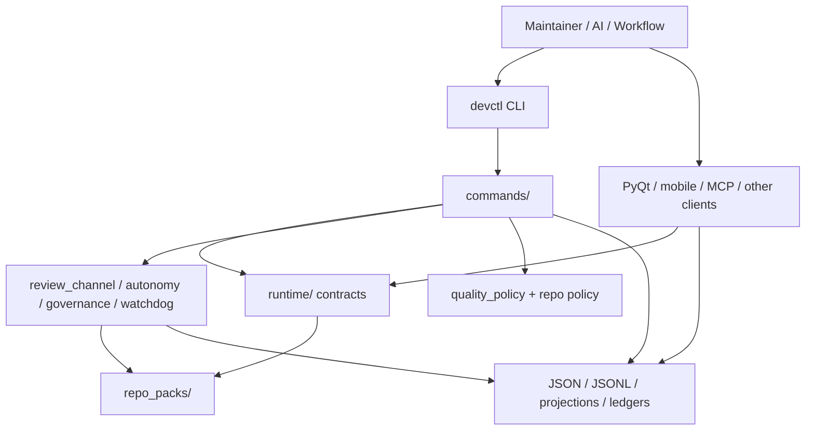
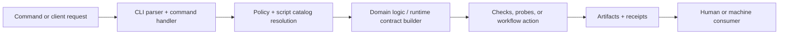

# Devctl Architecture

**Status**: active reference  |  **Last updated**: 2026-03-15 | **Owner:** Tooling/control plane

This guide describes `devctl` as the repo's maintainer control-plane backend.
It stays focused on the Python command/runtime/artifact system, not the
VoiceTerm product surface.

Use this guide for the stable devctl architecture.
Use `dev/scripts/README.md` for command inventory and
`dev/active/ai_governance_platform.md` for extraction planning.

## Purpose

`devctl` exists to make engineering workflows executable instead of prompt-only.

In practice it does four jobs:

1. dispatch commands through one maintainer entrypoint: `python3 dev/scripts/devctl.py`
2. run deterministic quality policy: guards, probes, docs checks, hygiene, release gates
3. emit machine-readable artifacts and receipts that other tools can consume
4. provide a shared backend for multiple clients without duplicating workflow logic

## System Boundary

Inside the `devctl` backend:

- `dev/scripts/devctl.py`
- `dev/scripts/devctl/**`
- `dev/scripts/checks/**`
- repo policy and portable presets under `dev/config/**`

Outside the `devctl` backend:

- Rust overlay/runtime
- PyQt Operator Console UI
- mobile/iOS clients
- MCP transport surface
- active-plan markdown docs as operator/runbook state

Those surfaces may call `devctl`, read its typed contracts, or consume its
artifacts, but they are not the authority for the backend rules.

## Core Modules

| Area | Current modules | Responsibility |
|---|---|---|
| Entrypoint | `dev/scripts/devctl.py` | top-level CLI dispatch |
| Command layer | `dev/scripts/devctl/commands/` | command handlers and orchestration |
| Policy/routing | `bundle_registry.py`, `script_catalog.py`, `quality_policy*.py` | what runs, when it runs, and which checks/probes are active |
| Checks/probes | `dev/scripts/checks/` | hard guards and advisory probes |
| Runtime contracts | `dev/scripts/devctl/runtime/` | typed shared state such as `ControlState`, `ReviewState`, `TypedAction`, `RunRecord` |
| Domain backends | `review_channel/`, `autonomy/`, `watchdog/`, `governance/` | long-running loop logic, state reducers, reporting, and workflow helpers |
| Platform blueprint | `dev/scripts/devctl/platform/` | extraction-facing layer definitions and contract blueprint |
| Repo-pack layer | `dev/scripts/devctl/repo_packs/` | repo-local metadata, paths, and thin read-only helpers |
| Machine output | `dev/scripts/devctl/runtime/machine_output.py` | compact JSON receipts and artifact-delivery metrics |

## Machine-Authority Artifacts

The backend should be treated as machine-first.
Markdown is usually a projection over a stronger command/config/artifact surface.

Current authority surfaces include:

- command execution through `devctl`
- repo policy in `dev/config/devctl_repo_policy.json`
- portable presets in `dev/config/quality_presets/*.json`
- command telemetry in `dev/reports/audits/devctl_events.jsonl`
- governance ledgers in `dev/reports/governance/*.jsonl`
- review-channel state/projections in `dev/reports/review_channel/**`
- probe/data-science/report bundles in `dev/reports/**`

Rule of thumb:

- JSON / JSONL / typed dataclasses are the backend contract
- Markdown is for operator readability, handoff, and review

## Repo-Pack Boundary

`devctl` is not supposed to hardcode one repo forever.
Repo-local behavior should come through a repo-pack boundary.

Current shape in this repo:

- shared backend logic lives under `dev/scripts/devctl/**`
- the concrete repo pack lives under `dev/scripts/devctl/repo_packs/`
- `repo_packs/voiceterm.py` is the first real in-tree repo-pack
- `RepoPathConfig` is the current path/artifact ownership seam

That means repo-specific paths, default docs, workflow presets, and similar
metadata should move into repo-pack surfaces instead of leaking across runtime
and client code.

## One Backend, Many Clients

`devctl` should be understood as one backend serving multiple clients.
The clients differ by transport and presentation, not by core authority.

Current client classes in this repo:

- the `devctl` CLI itself
- review-channel launch/status flows
- PyQt Operator Console readers
- phone/mobile projections such as `phone-status` and `mobile-status`
- future or optional MCP adapters

Implication:

- do not duplicate orchestration logic in each frontend
- add typed runtime contracts first
- keep clients thin and artifact-driven where possible

## Request Flow

This is the normal backend path for most `devctl` work:

The important architectural point is that artifacts are not incidental logs.
They are part of the backend contract and are meant to be consumed by both
humans and other tooling.

## Current Reality

The current repo is mid-transition, not finished:

- the runtime contract layer is real but incomplete
- the repo-pack boundary exists but still has VoiceTerm-shaped seams
- some command/domain modules are still more repo-local than the target design

Even so, the intended architecture is already visible:
one command backend, typed runtime contracts, machine-readable artifacts, and
repo-pack injection instead of frontend-local workflow logic.
