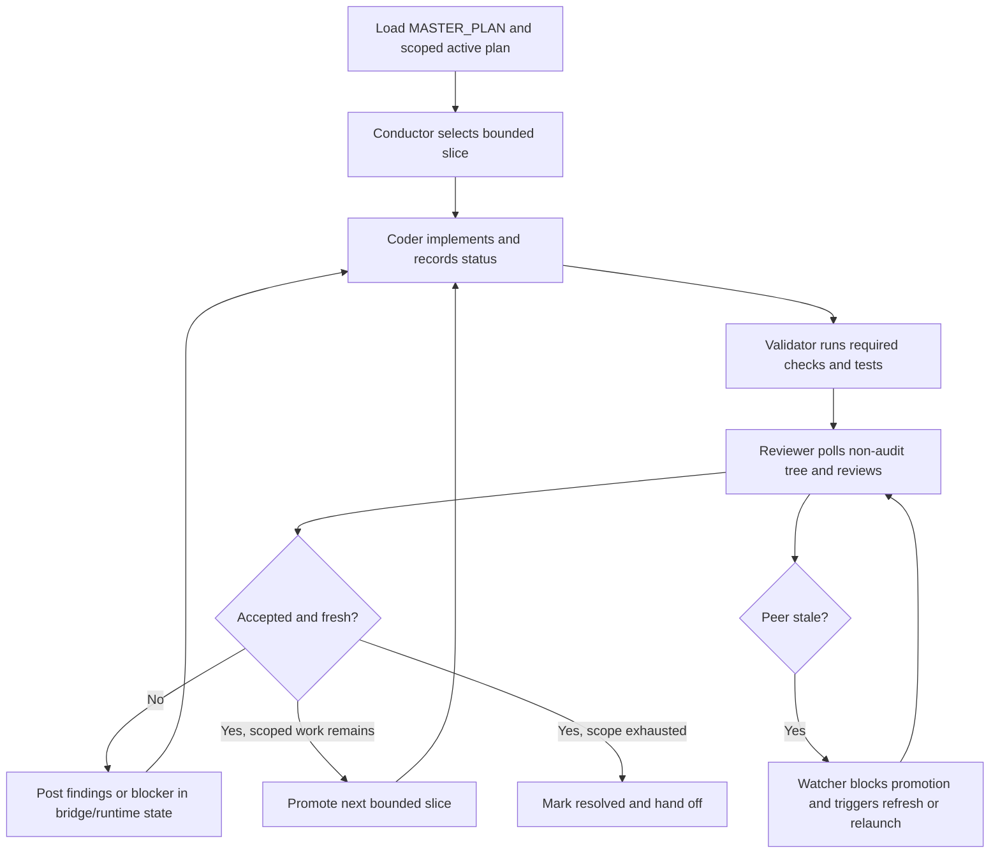

# Devctl Multi-Agent Operations

This guide describes the current repo-sanctioned operating model for live
review/coding loops driven through `devctl`, active-plan markdown, and the
transitional markdown bridge.

Use it with:

- `AGENTS.md`
- `dev/active/review_channel.md`
- `dev/active/continuous_swarm.md`
- `dev/active/ai_governance_platform.md`

If those sources conflict, follow `AGENTS.md` first, then the active plan docs.

## Purpose

The goal is to keep reviewer/coder automation moving without hidden state,
stale handoffs, or "done because nobody looked again" failure modes.

This guide covers:

- role ownership for reviewer, coder, watcher, validator, and conductor lanes
- JSON-vs-markdown authority
- heartbeat and freshness expectations
- the current live-loop contract while `bridge.md` remains active
- the bounded path from today's markdown bridge to typed runtime artifacts

## Core Rules

1. One scoped plan stays in charge. `dev/active/MASTER_PLAN.md` is the tracker,
   and the matching active plan doc is the scoped execution authority.
2. Machine-readable state is canonical for automation. Markdown is a governed
   projection plus a human-visible restart surface.
3. The loop does not stop at one accepted slice if scoped work remains.
4. Hidden memory-only coordination is not acceptable execution state.
5. Freshness is mandatory. A stale reviewer heartbeat or stale coder ack blocks
   new work promotion until the bridge/runtime state is refreshed or relaunched.
6. All meaningful work must be reflected in repo-visible state: active-plan
   markdown, `bridge.md` when the bridge is active, and `devctl`-emitted
   JSON/JSONL artifacts for machine consumers.

## Roles

### Conductor

The conductor owns the current lane, not every specialist worker under it.

Responsibilities:

- choose the active scope and confirm plan alignment
- keep the loop moving to the next bounded slice
- write repo-visible state for its side of the loop
- collect worker findings and turn them into one coherent next instruction
- refuse to advance on stale peer state

Current mapping:

- Codex conductor: primary reviewer/conductor lane
- Claude conductor: primary coder/conductor lane

### Reviewer

The reviewer evaluates the non-audit worktree state and decides whether the
current slice is accepted, blocked, or needs fixes.

Responsibilities:

- review changed non-bridge files
- record the reviewed non-audit worktree hash
- distinguish blocking findings from resolved/advisory notes
- post the next bounded instruction when work remains
- keep the operator-visible heartbeat alive

### Coder

The coder owns implementation for the current instruction.

Responsibilities:

- make the requested code/doc/test changes
- acknowledge live findings with explicit short markers
- report blockers early instead of silently idling
- hand control back after implementation plus local validation

### Watcher

The watcher monitors liveness, freshness, and loop integrity.

Responsibilities:

- watch heartbeat age and reviewed-hash freshness
- detect stale-peer, waiting-on-peer, and bridge drift conditions
- route recovery to refresh, relaunch, or stop-and-reseed
- avoid rewriting the plan or code on its own

This role is usually implemented by `devctl` status/guard surfaces, not by
free-form chat behavior alone.

### Validator

The validator confirms that the current slice is actually green.

Responsibilities:

- run the required guard/check bundle for the task class
- rerun targeted tests after fixes
- report exact failures and known unrelated noise
- only mark the slice clear when validation evidence exists

## Authority Model

Use this split consistently.

| Surface | Authority |
|---|---|
| `MASTER_PLAN.md` | Canonical repo-wide tracker |
| Matching active plan doc | Scoped execution authority and restart state |
| `devctl` JSON/JSONL artifacts | Canonical machine-readable automation state |
| `bridge.md` | Transitional current-state bridge while active |
| Chat updates | Operator observability only, not execution authority |

### JSON vs Markdown

JSON/JSONL is authoritative for machine consumers when a typed surface exists.

Examples:

- `review_state`
- `control_state`
- status/projection bundles
- telemetry ledgers
- review/finding records

Markdown is still authoritative for scoped prose execution state that has not
yet been replaced by a typed artifact.

Examples:

- active-plan checklist progress
- `Session Resume`
- `Progress Log`
- the live bridge in `bridge.md` while the markdown bridge is active

Rule of thumb:

- machine state, metrics, hashes, packets, and receipts belong in JSON/JSONL
- human direction, plan sequencing, and current scoped prose status belong in
  markdown
- chat mirrors the state for the operator but does not replace either one

## Live Bridge Contract

While `bridge.md` is active, it is the sanctioned live coordination bridge.
It is not a scratchpad and not a second tracker.

Required bridge behavior:

1. Reviewer-owned sections stay reviewer-owned.
2. Coder-owned sections stay coder-owned.
3. Each meaningful reviewer update includes the latest reviewed non-audit
   worktree hash.
4. Findings refer to concrete files, checks, or tests when possible.
5. The current instruction stays bounded and actionable.
6. When a slice is accepted and scoped work remains, the reviewer promotes the
   next bounded task instead of leaving the bridge idle.

Minimum live fields, even when expressed as prose sections:

- scope or task id
- current owner
- last reviewed non-audit worktree hash
- review status
- open blockers
- next action
- last poll timestamp

## Heartbeat And Freshness

The current repo contract is:

- reviewer polls non-audit worktree changes every 2-3 minutes while code is moving
- reviewer emits an operator-visible heartbeat every 5 minutes even if nothing changed
- reviewer poll is due after 180 seconds
- reviewer freshness is stale after 300 seconds without a new reviewer heartbeat
- new task promotion must stop on stale peer state

Coder-side expectations:

- acknowledge new findings promptly with one of:
  - `fixed`
  - `acknowledged`
  - `needs-clarification`
  - `blocked`
  - `deferred`
- do not silently hold the lane after a requested change is complete

Watcher/validator expectations:

- do not treat a heartbeat-only refresh as proof that review content changed
- reviewed hash, verdict, blockers, and next instruction must stay coherent

## Stale-Loop Prevention

When the loop starts going stale, use this order:

1. Check whether the reviewed hash is current for the actual non-audit tree.
2. Check whether the reviewer heartbeat is merely late or actually stale.
3. Check whether the coder acknowledged the current instruction.
4. Refresh bridge/runtime state only if the state can still be trusted.
5. Relaunch or re-seed the missing side when freshness cannot be recovered.
6. Resume from repo-visible handoff state, not chat memory.

Do not:

- promote a new slice on stale review state
- treat chat alone as proof of acceptance
- let specialists overwrite conductor-owned bridge sections
- let markdown diverge from typed runtime artifacts once those artifacts exist

## Recommended Loop

## Bounded Operating Improvements

These are the next safe improvements without changing the contract shape:

1. keep conductor-owned bridge writes narrow and structured
2. continue moving current-state machine data from markdown into typed runtime
   artifacts
3. keep reviewer freshness and reviewed-hash honesty guarded
4. make stale-peer recovery explicit before adding more autonomous wakeups
5. preserve one vocabulary set across CLI, Operator Console, phone/mobile, and
   markdown projections

## Failure Boundaries

Escalate to the operator when:

- product intent is ambiguous
- a destructive action is required
- credentials, publishing, or external access is required
- the loop cannot prove freshness or plan alignment
- the current slice is blocked by a real architectural conflict

Otherwise, the loop should keep moving through the scoped plan.

## Handoff Expectations

Every accepted or blocked slice should leave behind:

- current scope
- reviewed non-audit worktree hash
- exact validation run
- blocker or acceptance state
- next bounded instruction
- any known unrelated failures or coverage gaps

If the next conductor session cannot continue from repo-visible state alone,
the loop is not healthy yet.
