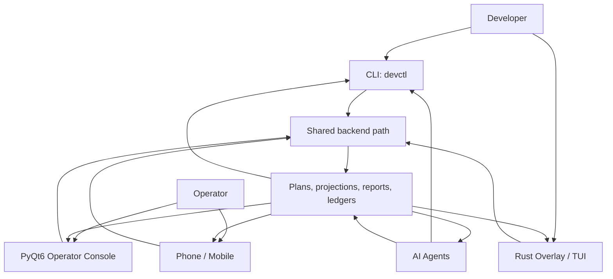

# Devctl Product Flow

This guide explains the intended final-product flow for `devctl` and the
operator-facing surfaces around it.

Use this with:

- `AGENTS.md` for policy and required verification
- `dev/guides/AI_GOVERNANCE_PLATFORM.md` for the durable platform thesis
- `dev/active/operator_console.md` for the active PyQt6 execution plan
- `app/operator_console/README.md` for the current desktop app scope

## Product Statement

The product is one governed local control system with multiple clients.

- `devctl` CLI is the canonical command authority.
- PyQt6 Operator Console is a thin desktop operator surface.
- Phone/mobile is a thin remote status and action surface.
- The Rust overlay remains the PTY and voice runtime owner.
- AI agents and developers use the same repo-owned commands and artifacts.
- Shared runtime state and projections are the seam that keeps these surfaces
  aligned.

If a surface starts inventing its own orchestration path, it is wrong.

## Surface Roles

| Surface | Primary user | What it does | What it must not do |
|---|---|---|---|
| CLI (`devctl`) | developers, AI agents, maintainers | executes typed commands, checks, reports, review actions, launch flows | delegate authority to prompt-only text |
| PyQt6 Operator Console | operator | reads shared state, stages allowlisted actions, launches repo-owned commands | become a second backend or PTY runtime |
| Phone/mobile | operator | reads summaries, review/control projections, bounded actions | own policy, launch logic, or local parsing forks |
| Rust overlay | developer/operator | owns PTY session, voice capture, terminal UI, optional monitor surfaces | replace `devctl` governance/policy ownership |
| AI agents | reviewer/coder/support workers | read plans, artifacts, packets, and run repo-owned commands | bypass guards or invent hidden side effects |
| Developers | local maintainers | drive the system through CLI or UI, inspect artifacts, approve actions | create manual side channels as system authority |

## Shared Backend Path

Every surface should follow the same path:

1. Read repo policy, active plans, and runtime state through shared contracts.
2. Stage or invoke a typed repo-owned action.
3. Route execution through `devctl` command surfaces and shared runtime logic.
4. Update artifacts, projections, ledgers, and status bundles.
5. Let every other surface refresh from those same outputs.

Current shared backend/runtime path:

```text
surface -> typed action / read request -> devctl command layer
       -> shared runtime state/contracts -> repo pack / policy
       -> repo artifacts + projections + ledgers
       -> all surfaces refresh from the same outputs
```

In practice this means:

- PyQt6 should call or stage `devctl` workflows, not clone them.
- phone/mobile should consume emitted bundles and typed projections.
- AI agents should read and write through repo-owned plans, commands, and
  artifacts.
- overlay/TUI surfaces should project shared state, not become a second review
  controller.

## User And Operator Flow



Interpretation:

- developers can work from CLI or overlay
- operators can work from desktop or phone
- AI agents can review, code, and report through the same repo-owned system
- all of them converge on one backend and one artifact set

## Machine Flow

```mermaid
flowchart LR
  Request["surface request"]
  Action["typed action or read request"]
  Commands["devctl command surface"]
  Runtime["shared runtime contracts<br/>control_state / review_state / action contracts"]
  Policy["repo pack + policy + allowlists"]
  Execution["checks / review-channel / reports / mobile-status / control actions"]
  Output["artifacts, projections, ledgers, bundles"]
  Refresh["surface refresh"]

  Request --> Action
  Action --> Commands
  Commands --> Runtime
  Runtime --> Policy
  Policy --> Execution
  Execution --> Output
  Output --> Refresh
```



System rule:

- state is written once through repo-owned command paths
- projections are derived from that state
- humans and machines consume projections, not hidden in-memory UI state

## Main Journeys

### 1. Developer Loop

1. Developer or AI runs `devctl` checks, review actions, or reports.
2. The command updates projections and evidence.
3. PyQt6, phone/mobile, and overlay views refresh from the same outputs.

### 2. Operator Loop

1. Operator opens PyQt6 or phone/mobile.
2. The surface reads current runtime projections and repo state.
3. The operator stages or runs an allowlisted action.
4. The action routes through `devctl`, not UI-local orchestration.

### 3. Review Loop

1. Reviewer and coder agents read active-plan scope and review-channel state.
2. Reviewer posts findings or promotes next work through repo-owned surfaces.
3. Coder applies changes and runs guards through repo-owned commands.
4. Operator sees the same status in desktop and phone projections.

## Non-Negotiable Boundaries

- `devctl` remains the canonical control plane.
- PyQt6, mobile, MCP, and overlay monitor surfaces are clients or adapters.
- Rust owns PTY, voice, and terminal runtime behavior.
- Repo packs own repo-local paths, docs, and workflow defaults.
- Plans, projections, and ledgers are shared authority; ad-hoc chat is not.

The final product should feel like one system from every surface because it is
one system underneath.
