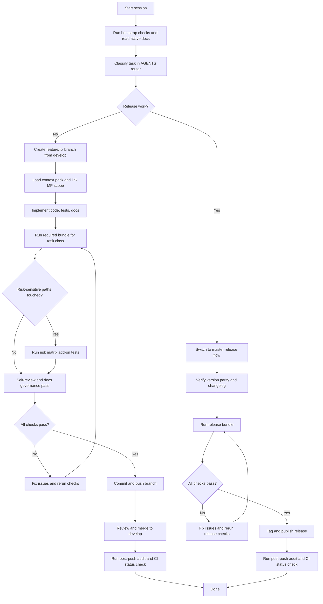
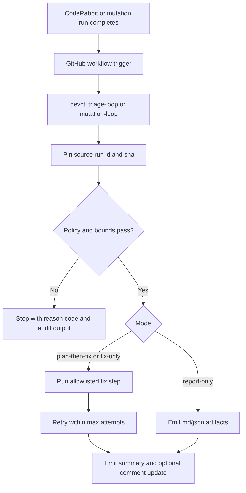
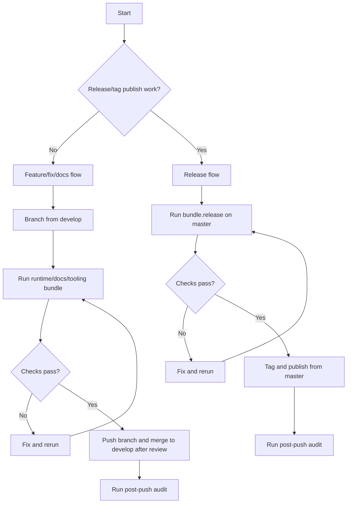

# Development

## Contents

- [Workflow ownership and routing](#workflow-ownership-and-routing)
- [End-to-end lifecycle flow](#end-to-end-lifecycle-flow)
- [What checks protect us](#what-checks-protect-us)
- [After file edits](#after-file-edits)
- [Ralph/Wiggum Loop Model](#ralphwiggum-loop-model)
- [When to push where](#when-to-push-where)
- [Project structure](#project-structure)
- [Building](#building)
- [Testing](#testing)
- [Manual QA checklist](#manual-qa-checklist)
- [Contribution workflow](#contribution-workflow)
- [Handoff paper trail template](#handoff-paper-trail-template)
- [Pre-refactor docs readiness checklist](#pre-refactor-docs-readiness-checklist)
- [Screenshot refresh capture matrix](#screenshot-refresh-capture-matrix)
- [Engineering quality review protocol](#engineering-quality-review-protocol)
- [Code style](#code-style)
- [Testing philosophy](#testing-philosophy)
- [CI/CD Workflow](#cicd-workflow)

## Fast Path

Already know the feature area? Use this short loop:

1. Read `AGENTS.md`, then `dev/active/INDEX.md` and `dev/active/MASTER_PLAN.md`.
2. Make your code, test, and doc changes in one scoped commit.
3. Run the bundle that matches your change type (`bundle.runtime`, `bundle.docs`, or `bundle.tooling`).
4. Run any risk-matrix add-ons listed in `AGENTS.md` for the paths you touched.
5. Push to a branch off `develop` (or `master` for releases only).

## Workflow ownership and routing

Use docs like this:

- **`AGENTS.md`** -- which workflow to follow (read this first).
- **`dev/guides/DEVELOPMENT.md`** (this file) -- exact commands and check steps.
- **`dev/scripts/README.md`** -- `devctl` and release command reference.
- **`dev/guides/MCP_DEVCTL_ALIGNMENT.md`** -- MCP adapter policy and extension rules.
- **`.github/workflows/README.md`** -- what each GitHub workflow does.
- **`dev/active/INDEX.md`** -- active plan docs and when to read each one.
- **`dev/active/MASTER_PLAN.md`** -- source of truth for current work.
- **`dev/active/pre_release_architecture_audit.md`** -- canonical findings + execution checklist for pre-release architecture/tooling remediation (`MP-347`, `MP-349`).
- Repo-root whole-system audits (for example `SYSTEM_AUDIT.md`) are temporary
  reference evidence only. Accepted findings must be copied into canonical
  active plans and maintainer docs; once integrated, retire the repo-root
  audit copy instead of maintaining a second roadmap.
- **`dev/active/theme_upgrade.md`** -- Theme and overlay plan.
- **`dev/active/ide_provider_modularization.md`** -- host/provider adapter modularization and compatibility plan (`MP-346`).
- **`dev/active/loop_chat_bridge.md`** -- loop output to chat runbook (`MP-338`).
- **`dev/active/review_channel.md`** -- shared review-channel plan, merged markdown-swarm lane map, and multi-agent coordination contract for the current Codex/Claude cycle.
- Closed execution plans move to `dev/archive/` only after their scoped work is
  complete and `dev/active/INDEX.md` plus discovery docs are updated in the
  same change. If a plan doc still holds unfinished or deferred backlog, keep
  it under `dev/active/`.

Start with `AGENTS.md` to pick your task class, then use this file for commands.

## End-to-end lifecycle flow

This chart shows the full loop: start a session, implement, verify, and (optionally) release.



## What checks protect us

Run the checks that match your change before pushing.
CI runs the same checks, so local failures are faster to fix.

Three quality layers matter in practice:

- Hard guards (`check_*.py`) block regressions.
- Review probes (`probe_*.py`) surface AI-style design smells without failing CI.
- `probe_mixed_concerns.py` ranks Python files that contain 3+ independent
  top-level function clusters so mixed-concern modules get split before line
  counts hide the smell.
- `check_code_shape.py` now ratchets path-override debt too: untouched legacy
  over-cap overrides still show up as warnings, but touched files, newly added
  over-cap overrides, worsened over-cap policies, and touched Python files
  with mixed-concern clusters fail the guard.
- `python3 dev/scripts/devctl.py probe-report --format md` turns those probe
  hints into one ranked review packet with topology artifacts for human or AI
  follow-up.
- Repo-root `.probe-allowlist.json` entries now apply to that canonical
  `probe-report` path too. Use `disposition: "design_decision"` when a seam
  should stay visible as a typed decision packet without counting as active
  debt; the matching key is `file` + `symbol` + `probe` when `probe` is
  declared, and the root file may carry `schema_version: 1` plus
  `contract_id: "ProbeAllowlist"`. The same packet should guide AI agents and human reviewers;
  `decision_mode` only gates whether the AI may auto-apply, should recommend,
  or must explain and wait for approval.
- Compatibility shims now use the same split governance model everywhere:
  `check_package_layout.py` enforces structural/layout policy, while
  `probe_compatibility_shims.py` ranks stale shim debt such as missing
  metadata, expired wrappers, broken targets, and shim-heavy roots/families.
- `dev/config/devctl_repo_policy.json` is the repo-local switchboard for which
  built-in guards/probes are active by default; keep enablement there instead
  of hard-coding repo behavior into `check` or `probe-report`.
- When a policy-backed slice needs a simpler human-facing entrypoint, prefer a
  short wrapper command over asking maintainers to remember raw policy paths.
  Current examples: `python3 dev/scripts/devctl.py launcher-check`,
  `python3 dev/scripts/devctl.py launcher-probes`,
  `python3 dev/scripts/devctl.py launcher-policy`, and
  `python3 dev/scripts/devctl.py tandem-validate --format md`.
- `python3 dev/scripts/devctl.py tandem-validate --format md` is the canonical
  live tandem-session validator: it resolves the proper AGENTS bundle and
  risk add-ons through `check-router`, executes that routed plan, and then
  reruns final bridge/tandem guards so Codex/Claude sessions validate against
  the real repo surface instead of a stale mini-checklist.
- Keep one workflow, not a dev-vs-agent fork:
  - `active_dual_agent` is the fully enforced Codex/Claude loop. Use
    `python3 dev/scripts/devctl.py tandem-validate --format md` after code edits.
  - `single_agent` and `tools_only` are honest solo modes for a human developer
    or one AI plus tools. Use the same routed bundles/checks, but record the
    bridge state with
    `python3 dev/scripts/devctl.py review-channel --action reviewer-heartbeat --reviewer-mode <mode> --reason <why> --terminal none --format md`
    so the system stays current without pretending a second live agent exists.
    Human-facing shorthand is allowed on the CLI: `agents` normalizes to
    `active_dual_agent`, and `developer` normalizes to `single_agent`.
  - After a real review pass, advance review truth with
    `python3 dev/scripts/devctl.py review-channel --action reviewer-checkpoint ...`
    rather than hand-editing heartbeat/hash/verdict lines separately.
  - `review-channel --action status|ensure|reviewer-heartbeat|reviewer-checkpoint`
    now emit machine-readable `reviewer_worker` state, and
    `review-channel --action ensure --follow` cadence frames carry the same
    `review_needed` signal without pretending semantic review completion.
  - If `tandem-validate` is red only because a release-lane external status
    check cannot reach GitHub or another off-repo dependency, treat that as an
    environment blocker and call it out separately from code-quality failures.
- Portable presets live under `dev/config/quality_presets/`; use those as the
  starting point when validating another repo instead of copying VoiceTerm's
  full policy surface.
- Treat repo policy/preset JSON files as versioned source, not local-only
  machine state. If a local run changes the active guard/probe surface, commit
  the touched `dev/config/devctl_repo_policy.json` and/or
  `dev/config/quality_presets/*.json` files with the code so CI sees the same
  configuration.
- `python3 dev/scripts/devctl.py quality-policy --format md` shows the resolved
  active policy, scopes, and warnings; use `--quality-policy <path>` or
  `DEVCTL_QUALITY_POLICY` when validating another repo or preset file. The same
  override now flows through probe-backed `status`, `report`, and `triage`.
- `python3 dev/scripts/devctl.py render-surfaces --format md` previews the
  policy-owned instruction/starter surfaces defined in
  `repo_governance.surface_generation`; use `--write` after updating those
  templates, context values, or generated starter outputs.
- `python3 dev/scripts/checks/check_platform_contract_closure.py` is the
  bounded platform contract-closure guard for the current runtime/artifact
  families. Pair it with `python3 dev/scripts/devctl.py platform-contracts --format md`
  after changing `dev/scripts/devctl/platform/**`, shared runtime contract
  models, durable probe/report schema constants, or startup-surface contract
  routing in repo policy.
- If you changed `script_catalog.py`, `quality_policy_defaults.py`,
  `dev/config/quality_presets/*.json`, `dev/config/devctl_repo_policy.json`,
  or added/retired a `check_*.py` or `probe_*.py` entrypoint, run both
  `quality-policy --format md` and `render-surfaces --format md` before push
  so the resolved inventory and AI/dev instruction surfaces stay aligned.

## After file edits

Any time you create a file or edit an existing file, run the task-class bundle
first, then add any extra guards required by the paths you touched. Use this as
the concrete minimum inventory after edits:

1. Run one bundle from `AGENTS.md` / `dev/scripts/devctl/bundle_registry.py`:
   `bundle.runtime`, `bundle.docs`, `bundle.tooling`, or `bundle.release`.
2. Run any required risk-matrix add-ons from `AGENTS.md` if you touched
   runtime-risky paths.
3. Make sure the applicable baseline guards below were covered by that bundle
   or run them directly if you are doing a narrower targeted validation pass:
   - `python3 dev/scripts/devctl.py check --profile ci`
   - `python3 dev/scripts/devctl.py docs-check --user-facing` or `python3 dev/scripts/devctl.py docs-check --strict-tooling`
   - `python3 dev/scripts/devctl.py hygiene`
   - `python3 dev/scripts/checks/check_active_plan_sync.py`
   - `python3 dev/scripts/checks/check_multi_agent_sync.py`
   - `python3 dev/scripts/checks/package_layout/check_instruction_surface_sync.py`
   - `python3 dev/scripts/checks/check_cli_flags_parity.py`
   - `python3 dev/scripts/checks/check_code_shape.py`
   - `python3 dev/scripts/checks/check_python_subprocess_policy.py`
   - `DEVCTL_QUALITY_POLICY=dev/config/devctl_policies/launcher.json python3 dev/scripts/checks/check_command_source_validation.py`
   - `python3 dev/scripts/checks/check_workflow_shell_hygiene.py`
   - `python3 dev/scripts/checks/check_workflow_action_pinning.py`
   - `python3 dev/scripts/checks/check_ide_provider_isolation.py --fail-on-violations`
   - `python3 dev/scripts/checks/check_compat_matrix.py`
   - `python3 dev/scripts/checks/compat_matrix_smoke.py`
   - `python3 dev/scripts/checks/check_naming_consistency.py`
   - `python3 dev/scripts/checks/check_rust_test_shape.py`
   - `python3 dev/scripts/checks/check_rust_lint_debt.py`
   - `python3 dev/scripts/checks/check_rust_best_practices.py`
   - `python3 dev/scripts/checks/check_rust_compiler_warnings.py`
   - `python3 dev/scripts/checks/check_serde_compatibility.py`
   - `python3 dev/scripts/checks/check_rust_runtime_panic_policy.py`
   - `python3 dev/scripts/checks/check_tandem_consistency.py`
   - `markdownlint -c dev/config/markdownlint.yaml -p dev/config/markdownlint.ignore README.md QUICK_START.md DEV_INDEX.md guides/*.md dev/README.md scripts/README.md pypi/README.md app/README.md`
4. If you changed shared platform/runtime contract surfaces (`dev/scripts/devctl/platform/**`,
   shared runtime contract models, durable probe/report schema constants, or
   startup-surface contract routing), also run:
   - `python3 dev/scripts/checks/check_platform_contract_closure.py`
   - `python3 dev/scripts/devctl.py platform-contracts --format md`
5. If you created a new module, refactored module/API layout, introduced
   string-based dispatch, added a new 3+ parameter signature, or touched
   concurrent/shared-state code, also run:
   - `python3 dev/scripts/devctl.py probe-report --format md`
   - Use `dev/reports/probes/latest/review_packet.md` or
     `dev/reports/probes/latest/review_packet.json` as the handoff packet.
   - For staged `devctl` or check-module splits, keep compatibility
     re-exports or aliases in the old module until every repo importer, test,
     workflow, and pre-commit path has been updated; do not remove those
     seams unless the whole import surface moves together.
   - For review-channel / triage-loop / similar control-plane commands, keep
     dry-run, report-only, and simulated-launch paths portable on CI runners:
     those flows should not require provider CLIs or GitHub API reachability
     unless they are actually executing the live action.
   - If a guard intentionally suppresses live reviewer-heartbeat freshness on
     `GITHUB_ACTIONS=true` runners, stale-bridge auto-refresh logic must still
     consult direct bridge liveness before `status` / `launch`; do not key
     auto-repair solely off the CI-relaxed guard output.
   - CI jobs that run compile-time Rust guards must install the same Rust
     toolchain and required Linux headers as the main Rust lanes before those
     guards execute; do not assume tooling-only workflows inherit Rust
     prerequisites automatically.
6. If you need to run raw Rust tests or test binaries directly, prefer:
   - `python3 dev/scripts/devctl.py guard-run --cwd rust -- cargo test ...`
   - This enforces the required post-run hygiene follow-up automatically.
   - `guard-run`, `check`, and `probe-report` now reuse the interpreter that
     launched `dev/scripts/devctl.py` for repo-owned Python subprocesses, so
     use `python3.11 dev/scripts/devctl.py ...` on machines where `python3`
     still points to an older runtime.

Use the bundle as the source of truth for exact command sets. This section is a
human-readable reminder of the minimum checks that should be covered after file
edits, not a second bundle authority.

Release note:
- `bundle.release` is intentionally stricter than normal edit validation. If
  your release range includes tooling/process/CI changes, update
  `AGENTS.md`, `dev/guides/DEVELOPMENT.md`, `dev/active/MASTER_PLAN.md`, and
  `dev/history/ENGINEERING_EVOLUTION.md`. If the release range includes
  user-facing behavior changes, update every canonical user doc, including
  `QUICK_START.md` and `guides/TROUBLESHOOTING.md`, not just the changelog.
- Mobile/control-plane changes now also need
  `python3 dev/scripts/checks/check_mobile_relay_protocol.py` covered before
  release so the Rust emitters, Python projections, and iOS consumer contract
  do not drift.

### Runtime and UI changes

| You changed... | Run locally | CI workflow |
|---|---|---|
| Rust runtime, UI behavior, or flags | `python3 dev/scripts/devctl.py check --profile ci` | `rust_ci.yml` (Ubuntu main lane + MSRV `1.88.0` + feature-mode matrix + macOS runtime smoke lane) |
| Perf, latency, wake-word, parser, workers, or security-sensitive code | `python3 dev/scripts/devctl.py check --profile prepush` plus risk-specific tests in `AGENTS.md` | `perf_smoke.yml`, `latency_guard.yml`, `wake_word_guard.yml`, `memory_guard.yml`, `parser_fuzz_guard.yml`, `security_guard.yml` |

Latency guard note:
- `dev/scripts/tests/measure_latency.sh` now resolves `rust/` first and falls back to legacy `src/`, so mixed-layout branches run the same guard command without path edits.
- `dev/scripts/tests/measure_latency.sh` also uses `set -u`-safe empty-array
  expansion for optional args, so `--voice-only --synthetic` and `--ci-guard`
  modes remain stable under strict shells.
- For human demos or quick A/B validation of STT path speed, run
  `dev/scripts/tests/compare_python_rust_voice_latency.sh --count 3` to compare
  Rust-native STT vs Python fallback using the same harness.
- For strict apples-to-apples STT benchmarking (same WAV + same model), run
  `dev/scripts/tests/compare_python_rust_stt_strict.sh --count 3 --secs 3 --whisper-model base.en`.
- If Python fallback dependencies are missing, add
  `--auto-install-whisper` to bootstrap `openai-whisper` automatically in the
  current Python environment (interactive runs also prompt by default unless
  `--no-auto-install-whisper` is passed).

### Docs and governance changes

| You changed... | Run locally | CI workflow |
|---|---|---|
| User docs (`README`, `guides/*`, `QUICK_START`) | `python3 dev/scripts/devctl.py docs-check --user-facing` | `tooling_control_plane.yml` (conditional) |
| Tooling/process/CI docs or scripts | `python3 dev/scripts/devctl.py docs-check --strict-tooling` | `tooling_control_plane.yml` |
| CodeRabbit review integration and backlog routing | `python3 dev/scripts/devctl.py triage --no-cihub --external-issues-file .cihub/coderabbit/priority.json --format md` | `coderabbit_triage.yml` |
| CodeRabbit medium/high backlog loop (policy-gated fixes + escalation comments) | `python3 dev/scripts/devctl.py triage-loop --repo owner/repo --branch develop --mode plan-then-fix --max-attempts 3 --source-event workflow_dispatch --notify summary-and-comment --comment-target auto --format md` | `coderabbit_ralph_loop.yml` |
| Mutation score remediation loop (report-only default) | `python3 dev/scripts/devctl.py mutation-loop --repo owner/repo --branch develop --mode report-only --threshold 0.80 --max-attempts 3 --format md` | `mutation_ralph_loop.yml` (workflow-run mode only when `MUTATION_LOOP_MODE` repo var is set) |
| Autonomous controller loop (bounded rounds + queue packets + phone snapshots) | `python3 dev/scripts/devctl.py autonomy-loop --repo owner/repo --plan-id acp-poc-001 --branch-base develop --mode report-only --max-rounds 6 --max-hours 4 --max-tasks 24 --checkpoint-every 1 --format json` | `autonomy_controller.yml` (scheduled mode only when `AUTONOMY_MODE` repo var is set) |
| Guarded plan-scoped swarm pipeline (scope checks + swarm + reviewer + governance + plan evidence append) | `python3 dev/scripts/devctl.py swarm_run --plan-doc dev/active/autonomous_control_plane.md --mp-scope MP-338 --mode report-only --run-label ops-guarded --format md` | `tooling_control_plane.yml` (governance/docs checks) |
| Human-readable autonomy digest bundle (dated md/json + charts) | `python3 dev/scripts/devctl.py autonomy-report --source-root dev/reports/autonomy --library-root dev/reports/autonomy/library --run-label daily-ops --format md` | `tooling_control_plane.yml` |
| Adaptive multi-agent autonomy planner/executor (Claude/Codex worker sizing up to 20 lanes) | `python3 dev/scripts/devctl.py autonomy-swarm --question-file dev/active/autonomous_control_plane.md --adaptive --min-agents 4 --max-agents 20 --plan-only --format md` | `tooling_control_plane.yml` (governance/docs checks) |
| Live swarm execution with reserved reviewer lane + automatic audit digest | `python3 dev/scripts/devctl.py autonomy-swarm --agents 10 --question-file dev/active/autonomous_control_plane.md --mode report-only --run-label ops-live --format md` | `tooling_control_plane.yml` (governance/docs checks) |
| Continuous data-science telemetry snapshots (command productivity + lane-size recommendation) | `python3 dev/scripts/devctl.py data-science --format md` (auto-refresh also runs after every devctl command unless disabled) | `tooling_control_plane.yml` (tooling/docs governance checks) |
| Loop output to chat suggestion handoff | `python3 dev/scripts/devctl.py triage-loop --repo owner/repo --branch develop --mode report-only --source-event workflow_dispatch --notify summary-only --emit-bundle --format md` + update `dev/active/loop_chat_bridge.md` | `tooling_control_plane.yml` (docs/governance contract checks) |
| Federated repo links/import workflow (your other repos) | `python3 dev/scripts/devctl.py integrations-sync --status-only --format md` and `python3 dev/scripts/devctl.py integrations-import --list-profiles --format md` | `tooling_control_plane.yml` |
| Agent/process contracts | `python3 dev/scripts/checks/check_agents_contract.py` + `python3 dev/scripts/checks/check_agents_bundle_render.py` | `tooling_control_plane.yml` |
| Active plan/index/spec sync | `python3 dev/scripts/checks/check_active_plan_sync.py` | `tooling_control_plane.yml` |
| New active-plan/check/devctl/app/workflow surfaces | `python3 dev/scripts/checks/check_architecture_surface_sync.py --since-ref origin/develop --head-ref HEAD` | `tooling_control_plane.yml` + `release_preflight.yml` |

## Ralph/Wiggum Loop Model

`codex-voice` owns the Ralph/Wiggum runtime loop behavior.
Other repos (`code-link-ide`, `ci-cd-hub`) are import sources only.



Why this model is safe:

1. It pins analysis to one source run/sha.
2. It updates comments idempotently (no spam loops).
3. It only allows policy-approved fix paths.
4. It emits structured artifacts for phone/controller/report views.
5. `gh api` helpers are handled safely without incorrect `--repo` usage.

### Release and quality drift checks

| You changed... | Run locally | CI workflow |
|---|---|---|
| Release version fields | `python3 dev/scripts/checks/check_release_version_parity.py` | `tooling_control_plane.yml` |
| CLI docs vs clap schema | `python3 dev/scripts/checks/check_cli_flags_parity.py` | `tooling_control_plane.yml` |
| Screenshot links/staleness | `python3 dev/scripts/checks/check_screenshot_integrity.py --stale-days 120` | `tooling_control_plane.yml` |
| Rust/Python source-file shape drift | `python3 dev/scripts/checks/check_code_shape.py` | `tooling_control_plane.yml` (`check_code_shape.py` also audits stale loose path overrides via review-window policy, emits advisory override-cap warnings when an untouched path override exceeds 3x the soft cap or 2x the hard cap, and fails touched Python files that still mix 3+ independent function clusters) |
| Workflow shell anti-pattern drift | `python3 dev/scripts/checks/check_workflow_shell_hygiene.py` | `tooling_control_plane.yml` + `docs-check --strict-tooling` |
| Workflow action pinning drift | `python3 dev/scripts/checks/check_workflow_action_pinning.py` | `tooling_control_plane.yml` + `workflow_lint.yml` |
| Check-script enforcement lane drift | `python3 dev/scripts/checks/check_guard_enforcement_inventory.py` | `tooling_control_plane.yml` + `release_preflight.yml` |
| AGENTS rendered bundle reference drift | `python3 dev/scripts/checks/check_agents_bundle_render.py` (`--write` to regenerate) | `tooling_control_plane.yml` + `docs-check --strict-tooling` |
| Durable guide/playbook coverage drift | `python3 dev/scripts/checks/check_guide_contract_sync.py` | `tooling_control_plane.yml` + `release_preflight.yml` + `docs-check --strict-tooling` |
| Instruction/starter surface drift | `python3 dev/scripts/checks/package_layout/check_instruction_surface_sync.py` (`python3 dev/scripts/devctl.py render-surfaces --write --format md` to regenerate) | `tooling_control_plane.yml` + `docs-check --strict-tooling` |
| Python broad-except drift (new `except Exception` / `BaseException` without rationale) | `python3 dev/scripts/checks/check_python_broad_except.py --since-ref origin/develop --head-ref HEAD` | `tooling_control_plane.yml` + `release_preflight.yml` + `devctl check --profile ci` AI guard |
| Python subprocess policy drift (`subprocess.run(...)` missing explicit `check=`) | `python3 dev/scripts/checks/check_python_subprocess_policy.py` | `tooling_control_plane.yml` + `release_preflight.yml` + `devctl check --profile ci` AI guard |
| Launcher command-source drift (`shlex.split(...)` on CLI/env/config input, raw `sys.argv` forwarding, env-controlled command argv without validators) | `DEVCTL_QUALITY_POLICY=dev/config/devctl_policies/launcher.json python3 dev/scripts/checks/check_command_source_validation.py` | `launcher-check` selectable lane (pilot rollout) |
| Host/provider naming contract drift | `python3 dev/scripts/checks/check_naming_consistency.py` | `tooling_control_plane.yml` + `devctl check --profile ci` AI guard |
| Host/provider compatibility matrix drift | `python3 dev/scripts/checks/check_compat_matrix.py` + `python3 dev/scripts/checks/compat_matrix_smoke.py` | `tooling_control_plane.yml` + `release_preflight.yml` |
| MCP allowlist/contract drift for read-only adapter surface | `python3 dev/scripts/devctl.py mcp --tool release_contract_snapshot --format json` + `python3 -m unittest dev.scripts.devctl.tests.test_mcp` | `tooling_control_plane.yml` (unit test lane) |
| Rust test-file shape drift (`*tests.rs` growth) | `python3 dev/scripts/checks/check_rust_test_shape.py` | `tooling_control_plane.yml` + `devctl check --profile ci` AI guard |
| Rust lint-debt growth (`#[allow]`, `#[allow(dead_code)]`, `unwrap/expect`, unchecked unwrap/expect, `panic!`) | `python3 dev/scripts/checks/check_rust_lint_debt.py` | `tooling_control_plane.yml` |
| Rust best-practices non-regression (`#[allow(reason)]`, `unsafe` docs, `unsafe impl` safety rationale, `mem::forget`, `Result<_, String>`, suppressed send/emit results, detached bare `thread::spawn(...)` calls, explicit `OpenOptions` create semantics, float literal equality checks, atomic persistent TOML writes, standard TOML parser usage) | `python3 dev/scripts/checks/check_rust_best_practices.py` | `tooling_control_plane.yml` |
| Serde tagged-enum compatibility drift (new tagged `Deserialize` enums without explicit fallback/strictness policy) | `python3 dev/scripts/checks/check_serde_compatibility.py` | `tooling_control_plane.yml` + `release_preflight.yml` + `devctl check --profile ci` AI guard |
| Rust runtime panic policy drift (new unallowlisted runtime `panic!`) | `python3 dev/scripts/checks/check_rust_runtime_panic_policy.py` | `tooling_control_plane.yml` + `devctl check --profile ci` AI guard |
| Rust audit anti-pattern regressions | `python3 dev/scripts/checks/check_rust_audit_patterns.py` | `security_guard.yml` + `tooling_control_plane.yml` |
| Rust security footgun regressions (`todo!/dbg!/unimplemented!`, `unreachable!()` in hot paths, shell spawns, weak crypto, PID wrap casts, permissive modes, unguarded syscall-result unsigned casts) | `python3 dev/scripts/checks/check_rust_security_footguns.py` | `tooling_control_plane.yml` |
| Rust/Python function length drift (Rust: 100 lines, Python: 150 lines) | `python3 dev/scripts/checks/check_code_shape.py` (function-level evaluation within code-shape guard) | `tooling_control_plane.yml` + `devctl check --profile ci` AI guard |
| Cross-file function body duplication (identical normalized bodies >= 6 lines) | `python3 dev/scripts/checks/check_function_duplication.py` | `tooling_control_plane.yml` + `devctl check --profile ci` AI guard |
| New-file shared helper / command scaffold clones (advisory) | `python3 dev/scripts/checks/check_duplication_audit.py --check-shared-logic --since-ref origin/develop --head-ref HEAD --report-path /tmp/voiceterm-duplication.json --format md` | local/reporting surface for now; keep advisory until false-positive behavior is well-understood |
| High-signal Clippy lint baseline drift | `python3 dev/scripts/rust_tools/collect_clippy_warnings.py --working-directory rust --output-lints-json /tmp/clippy-lints.json && python3 dev/scripts/checks/check_clippy_high_signal.py --input-lints-json /tmp/clippy-lints.json --format md` | `rust_ci.yml` |
| Accidental root argument files | `find . -maxdepth 1 -type f -name '--*'` | `tooling_control_plane.yml` |

Compatibility-matrix parser note:
- `check_compat_matrix.py`, `compat_matrix_smoke.py`, and
  `check_naming_consistency.py` now include a shared minimal YAML fallback so
  guard behavior stays consistent when `PyYAML` is not installed.
- Fallback parser behavior is fail-closed for malformed inline collection
  scalars (for example unterminated `[` blocks) to avoid silent parse drift.

Workflow permissions note:
- For `.github/workflows/scorecard.yml`, keep workflow-level permissions read-only and scope `id-token: write` plus `security-events: write` at the `analysis` job level. OpenSSF `publish_results` rejects global write permissions.

## When to push where

### Normal work (features, fixes, docs)

1. Branch from `develop` (`feature/<topic>` or `fix/<topic>`).
2. Prefer `python3 dev/scripts/devctl.py check-router --since-ref origin/develop --execute` to auto-select the required lane and risk add-ons from changed paths.
3. If you are not using `check-router`, run the matching bundle manually (`bundle.runtime`, `bundle.docs`, or `bundle.tooling`).
4. If you add or rename a `devctl` command, update the CLI inventory (`devctl list`) and the maintainer command docs in the same change so discovery stays truthful.
5. Fix any failures, then commit and push.
6. Merge to `develop` only after review and green checks.
7. Run `bundle.post-push`.

### Release/tag/publish work

1. Work on `master` only.
2. Run `bundle.release`.
3. Fix failures and rerun until green.
4. Tag and publish from `master`.
5. Run `bundle.post-push` and verify CI status.

Never push feature work directly to `master`.

Visual version:



`AGENTS.md` stays the source of truth for policy/branch workflow.
`dev/scripts/devctl/bundle_registry.py` is the source of truth for exact bundle
command lists.

## Project structure

```text
voiceterm/
├── AGENTS.md             # SDLC policy and release checklist
├── README.md             # Main user docs
├── QUICK_START.md        # Fast setup
├── app/
│   └── macos/VoiceTerm.app # macOS double-click launcher
├── .github/workflows/    # CI workflows
├── guides/
│   └── *.md               # User guides
├── dev/
│   ├── active/          # Active plans and runbooks
│   ├── audits/          # Audit runbooks and debt register
│   ├── ARCHITECTURE.md  # Runtime architecture
│   ├── DEVELOPMENT.md   # Build/test/release workflow
│   ├── scripts/         # devctl and checks
│   └── history/         # Why key changes happened
├── rust/                # Rust workspace
│   ├── src/bin/voiceterm/ # Overlay binary + UI/event loop modules
│   └── src/             # Shared runtime modules (pty, stt, config, ipc, etc.)
├── scripts/
│   └── *.sh, *.py       # Install/start/setup helpers
├── integrations/        # Pinned external repo links/imports
├── img/                 # Screenshots
├── pypi/                # PyPI packaging
├── whisper_models/      # Whisper GGML models
└── bin/                 # Install wrapper (created by install.sh)
```

For a deeper module map, use `dev/guides/ARCHITECTURE.md`.
`dev/active/MASTER_PLAN.md` is the active execution tracker.

## Building

```bash
# Rust overlay
cd rust && cargo build --release --bin voiceterm

# Rust backend (optional dev binary)
cd rust && cargo build --release
```

## Testing

```bash
# Rust tests
cd rust && cargo test

# Overlay tests
cd rust && cargo test --bin voiceterm

# Preferred AI path for raw Rust tests/test binaries:
python3 dev/scripts/devctl.py guard-run --cwd rust -- cargo test --bin voiceterm

# Required after any direct/raw cargo test invocation:
# includes host-side `process-cleanup --verify` by default
python3 dev/scripts/devctl.py check --profile quick --skip-fmt --skip-clippy --no-parallel
# Required after manual tooling bundles or before handoff when host process access is available:
python3 dev/scripts/devctl.py process-cleanup --verify --format md
# Read-only host diagnosis when cleanup must be skipped:
python3 dev/scripts/devctl.py process-audit --strict --format md
# Periodic host watch when recent detached helpers keep verify red:
python3 dev/scripts/devctl.py process-watch --cleanup --strict --stop-on-clean --iterations 6 --interval-seconds 15 --format md

# Perf smoke (voice metrics)
cd rust && cargo test --no-default-features legacy_tui::tests::perf_smoke_emits_voice_metrics -- --nocapture

# Interactive voice-path speed comparison (Rust native vs Python fallback)
dev/scripts/tests/compare_python_rust_voice_latency.sh --count 3
# Auto-bootstrap whisper CLI if the Python fallback dependency is missing
dev/scripts/tests/compare_python_rust_voice_latency.sh --count 3 --auto-install-whisper
# Short aliases to avoid wrapped long options in narrow terminals
dev/scripts/tests/compare_python_rust_voice_latency.sh --count 3 --secs 3 --tail-ms 1500 --max-capture-ms 45000
# Strict STT-only benchmark (same audio + same model for both engines)
dev/scripts/tests/compare_python_rust_stt_strict.sh --count 3 --secs 3 --whisper-model base.en

# Wake-word regression + soak guardrails
bash dev/scripts/tests/wake_word_guard.sh

# Memory guard (thread cleanup)
cd rust && cargo test --no-default-features legacy_tui::tests::memory_guard_backend_threads_drop -- --nocapture

# Security advisory policy (matches security_guard.yml)
python3 dev/scripts/devctl.py security
# Optional strict workflow scan (requires zizmor installed):
python3 dev/scripts/devctl.py security --with-zizmor --require-optional-tools
# Manual fallback:
cargo install cargo-audit --locked
cd rust && (cargo audit --json > ../rustsec-audit.json || true)
python3 ../dev/scripts/checks/check_rustsec_policy.py --input ../rustsec-audit.json --min-cvss 7.0 --fail-on-kind yanked --fail-on-kind unsound --allowlist-file ../dev/security/rustsec_allowlist.md

# Unsafe/FFI governance (for PTY/stt unsafe changes)
# 1) update invariants checklist doc:
#    dev/security/unsafe_governance.md
cd rust && cargo test pty_session::tests::pty_cli_session_drop_terminates_descendants_in_process_group -- --nocapture
cd rust && cargo test pty_session::tests::pty_overlay_session_drop_terminates_descendants_in_process_group -- --nocapture
cd rust && cargo test stt::tests::transcriber_restores_stderr_after_failed_model_load -- --nocapture

# Parser/ANSI boundary property-fuzz coverage
cd rust && cargo test pty_session::tests::prop_find_csi_sequence_respects_bounds -- --nocapture
cd rust && cargo test pty_session::tests::prop_find_osc_terminator_respects_bounds -- --nocapture
cd rust && cargo test pty_session::tests::prop_split_incomplete_escape_preserves_original_bytes -- --nocapture

# Mutation tests (single run; CI enforces 80% minimum score)
cd rust && cargo mutants --timeout 300 -o mutants.out --json
python3 ../dev/scripts/checks/check_mutation_score.py --glob "mutants.out/**/outcomes.json" --threshold 0.80 --max-age-hours 72

# Mutation tests (sharded, mirrors CI approach)
cd rust && cargo mutants --baseline skip --timeout 180 --shard 1/8 -o mutants.out --json
python3 ../dev/scripts/checks/check_mutation_score.py --glob "mutants.out/**/outcomes.json" --threshold 0.80 --max-age-hours 72

# Historical CI shard artifacts are useful for hotspot triage only.
# Final release gating must use a fresh full-shard aggregate for the current SHA.

# Mutation tests (offline/sandboxed; use a writable cache)
rsync -a ~/.cargo/ /tmp/cargo-home/
cd rust && CARGO_HOME=/tmp/cargo-home CARGO_TARGET_DIR=/tmp/cargo-target CARGO_NET_OFFLINE=true cargo mutants --timeout 300 -o mutants.out --json
python3 ../dev/scripts/checks/check_mutation_score.py --glob "mutants.out/**/outcomes.json" --threshold 0.80 --max-age-hours 72

# Auto-target only changed .rs files (default when no flag given)
python3 ../dev/scripts/mutation/cli.py

# Target specific files
python3 ../dev/scripts/mutation/cli.py --file src/pty_session/pty.rs,src/config/validation.rs

# Target a predefined module group (offline env)
python3 ../dev/scripts/mutation/cli.py --module overlay --offline --cargo-home /tmp/cargo-home --cargo-target-dir /tmp/cargo-target

# Summarize top paths with survived mutants
python3 ../dev/scripts/mutation/cli.py --results-only --top 10

# Plot hotspots (top 25% by default)
python3 ../dev/scripts/mutation/cli.py --results-only --plot --plot-scope dir --plot-top-pct 25
```

The default mode (`--changed`) auto-detects `.rs` files changed vs `master` via `git diff`, so you
only mutate what you touched. Baseline skip is on by default (the cargo-mutants sandbox baseline is
unreliable). `--results-only` auto-detects the most recent `outcomes.json` under `rust/mutants.out/`.
`check_mutation_score.py` prints the source path + age and supports
`--max-age-hours` to fail on stale outcomes.
Mutation runs can be long; plan to run them overnight and use Ctrl+C to stop if needed.

## Dev CLI (devctl)

`devctl` is the unified CLI for common developer workflows.

- See `AGENTS.md` for which bundle to run (`bundle.runtime`, `bundle.docs`, `bundle.tooling`, `bundle.release`).
- See this section for exact command syntax.
- See `dev/guides/DEVCTL_AUTOGUIDE.md` for automation-first loop orchestration (`triage-loop`, Ralph mode controls, and proposal artifacts).
- `devctl check` automatically sweeps orphaned and stale test processes before and after each run (stale active threshold: `>=600s`).
- `devctl check` runs independent setup gates (`fmt`, `clippy`, AI guard scripts) and test/build phases in parallel batches by default.

```bash
# Core checks (fmt, clippy, tests, build)
python3 dev/scripts/devctl.py check

# Match CI scope (fmt-check + clippy + tests)
python3 dev/scripts/devctl.py check --profile ci
# Optional: tune or disable parallel check batches
python3 dev/scripts/devctl.py check --profile ci --parallel-workers 2
python3 dev/scripts/devctl.py check --profile ci --no-parallel
# Optional: disable automatic orphaned/stale test-process cleanup sweep
python3 dev/scripts/devctl.py check --profile ci --no-process-sweep-cleanup

# Pre-push scope (CI + perf + mem loop)
python3 dev/scripts/devctl.py check --profile prepush

# Maintainer lint-hardening lane (strict clippy policy subset)
python3 dev/scripts/devctl.py check --profile maintainer-lint

# Optional advisory pedantic lane for intentional lint sweeps
python3 dev/scripts/devctl.py check --profile pedantic
python3 dev/scripts/devctl.py report --pedantic --pedantic-refresh --format md
python3 dev/scripts/devctl.py triage --pedantic --no-cihub --emit-bundle --format md

# AI guard lane (shape/isolation/matrix/naming + Rust quality/security guards)
python3 dev/scripts/devctl.py check --profile ai-guard

# Release verification lane (wake guard + non-blocking mutation-score reminders + strict remote CI/CodeRabbit gates)
python3 dev/scripts/devctl.py check --profile release

# Fast local iteration lane (alias of quick; local-only and never a pre-push/release replacement)
python3 dev/scripts/devctl.py check --profile fast

# Quick scope (fmt-check + clippy + AI guard scripts; keep test/build/perf-heavy checks in prepush/release lanes)
python3 dev/scripts/devctl.py check --profile quick

# Preferred AI path for raw Rust tests/test binaries; auto-runs the required post-run sweep
python3 dev/scripts/devctl.py guard-run --cwd rust -- cargo test --bin voiceterm banner::tests -- --nocapture

# Post-test process sweep + host cleanup (required after raw cargo/test-binary runs)
python3 dev/scripts/devctl.py check --profile quick --skip-fmt --skip-clippy --no-parallel
# Host-side cleanup + verify (required after manual tooling bundles or before handoff when host access is available)
python3 dev/scripts/devctl.py process-cleanup --verify --format md
# Read-only host-side Activity Monitor equivalent
python3 dev/scripts/devctl.py process-audit --strict --format md

# Path-aware pre-push router (select lane + risk add-ons from changed paths)
python3 dev/scripts/devctl.py check-router --since-ref origin/develop --execute

# Mutants wrapper (offline cache)
python3 dev/scripts/devctl.py mutants --module overlay --offline \
  --cargo-home /tmp/cargo-home --cargo-target-dir /tmp/cargo-target

# Mutants wrapper (run one shard)
python3 dev/scripts/devctl.py mutants --module overlay --shard 1/8

# Check mutation score only
python3 dev/scripts/devctl.py mutation-score --threshold 0.80 --max-age-hours 72

# Docs check (user-facing changes must update docs + changelog)
python3 dev/scripts/devctl.py docs-check --user-facing

# Tooling/release docs policy (change-class aware + deprecated-command guard)
python3 dev/scripts/devctl.py docs-check --strict-tooling

# Post-commit docs check over a commit range (works on clean trees)
python3 dev/scripts/devctl.py docs-check --user-facing --since-ref origin/develop

# Governance hygiene audit (archive + ADR + scripts docs + orphaned repo-process guard)
python3 dev/scripts/devctl.py hygiene
# Optional: promote hygiene warnings to failures (CI governance/release default)
python3 dev/scripts/devctl.py hygiene --strict-warnings
# Optional: remove detected dev/scripts/**/__pycache__ dirs after local test runs
python3 dev/scripts/devctl.py hygiene --fix
# Report-retention cleanup flow (run when hygiene warns about stale/heavy reports)
python3 dev/scripts/devctl.py reports-cleanup --dry-run
python3 dev/scripts/devctl.py reports-cleanup --max-age-days 30 --keep-recent 10 --yes
# External paper/site drift for tracked publications
python3 dev/scripts/devctl.py publication-sync --format md
# After updating an external publication, record the new synced source ref
python3 dev/scripts/devctl.py publication-sync --publication terminal-as-interface --record-source-ref HEAD --record-external-ref <external-site-commit> --format md

# Audit metrics summary + charts (scientific audit-cycle evidence)
python3 dev/scripts/audits/audit_metrics.py \
  --input dev/reports/audits/baseline-events.jsonl \
  --output-md dev/reports/audits/baseline-metrics.md \
  --output-json dev/reports/audits/baseline-metrics.json \
  --chart-dir dev/reports/audits/charts
# devctl now auto-emits one event row per command run (override cycle/source as needed)
DEVCTL_AUDIT_CYCLE_ID=baseline-2026-02-24 DEVCTL_EXECUTION_SOURCE=script_only \
python3 dev/scripts/devctl.py status --ci --format md

# Security guard (RustSec policy + optional workflow scanner)
python3 dev/scripts/devctl.py security
python3 dev/scripts/devctl.py security --with-zizmor --require-optional-tools

# AGENTS + active-plan contract + release parity guards
python3 dev/scripts/checks/check_agents_contract.py
python3 dev/scripts/checks/check_agents_bundle_render.py
python3 dev/scripts/checks/check_active_plan_sync.py
python3 dev/scripts/checks/check_release_version_parity.py

# CLI schema/docs parity check (clap long flags vs guides/CLI_FLAGS.md)
python3 dev/scripts/checks/check_cli_flags_parity.py

# Screenshot reference integrity + stale-age report
python3 dev/scripts/checks/check_screenshot_integrity.py --stale-days 120

# Source-shape guard (blocks new Rust/Python God-file growth)
python3 dev/scripts/checks/check_code_shape.py

# Rust test-file shape non-regression guard
python3 dev/scripts/checks/check_rust_test_shape.py

# Rust lint-debt non-regression guard (changed-file growth only)
python3 dev/scripts/checks/check_rust_lint_debt.py

# Rust best-practices non-regression guard (changed-file growth only)
python3 dev/scripts/checks/check_rust_best_practices.py

# Runtime panic policy non-regression guard (changed-file growth only)
python3 dev/scripts/checks/check_rust_runtime_panic_policy.py

# Rust audit anti-pattern regression guard (runtime source scan)
python3 dev/scripts/checks/check_rust_audit_patterns.py

# Rust security-footguns non-regression guard (runtime-focused changed-file growth only)
python3 dev/scripts/checks/check_rust_security_footguns.py

# Optional clippy high-signal baseline check
python3 dev/scripts/rust_tools/collect_clippy_warnings.py --working-directory rust --output-lints-json /tmp/clippy-lints.json
python3 dev/scripts/checks/check_clippy_high_signal.py --input-lints-json /tmp/clippy-lints.json --format md

# Release/distribution control plane
# Run same-SHA preflight first
gh workflow run release_preflight.yml -f version=X.Y.Z
# Then run aggregated release gates (triage + preflight + ralph)
CI=1 python3 dev/scripts/devctl.py release-gates --branch master --sha "$(git rev-parse HEAD)" --wait-seconds 1800 --poll-seconds 20 --format md
python3 dev/scripts/devctl.py release --version X.Y.Z
# Optional metadata prep (Cargo/PyPI/app plist/changelog)
python3 dev/scripts/devctl.py release --version X.Y.Z --prepare-release
python3 dev/scripts/devctl.py ship --version X.Y.Z --verify --tag --notes --github --yes
# One-command prep + verify + tag + notes + GitHub release
python3 dev/scripts/devctl.py ship --version X.Y.Z --prepare-release --verify --tag --notes --github --yes
gh run list --workflow publish_pypi.yml --limit 1
gh run list --workflow publish_homebrew.yml --limit 1
gh run list --workflow publish_release_binaries.yml --limit 1
gh run list --workflow release_attestation.yml --limit 1
gh workflow run publish_homebrew.yml -f version=X.Y.Z -f release_branch=master
gh workflow run coderabbit_ralph_loop.yml -f branch=develop -f max_attempts=3 -f execution_mode=plan-then-fix
gh workflow run mutation_ralph_loop.yml -f branch=develop -f execution_mode=report-only -f threshold=0.80

# Manual fallback (local PyPI/Homebrew publish)
python3 dev/scripts/devctl.py pypi --upload --yes
python3 dev/scripts/devctl.py homebrew --version X.Y.Z
python3 dev/scripts/devctl.py ship --version X.Y.Z --pypi --verify-pypi --homebrew --yes

# Generate a report (JSON/MD)
python3 dev/scripts/devctl.py report --format json --output /tmp/devctl-report.json
# Advisory pedantic summary from saved or freshly refreshed artifacts
python3 dev/scripts/devctl.py report --pedantic --pedantic-refresh --format json --output /tmp/devctl-pedantic-report.json

# Include recent GitHub Actions runs (requires gh auth)
python3 dev/scripts/devctl.py status --ci --format md

# Bounded CodeRabbit medium/high loop with report/fix artifacts
python3 dev/scripts/devctl.py triage-loop --repo owner/repo --branch develop --mode plan-then-fix --max-attempts 3 --source-event workflow_dispatch --notify summary-and-comment --comment-target auto --emit-bundle --bundle-dir .cihub/coderabbit --bundle-prefix coderabbit-ralph-loop --mp-proposal --format md --output /tmp/coderabbit-ralph-loop.md --json-output /tmp/coderabbit-ralph-loop.json
# Advisory pedantic triage packet from saved check artifacts
python3 dev/scripts/devctl.py triage --pedantic --no-cihub --emit-bundle --bundle-dir .cihub --bundle-prefix pedantic-triage --format md --output /tmp/devctl-pedantic-triage.md
# Bounded mutation loop with report-only default and policy-gated fix mode
python3 dev/scripts/devctl.py mutation-loop --repo owner/repo --branch develop --mode report-only --threshold 0.80 --max-attempts 3 --emit-bundle --bundle-dir .cihub/mutation --bundle-prefix mutation-ralph-loop --format md --output /tmp/mutation-ralph-loop.md --json-output /tmp/mutation-ralph-loop.json
# Bounded autonomy controller loop with checkpoint packet + queue artifacts
# (also refreshes phone-ready status snapshots under dev/reports/autonomy/queue/phone/)
python3 dev/scripts/devctl.py autonomy-loop --repo owner/repo --plan-id acp-poc-001 --branch-base develop --mode report-only --max-rounds 6 --max-hours 4 --max-tasks 24 --checkpoint-every 1 --loop-max-attempts 1 --packet-out dev/reports/autonomy/packets --queue-out dev/reports/autonomy/queue --format json --output /tmp/autonomy-controller.json
# Human-readable autonomy digest bundle (dated md/json + charts)
python3 dev/scripts/devctl.py autonomy-report --source-root dev/reports/autonomy --library-root dev/reports/autonomy/library --run-label daily-ops --format md --output /tmp/autonomy-report.md --json-output /tmp/autonomy-report.json
# Full guarded plan-scoped swarm path (scope load + swarm + reviewer + governance + plan-evidence append)
python3 dev/scripts/devctl.py swarm_run --plan-doc dev/active/autonomous_control_plane.md --mp-scope MP-338 --agents 10 --mode report-only --run-label swarm-guarded --format md --output /tmp/swarm-run.md --json-output /tmp/swarm-run.json
# Adaptive autonomy swarm (metadata-based sizing + optional token-budget cap)
python3 dev/scripts/devctl.py autonomy-swarm --question "large runtime refactor touching parser/security/workspace" --prompt-tokens 48000 --token-budget 120000 --max-agents 20 --parallel-workers 6 --dry-run --no-post-audit --run-label swarm-plan --format md --output /tmp/autonomy-swarm.md --json-output /tmp/autonomy-swarm.json
# Live swarm defaults (reserves AGENT-REVIEW lane when possible + auto-runs post-audit digest)
python3 dev/scripts/devctl.py autonomy-swarm --agents 10 --question-file dev/active/autonomous_control_plane.md --mode report-only --run-label swarm-live --format md --output /tmp/autonomy-swarm-live.md --json-output /tmp/autonomy-swarm-live.json

# Include guarded Dev Mode JSONL summaries (event counts + latency)
python3 dev/scripts/devctl.py status --dev-logs --format md
python3 dev/scripts/devctl.py report --dev-logs --dev-sessions-limit 10 --format md

# Pipe report output to a CLI that accepts stdin (requires login)
python3 dev/scripts/devctl.py report --format md --pipe-command codex
python3 dev/scripts/devctl.py report --format md --pipe-command claude
# If your CLI needs a stdin flag, pass it via --pipe-args.
```

Implementation layout:

- `dev/scripts/devctl.py`: thin entrypoint wrapper
- `dev/scripts/devctl/cli.py`: argument parsing and dispatch
- `dev/scripts/devctl/commands/`: per-command implementations
- `dev/scripts/devctl/common.py`: shared helpers (run_cmd, env, output)
- `dev/scripts/devctl/collect.py`: git/CI/mutation summaries for reports

Legacy shell scripts in `dev/scripts/*.sh` are compatibility adapters.
Use `devctl` as the main maintainer workflow.

## Manual QA checklist

- [ ] Auto-voice status visibility: Full HUD keeps mode label (`AUTO`/`PTT`) while active-state text (`Recording`/`Processing`) and meter remain visible.
- [ ] Queue flush works in both insert and auto send modes.
- [ ] Prompt logging is off by default unless explicitly enabled.
- [ ] Two terminals can run independently without shared state leaks.

## Contribution workflow

- Open or comment on an issue for non-trivial changes so scope and UX expectations are aligned.
- Keep UX tables/controls lists and docs in sync with behavior.
- Update `dev/CHANGELOG.md` for user-facing changes and note verification steps in PRs.

## Handoff paper trail template

For substantive sessions, include this in the PR description or handoff summary:

```md
## Session Handoff

- Scope:
- Code/doc paths touched:

### Verification

- `python3 dev/scripts/devctl.py check --profile ci`
- `python3 dev/scripts/devctl.py docs-check --strict-tooling`
- `python3 dev/scripts/devctl.py hygiene` audits archive/ADR/scripts governance, flags orphaned/stale repo-related host process trees (matched `cargo test --bin voiceterm`, `voiceterm-*`, stress sessions, repo-runtime cargo/target trees, orphaned repo-tooling wrappers that execute `dev/scripts/**`, and repo-cwd background helpers such as `python3 -m unittest`, direct `bash dev/scripts/...` wrappers, or `qemu/node/make` descendants that outlive their repo-owned parent; `stale` = active for `>=600s`), warns when managed `dev/reports/**` artifacts become stale/heavy, and surfaces tracked external-publication drift when watched repo paths outpace synced papers/sites; `--strict-warnings` promotes warnings to failures (used in CI governance/release lanes), and `--fix` removes detected `dev/scripts/**/__pycache__` directories.
- `python3 dev/scripts/devctl.py guard-run --cwd rust -- cargo test ...` is the preferred AI path for raw Rust tests/test binaries. It rejects shell `-c` wrappers, runs the command directly, then automatically executes the required post-test hygiene follow-up (`check --profile quick --skip-fmt --skip-clippy --no-parallel` for runtime/test commands, `process-cleanup --verify` for lower-risk repo tooling commands).
- `python3 dev/scripts/devctl.py process-cleanup --verify --format md` is the default host-side cleanup path for repo-related work. `check --profile quick|fast` already runs it by default after raw cargo/test-binary follow-ups; run it directly after manual tooling bundles and before handoff when host process access is available. It kills orphaned/stale repo-related process trees including descendant PTY children, repo-cwd background helpers, and orphaned tooling descendants, skips recent active processes, reruns a strict host audit afterward, and should be rerun once any intentional local work finishes.
- `python3 dev/scripts/devctl.py process-audit --strict --format md` is the read-only host-side Activity Monitor equivalent for repo-related work. Use it when cleanup must be skipped or when you need diagnosis without killing processes; unlike sandboxed sweeps, it fails hard if `ps` access is unavailable or if any blocking/stale repo-related process tree is still alive, including generic repo-cwd helpers that no longer mention `voiceterm` or `dev/scripts` in their command line.
- `python3 dev/scripts/devctl.py process-watch --cleanup --strict --stop-on-clean --iterations 6 --interval-seconds 15 --format md` is the bounded periodic monitor for long-running leak reproduction or repeated local host work. It reruns the same host audit/cleanup logic on a cadence and should be the default when one final cleanup pass is not enough.
- `python3 dev/scripts/devctl.py reports-cleanup --dry-run` previews retention cleanup candidates when hygiene warns on report drift.
- `python3 dev/scripts/devctl.py publication-sync --format md` reports watched-path drift for tracked external papers/sites and records a new baseline with `--record-source-ref HEAD` after the external publish is complete.
- `python3 dev/scripts/checks/check_agents_contract.py`
- `python3 dev/scripts/checks/check_agents_bundle_render.py`
- `python3 dev/scripts/checks/check_active_plan_sync.py`
- `python3 dev/scripts/checks/check_release_version_parity.py`
- `python3 dev/scripts/checks/check_cli_flags_parity.py`
- `python3 dev/scripts/checks/check_screenshot_integrity.py --stale-days 120`
- `python3 dev/scripts/checks/check_code_shape.py`
- `python3 dev/scripts/checks/check_rust_test_shape.py`
- `python3 dev/scripts/checks/check_rust_lint_debt.py`
- `python3 dev/scripts/checks/check_rust_best_practices.py`
- `python3 dev/scripts/checks/check_rust_runtime_panic_policy.py`

### Documentation decisions

- `README.md`: updated | no change needed (reason)
- `QUICK_START.md`: updated | no change needed (reason)
- `guides/USAGE.md`: updated | no change needed (reason)
- `guides/CLI_FLAGS.md`: updated | no change needed (reason)
- `guides/INSTALL.md`: updated | no change needed (reason)
- `guides/TROUBLESHOOTING.md`: updated | no change needed (reason)
- `dev/guides/ARCHITECTURE.md`: updated | no change needed (reason)
- `dev/guides/DEVELOPMENT.md`: updated | no change needed (reason)
- `dev/scripts/README.md`: updated | no change needed (reason)
- `dev/history/ENGINEERING_EVOLUTION.md`: updated | no change needed (reason)

### Screenshots

- Refreshed: (list `img/...` files)
- Deferred with reason:

### Follow-ups

- MP items:
- Risks/unknowns:
- Rust references consulted (for non-trivial Rust changes):

### Structured telemetry / ledger updates

- `devctl` commands run this session (auto-emitted to `devctl_events.jsonl`):
- `governance-review --record` rows added this session:
- `false_positive` rows added this session and their root-cause follow-ups:
- Deferred findings left open in the ledger:
- Non-`devctl` work or telemetry gaps to call out explicitly:
```

### New conversation resume prompt

When you start a fresh AI conversation, paste a short prompt like this instead
of re-explaining the whole project:

```md
Continue from the repo's current state. Do not start from scratch.

Read:
- `AGENTS.md`
- `dev/active/INDEX.md`
- `dev/active/MASTER_PLAN.md`
- `dev/active/ai_governance_platform.md`

Treat `dev/active/ai_governance_platform.md` as the only main active plan for
the standalone governance product scope. Read its `Session Resume` section and
latest `Progress Log` entries first, then continue the listed next actions
unless I reprioritize.

Before you finish, update `dev/active/ai_governance_platform.md`:
- `Session Resume`
- `Progress Log`

Also run the required repo checks for any files you edit.
```

For `MP-377` work, prefer updating the plan's `Session Resume` section over
keeping "where we left off" only in chat. The chat can summarize, but the repo
should hold the canonical restart state.

Structured audit/event ledgers are separate from that handoff surface:

- `dev/reports/audits/devctl_events.jsonl` records machine-readable `devctl`
  command telemetry automatically.
- `dev/reports/governance/finding_reviews.jsonl` records adjudicated
  guard/probe outcomes through `python3 dev/scripts/devctl.py governance-review`.
- Use those ledgers for metrics, runtime evidence, later database indexing,
  and ML/ranking inputs, not for narrative "left off here" session state.
- Practical operator rule:
  - use `devctl` commands whenever the work should land in command telemetry;
  - before handoff, append `governance-review --record` rows for any findings
    you confirmed, fixed, deferred, waived, or judged false-positive;
  - if you record a `false_positive`, add the root-cause analysis and the
    planned rule/policy fix to the handoff instead of stopping at the verdict;
  - if part of the session happened outside `devctl` and was not captured by
    the ledgers, say so in the handoff instead of implying complete coverage.

Root artifact prevention: run `find . -maxdepth 1 -type f -name '--*'` and remove accidental files before push.

## Pre-refactor docs readiness checklist

Use this checklist before larger UI/behavior refactors to avoid documentation drift:

- [ ] `README.md` updated (features list, screenshots, quick overview).
- [ ] `QUICK_START.md` updated (install steps and common commands).
- [ ] `guides/USAGE.md` updated (controls, status messages, theme list).
- [ ] `guides/CLI_FLAGS.md` updated (flags and defaults).
- [ ] `guides/INSTALL.md` updated (dependencies, setup steps, PATH notes).
- [ ] `guides/TROUBLESHOOTING.md` updated (new known issues/fixes).
- [ ] `img/` screenshots refreshed if UI output/controls changed.

## Screenshot refresh capture matrix

Use this matrix whenever UI/overlay behavior changes so screenshot updates are
targeted instead of ad-hoc.

| Surface | Image path | Refresh trigger |
|---|---|---|
| Recording flow | `img/recording.png` | Record/processing/responding lane visuals or controls row changes |
| Settings overlay | `img/settings.png` | Settings rows, footer hints, slider visuals, read-only/lock labels |
| Theme picker | `img/theme-picker.png` | Theme list visuals, lock/dim behavior, picker footer text |
| Hidden HUD | `img/hidden-hud.png` | Hidden launcher text/buttons, collapsed/open behavior, muted styling |
| Transcript history overlay | `img/transcript-history.png` | Search row, selection/replay behavior, footer controls |
| Help overlay | `img/help-overlay.png` | Shortcut grouping, footer controls, docs/troubleshooting links |
| Claude prompt-safe state | `img/claude-prompt-suppression.png` | HUD suppression/resume behavior around Claude approval prompts |

Docs governance guardrails:

- `python3 dev/scripts/checks/check_cli_flags_parity.py` keeps clap long flags and `guides/CLI_FLAGS.md` synchronized.
- `python3 dev/scripts/checks/check_screenshot_integrity.py --stale-days 120` verifies image references and reports stale screenshots.
- `python3 dev/scripts/checks/check_code_shape.py` blocks Rust/Python source-file shape drift (new oversized files, oversized-file growth, path-level hotspot growth budgets for Phase 3C decomposition targets, and touched Python files that still mix 3+ independent function clusters) and surfaces advisory override-cap warnings only for untouched path overrides that exceed 3x the soft cap or 2x the hard cap.
- `python3 dev/scripts/checks/check_rust_test_shape.py` blocks non-regressive growth of oversized Rust test hotspots (`tests.rs`, `tests/**`) with path-specific budgets for known large suites.
- `python3 dev/scripts/checks/check_rust_lint_debt.py` blocks non-regressive growth of `#[allow(...)]` attributes (including `#[allow(dead_code)]`), non-test `unwrap/expect`, `unwrap_unchecked/expect_unchecked`, and `panic!` call-sites in changed Rust files; use `--report-dead-code` to inventory instances and `--fail-on-undocumented-dead-code` / `--fail-on-any-dead-code` for stricter policy modes.
- `python3 dev/scripts/checks/check_python_broad_except.py` blocks newly added broad Python handlers (`except Exception` / `except BaseException`) unless a nearby `broad-except: allow reason=...` comment makes the fail-soft behavior explicit.
- `python3 dev/scripts/checks/check_python_subprocess_policy.py` blocks repo-owned Python tooling and Operator Console code from adding `subprocess.run(...)` calls without an explicit `check=` keyword, keeping subprocess failure handling intentional instead of relying on the default.
- `DEVCTL_QUALITY_POLICY=dev/config/devctl_policies/launcher.json python3 dev/scripts/checks/check_command_source_validation.py` blocks the launcher/package pilot lane from reintroducing unsafe command construction patterns such as `shlex.split(...)` on untrusted input, raw `sys.argv` forwarding, and env-driven command argv without a validator helper.
- `python3 dev/scripts/checks/check_rust_best_practices.py` blocks non-regressive growth of reason-less `#[allow(...)]`, undocumented `unsafe { ... }` blocks, public `unsafe fn` surfaces without `# Safety` docs, `unsafe impl` blocks without nearby safety rationale, `std::mem::forget`/`mem::forget` usage, `Result<_, String>` surfaces, suppressed `send(...)`/`try_send(...)` and `emit(...)` results, bare detached `thread::spawn(...)` statements without a nearby `detached-thread: allow reason=...` note, suspicious `OpenOptions::new().create(true)` chains that omit explicit overwrite semantics (`append(true)`, `truncate(...)`, or `create_new(true)`), direct `==` / `!=` comparisons against float literals, app-owned persistent TOML writes that still overwrite the final file directly instead of using a temp-file swap, and hand-rolled persistent TOML parsers in changed Rust files.
- `python3 dev/scripts/checks/check_serde_compatibility.py` blocks newly introduced internally/adjacently tagged Rust `Deserialize` enums unless they either define a `#[serde(other)]` fallback variant or document intentional fail-closed behavior with a nearby `serde-compat: allow reason=...` comment.
- `python3 dev/scripts/checks/check_rust_runtime_panic_policy.py` blocks non-regressive growth of unallowlisted runtime `panic!` call-sites unless nearby rationale comments (`panic-policy: allow reason=...`) are present.
- `python3 dev/scripts/checks/check_rust_audit_patterns.py` blocks reintroduction of known high-risk runtime audit anti-patterns across `rust/src/**`.
- `python3 dev/scripts/checks/check_rust_security_footguns.py` blocks non-regressive growth of risky runtime patterns (`todo!/dbg!/unimplemented!`, `unreachable!()` in runtime hot paths, shell-style spawns, permissive modes, weak-crypto references, PID wrap-prone casts like `child.id() as i32` / `libc::getpid() as i32`, and syscall-return casts to unsigned types without a prior sign guard) while excluding `#[cfg(test)]` blocks.
- `.github/workflows/rust_ci.yml` enforces a high-signal Clippy lint baseline by emitting lint-code histogram JSON (`collect_clippy_warnings.py --output-lints-json`) and running `check_clippy_high_signal.py`.
- `python3 dev/scripts/devctl.py docs-check --strict-tooling` now also requires `dev/history/ENGINEERING_EVOLUTION.md` when tooling/process/CI surfaces change and enforces markdown metadata-header normalization (`Status`/`Last updated`/`Owner`), workflow-shell hygiene (`check_workflow_shell_hygiene.py`), and repo-policy-owned durable guide coverage through `check_guide_contract_sync.py`.
- `python3 dev/scripts/checks/check_workflow_action_pinning.py` blocks non-SHA and dynamic `uses:` refs in workflow files.
- `python3 dev/scripts/checks/check_guard_enforcement_inventory.py` blocks registered check scripts from drifting out of bundle/workflow enforcement lanes unless they are explicitly marked helper-only, manual-only, or temporary advisory backlog exceptions.
- `python3 dev/scripts/checks/check_agents_bundle_render.py` blocks AGENTS rendered bundle-reference drift against `dev/scripts/devctl/bundle_registry.py` and can regenerate the section with `--write`.
- `devctl` structured status reports for `check`/`triage` now emit UTC timestamps for deterministic run-correlation across local + CI artifacts.
- `python3 dev/scripts/checks/check_agents_contract.py` validates required `AGENTS.md` SOP sections/bundles/router rows.
- `python3 dev/scripts/checks/check_active_plan_sync.py` validates `dev/active/INDEX.md` registry coverage, tracker authority, active-doc cross-link integrity, and `MP-*` scope parity between index/spec docs and `MASTER_PLAN`.
- `python3 dev/scripts/checks/check_release_version_parity.py` validates Cargo/PyPI/macOS release version parity.
- `find . -maxdepth 1 -type f -name '--*'` catches accidental root-level argument artifact files.

## Engineering quality review protocol

Use this protocol for non-trivial runtime/tooling Rust changes.

1. Validate approach against official Rust references before coding:
   - Rust Book: `https://doc.rust-lang.org/book/`
   - Rust Reference: `https://doc.rust-lang.org/reference/`
   - Rust API Guidelines: `https://rust-lang.github.io/api-guidelines/`
   - Rustonomicon (unsafe/FFI): `https://doc.rust-lang.org/nomicon/`
   - Standard library docs: `https://doc.rust-lang.org/std/`
   - Clippy lint index: `https://rust-lang.github.io/rust-clippy/master/`
2. Keep names stable and behavior-oriented:
   - function and type names should describe behavior, not implementation detail
   - prefer explicit domain terms over ambiguous abbreviations
3. Keep modules cohesive and bounded:
   - split files before they become multi-domain “god files”
   - consolidate duplicated helpers shared by status/theme/settings/overlay paths
4. Make debt visible:
   - avoid adding `#[allow(...)]` without clear rationale and follow-up plan
   - avoid non-test `unwrap/expect` unless failure is provably unrecoverable
5. Capture review evidence in handoff:
   - list which Rust references were consulted
   - note tradeoffs made for naming, API shape, and scalability

## Code style

- Rust: run `cargo fmt` and `cargo clippy --workspace --all-features -- -D warnings`.
- Keep changes small and reviewable; avoid unrelated refactors.
- Prefer explicit error handling in user-facing flows (status line + logs) so failures are observable.

## Testing philosophy

- Favor fast unit tests for parsing, queueing, and prompt detection logic.
- Add regression tests when fixing a reported bug.
- Run at least `cargo test` locally for most changes; add targeted bin tests for overlay-only work.

## CI/CD Workflow

GitHub Actions lanes used by this repo:
For simple per-workflow intent/triggers, see `.github/workflows/README.md`.

| Workflow | File | What it checks |
|----------|------|----------------|
| Rust TUI CI | `.github/workflows/rust_ci.yml` | Ubuntu build/test/clippy/fmt/doc, MSRV `1.88.0` check, feature-mode matrix (`default` + `--no-default-features`), macOS runtime smoke, aggregate CI badge update, and Clippy warning-count badge update |
| Voice Mode Guard | `.github/workflows/voice_mode_guard.yml` | Focused macros toggle + send-mode label regressions |
| Wake Word Guard | `.github/workflows/wake_word_guard.yml` | Wake-word regression + soak guardrails |
| Perf Smoke | `.github/workflows/perf_smoke.yml` | Perf smoke test + metrics verification |
| Latency Guard | `.github/workflows/latency_guard.yml` | Synthetic latency regression guardrails |
| Memory Guard | `.github/workflows/memory_guard.yml` | 20x memory guard loop |
| Mutation Testing | `.github/workflows/mutation-testing.yml` | sharded scheduled mutation run + aggregated score report (threshold is advisory/non-blocking via `--report-only`) |
| Mutation Ralph Loop | `.github/workflows/mutation_ralph_loop.yml` | bounded follow-up mutation remediation loop with report-only default; `workflow_run` mode is opt-in via `MUTATION_LOOP_MODE` (`always`/`success-only`/`failure-only`) |
| Security Guard | `.github/workflows/security_guard.yml` | RustSec advisory policy gate (high/critical threshold + yanked/unsound fail list), changed-file Python security scope on push/PR diffs, optional `zizmor` lane (`SECURITY_ZIZMOR_MODE=enforce` to hard-fail; unset/off disables) |
| Parser Fuzz Guard | `.github/workflows/parser_fuzz_guard.yml` | property-fuzz parser/ANSI-OSC boundary coverage |
| Coverage Upload | `.github/workflows/coverage.yml` | rust coverage via `cargo llvm-cov` + Codecov upload (OIDC); runs on every push to `develop`/`master` to keep branch-head coverage current |
| Docs Lint | `.github/workflows/docs_lint.yml` | markdown style/readability checks for key published docs |
| Lint Hardening | `.github/workflows/lint_hardening.yml` | maintainer lint-hardening profile (`devctl check --profile maintainer-lint`) with strict clippy subset for redundant clones/closures, risky wrap casts, and dead-code drift; broader `check --profile pedantic` remains local/advisory and intentionally stays out of required CI/release lanes |
| CodeRabbit Triage Bridge | `.github/workflows/coderabbit_triage.yml` | normalizes CodeRabbit review/check signals into triage artifacts and blocks unresolved medium/high findings |
| CodeRabbit Ralph Loop | `.github/workflows/coderabbit_ralph_loop.yml` | branch-scoped always-on (configurable) medium/high backlog loop with mode controls (`report-only`, `plan-then-fix`, `fix-only`) and optional auto-fix command |
| Autonomy Controller | `.github/workflows/autonomy_controller.yml` | bounded controller orchestration (`autonomy-loop`) with checkpoint packet/queue artifacts and optional PR promote step; scheduled runs are enabled only when `AUTONOMY_MODE` is set |
| Autonomy Run | `.github/workflows/autonomy_run.yml` | one-command guarded swarm pipeline (`swarm_run`) with plan-scope validation, reviewer lane, governance checks, and run artifact upload |
| Failure Triage | `.github/workflows/failure_triage.yml` | workflow-run failure bundle capture and triage snapshot for high-signal failed lanes (`failure`/`timed_out`/`action_required`) |
| Tooling Control Plane | `.github/workflows/tooling_control_plane.yml` | devctl unit tests, shell adapter integrity, and docs governance policy (`docs-check --strict-tooling` with Engineering Evolution enforcement, metadata-header normalization guard, workflow-shell hygiene guard, guide-contract sync guard, workflow action-pinning guard, conditional strict user-facing docs-check, hygiene, AGENTS contract guard, active-plan sync guard, release-version parity guard, markdownlint, CLI flag parity, screenshot integrity, code-shape guard, naming consistency guard, rust test-shape guard, rust lint-debt guard, rust runtime panic-policy guard, root artifact guard) |
| Release Preflight | `.github/workflows/release_preflight.yml` | manual release-gate workflow (runtime CI + docs/governance bundle + release distribution dry-run smoke for requested version) |
| Publish PyPI | `.github/workflows/publish_pypi.yml` | publishes `voiceterm` to PyPI when a GitHub release is published (requires successful `Release Preflight`, CodeRabbit gate, and Ralph gate checks for the release commit) |
| Publish Homebrew | `.github/workflows/publish_homebrew.yml` | updates `homebrew-voiceterm` tap formula when a GitHub release is published or manual dispatch is requested (requires successful `Release Preflight`, CodeRabbit gate, and Ralph gate checks for the release commit) |
| Publish Release Binaries | `.github/workflows/publish_release_binaries.yml` | builds and uploads native release binaries (requires successful `Release Preflight`, CodeRabbit gate, and Ralph gate checks for the release commit) |
| Release Attestation | `.github/workflows/release_attestation.yml` | creates source provenance attestations for release artifacts (requires successful `Release Preflight`, CodeRabbit gate, and Ralph gate checks for the release commit) |

Workflow hardening baseline:

- Keep all workflow action refs pinned to commit SHAs (`uses: ...@<40-hex>`).
- Keep explicit top-level `permissions:` and `concurrency:` in every workflow.
- Prefer `contents: read` defaults, and elevate to `contents: write` only on jobs
  that must commit/push automation artifacts.

**Before pushing, run locally (recommended):**

```bash
# Core CI (matches rust_ci.yml)
make ci

# Full push/PR suite (adds perf smoke + memory guard loop)
make prepush

# Governance/doc architecture hygiene
python3 dev/scripts/devctl.py hygiene
python3 dev/scripts/devctl.py hygiene --strict-warnings
python3 dev/scripts/devctl.py hygiene --fix
python3 dev/scripts/devctl.py docs-check --strict-tooling
python3 dev/scripts/checks/check_agents_contract.py
python3 dev/scripts/checks/check_agents_bundle_render.py
python3 dev/scripts/checks/check_active_plan_sync.py
python3 dev/scripts/checks/check_release_version_parity.py
python3 dev/scripts/checks/check_cli_flags_parity.py
python3 dev/scripts/checks/check_screenshot_integrity.py --stale-days 120
python3 dev/scripts/checks/check_code_shape.py
python3 dev/scripts/checks/check_rust_test_shape.py
python3 dev/scripts/checks/check_rust_lint_debt.py
python3 dev/scripts/checks/check_rust_best_practices.py
python3 dev/scripts/checks/check_rust_runtime_panic_policy.py
find . -maxdepth 1 -type f -name '--*'

# Security advisory policy gate (matches security_guard.yml)
python3 dev/scripts/devctl.py security
# Optional strict workflow scan (requires zizmor installed):
python3 dev/scripts/devctl.py security --with-zizmor --require-optional-tools
# Manual fallback:
cargo install cargo-audit --locked
cd rust && (cargo audit --json > ../rustsec-audit.json || true)
python3 ../dev/scripts/checks/check_rustsec_policy.py --input ../rustsec-audit.json --min-cvss 7.0 --fail-on-kind yanked --fail-on-kind unsound --allowlist-file ../dev/security/rustsec_allowlist.md

# Parser property-fuzz lane (matches parser_fuzz_guard.yml)
cd rust && cargo test pty_session::tests::prop_find_csi_sequence_respects_bounds -- --nocapture
cd rust && cargo test pty_session::tests::prop_find_osc_terminator_respects_bounds -- --nocapture
cd rust && cargo test pty_session::tests::prop_split_incomplete_escape_preserves_original_bytes -- --nocapture

# Markdown style/readability checks for key docs
markdownlint -c dev/config/markdownlint.yaml -p dev/config/markdownlint.ignore README.md QUICK_START.md DEV_INDEX.md guides/*.md dev/README.md scripts/README.md pypi/README.md app/README.md
```

**Manual equivalents (if you prefer direct cargo commands):**

```bash
cd rust

# Format code
cargo fmt

# Lint (must pass with no warnings)
cargo clippy --workspace --all-features -- -D warnings

# Run tests
cargo test --workspace --all-features

# Check mutation score (optional; strict by default)
cargo mutants --timeout 300 -o mutants.out --json
python3 ../dev/scripts/checks/check_mutation_score.py --glob "mutants.out/**/outcomes.json" --threshold 0.80 --max-age-hours 72
```

**Check CI status:** [GitHub Actions](https://github.com/jguida941/voiceterm/actions)

## Releasing

Routing note: use `AGENTS.md` -> `Release SOP (master only)` for required
gating, docs governance, and post-push audit sequencing.

### Version bump

1. Keep version parity across all release surfaces:
   - `rust/Cargo.toml`
   - `pypi/pyproject.toml`
   - `app/macos/VoiceTerm.app/Contents/Info.plist` (`CFBundleShortVersionString`, `CFBundleVersion`)
2. Update `dev/CHANGELOG.md` with release notes for `X.Y.Z`.
3. Verify parity before tagging:

   ```bash
   python3 dev/scripts/checks/check_release_version_parity.py
   rg -n '^version = ' rust/Cargo.toml pypi/pyproject.toml
   plutil -p app/macos/VoiceTerm.app/Contents/Info.plist | rg 'CFBundleShortVersionString|CFBundleVersion'
   ```

4. Commit: `git commit -m "Release vX.Y.Z"`

### Create GitHub release

Preflight auth/deployment prerequisites:

```bash
gh auth status -h github.com
gh secret list | rg PYPI_API_TOKEN
gh secret list | rg HOMEBREW_TAP_TOKEN
```

```bash
# Same-SHA preflight and release gates before tagging/publish
gh workflow run release_preflight.yml -f version=X.Y.Z
CI=1 python3 dev/scripts/devctl.py release-gates --branch master --sha "$(git rev-parse HEAD)" --wait-seconds 1800 --poll-seconds 20 --format md

# Canonical control plane
python3 dev/scripts/devctl.py release --version X.Y.Z
# Optional: auto-prepare metadata files before release/tag
python3 dev/scripts/devctl.py release --version X.Y.Z --prepare-release
# Optional: workflow-first one-command path
python3 dev/scripts/devctl.py ship --version X.Y.Z --prepare-release --verify --tag --notes --github --yes

# Create release on GitHub
gh release create vX.Y.Z --title "vX.Y.Z" --notes-file /tmp/voiceterm-release-vX.Y.Z.md
```

`release_preflight.yml` exports `GH_TOKEN: ${{ github.token }}` for runtime
bundle steps that call `gh` through `devctl check --profile release`. When
reproducing those checks locally, set `GH_TOKEN="$(gh auth token)"`.
The preflight job also needs `security-events: write` so zizmor's SARIF upload
can publish results to code scanning.
Preflight uses zizmor `online-audits: false` to avoid cross-repo API compare
403s while preserving local workflow scan coverage.
Preflight release security checks should stay commit-scoped:
`devctl security` runs with `--python-scope changed` and consumes the same
resolved `--since-ref/--head-ref` range used by AI-guard.
Release preflight should not hard-fail on repository-wide open CodeQL backlog;
that alert backlog is enforced/triaged in dedicated security lanes.
In preflight, `cargo deny` remains the blocking security gate; `devctl security`
is retained as advisory JSON evidence for operator review.

`devctl release` auto-generates `/tmp/voiceterm-release-vX.Y.Z.md` from the git
compare range (previous tag to current tag). You can also generate it manually:

```bash
python3 dev/scripts/devctl.py release-notes --version X.Y.Z
```

Publishing the GitHub release triggers `.github/workflows/publish_pypi.yml`,
which publishes the matching `voiceterm` version to PyPI, and
`.github/workflows/publish_homebrew.yml`, which updates the Homebrew tap
formula metadata (URL/version/SHA, canonical description text, and legacy Cargo
manifest-path rewrites from `libexec/src/Cargo.toml` to `libexec/rust/Cargo.toml`).
It also triggers `.github/workflows/publish_release_binaries.yml` and
`.github/workflows/release_attestation.yml`.

### Publish PyPI package

Default path: automatic from GitHub Actions when release is published.

```bash
# Monitor the publish workflow
gh run list --workflow publish_pypi.yml --limit 1
gh run list --workflow publish_homebrew.yml --limit 1
gh run list --workflow publish_release_binaries.yml --limit 1
gh run list --workflow release_attestation.yml --limit 1
# then watch the latest run:
# gh run watch <run-id>
```

Manual fallback (if workflow is unavailable):

```bash
python3 dev/scripts/devctl.py pypi --upload --yes
```

Verify the published version appears (replace `X.Y.Z`):

```bash
curl -fsSL https://pypi.org/pypi/voiceterm/X.Y.Z/json | rg '"version"'
```

### Update Homebrew tap

```bash
# Local fallback control plane (workflow path is preferred)
python3 dev/scripts/devctl.py homebrew --version X.Y.Z
```

Optional manual workflow trigger:

```bash
gh workflow run publish_homebrew.yml -f version=X.Y.Z -f release_branch=master
gh workflow run coderabbit_ralph_loop.yml -f branch=develop -f max_attempts=3 -f execution_mode=plan-then-fix
```

Legacy wrappers (`dev/scripts/release.sh`, `dev/scripts/publish-pypi.sh`,
`dev/scripts/update-homebrew.sh`) remain for compatibility and route into
`devctl`.

Users can then upgrade:

```bash
brew update && brew upgrade voiceterm
```

See `scripts/README.md` for full script documentation.

## Local development tips

**Test with different backends:**

```bash
voiceterm              # Codex (default)
voiceterm --claude     # Claude Code
voiceterm --gemini     # Gemini CLI (experimental; not fully validated)
```

**Debug logging:**

```bash
voiceterm --logs                    # Enable debug log
tail -f $TMPDIR/voiceterm_tui.log   # Watch log output
tail -f $TMPDIR/voiceterm_trace.jsonl  # Watch structured trace output (JSON)
```
