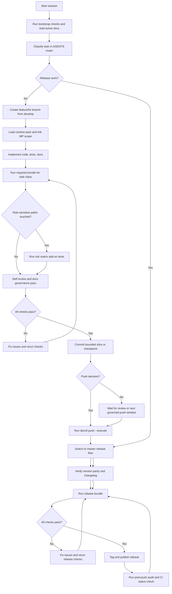
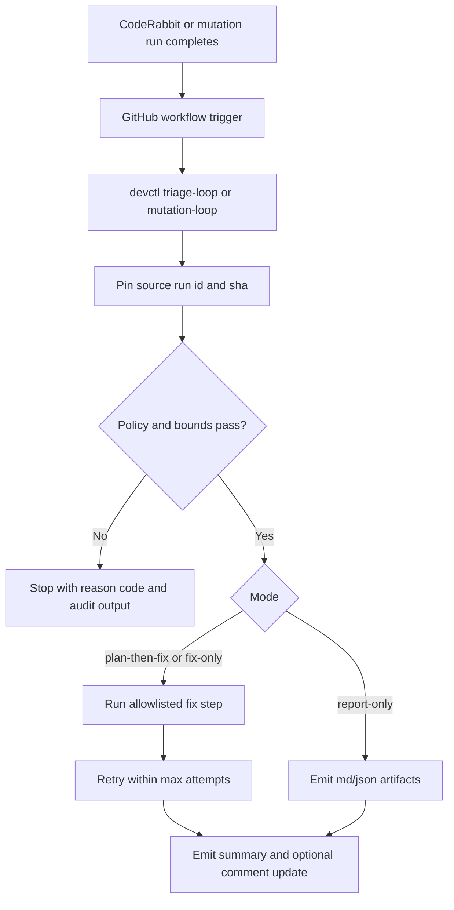
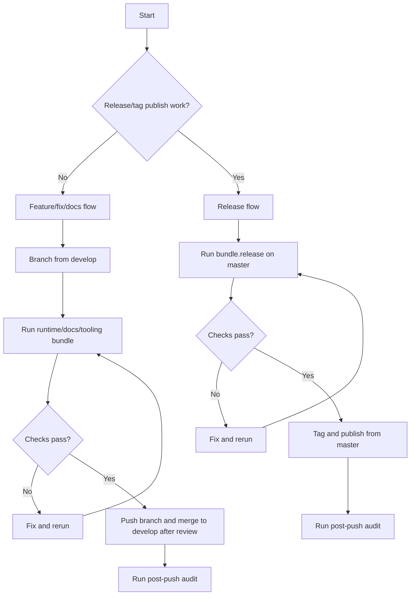

# Development

## Contents

- [Workflow ownership and routing](#workflow-ownership-and-routing)
- [End-to-end lifecycle flow](#end-to-end-lifecycle-flow)
- [What checks protect us](#what-checks-protect-us)
- [After file edits](#after-file-edits)
- [Ralph/Wiggum Loop Model](#ralphwiggum-loop-model)
- [When to push where](#when-to-push-where)
- [Project structure](#project-structure)
- [Building](#building)
- [Testing](#testing)
- [Manual QA checklist](#manual-qa-checklist)
- [Contribution workflow](#contribution-workflow)
- [Handoff paper trail template](#handoff-paper-trail-template)
- [Pre-refactor docs readiness checklist](#pre-refactor-docs-readiness-checklist)
- [Screenshot refresh capture matrix](#screenshot-refresh-capture-matrix)
- [Engineering quality review protocol](#engineering-quality-review-protocol)
- [Code style](#code-style)
- [Testing philosophy](#testing-philosophy)
- [CI/CD Workflow](#cicd-workflow)

## Fast Path

Already know the feature area? Use this short loop:

1. Read `AGENTS.md`, then `dev/active/INDEX.md` and `dev/active/MASTER_PLAN.md`.
2. Make your code, test, and doc changes in one scoped commit.
3. Run the bundle that matches your change type (`bundle.runtime`, `bundle.docs`, or `bundle.tooling`).
4. Run any risk-matrix add-ons listed in `AGENTS.md` for the paths you touched.
5. Push to a branch off `develop` (or `master` for releases only).

## Workflow ownership and routing

Use docs like this:

- **`AGENTS.md`** -- which workflow to follow (read this first).
- **`dev/guides/DEVELOPMENT.md`** (this file) -- exact commands and check steps.
- **`dev/scripts/README.md`** -- `devctl` and release command reference.
- **`dev/guides/MCP_DEVCTL_ALIGNMENT.md`** -- MCP adapter policy and extension rules.
- **`.github/workflows/README.md`** -- what each GitHub workflow does.
- **`dev/active/INDEX.md`** -- active plan docs and when to read each one.
- **`dev/active/MASTER_PLAN.md`** -- source of truth for current work.
- **`backlog.md`** -- shared repo-visible backlog/intake for humans + AI; promote items into the active plan chain before execution.
- **`dev/active/pre_release_architecture_audit.md`** -- canonical findings + execution checklist for pre-release architecture/tooling remediation (`MP-347`, `MP-349`).
- Whole-system audit references (for example
  `dev/guides/SYSTEM_AUDIT.md`) are temporary
  reference evidence only. Accepted findings must be copied into canonical
  active plans and maintainer docs; once integrated, retire the repo-root
  audit copy instead of maintaining a second roadmap.
- **`dev/active/theme_upgrade.md`** -- Theme and overlay plan.
- **`dev/active/ide_provider_modularization.md`** -- host/provider adapter modularization and compatibility plan (`MP-346`).
- **`dev/active/loop_chat_bridge.md`** -- loop output to chat runbook (`MP-338`).
- **`dev/active/review_channel.md`** -- shared review-channel plan, merged markdown-swarm lane map, and multi-agent coordination contract for the current Codex/Claude cycle.
- **`dev/active/remote_commit_pipeline.md`** -- typed remote-session
  commit/push design for phone-steered or remote-control sessions; read this
  after `platform_authority_loop.md` when the task is staged-work approval,
  governed remote commit execution, or phone doctor/readiness projection.
- **`dev/active/remote_control_runtime.md`** -- remote-control reviewer/runtime
  closure plan for typed operator mode, packet-backed action requests,
  dashboard typed projections, and repo-owned auto-poll/update cadence; read
  this after `remote_commit_pipeline.md` when the task is operator-surface or
  remote-control lifecycle convergence rather than commit/push design.
- **`dev/active/autonomous_governance_loop_v2.md`** -- bounded loop-v2
  convergence plan for composing `startup-context` / `WorkIntakePacket`,
  `PlanningIRSnapshot`, `findings-priority`, `auto-mode`, `monitor`,
  graph-backed discoverability, and governed commit/push into one autonomous
  controller; read this after `ai_governance_platform.md` and
  `platform_authority_loop.md` when the work is "connect the existing typed
  surfaces" rather than "build another controller".
- Review-channel docs and launch surfaces now distinguish planned lane topology
  from live participant truth: the runtime registry is provider/session-backed
  typed state, default requested worker fanout is zero unless explicitly
  requested, and `bridge.md` remains a compatibility projection until native
  `CollaborationSession` worker topology lands.
- Review-channel promotion/follow automation is fail-closed on explicit state
  markers only. When you touch bridge promotion/readiness code, treat the
  first verdict/instruction item or typed `current_session` state as authority;
  do not substring-scan explanatory prose for words like `accepted`,
  `resolved`, or `none`.
- Review-channel launch/replay code is authority-bound. When you touch
  conductor launch paths, resolve operator interaction mode through governance
  or startup authority once, pass the same value into session preparation and
  the pre-spawn gate, and keep prepared script replay bound to current HEAD,
  instruction revision, and the typed `review_state.json` turn/session token.
- `dev/scripts/remote-bridge-loop.sh` is only a repo-local wrapper over that
  same review-channel runtime. It syncs the tracked `/project:bridge-loop`
  prompt, checks `claude auth status`, prints typed review-channel health, and
  can relaunch the sanctioned pair, but it does not create a separate Codex
  backend or a private "recover codex" path. The wrapper now also surfaces the
  top-level typed `recommended_command`, typed runtime
  `doctor.decision_command`, and managed git-hook health; only executable
  repo-owned shell commands should be auto-run from those fields, while typed
  decision ids remain state labels. Remote commit/push authority also does not
  live in that wrapper; it routes through the Phase-0 design in
  `dev/active/remote_commit_pipeline.md`, while remote-control operator mode,
  action transport, dashboard convergence, and auto-poll behavior now route
  through `dev/active/remote_control_runtime.md`.
- Packet actor/target CLI fields are intentionally parser-loose now: repo-owned
  validation resolves legal ids from typed collaboration/runtime state or
  repo-owned session metadata instead of a fixed provider-choice list.
- Remote commit/push operator approval now uses the same packet path instead of
  bridge prose. For that slice, post `review-channel` packets with
  `--kind commit_approval --target-kind runtime --target-ref remote_commit_pipeline:<pipeline_id>`
  plus typed `--pipeline-generation`, `--staged-snapshot-hash`, and
  `--guard-results-summary` fields so approval survives `post|ack|apply`,
  `actions.json`, and typed `ReviewState` parsing.
- Bridge `## Action Requests` are also packet-backed now. Use
  `review-channel --action post --kind action_request` only with an explicit
  `--requested-action`; bridge-executable `run_check` / `kill_process` /
  `stage_commit_pipeline` packets require `--target-kind runtime`,
  `--target-ref`, and `--target-revision`, and `commit` / `push` additionally
  require `--target-ref remote_commit_pipeline:<pipeline_id>`,
  `--pipeline-generation`, `--staged-snapshot-hash`, and
  `--guard-results-summary`. Prose-only runtime requests remain packet
  history, not executable bridge authority.
- The same event-backed packet path now carries typed delivery/execution
  receipts. `post` seeds `delivery_emitted_at_utc`, actor-matched `inbox` /
  `watch` polls stamp `delivery_observed_at_utc` / `delivery_observed_by`, and
  `ack` / `apply` stamp `execution_started_at_utc` /
  `execution_started_by`; when you verify remote-control or dashboard behavior,
  use those fields instead of guessing from packet counts alone.
  These receipts are not implementer ACKs: `review-channel --action ack` does
  not write `Claude Ack` and does not make
  `current_session.implementer_ack_state=current`. The implementer ACK still
  requires a machine-readable current-instruction revision in typed
  current-session/bridge state.
- Headless `review-channel --action launch` (and `--action recover`) now
  auto-elevate `--approval-mode` to `trusted` when typed
  `interaction_mode == "remote_control"` and the operator did not pass an
  explicit `--approval-mode`. This eliminates the silent sandbox-escalation
  deadlock where headless `--terminal none` could not render local approval
  prompts (`auto_elevated_approval_mode` lives in
  `dev/scripts/devctl/approval_mode.py`). The rendered launch prompt now
  also includes an explicit inbox-drain section after the bootstrap chain,
  so codex sessions ack pending operator-authority packets before any
  reviewer-bootstrap or code reading. Typed conductor-stall observations
  for any wedge that escapes prevention live in
  `dev/scripts/devctl/review_channel/stall_diagnostics.py`
  (`ConductorStallDiagnosis` reader over codex rollout JSONL). Typed
  remote-control liveness also means status/doctor must recommend
  `--terminal none`, and explicit visible Terminal.app launch/recover requests
  must be rejected before local Terminal profile lookup or provider prompts.
- The `ensure-follow` reviewer-wake path
  (`dev/scripts/devctl/review_channel/reviewer_follow_guard.py::launch_waiting_reviewer_conductor`)
  shares the same auto-elevation seam, so a remote-control reviewer
  relaunched after a wake does not silently wedge on the same approval
  prompt the launch / rollover / recover paths now avoid. The stall
  diagnostic also reads the real codex rollout JSONL envelope shape
  (`payload.type == "task_complete"`, `payload.is_escalation`) and
  surfaces `escalation_deadlock` regardless of whether the session
  previously emitted task-complete events — covering the long-lived
  conductor that completes earlier work and only later wedges.
- The 2026-04-21 `rev_pkt_1529` follow-up keeps explicit replacement-session
  evidence ahead of stale escalation-deadlock classification in
  `stall_diagnostics.py`; callers that pass `replacement_session_ids` and
  prove the replacement rollout exists should see `new_session_spawned`, not
  a lingering deadlock for the replaced conductor.
- The operator read surface now has an explicit read-only alias too:
  `review-channel --action operator-inbox` fixes `target=operator`, defaults
  to the live pending queue, and must not stamp `delivery_observed_*` on live
  `action_request` packets. Use it for operator/dashboard/phone inspection,
  and keep targeted `inbox` / `watch` polls for the actor lanes that are
  supposed to record packet observation.
- Queue-derived next-step projections are action-request-first now. A live
  `action_request` must outrank later findings or commentary in
  `queue.derived_next_instruction`, and the typed source payload should carry
  `selection_policy`, `control_state`, `wake_required`, and
  `delivery_required` after receipt hydration so a single inbox poll can move
  a packet from `delivery_pending` to `execution_pending` without a second
  refresh cycle. The same priority selector also drives
  `current_session.current_instruction` so dashboard and status clients stay
  on the action-request-first control path during read-only polls instead of
  falling back to a later commentary packet while a live action request is
  still pending.
- Keep remote-control review-channel wake, status, and dashboard surfaces in
  lockstep when you touch that lane: `pending_action_requests` means live
  pending `kind="action_request"` packets only, dashboard conductor rows must
  stay `RUNNING` when typed session state says `alive=true` even if a PID is
  unavailable, and `ensure --follow` may relaunch one waiting Codex reviewer
  conductor for the newest unseen action-request packet instead of depending
  on a separate watcher.
- Keep bridge-backed and event-backed attention producers in lockstep too:
  `refresh_status_snapshot()` and event-backed review-state enrichment must
  both attach typed conductor session state before recovery assessment runs.
  `review-channel status`, `startup-context`, `session-resume`, and
  `dashboard` may still differ on `advisory_action` / `push_decision`, but
  they must not disagree on runtime diagnosis such as
  `review_loop_relaunch_required` vs `checkpoint_required` just because one
  reader saw `launch_truth` before conductor-state attachment.
- Keep read-only advisory next-command projection centralized too:
  observer/dashboard callers must route mutating commit/push/pipeline command
  strings through
  `dev/scripts/devctl/runtime/advisory_next_action_role_filter.py::project_next_command_for_role`
  before rendering startup action routing, `AuthoritySnapshot`,
  `ControlPlaneReadModel`, `session-resume`, or `dashboard` output. Focused
  tests live with the owning action-routing, control-plane, session-resume,
  and dashboard suites until the broader `probe_advisory_next_action_role_filter.py`
  guard lands.
- The bundle.tooling hygiene gate ignores the long-standing publications drift warning via --ignore-warning-source publications alongside the existing mutation_badge exclusion, so unrelated pushes are no longer blocked by external-site drift.
- The same Phase-2 authority cleanup now keeps review/push truth on typed
  runtime contracts too: `reviewer_runtime` owns
  `implementer_ack_current`, `implementation_blocked`, and
  `implementation_block_reason`, bridge review acceptance no longer falls
  back to prose parsing, and governed push recovery matches the reviewer-owned
  `approved_target_identity` tree receipt instead of raw HEAD equality.
- Closed execution plans move to `dev/archive/` only after their scoped work is
  complete and `dev/active/INDEX.md` plus discovery docs are updated in the
  same change. If a plan doc still holds unfinished or deferred backlog, keep
  it under `dev/active/`.

Start with `AGENTS.md` to pick your task class, then use this file for commands.

## End-to-end lifecycle flow

This chart shows the full loop: start a session, implement, verify, and (optionally) release.

Checkpoint note: a local commit/checkpoint only closes the bounded worktree
slice. Treat remote push as a later governed action that still requires the
current review/policy gates plus `devctl push` validation.
Use the typed `push_decision` answer from `startup-context` / review status
(`await_checkpoint`, `await_review`, `run_devctl_push`, `no_push_needed`)
instead of inferring remote readiness from raw dirty-tree booleans alone.
Repo policy may exclude non-authoritative scratch context such as `convo.md`
from push cleanliness so advisory files do not strand reviewed commits.
The same startup packet now carries deterministic action routing
(`next_command`, `allowed_actions`, `blocked_actions`,
`control_recovery_action`, `escalation_action`) plus typed `agent_lane`
permissions and `lane_edit_gate`; follow those fields before falling back to
shell probes or chat-local role assumptions. Destructive runtime recovery is a
separate startup authority surface: `recovery_action`, `recovery_basis`, and
`recovery_scope` must prove the precondition before a relaunch or termination
is allowed. The governed commit path consumes the same authority family through
`CommitPermissionDecision`, so `implementation_permission=blocked|suspended`
hard-blocks `devctl commit` before staging or guard execution. The bounded
exception is checkpoint-only authority: when startup explicitly says
`advisory_action=checkpoint_allowed`, `push_decision=await_checkpoint`, and
`reviewer_gate.checkpoint_permitted=true`, `devctl commit` may still cut the
governed checkpoint for already-staged work, while raw `git commit` stays
blocked until the broader implementation-authority issue is repaired. In
`remote_control`, the approval rule is now typed-evidence-first: an active
`reviewer_runtime.remote_control_attachment` with `role=operator` may
auto-satisfy the governed commit approval step through the existing typed
operator packet flow, but `remote_control` without that delegation and other
non-auto-approved lanes must still stop at `operator_approval_pending` before
the `vcs.commit` phase. Apply or reuse the typed decision first, then rerun
the command from a fresh startup/review receipt instead of expecting the same
invocation to cross the approval boundary.
Push cleanliness now blocks only on unstaged or untracked dirt. Staged-only
"next commit" intent is allowed so `devctl push --execute` and its
preflight auto-commit repair path do not loop on already-approved work just
because the implementer has begun staging the next slice. Governed staging
also fails closed if the managed ReviewSnapshot refresh drops already-staged
user paths or if the refresh leaves only receipt artifacts staged while real
dirty work remains outside the index. Governed commit reports may surface both
the approved content SHA and a trailing ReviewSnapshot `receipt_commit_sha`
when the hook adds a receipt commit after the main code commit.
Treat `allowed_actions` as the effective post-gate set, not the raw lane
capability list: `intrinsic_allowed_actions` preserves lane capability when
checkpoint budget, resync, or implementation authority temporarily blocks
mutation, and `implementation_admissibility` is the shared
`allowed|checkpoint_required|blocked` mutability summary consumed by startup
and monitor surfaces.

| `push_decision` | Meaning | Next governed step |
|---|---|---|
| `await_checkpoint` | The local worktree is not ready for remote action yet. | Cut a bounded checkpoint/commit, then rerun `python3 dev/scripts/devctl.py startup-context --format summary`. |
| `await_review` | The local slice is checkpointed, but reviewer-owned acceptance is not current yet. | Wait for the review gate to advance, then rerun `python3 dev/scripts/devctl.py startup-context --format summary`. `reviewer-checkpoint` advances review truth; it does not push by itself. |
| `run_devctl_push` | Local cleanliness, review state, and branch posture now allow the governed push path. | Run `python3 dev/scripts/devctl.py push --execute` instead of raw `git push`. |
| `no_push_needed` | The current branch already matches its upstream. | Stop; no governed push is required. |

If the governed push path blocks, stop at that typed decision surface. Do not
turn a push block into a casual raw `git push`; the planned human-override
shape is a typed repo-owned exception path, not an ad hoc shell fallback.



## What checks protect us

Run the checks that match your change before pushing.
CI runs the same checks, so local failures are faster to fix.

Three quality layers matter in practice:

- Hard guards (`check_*.py`) block regressions.
- Review probes (`probe_*.py`) surface AI-style design smells without failing CI.
- Deterministic validation contracts are the next portable trust layer under
  `MP-377`: keep the core runner-agnostic, use repo-local adapters such as
  pytest where they fit, and treat the exact finding-scoped validator set as
  the future autonomy proof. Generic green suites, raw coverage, or broad
  blast-radius heuristics can weight trust, but they are not the primary
  automation gate.
- `probe_mixed_concerns.py` ranks Python files that contain 3+ independent
  top-level function clusters so mixed-concern modules get split before line
  counts hide the smell.
- `probe_split_advisor.py` turns those mixed-concern clusters into bounded
  split recommendations by combining local import coupling with latest
  context-graph hotspot evidence.
- `check_code_shape.py` now ratchets path-override debt too: untouched legacy
  over-cap overrides still show up as warnings, but touched files, newly added
  over-cap overrides, worsened over-cap policies, and touched Python files
  with mixed-concern clusters fail the guard.
- `python3 dev/scripts/devctl.py probe-report --format md` turns those probe
  hints into one ranked review packet with topology artifacts for human or AI
  follow-up.
- Repo-root `.probe-allowlist.json` entries now apply to that canonical
  `probe-report` path too. Use `disposition: "design_decision"` when a seam
  should stay visible as a typed decision packet without counting as active
  debt; the matching key is `file` + `symbol` + `probe` when `probe` is
  declared, and the root file may carry `schema_version: 1` plus
  `contract_id: "ProbeAllowlist"`. The same packet should guide AI agents and human reviewers;
  `decision_mode` only gates whether the AI may auto-apply, should recommend,
  or must explain and wait for approval.
- Compatibility shims now use the same split governance model everywhere:
  `check_package_layout.py` enforces structural/layout policy, while
  `probe_compatibility_shims.py` ranks stale shim debt such as missing
  metadata, expired wrappers, broken targets, and shim-heavy roots/families.
  `check_package_layout.py` also distinguishes blocking layout violations from
  baseline organization debt, so freeze-mode crowded roots/families still read
  as not clean even when the current edit did not add a new flat file there.
  It now also emits advisory organization-role debt for configured roots, so a
  flat helper drawer can stay visible even when the current crowding threshold
  is technically satisfied. The `--fail-on-baseline-debt` flag (with optional
  `--baseline-debt-root` filter) promotes baseline debt to a hard failure for
  targeted roots; the tooling and release bundles use this to enforce convergence on
  `dev/scripts/devctl/commands`. When root filters are present, dirty
  working-tree and commit-range runs only hard-fail if the current diff
  touches one of those roots; clean-worktree and adoption-scan runs still
  enforce the selected roots globally. Repo policy may ratchet those known crowded
  areas to `strict` so touched files must keep decomposing into owned packages
  or approved thin shims. When
  a move keeps a compatibility wrapper, the same report should emit
  `compatibility_redirects` from `shim-target` so the next AI/human session can
  see the canonical destination path directly. Thin re-export shims and thin
  module-alias shims are both acceptable when they keep stable import/patch
  paths pointed at the moved implementation without turning the crowded root
  back into a second implementation surface. When a crowded-root helper shim is
  supposed to stay long-lived, register it in repo policy
  `probe_compatibility_shims.allowed_public_shims`; otherwise the adoption-scan
  probe will keep ranking it as temporary shim debt even if a package README
  still mentions that wrapper. When you are auditing shim debt rather than only
  the current diff, run
  `python3 dev/scripts/checks/probe_compatibility_shims.py --since-ref __DEVCTL_EMPTY_TREE_BASE__ --head-ref __DEVCTL_WORKTREE_HEAD__ --format md`
  once so the scan sees the full repo backlog instead of only touched
  candidates.
- `dev/config/devctl_repo_policy.json` is the repo-local switchboard for which
  built-in guards/probes are active by default; keep enablement there instead
  of hard-coding repo behavior into `check` or `probe-report`.
- `python3 dev/scripts/checks/check_contract_connectivity.py` is the
  contract-connectivity guard for `runtime/`, `governance/`, `platform/`, and
  `app/operator_console/`. It records unreferenced or internal-only dataclass
  contracts, purpose-guided high-overlap duplicates, and raw-dict stranded
  consumers, and defaults to growth-based non-regression so existing debt
  stays visible without blocking unrelated slices.
- Worktree-orphan governance contracts are part of the platform contract
  surface, not disposable parser structs. `devctl orphan-inventory` builds the
  bounded local `OrphanInventoryReport` across the current checkout,
  registered/prunable worktrees, planned worker lanes, same-parent sibling
  clones, and stash entries without firing any gates; use it as report-only
  evidence until the later gate slice consumes the typed report. Use
  `--repo-path <path>` to run the same report-only scanner against an external
  pilot checkout before turning the scanner into advisory or blocking gates. The
  read-side `compute_orphan_snapshot()` projection now derives an
  `OrphanSnapshot` from that report for startup-context and advisory
  commit/push preflight consumption, still with gates disabled. When touching
  `dev/scripts/devctl/runtime/worktree_orphan_*`,
  `checkout_inventory_contracts.py`, `work_publication_ledger_contracts.py`,
  or `session_lease_contracts.py`, keep the platform rows in
  `dev/scripts/devctl/platform/worktree_orphan_contract_rows.py` synchronized
  and run both `check_contract_connectivity.py` and
  `check_platform_contract_closure.py`.
- Treat docs/governance path predicates as bounded-runtime code too: commands
  such as `docs-check --since-ref ...` should resolve the governing
  docs/policy contract once per repo/policy context and reuse it inside
  per-path loops. If commit-range docs-governance suddenly becomes slow or
  hangs, treat that as a real tooling regression, not as normal validation
  cost.
- When a policy-backed slice needs a simpler human-facing entrypoint, prefer a
  short wrapper command over asking maintainers to remember raw policy paths.
  Current examples: `python3 dev/scripts/devctl.py launcher-check`,
  `python3 dev/scripts/devctl.py launcher-probes`,
  `python3 dev/scripts/devctl.py launcher-policy`, and
  `python3 dev/scripts/devctl.py tandem-validate --format md`.
- `python3 dev/scripts/devctl.py tandem-validate --format md` is the canonical
  live tandem-session validator: it resolves the proper AGENTS bundle and
  risk add-ons through `check-router`, executes that routed plan, and then
  reruns final bridge/tandem guards so Codex/Claude sessions validate against
  the real repo surface instead of a stale mini-checklist.
- `python3 dev/scripts/checks/check_multi_agent_sync.py` now has a second
  runtime-honesty role beyond markdown-lane parity: when typed
  `review_state` exists, it must also prove planned `AGENT-*` rows have not
  leaked into live collaboration participants or runtime registry entries
  without live delegated-worker receipts.
- Keep one workflow, not a dev-vs-agent fork:
  - `active_dual_agent` is the fully enforced Codex/Claude loop. Use
    `python3 dev/scripts/devctl.py tandem-validate --format md` after code edits.
  - `single_agent` and `tools_only` are honest solo modes for a human developer
    or one AI plus tools. Use the same routed bundles/checks, but record the
    bridge state with
    `python3 dev/scripts/devctl.py review-channel --action reviewer-heartbeat --reviewer-mode <mode> --reason <why> --terminal none --format md`
    so the system stays current without pretending a second live agent exists.
    In Codex-only local-review mode, `single_agent` is the sanctioned
    reviewer state and the repo-owned `reviewer-heartbeat` / `reviewer-checkpoint`
    path is the authority for review truth, not a parallel bridge edit. That
    same sanctioned local takeover is active local implementation authority
    when no remote-control attachment is live, so startup/coordination should
    not force a dual-agent relaunch merely because the repo has no live pair.
    In governed remote-control `single_agent` lanes, status/doctor/dashboard
    must also keep the attached remote provider live from typed
    `remote_control_attachment` authority rather than letting Claude fall out
    of conductor truth just because the last typed packet is old. That
    remote-control continuity rule also applies to the explicit
    `review-channel --action status --refresh-bridge-heartbeat-if-stale`
    resync path: when a stale compatibility bridge has drifted to
    `tools_only` but typed remote-control attachment state is live, status may
    refresh Codex liveness and reproject the bridge to `active_dual_agent`.
    Do not extend that exception to fresh launch/rollover; those paths remain
    governed by the stricter live-bridge contract. That
    local takeover now also retires the detached publisher/reviewer-supervisor
    runtime so stale dual-agent heartbeats cannot silently restore
    `active_dual_agent` after the reviewer has intentionally downgraded modes.
    Event-backed status projections must also preserve that explicit bridge
    choice: read reviewer mode from the fresh bridge snapshot before daemon
    lifecycle rows, ignore stopped daemon mode hints, and only use running
    daemon rows as a fallback. Fresh reviewer-owned heartbeat/checkpoint state
    is allowed to update typed `current_session`, but stale
    `current_session` drift warnings must not cause `status` to reverse-write
    old session state over a newer reviewer bridge write.
    When the phone/dashboard stays attached in that mode, keep the primary
    worktree control-only and do mutating implementation work in reusable
    isolated worker worktrees so the operator surface does not have to share a
    dirty coding lane.
    Human-facing shorthand is allowed on the CLI: `agents` normalizes to
    `active_dual_agent`, and `developer` normalizes to `single_agent`.
  - After a real review pass, advance review truth with
    `python3 dev/scripts/devctl.py review-channel --action reviewer-checkpoint ...`
    rather than hand-editing heartbeat/hash/verdict lines separately. Prefer
    `--checkpoint-payload-file` for AI-generated or shell-sensitive markdown,
    use the per-section `--verdict-file` / `--open-findings-file` /
    `--instruction-file` flags when you intentionally keep bodies split, and
    reserve inline body flags for short plain strings only. In
    `active_dual_agent`, always pass the live
    `--expected-instruction-revision` and
    `--expected-implementer-state-hash` from `review-channel --action status`
    or `bridge-poll`. Reviewer-owned checkpoint/promotion/render writes now
    also fail closed when pending reviewer-targeted packets still exist in the
    event-backed inbox, so later bridge rewrites cannot silently erase earlier
    reviewer findings.
  - Keep the implementer ACK contract identical across prompts, validators,
    and typed status reads. In `Claude Ack`, acknowledge the current
    instruction revision with one machine-readable line such as
    `- acknowledged current instruction revision: <rev>` or
    `- acknowledged; instruction-rev: <rev>`. `current_session`,
    `bridge-poll`, and live bridge validation now share that same parser; do
    not invent a repo-local third phrasing rule.
    When `current_session` ACK state is unknown, consumers should fall back to
    typed `bridge.claude_ack_current` before trying to infer anything from
    bridge prose. Prefer provider-neutral bridge aliases
    (`implementer_ack*`, `implementer_status`, `reviewer_poll_state`,
    `last_reviewer_poll_*`) when present; the legacy `claude_*` /
    `codex_*` fields remain compatibility outputs for bridge/render parity.
  - In VoiceTerm today the live compatibility bridge file is repo-root
    `bridge.md`, but review-channel roots should be understood as governed
    repo-pack/project-governance state and typed `review_state` remains the
    canonical machine authority. Repo-owned `reviewer-heartbeat`,
    `reviewer-checkpoint`, and instruction-promotion writes serialize the
    bridge file under a lock and treat `Poll Status` as current-state-only
    reviewer authority: stale reviewer-owned status prose is replaced on each
    repo-owned write instead of accumulating old revision/ACK bullets under a
    fresh heartbeat line, and automation-only heartbeat refresh must preserve
    a real reviewer checkpoint `Poll Status` instead of downgrading it. If
    the bridge drifts into transcript/history junk or
    unsupported headings, repair it with
    `python3 dev/scripts/devctl.py review-channel --action render-bridge --terminal none --format md`
    instead of hand-editing `bridge.md`; that repair path now rebuilds from
    the typed `review_state` compatibility payload (`_compat.bridge_projection`)
    rather than reparsing the live markdown body, recovers blank `Last Codex
    poll` metadata from typed bridge state, normalizes fractional-second typed
    poll timestamps to the canonical whole-second bridge format before local
    display rendering, and the bridge guard now
    fails closed on oversize bridges, duplicate/unsupported sections,
    transcript/ANSI contamination, embedded markdown headings inside fixed
    flat sections, and overgrown live `Claude Status` / `Claude Ack` blocks.
    Doctor/dashboard/reporting surfaces now also carry explicit runtime counts
    for live conductors, delegated receipts, planned lanes, worker budget, and
    running daemons so remote-control dashboards can report how many agents are
    actually live without guessing from bridge prose.
    `check_review_surface_consistency.py` also proves disk parity against the
    persisted `review_state` artifact and the computed turn-authority /
    bridge-poll projection, so the review surface cannot silently drift from
    the on-disk snapshot.
  - `review-channel --action status|ensure|reviewer-heartbeat|reviewer-checkpoint`
    now emit machine-readable `reviewer_worker` state, and
    `review-channel --action ensure --follow` cadence frames carry the same
    `review_needed` signal without pretending semantic review completion.
    The ensure orchestration in `ensure.py` delegates heartbeat refresh,
    detail assembly, and report construction to `_ensure_helpers.py` so each
    function stays focused on one concern.
    Keep instruction-shaped review-channel fields flat: bridge/current-session
    instructions and queue `derived_next_instruction` should use compact
    summary text only, while full `Context Recovery Packet` markdown stays in
    source metadata or prompt/audit surfaces instead of nested inside fixed
    projection sections.
    In active dual-agent mode, `ensure --follow` also reclaims a missing
    detached reviewer supervisor instead of only reporting that it is absent.
    Detached repo-owned `ensure --follow` and `reviewer-heartbeat --follow`
    launches now pin `--follow-inactivity-timeout-seconds 0`, and
    `review-channel --action stop --daemon-kind <publisher|reviewer_supervisor|all>`
    is the repo-owned daemon reclaim path when those follow daemons need a
    clean replacement. A governed reviewer-supervisor `manual_stop` or
    `completed` lifecycle record is non-restartable for implicit `ensure` /
    reviewer-heartbeat auto-start; restore it through an explicit
    launch/rollover/follow command instead of letting background automation
    undo the stop. In the same active-dual-agent loop, the reviewer
    follow daemon now auto-triggers the repo-owned
    `review-channel --action recover --recover-provider <provider>` path when
    implementer-owned progress stays unchanged across repeated stale/missing
    implementer state instead of waiting forever on raw shell sleep loops or
    operator chat nudges. That recovery replaces only the stale implementer
    conductor for the requested provider, and it now fails closed unless the
    current repo-owned reviewer conductor session is already present. Repeated unchanged stale
    reviewer/runtime states now obey the typed recovery contract instead of
    inventing a second stale-peer policy: when the allowed recovery command is
    `launch`, reviewer-follow must prefer the repo-owned
    `review-channel --action launch` path and may only auto-trigger it when
    the typed decision says relaunch is auto-fixable. Approval-gated relaunch
    stays fail-closed and falls back to the queued reviewer-turn packet path
    instead of silently degrading to peer-stale `rollover`. Full `rollover`
    remains the bounded round/context-rotation restart path. Live Terminal.app
    and governed headless recover now share the same launcher discipline:
    `remote_control` may use `--terminal none`, local visible recovery stays on
    `terminal-app`, and a successful headless recover must actually spawn the
    implementer plus wait for a current ACK instead of only preparing scripts.
    The paired bootstrap/session-resume surfaces must keep a caller-threaded
    typed `ReviewState` authoritative over stale compact/current-session text
    so a recovered implementer sees the same instruction the reviewer/status
    surfaces already resolved. When session-resume builds the shared
    `ControlPlaneReadModel`, it must route governance and frozen review-state
    through `ControlPlaneReadModelOptions` instead of legacy direct keyword
    arguments.
    Live Terminal.app
    launch now
    records the returned `terminal_window_id` in conductor session metadata,
    and rollover cleanup uses the retiring session snapshot to kill the old
    conductor pid before closing the old Terminal window. Status/runtime
    session hints also need a warmup guard: a fresh Terminal launch that still
    shows active `esc to interrupt` progress must not be downgraded to
    `waiting_for_user_input` just because the terminal UI renders a prompt
    line while the conductor is still starting.
    Status/runtime
    surfaces now also emit explicit visibility state
    (`reviewer_runtime.conductor_visibility` and reviewer
    `session_owner.session_visibility`) so operators and AI do not infer
    headless vs visible sessions from raw `terminal_window_id`, and local
    recovery guidance defaults back to visible `--terminal terminal-app`
    unless governed `remote_control` mode keeps the session headless.
  - Before choosing launch or recovery posture, read the typed startup/runtime
    fields together: `startup-context.action`, `interaction_mode`,
    `reviewer_runtime.conductor_visibility`, and reviewer
    `session_owner.session_visibility`. In `local_terminal`, visible is the
    default unless the session is intentionally headless; in `remote_control`,
    headless remains the governed default. For visible local launch/recover,
    use a stable repo-managed root rather than a transient temp clone/worktree;
    the repo-owned `terminal-app` path now fails closed on temp roots so
    provider directory-trust prompts cannot wedge the local automation lane.
    For destructive recovery, do not infer permission from stale terminal
    output or a dashboard suspicion: `startup-context` must emit
    `recovery_action=relaunch_allowed|terminate_allowed` with a proven
    `recovery_basis` and bounded `recovery_scope`; otherwise the lane remains
    observe/report only.
  - Prefer the repo-owned wait primitives over ad hoc shell sleep loops:
    `review-channel --action implementer-wait` is the implementer-side bounded
    wait path, and `review-channel --action reviewer-wait` is the symmetric
    reviewer-side bounded wait path over `reviewer_worker` hash truth plus the
    projected typed `current_session` ACK/status fields from
    `review_state.json`.
  - `implementer-wait` is only valid under an explicit reviewer-owned wait
    state. If `Current Instruction For Claude` still assigns active work,
    `Claude Status` / `Claude Ack` must stay substantive: name concrete
    files, subsystems, findings, or one concrete blocker/question. `No
    change. Continuing.`, `instruction unchanged`, `Codex should review`,
    and raw shell `sleep` loops are contract failures now, not harmless
    polling prose. Reviewer-owned hold-steady / checkpoint / governed-push-
    pending bridge state counts as that same valid wait posture, so Claude
    conductors should keep polling repo-owned wait/status paths instead of
    asking the operator to choose between polling, pushing, or side work.
  - `review-channel --action reset-implementer-state` is the repo-owned
    repair path when live status/attention says implementer-owned bridge
    sections must return to canonical pending state. It rewrites `Claude
    Status`, `Claude Questions`, and `Claude Ack` to `- pending` and then
    refreshes the typed review-channel projection. Do not use it as the
    generic fix for a detached dual-agent loop: when typed status shows a
    current Claude ACK but `launch_truth=detached_runtime_only`,
    `launch_truth=automation_only`, or `launch_truth=hybrid_claude_only`,
    the correct typed diagnosis is `review_loop_relaunch_required` and the
    sanctioned recovery is the reviewer-owned
    `review-channel --action launch|rollover` path.
  - `review-channel --action status` also projects repo-governance
    `push_enforcement` state (`checkpoint_required`,
    `safe_to_continue_editing`, `raw_git_push_guarded`,
    `recommended_action`) and escalates attention to
    `checkpoint_required` when the worktree is over the continuation budget
    (reviewer follow-up takes priority when review is also pending).
    Fresh repo-owned `review-channel --action launch|rollover` starts now
    treat that checkpoint state as a hard launch blocker instead of advisory
    status. Live Terminal-app `launch|rollover` also auto-start the repo-owned
    ensure-follow publisher from the actual launch router and fail closed if
    that detached publisher does not come up. The publisher remains the
    persistent service and reclaims the detached reviewer-supervisor runtime on
    its normal cadence; the checked-in launchd template/wrapper pair under
    `dev/config/launchd/` covers login-time restart/backoff semantics outside
    that live launch path. The startup gate now splits launcher authority
    from edit-slice authority: `launch|rollover` drops stale-HEAD receipt
    failures only when the HEAD drift stays outside guarded quality-scope
    roots, while implementation commands keep exact HEAD binding. The gate
    still blocks those actions on
    checkpoint-budget or other real authority failures, but it no longer
    blocks `launch|rollover` solely because the current reviewer loop is stale
    on the implementer side or because a reviewer-state commit changed HEAD;
    prepared conductor authority follows that same rule after launch, so
    remote-control commit-driven HEAD drift must be classified from typed
    governance/review-state evidence rather than
    `DEVCTL_OPERATOR_INTERACTION_MODE` alone. Those actions remain the sanctioned full-session
    relaunch path when the pair needs a fresh start, while `recover` is the
    narrower implementer-only repair path when the repo-owned reviewer is
    already live.
    The startup gate reads `StartupReceipt.advisory_action` as a typed
    attribute (not dict `.get()`) and handles `None` receipts without crashing.
    The reviewer-loop relaxation for `launch`/`rollover` is handled entirely
    by the intent-based authority system (`reviewer_bootstrap` intent relaxes
    the reviewer-loop check at line 341 of `runtime_checks.py`), so no
    separate repair bypass exists in `enforce_startup_gate` — receipt
    freshness, checkpoint, and all non-reviewer-loop authority checks always
    apply.
    Canonical reviewer-reset implementer placeholders (`Claude Status: - pending`,
    `Claude Ack: - pending`) are valid fresh-launch state for a new instruction
    revision, and the same reset now clears stale `Claude Questions` too.
    When persisted typed `review_state.json` already exists, that same status
    path now prefers typed `current_session` for live instruction / ACK state
    and typed `reviewer_runtime.review_acceptance` for verdict/findings truth.
    Shared live runtime loaders now follow the same rule more broadly:
    canonical event-backed review state wins first, an existing typed
    projection is second, and bridge refresh is the last fallback only.
    The `rev_pkt_1503` follow-up keeps contract-drift repair under that same
    ordering: an event-backed `projections/latest/review_state.json` payload
    is already canonical and must not be downgraded through a bridge-backed
    refresh just because the compatibility bridge shape drifted.
    Raw bridge verdict/findings prose remains compatibility or drift evidence,
    not primary runtime authority.
  - Fresh reviewer and implementer sessions should bootstrap from role-first
    receipts, not provider-local lore: run
    `python3 dev/scripts/devctl.py startup-context --role <reviewer|implementer> --format summary`,
    then
    `python3 dev/scripts/devctl.py session-resume --role <reviewer|implementer> --format bootstrap`,
    then `python3 dev/scripts/devctl.py context-graph --mode bootstrap --format md`.
    Planned lane text and typed collaboration/runtime state decide which
    provider currently owns each role. For reviewer sessions, the bootstrap
    packet now prefers a frozen typed `review_candidate` when a bounded slice
    is ready only in dirty/staged state; only when no valid candidate exists
    should review fall back to raw `last_reviewed_sha..head_sha` range
    inspection. If implementer-complete bridge state claims a finished slice
    without a valid candidate, treat that as a fail-closed handoff bug and
    repair `review-channel --action status`/implementer state before review.
    Implementer bootstrap is packet-first as well: if `Pending Inbox` / typed
    packet state already names a Claude-targeted packet or required command,
    run `review-channel --action inbox --target claude --actor claude --status
    pending --format md` before asking the operator whether to continue a
    permitted probe.
  - The review-candidate / recovery / collaboration-model seams are now split
    into helper modules (`candidate_parse.py`, `candidate_paths.py`,
    `recovery_decision.py`, `recovery_evidence.py`,
    `review_state_collaboration_models.py`) so the orchestration files stay
    under code-shape limits. Extend those helpers instead of re-growing
    `review_candidate.py`, `recovery_assessment.py`, or
    `review_state_models.py` into new God files.
  - `observe_launch_state()` in `bridge_launch_control.py` uses a lightweight
    bridge-metadata + session-probe path for launch-time poll iterations
    instead of forcing the full `ReviewChannelStatusSnapshot` refresh. The
    heavy path is the `OSError` fallback only.
  - `startup-context` always attempts the startup receipt write because the
    launcher validates it to gate subsequent actions.  On intentional read-only
    mounts (`DEVCTL_NO_ARTIFACT_WRITES=1`, MCP adapters, containers) the write
    degrades gracefully on `OSError`; other write failures propagate normally.
    Bootstrap `context-graph` is the exception to dispatcher suppression:
    normal `context-graph --mode bootstrap` runs persist a managed graph
    snapshot because `system-picture` uses it for freshness. Explicit
    external `DEVCTL_NO_ARTIFACT_WRITES=1` still suppresses that bootstrap
    snapshot on read-only mounts, and explicit `--save-snapshot` on
    `context-graph` still writes unconditionally.
  - `wait_for_codex_poll_refresh()` in `handoff.py` has two satisfaction paths
    for the post-launch ACK gate: (1) reviewer-owned `Poll Status` text
    changed, or (2) `Last Codex poll` timestamp advanced past the pre-launch
    baseline AND typed session probes confirm both conductors are live.
    Neither path accepts BOTH unchanged timestamp AND unchanged status.
  - The same `status` path is now fail-closed on live-loop honesty too:
    `active_dual_agent` with detached publisher/supervisor heartbeats but no
    repo-owned conductors is a bridge-contract error, not a healthy loop.
  - The same `review-channel --action status` path now emits a typed
    `current_session` block in `dev/reports/review_channel/latest/review_state.json`
    and `compact.json`; prefer that contract for live instruction /
    implementer ACK reads instead of scraping append-only prose from
    `bridge.md`. The same typed `bridge` block now carries
    `reviewed_hash_current` and `review_needed`, so review freshness should
    come from the persisted typed projection rather than a bridge-text hash
    compare or a status-only side channel. For live-authority decisions,
    prefer `bridge.effective_reviewer_mode` over the declared bridge
    `reviewer_mode`: the declared mode stays provenance, while the effective
    field demotes dead `active_dual_agent` runtime to an inactive read-only
    state for startup/wait consumers. Governed commit execution follows the
    same rule when it must synthesize lane capabilities without a fully
    populated capability object: effective mode outranks declared
    collaboration mode so local `single_agent` checkpoint work keeps the
    writable lane on the reviewer side.
    `review-channel --action bridge-poll`
    now follows that same rule by refreshing and preferring the typed
    `review_state` projection before deciding live ACK freshness.
    The same status payload now also carries `reviewer_runtime` as the single
    reviewer-lifecycle owner: reviewer mode/effective mode, freshness, stale
    reason, last poll, rollover state, session owner, allowed recovery
    action, review acceptance, and publish-clear state. Bridge
    `review_accepted` and doctor output are projections over that contract,
    not separate authority.
  - `review-channel --action doctor` is the compact phone/dashboard readiness
    surface layered on top of that same typed contract. It reduces the full
    status payload to `doctor`, `reviewer_runtime`, `commit_pipeline`, and the
    shared projection paths, and it must keep startup push truth flowing from
    `reviewer_runtime.publish_clear` /
    `push_decision.review_gate_allows_push` instead of inventing a second
    push-readiness evaluator. The reduced `doctor` payload now also carries
    publisher/supervisor running state plus the last projected heartbeat and
    stop-reason fields so remote-control dashboards do not need a second
    daemon-only status call. Status/doctor now also hoist one top-level
    `recommended_command`, preferring typed recovery commands and otherwise
    reusing `push_decision.next_step_command`, so hooks or launcher shims can
    consume one field instead of re-deriving the next step from nested state.
    The same reuse rule now applies to diff-sensitive follow-up: when the
    governed push path resolved a branch-aware preflight base, hooks/launcher
    shims should consume that typed diff base instead of hardcoding
    `origin/develop`.
    Feature-branch release-lane preflight follows the same principle: the
    shared CodeRabbit gate now treats an unpublished local SHA as
    non-blocking until publish when no local remote-tracking ref contains it
    yet, instead of hard-failing an impossible pre-push workflow-run check.
  - `devctl pipeline --action refresh-authorization` is only the same-HEAD
    expiry-window recovery path. It must resolve current HEAD first, refuse
    when the recorded `authorized_head_sha` no longer matches, and direct the
    operator to `recover` rather than minting a fresh-looking authorization for
    the wrong commit. Cursor-based `devctl agent-mind --since-cursor` polling
    has the matching fail-closed rule on the read side: it must not apply a
    fixed raw-line rollout tail before the cursor filter, because a busy
    session can emit hundreds of noise lines after an unseen decision event.
    The same authority rule now applies to commit/push blockers: when typed
    pipeline status already carries `recommended_next_action` plus
    `next_command`, downstream commit surfaces must project those fields
    directly instead of regenerating prose. If the active publish pipeline is
    same-HEAD and only the authorization window expired, the block path should
    refresh that authorization in place before it tells the operator the next
    command is `devctl push --execute`. If HEAD advanced only because a
    governed bridge/ReviewSnapshot receipt commit sits above the authorized
    pipeline commit, pipeline status must report
    `head_movement_classification=managed_receipt` with
    `head_has_moved=false`.
    `devctl pipeline --action auto-recover` is the typed automation wrapper for
    the same recovery lane: it classifies stale pipeline state, dispatches the
    safe explicit sub-action, and records a `PipelineAutoRecoveryReceipt`
    instead of making the operator choose abandon/recover/refresh manually.
  - `startup-context` is the typed startup packet for those same sessions.
    It should read reviewer/publish gating from typed
    `reviewer_runtime.review_acceptance.review_accepted` and
    `reviewer_runtime.publish_clear` state; `bridge.review_accepted` is only a
    compatibility projection over that contract, and `bridge.md` remains a
    compatibility projection and handoff surface, not a startup-authority
    fallback when typed review state is missing. The same startup path now
    has a typed governed-markdown baseline
    too:
    `ProjectGovernance` carries `DocPolicy`, `DocRegistry`, and parsed
    `PlanRegistry` entries built from governed docs plus `INDEX.md`, and
    `startup-context` now emits a bounded `WorkIntakePacket` carrying the
    selected `PlanTargetRef`, typed continuity reconciliation, startup-order
    warm refs, live routing defaults, and `session_pacing` guidance that
    derives a bounded research-to-first-patch read set from planning IR plus
    current graph adjacency. When repo policy advertises a shared backlog doc,
    the same packet may surface that backlog in warm refs and writeback sinks
    so humans and AI can share one repo-visible intake surface without
    mistaking it for execution authority. The reviewed markdown `## Session
    Resume` section still remains the canonical restart surface; the typed
    continuity state is a startup projection over that markdown, not a second
    authority store. The same startup path now persists governed markdown
    `PlanRegistry` / `PlanTargetRef` authority under
    `dev/reports/governance/plan_registry.json` and reuses that artifact while
    the governed doc set is unchanged, so startup/planning readers stop
    reparsing mutable plan markdown on every turn. Authority readers that need
    legacy MP/path/router views should project from that typed state through
    `dev/scripts/devctl/runtime/plan_registry_projection.py` before falling
    back to raw `INDEX.md` parsing. Generated bootstrap
    surfaces now make
    `startup-context --format summary` the mandatory Step 0 gate before edits,
    validation, or repo-owned launcher work; user summaries, stale chat
    continuity, or remembered prior state are not substitutes for that
    receipt. Chat bootstrap acknowledgements should stay concise by default:
    blocker state plus next step, with detailed packet inspection left to the
    repo-owned artifacts or terminal output. That same compact summary now
    also surfaces unpublished stack depth (`ahead_of_upstream_commits`) plus
    governed-push timing guidance when local commits are waiting on review or
    checkpoint clearance. It also projects `observed_control_topology` and
    `implementation_permission` from supervised conductor counts, bridge
    liveness, and runtime counts, so startup can report when the intended
    reviewer/implementer topology has collapsed before push-time checks. The slim
    `context-graph --mode bootstrap` helper following as the bounded graph
    companion. That same graph now emits first-pass `guards` / `scoped_by`
    relation families, so targeted
    `context-graph --query '<term>'` calls can answer file-level protection
    and scope questions before the workflow widens into deeper startup reads.
    The same startup/work-intake path now promotes `active_target` from live
    planning/finding state instead of stale continuity alone, and
    `quality_signals` carries the canonical `finding_backlog` summary beside
    `probe_report` and `governance_review`, so fresh sessions, dashboard, and
    session-resume do not need separate backlog readers or a second target-
    selection rule.
    Non-guard queries now suppress generic guard-edge fan-out, and current
    scoped ownership comes from docs-policy rules rather than raw substring
    adjacency alone.
    Bootstrap mode also persists a typed `ContextGraphSnapshot` artifact under
    `dev/reports/graph_snapshots/`, and `--save-snapshot` applies that same
    versioned snapshot writer to other context-graph modes. `context-graph
    --mode diff --from previous --to latest` now consumes those saved
    baselines directly, emitting a typed delta plus rolling trend summary
    instead of forcing manual graph comparisons. The generated
    `CLAUDE.md` bootstrap surface should also advertise the live governance
    capability set (`ai_instruction`, `decision_mode`,
    `governance-review --record`, packet-level operational feedback, and
    snapshot baselines) and point agents back to this guide plus
    `dev/scripts/README.md` for the "which tool runs when?" decision table.
  - `python3 dev/scripts/checks/check_startup_authority_contract.py` is now a
    fail-closed startup proof, not a schema-only inventory check. It rejects
    startup-authority states that are already over the checkpoint budget and
    Python imports that only resolve because a new module exists on disk but
    not in the git index, and it separately proves committed importer content
    still resolves inside `HEAD` without reusing working-tree edits as proof.
    Fresh repos without a first commit skip that committed-tree layer until
    `HEAD` exists, so the normal stage-then-first-commit workflow stays clean.
  - `python3 dev/scripts/devctl.py startup-context --format summary|md|json` now uses
    that same typed checkpoint truth as a fail-closed receipt. The packet is
    still emitted for inspection, but the command exits non-zero when
    `checkpoint_required=true` or `safe_to_continue_editing=false`, so
    repo-owned startup launchers can block the next implementation slice on
    the canonical startup receipt instead of on prose-only conventions. The
    same command now persists a managed startup receipt under the repo-owned
    reports root, and scoped launcher/mutation `devctl` entrypoints require a
    fresh receipt instead of silently starting new work from ad hoc session
    state. The adjacent typed review-state reads in startup/tandem consumers
    now resolve through repo-pack/governance candidate paths rather than one
    fixed `dev/reports/review_channel/latest/review_state.json` literal. Those
    same consumers now refresh the bridge-backed typed projection through the
    repo-owned review status path before reading live `current_session` /
    freshness fields, so stale saved snapshots do not outrank the status
    writer. When `startup-context` exits non-zero but the state is still
    locally repairable, prefer
    `python3 dev/scripts/devctl.py startup-context --repair --apply-safe-fixes --format md`
    before operator escalation. That startup-family command classifies the
    current state from the typed startup/review owner contracts, applies at
    most one bounded safe repo-owned repair per invocation, refreshes the
    managed startup receipt after each pass, and still fails closed on
    checkpoint/publish/launch approval boundaries. The bounded repair adapter
    now also treats typed `AuthoritySnapshot` /
    `CoordinationSnapshot` blockers as explicit manual-follow-up issues, so a
    live `coordination_resync_required` state no longer hides behind a false
    "startup state is healthy" repair receipt.
    The bounded repair adapter
    also resolves the governed review-channel `rollover_dir` sibling from the
    managed review root before dispatching repo-owned review-channel actions,
    so review-channel command splits do not silently break startup repair.
    Reviewer bootstrap uses that same startup receipt, but do not flatten all
    non-zero reviewer receipts into repair. In `active_dual_agent`, a reviewer
    receipt with `action=continue_editing` / `reason=review_pending` or
    `action=await_review` / `reason=review_pending_before_push` still means the
    reviewer loop owns the next live turn; continue into
    `python3 dev/scripts/devctl.py review-channel --action status --terminal none --format json`
    and refresh the reviewer-owned bridge heartbeat before escalating into
    relaunch/repair. Reserve repair for `action=repair_reviewer_loop`,
    checkpoint/budget blockers, or typed stale/non-live reviewer runtime.
    Startup now exposes that ownership drift directly when the slice publishes
    explicit file claims. `WorkIntakePacket.ownership` classifies the dirty
    worktree as `clear`, `in_scope_dirty_paths`, `scope_unknown_dirty_paths`,
    `outside_scope_dirty_paths`, or `concurrent_writer_activity`, and
    `check_startup_authority_contract.py` fails closed on
    `concurrent_writer_activity` when outside-scope dirt overlaps typed peer
    activity. If scope claims are missing, startup stays fail-soft with
    `scope_unknown_dirty_paths` instead of guessing ownership. The same intake
    packet now also carries a bounded coordination reduction
    (`collaboration_topology`, `authority_mode`, `work_ownership_mode`,
    `sync_cadence_mode`) so fresh sessions can see active participants,
    delegated workers, and duplicate delegated-worktree conflicts before
    widening a slice. The Step-0 `startup-context --format summary` and the
    machine-summary payload now project the richer `CoordinationSnapshot`
    reduction too: topology convergence, fanout safety, `resync_required`,
    `current_slice`, and `active_target` are load-bearing bootstrap fields,
    not markdown-only detail. Every coordination read surface
    (`startup-context`, `session-resume`, dashboard /
    `ControlPlaneReadModel`) must resolve its `CoordinationSnapshot`
    through `dev/scripts/devctl/runtime/coordination_loader.py::load_coordination_snapshot`
    rather than constructing its own `build_coordination_snapshot`
    wrapper. The MP-384/MP-387 parity regression in
    `dev/scripts/devctl/tests/runtime/test_coordination_loader_wiring.py`
    locks that invariant in: a structural mock test proves
    `build_startup_context` calls the loader, and two end-to-end tests
    assert the three surfaces plus a direct loader call all agree on
    `declared_topology`, `observed_topology`, `recommended_topology`,
    `ownership_status`, and `resync_reasons` for a single tree.
  - Read-only command safety: `startup-context` always attempts the receipt
    write (the launcher validates it), but degrades gracefully on `OSError`
    when `DEVCTL_NO_ARTIFACT_WRITES=1` signals an intentional read-only
    context.  Normal `context-graph --mode bootstrap` persists the managed
    graph snapshot used by `system-picture` freshness checks; explicit
    external `DEVCTL_NO_ARTIFACT_WRITES=1` still suppresses bootstrap snapshot
    writes for read-only mounts, and explicit `--save-snapshot` still writes
    unconditionally. The launch-poll path in `bridge_launch_control.py` also
    gained a lightweight `observe_launch_state()` helper that reads bridge
    metadata and session state directly instead of triggering a full status
    refresh on every iteration.
  - Reviewer/implementer launch commands plus explicit reviewer takeover are
    runtime-owned `ConductorCapabilityState` facts now, not prompt-local text.
    Prompt/bootstrap/bridge projection surfaces must render from that typed
    owner contract, and `check_platform_layer_boundaries.py` now blocks
    startup-authority/runtime capability modules from importing
    `dev.scripts.devctl.review_channel` orchestration directly.
  - Treat that startup/governance path as the portable authority rule for new
    work too: reusable runtime/tooling layers should resolve docs, plans,
    artifact roots, and review-channel state through `ProjectGovernance` /
    repo-pack data or fail closed. VoiceTerm-specific paths/defaults belong in
    repo-pack or product-integration surfaces, not as hidden universal
    fallbacks inside portable control-plane code.
  - `check-router` and `docs-check` now follow the same rule for markdown
    routing: use typed doc authority (`DocRegistry` plus repo-owned surface
    context) to decide which docs are tooling/self-hosting surfaces before
    generic path buckets, keep empty/partial repo policy from silently
    reviving VoiceTerm maintainer-doc defaults in another repo, and prefer
    typed `ProjectGovernance` doc paths (`docs_authority`, guide roots,
    scripts README, tracker/index roots) before surface-generation context
    fallbacks when composing docs-governance routing defaults.
- Repo-governance checkpoint policy may declare compatibility projections
  such as `bridge.md` that are excluded from advisory dirty-path budgeting.
  That exclusion only affects source-work checkpoint-budget accounting; the
  push/startup/control-plane payloads must still emit
  `managed_projection_drift` and `managed_projection_dirty_paths` so generated
  bridge projection drift stays visible without masquerading as authored work.
  Raw git state and reviewer-owned status remain canonical for real push/review
  truth.
  - Reviewer-owned instruction rewrites in the transitional markdown bridge
    now also reset implementer-owned live `Claude Status` / `Claude Ack`
    sections to placeholder `- pending` state whenever the instruction
    revision changes, so the typed `current_session` projection stops
    mirroring stale implementer text until Claude repolls and acknowledges the
    new revision.
  - Review-channel/dashboard convergence is typed too: dashboard and
    control-plane reducers should prefer the shared `session_probe`
    conductor-liveness owner before static session metadata, event-backed
    `current_session` must preserve `implementer_session_state` /
    `implementer_session_hint`, and status/doctor/dashboard queue counts
    should agree with inbox on pending vs stale after packet expiry.
  - Packet-history work now has a bounded typed outcome surface:
    `review-channel --action history --include-outcomes` emits a
    `PacketOutcomeLedger` for the shown history rows. Use it for S2-style
    dogfood and stale-graveyard analysis, but do not treat it as a transport
    transition or implementer ACK; the full closure guard over all expired
    packets remains a follow-on slice.
  - If `tandem-validate` is red only because a release-lane external status
    check cannot reach GitHub or another off-repo dependency, treat that as an
    environment blocker and call it out separately from code-quality failures.
- Portable presets live under `dev/config/quality_presets/`; use those as the
  starting point when validating another repo instead of copying VoiceTerm's
  full policy surface.
- Treat repo policy/preset JSON files as versioned source, not local-only
  machine state. If a local run changes the active guard/probe surface, commit
  the touched `dev/config/devctl_repo_policy.json` and/or
  `dev/config/quality_presets/*.json` files with the code so CI sees the same
  configuration.
- `python3 dev/scripts/devctl.py quality-policy --format md` shows the resolved
  active policy, scopes, and warnings; use `--quality-policy <path>` or
  `DEVCTL_QUALITY_POLICY` when validating another repo or preset file. The same
  override now flows through probe-backed `status`, `report`, and `triage`.
  On VoiceTerm, treat that inventory as the proof of whether startup-authority
  enforcement is really in the normal CI lane: the resolved repo policy should
  include `startup_authority_contract` so a dirty worktree after a local
  checkpoint fails `check --profile ci`, not only `startup-context` or
  `devctl push`.
- The six-row AGENTS router table and the generated `CLAUDE.md` task-router
  quick map both render from the typed router authority in
  `dev/scripts/devctl/governance/task_router_contract.py`. When the touched
  scope is mixed or unclear, run
  `python3 dev/scripts/devctl.py check-router --format md` instead of relying
  on memory or a stale prose copy.
- `python3 dev/scripts/devctl.py render-surfaces --format md` previews the
  policy-owned instruction/starter surfaces defined in
  `repo_governance.surface_generation`; use `--write` after updating those
  templates, context values, or generated starter outputs.
- Status-driven compatibility refresh stays narrower than explicit rewrite:
  `review-channel --action status` may now reproject `bridge.md` from typed
  `_compat.bridge_projection` state even while pending reviewer-targeted
  packets exist, canonicalizing recovered `Last Codex poll` metadata to the
  whole-second UTC/local bridge format when typed state carries blanks or
  fractional seconds, but `review-channel --action render-bridge` remains the
  fail-closed manual rewrite path when those packets are pending.
- Treat those generated bootstrap surfaces as architecture surfaces too: they
  should explain the compiler-style control model and the
  `TypedAction -> ActionResult -> RunRecord` path so AI launchers start from
  repo-owned authority rather than from chat-only continuity.
- The rendered `CLAUDE.md` guard-limit block now derives its numbers from the
  live code-shape policy modules
  (`dev/scripts/checks/code_shape_function_exceptions.py`,
  `dev/scripts/checks/code_shape_policy.py`) instead of from duplicated prose
  in repo policy JSON. Treat `quality-policy --format md` as the enabled
  inventory view and `render-surfaces --write --format md` as the path that
  refreshes the generated bootstrap surface after policy changes.
- `python3 dev/scripts/checks/check_platform_contract_closure.py` is the
  bounded platform contract-closure guard for the current runtime/artifact
  families. Pair it with `python3 dev/scripts/devctl.py platform-contracts --format md`
  after changing `dev/scripts/devctl/platform/**`, shared runtime contract
  models, durable probe/report schema constants, or startup-surface contract
  routing in repo policy. The closure guard now also runs the cross-surface
  control-plane parity check
  (`dev/scripts/checks/platform_contract_closure/field_routes_parity.py`),
  which renders one deterministic `ControlPlaneReadModel` fixture through
  every governance surface (dashboard, auto-mode, session-resume, phone,
  mobile) and fails on any cross-surface disagreement. As of 2026-04-07
  `PARITY_FIELDS` covers `reviewer_mode` and `operator_interaction_mode`
  in addition to phase/blocker/next-action/guard fields, and
  `_extract_from_auto_mode` no longer falls back to `model.next_action`.
  When you touch any of `field_routes_parity.py`, the phone/mobile
  `_control_plane_section` helpers, or `inputs_from_read_model`, run
  `python3 -m pytest dev/scripts/devctl/tests/checks/platform_contract_closure/test_field_routes_parity.py -q`
  so a broken auto-mode `next_action` route fails as a typed parity
  divergence instead of a silent green pass. When a critical field starts flowing into a live
  consumer, add a deterministic field-route proof there so "produced but never
  consumed" regressions fail as contract drift instead of surviving as prose.
  Apply the same rule to new plan/finding contracts and discovery aliases:
  when `PlanPhase`, `PlanTask`, `PlanDependency`, `FindingBacklog`, or a new
  task-id query shape becomes live in startup/context-graph/dashboard,
  the `ConnectivityRegistrySnapshot` summary must stay the shared source for
  SYSTEM_MAP typed connectivity. `context-graph`, `startup-context`,
  `session-resume`, `render-surfaces`, and `check_platform_contract_closure.py`
  should consume `build_connectivity_registry_snapshot` /
  `summarize_connectivity_registry` rather than each rebuilding contract-reader
  fields independently. Do not fix reader-verification failures by silently
  removing reader declarations: missing AST evidence must surface as a typed
  `MissingConnectionFinding` with classification `aspirational_gap` unless a
  committed registry-reader override explicitly classifies it as
  `mistakenly_declared` or `deferred_consumer` with justification.
  `aspirational_gap_count` is the closure KPI and should be zero with the full
  declared reader set present.
  Also add deterministic contract/query proof so the producer and consumer stay
  wired together.
  Keep `startup_surface_tokens` current on every implemented platform
  contract row so startup/bootstrap surfaces project the same inventory the
  closure guard validates. As of 2026-04-06 the field-route proof helper is
  AST-backed and ignores module/class/function docstrings, so new route
  tokens must be identifiers, attribute names, dotted chains, or explicit
  string-literal keys that the consumer genuinely executes, and a docstring
  or comment mention alone will not satisfy the check. Shared
  `ViolationRecord` projection for probe-report and governance-review rows
  lands in `dev/scripts/devctl/runtime/probe_report_violations.py` and
  `dev/scripts/devctl/runtime/governance_review_violations.py`; both are
  one-way, non-mutating adapters that let dashboards and startup surfaces
  render domain findings through the shared `render_check_result_*`
  path. The governance-review adapter is explicitly a **recent-window**
  helper that reads `report["recent_findings"]` (bounded by
  `build_governance_review_report(recent_limit=...)`), not a live
  open-governance feed, so surfaces that need the full unresolved set
  must widen the upstream report call instead of calling this adapter
  on the default payload.
  The same field-route family inventory now covers the typed planning/backlog
  seams too: `PlanPhase`, `PlanTask`, and `FindingBacklog` must prove
  executable startup/triage/planning consumers instead of landing as
  producer-only internal types, and `check_governance_closure.py` now fails
  on newly orphaned typed contracts surfaced by
  `check_contract_connectivity.py`.
- The same platform package now includes the scheduler-facing planning reducer
  at `dev/scripts/devctl/platform/planning_ir.py`. `PlanningIRSnapshot`
  joins `PlanRegistry`, recent governance-review findings, context-graph
  `scoped_by` ownership, `ReviewState`, and work-intake ownership/
  coordination state into bounded outputs
  (`next_best_slices`, `concurrent_writer_conflicts`,
  `unowned_hot_paths`, `plan_finding_mismatches`). When you touch that seam,
  keep it typed and rerun
  `python3 -m pytest dev/scripts/devctl/tests/platform/test_planning_ir.py dev/scripts/devctl/tests/platform/test_system_picture.py -q --tb=short`
  before trusting the broader platform bundle.
- The same platform package now also carries bounded coordination posture
  reducers under `dev/scripts/devctl/platform/coordination_snapshot.py` and
  `dev/scripts/devctl/platform/coordination_topology.py`. Use them as the
  canonical answer for "who else is here?", "is fanout safe?", "are worker
  worktrees isolated?", and "must this session resync?" instead of rebuilding
  that logic separately from `reviewer_runtime`, `runtime_counts`, bridge
  prose, or startup-summary hints. `CoordinationSnapshot` is the first
  repo-visible `system-picture` consumer; `CoordinationTopologySnapshot` is
  the richer shared contract for startup/status/dashboard/remote-control
  follow-on wiring. `CoordinationSnapshot` also carries producer provenance
  (`snapshot_id`, `zref`, `source_identity`, `source_contract`,
  `source_command`, `observed_fields`, `inferred_fields`) from the typed
  review-state proof tick; update
  `dev/scripts/devctl/platform/surface_state_contract_rows.py` when that
  field set changes so `check_platform_contract_closure.py` can verify the
  runtime dataclass and platform contract row stay aligned. When you touch
  either seam, rerun
  `python3 -m pytest dev/scripts/devctl/tests/platform/test_coordination_snapshot.py dev/scripts/devctl/tests/platform/test_coordination_topology.py dev/scripts/devctl/tests/platform/test_system_picture.py -q --tb=short`
  before trusting the broader platform bundle.
- The final turn-sized authority reducer now lives in
  `dev/scripts/devctl/runtime/authority_snapshot.py`. `startup-context`,
  `session-resume`, and `review-channel --action status|doctor` should project
  `AuthoritySnapshot` instead of forcing callers to reconcile
  `reviewer_mode`, `reviewer_freshness`, `current_instruction_revision`,
  `implementer_ack_state`, packet-target attention, and next-command routing
  by hand. The nested `AuthoritySnapshot` payload uses
  `dev/scripts/devctl/runtime/surface_provenance.py` for the same proof-tick
  provenance tuple as `CoordinationSnapshot`, so fresh sessions can trace the
  producer source instead of treating nested authority as anonymous copied
  JSON. When you touch that seam, rerun
  `python3 -m pytest dev/scripts/devctl/tests/runtime/test_startup_context.py dev/scripts/devctl/tests/governance/test_session_resume.py dev/scripts/devctl/tests/review_channel/test_reviewer_runtime_doctor.py -q`
  before trusting the broader platform bundle.
- Use `python3 dev/scripts/devctl.py system-picture --format md` when that
  same platform/governance slice should refresh the generated external-review
  reducer and proof-ledger projection rather than leaving the proof surface as
  stale prose.
- If you changed `script_catalog.py`, `quality_policy_defaults.py`,
  `dev/config/quality_presets/*.json`, `dev/config/devctl_repo_policy.json`,
  or added/retired a `check_*.py` or `probe_*.py` entrypoint, run both
  `quality-policy --format md` and `render-surfaces --format md` before push
  so the resolved inventory and AI/dev instruction surfaces stay aligned. When
  the change promotes a new shared guard, also rerun
  `check_guard_enforcement_inventory.py` and
  `check_bundle_workflow_parity.py` so typed policy, bundle authority, and CI
  workflow lanes converge before governed push.
- Treat moved public `dev/scripts/**` entrypoints and compatibility shims as
  smoke/integration surfaces, not pure unit seams: direct module tests are not
  enough when script mode, package mode, and public CLI/root-entrypoint
  reachability are part of the contract.
- For crowded `dev/scripts/devctl/commands/**` package extractions, keep the
  flat command module as a metadata-bearing alias shim into the topical
  package and prove the routed root command still works after the move. The
  tooling/release bundle now hard-fails touched debt in that root through
  `check_package_layout.py --fail-on-baseline-debt --baseline-debt-root dev/scripts/devctl/commands`,
  so a split like `loop-packet -> commands/packets/` is only complete when the
  root shim, package target, and focused command tests all stay green.
- For `dev/scripts/checks/**` package extractions, rerun the legacy root
  `check_*.py` / `probe_*.py` entrypoint directly after the move, not only the
  package module or unit tests. The public root shim is still part of the
  contract, and broken direct-script imports can survive until the full
  `devctl check --profile ci` bundle if you only test package mode. Also prove
  the repo-package import path (`dev.scripts.checks.<shim>`) when a packaged
  check loads root shims through `check_bootstrap.import_attr()`.

## After file edits

Any time you create a file or edit an existing file, run the task-class bundle
first, then add any extra guards required by the paths you touched. Use this as
the concrete minimum inventory after edits:

For regression-critical fixes (especially in governance/runtime tooling),
prefer the strict-xfail-first pattern so the bug's existence becomes a
hard trace: add the test marked `@pytest.mark.xfail(strict=True, ...)`,
run it to confirm it XFAILs (bug reproduced), land the fix, run again to
confirm strict mode reports unexpected pass, then remove the xfail
marker and run once more for the clean pass. See the 2026-04-09 F1/F2/F3
closure entry in `dev/history/ENGINEERING_EVOLUTION.md` (F2 used this
exact sequence to trace the `process_sweep` supervisor-backed liveness
fallback bug into its fix).


1. Run one bundle from `AGENTS.md` / `dev/scripts/devctl/bundle_registry.py`:
   `bundle.runtime`, `bundle.docs`, `bundle.tooling`, or `bundle.release`.
2. Run any required risk-matrix add-ons from `AGENTS.md` if you touched
   runtime-risky paths.
3. Make sure the applicable baseline guards below were covered by that bundle
   or run them directly if you are doing a narrower targeted validation pass:
   - `python3 dev/scripts/devctl.py check --profile ci`
   - `python3 dev/scripts/devctl.py docs-check --user-facing` or `python3 dev/scripts/devctl.py docs-check --strict-tooling`
   - `python3 dev/scripts/devctl.py hygiene`
   - `python3 dev/scripts/checks/check_active_plan_sync.py`
   - `python3 dev/scripts/checks/check_multi_agent_sync.py`
   - `python3 dev/scripts/checks/package_layout/check_instruction_surface_sync.py`
   - `python3 dev/scripts/checks/check_cli_flags_parity.py`
   - `python3 dev/scripts/checks/check_code_shape.py`
   - `python3 dev/scripts/checks/check_python_subprocess_policy.py`
   - `DEVCTL_QUALITY_POLICY=dev/config/devctl_policies/launcher.json python3 dev/scripts/checks/check_command_source_validation.py`
   - `python3 dev/scripts/checks/check_workflow_shell_hygiene.py`
   - `python3 dev/scripts/checks/check_workflow_action_pinning.py`
   - `python3 dev/scripts/checks/check_ide_provider_isolation.py --fail-on-violations`
   - `python3 dev/scripts/checks/check_compat_matrix.py`
   - `python3 dev/scripts/checks/compat_matrix_smoke.py`
   - `python3 dev/scripts/checks/check_naming_consistency.py`
   - `python3 dev/scripts/checks/check_rust_test_shape.py`
   - `python3 dev/scripts/checks/check_rust_lint_debt.py`
   - `python3 dev/scripts/checks/check_rust_best_practices.py`
   - `python3 dev/scripts/checks/check_rust_compiler_warnings.py`
   - `python3 dev/scripts/checks/check_serde_compatibility.py`
   - `python3 dev/scripts/checks/check_rust_runtime_panic_policy.py`
   - `python3 dev/scripts/checks/check_review_snapshot_freshness.py`
   - `python3 dev/scripts/checks/check_system_picture_freshness.py`
   - `python3 dev/scripts/checks/check_review_surface_consistency.py` (enforces that `review_state.attention` matches the canonical projection from `recovery_assessment` when both are present; also validates snapshot/pipeline convergence)
   - For review-candidate / recovery / collaboration-model refactors, also run focused proof on the owning seams:
     `python3 -m pytest dev/scripts/devctl/tests/review_channel/test_review_candidate.py dev/scripts/devctl/tests/review_channel/test_prompt_session_resume.py dev/scripts/devctl/tests/runtime/test_review_state.py dev/scripts/devctl/tests/governance/test_session_resume.py dev/scripts/devctl/tests/governance/test_startup_repair.py dev/scripts/devctl/tests/checks/platform_contract_closure/test_check_platform_contract_closure.py -q --tb=short`
   - Bridge rendering portability: heartbeat timestamps, worktree-hash exclusion prefixes, and review-channel plan path are now derived from `RepoPathConfig` (`display_timezone`, `local_state_prefix_rel`, `review_channel_rel`) instead of hardcoded VoiceTerm-specific values.
   - `python3 dev/scripts/checks/check_tandem_consistency.py` (prefers typed `review_state.json` when available; bridge-text fallback for checks without a typed equivalent)
   - `markdownlint -c dev/config/markdownlint.yaml -p dev/config/markdownlint.ignore README.md QUICK_START.md guides/*.md dev/README.md scripts/README.md pypi/README.md app/README.md`
4. If you changed shared platform/runtime contract surfaces (`dev/scripts/devctl/platform/**`,
   shared runtime contract models, durable probe/report schema constants, or
   startup-surface contract routing), also run:
   - `python3 dev/scripts/checks/check_platform_contract_closure.py`
   - `python3 dev/scripts/checks/check_contract_connectivity.py`
   - `python3 dev/scripts/checks/check_governance_closure.py`
   - `python3 dev/scripts/devctl.py platform-contracts --format md`
   - `python3 dev/scripts/devctl.py system-picture --format md`
   - `python3 -m pytest dev/scripts/devctl/tests/platform/test_planning_ir.py dev/scripts/devctl/tests/platform/test_system_picture.py -q --tb=short`
   - For worktree-orphan contract changes, also run
     `python3 dev/scripts/devctl.py orphan-inventory --format md` and
     `python3 -m pytest dev/scripts/devctl/tests/runtime/test_worktree_orphan_inventory.py dev/scripts/devctl/tests/runtime/test_worktree_orphan_contracts.py -q --tb=short`.
5. For bounded context on specific files, MPs, guards, or subsystems during
   development, use `python3 dev/scripts/devctl.py context-graph --query '<term>' --format md`
   (the renderer suppresses the global summary on zero-match results).
   For a concept-level subsystem diagram, use `--format mermaid` or `--format dot`.
   Use `--mode bootstrap` only for the slim warm start; use `--query` for
   on-demand expansion instead of widening the default startup packet.
6. If you created a new module, refactored module/API layout, introduced
   string-based dispatch, added a new 3+ parameter signature, or touched
   concurrent/shared-state code, also run:
   - `python3 dev/scripts/devctl.py probe-report --format md`
   - Use `dev/reports/probes/latest/review_packet.md` or
     `dev/reports/probes/latest/review_packet.json` as the handoff packet.
   - For staged `devctl` or check-module splits, keep compatibility
     re-exports or aliases in the old module until every repo importer, test,
     workflow, and pre-commit path has been updated; do not remove those
     seams unless the whole import surface moves together. If old tests or
     downstream monkeypatch paths must keep targeting the moved module, prefer
     a tiny module-alias shim over a facade that copies the old symbols into a
     disconnected wrapper module.
   - For review-channel / triage-loop / similar control-plane commands, keep
     dry-run, report-only, and simulated-launch paths portable on CI runners:
     those flows should not require provider CLIs or GitHub API reachability
     unless they are actually executing the live action.
   - The `reviewer_follow_guard` suppresses automation heartbeats when a review
     follow-up is pending and queues `restore_reviewer_turn` packets. Dedupe is
     disk-based so dismissed packets allow re-queuing without process restart.
   - If a guard intentionally suppresses live reviewer-heartbeat freshness on
     `GITHUB_ACTIONS=true` runners, stale-bridge auto-refresh logic must still
     consult direct bridge liveness before `status` / `launch`; do not key
     auto-repair solely off the CI-relaxed guard output.
   - CI jobs that run compile-time Rust guards must install the same Rust
     toolchain and required Linux headers as the main Rust lanes before those
     guards execute; do not assume tooling-only workflows inherit Rust
     prerequisites automatically.
6. If you need to run raw Rust tests or test binaries directly, prefer:
   - `python3 dev/scripts/devctl.py guard-run --cwd rust -- cargo test ...`
   - This enforces the required post-run hygiene follow-up automatically.
   - `guard-run`, `check`, and `probe-report` now reuse the interpreter that
     launched `dev/scripts/devctl.py` for repo-owned Python subprocesses, so
     use `python3.11 dev/scripts/devctl.py ...` on machines where `python3`
     still points to an older runtime.

Use the bundle as the source of truth for exact command sets. This section is a
human-readable reminder of the minimum checks that should be covered after file
edits, not a second bundle authority.

Release note:
- `bundle.release` is intentionally stricter than normal edit validation. If
  your release range includes tooling/process/CI changes, update
  `AGENTS.md`, `dev/guides/DEVELOPMENT.md`, `dev/active/MASTER_PLAN.md`, and
  `dev/history/ENGINEERING_EVOLUTION.md`. If the release range includes
  user-facing behavior changes, update every canonical user doc, including
  `QUICK_START.md` and `guides/TROUBLESHOOTING.md`, not just the changelog.
- Mobile/control-plane changes now also need
  `python3 dev/scripts/checks/check_mobile_relay_protocol.py` covered before
  release so the Rust emitters, Python projections, and iOS consumer contract
  do not drift.

### Runtime and UI changes

| You changed... | Run locally | CI workflow |
|---|---|---|
| Rust runtime, UI behavior, or flags | `python3 dev/scripts/devctl.py check --profile ci` | `rust_ci.yml` (Ubuntu main lane + MSRV `1.88.0` + feature-mode matrix + macOS runtime smoke lane) |
| Perf, latency, wake-word, parser, workers, or security-sensitive code | `python3 dev/scripts/devctl.py check --profile prepush` plus risk-specific tests in `AGENTS.md` | `perf_smoke.yml`, `latency_guard.yml`, `wake_word_guard.yml`, `memory_guard.yml`, `parser_fuzz_guard.yml`, `security_guard.yml` |

Latency guard note:
- `dev/scripts/tests/measure_latency.sh` now resolves `rust/` first and falls back to legacy `src/`, so mixed-layout branches run the same guard command without path edits.
- `dev/scripts/tests/measure_latency.sh` also uses `set -u`-safe empty-array
  expansion for optional args, so `--voice-only --synthetic` and `--ci-guard`
  modes remain stable under strict shells.
- For human demos or quick A/B validation of STT path speed, run
  `dev/scripts/tests/compare_python_rust_voice_latency.sh --count 3` to compare
  Rust-native STT vs Python fallback using the same harness.
- For strict apples-to-apples STT benchmarking (same WAV + same model), run
  `dev/scripts/tests/compare_python_rust_stt_strict.sh --count 3 --secs 3 --whisper-model base.en`.
- If Python fallback dependencies are missing, add
  `--auto-install-whisper` to bootstrap `openai-whisper` automatically in the
  current Python environment (interactive runs also prompt by default unless
  `--no-auto-install-whisper` is passed).

### Docs and governance changes

| You changed... | Run locally | CI workflow |
|---|---|---|
| User docs (`README`, `guides/*`, `QUICK_START`) | `python3 dev/scripts/devctl.py docs-check --user-facing` | `tooling_control_plane.yml` (conditional) |
| Tooling/process/CI docs or scripts | `python3 dev/scripts/devctl.py docs-check --strict-tooling` | `tooling_control_plane.yml` |
| CodeRabbit review integration and backlog routing | `python3 dev/scripts/devctl.py triage --no-cihub --external-issues-file .cihub/coderabbit/priority.json --format md` | `coderabbit_triage.yml` |
| CodeRabbit medium/high backlog loop (policy-gated fixes + escalation comments) | `python3 dev/scripts/devctl.py triage-loop --repo owner/repo --branch develop --mode plan-then-fix --max-attempts 3 --source-event workflow_dispatch --notify summary-and-comment --comment-target auto --format md` | `coderabbit_ralph_loop.yml` |
| Mutation score remediation loop (report-only default) | `python3 dev/scripts/devctl.py mutation-loop --repo owner/repo --branch develop --mode report-only --threshold 0.80 --max-attempts 3 --format md` | `mutation_ralph_loop.yml` (workflow-run mode only when `MUTATION_LOOP_MODE` repo var is set) |
| Autonomous controller loop (bounded rounds + queue packets + phone snapshots) | `python3 dev/scripts/devctl.py autonomy-loop --repo owner/repo --plan-id acp-poc-001 --branch-base develop --mode report-only --max-rounds 6 --max-hours 4 --max-tasks 24 --checkpoint-every 1 --format json` | `autonomy_controller.yml` (scheduled mode only when `AUTONOMY_MODE` repo var is set) |
| Guarded plan-scoped swarm pipeline (scope checks + swarm + reviewer + governance + plan evidence append) | `python3 dev/scripts/devctl.py swarm_run --plan-doc dev/active/autonomous_control_plane.md --mp-scope MP-338 --mode report-only --run-label ops-guarded --format md` | `tooling_control_plane.yml` (governance/docs checks) |
| Human-readable autonomy digest bundle (dated md/json + charts) | `python3 dev/scripts/devctl.py autonomy-report --source-root dev/reports/autonomy --library-root dev/reports/autonomy/library --run-label daily-ops --format md` | `tooling_control_plane.yml` |
| Adaptive multi-agent autonomy planner/executor (Claude/Codex worker sizing up to 20 lanes) | `python3 dev/scripts/devctl.py autonomy-swarm --question-file dev/active/autonomous_control_plane.md --adaptive --min-agents 4 --max-agents 20 --plan-only --format md` | `tooling_control_plane.yml` (governance/docs checks) |
| Live swarm execution with reserved reviewer lane + automatic audit digest | `python3 dev/scripts/devctl.py autonomy-swarm --agents 10 --question-file dev/active/autonomous_control_plane.md --mode report-only --run-label ops-live --format md` | `tooling_control_plane.yml` (governance/docs checks) |
| Continuous data-science telemetry snapshots (command productivity + lane-size recommendation) | `python3 dev/scripts/devctl.py data-science --format md` (auto-refresh also runs after every devctl command unless disabled) | `tooling_control_plane.yml` (tooling/docs governance checks) |
| Loop output to chat suggestion handoff | `python3 dev/scripts/devctl.py triage-loop --repo owner/repo --branch develop --mode report-only --source-event workflow_dispatch --notify summary-only --emit-bundle --format md` + update `dev/active/loop_chat_bridge.md` | `tooling_control_plane.yml` (docs/governance contract checks) |
| Federated repo links/import workflow (your other repos) | `python3 dev/scripts/devctl.py integrations-sync --status-only --format md` and `python3 dev/scripts/devctl.py integrations-import --list-profiles --format md` | `tooling_control_plane.yml` |
| Agent/process contracts | `python3 dev/scripts/checks/check_agents_contract.py` + `python3 dev/scripts/checks/check_agents_bundle_render.py` | `tooling_control_plane.yml` |
| Active plan/index/spec sync | `python3 dev/scripts/checks/check_active_plan_sync.py` | `tooling_control_plane.yml` |
| New active-plan/check/devctl/app/workflow surfaces | `python3 dev/scripts/checks/check_architecture_surface_sync.py --since-ref origin/develop --head-ref HEAD` | `tooling_control_plane.yml` + `release_preflight.yml` |

## Ralph/Wiggum Loop Model

`codex-voice` owns the Ralph/Wiggum runtime loop behavior.
Other repos (`code-link-ide`, `ci-cd-hub`) are import sources only.



Why this model is safe:

1. It pins analysis to one source run/sha.
2. It updates comments idempotently (no spam loops).
3. It only allows policy-approved fix paths.
4. It emits structured artifacts for phone/controller/report views.
5. `gh api` helpers are handled safely without incorrect `--repo` usage.
6. Ralph probe guidance is single-authority: use
   `dev/reports/probes/review_targets.json` for AI remediation guidance and
   keep `review_packet.json` as a separate artifact for other consumers.
7. CodeRabbit backlog items should carry structured `path` / `line` fields
   whenever the source review data has them; summary-string parsing is only a
   compatibility fallback for older backlog payloads.
8. The same canonical guidance contract now applies to autonomy too:
   `triage-loop` should persist only a bounded structured backlog slice, and
   `loop-packet` should read probe guidance from `review_targets.json` against
   that slice instead of inventing a second AI-guidance artifact.
9. When a live AI consumer receives attached probe guidance, it should treat
   that guidance as the default repair plan unless the route can record a
   concrete waiver reason. Packet/report surfaces should preserve
   guidance-attached vs used/waived telemetry so the repo can measure whether
   the wiring improves fix outcomes.
10. Shared context packets are now the preferred multi-consumer guidance
    surface: escalation, review-channel/conductor, and swarm prompt routes
    should preserve `guidance_refs` from the same packet instead of inventing
    route-specific probe-guidance side channels.
11. When a finding is adjudicated after guided remediation, record the probe
    guidance measurement in the same governance ledger with
    `governance-review --record --guidance-id ... --guidance-followed ...`
    so adoption/effect telemetry survives outside the prompt text.
12. If a live AI consumer still needs that fallback, record the seam in the
   active plan and add the matching detection follow-up (`check_platform_contract_closure.py`
   expansion, a review probe widening, or both) before copying the same
   pattern into more routes.
13. Carried `DecisionPacket.decision_mode` values are now part of the live
    route contract too. When matched guidance says
    `decision_mode=approval_required`, Ralph, autonomy, and `guard-run`
    surfaces must show that approval gate explicitly and avoid silent
    auto-apply behavior.
14. Shared escalation/context packets now carry bounded watchdog episode
    digests plus command-reliability lines from the latest data-science
    summary. Prefer those packet fields over ad hoc raw-ledger reads when a
    prompt or review packet needs recent operational history.
15. `startup-context` / `ProjectGovernance` no longer serialize empty
    `memory_roots` placeholders. Continuity roots should render only when the
    canonical directories actually exist.
13. Once the same typed field feeds multiple live consumers, treat it as a
    declared route family instead of unrelated point fixes. The closure guard
    should fail if any declared consumer in that family drops out, even if one
    other consumer still passes.

### Release and quality drift checks

| You changed... | Run locally | CI workflow |
|---|---|---|
| Release version fields | `python3 dev/scripts/checks/check_release_version_parity.py` | `tooling_control_plane.yml` |
| CLI docs vs clap schema | `python3 dev/scripts/checks/check_cli_flags_parity.py` | `tooling_control_plane.yml` |
| Screenshot links/staleness | `python3 dev/scripts/checks/check_screenshot_integrity.py --stale-days 120` | `tooling_control_plane.yml` |
| Rust/Python source-file shape drift | `python3 dev/scripts/checks/check_code_shape.py` | `tooling_control_plane.yml` (`check_code_shape.py` also audits stale loose path overrides via review-window policy, emits advisory override-cap warnings when an untouched path override exceeds 3x the soft cap or 2x the hard cap, and fails touched Python files that still mix 3+ independent function clusters; when a module exceeds the soft limit, split private helpers into a sibling module and re-export public symbols) |
| Workflow shell anti-pattern drift | `python3 dev/scripts/checks/check_workflow_shell_hygiene.py` | `tooling_control_plane.yml` + `docs-check --strict-tooling` |
| Workflow action pinning drift | `python3 dev/scripts/checks/check_workflow_action_pinning.py` | `tooling_control_plane.yml` + `workflow_lint.yml` |
| Check-script enforcement lane drift | `python3 dev/scripts/checks/check_guard_enforcement_inventory.py` | `tooling_control_plane.yml` + `release_preflight.yml` (new shared guards must also land in typed quality-policy + bundle/workflow parity) |
| AGENTS rendered bundle reference drift | `python3 dev/scripts/checks/check_agents_bundle_render.py` (`--write` to regenerate) | `tooling_control_plane.yml` + `docs-check --strict-tooling` |
| Durable guide/playbook coverage drift | `python3 dev/scripts/checks/check_guide_contract_sync.py` | `tooling_control_plane.yml` + `release_preflight.yml` + `docs-check --strict-tooling` |
| Instruction/starter surface drift | `python3 dev/scripts/checks/package_layout/check_instruction_surface_sync.py` (`python3 dev/scripts/devctl.py render-surfaces --write --format md` to regenerate) | `tooling_control_plane.yml` + `docs-check --strict-tooling` |
| Python broad-except drift (new `except Exception` / `BaseException` without rationale) | `python3 dev/scripts/checks/check_python_broad_except.py --since-ref origin/develop --head-ref HEAD` | `tooling_control_plane.yml` + `release_preflight.yml` + `devctl check --profile ci` AI guard |
| Python subprocess policy drift (`subprocess.run(...)` missing explicit `check=`) | `python3 dev/scripts/checks/check_python_subprocess_policy.py` | `tooling_control_plane.yml` + `release_preflight.yml` + `devctl check --profile ci` AI guard |
| Launcher command-source drift (`shlex.split(...)` on CLI/env/config input, raw `sys.argv` forwarding, env-controlled command argv without validators) | `DEVCTL_QUALITY_POLICY=dev/config/devctl_policies/launcher.json python3 dev/scripts/checks/check_command_source_validation.py` | `launcher-check` selectable lane (pilot rollout) |
| Host/provider naming contract drift | `python3 dev/scripts/checks/check_naming_consistency.py` | `tooling_control_plane.yml` + `devctl check --profile ci` AI guard |
| Host/provider compatibility matrix drift | `python3 dev/scripts/checks/check_compat_matrix.py` + `python3 dev/scripts/checks/compat_matrix_smoke.py` | `tooling_control_plane.yml` + `release_preflight.yml` |
| MCP allowlist/contract drift for read-only adapter surface | `python3 dev/scripts/devctl.py mcp --tool release_contract_snapshot --format json` + `python3 -m unittest dev.scripts.devctl.tests.test_mcp` | `tooling_control_plane.yml` (unit test lane) |
| Rust test-file shape drift (`*tests.rs` growth) | `python3 dev/scripts/checks/check_rust_test_shape.py` | `tooling_control_plane.yml` + `devctl check --profile ci` AI guard |
| Rust lint-debt growth (`#[allow]`, `#[allow(dead_code)]`, `unwrap/expect`, unchecked unwrap/expect, `panic!`) | `python3 dev/scripts/checks/check_rust_lint_debt.py` | `tooling_control_plane.yml` |
| Rust best-practices non-regression (`#[allow(reason)]`, `unsafe` docs, `unsafe impl` safety rationale, `mem::forget`, `Result<_, String>`, suppressed send/emit results, detached bare `thread::spawn(...)` calls, explicit `OpenOptions` create semantics, float literal equality checks, atomic persistent TOML writes, standard TOML parser usage) | `python3 dev/scripts/checks/check_rust_best_practices.py` | `tooling_control_plane.yml` |
| Serde tagged-enum compatibility drift (new tagged `Deserialize` enums without explicit fallback/strictness policy) | `python3 dev/scripts/checks/check_serde_compatibility.py` | `tooling_control_plane.yml` + `release_preflight.yml` + `devctl check --profile ci` AI guard |
| Rust runtime panic policy drift (new unallowlisted runtime `panic!`) | `python3 dev/scripts/checks/check_rust_runtime_panic_policy.py` | `tooling_control_plane.yml` + `devctl check --profile ci` AI guard |
| Rust audit anti-pattern regressions | `python3 dev/scripts/checks/check_rust_audit_patterns.py` | `security_guard.yml` + `tooling_control_plane.yml` |
| Rust security footgun regressions (`todo!/dbg!/unimplemented!`, `unreachable!()` in hot paths, shell spawns, weak crypto, PID wrap casts, permissive modes, unguarded syscall-result unsigned casts) | `python3 dev/scripts/checks/check_rust_security_footguns.py` | `tooling_control_plane.yml` |
| Rust/Python function length drift (Rust: 100 lines, Python: 150 lines) | `python3 dev/scripts/checks/check_code_shape.py` (function-level evaluation within code-shape guard) | `tooling_control_plane.yml` + `devctl check --profile ci` AI guard |
| Cross-file function body duplication (identical normalized bodies >= 6 lines) | `python3 dev/scripts/checks/check_function_duplication.py` | `tooling_control_plane.yml` + `devctl check --profile ci` AI guard |
| New-file shared helper / command scaffold clones (advisory) | `python3 dev/scripts/checks/check_duplication_audit.py --check-shared-logic --since-ref origin/develop --head-ref HEAD --report-path /tmp/voiceterm-duplication.json --format md` | local/reporting surface for now; keep advisory until false-positive behavior is well-understood |
| High-signal Clippy lint baseline drift | `python3 dev/scripts/rust_tools/collect_clippy_warnings.py --working-directory rust --output-lints-json /tmp/clippy-lints.json && python3 dev/scripts/checks/check_clippy_high_signal.py --input-lints-json /tmp/clippy-lints.json --format md` | `rust_ci.yml` |
| Accidental root argument files | `find . -maxdepth 1 -type f -name '--*'` | `tooling_control_plane.yml` |

Compatibility-matrix parser note:
- `check_compat_matrix.py`, `compat_matrix_smoke.py`, and
  `check_naming_consistency.py` now include a shared minimal YAML fallback so
  guard behavior stays consistent when `PyYAML` is not installed.
- Fallback parser behavior is fail-closed for malformed inline collection
  scalars (for example unterminated `[` blocks) to avoid silent parse drift.

Workflow permissions note:
- For `.github/workflows/scorecard.yml`, keep workflow-level permissions read-only and scope `id-token: write` plus `security-events: write` at the `analysis` job level. OpenSSF `publish_results` rejects global write permissions.

## When to push where

### Normal work (features, fixes, docs)

1. Branch from `develop` (`feature/<topic>` or `fix/<topic>`).
2. After each bounded checkpoint/commit, rerun `python3 dev/scripts/devctl.py startup-context --format summary` and read `push_decision`.
3. If `push_decision=await_review`, pause until reviewer-owned acceptance is current, then rerun `startup-context`.
4. If `push_decision=run_devctl_push`, prefer `python3 dev/scripts/devctl.py push` for the canonical non-mutating validation path.
5. Re-run `python3 dev/scripts/devctl.py push --execute` after validation and explicit review go-ahead when you are ready to push the current short-lived branch.
   The guarded push flow now reports typed stage truth (`validation_ready`,
   `published_remote`, `post_push_green`) so remote publication is not
   mistaken for full post-push green, and `--skip-preflight` /
   `--skip-post-push` only work when repo policy explicitly allows those
   bypasses. The normal repo-owned policy keeps `allow_skip_preflight`
   closed by default; any temporary override must be a tracked,
   short-lived exception rather than a standing local convenience. The
   managed latest-push artifact at
   `dev/reports/push/latest.json` preserves that stage truth for later
   startup/recovery, now writes phase-aware in-flight snapshots from
   `push_preflight_running` through `push_pending`, writes a
   `published_remote` snapshot immediately after `git push` succeeds, and
   matches that artifact against the current HEAD so stale local `ahead 1`
   tracking refs do not trigger a second push.
   `published_remote=true` plus `post_push_green=false` means "repair the
   post-push follow-up" rather than "push again." Interactive runs also emit
   progress notices when publication is recorded and before each post-push
   command so a slow post-push bundle is visibly "published but still
   auditing," not "still waiting to push." If a later rerun fetches the
   tracked branch and proves `ahead == 0`, `devctl push` now returns the
   existing already-published receipt before router preflight instead of
   defaulting zero changed paths into the docs lane. That no-op receipt is
   not allowed to reconstruct a stale `push_blocked` commit-pipeline artifact
   into `push_completed`; startup/status recover current publication from the
   persisted push artifact instead. The same runtime path now
   also reuses the preflight-resolved `since_ref` for diff-sensitive post-push
   commands, so existing upstream-backed branches audit the published delta
   instead of reopening unrelated branch-vs-develop debt. The governed
   commit/push pipeline now also binds approval to the exact
   `worktree_identity` that staged it, so worker-lane publication approval
   cannot be replayed from the primary control lane or another checkout. If
   `startup-context` or `devctl push` reports a worktree mismatch, return to
   the owning worker worktree and recover/restage there before requesting a
   fresh approval.
   The same truth must stay
   visible in reviewer/readiness projections too: `review-channel --action
   status|doctor` should surface the managed push artifact path plus
   `published_remote` / `post_push_green` state, and when post-push follow-up
   failed after publication it should say so explicitly instead of falling
   back to a generic "push unavailable" interpretation. Treat a blank
   approved-target identity as a valid current-target match for ordinary
   branch pushes, and surface when that publish truth came from the latest
   push artifact rather than from a live remote-commit pipeline. The current
   publication target also includes the tracked upstream remote when present
   (otherwise the repo default remote), and startup/status markdown should
   render effective current-target truth instead of stale raw latest-push
   booleans.
   The shared `devctl` command runner now follows the parent push/post-push
   command lifetime instead of waiting forever on inherited descendant stdout
   pipes after the governed push has already completed.
   `devctl commit` follows the same fail-closed rule: resolved
   `local_terminal` and `single_agent` modes may self-apply the typed approval
   packet, and `remote_control` may do the same only when typed runtime state
   proves an active operator-role `remote_control_attachment` for the current
   lane. `remote_control` without that evidence, plus `dual_agent` and
   `unresolved`, must stop at the approval request until an applied operator
   decision exists. Queue truth is apply-bound too: only applied
   `commit_approval` decisions clear the live approval request, not `acked`
   packets or stale packet history.
6. If you are not using `devctl push`, run `python3 dev/scripts/devctl.py check-router --since-ref origin/develop --execute` or the matching bundle manually (`bundle.runtime`, `bundle.docs`, or `bundle.tooling`) before `git push`, then run `bundle.post-push`.
7. If you add or rename a `devctl` command, update the CLI inventory (`devctl list`) and the maintainer command docs in the same change so discovery stays truthful.
8. Merge to `develop` only after review and green checks.

### Release/tag/publish work

1. Work on `master` only.
2. Run `bundle.release`.
3. Fix failures and rerun until green.
4. Tag and publish from `master`.
5. Run `bundle.post-push` and verify CI status.

Never push feature work directly to `master`.

Visual version:



`AGENTS.md` stays the source of truth for policy/branch workflow.
`dev/scripts/devctl/bundle_registry.py` is the source of truth for exact bundle
command lists.

## Project structure

```text
voiceterm/
├── AGENTS.md             # SDLC policy and release checklist
├── README.md             # Main user docs
├── QUICK_START.md        # Fast setup
├── app/
│   └── macos/VoiceTerm.app # macOS double-click launcher
├── .github/workflows/    # CI workflows
├── guides/
│   └── *.md               # User guides
├── dev/
│   ├── active/          # Active plans and runbooks
│   ├── audits/          # Audit runbooks and debt register
│   ├── ARCHITECTURE.md  # Runtime architecture
│   ├── DEVELOPMENT.md   # Build/test/release workflow
│   ├── scripts/         # devctl and checks
│   └── history/         # Why key changes happened
├── rust/                # Rust workspace
│   ├── src/bin/voiceterm/ # Overlay binary + UI/event loop modules
│   └── src/             # Shared runtime modules (pty, stt, config, ipc, etc.)
├── scripts/
│   └── *.sh, *.py       # Install/start/setup helpers
├── integrations/        # Pinned external repo links/imports
├── img/                 # Screenshots
├── pypi/                # PyPI packaging
├── whisper_models/      # Whisper GGML models
└── bin/                 # Install wrapper (created by install.sh)
```

For a deeper module map, use `dev/guides/ARCHITECTURE.md`.
`dev/active/MASTER_PLAN.md` is the active execution tracker.

## Building

```bash
# Rust overlay
cd rust && cargo build --release --bin voiceterm

# Rust backend (optional dev binary)
cd rust && cargo build --release
```

## Testing

```bash
# Rust tests
cd rust && cargo test

# Overlay tests
cd rust && cargo test --bin voiceterm

# Preferred AI path for raw Rust tests/test binaries:
python3 dev/scripts/devctl.py guard-run --cwd rust -- cargo test --bin voiceterm

# Required after any direct/raw cargo test invocation:
# includes host-side `process-cleanup --verify` by default
python3 dev/scripts/devctl.py check --profile quick --skip-fmt --skip-clippy --no-parallel
# Required after manual tooling bundles or before handoff when host process access is available:
python3 dev/scripts/devctl.py process-cleanup --verify --format md
# Read-only host diagnosis when cleanup must be skipped:
python3 dev/scripts/devctl.py process-audit --strict --format md
# Periodic host watch when recent detached helpers keep verify red:
python3 dev/scripts/devctl.py process-watch --cleanup --strict --stop-on-clean --iterations 6 --interval-seconds 15 --format md

# Perf smoke (voice metrics)
cd rust && cargo test --no-default-features legacy_tui::tests::perf_smoke_emits_voice_metrics -- --nocapture

# Interactive voice-path speed comparison (Rust native vs Python fallback)
dev/scripts/tests/compare_python_rust_voice_latency.sh --count 3
# Auto-bootstrap whisper CLI if the Python fallback dependency is missing
dev/scripts/tests/compare_python_rust_voice_latency.sh --count 3 --auto-install-whisper
# Short aliases to avoid wrapped long options in narrow terminals
dev/scripts/tests/compare_python_rust_voice_latency.sh --count 3 --secs 3 --tail-ms 1500 --max-capture-ms 45000
# Strict STT-only benchmark (same audio + same model for both engines)
dev/scripts/tests/compare_python_rust_stt_strict.sh --count 3 --secs 3 --whisper-model base.en

# Wake-word regression + soak guardrails
bash dev/scripts/tests/wake_word_guard.sh

# Memory guard (thread cleanup)
cd rust && cargo test --no-default-features legacy_tui::tests::memory_guard_backend_threads_drop -- --nocapture

# Security advisory policy (matches security_guard.yml)
python3 dev/scripts/devctl.py security
# Optional strict workflow scan (requires zizmor installed):
python3 dev/scripts/devctl.py security --with-zizmor --require-optional-tools
# Manual fallback:
cargo install cargo-audit --locked
cd rust && (cargo audit --json > ../rustsec-audit.json || true)
python3 ../dev/scripts/checks/check_rustsec_policy.py --input ../rustsec-audit.json --min-cvss 7.0 --fail-on-kind yanked --fail-on-kind unsound --allowlist-file ../dev/security/rustsec_allowlist.md

# Unsafe/FFI governance (for PTY/stt unsafe changes)
# 1) update invariants checklist doc:
#    dev/security/unsafe_governance.md
cd rust && cargo test pty_session::tests::pty_cli_session_drop_terminates_descendants_in_process_group -- --nocapture
cd rust && cargo test pty_session::tests::pty_overlay_session_drop_terminates_descendants_in_process_group -- --nocapture
cd rust && cargo test stt::tests::transcriber_restores_stderr_after_failed_model_load -- --nocapture

# Parser/ANSI boundary property-fuzz coverage
cd rust && cargo test pty_session::tests::prop_find_csi_sequence_respects_bounds -- --nocapture
cd rust && cargo test pty_session::tests::prop_find_osc_terminator_respects_bounds -- --nocapture
cd rust && cargo test pty_session::tests::prop_split_incomplete_escape_preserves_original_bytes -- --nocapture

# Mutation tests (single run; CI enforces 80% minimum score)
cd rust && cargo mutants --timeout 300 -o mutants.out --json
python3 ../dev/scripts/checks/check_mutation_score.py --glob "mutants.out/**/outcomes.json" --threshold 0.80 --max-age-hours 72

# Mutation tests (sharded, mirrors CI approach)
cd rust && cargo mutants --baseline skip --timeout 180 --shard 1/8 -o mutants.out --json
python3 ../dev/scripts/checks/check_mutation_score.py --glob "mutants.out/**/outcomes.json" --threshold 0.80 --max-age-hours 72

# Historical CI shard artifacts are useful for hotspot triage only.
# Final release gating must use a fresh full-shard aggregate for the current SHA.

# Mutation tests (offline/sandboxed; use a writable cache)
rsync -a ~/.cargo/ /tmp/cargo-home/
cd rust && CARGO_HOME=/tmp/cargo-home CARGO_TARGET_DIR=/tmp/cargo-target CARGO_NET_OFFLINE=true cargo mutants --timeout 300 -o mutants.out --json
python3 ../dev/scripts/checks/check_mutation_score.py --glob "mutants.out/**/outcomes.json" --threshold 0.80 --max-age-hours 72

# Auto-target only changed .rs files (default when no flag given)
python3 ../dev/scripts/mutation/cli.py

# Target specific files
python3 ../dev/scripts/mutation/cli.py --file src/pty_session/pty.rs,src/config/validation.rs

# Target a predefined module group (offline env)
python3 ../dev/scripts/mutation/cli.py --module overlay --offline --cargo-home /tmp/cargo-home --cargo-target-dir /tmp/cargo-target

# Summarize top paths with survived mutants
python3 ../dev/scripts/mutation/cli.py --results-only --top 10

# Plot hotspots (top 25% by default)
python3 ../dev/scripts/mutation/cli.py --results-only --plot --plot-scope dir --plot-top-pct 25
```

The default mode (`--changed`) auto-detects `.rs` files changed vs `master` via `git diff`, so you
only mutate what you touched. Baseline skip is on by default (the cargo-mutants sandbox baseline is
unreliable). `--results-only` auto-detects the most recent `outcomes.json` under `rust/mutants.out/`.
`check_mutation_score.py` prints the source path + age and supports
`--max-age-hours` to fail on stale outcomes.
Mutation runs can be long; plan to run them overnight and use Ctrl+C to stop if needed.

## Dev CLI (devctl)

`devctl` is the unified CLI for common developer workflows.

- See `AGENTS.md` for which bundle to run (`bundle.runtime`, `bundle.docs`, `bundle.tooling`, `bundle.release`).
- See this section for exact command syntax.
- See `dev/guides/DEVCTL_AUTOGUIDE.md` for automation-first loop orchestration (`triage-loop`, Ralph mode controls, and proposal artifacts).
- `devctl check` automatically sweeps orphaned and stale test processes before and after each run (stale active threshold: `>=600s`).
- `devctl check` runs independent setup gates (`fmt`, `clippy`, AI guard scripts) and test/build phases in parallel batches by default.

```bash
# Core checks (fmt, clippy, tests, build)
python3 dev/scripts/devctl.py check

# Match CI scope (fmt-check + clippy + tests)
python3 dev/scripts/devctl.py check --profile ci
# Optional: tune or disable parallel check batches
python3 dev/scripts/devctl.py check --profile ci --parallel-workers 2
python3 dev/scripts/devctl.py check --profile ci --no-parallel
# Optional: disable automatic orphaned/stale test-process cleanup sweep
python3 dev/scripts/devctl.py check --profile ci --no-process-sweep-cleanup

# Pre-push scope (CI + perf + mem loop)
python3 dev/scripts/devctl.py check --profile prepush

# Maintainer lint-hardening lane (strict clippy policy subset)
python3 dev/scripts/devctl.py check --profile maintainer-lint

# Optional advisory pedantic lane for intentional lint sweeps
python3 dev/scripts/devctl.py check --profile pedantic
python3 dev/scripts/devctl.py report --pedantic --pedantic-refresh --format md
python3 dev/scripts/devctl.py triage --pedantic --no-cihub --emit-bundle --format md

# AI guard lane (shape/isolation/matrix/naming + Rust quality/security guards)
python3 dev/scripts/devctl.py check --profile ai-guard

# Release verification lane (wake guard + non-blocking mutation-score reminders + strict remote CI/CodeRabbit gates; off the configured release branch it resolves the active branch and enables commit fallback instead of hardcoding `master`)
python3 dev/scripts/devctl.py check --profile release

# Fast local iteration lane (alias of quick; local-only and never a pre-push/release replacement)
python3 dev/scripts/devctl.py check --profile fast

# Quick scope (fmt-check + clippy + AI guard scripts; keep test/build/perf-heavy checks in prepush/release lanes)
python3 dev/scripts/devctl.py check --profile quick

# Preferred AI path for raw Rust tests/test binaries; auto-runs the required post-run sweep
python3 dev/scripts/devctl.py guard-run --cwd rust -- cargo test --bin voiceterm banner::tests -- --nocapture

# Post-test process sweep + host cleanup (required after raw cargo/test-binary runs)
python3 dev/scripts/devctl.py check --profile quick --skip-fmt --skip-clippy --no-parallel
# Host-side cleanup + verify (required after manual tooling bundles or before handoff when host access is available)
python3 dev/scripts/devctl.py process-cleanup --verify --format md
# Read-only host-side Activity Monitor equivalent
python3 dev/scripts/devctl.py process-audit --strict --format md

# Path-aware pre-push router (select lane + risk add-ons from changed paths)
python3 dev/scripts/devctl.py check-router --since-ref origin/develop --execute

# Mutants wrapper (offline cache)
python3 dev/scripts/devctl.py mutants --module overlay --offline \
  --cargo-home /tmp/cargo-home --cargo-target-dir /tmp/cargo-target

# Mutants wrapper (run one shard)
python3 dev/scripts/devctl.py mutants --module overlay --shard 1/8

# Check mutation score only
python3 dev/scripts/devctl.py mutation-score --threshold 0.80 --max-age-hours 72

# Docs check (user-facing changes must update docs + changelog)
python3 dev/scripts/devctl.py docs-check --user-facing
# Release-bundle user-doc gate: stays strict on the release branch and only
# widens on feature branches when the release-style user-doc signal fires.
python3 dev/scripts/devctl.py docs-check --user-facing --strict-release

# Tooling/release docs policy (change-class aware + deprecated-command guard)
python3 dev/scripts/devctl.py docs-check --strict-tooling

# Post-commit docs check over a commit range (works on clean trees)
python3 dev/scripts/devctl.py docs-check --user-facing --since-ref origin/develop

# Governance hygiene audit (archive + ADR + scripts docs + orphaned repo-process guard)
python3 dev/scripts/devctl.py hygiene
# Optional: promote hygiene warnings to failures (CI governance/release default)
python3 dev/scripts/devctl.py hygiene --strict-warnings
python3 dev/scripts/devctl.py hygiene --strict-warnings --ignore-warning-source mutation_badge
# Release-bundle variant: stays strict on the release branch while keeping
# release-maintenance drift visible but non-blocking on feature branches.
python3 dev/scripts/devctl.py hygiene --strict-release-warnings
# Optional: remove detected dev/scripts/**/__pycache__ dirs after local test runs
python3 dev/scripts/devctl.py hygiene --fix
# Report-retention cleanup flow (run when hygiene warns about stale/heavy reports)
python3 dev/scripts/devctl.py reports-cleanup --dry-run
python3 dev/scripts/devctl.py reports-cleanup --max-age-days 30 --keep-recent 10 --yes
# External paper/site drift for tracked publications
python3 dev/scripts/devctl.py publication-sync --format md
# After updating an external publication, record the new synced source ref
python3 dev/scripts/devctl.py publication-sync --publication terminal-as-interface --record-source-ref HEAD --record-external-ref <external-site-commit> --format md

# Audit metrics summary + charts (scientific audit-cycle evidence)
python3 dev/scripts/audits/audit_metrics.py \
  --input dev/reports/audits/baseline-events.jsonl \
  --output-md dev/reports/audits/baseline-metrics.md \
  --output-json dev/reports/audits/baseline-metrics.json \
  --chart-dir dev/reports/audits/charts
# devctl now auto-emits one event row per command run (override cycle/source as needed)
DEVCTL_AUDIT_CYCLE_ID=baseline-2026-02-24 DEVCTL_EXECUTION_SOURCE=script_only \
python3 dev/scripts/devctl.py status --ci --format md

# Security guard (RustSec policy + optional workflow scanner)
python3 dev/scripts/devctl.py security
python3 dev/scripts/devctl.py security --with-zizmor --require-optional-tools

# AGENTS + active-plan contract + release parity guards
python3 dev/scripts/checks/check_agents_contract.py
python3 dev/scripts/checks/check_agents_bundle_render.py
python3 dev/scripts/checks/check_active_plan_sync.py
python3 dev/scripts/checks/check_release_version_parity.py

# CLI schema/docs parity check (clap long flags vs guides/CLI_FLAGS.md)
python3 dev/scripts/checks/check_cli_flags_parity.py

# Screenshot reference integrity + stale-age report
python3 dev/scripts/checks/check_screenshot_integrity.py --stale-days 120

# Source-shape guard (blocks new Rust/Python God-file growth)
python3 dev/scripts/checks/check_code_shape.py

# Rust test-file shape non-regression guard
python3 dev/scripts/checks/check_rust_test_shape.py

# Rust lint-debt non-regression guard (changed-file growth only)
python3 dev/scripts/checks/check_rust_lint_debt.py

# Rust best-practices non-regression guard (changed-file growth only)
python3 dev/scripts/checks/check_rust_best_practices.py

# Runtime panic policy non-regression guard (changed-file growth only)
python3 dev/scripts/checks/check_rust_runtime_panic_policy.py

# Rust audit anti-pattern regression guard (runtime source scan)
python3 dev/scripts/checks/check_rust_audit_patterns.py

# Rust security-footguns non-regression guard (runtime-focused changed-file growth only)
python3 dev/scripts/checks/check_rust_security_footguns.py

# Optional clippy high-signal baseline check
python3 dev/scripts/rust_tools/collect_clippy_warnings.py --working-directory rust --output-lints-json /tmp/clippy-lints.json
python3 dev/scripts/checks/check_clippy_high_signal.py --input-lints-json /tmp/clippy-lints.json --format md

# Release/distribution control plane
# Run same-SHA preflight first
gh workflow run release_preflight.yml -f version=X.Y.Z
# Then run aggregated release gates (triage + preflight + ralph)
CI=1 python3 dev/scripts/devctl.py release-gates --branch master --sha "$(git rev-parse HEAD)" --wait-seconds 1800 --poll-seconds 20 --format md
python3 dev/scripts/devctl.py release --version X.Y.Z
# Optional metadata prep (Cargo/PyPI/app plist/changelog)
python3 dev/scripts/devctl.py release --version X.Y.Z --prepare-release
python3 dev/scripts/devctl.py ship --version X.Y.Z --verify --tag --notes --github --yes
# One-command prep + verify + tag + notes + GitHub release
python3 dev/scripts/devctl.py ship --version X.Y.Z --prepare-release --verify --tag --notes --github --yes
gh run list --workflow publish_pypi.yml --limit 1
gh run list --workflow publish_homebrew.yml --limit 1
gh run list --workflow publish_release_binaries.yml --limit 1
gh run list --workflow release_attestation.yml --limit 1
gh workflow run publish_homebrew.yml -f version=X.Y.Z -f release_branch=master
gh workflow run coderabbit_ralph_loop.yml -f branch=develop -f max_attempts=3 -f execution_mode=plan-then-fix
gh workflow run mutation_ralph_loop.yml -f branch=develop -f execution_mode=report-only -f threshold=0.80

# Manual fallback (local PyPI/Homebrew publish)
python3 dev/scripts/devctl.py pypi --upload --yes
python3 dev/scripts/devctl.py homebrew --version X.Y.Z
python3 dev/scripts/devctl.py ship --version X.Y.Z --pypi --verify-pypi --homebrew --yes

# Generate a report (JSON/MD)
python3 dev/scripts/devctl.py report --format json --output /tmp/devctl-report.json
# Advisory pedantic summary from saved or freshly refreshed artifacts
python3 dev/scripts/devctl.py report --pedantic --pedantic-refresh --format json --output /tmp/devctl-pedantic-report.json

# Include recent GitHub Actions runs (requires gh auth)
python3 dev/scripts/devctl.py status --ci --format md

# Bounded CodeRabbit medium/high loop with report/fix artifacts
python3 dev/scripts/devctl.py triage-loop --repo owner/repo --branch develop --mode plan-then-fix --max-attempts 3 --source-event workflow_dispatch --notify summary-and-comment --comment-target auto --emit-bundle --bundle-dir .cihub/coderabbit --bundle-prefix coderabbit-ralph-loop --mp-proposal --format md --output /tmp/coderabbit-ralph-loop.md --json-output /tmp/coderabbit-ralph-loop.json
# Advisory pedantic triage packet from saved check artifacts
python3 dev/scripts/devctl.py triage --pedantic --no-cihub --emit-bundle --bundle-dir .cihub --bundle-prefix pedantic-triage --format md --output /tmp/devctl-pedantic-triage.md
# Bounded mutation loop with report-only default and policy-gated fix mode
python3 dev/scripts/devctl.py mutation-loop --repo owner/repo --branch develop --mode report-only --threshold 0.80 --max-attempts 3 --emit-bundle --bundle-dir .cihub/mutation --bundle-prefix mutation-ralph-loop --format md --output /tmp/mutation-ralph-loop.md --json-output /tmp/mutation-ralph-loop.json
# Bounded autonomy controller loop with checkpoint packet + queue artifacts
# (also refreshes phone-ready status snapshots under dev/reports/autonomy/queue/phone/)
python3 dev/scripts/devctl.py autonomy-loop --repo owner/repo --plan-id acp-poc-001 --branch-base develop --mode report-only --max-rounds 6 --max-hours 4 --max-tasks 24 --checkpoint-every 1 --loop-max-attempts 1 --packet-out dev/reports/autonomy/packets --queue-out dev/reports/autonomy/queue --format json --output /tmp/autonomy-controller.json
# Human-readable autonomy digest bundle (dated md/json + charts)
python3 dev/scripts/devctl.py autonomy-report --source-root dev/reports/autonomy --library-root dev/reports/autonomy/library --run-label daily-ops --format md --output /tmp/autonomy-report.md --json-output /tmp/autonomy-report.json
# Full guarded plan-scoped swarm path (scope load + swarm + reviewer + governance + plan-evidence append)
python3 dev/scripts/devctl.py swarm_run --plan-doc dev/active/autonomous_control_plane.md --mp-scope MP-338 --agents 10 --mode report-only --run-label swarm-guarded --format md --output /tmp/swarm-run.md --json-output /tmp/swarm-run.json
# Adaptive autonomy swarm (metadata-based sizing + optional token-budget cap)
python3 dev/scripts/devctl.py autonomy-swarm --question "large runtime refactor touching parser/security/workspace" --prompt-tokens 48000 --token-budget 120000 --max-agents 20 --parallel-workers 6 --dry-run --no-post-audit --run-label swarm-plan --format md --output /tmp/autonomy-swarm.md --json-output /tmp/autonomy-swarm.json
# Live swarm defaults (reserves AGENT-REVIEW lane when possible + auto-runs post-audit digest)
python3 dev/scripts/devctl.py autonomy-swarm --agents 10 --question-file dev/active/autonomous_control_plane.md --mode report-only --run-label swarm-live --format md --output /tmp/autonomy-swarm-live.md --json-output /tmp/autonomy-swarm-live.json

# Include guarded Dev Mode JSONL summaries (event counts + latency)
python3 dev/scripts/devctl.py status --dev-logs --format md
python3 dev/scripts/devctl.py report --dev-logs --dev-sessions-limit 10 --format md

# Pipe report output to a CLI that accepts stdin (requires login)
python3 dev/scripts/devctl.py report --format md --pipe-command codex
python3 dev/scripts/devctl.py report --format md --pipe-command claude
# If your CLI needs a stdin flag, pass it via --pipe-args.
```

Implementation layout:

- `dev/scripts/devctl.py`: thin entrypoint wrapper
- `dev/scripts/devctl/cli.py`: argument parsing and dispatch
- `dev/scripts/devctl/commands/`: per-command implementations
- `dev/scripts/devctl/common.py`: shared helpers (run_cmd, env, output)
- `dev/scripts/devctl/collect.py`: git/CI/mutation summaries for reports

Legacy shell scripts in `dev/scripts/*.sh` are compatibility adapters.
Use `devctl` as the main maintainer workflow.

## Manual QA checklist

- [ ] Auto-voice status visibility: Full HUD keeps mode label (`AUTO`/`PTT`) while active-state text (`Recording`/`Processing`) and meter remain visible.
- [ ] Queue flush works in both insert and auto send modes.
- [ ] Prompt logging is off by default unless explicitly enabled.
- [ ] Two terminals can run independently without shared state leaks.

## Contribution workflow

- Open or comment on an issue for non-trivial changes so scope and UX expectations are aligned.
- Keep UX tables/controls lists and docs in sync with behavior.
- Update `dev/CHANGELOG.md` for user-facing changes and note verification steps in PRs.

## Handoff paper trail template

For substantive sessions, include this in the PR description or handoff summary:

```md
## Session Handoff

- Scope:
- Code/doc paths touched:

### Verification

- `python3 dev/scripts/devctl.py check --profile ci`
- `python3 dev/scripts/devctl.py docs-check --strict-tooling`
- `python3 dev/scripts/devctl.py hygiene` audits archive/ADR/scripts governance, flags orphaned/stale repo-related host process trees (matched `cargo test --bin voiceterm`, `voiceterm-*`, stress sessions, repo-runtime cargo/target trees, orphaned repo-tooling wrappers that execute `dev/scripts/**`, and repo-cwd background helpers such as `python3 -m unittest`, direct `bash dev/scripts/...` wrappers, or `qemu/node/make` descendants that outlive their repo-owned parent; `stale` = active for `>=600s`), warns when managed `dev/reports/**` artifacts become stale/heavy, and surfaces tracked external-publication drift when watched repo paths outpace synced papers/sites; `--strict-warnings` promotes warnings to failures, `--strict-release-warnings` keeps release-branch strictness while auto-ignoring release-maintenance warning families on non-release branches, `--ignore-warning-source mutation_badge` keeps stale mutation-badge freshness visible without failing non-release tooling lanes, and `--fix` removes detected `dev/scripts/**/__pycache__` directories.
- `python3 dev/scripts/devctl.py guard-run --cwd rust -- cargo test ...` is the preferred AI path for raw Rust tests/test binaries. It rejects shell `-c` wrappers, runs the command directly, then automatically executes the required post-test hygiene follow-up (`check --profile quick --skip-fmt --skip-clippy --no-parallel` for runtime/test commands, `process-cleanup --verify` for lower-risk repo tooling commands).
- `python3 dev/scripts/devctl.py process-cleanup --verify --format md` is the default host-side cleanup path for repo-related work. `check --profile quick|fast` already runs it by default after raw cargo/test-binary follow-ups; run it directly after manual tooling bundles and before handoff when host process access is available. It kills orphaned/stale repo-related process trees including descendant PTY children, repo-cwd background helpers, and orphaned tooling descendants, skips recent active processes, preserves registry-backed running review-channel conductor PIDs even when prepared authority has gone stale, reruns a strict host audit afterward, and should be rerun once any intentional local work finishes.
- `python3 dev/scripts/devctl.py process-audit --strict --format md` is the read-only host-side Activity Monitor equivalent for repo-related work. Use it when cleanup must be skipped or when you need diagnosis without killing processes; unlike sandboxed sweeps, it fails hard if `ps` access is unavailable or if any blocking/stale repo-related process tree is still alive, including generic repo-cwd helpers that no longer mention `voiceterm` or `dev/scripts` in their command line. Registered review-channel conductors stay supervised even when headless launch wrappers detach to PID 1; unregistered detached helpers still fail strict audit.
- `python3 dev/scripts/devctl.py process-watch --cleanup --strict --stop-on-clean --iterations 6 --interval-seconds 15 --format md` is the bounded periodic monitor for long-running leak reproduction or repeated local host work. It reruns the same host audit/cleanup logic on a cadence and should be the default when one final cleanup pass is not enough.
- `python3 dev/scripts/devctl.py reports-cleanup --dry-run` previews retention cleanup candidates when hygiene warns on report drift.
- `python3 dev/scripts/devctl.py publication-sync --format md` reports watched-path drift for tracked external papers/sites and records a new baseline with `--record-source-ref HEAD` after the external publish is complete.
- `python3 dev/scripts/checks/check_agents_contract.py`
- `python3 dev/scripts/checks/check_agents_bundle_render.py`
- `python3 dev/scripts/checks/check_active_plan_sync.py`
- `python3 dev/scripts/checks/check_release_version_parity.py`
- `python3 dev/scripts/checks/check_cli_flags_parity.py`
- `python3 dev/scripts/checks/check_screenshot_integrity.py --stale-days 120`
- `python3 dev/scripts/checks/check_code_shape.py`
- `python3 dev/scripts/checks/check_rust_test_shape.py`
- `python3 dev/scripts/checks/check_rust_lint_debt.py`
- `python3 dev/scripts/checks/check_rust_best_practices.py`
- `python3 dev/scripts/checks/check_rust_runtime_panic_policy.py`

### Documentation decisions

- `README.md`: updated | no change needed (reason)
- `QUICK_START.md`: updated | no change needed (reason)
- `guides/USAGE.md`: updated | no change needed (reason)
- `guides/CLI_FLAGS.md`: updated | no change needed (reason)
- `guides/INSTALL.md`: updated | no change needed (reason)
- `guides/TROUBLESHOOTING.md`: updated | no change needed (reason)
- `dev/guides/ARCHITECTURE.md`: updated | no change needed (reason)
- `dev/guides/DEVELOPMENT.md`: updated | no change needed (reason)
- `dev/scripts/README.md`: updated | no change needed (reason)
- `dev/history/ENGINEERING_EVOLUTION.md`: updated | no change needed (reason)

### Screenshots

- Refreshed: (list `img/...` files)
- Deferred with reason:

### Follow-ups

- MP items:
- Risks/unknowns:
- Rust references consulted (for non-trivial Rust changes):

### Structured telemetry / ledger updates

- `devctl` commands run this session (auto-emitted to `devctl_events.jsonl`):
- `governance-import-findings` runs or summary roots updated this session:
- `governance-review --record` rows added this session:
- `false_positive` rows added this session and their root-cause follow-ups:
- Deferred findings left open in the ledger:
- Non-`devctl` work or telemetry gaps to call out explicitly:
```

### New conversation resume prompt

When you start a fresh AI conversation, paste a short prompt like this instead
of re-explaining the whole project:

```md
Continue from the repo's current state. Do not start from scratch.

Read:
- `AGENTS.md`
- `dev/active/INDEX.md`
- `dev/active/MASTER_PLAN.md`
- `dev/active/ai_governance_platform.md`

Treat `dev/active/ai_governance_platform.md` as the only main active plan for
the standalone governance product scope. Read its `Session Resume` section and
latest `Progress Log` entries first, then continue the listed next actions
unless I reprioritize.
Treat the typed phase/task registry at the top of its `## Execution Checklist`
as the live execution authority for `MP-377`; load owner-reference docs only
when that active phase/task route points there.

Before you finish, update `dev/active/ai_governance_platform.md`:
- `Session Resume`
- `Progress Log`

Also run the required repo checks for any files you edit.
```

For `MP-377` work, prefer updating the plan's `Session Resume` section over
keeping "where we left off" only in chat. The chat can summarize, but the repo
should hold the canonical restart state.

Structured audit/event ledgers are separate from that handoff surface:

- `dev/reports/audits/devctl_events.jsonl` records machine-readable `devctl`
  command telemetry automatically.
- `dev/reports/governance/finding_reviews.jsonl` records adjudicated
  guard/probe outcomes through `python3 dev/scripts/devctl.py governance-review`.
- `dev/reports/dogfood/runs.jsonl` records explicit dev-mode dogfood coverage
  across commands, guards, probes, and role lanes through
  `python3 dev/scripts/devctl.py dogfood --record`; the same command refreshes
  `dev/reports/dogfood/latest/summary.{md,json}` on `--report` or after each
  recorded row. When a dogfood run uses `--record-governance`,
  `devctl dogfood --record` also refreshes the canonical
  `governance-review` ledger/summary with a linked `signal_type=dogfood`
  row and stable finding id, defaulting the file path/classification from the
  live target catalog unless you override them with `--finding-path`,
  `--governance-check-id`, `--finding-class`, `--recurrence-risk`, or
  `--prevention-surface`. Campaign/system-test rows may also carry
  `--campaign-id`, `--scenario-id`, `--repo-scope`, `--repo-label`,
  `--repo-path`, `--topology`, `--lane-role`, `--live-run-ref`, and
  `--governance-finding-id` so later closeout can reconcile dogfood receipts,
  `LIVE_RUN` compatibility updates, and canonical findings without chat-local
  correlation; plain
  `python3 dev/scripts/devctl.py governance-review --record --signal-type dogfood`
  remains the manual fallback for later closeout or reclassification.
  `PlatformFindingIngest` is the shared write seam underneath the linked
  dogfood/governance closeout. The dispatcher also has an opt-in,
  fail-open Slice A finalization hook:
  `DEVCTL_PLATFORM_FINDING_INGEST_AUTO_RECORD=1` records failed non-read-only
  devctl commands as `signal_type=dogfood` findings after audit emission.
  It skips read-only commands, dogfood/governance recursion, and artifact-only
  refreshes, and `DEVCTL_PLATFORM_FINDING_INGEST_DISABLE=1` disables it.
  Dogfood is the development proof ledger, not the runtime role switch:
  review-channel/startup/session-resume should derive who mutates, who
  verifies, and who owns the watcher/dashboard lane from typed
  `CollaborationSession` / `AuthoritySnapshot` ownership fields.
  Mutation checks should prefer typed actor-authority grants
  (`repo.commit`, `repo.stage`, `repo.stage_handoff`) on the live
  `mutation_owner`; approval grants such as `approval.commit` are a separate
  operator decision signal, not repo-write authority.
- `dev/reports/governance/guard_promotion_candidates.jsonl` records durable
  guard/probe follow-up candidates when `governance-review --record` uses
  `--prevention-surface guard` or `--prevention-surface probe`; inspect that
  queue file directly, or use the `--record` JSON summary's candidate id/path
  metadata for the row just recorded.
- Use those ledgers for metrics, runtime evidence, later database indexing,
  and ML/ranking inputs, not for narrative "left off here" session state.
- For external-adopter pilots, keep the ledgers split by role:
  - raw imported findings belong in the managed
    `dev/reports/governance/external_*.jsonl` stream plus refreshed external
    summary roots produced by `governance-import-findings`;
  - raw target-repo findings belong in `governance-import-findings` output,
    not hand-written notes;
  - adjudicated outcomes (`fixed`, `confirmed_issue`, `false_positive`,
    `deferred`, `waived`) belong in `governance-review`;
  - accuracy / policy-signal review belongs in
    `python3 dev/scripts/devctl.py governance-quality-feedback --format md`,
    not in ad hoc chat summaries;
  - active-plan markdown owns the closure loop and next actions.
- External portability work should follow this order every time:
  1. `governance-bootstrap` the copied target repo if needed.
  2. Run `probe-report` / `check --profile ci` with `--repo-path --adoption-scan`.
  3. If the run crashes, leaks VoiceTerm-only paths, or otherwise proves the
     engine is not repo-agnostic yet, fix that here first and rerun before
     importing adopter debt.
     Do not widen the repo corpus while the current proof set still exposes
     unfixed engine bugs unless the deferral plus exit criteria are written
     into the owning active plan.
  4. Once the run is honest, import the target findings with
     `governance-import-findings`, then adjudicate important outcomes with
     `governance-review --record`.
     Compatibility markdown evidence may enter through
     `governance-import-findings --input-format md`; those rows sync on
     repo-scoped `repo_name:Q-ID` identity so `LIVE_RUN.md` stays a mirror,
     not a second canonical backlog.
  5. If startup/push proof still requires a target-local exported stack,
     track that as a workflow/authority gap in the active plan instead of
     mislabeling it as an adopter finding.
- Practical operator rule:
  - use `devctl` commands whenever the work should land in command telemetry;
  - before handoff, append `governance-review --record` rows for any findings
    you confirmed, fixed, deferred, waived, or judged false-positive;
  - after recording a guard/probe prevention surface, check the promotion
    queue file or the `governance-review` JSON summary metadata so the
    follow-up candidate is visible in repo-owned state before the session
    closes;
  - before closing any non-trivial issue, decide whether it should be absorbed
    into a guard, probe, contract, authority rule, parity check, regression
    test, docs update, or explicit waiver; record that systemic disposition in
    plan/handoff state instead of shipping patch-only closure silently;
  - if you record a `false_positive`, add the root-cause analysis and the
    planned rule/policy fix to the handoff instead of stopping at the verdict;
  - if part of the session happened outside `devctl` and was not captured by
    the ledgers, say so in the handoff instead of implying complete coverage.

Root artifact prevention: run `find . -maxdepth 1 -type f -name '--*'` and remove accidental files before push.

## Pre-refactor docs readiness checklist

Use this checklist before larger UI/behavior refactors to avoid documentation drift:

- [ ] `README.md` updated (features list, screenshots, quick overview).
- [ ] `QUICK_START.md` updated (install steps and common commands).
- [ ] `guides/USAGE.md` updated (controls, status messages, theme list).
- [ ] `guides/CLI_FLAGS.md` updated (flags and defaults).
- [ ] `guides/INSTALL.md` updated (dependencies, setup steps, PATH notes).
- [ ] `guides/TROUBLESHOOTING.md` updated (new known issues/fixes).
- [ ] `img/` screenshots refreshed if UI output/controls changed.

## Screenshot refresh capture matrix

Use this matrix whenever UI/overlay behavior changes so screenshot updates are
targeted instead of ad-hoc.

| Surface | Image path | Refresh trigger |
|---|---|---|
| Recording flow | `img/recording.png` | Record/processing/responding lane visuals or controls row changes |
| Settings overlay | `img/settings.png` | Settings rows, footer hints, slider visuals, read-only/lock labels |
| Theme picker | `img/theme-picker.png` | Theme list visuals, lock/dim behavior, picker footer text |
| Hidden HUD | `img/hidden-hud.png` | Hidden launcher text/buttons, collapsed/open behavior, muted styling |
| Transcript history overlay | `img/transcript-history.png` | Search row, selection/replay behavior, footer controls |
| Help overlay | `img/help-overlay.png` | Shortcut grouping, footer controls, docs/troubleshooting links |
| Claude prompt-safe state | `img/claude-prompt-suppression.png` | HUD suppression/resume behavior around Claude approval prompts |

Docs governance guardrails:

- Tooling/process/governance architecture belongs in maintainer/self-hosting
  docs (`AGENTS.md`, this guide, `dev/scripts/README.md`,
  `dev/history/ENGINEERING_EVOLUTION.md`, and the active `MP-377` owner
  docs), not in VoiceTerm product docs unless user-facing behavior changed.
- `python3 dev/scripts/checks/check_cli_flags_parity.py` keeps clap long flags and `guides/CLI_FLAGS.md` synchronized.
- `python3 dev/scripts/checks/check_screenshot_integrity.py --stale-days 120` verifies image references and reports stale screenshots.
- `python3 dev/scripts/checks/check_code_shape.py` blocks Rust/Python source-file shape drift (new oversized files, oversized-file growth, path-level hotspot growth budgets for Phase 3C decomposition targets, and touched Python files that still mix 3+ independent function clusters) and surfaces advisory override-cap warnings only for untouched path overrides that exceed 3x the soft cap or 2x the hard cap.
- `python3 dev/scripts/checks/check_rust_test_shape.py` blocks non-regressive growth of oversized Rust test hotspots (`tests.rs`, `tests/**`) with path-specific budgets for known large suites.
- `python3 dev/scripts/checks/check_rust_lint_debt.py` blocks non-regressive growth of `#[allow(...)]` attributes (including `#[allow(dead_code)]`), non-test `unwrap/expect`, `unwrap_unchecked/expect_unchecked`, and `panic!` call-sites in changed Rust files; use `--report-dead-code` to inventory instances and `--fail-on-undocumented-dead-code` / `--fail-on-any-dead-code` for stricter policy modes.
- `python3 dev/scripts/checks/check_python_broad_except.py` blocks newly added broad Python handlers (`except Exception` / `except BaseException`) unless a nearby `broad-except: allow reason=...` comment makes the fail-soft behavior explicit.
- `python3 dev/scripts/checks/check_python_subprocess_policy.py` blocks repo-owned Python tooling and Operator Console code from adding `subprocess.run(...)` calls without an explicit `check=` keyword, keeping subprocess failure handling intentional instead of relying on the default.
- `DEVCTL_QUALITY_POLICY=dev/config/devctl_policies/launcher.json python3 dev/scripts/checks/check_command_source_validation.py` blocks the launcher/package pilot lane from reintroducing unsafe command construction patterns such as `shlex.split(...)` on untrusted input, raw `sys.argv` forwarding, and env-driven command argv without a validator helper.
- `python3 dev/scripts/checks/check_rust_best_practices.py` blocks non-regressive growth of reason-less `#[allow(...)]`, undocumented `unsafe { ... }` blocks, public `unsafe fn` surfaces without `# Safety` docs, `unsafe impl` blocks without nearby safety rationale, `std::mem::forget`/`mem::forget` usage, `Result<_, String>` surfaces, suppressed `send(...)`/`try_send(...)` and `emit(...)` results, bare detached `thread::spawn(...)` statements without a nearby `detached-thread: allow reason=...` note, suspicious `OpenOptions::new().create(true)` chains that omit explicit overwrite semantics (`append(true)`, `truncate(...)`, or `create_new(true)`), direct `==` / `!=` comparisons against float literals, app-owned persistent TOML writes that still overwrite the final file directly instead of using a temp-file swap, and hand-rolled persistent TOML parsers in changed Rust files.
- `python3 dev/scripts/checks/check_serde_compatibility.py` blocks newly introduced internally/adjacently tagged Rust `Deserialize` enums unless they either define a `#[serde(other)]` fallback variant or document intentional fail-closed behavior with a nearby `serde-compat: allow reason=...` comment.
- `python3 dev/scripts/checks/check_rust_runtime_panic_policy.py` blocks non-regressive growth of unallowlisted runtime `panic!` call-sites unless nearby rationale comments (`panic-policy: allow reason=...`) are present.
- `python3 dev/scripts/checks/check_rust_audit_patterns.py` blocks reintroduction of known high-risk runtime audit anti-patterns across `rust/src/**`.
- `python3 dev/scripts/checks/check_rust_security_footguns.py` blocks non-regressive growth of risky runtime patterns (`todo!/dbg!/unimplemented!`, `unreachable!()` in runtime hot paths, shell-style spawns, permissive modes, weak-crypto references, PID wrap-prone casts like `child.id() as i32` / `libc::getpid() as i32`, and syscall-return casts to unsigned types without a prior sign guard) while excluding `#[cfg(test)]` blocks.
- `.github/workflows/rust_ci.yml` enforces a high-signal Clippy lint baseline by emitting lint-code histogram JSON (`collect_clippy_warnings.py --output-lints-json`) and running `check_clippy_high_signal.py`.
- `python3 dev/scripts/devctl.py docs-check --strict-tooling` now also requires `dev/history/ENGINEERING_EVOLUTION.md` when tooling/process/CI surfaces change and enforces markdown metadata-header normalization (`Status`/`Last updated`/`Owner`), workflow-shell hygiene (`check_workflow_shell_hygiene.py`), and repo-policy-owned durable guide coverage through `check_guide_contract_sync.py`. The stale-path portion of that gate still resolves through the stable `dev/scripts/devctl/path_audit.py` public seam even when the implementation is split under `dev/scripts/devctl/path_audit_support/`.
- The same strict-tooling docs lane also expects the core maintainer authority
  set to move together when startup/runtime/generated-instruction contracts
  change: update `AGENTS.md`, this guide, `dev/active/MASTER_PLAN.md`, and
  `dev/history/ENGINEERING_EVOLUTION.md` in the same slice unless the diff is
  explicitly documented as an exemption.
- Review-channel `current_session` is fail-closed on explicit packet truth:
  blank queue state alone preserves the prior typed instruction/ACK posture,
  while explicit packet authority with no live current-instruction packet may
  clear it. Queue `derived_next_instruction` only feeds Claude's live
  instruction when `derived_next_instruction_source.to_agent` is blank or
  `claude`; reviewer-targeted (`codex`) instructions stay in attention/open-
  findings. Missing or empty typed `implementation_permission` is likewise a
  hard mutation block in `derive_implementation_admissibility()`. When you
  change this contract, update `AGENTS.md`, this guide,
  `dev/scripts/README.md`, `dev/active/MASTER_PLAN.md`,
  `dev/active/ai_governance_platform.md`, and
  `dev/history/ENGINEERING_EVOLUTION.md` in the same slice.
- `python3 dev/scripts/checks/check_workflow_action_pinning.py` blocks non-SHA and dynamic `uses:` refs in workflow files.
- `python3 dev/scripts/checks/check_guard_enforcement_inventory.py` blocks registered check scripts from drifting out of bundle/workflow enforcement lanes unless they are explicitly marked helper-only, manual-only, or temporary advisory backlog exceptions. Shared hard guards should also appear in the resolved `quality-policy` inventory so `devctl check`, generated surfaces, and workflow/bundle enforcement all describe the same lane.
- `python3 dev/scripts/devctl.py hygiene --strict-warnings --ignore-warning-source mutation_badge` also treats public `dev/scripts/checks/check_*.py` entrypoints as self-hosting maintainer surfaces: if you add or shim a guard, register it in `dev/scripts/devctl/script_catalog.py` and document it in `dev/scripts/README.md` in the same change or governed push preflight will fail later on catalog/README drift.
- `python3 dev/scripts/checks/check_agents_bundle_render.py` blocks AGENTS rendered bundle-reference drift against `dev/scripts/devctl/bundle_registry.py` and can regenerate the section with `--write`.
- `python3 dev/scripts/checks/check_review_surface_consistency.py` blocks startup/review/compact/commit-pipeline snapshot drift by requiring one shared `snapshot_id` plus one shared remote-pipeline `generation_id` across those projections; both `tooling_control_plane.yml` and `release_preflight.yml` now run it to keep bundle/workflow parity closed.
- `python3 dev/scripts/checks/check_review_surface_consistency.py` also treats
  event-backed `_compat.bridge_projection` parity as part of that contract:
  `projections/latest/review_state.json` must carry
  `_compat.bridge_projection.metadata.snapshot_id` in the same snapshot family
  as `review_state`, `compact`, and `startup_context`; relying on an earlier
  bridge-backed status refresh to materialize that compat payload is not
  sufficient.
- `python3 dev/scripts/checks/check_review_surface_consistency.py` now also
  freezes the Phase 0 proof tick across nine runtime surfaces: coordination
  snapshot, authority snapshot, control-plane read model, startup-context,
  session-resume, review-channel status, persisted review-state, registry
  agents, and bridge compatibility. For fields exposed by a surface, the
  guard compares reviewer mode, topology, instruction revision, ownership,
  implementation permission, next command, snapshot/generation identity,
  HEAD/worktree identity, and `zref`. Runtime producers must attach the shared
  `SurfaceProvenance` tuple; tests must not reconstruct missing source
  identity after the fact.
  `observed_control_topology` is compared only from explicit control-topology
  fields; `CoordinationSnapshot.observed_topology` remains coordination
  evidence and must not be treated as the remote-control posture.
- `python3 dev/scripts/checks/check_review_snapshot_freshness.py` blocks stale `dev/audits/REVIEW_SNAPSHOT.md` by comparing the HEAD SHA and generation stamp embedded in the file against the live typed projection. The guard also accepts a final governed receipt commit when the generated snapshot binds to that commit's parent code state, because a file inside a commit cannot contain its own final SHA; that receipt may refresh `dev/audits/REVIEW_SNAPSHOT.md` alone or atomically with the governed `bridge.md` compatibility projection. If non-receipt HEAD or stamp drift occurs, the guard fails and instructs the caller to rerun `devctl review-snapshot --write`; both `tooling_control_plane.yml` and `release_preflight.yml` run it. The managed raw-git path is three-hook automation: `install-git-hooks` installs a pre-commit commit-permission-plus-projection hook, a post-commit receipt hook that calls `devctl review-snapshot --write --receipt-commit`, and a blocking pre-push hook that refuses raw `git push` unless the nested push came from `devctl push --execute`. The pre-commit hook now fails closed when the typed `commit_permission` boundary blocks raw `git commit`, then best-effort refreshes/stages the role-portable `bridge.md` compatibility projection through `review-channel --action status` plus the ReviewSnapshot projection for allowed commits. Governed staging must preserve any already-staged user paths while adding the refreshed snapshot artifact, and `devctl commit` may surface the main content SHA separately from the trailing receipt SHA when that hook lands. `devctl push` accepts that receipt shape when the receipt HEAD's parent matches the active `PushAuthorizationRecord`; it now refreshes ReviewSnapshot before routed preflight, commits managed ReviewSnapshot/`bridge.md` projection drift as a receipt before the preflight gate, and then refreshes the current HEAD before authorization/reporting so green pushes do not hand off tracked projection drift. `python3 dev/scripts/checks/check_system_picture_freshness.py` is the companion pre-push freshness gate: it fails stale `SystemPicture` sections and requires the startup and graph sections to be current, which means `startup-context` and `context-graph --mode bootstrap` must be refreshed after each commit before publication. `devctl push` ignores staged-only "next commit" intent when evaluating push dirt or preflight auto-commit repair, and ignores stale detached pipeline records in `single_agent` mode; active dual-agent and current pipeline targets still require exact typed authorization. The typed snapshot now also carries first-class probe run-state/artifact refs plus current push receipt/authorization refs so external review surfaces can cite emitted evidence instead of only replaying next-command suggestions.
- `devctl` structured status reports for `check`/`triage` now emit UTC timestamps for deterministic run-correlation across local + CI artifacts.
- `python3 dev/scripts/checks/check_agents_contract.py` validates required `AGENTS.md` SOP sections/bundles/router rows.
- `python3 dev/scripts/checks/check_active_plan_sync.py` validates `dev/active/INDEX.md` registry coverage, tracker authority, active-doc cross-link integrity, execution-plan metadata/marker/section parity, the typed umbrella-plan phase/task contract, and `MP-*` scope parity between index/spec docs and `MASTER_PLAN`. The same guard now runs in the default AI guard lane, so `devctl check --profile ci` and governed commit bundles no longer rely on docs-only enforcement for plan drift.
- `python3 dev/scripts/checks/check_release_version_parity.py` validates Cargo/PyPI/macOS release version parity.
- `find . -maxdepth 1 -type f -name '--*'` catches accidental root-level argument artifact files.

## Engineering quality review protocol

Use this protocol for non-trivial runtime/tooling Rust changes.

1. Validate approach against official Rust references before coding:
   - Rust Book: `https://doc.rust-lang.org/book/`
   - Rust Reference: `https://doc.rust-lang.org/reference/`
   - Rust API Guidelines: `https://rust-lang.github.io/api-guidelines/`
   - Rustonomicon (unsafe/FFI): `https://doc.rust-lang.org/nomicon/`
   - Standard library docs: `https://doc.rust-lang.org/std/`
   - Clippy lint index: `https://rust-lang.github.io/rust-clippy/master/`
2. Keep names stable and behavior-oriented:
   - function and type names should describe behavior, not implementation detail
   - prefer explicit domain terms over ambiguous abbreviations
3. Keep modules cohesive and bounded:
   - split files before they become multi-domain “god files”
   - consolidate duplicated helpers shared by status/theme/settings/overlay paths
4. Make debt visible:
   - avoid adding `#[allow(...)]` without clear rationale and follow-up plan
   - avoid non-test `unwrap/expect` unless failure is provably unrecoverable
5. Capture review evidence in handoff:
   - list which Rust references were consulted
   - note tradeoffs made for naming, API shape, and scalability

## Code style

- Rust: run `cargo fmt` and `cargo clippy --workspace --all-features -- -D warnings`.
- Keep changes small and reviewable; avoid unrelated refactors.
- Prefer explicit error handling in user-facing flows (status line + logs) so failures are observable.

## Testing philosophy

- Favor fast unit tests for parsing, queueing, and prompt detection logic.
- Prefer TDD-style contract tests for deterministic input -> output behavior:
  schemas, finding projections, routing decisions, state transitions, typed
  packet rendering, and other fixed-vocabulary boundaries.
- Add regression tests when fixing a reported bug.
- When a change affects AI decision routing or future autonomy scope, define
  the exact validator boundary first. The portable contract is a
  runner-agnostic validation plan; pytest can be the first adapter here for
  Python slices, but maintainers should not encode repo-wide coverage
  thresholds or "all tests passed" as the autonomy gate.
- Run at least `cargo test` locally for most changes; add targeted bin tests for overlay-only work.

## CI/CD Workflow

GitHub Actions lanes used by this repo:
For simple per-workflow intent/triggers, see `.github/workflows/README.md`.

| Workflow | File | What it checks |
|----------|------|----------------|
| Rust TUI CI | `.github/workflows/rust_ci.yml` | Ubuntu build/test/clippy/fmt/doc, MSRV `1.88.0` check, feature-mode matrix (`default` + `--no-default-features`), macOS runtime smoke, aggregate CI badge update, and Clippy warning-count badge update |
| Voice Mode Guard | `.github/workflows/voice_mode_guard.yml` | Focused macros toggle + send-mode label regressions |
| Wake Word Guard | `.github/workflows/wake_word_guard.yml` | Wake-word regression + soak guardrails |
| Perf Smoke | `.github/workflows/perf_smoke.yml` | Perf smoke test + metrics verification |
| Latency Guard | `.github/workflows/latency_guard.yml` | Synthetic latency regression guardrails |
| Memory Guard | `.github/workflows/memory_guard.yml` | 20x memory guard loop |
| Mutation Testing | `.github/workflows/mutation-testing.yml` | sharded scheduled mutation run + aggregated score report (threshold is advisory/non-blocking via `--report-only`) |
| Mutation Ralph Loop | `.github/workflows/mutation_ralph_loop.yml` | bounded follow-up mutation remediation loop with report-only default; `workflow_run` mode is opt-in via `MUTATION_LOOP_MODE` (`always`/`success-only`/`failure-only`) |
| Security Guard | `.github/workflows/security_guard.yml` | RustSec advisory policy gate (high/critical threshold + yanked/unsound fail list), changed-file Python security scope on push/PR diffs, optional `zizmor` lane (`SECURITY_ZIZMOR_MODE=enforce` to hard-fail; unset/off disables) |
| Parser Fuzz Guard | `.github/workflows/parser_fuzz_guard.yml` | property-fuzz parser/ANSI-OSC boundary coverage |
| Coverage Upload | `.github/workflows/coverage.yml` | rust coverage via `cargo llvm-cov` + Codecov upload (OIDC); runs on every push to `develop`/`master` to keep branch-head coverage current |
| Docs Lint | `.github/workflows/docs_lint.yml` | markdown style/readability checks for key published docs |
| Lint Hardening | `.github/workflows/lint_hardening.yml` | maintainer lint-hardening profile (`devctl check --profile maintainer-lint`) with strict clippy subset for redundant clones/closures, risky wrap casts, and dead-code drift; broader `check --profile pedantic` remains local/advisory and intentionally stays out of required CI/release lanes |
| CodeRabbit Triage Bridge | `.github/workflows/coderabbit_triage.yml` | normalizes CodeRabbit review/check signals into triage artifacts and blocks unresolved medium/high findings |
| CodeRabbit Ralph Loop | `.github/workflows/coderabbit_ralph_loop.yml` | branch-scoped always-on (configurable) medium/high backlog loop with mode controls (`report-only`, `plan-then-fix`, `fix-only`) and optional auto-fix command |
| Autonomy Controller | `.github/workflows/autonomy_controller.yml` | bounded controller orchestration (`autonomy-loop`) with checkpoint packet/queue artifacts and optional PR promote step; scheduled runs are enabled only when `AUTONOMY_MODE` is set |
| Autonomy Run | `.github/workflows/autonomy_run.yml` | one-command guarded swarm pipeline (`swarm_run`) with plan-scope validation, reviewer lane, governance checks, and run artifact upload |
| Failure Triage | `.github/workflows/failure_triage.yml` | workflow-run failure bundle capture and triage snapshot for high-signal failed lanes (`failure`/`timed_out`/`action_required`) |
| Tooling Control Plane | `.github/workflows/tooling_control_plane.yml` | devctl unit tests, shell adapter integrity, and docs governance policy (`docs-check --strict-tooling` with Engineering Evolution enforcement, metadata-header normalization guard, workflow-shell hygiene guard, guide-contract sync guard, workflow action-pinning guard, conditional strict user-facing docs-check, hygiene, AGENTS contract guard, active-plan sync guard, release-version parity guard, markdownlint, CLI flag parity, screenshot integrity, code-shape guard, naming consistency guard, rust test-shape guard, rust lint-debt guard, rust runtime panic-policy guard, root artifact guard) |
| Release Preflight | `.github/workflows/release_preflight.yml` | manual release-gate workflow (runtime CI + docs/governance bundle + release distribution dry-run smoke for requested version) |
| Publish PyPI | `.github/workflows/publish_pypi.yml` | publishes `voiceterm` to PyPI when a GitHub release is published (requires successful `Release Preflight`, CodeRabbit gate, and Ralph gate checks for the release commit) |
| Publish Homebrew | `.github/workflows/publish_homebrew.yml` | updates `homebrew-voiceterm` tap formula when a GitHub release is published or manual dispatch is requested (requires successful `Release Preflight`, CodeRabbit gate, and Ralph gate checks for the release commit) |
| Publish Release Binaries | `.github/workflows/publish_release_binaries.yml` | builds and uploads native release binaries (requires successful `Release Preflight`, CodeRabbit gate, and Ralph gate checks for the release commit) |
| Release Attestation | `.github/workflows/release_attestation.yml` | creates source provenance attestations for release artifacts (requires successful `Release Preflight`, CodeRabbit gate, and Ralph gate checks for the release commit) |

Workflow hardening baseline:

- Keep all workflow action refs pinned to commit SHAs (`uses: ...@<40-hex>`).
- Keep explicit top-level `permissions:` and `concurrency:` in every workflow.
- Prefer `contents: read` defaults, and elevate to `contents: write` only on jobs
  that must commit/push automation artifacts.

**Before pushing, run locally (recommended):**

```bash
# Core CI (matches rust_ci.yml)
make ci

# Full push/PR suite (adds perf smoke + memory guard loop)
make prepush

# Governance/doc architecture hygiene
python3 dev/scripts/devctl.py hygiene
python3 dev/scripts/devctl.py hygiene --strict-warnings
python3 dev/scripts/devctl.py hygiene --fix
python3 dev/scripts/devctl.py docs-check --strict-tooling
python3 dev/scripts/checks/check_agents_contract.py
python3 dev/scripts/checks/check_agents_bundle_render.py
python3 dev/scripts/checks/check_active_plan_sync.py
python3 dev/scripts/checks/check_release_version_parity.py
python3 dev/scripts/checks/check_cli_flags_parity.py
python3 dev/scripts/checks/check_screenshot_integrity.py --stale-days 120
python3 dev/scripts/checks/check_code_shape.py
python3 dev/scripts/checks/check_rust_test_shape.py
python3 dev/scripts/checks/check_rust_lint_debt.py
python3 dev/scripts/checks/check_rust_best_practices.py
python3 dev/scripts/checks/check_rust_runtime_panic_policy.py
find . -maxdepth 1 -type f -name '--*'

# Security advisory policy gate (matches security_guard.yml)
python3 dev/scripts/devctl.py security
# Optional strict workflow scan (requires zizmor installed):
python3 dev/scripts/devctl.py security --with-zizmor --require-optional-tools
# Manual fallback:
cargo install cargo-audit --locked
cd rust && (cargo audit --json > ../rustsec-audit.json || true)
python3 ../dev/scripts/checks/check_rustsec_policy.py --input ../rustsec-audit.json --min-cvss 7.0 --fail-on-kind yanked --fail-on-kind unsound --allowlist-file ../dev/security/rustsec_allowlist.md

# Parser property-fuzz lane (matches parser_fuzz_guard.yml)
cd rust && cargo test pty_session::tests::prop_find_csi_sequence_respects_bounds -- --nocapture
cd rust && cargo test pty_session::tests::prop_find_osc_terminator_respects_bounds -- --nocapture
cd rust && cargo test pty_session::tests::prop_split_incomplete_escape_preserves_original_bytes -- --nocapture

# Markdown style/readability checks for key docs
markdownlint -c dev/config/markdownlint.yaml -p dev/config/markdownlint.ignore README.md QUICK_START.md guides/*.md dev/README.md scripts/README.md pypi/README.md app/README.md
```

**Manual equivalents (if you prefer direct cargo commands):**

```bash
cd rust

# Format code
cargo fmt

# Lint (must pass with no warnings)
cargo clippy --workspace --all-features -- -D warnings

# Run tests
cargo test --workspace --all-features

# Check mutation score (optional; strict by default)
cargo mutants --timeout 300 -o mutants.out --json
python3 ../dev/scripts/checks/check_mutation_score.py --glob "mutants.out/**/outcomes.json" --threshold 0.80 --max-age-hours 72
```

**Check CI status:** [GitHub Actions](https://github.com/jguida941/voiceterm/actions)

## Releasing

Routing note: use `AGENTS.md` -> `Release SOP (master only)` for required
gating, docs governance, and post-push audit sequencing.

### Version bump

1. Keep version parity across all release surfaces:
   - `rust/Cargo.toml`
   - `pypi/pyproject.toml`
   - `app/macos/VoiceTerm.app/Contents/Info.plist` (`CFBundleShortVersionString`, `CFBundleVersion`)
2. Update `dev/CHANGELOG.md` with release notes for `X.Y.Z`.
3. Verify parity before tagging:

   ```bash
   python3 dev/scripts/checks/check_release_version_parity.py
   rg -n '^version = ' rust/Cargo.toml pypi/pyproject.toml
   plutil -p app/macos/VoiceTerm.app/Contents/Info.plist | rg 'CFBundleShortVersionString|CFBundleVersion'
   ```

4. Commit: `git commit -m "Release vX.Y.Z"`

### Create GitHub release

Preflight auth/deployment prerequisites:

```bash
gh auth status -h github.com
gh secret list | rg PYPI_API_TOKEN
gh secret list | rg HOMEBREW_TAP_TOKEN
```

```bash
# Same-SHA preflight and release gates before tagging/publish
gh workflow run release_preflight.yml -f version=X.Y.Z
CI=1 python3 dev/scripts/devctl.py release-gates --branch master --sha "$(git rev-parse HEAD)" --wait-seconds 1800 --poll-seconds 20 --format md

# Canonical control plane
python3 dev/scripts/devctl.py release --version X.Y.Z
# Optional: auto-prepare metadata files before release/tag
python3 dev/scripts/devctl.py release --version X.Y.Z --prepare-release
# Optional: workflow-first one-command path
python3 dev/scripts/devctl.py ship --version X.Y.Z --prepare-release --verify --tag --notes --github --yes

# Create release on GitHub
gh release create vX.Y.Z --title "vX.Y.Z" --notes-file /tmp/voiceterm-release-vX.Y.Z.md
```

`release_preflight.yml` exports `GH_TOKEN: ${{ github.token }}` for runtime
bundle steps that call `gh` through `devctl check --profile release`. When
reproducing those checks locally, set `GH_TOKEN="$(gh auth token)"`.
The preflight job also needs `security-events: write` so zizmor's SARIF upload
can publish results to code scanning.
Preflight uses zizmor `online-audits: false` to avoid cross-repo API compare
403s while preserving local workflow scan coverage.
Preflight release security checks should stay commit-scoped:
`devctl security` runs with `--python-scope changed` and consumes the same
resolved `--since-ref/--head-ref` range used by AI-guard.
Release preflight should not hard-fail on repository-wide open CodeQL backlog;
that alert backlog is enforced/triaged in dedicated security lanes.
In preflight, `cargo deny` remains the blocking security gate; `devctl security`
is retained as advisory JSON evidence for operator review.

`devctl release` auto-generates `/tmp/voiceterm-release-vX.Y.Z.md` from the git
compare range (previous tag to current tag). You can also generate it manually:

```bash
python3 dev/scripts/devctl.py release-notes --version X.Y.Z
```

Publishing the GitHub release triggers `.github/workflows/publish_pypi.yml`,
which publishes the matching `voiceterm` version to PyPI, and
`.github/workflows/publish_homebrew.yml`, which updates the Homebrew tap
formula metadata (URL/version/SHA, canonical description text, and legacy Cargo
manifest-path rewrites from `libexec/src/Cargo.toml` to `libexec/rust/Cargo.toml`).
It also triggers `.github/workflows/publish_release_binaries.yml` and
`.github/workflows/release_attestation.yml`.

### Publish PyPI package

Default path: automatic from GitHub Actions when release is published.

```bash
# Monitor the publish workflow
gh run list --workflow publish_pypi.yml --limit 1
gh run list --workflow publish_homebrew.yml --limit 1
gh run list --workflow publish_release_binaries.yml --limit 1
gh run list --workflow release_attestation.yml --limit 1
# then watch the latest run:
# gh run watch <run-id>
```

Manual fallback (if workflow is unavailable):

```bash
python3 dev/scripts/devctl.py pypi --upload --yes
```

Verify the published version appears (replace `X.Y.Z`):

```bash
curl -fsSL https://pypi.org/pypi/voiceterm/X.Y.Z/json | rg '"version"'
```

### Update Homebrew tap

```bash
# Local fallback control plane (workflow path is preferred)
python3 dev/scripts/devctl.py homebrew --version X.Y.Z
```

Optional manual workflow trigger:

```bash
gh workflow run publish_homebrew.yml -f version=X.Y.Z -f release_branch=master
gh workflow run coderabbit_ralph_loop.yml -f branch=develop -f max_attempts=3 -f execution_mode=plan-then-fix
```

Legacy wrappers (`dev/scripts/release.sh`, `dev/scripts/publish-pypi.sh`,
`dev/scripts/update-homebrew.sh`) remain for compatibility and route into
`devctl`.

Users can then upgrade:

```bash
brew update && brew upgrade voiceterm
```

See `scripts/README.md` for full script documentation.

## Local development tips

**Test with different backends:**

```bash
voiceterm              # Codex (default)
voiceterm --claude     # Claude Code
voiceterm --gemini     # Gemini CLI (experimental; not fully validated)
```

**Debug logging:**

```bash
voiceterm --logs                    # Enable debug log
tail -f $TMPDIR/voiceterm_tui.log   # Watch log output
tail -f $TMPDIR/voiceterm_trace.jsonl  # Watch structured trace output (JSON)
```
