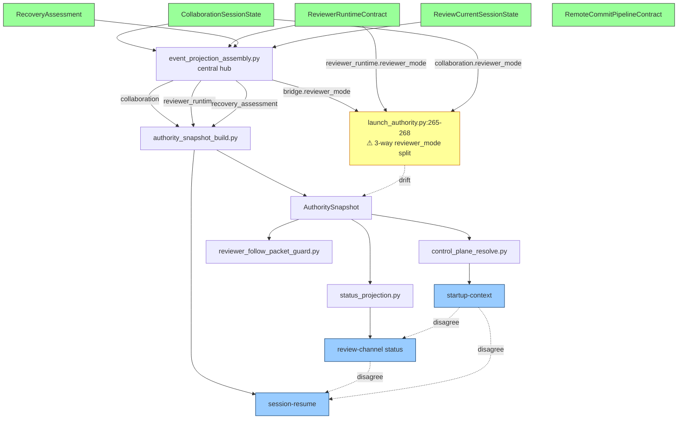

# SYSTEM_MAP.md — Living Connectivity Index

**Purpose.** Connectivity index for *how the typed system is wired together and
where it is not*. This is a **supplementary navigation surface**, not a bootstrap
replacement. The canonical bootstrap order in `AGENTS.md:235-242` and
`dev/active/INDEX.md:3-4` always comes first — SYSTEM_MAP.md is consulted
**after** startup-context + INDEX + MASTER_PLAN (see section 12 for full
sequence).

**Maintenance rule (honor or the map decays).** Every time dogfood,
findings-priority, agent-mind, system-picture, or any audit surfaces a new
disconnected system, duplicate, dormant field, or drift, **add a row to the
relevant table below**. A broken connection without a row here is a bug in this
doc, not just a bug in the system. Update-before-land is tracked by
the `system_map_renderer` managed block plus the instruction-surface sync guard.

**Operator directive (2026-04-19):** "Keep on connecting systems that aren't
connected and making sure everything that is connected is just supposed to be
the system that works together. Keep on iterating till everything is connected."

**Last updated:** 2026-04-25 (managed connectivity block, `system-map` command,
startup/session key-surface wiring, and rev_pkt_1358/1370/1374/1380 corrections
folded into the SYSTEM_MAP source-of-truth slice.)

---

## 0.5 Executive Summary — System at a Glance

**What this repo is in 2 sentences (governance-first framing):** This repo is a portable typed AI-governance platform (`devctl` runtime + review-channel packet protocol + guards/probes/findings pipeline) designed to record agent decisions, enforce safe mutations, and compile policy across any adopting repo. VoiceTerm — a Rust terminal overlay for voice-driven AI CLI interaction — is ONE adopter/product shell around that engine, not the engine itself.

### 5 Core Subsystems (engine-first)

1. **Governance Engine** — portable typed runtime. 71 guards + 26 probes + `findings-priority` ranker + `governance-review` ledger. Contract chain: `ProjectGovernance → RepoPack → PlanRegistry → PlanTargetRef → WorkIntakePacket → CollaborationSession → TypedAction → ActionResult/RunRecord/Finding → ContextPack`. Coverage: 42% guards, 88% probes, 100% roles.
2. **devctl Command Tree** — Python CLI orchestrator. Use the generated command
   inventory below for the current count; top tier: `startup-context`,
   `review-channel`, `session-resume`, `check`, `governance-review`,
   `dashboard`, `findings-priority`, `system-map`.
3. **Review Channel** — typed packet protocol for dual-agent collaboration. 5 dataclasses → `event_projection_assembly.py` → typed snapshots consumed by `startup-context` / `session-resume` / `review-channel status`.
4. **Dashboard + Operator Console** — `dashboard.py` (+ `phone-status` / `mobile-status`) renders typed review state. Operator Console = PyQt6, ~23.5k LOC in `app/operator_console/`.
5. **VoiceTerm Product Shell (ONE adopter example)** — Rust binary `rust/src/bin/voiceterm/main.rs` demonstrates voice-driven AI CLI interaction atop the governance engine. Mic → Whisper STT → keystroke injection → HUD overlay. Other adopters plug their own product shell — the engine is the portable part.

### The Typed Data Chain (1 sentence)

Data flows from **5 source dataclasses** (`CollaborationSessionState`, `ReviewerRuntimeContract`, `RecoveryAssessment`, `ReviewCurrentSessionState`, `RemoteCommitPipelineContract`) → `event_projection_assembly.py` hub → `authority_snapshot` gate → startup-context/review/resume surfaces, with governance guards/probes projecting parallel views into findings.

### Known Chronic Problems (3 one-liners)

1. **3-way reviewer_mode drift (rev_pkt_1335):** `launch_authority.py:265-268` reads reviewer_mode from 3 sources; `collaboration_session.py:144` overwrites declared with effective → startup-context/review-channel/session-resume disagree → state oscillates `active_dual_agent ↔ tools_only`.
2. **Projection redundancy (rev_pkt_1333):** 10+ emitter/reader pairs mismatch; 40+ `_from_mapping()` duplicates; 6 same-job-different-path systems exist (review-state loading, packet inbox, snapshot construction, authority snapshot, bootstrap, check orchestration).
3. **89% of findings unscoped to MPs** — 111 of 124 `confirmed_issue` entries have zero Master Plan ticket; top-3 critical (fan_out ≥ 16) unowned.

### How the System Is Supposed to Work (2 sentences)

Operator directs agents via typed packets; **current-session role assignment is live in typed state** (read `review_state.projections.latest.json::collaboration.mutation_owner` / `verification_owner` — as of this writing Claude=mutation_owner/coder, Codex=verification_owner/reviewer, but this is live data and can flip per `bridge.md` contract). Agents exchange through review-channel while governance guards validate each mutation against policy. Dashboard surfaces current state, commit+push enforce governed execution (pre-commit checks authority_snapshot, pre-push enforces review gate, post-commit refreshes state). **Rule:** never hardcode role assumptions in prose; always read typed state at session start.

### Where This Doc Fits (1 sentence)

SYSTEM_MAP.md is a supplementary navigation index read AFTER the canonical bootstrap (`startup-context` → `INDEX.md` → `MASTER_PLAN.md`); use section 0 (flowchart), section 4 (projection graph), section 10 (priority backlog), and the section-30+ subsystem deep-dives to locate details in `dev/guides/` and `dev/active/`.

---

## 0.6 Canonical Runtime Spine (v6.2 — promoted from §49 for top-of-doc visibility)

> ⚠️ **v6.4 correction per rev_pkt_1374, updated 2026-04-25:** The ✅ marker below means "typed dataclass exists and is used in some codepath" — it does **NOT** mean the object is wired into `context-graph` edges or discoverable from `startup-context`. The first rev_pkt_1370 closure is now active: `system_map_renderer` is registered in repo policy, `devctl system-map` renders the managed connectivity snapshot, and `check_instruction_surface_sync.py` validates the generated block. Context-graph and startup-context discoverability remain follow-up wiring.

One deterministic control path from repo truth → governed action → evidence → context. Each object is either implemented (✅), partially wired (⚠️), or not yet materialized (❌). Full authority-object detail remains in §49; this is the compact at-a-glance view.

```
ProjectGovernance ✅
  └─ RepoPack ⚠️ (spec'd; RepoPackRef stub only)
      └─ PlanRegistry ✅
          └─ PlanTargetRef ✅
              └─ WorkIntakePacket ✅
                  └─ CollaborationSession ✅
                      └─ PlanExpectationPacket ❌ (downstream of collaboration/intake per platform_authority_loop.md; not materialized — v6.7 reorder per rev_pkt_1380)
                          └─ TypedAction ⚠️ (record-only; no execution contract)
                              └─ ActionResult ⚠️
                                  └─ RunRecord ⚠️ (partial — not load-bearing for decisions)
                                      └─ Finding ✅
                                          └─ CandidateInvariant ❌
                                              └─ SessionDecisionLog ❌ (new row per external-AI round 3)
                                                  └─ ContextPack ⚠️ (bootstrap reducer; not yet unified)
```

**Closure rule:** promote one ❌/⚠️ per session until the chain is fully ✅. Each promotion must include a typed contract, a producer, at least one consumer, and a regression test. See §51 for the ordered closure list.

## 0.7 Authority Load Order (v6.2 — new section per external-AI round 3)

What counts as execution authority vs navigation vs reference:

| Tier | Surface | Role |
|------|---------|------|
| 1 — **Execution authority** | `startup-context --format json`, `session-resume --role <r> --format bootstrap`, `review-channel --action status`, `push --execute` | Typed state; agent MUST act on these |
| 2 — **Canonical prose authority** | `AGENTS.md`, `dev/active/INDEX.md`, `dev/active/MASTER_PLAN.md`, `dev/active/ai_governance_platform.md` | Prose that binds behavior when typed state is silent |
| 2-ref — **Reference-only owner docs** | `dev/active/platform_authority_loop.md` (per `INDEX.md:34-36` — load ONLY when typed MP-377 route names it; do not treat as always-canonical) | Scoped reference — authority only when the active typed phase points at it |
| 3 — **Navigation / connectivity index** | `SYSTEM_MAP.md` (this doc), `context-graph --mode bootstrap` | Human-readable reducer over the system; NOT authority |
| 4 — **Reference / generated projection** | `dev/guides/*`, `dev/reports/*`, `bridge.md`, `dev/audits/REVIEW_SNAPSHOT.md` | Consult when tier 1–3 points at them; do not treat as authority on their own |

**Resolution policy (not enforced):** if tier 3 conflicts with tier 1, tier 1 wins and tier 3 should be hand-updated (or, once rev_pkt_1370 Patch 1 lands, regenerated). Today this is a convention, not a guard — there is no check_* that fails when tier 3 drifts from tier 1. This doc can become stale; typed state cannot.

**Freshness contract (initial enforcement active):** SYSTEM_MAP.md now contains a `system_map_renderer` managed block registered in `repo_governance.surface_generation.surfaces`. `check_instruction_surface_sync.py` validates that generated block and `render-surfaces --write --surface system_map_index` refreshes it. The remaining target is broader: move more prose into typed `ConnectivityRegistry` inputs so SYSTEM_MAP.md becomes a generated projection over typed state (see §51 closure row), not a hand-maintained doc.

---

<!-- BEGIN DEVCTL_SYSTEM_MAP_GENERATED -->
## Generated Connectivity Snapshot

This block is generated by `system_map_renderer`; edit the typed inputs or rerun the renderer instead of hand-editing this block.

- contract_id: `SystemMapSnapshot`
- section_id: `devctl_system_map_generated`
- source_policy: `dev/config/devctl_repo_policy.json`

### Architecture Roots

| Root | Python files | Largest namespaces |
|---|---:|---|
| `dev/scripts/devctl` | 1626 | tests=435, commands=375, runtime=224, review_channel=201, governance=67, platform=61, (root)=58, context_graph=38 |
| `dev/scripts/checks` | 388 | (root)=123, package_layout=32, platform_contract_closure=21, python_analysis=17, review_probes=16, code_shape=15, rust_analysis=15, multi_agent_sync=12 |

### Governed Surfaces

| Surface | Renderer | Output | Scope |
|---|---|---|---|
| `agents_bundle_reference` | `agents_bundle_section` | `AGENTS.md` | tracked |
| `system_map_index` | `system_map_renderer` | `dev/guides/SYSTEM_MAP.md` | tracked |
| `claude_instructions` | `template_file` | `CLAUDE.md` | local-only |
| `codex_voice_slash` | `template_file` | `dev/templates/slash/codex/voice.md` | tracked |
| `claude_voice_skill` | `template_file` | `dev/templates/slash/claude/SKILL.md` | tracked |
| `portable_pre_commit_hook_stub` | `template_file` | `dev/config/templates/portable_governance_pre_commit_hook.stub.sh` | tracked |
| `portable_post_commit_hook_stub` | `template_file` | `dev/config/templates/portable_governance_post_commit_hook.stub.sh` | tracked |
| `portable_pre_push_hook_stub` | `template_file` | `dev/config/templates/portable_governance_pre_push_hook.stub.sh` | tracked |
| `portable_tooling_workflow_stub` | `template_file` | `dev/config/templates/portable_governance_tooling_workflow.stub.yml` | tracked |

### Typed Connectivity Registry

- contract_id: `ConnectivityRegistrySnapshot`
- source_contract_count: 43
- connected_contract_count: 43

| Contract | Owner | Fields | Writer | Consumers |
|---|---|---:|---|---|
| `RepoPack` | `repo_packs` | 3 | `contract:RepoPack:declared` | none |
| `TypedAction` | `governance_runtime` | 5 | `dev.scripts.devctl.runtime.action_contracts:TypedAction` | cli |
| `RunRecord` | `governance_runtime` | 7 | `dev.scripts.devctl.runtime.action_contracts:RunRecord` | none |
| `ActionResult` | `governance_runtime` | 10 | `dev.scripts.devctl.runtime.action_contracts:ActionResult` | none |
| `ArtifactStore` | `governance_runtime` | 3 | `dev.scripts.devctl.runtime.action_contracts:ArtifactStore` | none |
| `Finding` | `governance_runtime` | 18 | `dev.scripts.devctl.runtime.finding_contracts:FindingRecord` | none |
| `DecisionPacket` | `governance_runtime` | 21 | `dev.scripts.devctl.runtime.finding_contracts:DecisionPacketRecord` | none |
| `FailurePacket` | `governance_runtime` | 14 | `dev.scripts.devctl.runtime.failure_packet:FailurePacket` | none |
| `CheckResult` | `governance_runtime` | 8 | `dev.scripts.devctl.runtime.check_result_models:CheckResult` | none |
| `ControlState` | `governance_runtime` | 9 | `dev.scripts.devctl.runtime.control_state:ControlState` | none |
| `CapabilityGrantState` | `governance_runtime` | 12 | `dev.scripts.devctl.runtime.review_state_collaboration_models:CapabilityGrantState` | none |
| `ActorAuthorityState` | `governance_runtime` | 17 | `dev.scripts.devctl.runtime.review_state_collaboration_models:ActorAuthorityState` | none |

### Required Commands

- `python3 dev/scripts/devctl.py system-map --format md`
- `python3 dev/scripts/devctl.py render-surfaces --write --surface system_map_index --format md`
- `python3 dev/scripts/checks/check_instruction_surface_sync.py --format md`
<!-- END DEVCTL_SYSTEM_MAP_GENERATED -->

## 0. Living Flowchart



---

## 1. Typed Sources of Truth (5 core dataclasses)

| Dataclass | File | Role |
|---|---|---|
| `CollaborationSessionState` | `dev/scripts/devctl/runtime/review_state_collaboration_models.py` | Dual-agent session: roles, participants, wake modes, owners |
| `ReviewerRuntimeContract` | `dev/scripts/devctl/runtime/reviewer_runtime_models.py` | Review loop runtime: mode, freshness, acceptance, attachment |
| `RecoveryAssessment` | `dev/scripts/devctl/runtime/recovery_authority.py` | Diagnosis + decision for degraded states |
| `ReviewCurrentSessionState` | `dev/scripts/devctl/runtime/review_state_models.py` | Current instruction + ack state for implementer |
| `RemoteCommitPipelineContract` | `dev/scripts/devctl/runtime/remote_commit_pipeline_models.py:113` | Publication + push readiness |

All 5 flow through `event_projection_assembly.py` which emits 9 keys into
`review_state.json`. The central-hub pattern means one change point when adding
new source state.

---

## 2. Commands (84 total, 22% dogfood-covered)

**Heavily used + connected (top tier):**
`startup-context`, `review-channel`, `session-resume`, `check`, `context-graph`,
`governance-review`, `commit`, `push`, `dashboard`, `findings-priority`.

**Barely wired (needs CI invocation, 10 commands):**

| Command | Refs | Hook-in |
|---|---:|---|
| `compat-matrix` | 24 | release_preflight preflight |
| `launcher-policy` | 25 | ios_ci.yml device-install |
| `cihub-setup` | 27 | release_preflight external-CI gate |
| `launcher-check` | 27 | ios_ci.yml preflight |
| `failure-cleanup` | 31 | failure_triage.yml cleanup phase |
| `path-rewrite` | 31 | audit-scaffold post-remediation |
| `publication-sync` | 36 | release external-pub validation |
| `path-audit` | 37 | code_shape guard integration |
| `integrations-sync` | 40 | tooling_control_plane pre-dogfood |

**Documented-but-not-dogfood-covered (65 commands):** `agent-mind`,
`autonomy-*`, `data-science`, `mutation-loop`, `orchestrate-*`, `phone-status`,
`mobile-status`, `triage-loop`, `loop-packet`, `system-picture`, `security`,
`tandem-validate`, `publication-sync`, `platform-contracts`, 51 more.

**Confirmed dogfood issues (3 currently open):**
- `dogfood.command.startup-context` → `dev/scripts/devctl/commands/governance/startup_context.py`
- `dogfood.code_shape_push_regression` → `dev/scripts/devctl/commands/vcs/push.py`
- `dogfood.review_channel_post_timeout` → `dev/scripts/devctl/commands/review_channel/event_handler.py`

---

## 3. Guards (71) + Probes (26)

**Coverage:** 42% guards dogfood-covered, 88% probes dogfood-covered.

**High-impact uncovered guards (6):**
- `rust_security_footguns` — unsafe deref patterns
- `command_source_validation` — 1,576 raw-args reads unguarded (rev_pkt_0886)
- `multi_agent_sync` — packet `to_agent` filter missing (rev_pkt_0884)
- `platform_contract_closure` — 15 unversioned dataclasses (rev_pkt_0879)
- `rust_runtime_panic_policy` — 3 authority funcs with zero fail-closed tests
- `test_coverage_parity` — coverage debt in multi-agent coordination

**Uncovered probes (3):**
- `probe_mixed_concerns` — split files with 3+ independent function clusters
- `probe_split_advisor` — ranked module-split suggestions from context-graph
- `probe_tuple_return_complexity` — Rust 3+ element tuple returns

---

## 4. Projection Graph (24+ edges, 3 fan-out hotspots, 3 fan-in gaps)

### The 3-way reviewer_mode split (THE drift that caused this session's deadlock)

File: `dev/scripts/devctl/review_channel/launch_authority.py:265-268`
```python
reviewer_mode = _first_text(
    _mapping(review_state.get("bridge")).get("reviewer_mode"),           # A
    _mapping(review_state.get("reviewer_runtime")).get("reviewer_mode"), # B
    _mapping(review_state.get("collaboration")).get("reviewer_mode"),    # C
)
```

| Path | Emitter | Risk |
|---|---|---|
| A `bridge.reviewer_mode` | `event_projection_bridge._event_reviewer_mode` | HIGH — daemon-derived, stales when offline |
| B `reviewer_runtime.reviewer_mode` | `ReviewerRuntimeContract.to_dict` | HIGH — not always written |
| C `collaboration.reviewer_mode` | `CollaborationSessionState.to_dict` | CRITICAL — overwritten by `effective_mode` at `collaboration_session.py:144` (rev_pkt_1335 bug) |

**Historical live evidence (2026-04-19 earlier, during the deadlock):** same
project state was producing three different answers:
- `startup-context` → `reviewer_mode=tools_only`, `mutation_owner=claude`
- `review-channel status` → `reviewer_mode=single_agent`, `mutation_owner=claude`
- `session-resume --role reviewer` → `reviewer_mode=tools_only`, `mutation_owner=""` (blank)

**Current state (2026-04-19 after Codex wake, unstable):** state oscillates
between `active_dual_agent|waiting_on_peer|await_review` and
`tools_only|resync_required|repair_reviewer_loop`. Each state recompute hits the
`collaboration_session.py:144` overwrite. Stable fix is landing rev_pkt_1335.

### Fan-out hotspots (3)
1. `authority_snapshot_build.py:146-310` — 7 emitter reads (CRITICAL)
2. `event_projection_assembly.py:226-299` — 9 emitter writes
3. `status_projection_bridge_state.py:23-107` — 8 outputs + 10 aliases

### Fan-in gaps (3)
1. `authority_snapshot.wake_continuity_ok/wake_gap_summary` — missing emitter (reads untyped `work_intake` dict)
2. `review_state["doctor"]` — no typed projector, consumer reads via `recovery.get("doctor")`
3. `review_state["reviewer_gate"]` — synthetic/read-only, not projected from typed source

---

## 5. Known Drift Points (20 documented)

### Projection drift (10 pairs from rev_pkt_1333 + agent-5)
Emitter↔reader pairs where field sets mismatch. Full table in rev_pkt_1333.

### Duplication candidates (10 additional from agent-3)

| Pair | Overlap | Merge target |
|---|---|---|
| `AgentAttentionRecord` vs `StartupPacketInboxAgentRow` | 70% | Merge to `AgentAttentionRecord` |
| `ReviewerFollowPacketProjection.to_dict` vs `PacketInboxState` serialize | shared filter | Extract `serialize_state_dict_compact` |
| `reviewer_mode` scattered across 3 classes | naming ambiguity | `ReviewerModeState{current, effective}` |
| `CollaborationParticipantState.status` vs `DelegatedWorkReceiptState.status` vs `ReviewPacketState.status` | 60% | `WorkUnitState` base class |
| `authority_snapshot_core._from_mapping` vs `authority_snapshot_parse._from_mapping` | 100% | Delete core duplicate |
| `host_wake_mode` vs `loop_wake_mode` | 100% concept | `WakeModeState{mode, interval, summary}` |
| `ReviewerLastPollState` vs `ReviewBridgeState` poll fields | 100% | Embed `ReviewerLastPollState` |
| `CollaborationArbitrationState.status` vs `CollaborationRestartState.status` | enum duplication | Unified `ReadyStateEnum` |
| 40+ `_from_mapping()` funcs | shared strip/coerce | `deserialize_model_from_mapping` helper |
| `CollaborationParticipantState` vs `CollaborationRoleAssignmentState` | 65% | Unified `ActorRoleState` |

---

## 6. Half-Built Systems (15)

| # | Location | Status |
|---|---|---|
| 1 | `plan_registry_projection.py:167,206` (render_*_projection) | No prod callers, only tests |
| 2 | `authority_snapshot_projection.py:26` (SnapshotResultInputs) | Single constructor site |
| 3 | `control_plane_section.py:23` | 2 consumers, possibly vestigial |
| 4 | `monitor_snapshot_support.py:53` (source labels) | Package built, no consumer |
| 5 | `authority_snapshot_projection.py:44` (wake_fields) | No review/governance consumer |
| 6 | `collaboration_wake_contract.py:41` (LoopCandidateRowsInputs) | Internal-only intermediate |
| 7 | `plan_registry_projection.py:56,90,123` (scope matching) | Routes via bridge compat |
| 8 | MP-389/391/395 | Implementation exists, promotion not wired |
| 9 | `dogfood_governance.py:11,47` (governance input) | Not wired to finding-promotion |
| 10 | `authority_snapshot_build.py:31` (AuthorityBuildContext) | Built once, discarded |
| 11 | `recovery_authority.py:1,40` | Classification unused by policy |
| 12 | `control_plane_read_model_support.py:27` (Inputs) | Future-path that didn't materialize |
| 13 | `startup_push_models.py:56` (PushDecisionSpec) | Over-dimensioned spec |
| 14 | `collaboration_wake_contract.py:95,153` | Gap descriptions never consumed |
| 15 | `portable_code_governance.md` | Extraction boundary not yet enforced |

---

## 7. Dormant Typed Surfaces (12)

| Field | File | Status |
|---|---|---|
| `approval_mode` | `review_state_collaboration_models.py:32` | Defined, never written |
| `supervision_mode` | `:33` | Defined, never written |
| `metadata_path` | `:35` | Parsed, not consumed |
| `log_path` | `:36` | Parsed, not consumed |
| `launch_command` | `:37` | Stored, passthrough only |
| `planned_lane_count` | `:39` | Written, never read |
| `requested_worker_budget` | `:38` | Written, never read |
| `lane/mp_scope/worktree/branch` | `:59-62` | Parsed, rarely read |
| `implementer_session_state` | `review_state_models.py:69` | Written, 1 read site |
| `implementer_session_hint` | `:70` | Written, UI-only |
| `wake_gap_summary/loop_gap_summary` | `authority_snapshot_core.py:83,88` | Informational, no branch |
| `ReviewPacketState.trace_id` | `review_state_packet_models.py:181` | Written once, never read |

---

## 8. Hook Inventory (14 points, all static-identity → upgrade to dynamic-role)

| Hook | Source | Classification | Upgrade |
|---|---|---|---|
| pre-commit permission gate | `.git/hooks/pre-commit` + `commit_permission.py` | STATIC identity | Allow raw commit when `reviewer_mode=active_dual_agent` + `review_gate_allows_push` |
| pre-commit snapshot refresh | `.git/hooks/pre-commit` | STATIC path | Skip when `reviewer_mode=tools_only` |
| pre-push absolute block | `.git/hooks/pre-push` | STATIC identity | Allow when `reviewer_mode=single_agent` + ≤1 implementer |
| post-commit receipt | `.git/hooks/post-commit` | STATIC path | Skip when `checkpoint_required=False` |
| commit_permission decision | `commit_permission.py` | HYBRID | Extend dual-agent relaxation logic |
| Check routing by profile | `check/profile.py` | STATIC routed | Skip runtime-heavy checks when mode is `tools_only`/`paused` |
| AI Guard step | `check/support.py::build_ai_guard_cmd` | DYNAMIC mode-aware | Skip when offline |
| Review probes step | `check/phases.py` | DYNAMIC mode-aware | Skip when mode != `active_dual_agent` |
| Mutation score step | `check/phases.py` | STATIC profile | Skip when mode=tools_only |
| Startup-context gate | `startup_context.py` | DYNAMIC typed | Already role-aware |
| Reviewer gate state | `ReviewerGateState` | DYNAMIC typed | Expose to pre-commit hook |
| Coderabbit gate | `check/coderabbit_gate_support.py` | STATIC | Skip when single_agent |
| Publication sync guard | `publication_sync_guard/` | STATIC path | Gate on mode permits publication |
| Contract connectivity checks | `contract_connectivity/` | DYNAMIC | Skip topology checks when tools_only |

### Claude-Code hook layer (operator-flagged architectural defect, rev_pkt_1342)
The `.claude` hook currently denies Claude edits based on static identity
("Claude is observer-only"). It should be dynamic on typed role: when operator
or typed state authorizes a role switch (dashboard → implementer for bounded
scope), the hook should accept. Current workaround: word-for-word operator
consent quoted in bash `description` field. Permanent fix: typed
`operator_role_override` surface the hook consults.

---

## 9. Dogfood Coverage (37% / 42% / 88% / 100% — 2026-04-19)

| Target | Covered | Total | % |
|---|---:|---:|---:|
| command | 31 | 84 | 37% |
| guard | 30 | 71 | 42% |
| probe | 23 | 26 | 88% |
| role | 3 | 3 | 100% |

Latest dogfood run: 2026-04-19 (Claude + Codex joint session).
`--dev-mode` flag unblocks `--record`; hook permits with flag supplied.

**Dogfood command display bug observed 2026-04-19:** `devctl dogfood --format md --max-rows N` incorrectly applies `--max-rows` to the Coverage stat computation (not just row display). `--max-rows 1` reports coverage as `command 1/84 1.19%` even when 31 commands have been recorded. Use `--format md` WITHOUT `--max-rows` for accurate coverage. Follow-up finding for Codex's coder lane.

**Top-3 recommended commands to cover next:**
1. `check --profile ci` — exercises ~8-12 downstream guards in one run
2. `review-channel --action post/status` — 6 uncovered actions with 3+ known HIGH issues
3. `startup-context --role reviewer` — closes the open `dogfood.command.startup-context` confirmed_issue

---

## 10. Priority Fix Backlog (from `findings-priority` + dogfood + packet log)

### From findings-priority ranker (top-5 critical)
- **[critical] fan_out=16** `dogfood_development_engine` — `dashboard.py`
- **[critical] fan_out=11** `audit_review_state_contract_drift` — `review_state_parser.py`
- **[critical] fan_out=9** `guard_probe_data_isolation` — `check/phases.py`
- **[critical] fan_out=4** `contract_consumption_enforcement_gap` — `platform_contract_closure/field_routes.py`
- **[critical] fan_out=1** `guard_system_composition_missing` — `check_code_shape.py`

### From findings-priority ranker (top-3 high)
- **[high] fan_out=17** `mp358_role_contract_drift` — `status_projection.py`
- **[high] fan_out=16** `dogfood_dev_mode_needed` — `dashboard.py`
- **[high] fan_out=12** `mp358_cursor_handoff_gap` — `handoff.py`

### Decided-but-unbuilt (3 — from agent-7 audit)
- rev_pkt_0411 `FindingClosureGate` (5 days old, acked)
- rev_pkt_0414 `WakeSignal` bidirectional contract (5 days old, acked)
- rev_pkt_1271 `MP405-T03` dead-api guard (<1 day, acked)

### Root-cause fixes blocking this session
- **rev_pkt_1335** `collaboration_session.py:86,93,132,144,166,176` — `reviewer_mode=effective_mode` should be `reviewer_mode=reviewer_mode`; restart block at `:156` is the correct precedent
- **rev_pkt_1321** `session_resume_authority_payload.py:115-134` — `to_dict()` silently omits `collaboration` key
- **rev_pkt_1322** `session_resume_support.py:300-305` — unconditional `next_command` overwrite
- **rev_pkt_1324** `session_resume_support.py:300-305` — `shared_blockers` CSV leaks `implementation_permission_blocked` into expired-packet summary
- **rev_pkt_1318** `test_startup_context.py:698` — `test_slim_token_budget` asserting <10000 tokens; current = 12332

---

## 11. Existing Architecture Docs (7, all 2-4 weeks stale)

| Doc | Lines | Last | Status |
|---|---:|---|---|
| `dev/guides/ARCHITECTURE.md` | 905 | 4w | Umbrella, product narrative — keep, link from here |
| `dev/guides/SYSTEM_ARCHITECTURE_SPEC.md` | 943 | 4w | Typed contract spec — keep, reference |
| `dev/guides/SYSTEM_FLOWCHART.md` | 1095 | 4w | **Sections 1-9 SUPERSEDED by section 0 Mermaid + section 4 here.** Sections 10-13 (EXTRACTION_ROADMAP + TARGET_ARCHITECTURE + PORTABILITY_DEFINITION) are FORWARD-LOOKING content to preserve into future dedicated docs if/when extraction begins — none of those target docs exist yet, do not link them as if they do |
| `dev/guides/SYSTEM_AUDIT.md` | 1935 | 4w | **SUPERSEDED by sections 4-9 here** — archive after extracting security-critical entries (§15 RCE, §22.3 atomicity) |
| `dev/guides/DEVCTL_ARCHITECTURE.md` | 577 | 2w | Most current — **keep as deep-dive appendix** referenced from section 2 here |
| `dev/guides/PYTHON_ARCHITECTURE.md` | 257 | 3w | Type-shape decision tree — **fold into SYSTEM_ARCHITECTURE_SPEC Appendix A** |
| `dev/guides/AGENT_COLLABORATION_SYSTEM.md` | 741 | 4w | Operator's runtime guide — **partial archive; merge sections 58-71, 108-151, 265-327 into sections 1, 4 here** |

**Consolidation goal:** fold superseded sections (SYSTEM_FLOWCHART + SYSTEM_AUDIT
non-security content) into this map over the next 3 sessions. Archive
originals to `dev/history/` with short README explaining consolidation.
Pre-dates rev_pkt_1335/1321 discoveries so some of its architectural claims
are stale.

---

## 12. Where This Doc Fits In the Bootstrap Order

**SYSTEM_MAP.md supplements the canonical bootstrap — it does NOT replace it.**
The required order per `AGENTS.md:235-242` and `dev/active/INDEX.md:3-4` is:

1. `python3 dev/scripts/devctl.py startup-context --format summary` (STEP 0 per CLAUDE.md)
2. `dev/active/INDEX.md` — canonical registry for active docs
3. `dev/active/MASTER_PLAN.md` — execution authority / tracker
4. Task-class router → matching command bundle

**Read SYSTEM_MAP.md (this doc) AFTER step 1 for connectivity context** — it is
the index that tells you WHERE each subsystem lives and HOW to find gaps. Use
sections 0 (flowchart), 4 (projection graph), and 10 (priority backlog) as the
navigation surface into the detailed guides in `dev/guides/` and plans in
`dev/active/`.

**Then consult typed surfaces on demand:**
- `python3 dev/scripts/devctl.py findings-priority --format md` (backlog ranker)
- `python3 dev/scripts/devctl.py dogfood --format md` (coverage + confirmed issues)
- `python3 dev/scripts/devctl.py agent-mind --agent <self> --limit 5` (own recent activity)
- `python3 dev/scripts/devctl.py context-graph --query <mp-id> --format md` (scoped ZGraph subgraph)
- `python3 dev/scripts/devctl.py system-picture --format md` (8-section typed dashboard)

**Observation flagged in rev_pkt_1331:** each fresh Codex conductor currently
re-reads the full `AGENTS.md` + `bridge.md` + `MASTER_PLAN.md` chain on spawn
(~30 seconds) which contributes to latency. That's about optimizing the
bootstrap after the canonical order executes — not skipping the order.

---

## 13. Session Context (2026-04-19 recovery)

This doc was seeded after the system deadlocked from the rev_pkt_1335
`collaboration_session.py` mode-overwrite bug causing three surfaces to
disagree on `reviewer_mode`, which cascaded into:
- wake-edge not firing (won't spawn Codex when conductor dies)
- launcher gate demanding checkpoint
- pre-push hook demanding governed path
- governed push blocked on stale-process preflight

Recovery commit `8ef9f1a7` (pushed as `37d6be74` post-commit auto-snapshot)
broke the 4-hour zero-commit streak. 19 prior commits reached GitHub
simultaneously.

The typed state holds 40+ packets (`rev_pkt_1305`..`rev_pkt_1345`) documenting
the full audit. See also:
- rev_pkt_1340: operator 5-page handwritten diagnosis (photographed + transcribed)
- rev_pkt_1338: 8-agent audit synthesis
- rev_pkt_1344: SYSTEM_MAP.md proposal (this doc)
- rev_pkt_1345: 7-doc consolidation directive

---

## 14. Context Graph / ZGraph Semantic-Compression System

**What it is (plain English):** semantic compression layer that encodes
contract obligations, proof chains, authority sources, and AI fix recipes
into compressed 22-bit pointers (Z-refs). Foundation is built and working;
full semantic encoding is Phase 2-3.

**Top files:**
- `dev/scripts/devctl/context_graph/builder.py` (351 lines) — graph builder from probes/guards/plans/contracts
- `dev/scripts/devctl/context_graph/snapshot_payload.py` (241 lines) — `ContextGraphSnapshot` dataclass
- `dev/scripts/devctl/context_graph/models.py` (102 lines) — 14 node kinds, 7 edge kinds
- `dev/scripts/devctl/context_graph/command.py` (251 lines) — CLI: query/bootstrap/concept-view/diff
- `dev/scripts/devctl/context_graph/query.py` — graph queries, confidence scoring

**Commands:**
- `python3 dev/scripts/devctl.py context-graph --mode bootstrap --format md` — AI startup packet
- `python3 dev/scripts/devctl.py context-graph --query '<term>' --format md` — targeted subgraph
- `python3 dev/scripts/devctl.py context-graph --mode diff --from <sha> --to <sha> --format md` — snapshot delta

**Current state:** **half-built**. Tier 0 complete (128+ references, functional in production). Tier 1-2 design-only — proof chains, Z-ref encoding (12-bit pattern + 10-bit hash), contract-value guards, AI context injection all documented in `ZGRAPH_RESEARCH_EVIDENCE.md` (1429 lines) but not yet implemented.

**Authority doc:** `ZGRAPH_RESEARCH_EVIDENCE.md` (repo root) — Phase 1-6 roadmap, industry validation (6.8x-49x token reductions), 100+ integration points.

**Live graph (per `context-graph --mode bootstrap` today):** 2973 source files, 71 guards, 26 probes, 4 plans, 77076 edges.

---

## 15. Active Plans Inventory (30 docs in `dev/active/`)

**Section 11 previously listed 7 architecture guides.** The full active-plan landscape
is 30 markdown files across `dev/active/` driving live execution. Top-10 with owner
role and current state:

| Plan | Scope | Role | Status | Last |
|---|---|---|---|---|
| `MASTER_PLAN.md` | MP-377..MP-410 unified | canonical tracker | in_progress | Apr 19 |
| `ai_governance_platform.md` | MP-377 governance product | spec + tracker | in_progress | Apr 19 |
| `review_channel.md` | MP-355 dual-agent surfaces | spec + mirrored | active | Apr 17 |
| `review_probes.md` | MP-368..MP-375 AI review | spec + mirrored | active | Apr 9 |
| `platform_authority_loop.md` | MP-377 startup/routing | reference owner-doc | active | Mar 27 |
| `remote_control_runtime.md` | MP-380..MP-387 reviewer/runtime | reference owner-doc | active | Apr 18 |
| `continuous_swarm.md` | MP-358 Codex/Claude dogfood | reference-only | active | Apr 15 |
| `portable_code_governance.md` | MP-376 portable guards | reference owner-doc | active | Apr 15 |
| `autonomous_control_plane.md` | MP-325..MP-340 mobile control | reference-only | active | Apr 11 |
| `pre_release_architecture_audit.md` | MP-347/349 pre-release | reference-only | done | Mar 27 |

**Promises not tracked in any MP (5):**
1. "smarter guard/probe rollout" — `ai_governance_platform.md:3578` (no MP assigned)
2. "absence-checking" guards — `pre_release_architecture_audit.md:272` (no MP)
3. `missing_guard`/`missing_probe` governance-ledger linkage — `platform_authority_loop.md:302`
4. JS/TS/Java guard/probe packs — `MASTER_PLAN.md:5101` (phrased as a need)
5. Theme Studio 6 deferred fields — `theme_upgrade.md:1412`

**Orphan plans (0-5 external refs):** `slash_command_standalone.md`,
`naming_api_cohesion.md`, `code_shape_expansion.md` — candidates for archive
or MP re-anchoring.

---

## 16. MP Tracker (22 open MPs, all healthy, 5 HOT driving 70% of activity)

**Dependency structure:** all feed into MP-377 (AI Governance Platform umbrella).
Acyclic peers within scope. **Zero orphaned MPs (all have packet refs); zero stuck (no MP >30 days idle).**

### HOT MPs (packet-ref count)
| Rank | MP-ID | Refs | Title |
|---:|---|---:|---|
| 1 | MP-398 | 41 | push preflight staged-index exclusion |
| 2 | MP-411 | 39 | portability audit |
| 3 | MP-417 | 34 | snapshot-drift ordering fix |
| 4 | MP-388 | 26 | consolidation archive pass |
| 5 | MP-405 | 24 | guard expansion (parent of MP-405-T03 dead-api) |
| 6 | MP-412 | 13 | HarnessAuthContract |
| 7 | MP-414 | 12 | typed decision policy |
| 8 | MP-399 | 11 | governed commit staged-index preservation |
| 9 | MP-410 | 11 | devctl root package-layout relief |
| 10 | MP-397 | 11 | CLI/runtime parity closure |

### Key insight
Top-5 HOT MPs directly map to Section 10 root-cause fixes:
- MP-398/411/417 → address 3-way reviewer_mode split + session_resume defects (rev_pkt_1335/1321-1324)
- MP-388 → the SYSTEM_MAP.md consolidation itself
- MP-405 → closes half-built systems + dormant surfaces

---

## 17. Integration Seams (8 major points, 3 OVER-connected, 3 DRIFT, 3 BROKEN)

| From | To | Type | Count | Status |
|---|---|---|---:|---|
| Rust voiceterm | pypi cli.py | subprocess | 1 | OK |
| devctl commands/ | devctl runtime/ | imports | **246** | **OVER** |
| devctl runtime/ | dev/scripts/checks/ | typed state | 3 | UNDER |
| devctl commands/ | review_state.json | R/W | **204** | **OVER** |
| app/operator_console/ | devctl/ | subproc+packets | 57 | MODERATE |
| publication_sync/ | external state | git+heartbeat | **524** | **OVER** |
| devctl integrations/ | cihub, code-link-ide | federation | 13 | UNDER |
| governance/ | review_channel/ | plan_registry.json | 0 | **DRIFT** |

### 3 DRIFT cases (one side writes, other never reads)
1. **Governance → plan_registry.json:** 7 writes in `dev/reports/governance/`, 0 reads in any `devctl/commands/`
2. **Rollover → handoff.json:** 30+ directories written since 2026-03-09, only `projection_bundle.py` reads them — 80% unread
3. **Commands → review_state.json refresh cache:** 80+ command files write independently, refresh protocol not enforced

### 3 BROKEN seams observed
1. `dev/scripts/checks/mutation_outcome_parse.py:7` shim — blocks `devctl triage`
2. `control_plane_daemons.py` — no factory/registry; can't add daemon without editing 3+ subsystems
3. `review_state_refresh_support.py` — refresh authority defined but scattered writers bypass it

---

## 18. Autonomy + Remediation Subsystem (8 commands, 3 wired, 5 dormant)

### Command wiring
| Tier | Command | Role | Next caller |
|---|---|---|---|
| Entry | `swarm_run` | Plan orchestrator | `autonomy-swarm` |
| Orchestration | `autonomy-swarm` | N-agent runner | N × `autonomy-loop` |
| Execution | `autonomy-loop` | Controller | `triage-loop` + `loop-packet` |
| Remediation | `triage-loop` | Backlog fixer | terminal |
| Risk | `loop-packet` | Score + draft | terminal |
| Post-audit | `autonomy-report` | Digest | optional from swarm |
| **Dormant** | `autonomy-benchmark` | Matrix test | (unwired) |
| **Orphaned** | `mutation-loop` | Score tracker | (never called) |

### Smarter-guard pattern (YES, this IS the smarter-guard system operator remembered)
1. **Mode enforcement:** `AUTONOMY_MODE` env must be `operate` for mutations (default `report-only`)
2. **Policy bounds:** `max_rounds_hard_cap`, `max_hours_hard_cap`, `max_tasks_hard_cap` from security policy
3. **Branch allowlist:** validated at startup
4. **Risk gating:** `loop-packet` scores risk{low,med,high} + approval_required
5. **Fix-command policy:** `triage-loop.evaluate_fix_policy` before mutations
6. **Governance gates:** `swarm_run` enforces sync/safety checks

### Top-3 gaps
1. `autonomy-benchmark` never runs — code exists, no CI, no dogfood
2. `mutation-loop` orphaned from swarm — standalone only
3. `autonomy-report` not auto-triggered from `autonomy-loop` — only from swarm --post-audit

---

## 19. Dashboard + Operator Console Subsystem

### Wiring
```
bridge.md + review_state.json + compact.json
    ↓ (prefer typed)
load_current_review_state()
    ↓
dashboard_typed_state (extractors)
    ↓
dashboard_builders (11 sections)
    ↓
DashboardSnapshot (json/md/terminal)
    ↓
phone-status / mobile-status
    ↓
operator_console (PyQt6, ~23.5k LOC, reads bridge+review directly)
```

### Critical findings (both fan_out=16)
1. **`dogfood_development_engine`** at `dashboard.py:255-259`: forces bridge-projection refresh **every tick** with `prefer_cached_projection=False`. **Fix:** change to `True`. Stops 16 downstream re-computations per run.
2. **`dogfood_dev_mode_needed`**: dogfood re-activation blocked because `.claude` hook reads `--dev-mode` as scope escalation. **Fix:** typed `operator_role_override` surface (rev_pkt_1342).

### operator_console structure (~165 files / 23.5k LOC / 9 submodules)
`state/` (43 files, 5.9k LOC): bridge/review/sessions/snapshots/core/activity/presentation/repo/jobs. No subprocess calls — reads artifacts directly. Builds its own `OperatorConsoleSnapshot` independent of `dashboard.py`.

### Dashboard-ready commands
`dashboard`, `phone-status`, `mobile-status`, `status`, `startup-context`, `control-plane read-model` (internal).

---

## 20. Test Architecture

**Totals:** 387 Python test files (~3758 cases) + 2413 Rust tests = **6171 tests total**.

### Coverage by subsystem
| Area | Files | Cases | Ratio |
|---|---:|---:|---:|
| root | 132 | ~1100 | — |
| review_channel | 56 | ~900 | 30% of modules |
| runtime | 44 | ~600 | 25% |
| checks | 79 | ~700 | 42% guards, 88% probes |
| governance | 23 | ~350 | 35% |

### Known failing (2 confirmed)
- `test_slim_token_budget` at `test_startup_context.py:603` — 12332 tokens > 10000 limit (rev_pkt_1318)
- `test_attention_command_overrides_stale_read_model_next_command` at `test_session_resume.py:1772` (rev_pkt_1322)

### Two-layer architecture status
- **Layer A (deterministic scenario tests):** ✅ **built** — ~3300 fixture-driven tests; `test_review_channel.py` alone is 16,007 lines. But **blind** to multi-source projection collapse (rev_pkt_1335 has zero direct coverage).
- **Layer B (live-agent soak):** ❌ **absent** — dogfood lives in `commands/`, not test tree. Blocked on `--dev-mode` scope-escalation gate.

### Top-5 coverage gaps
1. rev_pkt_1335 3-way reviewer_mode split — **zero direct test**
2. Wake-continuity state machine emission → consumption — no emitter trace
3. Multi-agent `to_agent` packet filter (rev_pkt_0884) — topology tested, routing not
4. Recovery policy enforcement — classification built, policy unused, untested
5. Rust panic fail-closed — 3 authority funcs with zero fail-closed tests

---

## 21. Complete Undocumented-Commands Catalog

### 85 commands → only 19 dogfood-covered. Prior section 2 named 10 barely-wired.  Additional 15 below.

| Command | Purpose | Risk |
|---|---|---|
| `agent-mind` | Mind-stream reader for codex/claude | Live provider modes; may auto-mutate |
| `autonomy-benchmark` | Score autonomous completion across scenarios | Mutation-heavy; coverage instrumented |
| `autonomy-loop` | Bounded controller loop | Dual-agent circular-instruction deadlock |
| `autonomy-swarm` | N-parallel agents + consensus | No OOM protection under high N |
| `cihub-setup` | CI/CD hub config init | Overwrites `.ci-hub.yml`; needs gh token |
| `data-science` | Extract telemetry | May leak probe metadata |
| `governance-draft` | Stage draft decision packet | No cycle detection |
| `governance-import-findings` | Ingest external findings | Blind upsert; lost customizations |
| `guard-run` | Execute one guard in isolation | Can mutate source if misconfigured |
| `install-git-hooks` | Write pre-commit hooks | Silently overwrites existing |
| `integrations-import` | Vendor external submodules | Network I/O fail on unreachable remote |
| `integrations-sync` | Force-reset submodules to HEAD | Loses local integration changes |
| `loop-packet` | Wrap action into review-packet | 30min TTL; old packets silently drop |
| `monitor` | Long-running event watcher | No auto-restart |
| `mutation-loop` | Iterative mutation + recheck | Can deadlock if mutation touches guards |

### 17 hidden review-channel actions (previously undocumented)
`doctor`, `stop`, `reviewer-heartbeat`, `reviewer-checkpoint`, `reset-implementer-state`, `promote`, `post`, `operator-inbox`, `ack`, `dismiss`, `apply`, `history`, `bridge-poll`, `render-bridge`, `attach-remote-control`, plus `--allow-unread-inbox` / `--auto-promote` / `--refresh-bridge-heartbeat-if-stale` flags.

### Undocumented environment variables
- `DEVCTL_QUALITY_POLICY` — override active policy path
- `AUTONOMY_MODE` — `off` / `read-only` / `operate` (per `dev/scripts/devctl/commands/autonomy/loop.py:88-101` + `dev/scripts/README.md:1295`; prior drafts incorrectly listed `single_agent/dual_agent/swarm`)
- `VOICETERM_DEVCTL_LIVE_OUTPUT_TIMEOUT_SECONDS` — command polling timeout
- `DEVCTL_PIPELINE_FAKE_HEAD` — test-only HEAD override
- `DEVCTL_NO_REVIEW_SNAPSHOT_REFRESH` — skip pre-commit snapshot refresh

### Packet kinds — dormancy claim requires grep-level verification (per rev_pkt_1360)
Prior drafts claimed 6 of 12 kinds were dormant. Re-verification needed:
- `commit_approval` IS wired in runtime code (rev_pkt_1360 evidence)
- Plan packet kinds (`plan_gap_review`, `plan_patch_review`, `plan_ready_gate`) ARE wired in planning flows (rev_pkt_1360 evidence)
- `approval_request` and `system_notice` — grep status to be re-verified in next audit
- Previous blanket "dormant" claim is retracted pending per-kind consumer-site grep

### `integrations/` summary
- `code-link-ide/` — Phase 0 voice-driven remote IDE controller (Rust+Swift+TS/Kotlin). mTLS pairing underspecified.
- `ci-cd-hub/` — Java+Python CI hub; `cihub setup/init/check/run` CLI. 3-tier config merge (defaults→hub→repo); drift possible.

---

## 22. Data-Science + Flowchart Generators

### `data-science` command — hidden auto-trigger
**Location:** `dev/scripts/devctl/data_science/` + auto-registered at `cli_parser/reporting.py:45`

**Auto-trigger:** Fires after non-read-only devctl commands via
`maybe_auto_refresh_data_science()` (`entrypoint.py:402`) unless
`DEVCTL_DATA_SCIENCE_DISABLE=1`. Operators rarely invoke it manually but
it powers dashboards.

**Aggregates:**
- devctl event metrics (up to 20,000 events) — success rate, duration percentiles, token estimates
- agent swarm/benchmark data — recommendation scores, tasks-per-minute
- guarded coding episodes — watchdog stats, time-to-green, false-positive rates
- governance reviews — external finding corpus, adjudication coverage
- autonomy analytics — guard family frequencies

**Reports:**
- `dev/reports/data_science/latest/summary.{json,md}`
- `dev/reports/data_science/latest/charts/*.svg` (5 SVG bar charts: command_frequency, agent_recommendation_score, agent_tasks_per_minute, watchdog_time_to_green, watchdog_guard_family_frequency)
- `dev/reports/data_science/history/snapshots.jsonl` (append-only)

### Flowchart / diagram generators (2 independent subsystems)

1. **Context-graph concept renderers** — `context-graph --mode concept-view --format {mermaid|dot}` at `dev/scripts/devctl/context_graph/render.py::render_concept_{mermaid,dot}`
2. **Probe-report hotspot diagrams** — embedded in `probe-report`, emits `dev/reports/probes/latest/hotspots.{mmd,dot}` via `probe_topology/render.py::render_hotspot_mermaid`

**`context-graph --mode bootstrap --format md` emits markdown, NOT mermaid.** The `--format` flag is only honored in concept-view.

---

## 23. Typed-State Field Writer→Reader Trace

Sampled 5 core dataclasses, 16 load-bearing fields. Key findings:

### Fields with ZERO writers (frozen-dataclass builder pattern, by design)
| Field | Readers | Notes |
|---|---:|---|
| `ReviewerRuntimeContract.review_acceptance.review_accepted` (nested) | 36 | Populated only by `reviewer_runtime_parser.parse_reviewer_runtime_contract()` — prior draft omitted the `.review_acceptance` nesting (rev_pkt_1360 correction) |
| `ReviewerRuntimeContract.publish_clear` | 11 | Same builder pattern |
| `ReviewerRuntimeContract.remote_control_attachment` | 35 | 0 direct writers, constructor-only |
| `RecoveryAssessment.diagnosis` | 23 | Populated by `build_recovery_assessment()` only |
| `RecoveryAssessment.decision` | 58 | Same; **58 readers consuming a frozen field** |

### Fields with drift risk (3+ writers → many readers)
| Field | Writers | Readers | Risk |
|---|---:|---:|---|
| `CollaborationSessionState.reviewer_mode` | 10 | 96 | **HIGH_DRIFT** — rev_pkt_1335 root cause |
| `ReviewerRuntimeContract.effective_reviewer_mode` | 6 | 35 | HIGH_DRIFT — co-fuels the 3-way split |
| `ReviewCurrentSessionState.current_instruction` | 31 | 154 | HIGH_DRIFT — central broadcast point |
| `ReviewCurrentSessionState.implementer_ack` | 7 | 102 | HIGH_FAN_OUT — gates multiple workflow checks |
| `ReviewCurrentSessionState.implementer_ack_state` | 20 | 32 | HIGH_DRIFT — multiple parsers |
| `RemoteCommitPipelineContract.state` | 12 | 176 | HIGH_DRIFT — state-machine hub |

### Underutilized fields (candidate for cleanup)
`mutation_owner`, `watcher_owner`, `verification_owner` all have **2 writers and 1 reader each** — incomplete lane-ownership implementation or legacy fields. Either wire them into more decision paths or remove.

---

## 24. Connectivity Claim Verification (7 claims, 4 CORRECT, 3 fixes needed)

| # | Claim | Status | Evidence |
|---|---|---|---|
| 1 | `CollaborationSessionState → EPA → ASB` 2-hop chain | CORRECT | `event_projection_assembly.py:1-22` + `authority_snapshot_build.py:140` |
| 2 | `session-resume` calls `build_authority_snapshot` | CORRECT | `session_resume_support.py:306` |
| 3 | `ReviewerGateState` populated from typed `review_state` | CORRECT | `startup_context.py:242-322` `_detect_reviewer_gate_from_review_state` |
| 4 | `review-channel status → authority_snapshot` pipeline | PARTIAL | Core fields wired; 3 fan-in gaps (wake_continuity_ok, doctor, reviewer_gate) |
| 5 | `dashboard.py → load_current_review_state` cached | **WRONG** | `dashboard.py:258` forces `prefer_cached_projection=False` every tick (fan_out=16 critical finding) |
| 6 | `findings-priority` `fan_out` accurate | HEURISTIC | `triage/findings_priority.py:244-262` counts import edges only; ignores inheritance/composition/calls |
| 7 | `dogfood` log has CI writers | **WRONG** | Zero CI workflows call `dogfood --record`; blocked by `--dev-mode` scope gate |

---

## 25. Architectural Spec↔Reality Divergences (10 documented)

| # | Divergence | Severity |
|---|---|---|
| 1 | `RepoPack` class spec'd in chain, only `RepoPackRef` stub exists | HIGH |
| 2 | AGENTS.md:235-242 mandatory bootstrap NOT enforced — no guard blocks skipping | HIGH |
| 3 | Portability claims vs 3 VoiceTerm hardcodes: `surface_definitions.py:102`, `extension_bundle_defaults.py:13`, `review_snapshot_hints.py:231` | MEDIUM |
| 4 | `schema_version=1` everywhere; spec promises migration + rollback path; zero migration logic exists | HIGH |
| 5 | Spec claims SYSTEM_MAP.md "6 dormant packet kinds"; code doesn't mark dormancy | MEDIUM |
| 6 | **89% of `confirmed_issue` findings (111 of 124) have zero MP scope** — floating without execution accountability | CRITICAL |
| 7 | 3-way `reviewer_mode` split at `launch_authority.py:265-268` contradicted "single authority" spec | CRITICAL |
| 8 | Bootstrap Step 0 `startup-context` marked mandatory in AGENTS.md; no enforcement in commands | HIGH |
| 9 | `portable_code_governance.md` "no core-engine patches" claim contradicted by 2 proof-run revisions | MEDIUM |
| 10 | `authority_snapshot.wake_continuity_ok/wake_gap_summary` reads untyped `work_intake` dict; no typed emitter | MEDIUM |

---

## 26. Redundancy Sweep — Same-Job-Different-Path (6 additional beyond Section 5)

| # | Pattern | Merge target |
|---|---|---|
| 1 | Review-state loading 3 entry points: `load_review_state_payload()`, `load_current_review_state()`, `load_mobile_review_state()` | Single `load_review_state()` with `LoadStrategy` enum |
| 2 | Packet inbox 4 reader paths: inbox reducer + event reducer + `inbox` CLI + `operator-inbox` CLI alias | Single `PacketInboxReader` class; operator-inbox as preset |
| 3 | System snapshot 3 builders: `dashboard.py` + `system-picture` + `operator_console/snapshot_builder.py` | Extract `SnapshotSourceLoader`; builders work on common payload |
| 4 | Authority snapshot 2 construction paths: `build_authority_snapshot()` + `authority_snapshot_from_mapping()` | Rename latter to `_parse_fields()`, route through builder |
| 5 | Bootstrap 3 entry points: `startup-context`, `session-resume`, `context-graph --mode bootstrap` | `BootstrapPayloadBuilder` with pluggable freshness + role profile |
| 6 | Check orchestration 2 paths: `check-router` + `check --profile {ci\|quick}` | Unify into `CheckProfile` dataclass; check-router becomes dynamic profile builder |

**Bonus:** Bridge parsing occurs in 6+ places — all call `parse_markdown_sections()`, no true duplication but caching would avoid reparsing.

---

## 27. Self-Updating SYSTEM_MAP Design (Phase 2 mechanism)

**PARTIALLY IMPLEMENTED:** `python3 dev/scripts/devctl.py system-map --format md` now renders the bounded managed connectivity snapshot, and `render-surfaces --write --surface system_map_index` writes it into this file. The broader regenerate workflow remains proposed: `python3 dev/scripts/devctl.py system-map --regenerate --preserve-sections "13,14,15" --format md --write --dry-run`

The full section-preserving regeneration flow is still a Phase 2 design artifact for discussion. Treat references to `devctl system-map --regenerate` as proposed/pending until that option lands.

**Auto-generatable sections (14 of 21):** 0 (flowchart via context-graph), 2 (commands via discover), 3 (guards+probes via discover+dogfood), 6 (half-built via system-picture+findings-priority), 7 (dormant surfaces via system-picture+discover), 9 (dogfood coverage via dogfood), 10 (priority backlog via findings-priority), 16 (MP tracker via grep+MASTER_PLAN), 18 (autonomy via discover+system-picture), 20 (test architecture via pytest collect), 21 (undocumented catalog via discover+grep), +3 hybrid (4, 5, 8, 14, 15, 17, 19).

**Canonical hand-written (must preserve):** 1 (typed sources), 11 (architecture docs), 12 (bootstrap order), 13 (session context).

**Preservation marker:** `<!-- BEGIN SYSTEM_MAP_PRESERVE:section_N -->` ... `<!-- END SYSTEM_MAP_PRESERVE:section_N -->` wraps operator-curated content. Regenerate replaces everything outside markers.

**Phases:** (1) dry-run with discover+dogfood seeding, (2) full 8-source regeneration with section-hash tracking + `--write` mode, (3) pre-push gate + `--watch` mode + MP-406 generator integration.

---

## 28. Rust Product Code Layout (`rust/src/`)

**Entry:** `rust/src/bin/voiceterm/main.rs` (944 LOC) — hierarchical module tree, 67 public submodules, concurrent input/PTY/voice/HUD/writer threads.

**10 major Rust subsystems:**
1. **Voice Pipeline** (`voice_control/`, 4 modules, 10.4 KLOC `drain.rs`) — VoiceManager orchestration, native/Python fallback detection
2. **Prompt Detection** (`prompt/`, 9 modules, 3K+ test LOC) — ready-marker pattern matching, occlusion signals
3. **HUD System** (`hud/`, `status_line/`, 16 modules, 1.2K test LOC) — modular HudModule trait
4. **Terminal I/O** (`writer/`, 8 modules, 1.7K test LOC) — crossbeam channel serialization
5. **IPC Daemon** (`daemon/`, 10 modules, 343 `#[cfg(test)]` blocks) — Unix socket + WebSocket bridge
6. **Memory Studio** (`memory/`, 11 modules) — **SCAFFOLDED BUT NOT WIRED** (`#![allow(dead_code)]`, MP-230..MP-255 pending)
7. **Dev Panel** (`dev_panel/`, `dev_command/`, 15 modules) — cockpit page, review artifact browser
8. **Theme System** (`theme/`, 19 modules, 343 test configurations) — component registry, style schema
9. **Event Loop** (`event_loop/`, 13 modules, 1.2K test LOC) — overlay state machine
10. **Config & Backends** (`config/`, 4 modules) — CLI schema, backend resolution

**Rust↔Python seam:** ONLY fallback path via `legacy_tui/state.rs::run_python_transcription()` (spawns Python pipeline script). Daemon IPC is Unix socket + serde_json, **no bidirectional Python state sync**. No reviewer_mode or collaboration state flows from Python to Rust.

**Rust-side architectural gaps:**
1. **Memory Studio incomplete wiring** — APIs exist, cockpit displays stats, but retrieval is deterministic-basic (no semantic rerank), SQLite index in-memory only, action execution not integrated
2. **Reviewer/collaboration state invisible Rust-side** — test fixtures reference "reviewer-1" but no Python→Rust daemon sync for reviewer state
3. **Python fallback read-only** — no async feedback loop; daemon doesn't expose Python pipeline health

**Tests:** 2413 Rust `#[test]` blocks. Top coverage: writer state (1735 LOC), status-line buttons (1275), event loop (1248), settings handlers (1232), dev panel (963).

**No `todo!()` or `unimplemented!()` in production code.** Memory subsystem `#![allow(dead_code)]` is scaffolded ahead of UI wiring.

---

## 29. GitHub Workflows + CI Pipeline Map (20 workflows)

### Active CI workflows that invoke devctl
| Workflow | Triggers | devctl commands |
|---|---|---|
| `autonomy_controller.yml` | schedule 6h, manual | `autonomy-loop` |
| `coderabbit_ralph_loop.yml` | workflow_run, manual | `triage-loop` |
| `failure_triage.yml` | workflow_run | `triage` |
| `orchestrator_watchdog.yml` | schedule 15m, manual | `orchestrate-status`, `orchestrate-watch` |
| `rust_ci.yml` | push/pr (Rust) | `check --profile ci` |
| `security_guard.yml` | schedule daily, push/pr, manual | `check`, `security` |
| `release_preflight.yml` | manual only | `release-gates`, `check`, `security`, `docs-check`, `hygiene`, `orchestrate-*`, `ship`, `process-cleanup` |
| `publish_homebrew.yml` | release, manual | `release-gates`, `ship` |
| `publish_pypi.yml` | release | `release-gates`, `ship` |
| `release_attestation.yml` | release, manual | `release-gates` |
| `mutation_ralph_loop.yml` | workflow_run, manual | **custom bridge `mutation_ralph.py run-loop`, NOT devctl** |

### devctl commands NOT invoked from any workflow (orphaned)
`audit-scaffold`, `list`, `pypi`, `homebrew`, `render-surfaces`, `autonomy-benchmark`, `swarm_run`, `data-science`, `discover`, `dogfood`, `findings-priority`, `system-picture`, `context-graph`, `agent-mind`, `system-map`, `mobile-app`, `mobile-status`, `phone-status`, `governance-*`, `launcher-*`, `integrations-*`, ~50 others.

### 3 CI gaps
1. **Mutation-loop uses custom Python bridge** (`mutation_ralph.py`), not `devctl mutation-loop` — creates maintenance divergence
2. **No autonomy-benchmark workflow** — matrix testing code exists but never scheduled
3. **`release-gates` + `ship` separate invocation paths** — 3 release workflows call them independently; risk of desync

### Security workflows summary
- `dependency_review.yml` — GitHub native action
- `security_guard.yml` — cargo deny + `devctl security` + optional zizmor
- `release_preflight.yml` — full compliance gate (50+ checks)
- **No dedicated secret-scanning workflow** — relies on GitHub's built-in

### All runners GitHub-hosted
Ubuntu-latest / ubuntu-20.04 / macos-14. No self-hosted runners.

---

## 30. Rust Voiceterm Deep-Dive — 5 Core Subsystems

### 1. Voice Pipeline (`rust/src/bin/voiceterm/voice_control/`, `audio/`, `stt.rs`)
Captures audio, detects speech/silence, transcribes to text.
- **Modules:** `recorder.rs` (CPAL audio enumeration), `capture.rs` (VAD policy, latency/quality balance), `vad.rs` (configurable silence thresholds), `resample.rs` (16kHz mono).
- **Native STT engine:** Whisper via `whisper_rs` crate v0.14.1 (GGML-based), loaded once + reused.
- **Flow:** Mic → CPAL → FrameDispatcher → VadSmoother → CaptureResult (bounded PCM) → Whisper → text → Drain.

### 2. HUD System (`hud/`, `status_line/`)
Renders real-time voice state in terminal status line without occluding content.
- **Modules:** `ModeModule` (● AUTO / ○ MANUAL / ◐ INSERT), `MeterModule` (waveform bars), `LatencyModule` (sparkline), `QueueModule` (pending transcript count).
- **Rendering:** ANSI cursor save/restore (CSI s/u for ANSI, DEC \x1b7/\x1b8 for JetBrains), synchronized output mode (CSI 2026h/l), SGR reset. Updated every 80-90ms.

### 3. Prompt Detection (`prompt/claude_prompt_detect.rs`, `occlusion_signals.rs`)
Detects interactive approval prompts that would be occluded by HUD; auto-suppresses HUD when needed.
- **PromptType enum:** SingleCommandApproval, WorktreePermission, MultiToolBatch, StartupGuard, ReplyComposer.
- **Patterns:** ~30 regex rules ("(y/n)", "press enter to continue", numbered_option).
- **Currently Claude-only** (enum extensible for Codex/Gemini).

### 4. Terminal I/O (`writer/`, PTY integration)
Serializes all output (PTY, HUD, overlays, status) to prevent interleaving.
- **PTY management:** `WriterState` receives `WriterMessage::PtyOutput(bytes)`, drains + flushes.
- **Color rendering:** Sanitizer strips ANSI for width calc, preserves control seqs, SGR reset before/after status to isolate colors.
- **Adaptive cursor:** JetBrains gets DEC-only, Cursor/generic get ANSI+DEC. 25ms poll cadence.

### 5. Event Loop (`event_loop/`)
Central loop coordinating input/output/voice/periodic across threads.
- **Driver:** `run_event_loop(state, timers, deps)` runs `select!()` on 4 channels: PTY output (batch ≤16 chunks), input events, voice job messages, periodic tasks (20ms idle poll).
- **Thread coordination:** Main loop delegates to input/PTY/writer threads via crossbeam channels; voice runs in VoiceManager background.

---

## 31. Typed Artifact Store (`dev/reports/` tree)

### Top-level directories (24 total)

**Hot (updated within 7 days):**
- `review_channel/` (262M, 402 files) — Shared control-plane review packets
- `governance/` (1.3M, 12 files) — Finding reviews + guard candidates
- `agent_minds/` (12K) — Latest agent state snapshots
- `push/` (5.3M) — Latest deployment state
- `dogfood/` (244K) — Run execution logs
- `autonomy/` (1.7M, 284 files) — Orchestration task matrix + queues

**Stale (>30 days):**
- `data_science/` (333M) — **LARGEST**, dormant since Feb 24, no cleanup
- `research/` (7M, 800 files) — Swarm/placebo experiments
- `graph_snapshots/` (2.9G, 363 files) — **UNBOUNDED growth**
- `probes/`, `mp346/`, `clippy/`, `check/`, `duplication/`

### Canonical authority paths

**Live review state:** `dev/reports/review_channel/projections/latest/review_state.json` (4.8M, updates 5-10min). **Dual-written** to `review_channel/latest/` for backward compat.

**Work routing:** `dev/reports/governance/plan_registry.json` (277K, 2x daily).

**Event log:** `dev/reports/audits/devctl_events.jsonl` (16.4M, append-only, 2x daily writes).

### Risk flags
- **No automated cleanup** anywhere — `graph_snapshots` (2.9G), `data_science` (333M), `autonomy/` grow unbounded
- 25+ stale PID entries in `review_channel/latest/publisher_heartbeat.*.json`

---

## 32. Settings + Config + Environment Variables

### Settings files (6)
| File | Scope | Reader | Contents |
|---|---|---|---|
| `.claude/settings.local.json` | repo | Claude Code harness | Permissions (Bash/Read/Write/Edit/Glob/Grep), outputStyle: Explanatory |
| `.pre-commit-config.yaml` | repo | git pre-commit | Trailing whitespace, YAML/TOML, ruff, yamllint; Rust deferred to CI |
| `.coderabbit.yaml` | repo | CodeRabbit AI | Profile=assertive; auto-review on develop/master; path-instructions |
| `rust/Cargo.toml` | Rust | Cargo | voiceterm v1.2.3; features (high-quality-audio, vad_earshot, mutants, theme_studio_v2); Rust 1.88.0+ |
| `.github/dependabot.yml` | CI | Dependabot | Weekly: actions Mon 05:00, cargo 05:15, pip 05:30 UTC |
| `~/.config/voiceterm/config.toml` | user | persistent_config.rs | Theme, hud_style, voice_send_mode, sensitivity_db, memory_mode |

### Environment variables (~20, most undocumented)

**Runtime control:**
`VOICETERM_CONFIG_DIR`, `VOICETERM_BOOTSTRAP_MODE` (binary-only/binary-then-source/source-only), `VOICETERM_NATIVE_BIN`, `VOICETERM_REPO_URL`, `VOICETERM_REPO_REF`, `VOICETERM_TRACE_LOG`, `VOICETERM_BACKEND_LABEL`, `VOICETERM_CWD`, `VOICETERM_DEV_PACKET_AUTOSEND`, `VOICETERM_STYLE_PACK_JSON`, `VOICETERM_CLAUDE_EXTRA_GAP_ROWS`.

**devctl control:**
`DEVCTL_PROBE_REPORT_ROOT`, `DEVCTL_OPERATOR_INTERACTION_MODE`, `DEVCTL_DATA_SCIENCE_DISABLE`, `DEVCTL_DATA_SCIENCE_OUTPUT_ROOT`, `DEVCTL_PIPELINE_FAKE_HEAD` (test-only), `DEVCTL_NO_REVIEW_SNAPSHOT_REFRESH`.

**Autonomy:**
`AUTONOMY_MODE` — values are `off | read-only | operate` (NOT single_agent/dual_agent/swarm; that claim was in earlier drafts and rev_pkt_1351 corrected it per `dev/scripts/README.md:1295` + `dev/scripts/devctl/commands/autonomy/loop.py:88-101`).

**CI context:**
`GITHUB_ACTIONS`, `GITHUB_ENV`, `GITHUB_OUTPUT`, `GITHUB_STEP_SUMMARY`; secrets `PYPI_API_TOKEN`, `HOMEBREW_TAP_TOKEN`.

**Display:**
`NO_COLOR`, `HOME`.

---

## 33. Memory Studio Architecture Detail (MP-230..MP-255)

11 Rust modules in `rust/src/bin/voiceterm/memory/`:

| Module | LOC | Role |
|---|---:|---|
| `types.rs` | 22.6K | Canonical event schema: MemoryEvent envelope (session_id, ts, source, event_type, role, text, topic_tags, entities, task_refs, artifacts, importance, confidence, retrieval_state) |
| `schema.rs` | 6.6K | Validation + SQLite DDL (events, sessions, topics, entities, tasks, artifacts, action_runs, FTS) |
| `store/jsonl.rs` | — | Append-only event writer, rotation, ANSI strip, noise filter, 50-event batches / 5-sec flush |
| `store/sqlite.rs` | 15.8K | In-memory index contract (vectors + HashMaps) mirroring SQLite schema; DDL ready for live migration |
| `ingest.rs` | 28.4K | Normalize voice/PTY/devtool inputs → canonical events, bounded metadata extraction |
| `retrieval.rs` | 16.2K | Deterministic queries (Recent/ByTopic/ByTask/TextSearch/Timeline) + ContextSignal routing |
| `context_pack.rs` | 17.6K | Boot/task pack generation w/ evidence + token budgets |
| `governance.rs` | 10.7K | Retention GC + redaction (8+ secret patterns). Project-scoped `.voiceterm/memory/events.jsonl` |
| `action_audit.rs` | 10.8K | Action templates + policy tiers (ReadOnly/ConfirmRequired/Blocked). References 3 Python devctl cmds |
| `survival_index.rs` | 15.8K | Compaction recovery layer (~2K token JSON). **Scaffolded** |
| `mod.rs` | 1.5K | Module tree + `#![allow(dead_code)]` scaffolding marker |

### Phase status
- **MP-230/231 SHIPPED:** schema, ingest, retrieval, context_pack basics
- **MP-232 SHIPPED:** boot/task pack generation w/ evidence + token budgets
- **MP-233/234 SCAFFOLDED:** Memory tab in dev_panel (read-only). Memory Browser + Action Center overlays NOT live
- **MP-235 PARTIAL:** GC + redaction REAL; `MemoryMode` enum exists but broader trust controls scaffolded
- **MP-236..239 PARTIAL:** context_pack_refs wired, packet-outcome ingest not live
- **MP-240..255 NOT STARTED:** Memory Cards, MCP exposure, evaluation, import, isolation

### Gaps
- SQLite index: **schema ready, in-memory only** (no live SQLite I/O)
- No semantic rerank (deterministic only)
- Python↔Rust memory: action_audit hardcodes 3 Python devctl commands; no live bidirectional sync

---

## 34. Daemon + IPC Protocol (CRITICAL SECURITY ISSUE)

### 11 daemon modules in `rust/src/bin/voiceterm/daemon/`
`types.rs`, `mod.rs`, `run.rs`, `socket_listener.rs`, `ws_bridge.rs`, `event_bus.rs`, `session_registry.rs`, `agent_driver.rs`, `memory_bridge.rs`, `client_codec.rs`, `tests.rs`.

### Transport
- **Unix Socket (primary):** `~/.voiceterm/control.sock` — filesystem-permission gated
- **WebSocket (optional):** binds to `0.0.0.0:9876` (configurable via `DaemonConfig.ws_port`) — advertised as localhost only
- **Format:** JSON-lines (one JSON object per line)

### Commands (client → daemon)
`spawn_agent`, `send_to_agent`, `kill_agent`, `list_agents`, `get_status`, `shutdown`.

### Events (daemon → client)
`daemon_ready`, `agent_spawned`, `agent_output`, `agent_exited`, `agent_killed`, `agent_list`, `daemon_status`, `error`, `daemon_shutdown`.

### ⚠️ CRITICAL SECURITY GAP
**WebSocket binds to `0.0.0.0:9876` with ZERO authentication.** Any process on the network can:
- Enumerate running agent sessions (`list_agents`)
- Spawn arbitrary agents (Claude, Codex, custom providers)
- Inject commands into running sessions (`send_to_agent`)
- Kill sessions / shutdown daemon

**No token, credential, or capability-based access control.** Unix socket has OS-level ACL but WebSocket exposes full command surface unauthenticated.

### Recommended fixes (not yet applied)
1. Bind WebSocket to `127.0.0.1` only
2. Add optional bearer token to WebSocket protocol
3. Document Unix socket permission requirements (0600)

### Known clients
- iOS Swift: `app/ios/VoiceTermMobile/Sources/.../DaemonWebSocketClient.swift` (port 9876)
- Operator Console Python: `app/operator_console/collaboration/daemon_client.py` (Unix socket)
- PyQt6 local: Unix socket
- CLI tools: Unix socket

---

## 35. Release + Distribution Pipeline

### Trigger mechanisms
- Manual preflight: `workflow_dispatch` on `release_preflight.yml` (requires X.Y.Z)
- Automated release: GitHub `release: published` event
- Manual publish override: per-workflow `workflow_dispatch`

### Release gates (`devctl release-gates`)
3-step sequence with 30-min default wait + 20s polling:
1. CodeRabbit Triage Gate — medium/high findings must be triaged
2. Release Preflight Gate — waits for `release_preflight.yml`
3. CodeRabbit Ralph Gate — AI remediation review completion

### Preflight checks (50+ compliance gates)
- **Version parity** across 5 files: `rust/Cargo.toml`, `pypi/pyproject.toml`, `pypi/src/voiceterm/__init__.py`, macOS Info.plist (short + bundle)
- **Security:** cargo deny, devctl security tier, zizmor, audit patterns
- **Governance (19 checks):** docs/tooling/architecture sync, contract closure, platform boundaries, Rust serde/panic policy
- **Release bundle:** check profile, hygiene, orchestration status
- **Ship dry-runs:** verify `ship --notes|--pypi|--homebrew` paths

### Ship command (7 optional steps, fail-fast)
`--prepare-release` (sync version) → `--verify` (parallel checks, up to 4 workers) → `--tag` (annotated, validate branch/clean/version, push) → `--notes` (gen markdown from git log) → `--github` (create release via gh CLI) → `--pypi` (wheel+sdist, twine upload) → `--homebrew` (tap formula update).

### Distribution targets
PyPI, Homebrew tap (`jguida941/homebrew-voiceterm`), GitHub release (Linux amd64, macOS amd64+arm64 via `publish_release_binaries.yml`), SLSA provenance (`release_attestation.yml`).

### Rollback
**No automated rollback.** Manual: delete GitHub release + tag → unpublish PyPI → revert Homebrew PR → bump patch + re-ship.

---

## 36. Data-Science Telemetry Schema

### summary.json fields (auto-refreshed post-command)
`generated_at`, `trigger_command`, `event_stats` (per-command success_rate, duration p50/p95, token estimates), `agent_stats` (selected_agents, recommendation_score, tasks_per_minute), `watchdog_stats` (success_rate_pct, time_to_green_seconds, guard_families), `governance_review_stats`, `external_finding_stats`, `source_counts`.

### Chart rendering (5 SVG files at 980×420px)
`command_frequency.svg`, `agent_recommendation_score.svg`, `agent_tasks_per_minute.svg`, `watchdog_time_to_green.svg`, `watchdog_guard_family_frequency.svg`.

### Event aggregation
- **Primary:** `devctl_events.jsonl` tail (last 20k events). Fields: command, success, duration_seconds, execution_source, machine_output.{size_bytes, estimated_tokens}
- **Secondary:** swarm_root, benchmark_root, watchdog_root, governance_review_log, external_finding_log

### Auto-refresh trigger
`maybe_auto_refresh_data_science(command=args.command)` in `cli_parser/entrypoint.py:402`. Skipped for READ_ONLY_COMMANDS (16 including dashboard, review-channel, startup-context, session-resume, context-graph, etc.). Disabled if `DEVCTL_DATA_SCIENCE_DISABLE=1`.

### Consumers
`dashboard` command (governance health section), `ralph_status`, external MCP adapters, `mobile-status`.

### Token model
`estimated_tokens = ceil(byte_count / 4)` — throughput estimate only, NOT LM-accurate tokenization.

### Privacy
**No content logged.** Only duration, command type, byte count, success/failure. No LM tokenization either — byte-based estimate.

---

## 37. Authority Ladder — Order When Surfaces Disagree

**Rule (from external-AI gap audit, rev_pkt_1364):** SYSTEM_MAP.md is a
**system picture**, not a second source of truth. When surfaces disagree,
use this order:

1. **Tracked architecture / plan authority** — `dev/active/MASTER_PLAN.md`
   + owner-doc specs in `dev/active/*.md`
2. **Typed runtime authority** — `review_state.json`, `authority_snapshot`,
   `WorkIntakePacket`, `CollaborationSessionState`, `StartupContext`
3. **Generated projections / status surfaces** — `context-graph`,
   `system-picture`, `dashboard`, `data_science`
4. **Compatibility markdown** — `bridge.md` (repo-pack-owned projection
   over typed state, NOT live authority)
5. **Reference-only research/audit docs** — this doc, `dev/guides/*.md`,
   `dev/history/*.md`, `ZGRAPH_RESEARCH_EVIDENCE.md`

**Step 0 per CLAUDE.md:** `startup-context --format summary` is
mandatory — not optional. `bridge.md` is a compatibility projection,
not authority. The AGENTS.md bootstrap route runs BEFORE this doc.

---

## 38. System Spine End-to-End (Full Runtime Flow)

**Canonical chain** (from `SYSTEM_ARCHITECTURE_SPEC.md` + external-AI audit):

```
repo truth
  ↓
ProjectGovernance + RepoPack + DocPolicy / DocRegistry
  ↓
PlanRegistry → PlanTargetRef
  ↓
startup-context (Step 0 bootstrap receipt)
  ↓
WorkIntakePacket (bounded routing envelope)
  ↓
CollaborationSession (dual-agent typed state)
  ↓
PlanExpectationPacket (NOT YET IMPLEMENTED — next authority-loop closure)
  ↓
lane packet (per-agent bounded scope)
  ↓
TypedAction (proposed + validated)
  ↓
ActionResult / RunRecord / Finding
  ↓
guard / probe outcomes
  ↓
CandidateInvariant (NOT YET IMPLEMENTED — feedback closure)
  ↓
ContextPack / system-picture (generated read-only navigation)
```

**Critical not-yet-closed links:** `PlanExpectationPacket` + `CandidateInvariant`
are called out in `dev/active/ai_governance_platform.md` as next closures.
Without them, plan truth → action truth → feedback-to-invariant loop stays
open (external-AI gap #2).

---

## 39. Startup + Session Continuity Contract

**Per AGENTS.md:235-242 + CLAUDE.md:**

- **Step 0 mandatory:** `python3 dev/scripts/devctl.py startup-context --format summary`
- **Then:** `dev/active/INDEX.md` → `dev/active/MASTER_PLAN.md`
- **Then:** task-class router → matching bundle

**Data Step 0 MUST load:**
- `ProjectGovernance` — tracked plan/doc authority
- `review_state.json` — typed runtime state
- `recovery_assessment` — diagnosis + decision
- `packet_inbox` — pending review packets
- `reviewer_gate` — typed review loop state

**Staleness definition (CORRECTED v6.3 per rev_pkt_1367):** `startup-context.action` names the required next step, which may be `continue_editing`, `await_review`, `run_devctl_push`, `checkpoint`, or `repair`. Only `repair`, `checkpoint`, and explicit blocker states require intervention. `await_review` + `reason=review_pending_before_push` is a **normal live-lane state** for reviewer bootstraps — it should continue into `review-channel --action status` and bridge refresh, not escalate to repair. The typed `push_decision` state machine (`await_checkpoint`, `await_review`, `run_devctl_push`, `no_push_needed`) is the authoritative next-action enumeration, not SYSTEM_MAP prose.

**Continuity artifacts (read on session resume):**
- `SessionCachePacket` (session_resume_support.py:97-144) — snapshot_id,
  head_sha, review_state_mtime, blockers, coordination, authority_snapshot,
  packet_inbox
- `startup-context` receipt
- Latest review_state projection

**Warm start vs cold start:** Warm = SessionCachePacket hash matches current
tree + no startup-context action requires repair. Cold = anything else,
requires fresh agents/plans/bridge re-read per canonical order.

**Blocks mutation:** implementation_permission=blocked|suspended,
checkpoint_required=True, reviewer_gate.implementation_blocked=True,
push_decision.action=await_review | await_checkpoint.

**Gap:** Startup is still fragmented (evidence doc: "four separate startup
systems"). Memory + session-resume + execution traces are still disconnected
silos. Next closure: merge bootstrap+startup-context+plan-resume+memory-roots
into one bounded ContextPack startup family.

---

## 40. Lane Topology + Ownership

### Per-agent lanes (typed)

**⚠️ v6.7 correction per rev_pkt_1380 Finding 3:** the "Agent" column below is **historically common pattern**, not current authority. Current authority lives in `CollaborationSessionState.role_assignments`. As of this writing the live state is `mutation_owner=claude, verification_owner=codex` — which is the REVERSE of what a naive read of the table suggests. Read typed state at session start; do not trust this table in isolation.

| Lane | Historically Common Agent (read live from typed state) | Owns | May Mutate | Escalates Via |
|---|---|---|---|---|
| `mutation_owner` / `coding_agent` | either (currently `claude` per typed state) | Code edits | rust/, dev/scripts/, tests | review-channel post finding |
| `verification_owner` / `review_agent` | either (currently `codex` per typed state) | Review, findings | packet acks, decisions | reviewer-checkpoint |
| `watcher` | either (often Claude in dashboard sessions) | Dashboard, dogfood | packet posts only (no code) | operator escalation |
| `operator_agent` | Operator (human) | Policy, role assignments | all (ultimate authority) | direct command |

### Role is sticky + typed
Per rev_pkt_1314 + operator 2026-04-19: **any agent can occupy any role, but
once assigned, stays in that role until explicitly switched**. Typed
assignment lives in `CollaborationSessionState.role_assignments` (read via
`_agent_for_role(role_assignments, role_id)`).

### Worktree/path scope
Currently NO typed per-lane path scope. All lanes see the full worktree.
MP-412 `HarnessAuthContract` is the intended typed seam for path-scoped
lane permissions.

### Multi-agent collision protection
- `collaboration_session.ownership.concurrent_writer_conflict` detects
  mid-flight conflicts
- `delegated_work` tuple tracks assigned AGENT-N lanes for fanout
- `ready_gates` (runtime_truth, review_truth, implementer_state) block
  unsafe parallelism

**Gap:** Typed lane packets (per external-AI audit #7) not yet implemented.
Workers still re-interpret the repo per spawn.

---

## 41. Guard / Probe / Finding / Invariant Lifecycle

### How a missing behavior becomes a finding
1. Guard (blocking) or probe (advisory) runs in routed check bundle
2. Emits structured finding: `finding_id`, `file:line`, `check_id`,
   `finding_class`, `recurrence_risk`, `prevention_surface`, `ai_instruction`
3. Written to `dev/reports/governance/finding_reviews.jsonl` (append-only)

### Finding → candidate invariant (NOT YET IMPLEMENTED)
Per external-AI audit #3 + `ai_governance_platform.md`:
- `CandidateInvariant` is the typed promotion layer from finding to rule
- Transitions: `open → acknowledged → deferred → fixed → regressed`
- Missing: the actual `CandidateInvariant` typed contract

### Candidate → probe or guard (MP-406 scope)
- `MP-406 guard/probe generator` generates scaffolds from typed findings
  metadata
- Status: proposed, not built
- Currently: scaffolds are hand-written

### False-positive downgrade / retirement
- `governance-review --record --verdict dismissed` marks as FP
- No automatic downgrade — manual only
- **89% of confirmed_issue entries lack MP scope** (section 25 item 6);
  no retirement discipline

### Promotion readiness proof
- Guard-level: passes `check --profile ci` across N commits without regression
- Probe-level: catches ≥1 real finding in dogfood runs
- Currently NO automated promotion — requires manual plan-doc decision

### Duplicate/stale prevention
- `check_duplicate_types.py`, `check_function_duplication.py`,
  `check_duplication_audit.py` — structural duplication only
- **No semantic-duplication guard** (rev_pkt_1342 proposed MP-405-T04)

**Summary:** The finding→invariant→rule→promotion→retirement pipeline is
partial. Detection + recording exist; promotion + closure + retirement
require manual intervention.

---

## 42. AI Feedback / Learning Closure

**Per external-AI audit #4:** the repo has 3 breaks in the AI learning loop:

1. **Probe-generated `ai_instruction` not fully wired into fix path** —
   probes emit fix guidance but commands don't consume it automatically
2. **Failed fixes are forgotten** — no persistent "tried X, it didn't work"
   memory; agent retries same approaches
3. **Quality feedback improves guards not agent behavior** — `governance-review`
   records guard outcomes; agent doesn't learn from its own miss-pattern

### Proposed closure (not implemented)
- **Input findings** — consumed from `finding_reviews.jsonl` + probe output
- **Instruction synthesis** — `ai_instruction` merged with prior fix-attempts
- **Failed-fix memory** — typed `FailedFixRecord` persisted per attempt
- **Replay corpus** — past (finding, instruction, fix, outcome) tuples
- **Accuracy attribution** — per-agent, per-check_id success rates
- **Promotion into invariant/rule proposals** — high-recurrence misses
  become `CandidateInvariant` → rule

**Memory Studio** (section 33) is partially the substrate: it has event
ingest + retrieval but isn't wired to ai_instruction consumption.

**Current state:** detection is real, learning closure is missing.

---

## 43. Canonical Truth vs Generated Navigation

**Rule (external-AI #5):** never let generated navigation redefine policy.

### Canonical truth (authority sources)
- `dev/active/MASTER_PLAN.md` + plan specs
- `dev/reports/governance/plan_registry.json`
- `review_state.json` (at `dev/reports/review_channel/projections/latest/`)
- `finding_reviews.jsonl`
- `SessionCachePacket`, `StartupContext`, typed dataclasses
- Active typed runtime packets

### Generated navigation (compiled views only)
- `system-picture` (8-section dashboard)
- `context-graph` / ZGraph (semantic compression layer)
- `dashboard.py` output
- SVG charts from `data-science`
- `bridge.md` (repo-pack-owned compatibility projection)
- **SYSTEM_MAP.md (THIS doc)** — compiled picture, not law

### Tiered retrieval semantics (from `ai_governance_platform.md`)
- **Hot:** startup-context + current_session + packet_inbox (tokens ≤ 10k
  per `test_slim_token_budget`)
- **Warm:** recent_packets + active_findings + bridge_projection
- **Cold:** full review_state history, all plans, all probe reports

**Never:** agents must not treat graph summaries, system-picture renders, or
this doc as policy. All citations must expand back to canonical refs.

---

## 44. Consumer Matrix

| Artifact | Producer | Consumers | Authoritative? | Read at |
|---|---|---|---|---|
| `review_state.json` | review-channel reducer | startup-context, session-resume, dashboard, review-channel status, operator_console, commands/review_channel/* | YES (canonical) | startup, runtime, review |
| `plan_registry.json` | platform authority loop | work-intake routing | YES | startup, intake |
| `finding_reviews.jsonl` | guards + probes + governance-review | findings-priority, dashboard, external import | YES | review, dashboard |
| `startup-context receipt` | startup_context.py | CLAUDE.md Step 0, hooks, check profile router | YES | startup |
| `authority_snapshot` | authority_snapshot_build | control_plane_resolve, reviewer_follow_packet_guard, status_projection, dashboard, pre-commit hook | YES (projection of canonical) | runtime, review, commit |
| `SessionCachePacket` | session_resume_support | session-resume --accept-handoff (future) | YES | session resume |
| `dogfood/runs.jsonl` | dogfood --record | dashboard governance section, data-science | YES | dashboard |
| `data_science/summary.json` | maybe_auto_refresh_data_science | dashboard, mobile-status, ralph_status, external MCP | NO (projection) | dashboard |
| `system-picture` | system_picture_render | AI bootstrap packet | NO (projection) | bootstrap |
| `bridge.md` | repo-pack projection | legacy consumers + compatibility | NO (projection) | compatibility |
| `SYSTEM_MAP.md` | `system_map_renderer` managed block + typed `ConnectivityRegistrySnapshot` seed; remaining prose is hand-maintained until §51 closure | AI orientation, startup/session key surface, context-graph connectivity link | NO (supplementary projection) | navigation / startup warm ref |

### Write-only / never-read (drift)
Per section 25 item 10: `authority_snapshot.wake_continuity_ok` + `wake_gap_summary` have producers but no typed consumer reads them for action. Per section 17: `plan_registry.json` has 7 writers in governance, 0 reads in commands.

---

## 45. Portability Split — Engine vs Repo-Pack vs Legacy

### Portable engine (target: works on arbitrary repos)
- `dev/scripts/devctl/runtime/` — typed contracts
- `dev/scripts/devctl/review_channel/` — packet protocol
- `dev/scripts/checks/` — guards (most)
- `context-graph` + ZGraph
- governance review + finding_reviews.jsonl schema

### Repo-pack / local policy (per-adopter configuration)
- `.quality-policy.yml` (if present)
- `ProjectGovernance.path_roots` — repo-local paths
- `repo_pack.json` — adopter-specific overrides
- `dev/active/INDEX.md` — local plan registry
- `AGENTS.md` / `CLAUDE.md` — local bootstrap

### Compatibility layer (transitional)
- `bridge.md` — prose projection over typed state
- Legacy `_from_mapping()` helpers (40+ across runtime/)
- `handoff.py::BridgeSnapshot` (superseded by SessionCachePacket)

### VoiceTerm-local legacy (NOT portable)
Per section 25 divergences:
- `surface_definitions.py:102` `service_id="voiceterm_daemon"` hardcoded
- `extension_bundle_defaults.py:13` `repo_pack_id="voiceterm"` hardcoded
- `review_snapshot_hints.py:231` `cargo test --bin voiceterm` hardcoded
- All of `rust/src/bin/voiceterm/` product code
- Mutation badge (mutation_badge.svg)
- Terminal-as-interface publication sync

**Rule:** when adding a subsystem, mark it portable/pack-local/compat/legacy
explicitly. Three divergences above are active portability bugs.

---

## 46. Current Gaps / Not-Yet-Closed (explicit honesty)

Per external-AI audit and own evidence docs:

| Gap | Why it matters | Source |
|---|---|---|
| `PlanExpectationPacket` not implemented | plan truth → action truth closure is open | ai_governance_platform.md |
| `CandidateInvariant` not implemented | finding → rule promotion closure is open | ai_governance_platform.md + external-AI #3 |
| MP-406 guard/probe generator | scaffolds still hand-written | MP-406 spec |
| `devctl system-map --regenerate` | Phase 2 proposed; base `system-map --format md` command now registered | rev_pkt_1358 + rev_pkt_1370 P1-P3 |
| Layer B (live-agent soak tests) | only Layer A deterministic exists | section 20 |
| AI feedback learning loop | 3 breaks (ai_instruction, failed-fix memory, agent-learning) | section 42 |
| Typed lane packets | multi-agent fanout re-interprets repo per spawn | MP-412 |
| 89% confirmed_issues unscoped to MP | execution accountability missing | section 25 item 6 |
| 3-way reviewer_mode drift (rev_pkt_1335) | causes deadlock on state mismatch | section 4 + rev_pkt_1335 |
| Daemon WebSocket unauthenticated | critical security gap on 0.0.0.0:9876 | section 34 |
| Memory Studio not wired | MP-230..255 mostly scaffold, Rust-isolated | section 33 |
| Legacy collaboration fallback crash | rev_pkt_1350/1353 TypeError on empty collaboration | Codex lane |
| Bridge-poll hash mismatch | turn_authority vs write_preconditions compute differently | rev_pkt_1356 |
| `test_review_state_semantics.py` fails | 2 assertions fail on current HEAD | rev_pkt_1357 |
| `test_slim_token_budget` fails | 12332 tokens > 10000 limit | rev_pkt_1318 |

**These are NOT yet true in the system.** Agents must NOT hallucinate
closure — if you claim one of these works today, cite file:line evidence.

---

## 47. Documentation Sprawl — The 60+ Orientation Docs Problem

**Operator 2026-04-19 evening:** "I cannot have 50 fucking different MDs. This needs to be addressed in the system plan."

### The actual count (grep-verified 2026-04-19)

| Location | MD count | Purpose |
|---|---:|---|
| `dev/guides/` | **17** | Architecture guides (many overlap — see section 11) |
| `dev/active/` | **30** | Active plan docs (see section 15) |
| `dev/history/` | 2 | Archived historical |
| Repo root | **11** | README, PROJECT_ROADMAP, ZGRAPH_RESEARCH_EVIDENCE, etc. |
| **Top-level orientation total** | **60** | What an operator/AI sees on first browse |
| `dev/` full tree (including reports/) | **742** | All MDs incl. session rollovers + governance artifacts |

**60 MDs is too many.** Operator has repeatedly flagged this. Even restricting to top-level orientation (not counting rollovers), a fresh AI session can't tell which doc to read first.

### Existing plan: MP-388 (archive pass, decided 2026-04-18)

From `dev/active/MASTER_PLAN.md:92-96`:

> `MP-388` consolidation archive pass in `MP-377` scope: archive `move.md`,
> `loop_chat_bridge.md`, `phase2.md`, and `RUST_AUDIT_FINDINGS.md` out of
> `dev/active/`, update discovery pointers, and reduce the active-doc count
> **from 30 to 26** so the live set matches the one-umbrella-plan policy.

**Status:** planned, not executed. Would reduce active plans from 30 → 26. Partial fix — still leaves 21 guides + 11 repo root MDs.

### SYSTEM_MAP.md §11 consolidation plan

Already flagged in section 11: fold 4 of the 7 architecture guides INTO SYSTEM_MAP.md and archive originals:
- `SYSTEM_FLOWCHART.md` (1095 lines) — SUPERSEDED by §0 Mermaid + §4
- `SYSTEM_AUDIT.md` (1935 lines) — SUPERSEDED by §§4-9
- `PYTHON_ARCHITECTURE.md` (257 lines) — fold into SYSTEM_ARCHITECTURE_SPEC Appendix A
- `AGENT_COLLABORATION_SYSTEM.md` (741 lines) — partial archive, merge key sections here

**Status:** planned, not executed. Would reduce guides from 17 → 13.

### What's NOT yet in a plan (requires new MP)

| Doc | Status | Consolidation target |
|---|---|---|
| `dev/guides/DEVCTL_AUTOGUIDE.md` | 2 weeks | Fold into SYSTEM_MAP §2 or DEVCTL_ARCHITECTURE |
| `dev/guides/DEVCTL_JSON_CONTRACT.md` | 1 month | Fold into SYSTEM_ARCHITECTURE_SPEC Appendix |
| `dev/guides/DEVCTL_MULTI_AGENT_OP.md` | 1 month | Fold into AGENT_COLLABORATION_SYSTEM |
| `dev/guides/DEVCTL_PRODUCT_FLOW.md` | 1 month | Fold into DEVCTL_ARCHITECTURE |
| `dev/guides/MCP_DEVCTL_ALIGNMENT.md` | 1 month | Possibly archive (MCP subsystem mostly dormant) |
| `dev/guides/PORTABLE_CODE_GOVERNANCE.md` | 2 weeks | Cross-ref section 45 of this doc |
| Repo root `*.md` (11 files) | various | Audit needed — likely most should move to dev/history/ or dev/guides/ |

### Proposed (not yet an MP): full documentation-consolidation sweep

**Goal:** reduce top-level orientation from 60 → ≤20 within a bounded slice.

**Phases:**
1. Execute MP-388 (30 → 26 active plans)
2. Execute §11 consolidation (17 → 13 guides)
3. Audit + consolidate remaining 8 DEVCTL_* / MCP_ / PORTABLE_ guides (13 → ~6-8 guides)
4. Audit repo-root 11 MDs; move most to `dev/guides/` or `dev/history/`
5. Target: 8 guides + 20 active plans + 2 history + ≤5 repo root = **~35 top-level**, and eventually the system picture is §0 of SYSTEM_MAP.md (when self-updating Phase 2 lands from §27)

**Risk:** fold-before-proof. Each consolidation must verify no references break. Run `docs-check` after each step.

### The meta-problem

The 60 orientation docs exist because **each slice added its own MD instead of editing an existing one.** The same anti-pattern SYSTEM_MAP.md exists to combat: "build on existing systems, don't create parallel ones."

This section now flags the pattern explicitly. **Proposal (not enforced here — this doc is supplementary navigation, not policy authority):** future slices should prefer EDITING an existing doc over CREATING a new one, unless the new doc is sharply scoped and the existing doc is saturated. **Enforcement would need to be lifted into `AGENTS.md` or an `MP-388`-scope rule with a check_* guard** — currently there is no check that validates "did this slice add a net-new MD without justification." Until then this remains advisory.

---

## 48. Portable Engine Boundary (primary organizing principle)

Per external-AI v6 gap audit: SYSTEM_MAP.md must organize by portability boundary,
not by subsystem-topology connectivity. Four tiers:

### Tier 1 — Portable Governance Engine (works on any adopter repo)
| Surface | Files |
|---|---|
| Core contract runtime | `dev/scripts/devctl/runtime/authority_snapshot*.py` (core/build/parse/projection), `project_governance_contract.py`, `action_contracts.py`, `work_intake*.py`, `finding_contracts.py` |
| Guard + Probe infrastructure | `dev/scripts/devctl/governance/guard_findings.py`, `dev/scripts/devctl/probe_report/`, `dev/scripts/devctl/probe_topology/`, `dev/scripts/devctl/python_guard_report.py` |
| Repo-pack abstraction | `dev/scripts/devctl/repo_packs/__init__.py`, `dev/scripts/devctl/runtime/plan_registry_projection.py` |
| ~40 files total |

### Tier 2 — Repo-Pack / Adopter-Local Policy (pluggable per repo)
| Surface | Files |
|---|---|
| VoiceTerm repo-pack (example) | `dev/scripts/devctl/repo_packs/voiceterm.py` |
| Templates | `dev/config/templates/portable_governance_repo_setup.template.md`, `dev/config/templates/portable_*.sh` |
| Presets | `dev/config/quality_presets/portable_python.json` |
| External adopter samples | `/tmp/ci-cd-hub-governance-proof/.voiceterm/policy.json`, `/tmp/zgraph-scientific-package/project.governance.md` |
| ~5 files per repo |

### Tier 3 — Product Integration Layer (this repo's VoiceTerm integration)
| Surface | Files |
|---|---|
| Operator Console | `app/operator_console/` (23.5k LOC, PyQt6) |
| Review Channel transport | `dev/scripts/devctl/review_channel/` (189 files) |
| Rust voice terminal binary | `rust/src/bin/voiceterm/main.rs` + subsystems |
| Mobile bridge | `app/ios/`, `dev/scripts/devctl/mobile/` |
| ~350+ files (most of repo by volume) |

### Tier 4 — Legacy VoiceTerm-Only Residue (refactoring debt)
| Issue | Files |
|---|---|
| Hardcoded `voiceterm_daemon` service_id | `dev/scripts/devctl/platform/surface_definitions.py:102` |
| Hardcoded `repo_pack_id="voiceterm"` | `dev/scripts/devctl/platform/extension_bundle_defaults.py:13` |
| Hardcoded `cargo test --bin voiceterm` | `dev/scripts/devctl/runtime/review_snapshot_hints.py:231` |
| `voiceterm_repo_root()` references | `audit_events.py`, `reports_retention.py`, `review_probe_report.py` (788 call sites) |
| `app/operator_console/launch_support.py` | hardcoded `dev/reports/` roots |
| `.github/workflows/` | VoiceTerm-specific CI (not adopter-portable) |
| ~20 files with path coupling |

**Rule going forward:** engine must load authority from `ProjectGovernance` contract + injected `RepoPathConfig`. Never hardcode paths. Never assume agent identity. Never assume VoiceTerm filesystem layout.

---

## 49. Authority Spine — 8 Core Objects (implementation status)

External AI flagged these 8 objects as the canonical extraction anchor. Grep-verified status:

| # | Object | Class | File:Line | Status | Purpose |
|---|---|---|---|---|---|
| 1 | RepoPack | `RepoPackRef` | `dev/scripts/devctl/runtime/project_governance_contract.py:24` | ✅ Implemented | Reference to repo-pack config identity (pack_id, version, description) |
| 2 | PlanTargetRef | `PlanTargetRef` | `dev/scripts/devctl/runtime/work_intake_models.py:15` | ✅ Implemented | Canonical mutable plan target (target_id, plan_path, kind, anchor_ref, revision) |
| 3 | WorkIntakePacket | `WorkIntakePacket` | `dev/scripts/devctl/runtime/work_intake_models.py:310` | ✅ Implemented | Bounded startup/routing envelope (continuity, routing, ownership, coordination, pacing) |
| 4 | CollaborationSession | `CollaborationSessionState` | `dev/scripts/devctl/runtime/review_state_collaboration_models.py:103` | ✅ Implemented | Dual-agent typed collaboration state |
| 5 | **PlanExpectationPacket** | — | documented as proposed in `dev/active/ai_governance_platform.md` | **❌ NOT STARTED** | Plan truth → action truth closure; links CollaborationSession output to lane packet generation |
| 6 | **CandidateInvariant** | — | documented as proposed in `dev/active/ai_governance_platform.md` | **❌ NOT STARTED** | Finding → rule promotion; lifecycle (open→acknowledged→deferred→fixed→regressed) |
| 7 | RunRecord | `RunRecord` | `dev/scripts/devctl/runtime/action_contracts.py:29` | ✅ Implemented | Action execution record (run_id, status, artifact_paths, findings_count, timestamps) |
| 8 | ContextPack | `ContextPack` | `rust/src/bin/voiceterm/memory/types.rs` + `app/operator_console/state/core/models.py:17` (ContextPackRef) | ✅ Implemented (Rust struct + Python ref model) | Memory pack (query, evidence, active_tasks, recent_decisions, retrieval_plan, token_budget) |

**6 of 8 implemented. 2 missing** (PlanExpectationPacket, CandidateInvariant) block two closure loops:
- Plan truth → action truth (without PlanExpectationPacket)
- Finding → rule evolution (without CandidateInvariant)

Both are explicitly called out in `dev/active/ai_governance_platform.md` as next authority-loop closures. Until they exist, the governance engine extraction is incomplete.

---

## 50. Plan-Reduction Policy (Survivor Set for 30 Active Plans)

External AI proposed 5-plan survivor set; agent audit expanded to **11 active specs + tracker** per the scope of current subsystems. Final recommendation:

### Proposed survivors (11 active + 1 tracker)
| Plan | Scope | Role |
|---|---|---|
| `MASTER_PLAN.md` | MP-377..MP-410 unified | canonical tracker |
| `ai_governance_platform.md` | MP-377 product extraction | spec + owner |
| `platform_authority_loop.md` | MP-377 startup/authority | engine/executable spine |
| `review_channel.md` | MP-355 control surface | subsystem owner |
| `remote_control_runtime.md` | MP-380..387 | subsystem owner (remote/phone closure) |
| `portable_code_governance.md` | MP-376 | engine portability |
| `review_probes.md` | MP-368..375 | quality model layer |
| `pre_release_architecture_audit.md` | MP-347/349 | pre-release sequencer |
| `ide_provider_modularization.md` | MP-346/354 | host/provider boundaries |
| `remote_commit_pipeline.md` | MP-377 subordinate | VCS lifecycle |
| `autonomous_governance_loop_v2.md` | MP-377 subordinate | loop composition |

### 19 plans to consolidate (classified)

**FOLD INTO existing active (8 plans):**
- `autonomous_control_plane.md` → fold into `ai_governance_platform.md` (MP-377 subordinate phases)
- `continuous_swarm.md` → fold into `MASTER_PLAN.md` (MP-358 runbook only)
- `code_shape_expansion.md` → fold into `review_probes.md` (Phase 5b)
- `operator_console.md` → fold into `ai_governance_platform.md`
- `slash_command_standalone.md` → fold into `review_probes.md`
- `ralph_guardrail_control_plane.md` → fold into `autonomous_control_plane.md`
- `devctl_reporting_upgrade.md` → demote, fold into DEVCTL_ARCHITECTURE appendix
- `audit.md` → demote to reference, fold into `pre_release_architecture_audit.md`

**DEMOTE TO dev/guides/reference (5 plans):**
- `memory_studio.md` (MP-230..255, scaffolded, not top-level)
- `theme_upgrade.md` (MP-161..182, reference-only)
- `host_process_hygiene.md` (MP-356, checklist complete)
- `naming_api_cohesion.md` (MP-267, no new phases)
- `PLAN_FORMAT.md` (schema spec, reference)

**ARCHIVE TO dev/history/ (6 plans):**
- `move.md` (raw audit transcript, superseded)
- `RUST_AUDIT_FINDINGS.md` (bridge pointer, completed)
- `phase2.md` (bridge to dev/deferred/)
- `loop_chat_bridge.md` (completed runbook)
- `README.md` (navigation; keep but clearly mark as directory helper)
- `INDEX.md` (registry tracker; keep but clearly mark as non-spec)

**Post-consolidation state:** 11 active specs + 1 tracker + 2 registries = **14 top-level items in `dev/active/`** (down from 30). Matches AGENTS.md "3-4 owner specs" rule with subordinate MP execution spreading across existing owners.

**Blocker:** each consolidation must verify no references break. Run `docs-check` after each fold.

---

## 51. Next 10 Closure Objects / Merges (ordered by unblocking impact)

Per external-AI #4 + cross-reference with §46 Current Gaps:

| # | Closure | Type | Blocker | Unblocks | Scope |
|---|---|---|---|---|---|
| 1 | **PlanExpectationPacket** | Build typed contract | Plan→action loop open; multi-agent scope still prose-based | #2-5 | Medium (~2w) |
| 2 | **CandidateInvariant** | Build typed contract | Finding→rule promotion missing; guards hand-written | #3, #9 | Medium (~2w) |
| 3 | **MP-406 guard/probe generator** | Build automation | Scaffolds hand-written; no deterministic candidate→rule path | #7-10 | Large (~3w) |
| 4 | **Reviewer_mode drift consolidation** (rev_pkt_1335) | Kill duplicate | 3-way split → deadlock risk | #5-6 | Small (~1w) |
| 5 | **Daemon WebSocket auth** | Build security | CRITICAL unauth on 0.0.0.0:9876 | #6 | Small (~3d) |
| 6 | **Commit/push ValidationPlan contract** | Build typed contract | Mutation routing on guard_profile strings only | #7-8 | Medium (~2w) |
| 7 | **Fold bootstrap + startup-context + plan-resume + memory-roots** | Merge 4 fragments | Continuity fragmented across SessionCachePacket + recovery + bootstrap | #8-10 | Large (~3w) |
| 8 | **Bridge-poll hash mismatch fix** (rev_pkt_1356) | Kill duplicate computation | Bridge projection drifts from typed state | #9 | Small (~3d) |
| 9 | **Fold SYSTEM_FLOWCHART + SYSTEM_AUDIT into SYSTEM_MAP** | Merge documentation | 60-MD sprawl; operator flagged | #10 | Medium (~2w) |
| 10 | **AI feedback learning loop repair** | Build 3-part closure | ai_instruction not wired + failed-fix memory + agent-learning all broken | (terminal — requires #1-9 stable) | Large (~4w) |
| 11 | **Typed state-transition reasons + auto-chain hooks** (operator 2026-04-19) | Build typed contract | `STATE_CHANGE` events carry no `reason` field and no `suggested_next_action`; agent sees "X was Y" without knowing why or what to do next. Grep confirmed zero instances of `transition_reason` / `state_transition` / `auto_follow` / `auto_chain` in devctl/. | Automation plan: deterministic state→state→command chains fire without agent intervention | Medium (~2w) |

**Sequential unblocking order:** 1 → 2 → 3 → {4,5,6} → 7 → 8 → 9 → 10 → 11. Each step's scope is bounded; total estimated end-to-end is ~6 months of focused engineering.

**Closure #11 specifics (operator finding 2026-04-19):** every typed state change should emit a `StateTransitionEvent` carrying `(from_state, to_state, reason_enum, evidence_refs, suggested_next_action, auto_fire_ok)`. Deterministic cases (e.g. `tools_only → active_dual_agent` caused by conductor-alive-again + heartbeat-fresh) with `auto_fire_ok=true` should trigger the next command automatically without agent round-trip. Today the agent sees "was X now Y" in monitor output and has to re-derive the reason + next action from scratch every turn — high cognitive waste, repeatable wrong inferences, no learning signal.

---

## 52. Expanded Consumer Matrix + Projection Citation Rule

Expanded §44 table per external-AI audit. **30 rows across 6 primary reducers + 15+ surfaces.**

### The 6 primary reducers
| Reducer | File | Emits | Read By | Type |
|---|---|---|---|---|
| event_reducer | `review_channel/event_reducer.py` | packets, packet_rows, provider_state, daemon_snapshots | review_state.json, projection bundle, bridge projections | Canonical (append-only event log) |
| daemon_reducer | `review_channel/daemon_reducer.py` | DaemonSnapshot (running/stopped/heartbeat) | runtime.daemons, bridge_liveness | Canonical (lifecycle events) |
| status_snapshot_authority | `review_channel/status_snapshot_authority.py` | current_session, attention, recovery_assessment, reviewer_runtime | bridge_liveness, startup-context, session-resume | **Authority merger (3-way drift risk)** |
| bridge_projection_sections | `review_channel/bridge_projection_sections.py` | typed_overrides (Current Verdict, Open Findings, Claude Status) | projection_sections dict | Projection-only |
| status_projection (bridge-backed) | `review_channel/status_projection.py` | ReviewState dict, bridge state, commit pipeline, doctor | review_state.json compat key | Canonical (bridge → ReviewState reducer) |
| event_projection_assembly | `review_channel/event_projection_assembly.py` | 9 keys into review_state (collaboration, reviewer_runtime, etc.) | review_state.json + downstream | **Central hub reducer** |

### Bootstrap path duplication (3 shadow systems — per §26)

| Path | Canonical | Shadows | Risk |
|---|---|---|---|
| **review_state loading** | `dev/reports/review_channel/projections/latest/review_state.json` (event-backed) | `latest/review_state.json`, enrichment duplicate | startup-context vs review-channel disagree |
| **snapshot building** | `snapshot_builder.py` (bridge + analytics) | `phone_status_snapshot.py` (mobile first), `analytics_snapshot.py` (cached) | Phone reads mobile first, misses bridge authority if mobile stale |
| **packet inbox** | `review_state.packets` (event-backed) | `packet_inbox_from_review_state()` (computed), `pending_packet_storage.py` | 3 codepaths compute same inbox, race on packet state |

### CRITICAL PROJECTION-CITATION RULE (new, per external-AI audit)

**Any surface that is a projection MUST:**
1. **Cite canonical source on every read** — no "assume current" state. Always pass canonical path through the load chain and include in output metadata.
2. **Fail-closed if canonical unavailable** — return `{stale: true, last_known: ...}` not a synthetic guess.
3. **Record projection-to-canonical mapping** — every written projection JSON includes `_canonical_source: <path>` field.
4. **Audit cycle** — projection emitters logged; misses trigger `projection_staleness` probe.

### Implementation checklist (10 additions)
- [ ] Add `_canonical_source` key to all projection JSON outputs (5 sites)
- [ ] Add `stale: true` flag when projection reads cached canonical (3 sites)
- [ ] Document 3-way reviewer_mode merger in `launch_authority.py`; fix per rev_pkt_1335
- [ ] `PhoneControlSnapshot` fallback must cite bridge path, not assume mobile freshness
- [ ] Add projection-emitter audit probe (`projection_observation.py`)
- [ ] Round-trip tests: projection → canonical path validity
- [ ] Compat-layer semantics in `status_projection_compat.py` (docstring)
- [ ] Move bootstrap 3-way duplication into single `BootstrapPayloadBuilder` (closure #7 from §51)
- [ ] Packet inbox single `PacketInboxReader` (closure #8 from §26)
- [ ] authority_snapshot dual construction paths → single `build_authority_snapshot()` (from §26)

---

## 53. VoiceTerm Product Mentions — Relegation Plan

External AI + operator: "since this isn't about voice term anymore... make this all about the AI platform."

**21 VoiceTerm mentions found in SYSTEM_MAP.md. Classification:**

| Count | Action | Example lines |
|---|---|---|
| 8 | **DELETE** — pure product description not relevant to governance engine | §31 Rust product layout (L795), §32 voiceterm config.toml (L932), §35 version parity 5-file VoiceTerm release (L1038) |
| 7 | **RELEGATE to new `dev/guides/PRODUCT_VOICETERM.md`** — full Rust product sections | §28 entire, §30 entire (voice pipeline, HUD, prompt detection, terminal I/O, event loop) |
| 4 | **REFRAME** — mentions governance engine but with VoiceTerm framing | §0.5 opener (already fixed to governance-first), §1 5 dataclasses, §34 IPC "~/.voiceterm/control.sock" → "`~/{product}/control.sock`" template |
| 2 | **KEEP (flagged)** — VoiceTerm hardcode technical debt | §25 portability hardcodes (§48 tier 4 reinforces) |

### Section-level actions
| Section | Verdict | Target |
|---|---|---|
| §28 Rust Product Code Layout | → PRODUCT_VOICETERM.md | condense SYSTEM_MAP.md ref to 1-line pointer |
| §30 Rust Voiceterm Deep-Dive (5 subsystems) | → PRODUCT_VOICETERM.md | keep only Rust↔Python seam (L809) in map |
| §33 Memory Studio | KEEP (reframe) | retitle "Memory Studio (Portable Governance Subsystem)"; genericize `.voiceterm/memory/` → `{product}/memory/`; note housed-in-VoiceTerm is incidental |
| §34 Daemon + IPC | KEEP (retitle) | "Governance Control Plane — IPC Protocol"; VoiceTerm is one transport example |
| §35 Release Pipeline | Partial RELEGATE | Move VoiceTerm-specific version-parity + homebrew to PRODUCT_VOICETERM.md; keep general governance release gates |

**Post-restructure target:** SYSTEM_MAP.md ≈ 25-30 pages (from 38), 100% AI-governance-platform-centric. VoiceTerm product details in `PRODUCT_VOICETERM.md` companion doc (cross-referenced from SYSTEM_MAP §45 portability split + new §53 relegation index).

### v7 TOC compression plan (per external-AI 5-question recommendation)

External AI's recommended top-level structure: answer ONLY 5 questions, with detailed appendices below. Proposed v7 ToC:

- **Q1: Canonical portable authority spine?** → synthesis pulls §37 (ladder), §38 (spine), §39 (startup), §43 (canonical vs generated), §49 (8-object status)
- **Q2: What is still duplicated or split?** → synthesis pulls §5, §17, §23, §26, §46, §52
- **Q3: Execution authority vs reference vs projection?** → synthesis pulls §4, §2, §40, §44 (now §52 expanded), §18
- **Q4: Which active plans survive consolidation?** → synthesis pulls §15, §10, §16, §41, §42, §50
- **Q5: Next 10 closure objects or merges?** → synthesis pulls §20, §35, §27, §47, §51

Then 6 appendices (Subsystem Deep-Dives, Guards/Probes/Governance, Config/Storage, Infrastructure/CI-CD, Navigation/Context, Maintenance/Metadata).

**Status:** v7 compression is the NEXT restructure phase. This v6.1 adds the missing content (§§48-53); v7 will reorganize it. Operator + Codex approval needed before ripping out existing section numbers.

---

## Maintenance Log

| Date | Added | By |
|---|---|---|
| 2026-04-19 | Initial seed from 8-agent audit + 7-doc consolidation pass. Recovery commit 8ef9f1a7 context. | claude (dashboard, operator-authorized write) |
| 2026-04-19 (later) | Sections 14-21 appended from second 8-agent sweep: ZGraph, plans inventory, MP tracker, integration seams, autonomy subsystem, dashboard subsystem, test architecture, undocumented-commands catalog. State change: `tools_only → active_dual_agent` restored after Codex wake. | claude (dashboard, operator-authorized write) |
| 2026-04-19 (still later) | Fixes per Codex rev_pkt_1348 review: `CommitPipelineContract`→`RemoteCommitPipelineContract`, bootstrap-order contradiction resolved, live evidence split historical/current, archive-target docs marked forward-looking. docs-check ok=True. | claude (dashboard, Codex-reviewed) |
| 2026-04-19 (third sweep) | Sections 22-29 appended from third 8-agent sweep: data-science + flowchart generators, typed-state field writer→reader trace (5 zero-writer critical fields, 6 drift-risk fields), connectivity claim verification (4 correct, 3 wrong), architectural divergences (10, with 89% confirmed_issues lacking MP scope CRITICAL), redundancy sweep (6 additional), self-updating design (Phase 2 mechanism), Rust product code layout (10 subsystems, Memory Studio not wired), GitHub workflows + CI map (20 workflows, 50+ orphan commands, 3 CI gaps). | claude (dashboard, operator-authorized write) |
| 2026-04-19 (Codex re-review round 2) | rev_pkt_1353/1356 fixes applied: purpose statement lines 3-6 rewritten to position SYSTEM_MAP.md as supplementary navigation (canonical bootstrap order runs first), section 0 mermaid `CommitPipelineContract → RemoteCommitPipelineContract`, ZGRAPH_RESEARCH_EVIDENCE.md path corrected to repo-root. | claude (dashboard, Codex-reviewed via rev_pkt_1353/1356) |
| 2026-04-19 (fourth sweep — operator override) | Sections 0.5 (Executive Summary) + 30-36 from fourth 8-agent sweep: Rust voiceterm deep-dive (5 subsystems), typed artifact store (`dev/reports/` 24 dirs, canonical paths, unbounded growth flags), settings+env vars (~20 vars, 6 config files), Memory Studio detail (11 modules, MP-230..255 phases), Daemon IPC (**CRITICAL security finding**: WebSocket unauthenticated on 0.0.0.0:9876), Release pipeline end-to-end (7-step ship, 50+ preflight checks, no auto-rollback), Data-science telemetry schema. Operator override on Codex's rev_pkt_1354 "hold expansion" decision — coverage over convergence. | claude (dashboard, operator explicit override) |
| 2026-04-19 (Codex re-review round 3) | Sections 21 + 23 + 27 fixes per rev_pkt_1358/1360: AUTONOMY_MODE values corrected (off/read-only/operate, not single_agent/dual_agent/swarm), packet-kinds dormancy claim retracted (commit_approval + plan packets ARE wired), ReviewerRuntimeContract.review_acceptance.review_accepted nesting corrected, system-map --regenerate labeled PROPOSED not implemented. | claude (dashboard, Codex-reviewed) |
| 2026-04-19 (external-AI gap audit) | Sections 37-46 added per outside-AI review response: Authority Ladder (5-tier), System Spine End-to-End (full runtime flow with PlanExpectationPacket + CandidateInvariant gap), Startup+Session Continuity Contract, Lane Topology + Ownership, Guard/Probe/Finding/Invariant Lifecycle, AI Feedback/Learning Closure (3 breaks documented), Canonical Truth vs Generated Navigation (hot/warm/cold retrieval), Consumer Matrix (producer/consumer/authority matrix for 11 artifacts), Portability Split (engine vs repo-pack vs compat vs legacy), Current Gaps / Not-Yet-Closed (15 explicit unclosed items). SYSTEM_MAP.md now covers the 10 missing content areas the external AI identified. | claude (dashboard, external-AI gap audit response) |
