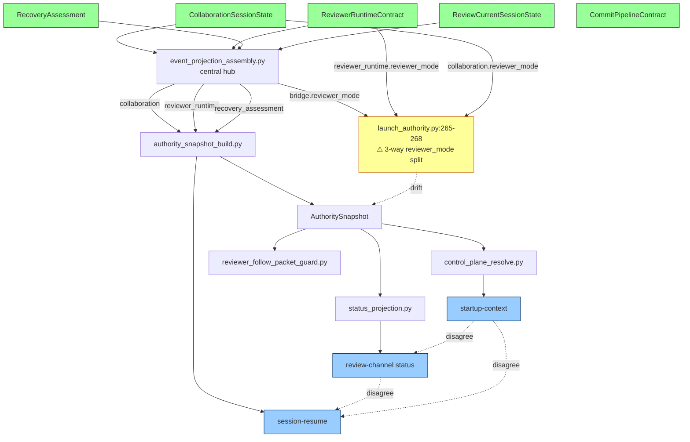

# SYSTEM_MAP.md — Living Connectivity Index

**Purpose.** Single source of truth for *how the typed system is wired together and
where it is not*. This is the connectivity map, not another architecture essay.
If you are a fresh AI session, read this doc **first**, then consult the referenced
architecture docs only for depth on a specific subsystem.

**Maintenance rule (honor or the map decays).** Every time dogfood,
findings-priority, agent-mind, system-picture, or any audit surfaces a new
disconnected system, duplicate, dormant field, or drift, **add a row to the
relevant table below**. A broken connection without a row here is a bug in this
doc, not just a bug in the system. Update-before-land is tracked by
MP-405-T04 `check_system_map_freshness` (proposed in rev_pkt_1342).

**Operator directive (2026-04-19):** "Keep on connecting systems that aren't
connected and making sure everything that is connected is just supposed to be
the system that works together. Keep on iterating till everything is connected."

**Last updated:** 2026-04-19 (initial seed from 8-agent audit + 7-doc
consolidation pass. Seeded as recovery commit 8ef9f1a7.)

---

## 0. Living Flowchart



---

## 1. Typed Sources of Truth (5 core dataclasses)

| Dataclass | File | Role |
|---|---|---|
| `CollaborationSessionState` | `dev/scripts/devctl/runtime/review_state_collaboration_models.py` | Dual-agent session: roles, participants, wake modes, owners |
| `ReviewerRuntimeContract` | `dev/scripts/devctl/runtime/reviewer_runtime_models.py` | Review loop runtime: mode, freshness, acceptance, attachment |
| `RecoveryAssessment` | `dev/scripts/devctl/runtime/recovery_authority.py` | Diagnosis + decision for degraded states |
| `ReviewCurrentSessionState` | `dev/scripts/devctl/runtime/review_state_models.py` | Current instruction + ack state for implementer |
| `CommitPipelineContract` | `dev/scripts/devctl/runtime/commit_pipeline_models.py` | Publication + push readiness |

All 5 flow through `event_projection_assembly.py` which emits 9 keys into
`review_state.json`. The central-hub pattern means one change point when adding
new source state.

---

## 2. Commands (84 total, 22% dogfood-covered)

**Heavily used + connected (top tier):**
`startup-context`, `review-channel`, `session-resume`, `check`, `context-graph`,
`governance-review`, `commit`, `push`, `dashboard`, `findings-priority`.

**Barely wired (needs CI invocation, 10 commands):**

| Command | Refs | Hook-in |
|---|---:|---|
| `compat-matrix` | 24 | release_preflight preflight |
| `launcher-policy` | 25 | ios_ci.yml device-install |
| `cihub-setup` | 27 | release_preflight external-CI gate |
| `launcher-check` | 27 | ios_ci.yml preflight |
| `failure-cleanup` | 31 | failure_triage.yml cleanup phase |
| `path-rewrite` | 31 | audit-scaffold post-remediation |
| `publication-sync` | 36 | release external-pub validation |
| `path-audit` | 37 | code_shape guard integration |
| `integrations-sync` | 40 | tooling_control_plane pre-dogfood |

**Documented-but-not-dogfood-covered (65 commands):** `agent-mind`,
`autonomy-*`, `data-science`, `mutation-loop`, `orchestrate-*`, `phone-status`,
`mobile-status`, `triage-loop`, `loop-packet`, `system-picture`, `security`,
`tandem-validate`, `publication-sync`, `platform-contracts`, 51 more.

**Confirmed dogfood issues (3 currently open):**
- `dogfood.command.startup-context` → `dev/scripts/devctl/commands/governance/startup_context.py`
- `dogfood.code_shape_push_regression` → `dev/scripts/devctl/commands/vcs/push.py`
- `dogfood.review_channel_post_timeout` → `dev/scripts/devctl/commands/review_channel/event_handler.py`

---

## 3. Guards (71) + Probes (26)

**Coverage:** 42% guards dogfood-covered, 88% probes dogfood-covered.

**High-impact uncovered guards (6):**
- `rust_security_footguns` — unsafe deref patterns
- `command_source_validation` — 1,576 raw-args reads unguarded (rev_pkt_0886)
- `multi_agent_sync` — packet `to_agent` filter missing (rev_pkt_0884)
- `platform_contract_closure` — 15 unversioned dataclasses (rev_pkt_0879)
- `rust_runtime_panic_policy` — 3 authority funcs with zero fail-closed tests
- `test_coverage_parity` — coverage debt in multi-agent coordination

**Uncovered probes (3):**
- `probe_mixed_concerns` — split files with 3+ independent function clusters
- `probe_split_advisor` — ranked module-split suggestions from context-graph
- `probe_tuple_return_complexity` — Rust 3+ element tuple returns

---

## 4. Projection Graph (24+ edges, 3 fan-out hotspots, 3 fan-in gaps)

### The 3-way reviewer_mode split (THE drift that caused this session's deadlock)

File: `dev/scripts/devctl/review_channel/launch_authority.py:265-268`
```python
reviewer_mode = _first_text(
    _mapping(review_state.get("bridge")).get("reviewer_mode"),           # A
    _mapping(review_state.get("reviewer_runtime")).get("reviewer_mode"), # B
    _mapping(review_state.get("collaboration")).get("reviewer_mode"),    # C
)
```

| Path | Emitter | Risk |
|---|---|---|
| A `bridge.reviewer_mode` | `event_projection_bridge._event_reviewer_mode` | HIGH — daemon-derived, stales when offline |
| B `reviewer_runtime.reviewer_mode` | `ReviewerRuntimeContract.to_dict` | HIGH — not always written |
| C `collaboration.reviewer_mode` | `CollaborationSessionState.to_dict` | CRITICAL — overwritten by `effective_mode` at `collaboration_session.py:144` (rev_pkt_1335 bug) |

**Live evidence (2026-04-19):** same project state produces three different
answers:
- `startup-context` → `reviewer_mode=tools_only`, `mutation_owner=claude`
- `review-channel status` → `reviewer_mode=single_agent`, `mutation_owner=claude`
- `session-resume --role reviewer` → `reviewer_mode=tools_only`, `mutation_owner=""` (blank)

### Fan-out hotspots (3)
1. `authority_snapshot_build.py:146-310` — 7 emitter reads (CRITICAL)
2. `event_projection_assembly.py:226-299` — 9 emitter writes
3. `status_projection_bridge_state.py:23-107` — 8 outputs + 10 aliases

### Fan-in gaps (3)
1. `authority_snapshot.wake_continuity_ok/wake_gap_summary` — missing emitter (reads untyped `work_intake` dict)
2. `review_state["doctor"]` — no typed projector, consumer reads via `recovery.get("doctor")`
3. `review_state["reviewer_gate"]` — synthetic/read-only, not projected from typed source

---

## 5. Known Drift Points (20 documented)

### Projection drift (10 pairs from rev_pkt_1333 + agent-5)
Emitter↔reader pairs where field sets mismatch. Full table in rev_pkt_1333.

### Duplication candidates (10 additional from agent-3)

| Pair | Overlap | Merge target |
|---|---|---|
| `AgentAttentionRecord` vs `StartupPacketInboxAgentRow` | 70% | Merge to `AgentAttentionRecord` |
| `ReviewerFollowPacketProjection.to_dict` vs `PacketInboxState` serialize | shared filter | Extract `serialize_state_dict_compact` |
| `reviewer_mode` scattered across 3 classes | naming ambiguity | `ReviewerModeState{current, effective}` |
| `CollaborationParticipantState.status` vs `DelegatedWorkReceiptState.status` vs `ReviewPacketState.status` | 60% | `WorkUnitState` base class |
| `authority_snapshot_core._from_mapping` vs `authority_snapshot_parse._from_mapping` | 100% | Delete core duplicate |
| `host_wake_mode` vs `loop_wake_mode` | 100% concept | `WakeModeState{mode, interval, summary}` |
| `ReviewerLastPollState` vs `ReviewBridgeState` poll fields | 100% | Embed `ReviewerLastPollState` |
| `CollaborationArbitrationState.status` vs `CollaborationRestartState.status` | enum duplication | Unified `ReadyStateEnum` |
| 40+ `_from_mapping()` funcs | shared strip/coerce | `deserialize_model_from_mapping` helper |
| `CollaborationParticipantState` vs `CollaborationRoleAssignmentState` | 65% | Unified `ActorRoleState` |

---

## 6. Half-Built Systems (15)

| # | Location | Status |
|---|---|---|
| 1 | `plan_registry_projection.py:167,206` (render_*_projection) | No prod callers, only tests |
| 2 | `authority_snapshot_projection.py:26` (SnapshotResultInputs) | Single constructor site |
| 3 | `control_plane_section.py:23` | 2 consumers, possibly vestigial |
| 4 | `monitor_snapshot_support.py:53` (source labels) | Package built, no consumer |
| 5 | `authority_snapshot_projection.py:44` (wake_fields) | No review/governance consumer |
| 6 | `collaboration_wake_contract.py:41` (LoopCandidateRowsInputs) | Internal-only intermediate |
| 7 | `plan_registry_projection.py:56,90,123` (scope matching) | Routes via bridge compat |
| 8 | MP-389/391/395 | Implementation exists, promotion not wired |
| 9 | `dogfood_governance.py:11,47` (governance input) | Not wired to finding-promotion |
| 10 | `authority_snapshot_build.py:31` (AuthorityBuildContext) | Built once, discarded |
| 11 | `recovery_authority.py:1,40` | Classification unused by policy |
| 12 | `control_plane_read_model_support.py:27` (Inputs) | Future-path that didn't materialize |
| 13 | `startup_push_models.py:56` (PushDecisionSpec) | Over-dimensioned spec |
| 14 | `collaboration_wake_contract.py:95,153` | Gap descriptions never consumed |
| 15 | `portable_code_governance.md` | Extraction boundary not yet enforced |

---

## 7. Dormant Typed Surfaces (12)

| Field | File | Status |
|---|---|---|
| `approval_mode` | `review_state_collaboration_models.py:32` | Defined, never written |
| `supervision_mode` | `:33` | Defined, never written |
| `metadata_path` | `:35` | Parsed, not consumed |
| `log_path` | `:36` | Parsed, not consumed |
| `launch_command` | `:37` | Stored, passthrough only |
| `planned_lane_count` | `:39` | Written, never read |
| `requested_worker_budget` | `:38` | Written, never read |
| `lane/mp_scope/worktree/branch` | `:59-62` | Parsed, rarely read |
| `implementer_session_state` | `review_state_models.py:69` | Written, 1 read site |
| `implementer_session_hint` | `:70` | Written, UI-only |
| `wake_gap_summary/loop_gap_summary` | `authority_snapshot_core.py:83,88` | Informational, no branch |
| `ReviewPacketState.trace_id` | `review_state_packet_models.py:181` | Written once, never read |

---

## 8. Hook Inventory (14 points, all static-identity → upgrade to dynamic-role)

| Hook | Source | Classification | Upgrade |
|---|---|---|---|
| pre-commit permission gate | `.git/hooks/pre-commit` + `commit_permission.py` | STATIC identity | Allow raw commit when `reviewer_mode=active_dual_agent` + `review_gate_allows_push` |
| pre-commit snapshot refresh | `.git/hooks/pre-commit` | STATIC path | Skip when `reviewer_mode=tools_only` |
| pre-push absolute block | `.git/hooks/pre-push` | STATIC identity | Allow when `reviewer_mode=single_agent` + ≤1 implementer |
| post-commit receipt | `.git/hooks/post-commit` | STATIC path | Skip when `checkpoint_required=False` |
| commit_permission decision | `commit_permission.py` | HYBRID | Extend dual-agent relaxation logic |
| Check routing by profile | `check/profile.py` | STATIC routed | Skip runtime-heavy checks when mode is `tools_only`/`paused` |
| AI Guard step | `check/support.py::build_ai_guard_cmd` | DYNAMIC mode-aware | Skip when offline |
| Review probes step | `check/phases.py` | DYNAMIC mode-aware | Skip when mode != `active_dual_agent` |
| Mutation score step | `check/phases.py` | STATIC profile | Skip when mode=tools_only |
| Startup-context gate | `startup_context.py` | DYNAMIC typed | Already role-aware |
| Reviewer gate state | `ReviewerGateState` | DYNAMIC typed | Expose to pre-commit hook |
| Coderabbit gate | `check/coderabbit_gate_support.py` | STATIC | Skip when single_agent |
| Publication sync guard | `publication_sync_guard/` | STATIC path | Gate on mode permits publication |
| Contract connectivity checks | `contract_connectivity/` | DYNAMIC | Skip topology checks when tools_only |

### Claude-Code hook layer (operator-flagged architectural defect, rev_pkt_1342)
The `.claude` hook currently denies Claude edits based on static identity
("Claude is observer-only"). It should be dynamic on typed role: when operator
or typed state authorizes a role switch (dashboard → implementer for bounded
scope), the hook should accept. Current workaround: word-for-word operator
consent quoted in bash `description` field. Permanent fix: typed
`operator_role_override` surface the hook consults.

---

## 9. Dogfood Coverage (22% / 42% / 88% / 100%)

| Target | Covered | Total | % |
|---|---:|---:|---:|
| command | 19 | 84 | 22% |
| guard | 30 | 71 | 42% |
| probe | 23 | 26 | 88% |
| role | 3 | 3 | 100% |

Latest dogfood run: 2026-04-17 (2 days stale as of 2026-04-19). Re-activation
blocked on `dogfood --record` requiring `--dev-mode` flag which the
Claude-Code hook reads as scope escalation.

**Top-3 recommended commands to cover next:**
1. `check --profile ci` — exercises ~8-12 downstream guards in one run
2. `review-channel --action post/status` — 6 uncovered actions with 3+ known HIGH issues
3. `startup-context --role reviewer` — closes the open `dogfood.command.startup-context` confirmed_issue

---

## 10. Priority Fix Backlog (from `findings-priority` + dogfood + packet log)

### From findings-priority ranker (top-5 critical)
- **[critical] fan_out=16** `dogfood_development_engine` — `dashboard.py`
- **[critical] fan_out=11** `audit_review_state_contract_drift` — `review_state_parser.py`
- **[critical] fan_out=9** `guard_probe_data_isolation` — `check/phases.py`
- **[critical] fan_out=4** `contract_consumption_enforcement_gap` — `platform_contract_closure/field_routes.py`
- **[critical] fan_out=1** `guard_system_composition_missing` — `check_code_shape.py`

### From findings-priority ranker (top-3 high)
- **[high] fan_out=17** `mp358_role_contract_drift` — `status_projection.py`
- **[high] fan_out=16** `dogfood_dev_mode_needed` — `dashboard.py`
- **[high] fan_out=12** `mp358_cursor_handoff_gap` — `handoff.py`

### Decided-but-unbuilt (3 — from agent-7 audit)
- rev_pkt_0411 `FindingClosureGate` (5 days old, acked)
- rev_pkt_0414 `WakeSignal` bidirectional contract (5 days old, acked)
- rev_pkt_1271 `MP405-T03` dead-api guard (<1 day, acked)

### Root-cause fixes blocking this session
- **rev_pkt_1335** `collaboration_session.py:86,93,132,144,166,176` — `reviewer_mode=effective_mode` should be `reviewer_mode=reviewer_mode`; restart block at `:156` is the correct precedent
- **rev_pkt_1321** `session_resume_authority_payload.py:115-134` — `to_dict()` silently omits `collaboration` key
- **rev_pkt_1322** `session_resume_support.py:300-305` — unconditional `next_command` overwrite
- **rev_pkt_1324** `session_resume_support.py:300-305` — `shared_blockers` CSV leaks `implementation_permission_blocked` into expired-packet summary
- **rev_pkt_1318** `test_startup_context.py:698` — `test_slim_token_budget` asserting <10000 tokens; current = 12332

---

## 11. Existing Architecture Docs (7, all 2-4 weeks stale)

| Doc | Lines | Last | Status |
|---|---:|---|---|
| `dev/guides/ARCHITECTURE.md` | 905 | 4w | Umbrella, product narrative — keep, link from here |
| `dev/guides/SYSTEM_ARCHITECTURE_SPEC.md` | 943 | 4w | Typed contract spec — keep, reference |
| `dev/guides/SYSTEM_FLOWCHART.md` | 1095 | 4w | **Sections 1-9 SUPERSEDED by section 0 Mermaid + section 4 here; sections 10-13 extract to `EXTRACTION_ROADMAP.md` + `TARGET_ARCHITECTURE.md` + `PORTABILITY_DEFINITION.md`** |
| `dev/guides/SYSTEM_AUDIT.md` | 1935 | 4w | **SUPERSEDED by sections 4-9 here** — archive after extracting security-critical entries (§15 RCE, §22.3 atomicity) |
| `dev/guides/DEVCTL_ARCHITECTURE.md` | 577 | 2w | Most current — **keep as deep-dive appendix** referenced from section 2 here |
| `dev/guides/PYTHON_ARCHITECTURE.md` | 257 | 3w | Type-shape decision tree — **fold into SYSTEM_ARCHITECTURE_SPEC Appendix A** |
| `dev/guides/AGENT_COLLABORATION_SYSTEM.md` | 741 | 4w | Operator's runtime guide — **partial archive; merge sections 58-71, 108-151, 265-327 into sections 1, 4 here** |

**Consolidation goal:** fold superseded sections (SYSTEM_FLOWCHART + SYSTEM_AUDIT
non-security content) into this map over the next 3 sessions. Archive
originals to `dev/history/` with short README explaining consolidation.
Pre-dates rev_pkt_1335/1321 discoveries so some of its architectural claims
are stale.

---

## 12. What a Fresh AI Should Read First

**On every new session, in order:**
1. This doc (sections 0, 4, 10) — connectivity + top backlog
2. `python3 dev/scripts/devctl.py startup-context --format summary`
3. `python3 dev/scripts/devctl.py findings-priority --format md`
4. `python3 dev/scripts/devctl.py dogfood --format md`
5. `python3 dev/scripts/devctl.py agent-mind --agent <self> --limit 5`
6. Scoped plan via `context-graph --query <mp-id> --format md`

**Skip:** full re-read of `AGENTS.md` / `MASTER_PLAN.md` / `bridge.md` until
after the above. The 30-sec bootstrap re-read that each fresh Codex conductor
does today is mostly redundant and contributes to the latency pattern flagged
in rev_pkt_1331.

---

## 13. Session Context (2026-04-19 recovery)

This doc was seeded after the system deadlocked from the rev_pkt_1335
`collaboration_session.py` mode-overwrite bug causing three surfaces to
disagree on `reviewer_mode`, which cascaded into:
- wake-edge not firing (won't spawn Codex when conductor dies)
- launcher gate demanding checkpoint
- pre-push hook demanding governed path
- governed push blocked on stale-process preflight

Recovery commit `8ef9f1a7` (pushed as `37d6be74` post-commit auto-snapshot)
broke the 4-hour zero-commit streak. 19 prior commits reached GitHub
simultaneously.

The typed state holds 40+ packets (`rev_pkt_1305`..`rev_pkt_1345`) documenting
the full audit. See also:
- rev_pkt_1340: operator 5-page handwritten diagnosis (photographed + transcribed)
- rev_pkt_1338: 8-agent audit synthesis
- rev_pkt_1344: SYSTEM_MAP.md proposal (this doc)
- rev_pkt_1345: 7-doc consolidation directive

---

## Maintenance Log

| Date | Added | By |
|---|---|---|
| 2026-04-19 | Initial seed from 8-agent audit + 7-doc consolidation pass. Recovery commit 8ef9f1a7 context. | claude (dashboard, operator-authorized write) |
