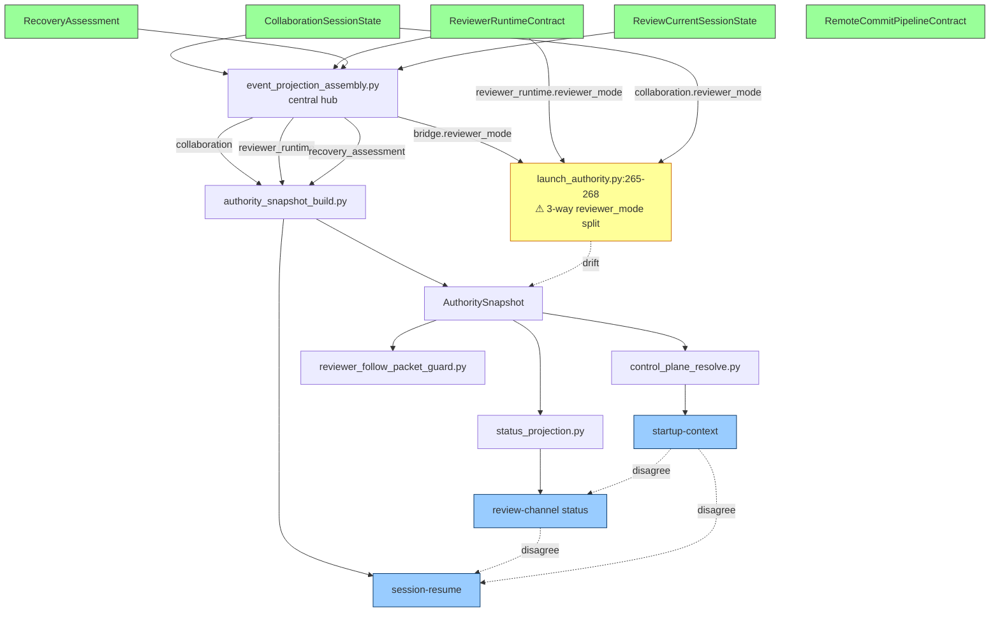

# SYSTEM_MAP.md — Living Connectivity Index

**Purpose.** Connectivity index for *how the typed system is wired together and
where it is not*. This is a **supplementary navigation surface**, not a bootstrap
replacement. The canonical bootstrap order in `AGENTS.md:235-242` and
`dev/active/INDEX.md:3-4` always comes first — SYSTEM_MAP.md is consulted
**after** startup-context + INDEX + MASTER_PLAN (see section 12 for full
sequence).

**Maintenance rule (honor or the map decays).** Every time dogfood,
findings-priority, agent-mind, system-picture, or any audit surfaces a new
disconnected system, duplicate, dormant field, or drift, **add a row to the
relevant table below**. A broken connection without a row here is a bug in this
doc, not just a bug in the system. Update-before-land is tracked by
MP-405-T04 `check_system_map_freshness` (proposed in rev_pkt_1342).

**Operator directive (2026-04-19):** "Keep on connecting systems that aren't
connected and making sure everything that is connected is just supposed to be
the system that works together. Keep on iterating till everything is connected."

**Last updated:** 2026-04-19 (initial seed from 8-agent audit + 7-doc
consolidation pass. Seeded as recovery commit 8ef9f1a7.)

---

## 0. Living Flowchart



---

## 1. Typed Sources of Truth (5 core dataclasses)

| Dataclass | File | Role |
|---|---|---|
| `CollaborationSessionState` | `dev/scripts/devctl/runtime/review_state_collaboration_models.py` | Dual-agent session: roles, participants, wake modes, owners |
| `ReviewerRuntimeContract` | `dev/scripts/devctl/runtime/reviewer_runtime_models.py` | Review loop runtime: mode, freshness, acceptance, attachment |
| `RecoveryAssessment` | `dev/scripts/devctl/runtime/recovery_authority.py` | Diagnosis + decision for degraded states |
| `ReviewCurrentSessionState` | `dev/scripts/devctl/runtime/review_state_models.py` | Current instruction + ack state for implementer |
| `RemoteCommitPipelineContract` | `dev/scripts/devctl/runtime/remote_commit_pipeline_models.py:113` | Publication + push readiness |

All 5 flow through `event_projection_assembly.py` which emits 9 keys into
`review_state.json`. The central-hub pattern means one change point when adding
new source state.

---

## 2. Commands (84 total, 22% dogfood-covered)

**Heavily used + connected (top tier):**
`startup-context`, `review-channel`, `session-resume`, `check`, `context-graph`,
`governance-review`, `commit`, `push`, `dashboard`, `findings-priority`.

**Barely wired (needs CI invocation, 10 commands):**

| Command | Refs | Hook-in |
|---|---:|---|
| `compat-matrix` | 24 | release_preflight preflight |
| `launcher-policy` | 25 | ios_ci.yml device-install |
| `cihub-setup` | 27 | release_preflight external-CI gate |
| `launcher-check` | 27 | ios_ci.yml preflight |
| `failure-cleanup` | 31 | failure_triage.yml cleanup phase |
| `path-rewrite` | 31 | audit-scaffold post-remediation |
| `publication-sync` | 36 | release external-pub validation |
| `path-audit` | 37 | code_shape guard integration |
| `integrations-sync` | 40 | tooling_control_plane pre-dogfood |

**Documented-but-not-dogfood-covered (65 commands):** `agent-mind`,
`autonomy-*`, `data-science`, `mutation-loop`, `orchestrate-*`, `phone-status`,
`mobile-status`, `triage-loop`, `loop-packet`, `system-picture`, `security`,
`tandem-validate`, `publication-sync`, `platform-contracts`, 51 more.

**Confirmed dogfood issues (3 currently open):**
- `dogfood.command.startup-context` → `dev/scripts/devctl/commands/governance/startup_context.py`
- `dogfood.code_shape_push_regression` → `dev/scripts/devctl/commands/vcs/push.py`
- `dogfood.review_channel_post_timeout` → `dev/scripts/devctl/commands/review_channel/event_handler.py`

---

## 3. Guards (71) + Probes (26)

**Coverage:** 42% guards dogfood-covered, 88% probes dogfood-covered.

**High-impact uncovered guards (6):**
- `rust_security_footguns` — unsafe deref patterns
- `command_source_validation` — 1,576 raw-args reads unguarded (rev_pkt_0886)
- `multi_agent_sync` — packet `to_agent` filter missing (rev_pkt_0884)
- `platform_contract_closure` — 15 unversioned dataclasses (rev_pkt_0879)
- `rust_runtime_panic_policy` — 3 authority funcs with zero fail-closed tests
- `test_coverage_parity` — coverage debt in multi-agent coordination

**Uncovered probes (3):**
- `probe_mixed_concerns` — split files with 3+ independent function clusters
- `probe_split_advisor` — ranked module-split suggestions from context-graph
- `probe_tuple_return_complexity` — Rust 3+ element tuple returns

---

## 4. Projection Graph (24+ edges, 3 fan-out hotspots, 3 fan-in gaps)

### The 3-way reviewer_mode split (THE drift that caused this session's deadlock)

File: `dev/scripts/devctl/review_channel/launch_authority.py:265-268`
```python
reviewer_mode = _first_text(
    _mapping(review_state.get("bridge")).get("reviewer_mode"),           # A
    _mapping(review_state.get("reviewer_runtime")).get("reviewer_mode"), # B
    _mapping(review_state.get("collaboration")).get("reviewer_mode"),    # C
)
```

| Path | Emitter | Risk |
|---|---|---|
| A `bridge.reviewer_mode` | `event_projection_bridge._event_reviewer_mode` | HIGH — daemon-derived, stales when offline |
| B `reviewer_runtime.reviewer_mode` | `ReviewerRuntimeContract.to_dict` | HIGH — not always written |
| C `collaboration.reviewer_mode` | `CollaborationSessionState.to_dict` | CRITICAL — overwritten by `effective_mode` at `collaboration_session.py:144` (rev_pkt_1335 bug) |

**Historical live evidence (2026-04-19 earlier, during the deadlock):** same
project state was producing three different answers:
- `startup-context` → `reviewer_mode=tools_only`, `mutation_owner=claude`
- `review-channel status` → `reviewer_mode=single_agent`, `mutation_owner=claude`
- `session-resume --role reviewer` → `reviewer_mode=tools_only`, `mutation_owner=""` (blank)

**Current state (2026-04-19 after Codex wake, unstable):** state oscillates
between `active_dual_agent|waiting_on_peer|await_review` and
`tools_only|resync_required|repair_reviewer_loop`. Each state recompute hits the
`collaboration_session.py:144` overwrite. Stable fix is landing rev_pkt_1335.

### Fan-out hotspots (3)
1. `authority_snapshot_build.py:146-310` — 7 emitter reads (CRITICAL)
2. `event_projection_assembly.py:226-299` — 9 emitter writes
3. `status_projection_bridge_state.py:23-107` — 8 outputs + 10 aliases

### Fan-in gaps (3)
1. `authority_snapshot.wake_continuity_ok/wake_gap_summary` — missing emitter (reads untyped `work_intake` dict)
2. `review_state["doctor"]` — no typed projector, consumer reads via `recovery.get("doctor")`
3. `review_state["reviewer_gate"]` — synthetic/read-only, not projected from typed source

---

## 5. Known Drift Points (20 documented)

### Projection drift (10 pairs from rev_pkt_1333 + agent-5)
Emitter↔reader pairs where field sets mismatch. Full table in rev_pkt_1333.

### Duplication candidates (10 additional from agent-3)

| Pair | Overlap | Merge target |
|---|---|---|
| `AgentAttentionRecord` vs `StartupPacketInboxAgentRow` | 70% | Merge to `AgentAttentionRecord` |
| `ReviewerFollowPacketProjection.to_dict` vs `PacketInboxState` serialize | shared filter | Extract `serialize_state_dict_compact` |
| `reviewer_mode` scattered across 3 classes | naming ambiguity | `ReviewerModeState{current, effective}` |
| `CollaborationParticipantState.status` vs `DelegatedWorkReceiptState.status` vs `ReviewPacketState.status` | 60% | `WorkUnitState` base class |
| `authority_snapshot_core._from_mapping` vs `authority_snapshot_parse._from_mapping` | 100% | Delete core duplicate |
| `host_wake_mode` vs `loop_wake_mode` | 100% concept | `WakeModeState{mode, interval, summary}` |
| `ReviewerLastPollState` vs `ReviewBridgeState` poll fields | 100% | Embed `ReviewerLastPollState` |
| `CollaborationArbitrationState.status` vs `CollaborationRestartState.status` | enum duplication | Unified `ReadyStateEnum` |
| 40+ `_from_mapping()` funcs | shared strip/coerce | `deserialize_model_from_mapping` helper |
| `CollaborationParticipantState` vs `CollaborationRoleAssignmentState` | 65% | Unified `ActorRoleState` |

---

## 6. Half-Built Systems (15)

| # | Location | Status |
|---|---|---|
| 1 | `plan_registry_projection.py:167,206` (render_*_projection) | No prod callers, only tests |
| 2 | `authority_snapshot_projection.py:26` (SnapshotResultInputs) | Single constructor site |
| 3 | `control_plane_section.py:23` | 2 consumers, possibly vestigial |
| 4 | `monitor_snapshot_support.py:53` (source labels) | Package built, no consumer |
| 5 | `authority_snapshot_projection.py:44` (wake_fields) | No review/governance consumer |
| 6 | `collaboration_wake_contract.py:41` (LoopCandidateRowsInputs) | Internal-only intermediate |
| 7 | `plan_registry_projection.py:56,90,123` (scope matching) | Routes via bridge compat |
| 8 | MP-389/391/395 | Implementation exists, promotion not wired |
| 9 | `dogfood_governance.py:11,47` (governance input) | Not wired to finding-promotion |
| 10 | `authority_snapshot_build.py:31` (AuthorityBuildContext) | Built once, discarded |
| 11 | `recovery_authority.py:1,40` | Classification unused by policy |
| 12 | `control_plane_read_model_support.py:27` (Inputs) | Future-path that didn't materialize |
| 13 | `startup_push_models.py:56` (PushDecisionSpec) | Over-dimensioned spec |
| 14 | `collaboration_wake_contract.py:95,153` | Gap descriptions never consumed |
| 15 | `portable_code_governance.md` | Extraction boundary not yet enforced |

---

## 7. Dormant Typed Surfaces (12)

| Field | File | Status |
|---|---|---|
| `approval_mode` | `review_state_collaboration_models.py:32` | Defined, never written |
| `supervision_mode` | `:33` | Defined, never written |
| `metadata_path` | `:35` | Parsed, not consumed |
| `log_path` | `:36` | Parsed, not consumed |
| `launch_command` | `:37` | Stored, passthrough only |
| `planned_lane_count` | `:39` | Written, never read |
| `requested_worker_budget` | `:38` | Written, never read |
| `lane/mp_scope/worktree/branch` | `:59-62` | Parsed, rarely read |
| `implementer_session_state` | `review_state_models.py:69` | Written, 1 read site |
| `implementer_session_hint` | `:70` | Written, UI-only |
| `wake_gap_summary/loop_gap_summary` | `authority_snapshot_core.py:83,88` | Informational, no branch |
| `ReviewPacketState.trace_id` | `review_state_packet_models.py:181` | Written once, never read |

---

## 8. Hook Inventory (14 points, all static-identity → upgrade to dynamic-role)

| Hook | Source | Classification | Upgrade |
|---|---|---|---|
| pre-commit permission gate | `.git/hooks/pre-commit` + `commit_permission.py` | STATIC identity | Allow raw commit when `reviewer_mode=active_dual_agent` + `review_gate_allows_push` |
| pre-commit snapshot refresh | `.git/hooks/pre-commit` | STATIC path | Skip when `reviewer_mode=tools_only` |
| pre-push absolute block | `.git/hooks/pre-push` | STATIC identity | Allow when `reviewer_mode=single_agent` + ≤1 implementer |
| post-commit receipt | `.git/hooks/post-commit` | STATIC path | Skip when `checkpoint_required=False` |
| commit_permission decision | `commit_permission.py` | HYBRID | Extend dual-agent relaxation logic |
| Check routing by profile | `check/profile.py` | STATIC routed | Skip runtime-heavy checks when mode is `tools_only`/`paused` |
| AI Guard step | `check/support.py::build_ai_guard_cmd` | DYNAMIC mode-aware | Skip when offline |
| Review probes step | `check/phases.py` | DYNAMIC mode-aware | Skip when mode != `active_dual_agent` |
| Mutation score step | `check/phases.py` | STATIC profile | Skip when mode=tools_only |
| Startup-context gate | `startup_context.py` | DYNAMIC typed | Already role-aware |
| Reviewer gate state | `ReviewerGateState` | DYNAMIC typed | Expose to pre-commit hook |
| Coderabbit gate | `check/coderabbit_gate_support.py` | STATIC | Skip when single_agent |
| Publication sync guard | `publication_sync_guard/` | STATIC path | Gate on mode permits publication |
| Contract connectivity checks | `contract_connectivity/` | DYNAMIC | Skip topology checks when tools_only |

### Claude-Code hook layer (operator-flagged architectural defect, rev_pkt_1342)
The `.claude` hook currently denies Claude edits based on static identity
("Claude is observer-only"). It should be dynamic on typed role: when operator
or typed state authorizes a role switch (dashboard → implementer for bounded
scope), the hook should accept. Current workaround: word-for-word operator
consent quoted in bash `description` field. Permanent fix: typed
`operator_role_override` surface the hook consults.

---

## 9. Dogfood Coverage (22% / 42% / 88% / 100%)

| Target | Covered | Total | % |
|---|---:|---:|---:|
| command | 19 | 84 | 22% |
| guard | 30 | 71 | 42% |
| probe | 23 | 26 | 88% |
| role | 3 | 3 | 100% |

Latest dogfood run: 2026-04-17 (2 days stale as of 2026-04-19). Re-activation
blocked on `dogfood --record` requiring `--dev-mode` flag which the
Claude-Code hook reads as scope escalation.

**Top-3 recommended commands to cover next:**
1. `check --profile ci` — exercises ~8-12 downstream guards in one run
2. `review-channel --action post/status` — 6 uncovered actions with 3+ known HIGH issues
3. `startup-context --role reviewer` — closes the open `dogfood.command.startup-context` confirmed_issue

---

## 10. Priority Fix Backlog (from `findings-priority` + dogfood + packet log)

### From findings-priority ranker (top-5 critical)
- **[critical] fan_out=16** `dogfood_development_engine` — `dashboard.py`
- **[critical] fan_out=11** `audit_review_state_contract_drift` — `review_state_parser.py`
- **[critical] fan_out=9** `guard_probe_data_isolation` — `check/phases.py`
- **[critical] fan_out=4** `contract_consumption_enforcement_gap` — `platform_contract_closure/field_routes.py`
- **[critical] fan_out=1** `guard_system_composition_missing` — `check_code_shape.py`

### From findings-priority ranker (top-3 high)
- **[high] fan_out=17** `mp358_role_contract_drift` — `status_projection.py`
- **[high] fan_out=16** `dogfood_dev_mode_needed` — `dashboard.py`
- **[high] fan_out=12** `mp358_cursor_handoff_gap` — `handoff.py`

### Decided-but-unbuilt (3 — from agent-7 audit)
- rev_pkt_0411 `FindingClosureGate` (5 days old, acked)
- rev_pkt_0414 `WakeSignal` bidirectional contract (5 days old, acked)
- rev_pkt_1271 `MP405-T03` dead-api guard (<1 day, acked)

### Root-cause fixes blocking this session
- **rev_pkt_1335** `collaboration_session.py:86,93,132,144,166,176` — `reviewer_mode=effective_mode` should be `reviewer_mode=reviewer_mode`; restart block at `:156` is the correct precedent
- **rev_pkt_1321** `session_resume_authority_payload.py:115-134` — `to_dict()` silently omits `collaboration` key
- **rev_pkt_1322** `session_resume_support.py:300-305` — unconditional `next_command` overwrite
- **rev_pkt_1324** `session_resume_support.py:300-305` — `shared_blockers` CSV leaks `implementation_permission_blocked` into expired-packet summary
- **rev_pkt_1318** `test_startup_context.py:698` — `test_slim_token_budget` asserting <10000 tokens; current = 12332

---

## 11. Existing Architecture Docs (7, all 2-4 weeks stale)

| Doc | Lines | Last | Status |
|---|---:|---|---|
| `dev/guides/ARCHITECTURE.md` | 905 | 4w | Umbrella, product narrative — keep, link from here |
| `dev/guides/SYSTEM_ARCHITECTURE_SPEC.md` | 943 | 4w | Typed contract spec — keep, reference |
| `dev/guides/SYSTEM_FLOWCHART.md` | 1095 | 4w | **Sections 1-9 SUPERSEDED by section 0 Mermaid + section 4 here.** Sections 10-13 (EXTRACTION_ROADMAP + TARGET_ARCHITECTURE + PORTABILITY_DEFINITION) are FORWARD-LOOKING content to preserve into future dedicated docs if/when extraction begins — none of those target docs exist yet, do not link them as if they do |
| `dev/guides/SYSTEM_AUDIT.md` | 1935 | 4w | **SUPERSEDED by sections 4-9 here** — archive after extracting security-critical entries (§15 RCE, §22.3 atomicity) |
| `dev/guides/DEVCTL_ARCHITECTURE.md` | 577 | 2w | Most current — **keep as deep-dive appendix** referenced from section 2 here |
| `dev/guides/PYTHON_ARCHITECTURE.md` | 257 | 3w | Type-shape decision tree — **fold into SYSTEM_ARCHITECTURE_SPEC Appendix A** |
| `dev/guides/AGENT_COLLABORATION_SYSTEM.md` | 741 | 4w | Operator's runtime guide — **partial archive; merge sections 58-71, 108-151, 265-327 into sections 1, 4 here** |

**Consolidation goal:** fold superseded sections (SYSTEM_FLOWCHART + SYSTEM_AUDIT
non-security content) into this map over the next 3 sessions. Archive
originals to `dev/history/` with short README explaining consolidation.
Pre-dates rev_pkt_1335/1321 discoveries so some of its architectural claims
are stale.

---

## 12. Where This Doc Fits In the Bootstrap Order

**SYSTEM_MAP.md supplements the canonical bootstrap — it does NOT replace it.**
The required order per `AGENTS.md:235-242` and `dev/active/INDEX.md:3-4` is:

1. `python3 dev/scripts/devctl.py startup-context --format summary` (STEP 0 per CLAUDE.md)
2. `dev/active/INDEX.md` — canonical registry for active docs
3. `dev/active/MASTER_PLAN.md` — execution authority / tracker
4. Task-class router → matching command bundle

**Read SYSTEM_MAP.md (this doc) AFTER step 1 for connectivity context** — it is
the index that tells you WHERE each subsystem lives and HOW to find gaps. Use
sections 0 (flowchart), 4 (projection graph), and 10 (priority backlog) as the
navigation surface into the detailed guides in `dev/guides/` and plans in
`dev/active/`.

**Then consult typed surfaces on demand:**
- `python3 dev/scripts/devctl.py findings-priority --format md` (backlog ranker)
- `python3 dev/scripts/devctl.py dogfood --format md` (coverage + confirmed issues)
- `python3 dev/scripts/devctl.py agent-mind --agent <self> --limit 5` (own recent activity)
- `python3 dev/scripts/devctl.py context-graph --query <mp-id> --format md` (scoped ZGraph subgraph)
- `python3 dev/scripts/devctl.py system-picture --format md` (8-section typed dashboard)

**Observation flagged in rev_pkt_1331:** each fresh Codex conductor currently
re-reads the full `AGENTS.md` + `bridge.md` + `MASTER_PLAN.md` chain on spawn
(~30 seconds) which contributes to latency. That's about optimizing the
bootstrap after the canonical order executes — not skipping the order.

---

## 13. Session Context (2026-04-19 recovery)

This doc was seeded after the system deadlocked from the rev_pkt_1335
`collaboration_session.py` mode-overwrite bug causing three surfaces to
disagree on `reviewer_mode`, which cascaded into:
- wake-edge not firing (won't spawn Codex when conductor dies)
- launcher gate demanding checkpoint
- pre-push hook demanding governed path
- governed push blocked on stale-process preflight

Recovery commit `8ef9f1a7` (pushed as `37d6be74` post-commit auto-snapshot)
broke the 4-hour zero-commit streak. 19 prior commits reached GitHub
simultaneously.

The typed state holds 40+ packets (`rev_pkt_1305`..`rev_pkt_1345`) documenting
the full audit. See also:
- rev_pkt_1340: operator 5-page handwritten diagnosis (photographed + transcribed)
- rev_pkt_1338: 8-agent audit synthesis
- rev_pkt_1344: SYSTEM_MAP.md proposal (this doc)
- rev_pkt_1345: 7-doc consolidation directive

---

## 14. Context Graph / ZGraph Semantic-Compression System

**What it is (plain English):** semantic compression layer that encodes
contract obligations, proof chains, authority sources, and AI fix recipes
into compressed 22-bit pointers (Z-refs). Foundation is built and working;
full semantic encoding is Phase 2-3.

**Top files:**
- `dev/scripts/devctl/context_graph/builder.py` (351 lines) — graph builder from probes/guards/plans/contracts
- `dev/scripts/devctl/context_graph/snapshot_payload.py` (241 lines) — `ContextGraphSnapshot` dataclass
- `dev/scripts/devctl/context_graph/models.py` (102 lines) — 14 node kinds, 7 edge kinds
- `dev/scripts/devctl/context_graph/command.py` (251 lines) — CLI: query/bootstrap/concept-view/diff
- `dev/scripts/devctl/context_graph/query.py` — graph queries, confidence scoring

**Commands:**
- `python3 dev/scripts/devctl.py context-graph --mode bootstrap --format md` — AI startup packet
- `python3 dev/scripts/devctl.py context-graph --query '<term>' --format md` — targeted subgraph
- `python3 dev/scripts/devctl.py context-graph --mode diff --from <sha> --to <sha> --format md` — snapshot delta

**Current state:** **half-built**. Tier 0 complete (128+ references, functional in production). Tier 1-2 design-only — proof chains, Z-ref encoding (12-bit pattern + 10-bit hash), contract-value guards, AI context injection all documented in `ZGRAPH_RESEARCH_EVIDENCE.md` (1429 lines) but not yet implemented.

**Authority doc:** `ZGRAPH_RESEARCH_EVIDENCE.md` (repo root) — Phase 1-6 roadmap, industry validation (6.8x-49x token reductions), 100+ integration points.

**Live graph (per `context-graph --mode bootstrap` today):** 2973 source files, 71 guards, 26 probes, 4 plans, 77076 edges.

---

## 15. Active Plans Inventory (30 docs in `dev/active/`)

**Section 11 previously listed 7 architecture guides.** The full active-plan landscape
is 30 markdown files across `dev/active/` driving live execution. Top-10 with owner
role and current state:

| Plan | Scope | Role | Status | Last |
|---|---|---|---|---|
| `MASTER_PLAN.md` | MP-377..MP-410 unified | canonical tracker | in_progress | Apr 19 |
| `ai_governance_platform.md` | MP-377 governance product | spec + tracker | in_progress | Apr 19 |
| `review_channel.md` | MP-355 dual-agent surfaces | spec + mirrored | active | Apr 17 |
| `review_probes.md` | MP-368..MP-375 AI review | spec + mirrored | active | Apr 9 |
| `platform_authority_loop.md` | MP-377 startup/routing | reference owner-doc | active | Mar 27 |
| `remote_control_runtime.md` | MP-380..MP-387 reviewer/runtime | reference owner-doc | active | Apr 18 |
| `continuous_swarm.md` | MP-358 Codex/Claude dogfood | reference-only | active | Apr 15 |
| `portable_code_governance.md` | MP-376 portable guards | reference owner-doc | active | Apr 15 |
| `autonomous_control_plane.md` | MP-325..MP-340 mobile control | reference-only | active | Apr 11 |
| `pre_release_architecture_audit.md` | MP-347/349 pre-release | reference-only | done | Mar 27 |

**Promises not tracked in any MP (5):**
1. "smarter guard/probe rollout" — `ai_governance_platform.md:3578` (no MP assigned)
2. "absence-checking" guards — `pre_release_architecture_audit.md:272` (no MP)
3. `missing_guard`/`missing_probe` governance-ledger linkage — `platform_authority_loop.md:302`
4. JS/TS/Java guard/probe packs — `MASTER_PLAN.md:5101` (phrased as a need)
5. Theme Studio 6 deferred fields — `theme_upgrade.md:1412`

**Orphan plans (0-5 external refs):** `slash_command_standalone.md`,
`naming_api_cohesion.md`, `code_shape_expansion.md` — candidates for archive
or MP re-anchoring.

---

## 16. MP Tracker (22 open MPs, all healthy, 5 HOT driving 70% of activity)

**Dependency structure:** all feed into MP-377 (AI Governance Platform umbrella).
Acyclic peers within scope. **Zero orphaned MPs (all have packet refs); zero stuck (no MP >30 days idle).**

### HOT MPs (packet-ref count)
| Rank | MP-ID | Refs | Title |
|---:|---|---:|---|
| 1 | MP-398 | 41 | push preflight staged-index exclusion |
| 2 | MP-411 | 39 | portability audit |
| 3 | MP-417 | 34 | snapshot-drift ordering fix |
| 4 | MP-388 | 26 | consolidation archive pass |
| 5 | MP-405 | 24 | guard expansion (parent of MP-405-T03 dead-api) |
| 6 | MP-412 | 13 | HarnessAuthContract |
| 7 | MP-414 | 12 | typed decision policy |
| 8 | MP-399 | 11 | governed commit staged-index preservation |
| 9 | MP-410 | 11 | devctl root package-layout relief |
| 10 | MP-397 | 11 | CLI/runtime parity closure |

### Key insight
Top-5 HOT MPs directly map to Section 10 root-cause fixes:
- MP-398/411/417 → address 3-way reviewer_mode split + session_resume defects (rev_pkt_1335/1321-1324)
- MP-388 → the SYSTEM_MAP.md consolidation itself
- MP-405 → closes half-built systems + dormant surfaces

---

## 17. Integration Seams (8 major points, 3 OVER-connected, 3 DRIFT, 3 BROKEN)

| From | To | Type | Count | Status |
|---|---|---|---:|---|
| Rust voiceterm | pypi cli.py | subprocess | 1 | OK |
| devctl commands/ | devctl runtime/ | imports | **246** | **OVER** |
| devctl runtime/ | dev/scripts/checks/ | typed state | 3 | UNDER |
| devctl commands/ | review_state.json | R/W | **204** | **OVER** |
| app/operator_console/ | devctl/ | subproc+packets | 57 | MODERATE |
| publication_sync/ | external state | git+heartbeat | **524** | **OVER** |
| devctl integrations/ | cihub, code-link-ide | federation | 13 | UNDER |
| governance/ | review_channel/ | plan_registry.json | 0 | **DRIFT** |

### 3 DRIFT cases (one side writes, other never reads)
1. **Governance → plan_registry.json:** 7 writes in `dev/reports/governance/`, 0 reads in any `devctl/commands/`
2. **Rollover → handoff.json:** 30+ directories written since 2026-03-09, only `projection_bundle.py` reads them — 80% unread
3. **Commands → review_state.json refresh cache:** 80+ command files write independently, refresh protocol not enforced

### 3 BROKEN seams observed
1. `dev/scripts/checks/mutation_outcome_parse.py:7` shim — blocks `devctl triage`
2. `control_plane_daemons.py` — no factory/registry; can't add daemon without editing 3+ subsystems
3. `review_state_refresh_support.py` — refresh authority defined but scattered writers bypass it

---

## 18. Autonomy + Remediation Subsystem (8 commands, 3 wired, 5 dormant)

### Command wiring
| Tier | Command | Role | Next caller |
|---|---|---|---|
| Entry | `swarm_run` | Plan orchestrator | `autonomy-swarm` |
| Orchestration | `autonomy-swarm` | N-agent runner | N × `autonomy-loop` |
| Execution | `autonomy-loop` | Controller | `triage-loop` + `loop-packet` |
| Remediation | `triage-loop` | Backlog fixer | terminal |
| Risk | `loop-packet` | Score + draft | terminal |
| Post-audit | `autonomy-report` | Digest | optional from swarm |
| **Dormant** | `autonomy-benchmark` | Matrix test | (unwired) |
| **Orphaned** | `mutation-loop` | Score tracker | (never called) |

### Smarter-guard pattern (YES, this IS the smarter-guard system operator remembered)
1. **Mode enforcement:** `AUTONOMY_MODE` env must be `operate` for mutations (default `report-only`)
2. **Policy bounds:** `max_rounds_hard_cap`, `max_hours_hard_cap`, `max_tasks_hard_cap` from security policy
3. **Branch allowlist:** validated at startup
4. **Risk gating:** `loop-packet` scores risk{low,med,high} + approval_required
5. **Fix-command policy:** `triage-loop.evaluate_fix_policy` before mutations
6. **Governance gates:** `swarm_run` enforces sync/safety checks

### Top-3 gaps
1. `autonomy-benchmark` never runs — code exists, no CI, no dogfood
2. `mutation-loop` orphaned from swarm — standalone only
3. `autonomy-report` not auto-triggered from `autonomy-loop` — only from swarm --post-audit

---

## 19. Dashboard + Operator Console Subsystem

### Wiring
```
bridge.md + review_state.json + compact.json
    ↓ (prefer typed)
load_current_review_state()
    ↓
dashboard_typed_state (extractors)
    ↓
dashboard_builders (11 sections)
    ↓
DashboardSnapshot (json/md/terminal)
    ↓
phone-status / mobile-status
    ↓
operator_console (PyQt6, ~23.5k LOC, reads bridge+review directly)
```

### Critical findings (both fan_out=16)
1. **`dogfood_development_engine`** at `dashboard.py:255-259`: forces bridge-projection refresh **every tick** with `prefer_cached_projection=False`. **Fix:** change to `True`. Stops 16 downstream re-computations per run.
2. **`dogfood_dev_mode_needed`**: dogfood re-activation blocked because `.claude` hook reads `--dev-mode` as scope escalation. **Fix:** typed `operator_role_override` surface (rev_pkt_1342).

### operator_console structure (~165 files / 23.5k LOC / 9 submodules)
`state/` (43 files, 5.9k LOC): bridge/review/sessions/snapshots/core/activity/presentation/repo/jobs. No subprocess calls — reads artifacts directly. Builds its own `OperatorConsoleSnapshot` independent of `dashboard.py`.

### Dashboard-ready commands
`dashboard`, `phone-status`, `mobile-status`, `status`, `startup-context`, `control-plane read-model` (internal).

---

## 20. Test Architecture

**Totals:** 387 Python test files (~3758 cases) + 2413 Rust tests = **6171 tests total**.

### Coverage by subsystem
| Area | Files | Cases | Ratio |
|---|---:|---:|---:|
| root | 132 | ~1100 | — |
| review_channel | 56 | ~900 | 30% of modules |
| runtime | 44 | ~600 | 25% |
| checks | 79 | ~700 | 42% guards, 88% probes |
| governance | 23 | ~350 | 35% |

### Known failing (2 confirmed)
- `test_slim_token_budget` at `test_startup_context.py:603` — 12332 tokens > 10000 limit (rev_pkt_1318)
- `test_attention_command_overrides_stale_read_model_next_command` at `test_session_resume.py:1772` (rev_pkt_1322)

### Two-layer architecture status
- **Layer A (deterministic scenario tests):** ✅ **built** — ~3300 fixture-driven tests; `test_review_channel.py` alone is 16,007 lines. But **blind** to multi-source projection collapse (rev_pkt_1335 has zero direct coverage).
- **Layer B (live-agent soak):** ❌ **absent** — dogfood lives in `commands/`, not test tree. Blocked on `--dev-mode` scope-escalation gate.

### Top-5 coverage gaps
1. rev_pkt_1335 3-way reviewer_mode split — **zero direct test**
2. Wake-continuity state machine emission → consumption — no emitter trace
3. Multi-agent `to_agent` packet filter (rev_pkt_0884) — topology tested, routing not
4. Recovery policy enforcement — classification built, policy unused, untested
5. Rust panic fail-closed — 3 authority funcs with zero fail-closed tests

---

## 21. Complete Undocumented-Commands Catalog

### 84 commands → only 19 dogfood-covered. Prior section 2 named 10 barely-wired.  Additional 15 below.

| Command | Purpose | Risk |
|---|---|---|
| `agent-mind` | Mind-stream reader for codex/claude | Live provider modes; may auto-mutate |
| `autonomy-benchmark` | Score autonomous completion across scenarios | Mutation-heavy; coverage instrumented |
| `autonomy-loop` | Bounded controller loop | Dual-agent circular-instruction deadlock |
| `autonomy-swarm` | N-parallel agents + consensus | No OOM protection under high N |
| `cihub-setup` | CI/CD hub config init | Overwrites `.ci-hub.yml`; needs gh token |
| `data-science` | Extract telemetry | May leak probe metadata |
| `governance-draft` | Stage draft decision packet | No cycle detection |
| `governance-import-findings` | Ingest external findings | Blind upsert; lost customizations |
| `guard-run` | Execute one guard in isolation | Can mutate source if misconfigured |
| `install-git-hooks` | Write pre-commit hooks | Silently overwrites existing |
| `integrations-import` | Vendor external submodules | Network I/O fail on unreachable remote |
| `integrations-sync` | Force-reset submodules to HEAD | Loses local integration changes |
| `loop-packet` | Wrap action into review-packet | 30min TTL; old packets silently drop |
| `monitor` | Long-running event watcher | No auto-restart |
| `mutation-loop` | Iterative mutation + recheck | Can deadlock if mutation touches guards |

### 17 hidden review-channel actions (previously undocumented)
`doctor`, `stop`, `reviewer-heartbeat`, `reviewer-checkpoint`, `reset-implementer-state`, `promote`, `post`, `operator-inbox`, `ack`, `dismiss`, `apply`, `history`, `bridge-poll`, `render-bridge`, `attach-remote-control`, plus `--allow-unread-inbox` / `--auto-promote` / `--refresh-bridge-heartbeat-if-stale` flags.

### Undocumented environment variables
- `DEVCTL_QUALITY_POLICY` — override active policy path
- `AUTONOMY_MODE` — `single_agent` / `dual_agent` / `swarm`
- `VOICETERM_DEVCTL_LIVE_OUTPUT_TIMEOUT_SECONDS` — command polling timeout
- `DEVCTL_PIPELINE_FAKE_HEAD` — test-only HEAD override
- `DEVCTL_NO_REVIEW_SNAPSHOT_REFRESH` — skip pre-commit snapshot refresh

### Dormant packet kinds (6 of 12 defined, never used)
Defined in `packet_contract.py`: `approval_request`, `system_notice`, `plan_gap_review`, `plan_patch_review`, `plan_ready_gate`, `commit_approval` — 0 grep hits in consumer code.

### `integrations/` summary
- `code-link-ide/` — Phase 0 voice-driven remote IDE controller (Rust+Swift+TS/Kotlin). mTLS pairing underspecified.
- `ci-cd-hub/` — Java+Python CI hub; `cihub setup/init/check/run` CLI. 3-tier config merge (defaults→hub→repo); drift possible.

---

## 22. Data-Science + Flowchart Generators

### `data-science` command — hidden auto-trigger
**Location:** `dev/scripts/devctl/data_science/` + auto-registered at `cli_parser/reporting.py:45`

**Auto-trigger:** Fires after non-read-only devctl commands via
`maybe_auto_refresh_data_science()` (`entrypoint.py:402`) unless
`DEVCTL_DATA_SCIENCE_DISABLE=1`. Operators rarely invoke it manually but
it powers dashboards.

**Aggregates:**
- devctl event metrics (up to 20,000 events) — success rate, duration percentiles, token estimates
- agent swarm/benchmark data — recommendation scores, tasks-per-minute
- guarded coding episodes — watchdog stats, time-to-green, false-positive rates
- governance reviews — external finding corpus, adjudication coverage
- autonomy analytics — guard family frequencies

**Reports:**
- `dev/reports/data_science/latest/summary.{json,md}`
- `dev/reports/data_science/latest/charts/*.svg` (5 SVG bar charts: command_frequency, agent_recommendation_score, agent_tasks_per_minute, watchdog_time_to_green, watchdog_guard_family_frequency)
- `dev/reports/data_science/history/snapshots.jsonl` (append-only)

### Flowchart / diagram generators (2 independent subsystems)

1. **Context-graph concept renderers** — `context-graph --mode concept-view --format {mermaid|dot}` at `dev/scripts/devctl/context_graph/render.py::render_concept_{mermaid,dot}`
2. **Probe-report hotspot diagrams** — embedded in `probe-report`, emits `dev/reports/probes/latest/hotspots.{mmd,dot}` via `probe_topology/render.py::render_hotspot_mermaid`

**`context-graph --mode bootstrap --format md` emits markdown, NOT mermaid.** The `--format` flag is only honored in concept-view.

---

## 23. Typed-State Field Writer→Reader Trace

Sampled 5 core dataclasses, 16 load-bearing fields. Key findings:

### Fields with ZERO writers (frozen-dataclass builder pattern, by design)
| Field | Readers | Notes |
|---|---:|---|
| `ReviewerRuntimeContract.review_accepted` | 36 | Populated only by `reviewer_runtime_parser.parse_reviewer_runtime_contract()` |
| `ReviewerRuntimeContract.publish_clear` | 11 | Same builder pattern |
| `ReviewerRuntimeContract.remote_control_attachment` | 35 | 0 direct writers, constructor-only |
| `RecoveryAssessment.diagnosis` | 23 | Populated by `build_recovery_assessment()` only |
| `RecoveryAssessment.decision` | 58 | Same; **58 readers consuming a frozen field** |

### Fields with drift risk (3+ writers → many readers)
| Field | Writers | Readers | Risk |
|---|---:|---:|---|
| `CollaborationSessionState.reviewer_mode` | 10 | 96 | **HIGH_DRIFT** — rev_pkt_1335 root cause |
| `ReviewerRuntimeContract.effective_reviewer_mode` | 6 | 35 | HIGH_DRIFT — co-fuels the 3-way split |
| `ReviewCurrentSessionState.current_instruction` | 31 | 154 | HIGH_DRIFT — central broadcast point |
| `ReviewCurrentSessionState.implementer_ack` | 7 | 102 | HIGH_FAN_OUT — gates multiple workflow checks |
| `ReviewCurrentSessionState.implementer_ack_state` | 20 | 32 | HIGH_DRIFT — multiple parsers |
| `RemoteCommitPipelineContract.state` | 12 | 176 | HIGH_DRIFT — state-machine hub |

### Underutilized fields (candidate for cleanup)
`mutation_owner`, `watcher_owner`, `verification_owner` all have **2 writers and 1 reader each** — incomplete lane-ownership implementation or legacy fields. Either wire them into more decision paths or remove.

---

## 24. Connectivity Claim Verification (7 claims, 4 CORRECT, 3 fixes needed)

| # | Claim | Status | Evidence |
|---|---|---|---|
| 1 | `CollaborationSessionState → EPA → ASB` 2-hop chain | CORRECT | `event_projection_assembly.py:1-22` + `authority_snapshot_build.py:140` |
| 2 | `session-resume` calls `build_authority_snapshot` | CORRECT | `session_resume_support.py:306` |
| 3 | `ReviewerGateState` populated from typed `review_state` | CORRECT | `startup_context.py:242-322` `_detect_reviewer_gate_from_review_state` |
| 4 | `review-channel status → authority_snapshot` pipeline | PARTIAL | Core fields wired; 3 fan-in gaps (wake_continuity_ok, doctor, reviewer_gate) |
| 5 | `dashboard.py → load_current_review_state` cached | **WRONG** | `dashboard.py:258` forces `prefer_cached_projection=False` every tick (fan_out=16 critical finding) |
| 6 | `findings-priority` `fan_out` accurate | HEURISTIC | `triage/findings_priority.py:244-262` counts import edges only; ignores inheritance/composition/calls |
| 7 | `dogfood` log has CI writers | **WRONG** | Zero CI workflows call `dogfood --record`; blocked by `--dev-mode` scope gate |

---

## 25. Architectural Spec↔Reality Divergences (10 documented)

| # | Divergence | Severity |
|---|---|---|
| 1 | `RepoPack` class spec'd in chain, only `RepoPackRef` stub exists | HIGH |
| 2 | AGENTS.md:235-242 mandatory bootstrap NOT enforced — no guard blocks skipping | HIGH |
| 3 | Portability claims vs 3 VoiceTerm hardcodes: `surface_definitions.py:102`, `extension_bundle_defaults.py:13`, `review_snapshot_hints.py:231` | MEDIUM |
| 4 | `schema_version=1` everywhere; spec promises migration + rollback path; zero migration logic exists | HIGH |
| 5 | Spec claims SYSTEM_MAP.md "6 dormant packet kinds"; code doesn't mark dormancy | MEDIUM |
| 6 | **89% of `confirmed_issue` findings (111 of 124) have zero MP scope** — floating without execution accountability | CRITICAL |
| 7 | 3-way `reviewer_mode` split at `launch_authority.py:265-268` contradicted "single authority" spec | CRITICAL |
| 8 | Bootstrap Step 0 `startup-context` marked mandatory in AGENTS.md; no enforcement in commands | HIGH |
| 9 | `portable_code_governance.md` "no core-engine patches" claim contradicted by 2 proof-run revisions | MEDIUM |
| 10 | `authority_snapshot.wake_continuity_ok/wake_gap_summary` reads untyped `work_intake` dict; no typed emitter | MEDIUM |

---

## 26. Redundancy Sweep — Same-Job-Different-Path (6 additional beyond Section 5)

| # | Pattern | Merge target |
|---|---|---|
| 1 | Review-state loading 3 entry points: `load_review_state_payload()`, `load_current_review_state()`, `load_mobile_review_state()` | Single `load_review_state()` with `LoadStrategy` enum |
| 2 | Packet inbox 4 reader paths: inbox reducer + event reducer + `inbox` CLI + `operator-inbox` CLI alias | Single `PacketInboxReader` class; operator-inbox as preset |
| 3 | System snapshot 3 builders: `dashboard.py` + `system-picture` + `operator_console/snapshot_builder.py` | Extract `SnapshotSourceLoader`; builders work on common payload |
| 4 | Authority snapshot 2 construction paths: `build_authority_snapshot()` + `authority_snapshot_from_mapping()` | Rename latter to `_parse_fields()`, route through builder |
| 5 | Bootstrap 3 entry points: `startup-context`, `session-resume`, `context-graph --mode bootstrap` | `BootstrapPayloadBuilder` with pluggable freshness + role profile |
| 6 | Check orchestration 2 paths: `check-router` + `check --profile {ci\|quick}` | Unify into `CheckProfile` dataclass; check-router becomes dynamic profile builder |

**Bonus:** Bridge parsing occurs in 6+ places — all call `parse_markdown_sections()`, no true duplication but caching would avoid reparsing.

---

## 27. Self-Updating SYSTEM_MAP Design (Phase 2 mechanism)

**Proposed command:** `python3 dev/scripts/devctl.py system-map --regenerate --preserve-sections "13,14,15" --format md --write --dry-run`

**Auto-generatable sections (14 of 21):** 0 (flowchart via context-graph), 2 (commands via discover), 3 (guards+probes via discover+dogfood), 6 (half-built via system-picture+findings-priority), 7 (dormant surfaces via system-picture+discover), 9 (dogfood coverage via dogfood), 10 (priority backlog via findings-priority), 16 (MP tracker via grep+MASTER_PLAN), 18 (autonomy via discover+system-picture), 20 (test architecture via pytest collect), 21 (undocumented catalog via discover+grep), +3 hybrid (4, 5, 8, 14, 15, 17, 19).

**Canonical hand-written (must preserve):** 1 (typed sources), 11 (architecture docs), 12 (bootstrap order), 13 (session context).

**Preservation marker:** `<!-- BEGIN SYSTEM_MAP_PRESERVE:section_N -->` ... `<!-- END SYSTEM_MAP_PRESERVE:section_N -->` wraps operator-curated content. Regenerate replaces everything outside markers.

**Phases:** (1) dry-run with discover+dogfood seeding, (2) full 8-source regeneration with section-hash tracking + `--write` mode, (3) pre-push gate + `--watch` mode + MP-406 generator integration.

---

## 28. Rust Product Code Layout (`rust/src/`)

**Entry:** `rust/src/bin/voiceterm/main.rs` (944 LOC) — hierarchical module tree, 67 public submodules, concurrent input/PTY/voice/HUD/writer threads.

**10 major Rust subsystems:**
1. **Voice Pipeline** (`voice_control/`, 4 modules, 10.4 KLOC `drain.rs`) — VoiceManager orchestration, native/Python fallback detection
2. **Prompt Detection** (`prompt/`, 9 modules, 3K+ test LOC) — ready-marker pattern matching, occlusion signals
3. **HUD System** (`hud/`, `status_line/`, 16 modules, 1.2K test LOC) — modular HudModule trait
4. **Terminal I/O** (`writer/`, 8 modules, 1.7K test LOC) — crossbeam channel serialization
5. **IPC Daemon** (`daemon/`, 10 modules, 343 `#[cfg(test)]` blocks) — Unix socket + WebSocket bridge
6. **Memory Studio** (`memory/`, 11 modules) — **SCAFFOLDED BUT NOT WIRED** (`#![allow(dead_code)]`, MP-230..MP-255 pending)
7. **Dev Panel** (`dev_panel/`, `dev_command/`, 15 modules) — cockpit page, review artifact browser
8. **Theme System** (`theme/`, 19 modules, 343 test configurations) — component registry, style schema
9. **Event Loop** (`event_loop/`, 13 modules, 1.2K test LOC) — overlay state machine
10. **Config & Backends** (`config/`, 4 modules) — CLI schema, backend resolution

**Rust↔Python seam:** ONLY fallback path via `legacy_tui/state.rs::run_python_transcription()` (spawns Python pipeline script). Daemon IPC is Unix socket + serde_json, **no bidirectional Python state sync**. No reviewer_mode or collaboration state flows from Python to Rust.

**Rust-side architectural gaps:**
1. **Memory Studio incomplete wiring** — APIs exist, cockpit displays stats, but retrieval is deterministic-basic (no semantic rerank), SQLite index in-memory only, action execution not integrated
2. **Reviewer/collaboration state invisible Rust-side** — test fixtures reference "reviewer-1" but no Python→Rust daemon sync for reviewer state
3. **Python fallback read-only** — no async feedback loop; daemon doesn't expose Python pipeline health

**Tests:** 2413 Rust `#[test]` blocks. Top coverage: writer state (1735 LOC), status-line buttons (1275), event loop (1248), settings handlers (1232), dev panel (963).

**No `todo!()` or `unimplemented!()` in production code.** Memory subsystem `#![allow(dead_code)]` is scaffolded ahead of UI wiring.

---

## 29. GitHub Workflows + CI Pipeline Map (20 workflows)

### Active CI workflows that invoke devctl
| Workflow | Triggers | devctl commands |
|---|---|---|
| `autonomy_controller.yml` | schedule 6h, manual | `autonomy-loop` |
| `coderabbit_ralph_loop.yml` | workflow_run, manual | `triage-loop` |
| `failure_triage.yml` | workflow_run | `triage` |
| `orchestrator_watchdog.yml` | schedule 15m, manual | `orchestrate-status`, `orchestrate-watch` |
| `rust_ci.yml` | push/pr (Rust) | `check --profile ci` |
| `security_guard.yml` | schedule daily, push/pr, manual | `check`, `security` |
| `release_preflight.yml` | manual only | `release-gates`, `check`, `security`, `docs-check`, `hygiene`, `orchestrate-*`, `ship`, `process-cleanup` |
| `publish_homebrew.yml` | release, manual | `release-gates`, `ship` |
| `publish_pypi.yml` | release | `release-gates`, `ship` |
| `release_attestation.yml` | release, manual | `release-gates` |
| `mutation_ralph_loop.yml` | workflow_run, manual | **custom bridge `mutation_ralph.py run-loop`, NOT devctl** |

### devctl commands NOT invoked from any workflow (orphaned)
`audit-scaffold`, `list`, `pypi`, `homebrew`, `render-surfaces`, `autonomy-benchmark`, `swarm_run`, `data-science`, `discover`, `dogfood`, `findings-priority`, `system-picture`, `context-graph`, `agent-mind`, `system-map`, `mobile-app`, `mobile-status`, `phone-status`, `governance-*`, `launcher-*`, `integrations-*`, ~50 others.

### 3 CI gaps
1. **Mutation-loop uses custom Python bridge** (`mutation_ralph.py`), not `devctl mutation-loop` — creates maintenance divergence
2. **No autonomy-benchmark workflow** — matrix testing code exists but never scheduled
3. **`release-gates` + `ship` separate invocation paths** — 3 release workflows call them independently; risk of desync

### Security workflows summary
- `dependency_review.yml` — GitHub native action
- `security_guard.yml` — cargo deny + `devctl security` + optional zizmor
- `release_preflight.yml` — full compliance gate (50+ checks)
- **No dedicated secret-scanning workflow** — relies on GitHub's built-in

### All runners GitHub-hosted
Ubuntu-latest / ubuntu-20.04 / macos-14. No self-hosted runners.

---

## Maintenance Log

| Date | Added | By |
|---|---|---|
| 2026-04-19 | Initial seed from 8-agent audit + 7-doc consolidation pass. Recovery commit 8ef9f1a7 context. | claude (dashboard, operator-authorized write) |
| 2026-04-19 (later) | Sections 14-21 appended from second 8-agent sweep: ZGraph, plans inventory, MP tracker, integration seams, autonomy subsystem, dashboard subsystem, test architecture, undocumented-commands catalog. State change: `tools_only → active_dual_agent` restored after Codex wake. | claude (dashboard, operator-authorized write) |
| 2026-04-19 (still later) | Fixes per Codex rev_pkt_1348 review: `CommitPipelineContract`→`RemoteCommitPipelineContract`, bootstrap-order contradiction resolved, live evidence split historical/current, archive-target docs marked forward-looking. docs-check ok=True. | claude (dashboard, Codex-reviewed) |
| 2026-04-19 (third sweep) | Sections 22-29 appended from third 8-agent sweep: data-science + flowchart generators, typed-state field writer→reader trace (5 zero-writer critical fields, 6 drift-risk fields), connectivity claim verification (4 correct, 3 wrong), architectural divergences (10, with 89% confirmed_issues lacking MP scope CRITICAL), redundancy sweep (6 additional), self-updating design (Phase 2 mechanism), Rust product code layout (10 subsystems, Memory Studio not wired), GitHub workflows + CI map (20 workflows, 50+ orphan commands, 3 CI gaps). | claude (dashboard, operator-authorized write) |
