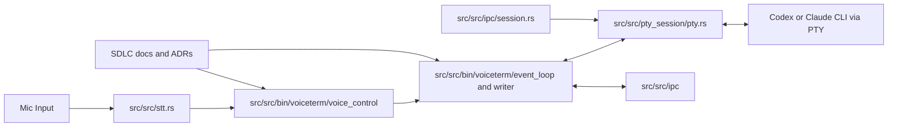
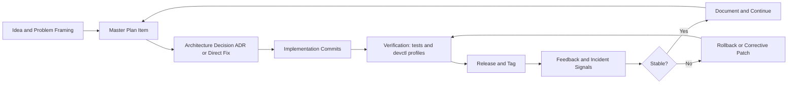
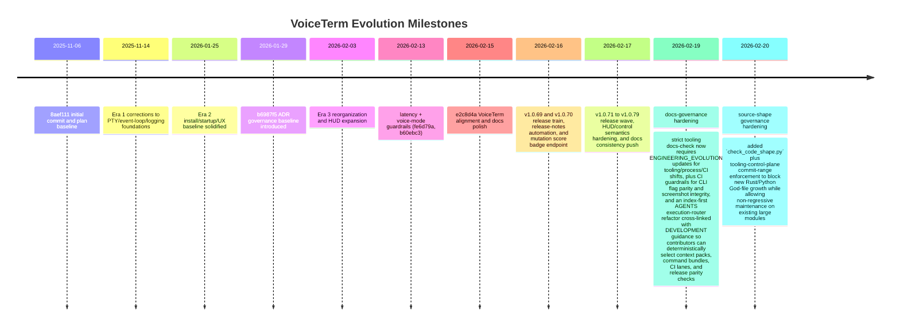
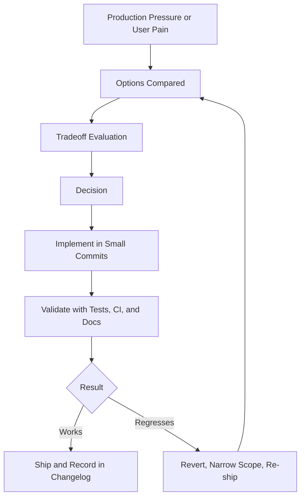

# Engineering Evolution and SDLC Timeline

<!-- markdownlint-disable MD024 -->

**Status:** Draft v4 (historical design and process record)  
**Audience:** users and developers  
**Last Updated:** 2026-02-20

## At a Glance

VoiceTerm is a voice-first HUD overlay for AI CLIs, with primary support for Codex and Claude. It keeps terminal-native workflows and adds better voice input, feedback, and controls.

What makes this hard: VoiceTerm must keep PTY correctness, HUD responsiveness, STT latency trust, and fast release cycles aligned in one local runtime.

**What this repo demonstrates:**

- Architecture growth from MVP assumptions to Rust-first runtime control.
- Reliability growth from reactive fixes to CI guardrails and safe rollback.
- Process growth from ad-hoc iteration to ADR-backed decisions and repeatable checks.

**Key docs to cross-reference:**

- `dev/active/MASTER_PLAN.md`
- `dev/ARCHITECTURE.md`
- `dev/DEVELOPMENT.md`
- `dev/CHANGELOG.md`
- `dev/adr/README.md`

**Appendix quick pointers:**

- ADR crosswalk: [Appendix B](#appendix-b-adr-crosswalk)
- Naming timeline: [Appendix E](#appendix-e-naming-timeline)

## Reader Paths

- [Quick Read (2 min)](#quick-read-2-min)
- [User Path (5 min)](#user-path-5-min)
- [Developer Path (15 min)](#developer-path-15-min)

## Term Quick Reference

- PTY: pseudo-terminal session used to keep CLI context alive.
- STT: speech-to-text processing.
- VAD: voice activity detection for start/stop capture behavior.
- HUD: terminal overlay that shows voice state, controls, and metrics.

## Audit Snapshot (Repo-Verified on 2026-02-17)

Fact: Repository history and tags in this document were re-checked against local git state.

Evidence:

- Commit count and HEAD/date check: `git rev-list --count HEAD`, `git rev-parse --short HEAD`, `git show -s --format='%ad' --date=short HEAD`
- First commit check: `git rev-list --max-parents=0 HEAD`, `git show -s --format='%h %ad %s' --date=short <first-hash>`
- Tag span/count check: `git tag --sort=creatordate | head -n 1`, `git tag --sort=creatordate | tail -n 1`, `git tag --sort=creatordate | wc -l`
- Evidence hash validity check: `git rev-parse --verify <hash>^{commit}`

Fact: This audit confirms:

- First commit is `8aef111` on 2025-11-06.
- Drafting HEAD is `fd0a5c6` on 2026-02-17.
- Tag range is `v0.2.0` to `v1.0.79` with 80 tags.
- All commit hashes cited in this document resolve.
- This timeline includes committed git history only; in-progress working-tree changes (including near-`v1.0.80` scope) are intentionally excluded until commit/tag.

## Scope and Evidence Model

Fact: This timeline covers commit history from `8aef111` (2025-11-06) through `fd0a5c6` (2026-02-17).

Fact: The source range includes 357 commits and tags from `v0.2.0` through `v1.0.79`.

Evidence:

- Original plan: `8aef111:docs/plan.md`
- Architecture docs: `dev/ARCHITECTURE.md`
- ADR index and records: `dev/adr/README.md`, `dev/adr/0001-*.md` through `dev/adr/0023-*.md`
- Release history: `dev/CHANGELOG.md`, git tags
- Full history replay: `git log --reverse`

Fact: Claims in this document follow three labels.

- Fact: Backed by commit hash, ADR, tag, or repo path.
- Inference: Interpretation from facts; not a direct measurement.
- Evidence: Explicit anchor(s) for validation.

## Quick Read (2 min)

Fact: The project moved from an MVP-style plan to production-oriented architecture under real runtime pressure.

Evidence: `8aef111`, `dev/ARCHITECTURE.md`, `39b36e4`, `b6987f5`.

Fact: Decision quality improved once governance became explicit.

Evidence: `b6987f5`, `7f9f585`, `fe48120`, `dev/adr/README.md`.

Fact: Reliability work includes visible rollback discipline, not just feature growth.

Evidence: `c9106de`, `6cb1964`, `fe48120`.

Fact: The team added CI protection for latency and voice-mode behavior.

Evidence: `fe6d79a`, `b60ebc3`.

Fact: Release flow became explicit and traceable.

Evidence: `695b652`, `50f2738`, `05ff790`, `dev/DEVELOPMENT.md`.

Inference: This repo shows full-lifecycle engineering work: runtime design, incident response, governance, and release operations.

## User Path (5 min)

Fact: User-facing quality improved in four waves.

- Era 1: Core voice-to-CLI loop became usable, then stabilized after early PTY and loop fixes.
- Era 2: Install and startup behavior became predictable across common environments.
- Era 3: HUD controls, queueing behavior, and release/install tooling matured quickly.
- Era 4: Heavy-output responsiveness, latency trust semantics, and terminal compatibility were hardened.

Evidence: `55a9c5e`, `39b36e4`, `6fec195`, `c6151d5`, `2ce6fa2`, `d823121`, `c172d9a`, `6741517`, `07b2f90`, `67873d8`, `fe6d79a`, `fe48120`.

Fact: Release cadence was high, but behavior regression handling was explicit.

Evidence: `19371b6`, `6cb1964`, `fe48120`, tags `v1.0.51` to `v1.0.79`.

### HUD Visuals (Current UI)

Inference: These screenshots improve readability for users. They show current UI state, not a historical timeline.

## Developer Path (15 min)

### Where to Look First

- Planning and active scope: `dev/active/MASTER_PLAN.md`
- Architecture and lifecycle: `dev/ARCHITECTURE.md`
- Verification workflow: `dev/DEVELOPMENT.md`
- Decision records: `dev/adr/README.md`
- Latency display logic path: `src/src/bin/voiceterm/voice_control/drain/message_processing.rs`

### Developer Fast Start

1. Read `Evolution at a Glance`, then scan the era sections for context.
2. Use `Where to Inspect in Repo` blocks to jump to code.
3. Run replay commands below to validate claims from git history.

### Use This During Development

1. Find the era closest to your change scope.
2. Re-check its `Pressure` and `Learning` bullets before coding.
3. Verify you are not reintroducing a previously reverted pattern.
4. Add new evidence (commit, ADR, or docs path) when behavior changes.
5. If SDLC/tooling/CI governance surfaces change (`AGENTS.md`, workflow YAMLs, `dev/scripts/*`, release mechanics), update this file in the same change (`devctl docs-check --strict-tooling` enforces this).

### Recent Governance Update (2026-02-19)

Fact: The active planning model was expanded to include a hardened Memory Studio
track with explicit isolation, compaction validation, acceleration
non-inferiority, and symbolic-compaction reversibility gates.

Evidence:

- `dev/active/MASTER_PLAN.md` (Memory scope extended through `MP-255`)
- `dev/active/memory_studio.md` (added `MS-G14 Isolation`, `MS-G15 Compaction`,
  `MS-G16 Acceleration`, `MS-G17 Symbolic`, execution-isolation profiles,
  compaction A/B evaluation protocol, ZGraph-inspired symbolic compaction audit
  constraints, and Apple Silicon acceleration benchmarking policy)

Inference: Governance focus shifted from "add memory features" to
"prove safety and measurable quality gains before default-on behavior."

### Recent Governance Update (2026-02-20)

Fact: Theme Studio prerequisite planning gates were advanced in the canonical
tracker by marking `MP-175`, `MP-176`, `MP-179`, `MP-180`, and `MP-182` as
completed with implementation evidence.

Evidence:

- `dev/active/MASTER_PLAN.md` (`MP-175`, `MP-176`, `MP-179`, `MP-180`,
  `MP-182` status and gate-evidence notes)
- `src/src/bin/voiceterm/theme/capability_matrix.rs`
- `src/src/bin/voiceterm/theme/texture_profile.rs`
- `src/src/bin/voiceterm/theme/dependency_baseline.rs`
- `src/src/bin/voiceterm/theme/widget_pack.rs`
- `src/src/bin/voiceterm/theme/rule_profile.rs`

Inference: The Theme Studio track moved from prerequisite definition to
evidence-backed gate completion, reducing release risk for future Studio
surface migration work.

### Recent Governance Update (2026-02-20, Release Automation)

Fact: Release publication now has a dedicated PyPI distribution lane in GitHub
Actions so published GitHub releases trigger automated PyPI upload for matching
`vX.Y.Z` tags.

Evidence:

- `.github/workflows/publish_pypi.yml` (triggered by `release: published`)
- `dev/scripts/publish-pypi.sh` (non-interactive upload flow)
- `dev/DEVELOPMENT.md` and `dev/scripts/README.md` (release steps updated for
  workflow-first publish path and manual fallback)
- `AGENTS.md` (Release SOP + CI lane mapping updated for `publish_pypi.yml`)
- `dev/active/MASTER_PLAN.md` (`MP-258`)

Inference: Release process now keeps one canonical control plane (`devctl`) but
moves credentialed distribution execution into CI to reduce manual release
friction and repeated local secret handling.

### Recent Governance Update (2026-02-20, Coverage Automation)

Fact: Coverage publication is now automated through a dedicated CI lane that
generates Rust LCOV output and uploads to Codecov on push/PR events that touch
runtime sources, enabling the README coverage badge to track current reports
instead of remaining `unknown`.

Evidence:

- `.github/workflows/coverage.yml` (stable toolchain + `llvm-tools-preview`,
  `cargo llvm-cov --workspace --all-features --lcov`, artifact upload, and
  `codecov/codecov-action@v5` upload with `use_oidc: true`)
- `README.md` (existing Codecov badge target)
- `AGENTS.md` (CI lane mapping + workflow reference updated with `coverage.yml`)
- `dev/DEVELOPMENT.md` (CI/CD workflow table updated with coverage lane)
- `dev/active/MASTER_PLAN.md` (`MP-259`)

Inference: Coverage reporting moved from badge-only intent to enforceable CI
execution, reducing drift between advertised coverage status and actual upload
activity.

### Recent Governance Update (2026-02-20, Theme Studio Settings Ownership)

Fact: Theme Studio delivery tracking advanced by completing `MP-165`, which
removes legacy visual controls from the `Ctrl+O` Settings list so Settings
remains focused on non-theme runtime controls.

Evidence:

- `dev/active/MASTER_PLAN.md` (`MP-165` marked complete with landed note)
- `src/src/bin/voiceterm/settings/items.rs` (`SETTINGS_ITEMS` no longer
  includes `Theme`, `HudStyle`, `HudBorders`, `HudPanel`, `HudAnimate`)
- `guides/USAGE.md` and `guides/TROUBLESHOOTING.md` (updated operator guidance
  for `Ctrl+Y`/`Ctrl+G`/`Ctrl+U` and HUD panel launch flags)
- `dev/CHANGELOG.md` (`Unreleased` UX entry for settings visual-row removal)

Inference: Theme Studio ownership boundaries are now stricter in runtime and
docs, reducing Settings/UI ambiguity ahead of `MP-164` and `MP-166`.

### Recent Governance Update (2026-02-20, Theme Studio Scene Controls)

Fact: Theme Studio delivery tracking advanced by extending `MP-166` control
coverage with voice-scene runtime controls and scene-style routing through the
style-pack resolver path.

Evidence:

- `dev/active/MASTER_PLAN.md` (`MP-166` in-progress note now includes
  `Voice scene` control coverage)
- `src/src/bin/voiceterm/theme_studio.rs` (new `Voice scene` row + live value
  label)
- `src/src/bin/voiceterm/theme/style_pack.rs` and
  `src/src/bin/voiceterm/theme/colors.rs` (runtime `voice_scene_style`
  overrides wired through resolver)
- `src/src/bin/voiceterm/status_line/format.rs` and
  `src/src/bin/voiceterm/status_line/buttons.rs` (scene-style-aware
  animation/density behavior in full/minimal right panel rendering)
- `guides/USAGE.md` and `dev/CHANGELOG.md` (user-facing control and behavior
  updates)

Inference: Theme Studio parity moved beyond visual-profile toggles into explicit
voice-scene behavior controls, reducing hardcoded status-line behavior outside
Studio ownership.

### Recent Governance Update (2026-02-20, Senior Engineering Audit Track)

Fact: The project established a measurable senior-level engineering audit
baseline and translated findings into active execution items covering CI
supply-chain hardening, ownership/dependency automation, runtime module shape,
lint/debt burn-down, and naming/API cohesion.

Evidence:

- `dev/archive/2026-02-20-senior-engineering-audit.md` (evidence matrix and
  prioritized findings)
- `dev/active/MASTER_PLAN.md` (`MP-262` through `MP-268`)
- `AGENTS.md` (`Engineering quality contract`)
- `dev/DEVELOPMENT.md` (`Engineering quality review protocol`)

Inference: Governance focus expanded from release-flow consolidation to
continuous engineering-excellence enforcement, with explicit policy linkage
between local coding decisions and long-term scalability/maintainability gates.

### Replay the Evidence Quickly

1. `git log --reverse --date=short --pretty=format:'%ad %h %s'`
2. `git log --merges --date=short --pretty=format:'%ad %h %s'`
3. `git show <hash>`
4. `git log -- <path>` (example: `git log -- src/src/bin/voiceterm/voice_control/drain/message_processing.rs`)
5. `git tag --sort=creatordate`

### Visual Guide

- SDLC loop: [SDLC Lifecycle Flow (Canonical)](#sdlc-lifecycle-flow-canonical)
- Architecture map: [Architecture Context (Code Map)](#architecture-context-code-map)
- Milestone timeline: [Evolution Timeline](#evolution-timeline)
- Regression handling: [Incident and Rollback Flow](#incident-and-rollback-flow)

### Architecture Context (Code Map)

Inference: The runtime center is the HUD and voice-control loop, with PTY, IPC, and process lifecycle paths connected around it.

### SDLC Lifecycle Flow (Canonical)

Evidence:

- Plan and tracking: `b6987f5`, `2ac54bd`, `dev/active/MASTER_PLAN.md`
- ADR governance: `b6987f5`, `7f9f585`, `fe48120`
- Verification and guardrails: `50f2738`, `05ff790`, `fe6d79a`, `b60ebc3`
- Release loop: `dev/CHANGELOG.md`, tags `v0.2.0` to `v1.0.79`

## Evolution at a Glance

| Era | Date Window | Commit Volume | Primary Shift |
|---|---|---:|---|
| Era 1 | 2025-11-06 to 2025-11-14 | 22 | Core loop proved, then runtime corrections |
| Era 2 | 2026-01-11 to 2026-01-25 | 65 | Install and overlay UX became usable at scale |
| Era 3 | 2026-01-28 to 2026-02-03 | 91 | ADR governance and HUD interaction model expansion |
| Era 4 | 2026-02-06 to 2026-02-15 | 136 | Reliability hardening and process discipline |
| Era 5 | 2026-02-16 to 2026-02-17 | 39 | Release hardening, lifecycle verification, runtime modularization, and tooling signal clarity |

Fact: Commit volume uses `git rev-list --count --since <start> --until <end> HEAD` for each date window.

## Evolution Timeline

## Original Hypothesis and Why It Changed

Fact: The initial strategy in `8aef111:docs/plan.md` prioritized a single-file Python MVP, with Rust UI work planned later.

Fact: Runtime constraints appeared early and forced architecture changes.

Inference: Rust-first runtime control became necessary to keep PTY lifecycle behavior and HUD behavior predictable.

Evidence: `39b36e4`, `b6987f5`, `dev/ARCHITECTURE.md`.

## Era 1: Foundational Build and Early Corrections

Date window: 2025-11-06 to 2025-11-14

### Pressure

Prove the voice-to-CLI loop quickly while resolving low-level PTY and event-loop failures.

### User Track

- Core promise became usable in real terminals.
- Crash and correctness issues were fixed immediately after discovery.
- Early latency visibility started to replace guesswork.

### Developer Track

- PTY and event-loop assumptions were corrected in production code.
- Logging behavior was constrained after real side effects.
- Telemetry and capture-state instrumentation became part of the baseline.
- STT direction shifted away from chunked assumptions.

### Where to Inspect in Repo

- `src/src/pty_session/pty.rs` (PTY behavior and lifecycle mechanics)
- `src/src/stt.rs` (STT model/runtime behavior)
- `src/src/bin/voiceterm/main.rs` (runtime wiring and control loop entrypoint)

### Key Decisions + Evidence

- PTY temporarily disabled for cursor correctness. Evidence: `55a9c5e`.
- UTF-8/audio crash resilience fixes shipped quickly. Evidence: `77e70f4`.
- Job polling decoupled from keyboard-only triggers. Evidence: `39b36e4`.
- Logging containment addressed unsafe disk-write growth. Evidence: `c36e559`.
- Telemetry and capture-state baseline added. Evidence: `42a00a4`.
- Chunked Whisper path was rejected. Evidence: `bf588bd`.
- Latency measurement and PTY health fixes landed. Evidence: `d4ab686`.

### What Changed in the SDLC

- Fast build/correct loops replaced strict roadmap sequencing.
- Measurement hooks started early instead of post-hoc tuning.

### Learning

- Runtime correctness outranks roadmap purity.
- PTY behavior and scheduler behavior are user-facing quality issues.
- Latency trust requires explicit semantics, not only lower numbers.

## Era 2: Product Surface Formation

Date window: 2026-01-11 to 2026-01-25

### Pressure

Move from internal utility behavior to predictable install and launch behavior for users.

### User Track

- Install and launch flow became clearer.
- Homebrew/runtime/model path handling improved.
- Startup/status layout became more consistent.
- Transcript quality and control behavior improved.

### Developer Track

- Repo structure was cleaned up for maintainability.
- Docs became part of the delivery process, tied to behavior changes.
- Release cadence accelerated through smaller, frequent updates.
- Distribution reliability started to shape architecture decisions.

### Where to Inspect in Repo

- `README.md` and `QUICK_START.md` (user install/startup framing)
- `guides/INSTALL.md` and `guides/USAGE.md` (distribution and usage behavior)
- `src/src/bin/voiceterm/main.rs` (startup/status behavior)

### Key Decisions + Evidence

- Overlay launch and docs baseline established. Evidence: `6fec195`.
- Runtime path and model-dir fixes shipped in sequence. Evidence: `c6151d5`, `2ce6fa2`, `317af52`.
- Public UX/docs refinement and `ts_cli` removal. Evidence: `a1bf531`.
- Startup/status layout polish shipped. Evidence: `d823121`.
- Transcript quality and capture-control improvements landed. Evidence: `1665ab8`, `5629b42`.

### What Changed in the SDLC

- User-facing docs were updated alongside behavior more consistently.
- Packaging and environment fixes were treated as core engineering work.

### Learning

- Installation reliability is a product feature.
- Docs drift creates user friction as fast as runtime bugs.

## Era 3: Governance and Interaction Model Expansion

Date window: 2026-01-28 to 2026-02-03

### Pressure

Feature velocity increased and required explicit architecture governance.

### User Track

- HUD controls and visuals expanded quickly.
- Multi-backend posture grew while preserving Codex/Claude priority.
- Queue behavior and send semantics became visible to users.
- Release/install tooling improved predictability.

### Developer Track

- ADR usage moved decisions from implicit to explicit records.
- Major reorganization reduced structural drift.
- Release and Homebrew flows became script-assisted.
- Queue and IPC behavior gained clearer contracts.

### Where to Inspect in Repo

- `dev/adr/README.md` and `dev/adr/0001-*.md` through `dev/adr/0023-*.md`
- `dev/scripts/release.sh` and `dev/scripts/update-homebrew.sh`
- `dev/active/MASTER_PLAN.md` (execution/governance integration)

### Key Decisions + Evidence

- Initial ADR baseline introduced. Evidence: `b6987f5`.
- UI ADR expansion batch added. Evidence: `7f9f585`.
- Major repository reorganization executed. Evidence: `9961d21`.
- Release/Homebrew automation scripts introduced. Evidence: `1cd85a1`.
- Queue semantics surfaced in UX behavior. Evidence: `c172d9a`, `6741517`.
- HUD architecture expansion progressed. Evidence: `478b9f9`, `1201343`.

### What Changed in the SDLC

- ADR-first or ADR-aligned implementation became normal for broad changes.
- Release operations moved from manual patterns toward scripted workflows.

### Learning

- Governance increases speed when scope expands.
- Explicit contracts reduce regressions in UI/queue/protocol edges.

## Era 4: Reliability Hardening and Process Discipline

Date window: 2026-02-06 to 2026-02-15

### Pressure

Terminal edge cases, heavy PTY output, and high release frequency exposed reliability risk.

### User Track

- Typing and settings responsiveness improved under busy output.
- Terminal-specific rendering failures were reduced, especially in JetBrains terminals.
- Latency display semantics became more trustworthy.
- Voice-mode behavior stabilized after complexity rollback.

### Developer Track

- PTY/input buffering and backpressure handling were hardened.
- CI guardrails expanded for latency and voice-mode regression classes.
- Rollback and republish discipline was used in production.
- Branch policy (`develop` integration, `master` release) became explicit.
- Product identity stabilized to VoiceTerm in code/docs/distribution.

### Where to Inspect in Repo

- `.github/workflows/latency_guard.yml` and `.github/workflows/voice_mode_guard.yml`
- `dev/scripts/tests/measure_latency.sh` and `dev/scripts/devctl.py`
- `src/src/pty_session/pty.rs` and `src/src/bin/voiceterm/voice_control/drain/`

### Key Decisions + Evidence

- PTY/parser hardening wave. Evidence: `5f2557a`, `06570a5`, `7773d4e`.
- Busy-output responsiveness and write-queue fixes. Evidence: `07b2f90`, `67873d8`, `4db6a68`.
- Latency guardrails with docs sync. Evidence: `fe6d79a`.
- Governance hygiene automation added. Evidence: `05ff790`.
- Branch model formalized (`develop`/`master`). Evidence: `695b652`.
- Voice-mode guard workflow introduced. Evidence: `b60ebc3`.
- Regression rollback and stable republish path. Evidence: `c9106de`, `6cb1964`, `fe48120`.
- Naming and packaging alignment finalized. Evidence: `dadabf0`, `1a3752a`, `e2c8d4a`.

### What Changed in the SDLC

- Measure -> guardrail -> release -> observe -> rollback/refine became explicit policy.
- CI and docs checks became required release-safety tools, not optional hygiene.

### Learning

- Fast release cycles need rollback readiness.
- CI guardrails must map to known failure classes.
- Naming/distribution consistency reduces release confusion.

## Era 5: Release Hardening and Signal Clarity

Date window: 2026-02-16 to 2026-02-17

### Pressure

Close release-loop ambiguity while validating process-lifecycle hardening and improving public quality signals.

### User Track

- Release notes gained consistent tag-to-tag markdown generation.
- Orphan backend worker cleanup after abrupt terminal death was validated and released.
- Public mutation badge moved from binary workflow state to numeric score signaling.
- Insert-mode capture controls were stabilized (`Ctrl+R` stop/cancel, `Ctrl+E` finalize/submit or send staged text) with matching docs.
- HUD rendering/layout behavior was refined across visualizer placement, recording indicators, and hidden-mode presentation polish.

### Developer Track

- Release workflow now carries generated notes-file handoff through script and docs.
- Release validation guidance expanded to include process churn / CPU leak checks in paired operator runs.
- Active governance was consolidated under `MASTER_PLAN` after archiving dedicated hardening audit artifacts.
- Mutation score reporting was clarified with endpoint-style badge semantics.
- Runtime hot-paths were decomposed into focused modules so behavior changes land in smaller review units.
- IPC session event processing moved into a dedicated submodule so command-loop orchestration and non-blocking job draining can be reviewed independently.
- Session lifecycle hardening expanded with PTY lease cleanup between runs to prevent stale backend carryover.
- Session lifecycle hardening added a detached-backend orphan sweep fallback for stale backend CLIs not covered by active lease records.
- Release gating added repeated forced-crash validation focus for detached backend cleanup behavior (count returns to zero).
- Release hardening included Homebrew `opt` model-path persistence fixes so upgrades keep shared model cache.

### Where to Inspect in Repo

- `dev/scripts/generate-release-notes.sh`
- `dev/scripts/release.sh`
- `.github/workflows/mutation-testing.yml`
- `dev/scripts/render_mutation_badge.py`
- `.github/badges/mutation-score.json`
- `src/src/pty_session/pty.rs` and `src/src/pty_session/tests.rs`
- `src/src/pty_session/session_guard.rs`
- `src/src/bin/voiceterm/event_loop.rs` and `src/src/bin/voiceterm/event_loop/`
- `src/src/bin/voiceterm/voice_control/drain.rs` and `src/src/bin/voiceterm/voice_control/drain/`
- `src/src/ipc/session.rs`, `src/src/ipc/session/loop_runtime.rs`, and `src/src/ipc/session/event_processing/`

### Key Decisions + Evidence

- Rust hardening audit tracking consolidated into `MASTER_PLAN` and archive reference. Evidence: `fc68982`, `4194dd4`.
- Release-notes automation shipped via script + devctl wrapper + release handoff. Evidence: `4194dd4`.
- Process governance docs were refactored into an index-first user-story router (`AGENTS.md`) with explicit bootstrap/dirty-tree/release-parity/CI-lane mapping and mirrored routing language in `dev/DEVELOPMENT.md`; governance now includes dedicated guard scripts for release version parity (`dev/scripts/check_release_version_parity.py`), AGENTS contract integrity (`dev/scripts/check_agents_contract.py`), and active-plan registry/sync integrity (`dev/scripts/check_active_plan_sync.py` + `dev/active/INDEX.md`) to reduce manual drift before tags/merges. Evidence: `AGENTS.md`, `dev/DEVELOPMENT.md`, `dev/scripts/check_release_version_parity.py`, `dev/scripts/check_agents_contract.py`, `dev/scripts/check_active_plan_sync.py`, `dev/active/INDEX.md`, `dev/active/MASTER_PLAN.md` (MP-245).
- Tooling hygiene now includes a runtime process sweep that errors on detached `target/debug/deps/voiceterm-*` test binaries (`PPID=1`) and warns on active test runners, so leaked local test binaries are caught before governance bundles proceed. Evidence: `dev/scripts/devctl/commands/hygiene.py`, `dev/scripts/devctl/tests/test_hygiene.py`, `dev/scripts/README.md`, `dev/active/MASTER_PLAN.md` (MP-256).
- Docs readability scope now includes an explicit plain-language pass for primary `dev/` entry docs (`dev/README.md`, `dev/DEVELOPMENT.md`, `dev/ARCHITECTURE.md`) so new contributors can follow workflows faster while preserving command and policy accuracy. Evidence: `dev/active/MASTER_PLAN.md` (MP-257), `dev/README.md`, `dev/DEVELOPMENT.md`, `dev/ARCHITECTURE.md`, `AGENTS.md`.
- Maintainer-facing workflow docs were rewritten for faster scanability with an end-to-end lifecycle flowchart plus quick routing sections (`End-to-end lifecycle flow`, `What checks protect us`, `When to push where`) so developers can quickly choose the right local checks and push path, while keeping `AGENTS.md` as the canonical bundle/router source. Evidence: `dev/DEVELOPMENT.md`, `AGENTS.md`, `dev/scripts/README.md`, `dev/active/MASTER_PLAN.md`.
- Active-plan sync governance was hardened to enforce `MP-*` scope parity between `dev/active/INDEX.md` and spec docs (`theme_upgrade.md`, `memory_studio.md`), and the multi-agent worktree runbook was refreshed to current open Theme/Memory/Mutation scope so orchestration instructions remain cycle-correct. Evidence: `dev/scripts/check_active_plan_sync.py`, `dev/active/INDEX.md`, `dev/active/MULTI_AGENT_WORKTREE_RUNBOOK.md`.
- PTY lifeline watchdog hardening shipped to prevent orphan descendants after abrupt parent death. Evidence: `4194dd4`.
- Mutation badge semantics changed to score-based endpoint output (red/orange/green) with `failed` reserved for missing/invalid outcomes. Evidence: `de82d7b`, `ed069f1`.
- Runtime hot-path decomposition (MP-143) split event-loop dispatch and voice-drain helpers into dedicated modules to reduce regression blast radius and review risk. Evidence: `dev/active/MASTER_PLAN.md`, `dev/CHANGELOG.md`, `src/src/bin/voiceterm/event_loop/`, `src/src/bin/voiceterm/voice_control/drain/`.
- IPC event-processing decomposition split `run_ipc_loop` orchestration from codex/claude/voice/auth draining handlers and command/loop helper flow. Evidence: `src/src/ipc/session.rs`, `src/src/ipc/session/loop_runtime.rs`, `src/src/ipc/session/event_processing/`, `dev/ARCHITECTURE.md`.
- Process churn / CPU leak validation was formalized in release-test guidance so long-run backend process cleanup regressions are caught before tagging. Evidence: `dev/CHANGELOG.md` (`v1.0.71`), `dev/DEVELOPMENT.md` (`Testing` section).
- PTY session-lease guard added to reap stale VoiceTerm-owned process groups before new backend spawn. Evidence: `5d77a59`.
- Secondary detached-orphan sweep fail-safe added for backend CLIs (`PPID=1`) not tied to active leases and no longer sharing a TTY with a live shell process. Evidence: `src/src/pty_session/session_guard.rs`, `dev/CHANGELOG.md`, `dev/ARCHITECTURE.md`.
- Session-guard hardening added deterministic coverage for elapsed-time parsing and detached-orphan candidate filtering to keep cleanup heuristics testable. Evidence: `src/src/pty_session/session_guard.rs` tests.
- HUD responsiveness/layout wave shipped with right-panel anchoring restoration and high-output non-blocking behavior hardening. Evidence: `10f0b49`, `28424bb`, `5d77a59`.
- Insert-mode `Ctrl+R`/`Ctrl+E` semantics were aligned and documented through rapid patch releases. Evidence: `e4170b7`, `4cfc2c2`, `7bd4c2b`, `fd0a5c6`.
- Homebrew launcher path handling was fixed for both `Cellar` and `opt` prefixes to preserve model cache across upgrades. Evidence: `8530132`.

### What Changed in the SDLC

- Release messaging became reproducible from git/tag history instead of manual note assembly.
- Quality signal semantics moved from workflow-pass abstraction to direct score visibility.

### Learning

- Public release signals should report the metric users care about, not only workflow status.
- Lifecycle hardening needs both unit/property tests and physical teardown validation guidance.

## Process Maturity Timeline

### 1. Planning moved to one active execution source

Fact: Work tracking converged on a single active plan.

Evidence: `2ac54bd`, `dev/active/MASTER_PLAN.md`.

### 2. Decision-making moved to ADR-backed records

Fact: Architecture rationale became durable and reviewable.

Evidence: `b6987f5`, `7f9f585`, `fe48120`, `dev/adr/README.md`.

### 3. Branch and merge policy became explicit

Fact: `develop` became integration branch; `master` became release/tag branch.

Evidence: `695b652`, merge chain `32a4faa`, `9878313`, `e125ae9`, `b6a75e8`.

### 4. Verification became profile-based

Fact: `devctl` profiles, docs checks, and hygiene checks reduced manual drift.

Evidence: `50f2738`, `05ff790`, `dev/DEVELOPMENT.md`, `dev/ARCHITECTURE.md`.

### 5. Release operations became script-assisted and traceable

Fact: Release/Homebrew/PyPI paths were documented and automated.

Evidence: `1cd85a1`, `dadabf0`, `e2455c8`.

## Decision Loop (Applied Process Lens)

Evidence:

- Pressure under busy output: `07b2f90`, `67873d8`, `4db6a68`
- Tradeoff then simplification: `2bb2860`, `c2de3ae`, `adac492`
- Validate and ship: `b60ebc3`, `1a3752a`
- Regress and recover: `c9106de`, `6cb1964`, `fe48120`

## Incident and Rollback Flow

Concrete example:

- Change/regression: `19371b6`
- Revert: `6cb1964`
- Stabilization and release: `fe48120`, `b8f07eb`

## Plan vs Reality

| Original Assumption | Reality Observed | Final Decision | Reason |
|---|---|---|---|
| Python MVP first, Rust later | Runtime constraints appeared early | Rust-first runtime control | PTY lifecycle and UI determinism required tighter control |
| One-shot process calls were sufficient | Session continuity became mandatory | Persistent PTY architecture | Context retention and responsiveness |
| STT details could remain loose | Metric ambiguity reduced trust | Explicit non-streaming STT + latency semantics | Predictable behavior and traceable metrics |
| UX tuning could be late | UX behavior drove adoption quality | Continuous HUD/controls iteration | Product value depended on interaction quality |
| Docs could follow later | Rapid releases increased drift risk | Docs and behavior updated together | Reduced user/developer confusion |
| Manual release process was acceptable | Release volume increased error risk | Scripted release/distribution flow | Repeatability and lower release risk |

## Reversed or Corrected Paths

| Date | Commit(s) | Change | Why It Mattered |
|---|---|---|---|
| 2026-02-13 | `2bb2860`, `c2de3ae`, `adac492` | Added command-vs-dictation and review-first modes, then reverted | Reduced mode complexity during stabilization while preserving macro value |
| 2026-02-13 | `19371b6`, `6cb1964`, `fe48120` | Initial HUD scroll-region protection regressed; reverted and republished | Demonstrated containment discipline and safe rollback behavior |

## Latency Semantics and Testing Discipline

Fact: HUD latency is a post-capture processing metric, not full speak-to-final-response time.

Fact: `src/src/bin/voiceterm/voice_control/drain/message_processing.rs` uses this logic:

- `display_ms = stt_ms` when STT timing exists.
- Else `display_ms = elapsed_ms - capture_ms` when only capture timing exists.
- Else hide latency to avoid false precision.

Inference: Users can perceive response as immediate while still seeing 300-900ms, because recording time and post-capture processing are separate experiences.

Evidence:

- Audit trace format: `latency_audit|display_ms=...|elapsed_ms=...|capture_ms=...|stt_ms=...`
- Guardrail and docs work: `2bd60f3`, `fe6d79a`, `latency_guard.yml`

Recommended verification workflow:

1. `python3 dev/scripts/devctl.py check --profile ci`
2. `python3 dev/scripts/devctl.py check --profile prepush`
3. `./dev/scripts/tests/measure_latency.sh --voice-only --synthetic`
4. `./dev/scripts/tests/measure_latency.sh --ci-guard`
5. Manual spoken tests (short and long utterances) compared against `latency_audit` traces.

## Traceability Matrix (Problem -> Decision -> Proof)

| Problem | Decision | Implementation Evidence | Verification Evidence | User/Release Evidence |
|---|---|---|---|---|
| Job processing stalled unless keyboard input arrived | Decouple polling from key-only path | `39b36e4` | early follow-up stabilization `75f01fe` | reflected in early stabilization releases |
| Logging created unsafe disk growth | Restrict logging defaults and policy | `c36e559`, ADR `0005` | policy codified via ADR/docs | lower release risk in release notes/changelog |
| Busy PTY output stalled typing/settings | Queue writes and keep handling non-blocking | `07b2f90`, `67873d8`, `4db6a68` | PTY/input tests and deflakes `c21bb1b`, `2857380` | shipped across `v1.0.53`+ releases |
| Latency number lacked trust | Define display semantics and add guardrails | `2bd60f3`, `fe6d79a` | `latency_guard.yml`, synthetic scripts | architecture/usage/changelog alignment |
| Voice-mode expansion created ambiguity during stabilization | Revert non-essential mode complexity | `adac492` | voice-mode guard workflow `b60ebc3` | clearer baseline behavior for users |
| JetBrains startup/handoff artifacts | Explicit startup handoff and cleanup | ADR `0023`, `fe48120` | startup behavior tests in same release wave | stabilized release path `v1.0.62`+ |

## Quality Gates Timeline

| Date | Gate Introduced or Formalized | Evidence | Why It Matters |
|---|---|---|---|
| 2026-01-29 | Single active plan + ADR baseline | `b6987f5` | reduced architecture/scope drift |
| 2026-02-02 | Unified `devctl` entrypoint + docs-check command | `50f2738` | repeatable verification |
| 2026-02-13 | Governance hygiene audit command (`devctl hygiene`) | `05ff790` | keeps ADR/archive/script-doc links aligned |
| 2026-02-13 | Explicit `develop`/`master` branch policy | `695b652` | predictable integration and release promotion |
| 2026-02-13 | Latency guardrail workflow | `fe6d79a` | protects latency-sensitive behavior |
| 2026-02-13 | Voice-mode guard workflow | `b60ebc3` | prevents send/macro behavior drift |
| 2026-02-16 | Release-notes generation wired into release flow | `4194dd4` | ensures tag releases carry consistent diff-derived notes |
| 2026-02-16 | Mutation score endpoint badge introduced | `de82d7b`, `ed069f1` | keeps public mutation signal tied to real score, not stale pass/fail |

## Current End State (as of 2026-02-17)

Fact:

- Product/distribution identity is aligned around VoiceTerm.
- Core runtime architecture is Rust-first with ADR evidence.
- Primary support remains Codex and Claude.
- Reliability work shifted from reactive fixes to proactive guardrails.
- Latest tagged release is `v1.0.79`, extending the hardening wave with insert-mode control consistency, latency/HUD polish, and docs alignment.
- Maintainer release/distribution workflow is consolidated around `devctl` (`ship`, `release`, `pypi`, `homebrew`) with compatibility adapters retained and a dedicated tooling CI lane (`tooling_control_plane.yml`).
- Current working tree is active and untagged; new changes are intentionally excluded from this commit-anchored timeline until release/tag.

Inference:

- Remaining risk is concentrated in follow-through on proposed UI ADRs `0017` to `0022` and continued latency/perf refinement.

## Lessons Learned

- PTY and event-loop correctness dominate perceived product quality.
- Latency metrics need clear semantics to maintain user trust.
- High release velocity works only with rollback and guardrails.
- ADRs and docs are release-safety mechanisms, not overhead.
- Distribution/install reliability is architectural work.
- During stabilization, reduce ambiguity first and reintroduce complexity later.

## Appendix A: Era Commit Index (Key Milestones)

Show Appendix A

### Era 1 (2025-11-06 to 2025-11-14)

- `8aef111` initial plan and product goal
- `a77dc3c` expanded architecture options
- `55a9c5e` PTY disable for correctness
- `39b36e4` event-loop polling fix
- `c36e559` logging volume containment
- `42a00a4` capture state and telemetry baseline
- `bf588bd` non-streaming STT direction correction
- `d4ab686` latency measurement and PTY health

### Era 2 (2026-01-11 to 2026-01-25)

- `6fec195` overlay launch/docs baseline
- `c6151d5` brew runtime path and model storage fixes
- `2ce6fa2` user model-dir behavior
- `a1bf531` docs + overlay UX refresh
- `d823121` startup table layout refinement
- `1665ab8` blank-audio transcript filtering
- `5629b42` early-stop capture in insert mode

### Era 3 (2026-01-28 to 2026-02-03)

- `b6987f5` ADR baseline set
- `d64f075` release prep with modular visual ADR introduction
- `7f9f585` UI ADR expansion set
- `9961d21` major codebase reorganization
- `1cd85a1` release/homebrew script automation
- `c172d9a` queued transcripts when busy
- `478b9f9` phase-0 HUD strip/themes/release audit plan

### Era 4 (2026-02-06 to 2026-02-15)

- `c21bb1b` expanded audio/IPC/PTY tests
- `5f2557a` CRLF PTY preservation
- `06570a5` partial PTY escape buffering
- `7773d4e` partial input escape buffering
- `2bd60f3` overlay stabilization + latency audit release
- `67873d8` input stall prevention under backpressure
- `fe6d79a` latency guardrails
- `b60ebc3` voice mode CI guard workflow
- `adac492` feature rollback for stability
- `fe48120` JetBrains startup handoff stabilization
- `dadabf0` rename to VoiceTerm + PyPI
- `1a3752a` release 1.0.66

### Era 5 (2026-02-16 to 2026-02-17)

- `fc68982` hardening track closure and release prep
- `be8c075` release prep for 1.0.68
- `321ef62` release 1.0.69
- `4194dd4` release 1.0.70 with notes automation + PTY lifecycle hardening
- `de82d7b` mutation badge endpoint publishing fix
- `ed069f1` mutation badge synced to latest shard score
- `93343b6` release prep for 1.0.71
- `10f0b49` release 1.0.72 with HUD responsiveness and visualizer fixes
- `5d77a59` release 1.0.73 with session guard and HUD alignment
- `28424bb` HUD right-panel placement + auto-voice rearm hardening
- `e4170b7` release 1.0.75 with insert-mode control updates
- `8530132` release 1.0.76 with Homebrew model-path persistence fixes
- `4cfc2c2` release 1.0.77 with insert-mode `Ctrl+E` stop-and-submit fix
- `7bd4c2b` release 1.0.78 with latency/docs hardening
- `fd0a5c6` release 1.0.79 with `Ctrl+E` and docs consistency updates

## Appendix B: ADR Crosswalk

Show Appendix B

| ADR | Status | Introduced | Decision Focus |
|---|---|---|---|
| 0001 | Accepted | 2026-01-29 `b41df43` | sensitivity hotkeys and ESC behavior |
| 0002 | Accepted | 2026-01-29 `b6987f5` | PTY passthrough architecture |
| 0003 | Accepted | 2026-01-29 `b6987f5` | non-streaming STT model |
| 0004 | Accepted | 2026-01-29 `b6987f5` | Python fallback chain |
| 0005 | Accepted | 2026-01-29 `b6987f5` | logging opt-in policy |
| 0006 | Accepted | 2026-01-29 `b6987f5` | auto-learn prompt detection |
| 0007 | Accepted | 2026-01-29 `b6987f5` | mono downmixing policy |
| 0008 | Accepted | 2026-01-29 `b6987f5` | transcript queue overflow handling |
| 0009 | Accepted | 2026-01-29 `b6987f5` | serialized output writer |
| 0010 | Accepted | 2026-01-29 `b6987f5` | SIGWINCH handling contract |
| 0011 | Accepted | 2026-01-29 `b6987f5` | auto vs insert send modes |
| 0012 | Accepted | 2026-01-29 `b6987f5` | bounded audio channels |
| 0013 | Accepted | 2026-01-29 `b6987f5` | security hard limits |
| 0014 | Accepted | 2026-01-29 `b6987f5` | JSON IPC protocol |
| 0015 | Accepted | 2026-01-29 `b6987f5` | no hotplug recovery |
| 0016 | Accepted | 2026-01-30 `d64f075` | modular visual styling |
| 0017 | Proposed | 2026-01-31 `7f9f585` | focus and overlay stack model |
| 0018 | Proposed | 2026-01-31 `7f9f585` | SelectableMenu contract |
| 0019 | Proposed | 2026-01-31 `7f9f585` | preferences/config migrations |
| 0020 | Proposed | 2026-01-31 `7f9f585` | action registry and keybindings |
| 0021 | Proposed | 2026-01-31 `7f9f585` | history storage/retention |
| 0022 | Proposed | 2026-01-31 `7f9f585` | render/layout guarantees |
| 0023 | Accepted | 2026-02-13 `fe48120` | JetBrains startup handoff and ghost-frame cleanup |

## Appendix C: Release Wave Timeline

Show Appendix C

| Date Range | Tags | Wave Goal |
|---|---|---|
| 2026-01-22 to 2026-01-24 | `v0.2.0` to `v1.0.2` | initial overlay packaging and install baseline |
| 2026-01-25 | `v1.0.3` to `v1.0.10` | rapid UX and transcript/capture refinements |
| 2026-01-28 to 2026-01-31 | `v1.0.11` to `v1.0.28` | stabilization, modularization, governance bootstrap |
| 2026-02-01 to 2026-02-03 | `v1.0.29` to `v1.0.42` | HUD/theming growth, reorganization, docs alignment |
| 2026-02-06 to 2026-02-09 | `v1.0.43` to `v1.0.50` | compatibility fixes, parser/PTY hardening |
| 2026-02-12 to 2026-02-13 | `v1.0.51` to `v1.0.62` | latency truth, heavy output stability, guardrails |
| 2026-02-14 to 2026-02-15 | `v1.0.63` to `v1.0.66` | VoiceTerm identity alignment, packaging polish, CI deflake |
| 2026-02-16 to 2026-02-17 | `v1.0.67` to `v1.0.79` | hardening governance consolidation, release-notes automation, lifecycle cleanup, control/HUD polish, and mutation signal clarity |

## Appendix D: Issue Ledger

Show Appendix D

| Problem | First Evidence | Fix/Decision | Status |
|---|---|---|---|
| Event loop processed jobs only on keyboard input | `39b36e4` | corrected polling behavior | Resolved |
| Debug logging generated excessive disk writes | `c36e559` | logging containment and opt-in policy (`ADR 0005`) | Resolved |
| PTY correctness/escape handling glitches | `55a9c5e`, `06570a5`, `7773d4e` | staged PTY/parser hardening | Resolved |
| Busy-output input stalls/backpressure | `67873d8`, `4db6a68` | queued/non-blocking write strategy | Resolved |
| HUD duplication/corruption regression | `19371b6` then `6cb1964` and `fe48120` | rollback + stable handoff approach | Resolved |
| Latency trust gap (display meaning unclear) | release notes around `v1.0.51` and `fe6d79a` | explicit semantics + latency guardrails + tests | Resolved |
| Benchmark-in-CI expansion still pending | `dev/active/MASTER_PLAN.md` MP-033 | planned | Deferred |
| Session metrics dashboard/export path pending | `dev/active/MASTER_PLAN.md` MP-107 | planned | Deferred |

## Appendix E: Naming Timeline

Show Appendix E

| Date | Commit | Identity Change |
|---|---|---|
| 2025-11-06 | `8aef111` | Codex Voice initial naming |
| 2026-01-28 | `66c4c18` | overlay binary naming cleanup (`codex-voice`) |
| 2026-02-01 | `ab41429` | renamed to VoxTerm |
| 2026-02-14 | `dadabf0` | renamed to VoiceTerm with PyPI alignment |

## Appendix F: Recommended Companion Docs

Show Appendix F

- `dev/ARCHITECTURE.md`
- `dev/DEVELOPMENT.md`
- `dev/active/MASTER_PLAN.md`
- `dev/CHANGELOG.md`
- `dev/adr/README.md`

