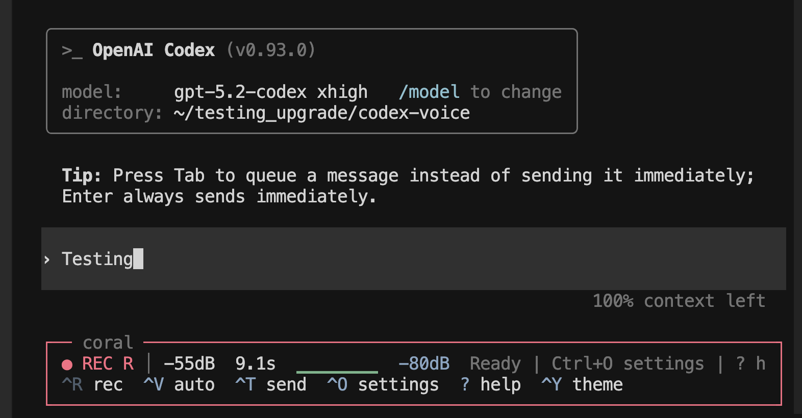
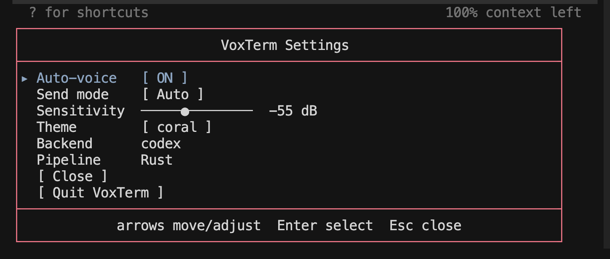
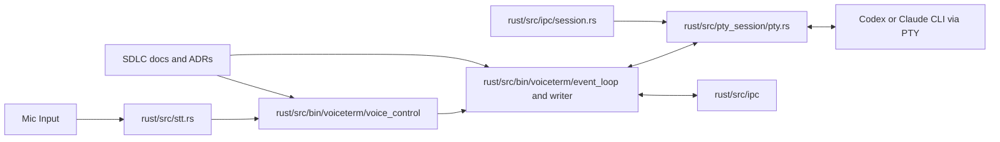
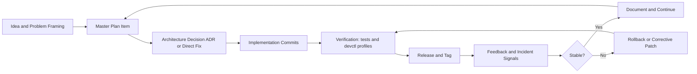
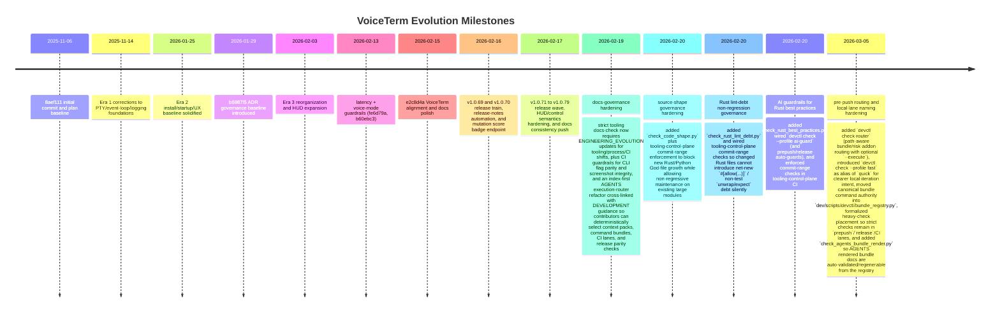
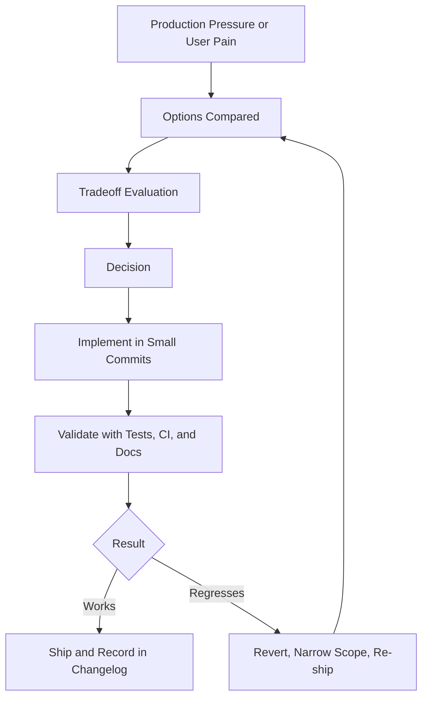

# Engineering Evolution and SDLC Timeline

<!-- markdownlint-disable MD024 -->

**Status:** Draft v4 (historical design and process record)
**Audience:** users and developers
**Last Updated:** 2026-04-20

## At a Glance

VoiceTerm is a voice-first HUD overlay for AI CLIs, with primary support for Codex and Claude. It keeps terminal-native workflows and adds better voice input, feedback, and controls.

What makes this hard: VoiceTerm must keep PTY correctness, HUD responsiveness, STT latency trust, and fast release cycles aligned in one local runtime.

**What this repo demonstrates:**

- Architecture growth from MVP assumptions to Rust-first runtime control.
- Reliability growth from reactive fixes to CI guardrails and safe rollback.
- Process growth from ad-hoc iteration to ADR-backed decisions and repeatable checks.

**Key docs to cross-reference:**

- `dev/active/MASTER_PLAN.md`
- `dev/guides/ARCHITECTURE.md`
- `dev/guides/DEVELOPMENT.md`
- `dev/CHANGELOG.md`
- `dev/adr/README.md`

**Appendix quick pointers:**

- ADR crosswalk: [Appendix B](#appendix-b-adr-crosswalk)
- Naming timeline: [Appendix E](#appendix-e-naming-timeline)

## Reader Paths

- [Quick Read (2 min)](#quick-read-2-min)
- [User Path (5 min)](#user-path-5-min)
- [Developer Path (15 min)](#developer-path-15-min)

### 2026-04-17 - Event-backed current-session only clears on explicit packet truth, and missing implementation permission now blocks mutation

### 2026-04-20 - Governed push reruns now heal already-published pipelines back to `push_completed`

Fact: the first fix for the no-op governed-push regression only added a
monotonic guard at pipeline persistence time. That prevented an already-green
`push_completed` pipeline from regressing on a rerun, but it still left one
real failure mode open: if an older run had already been persisted as
`push_blocked`, a later `branch_already_pushed` rerun would keep reporting the
branch as remotely published while the pipeline artifact stayed blocked.

Change: the push-result projector now treats
`reason=branch_already_pushed` plus `published_remote=true` as terminal push
completion. The same rerun now projects `next_state=push_completed`, clears the
blocked publication interpretation, and emits a passing `push_result` instead of
partial-progress failure semantics. Regression proof now covers both the direct
projection path and the pipeline sync heal path for an already-regressed
`push_blocked` artifact.

Evidence:
- `dev/scripts/devctl/commands/vcs/governed_executor_push_result.py`
- `dev/scripts/devctl/tests/vcs/test_push.py`

### 2026-04-19 - Event-backed packet post now wakes the waiting reviewer instead of waiting for follow cadence

Fact: the next live Codex+Claude remote-control pass exposed a narrower defect
than "the heartbeat is stale." Event-backed packet posting already updated the
typed queue immediately, but the actual reviewer wake lived only inside the
detached ensure-follow loop. When Codex was sitting in a waiting reviewer
state, a fresh Claude packet could land in the inbox and still do nothing
until a later publisher tick or a manual operator poke woke the loop.

This mattered because packet visibility and packet wake are different contracts.
A dual-agent loop that only notices new work on cadence is still operator-led,
even if the typed queue is correct. That is exactly the failure mode the
remote-control dogfood surfaced: the queue changed, but the mutation/review
lane did not react until a human forced it.

The closure stayed bounded and reused the existing wake authority instead of
inventing a second wake system. Event-backed `review-channel --action post`
now refreshes typed status immediately after the packet write, derives the
same operator interaction mode the rest of the runtime uses, and calls the
existing reviewer wake primitive when the new packet targets Codex and the
typed reviewer state says the lane is waiting. The follow loop still owns its
cadence-based wake behavior, but packet arrival no longer has to wait for that
cadence to restore the reviewer turn. Focused proof is green on the new
post-path wake regression plus the existing reviewer-wake and watch support
regressions.

Evidence: `dev/scripts/devctl/commands/review_channel/event_handler.py`,
`dev/scripts/devctl/commands/review_channel/event_post_wake.py`,
`dev/scripts/devctl/review_channel/follow_controller.py`,
`dev/scripts/devctl/tests/review_channel/test_event_post_wake.py`,
`dev/scripts/devctl/tests/review_channel/test_follow_controller_reviewer_wake.py`,
and `dev/scripts/devctl/tests/review_channel/test_event_watch_support.py`.

### 2026-04-18 - Collaboration roles now derive from typed ownership while dogfood stays a development ledger

Fact: the next MP-377 collaboration pass exposed a smaller but more important
coupling bug than "Claude should dogfood more." The repo already had
`devctl dogfood --record --dev-mode`, but the live collaboration contract was
still easy to read as if dogfood were the thing that decided who coded and who
verified. That would have baked a self-hosting development workflow into the
universal runtime path even though end-user repos may want typed collaboration
without any dogfood campaign at all.

This mattered because runtime state and development evidence answer different
questions. Typed runtime should decide mutation ownership, verification
ownership, and watcher/dashboard ownership right now. Dogfood should record
whether a development session exercised that path and captured evidence. If
those concerns collapse into one mode flag, the runtime becomes
development-shaped instead of repo-pack-shaped.

The closure stayed bounded and typed. `CollaborationSession` now carries
explicit `mutation_owner`, `verification_owner`, `verification_status`,
`watcher_owner`, and `watcher_status`, and `AuthoritySnapshot` mirrors those
fields for startup/status/session-resume consumers. The collaboration-session
builder derives them from the existing typed roster plus remote-control
attachments, and the review-state parser only falls back to collaboration or
bridge instruction truth when `current_session` is absent. The same slice kept
`devctl dogfood` explicitly documented as development-only evidence instead of
promoting it into a universal runtime mode.

Evidence: `dev/scripts/devctl/review_channel/collaboration_session.py`,
`dev/scripts/devctl/review_channel/collaboration_session_lane_owners.py`,
`dev/scripts/devctl/runtime/review_state_collaboration_models.py`,
`dev/scripts/devctl/runtime/review_state_collaboration_parse.py`,
`dev/scripts/devctl/runtime/review_state_collaboration_legacy.py`,
`dev/scripts/devctl/runtime/review_state_parser.py`,
`dev/scripts/devctl/runtime/review_state_parser_rows.py`,
`dev/scripts/devctl/runtime/authority_snapshot_core.py`,
`dev/scripts/devctl/runtime/authority_snapshot_build.py`,
`dev/scripts/devctl/runtime/authority_snapshot_parse_support.py`,
`dev/scripts/devctl/tests/review_channel/test_collaboration_session.py`,
`dev/scripts/devctl/tests/runtime/test_review_state.py`,
`dev/scripts/devctl/tests/runtime/test_startup_context.py`,
`dev/scripts/devctl/tests/checks/platform_contract_closure/test_check_platform_contract_closure.py`,
`AGENTS.md`,
`dev/guides/DEVELOPMENT.md`,
`dev/scripts/README.md`,
`dev/active/MASTER_PLAN.md`,
and `dev/active/ai_governance_platform.md`.

### 2026-04-18 - Remote-control operator delegation now auto-satisfies governed commit approval when typed runtime proves the operator role

Fact: the next live `/remote-control` dogfood pass exposed a narrower gap
than either of the repo's earlier extremes. The branch had already moved away
from blanket promptless `remote_control` approval, and
`devctl commit --approve-pending` now existed as the explicit resume path, but
the governed commit lane was still using the raw `interaction_mode` string as
its entire approval decision. That meant the live pipeline still stopped at
`operator_approval_pending` and minted `rev_pkt_1122` even when typed runtime
state already proved an active `remote_control_attachment` for Claude with
`role=operator`, plus the collaboration roster projected the same Claude lane
as `operator_agent`.

This mattered because the approval boundary is supposed to be role-first and
typed. A bare `remote_control` string is not enough to self-approve, but an
active operator-role attachment is also not "just another prompt": it is the
repo's own typed proof that the remote-control lane already delegated operator
authority to a live session. Requiring a second manual approval packet in that
state turns governed mutation into paperwork instead of enforcing a stronger
boundary.

The closure stayed bounded. `commit_preflight_support.py` now exposes a small
`CommitApprovalAuthority` decision built from `interaction_mode` plus optional
`remote_control_attachment` evidence. Local-terminal and single-agent still
self-approve, plain `remote_control` still fails closed, and `remote_control`
only auto-satisfies approval when runtime proves an active operator-role
delegate for the current lane. The governed commit path then reuses the
existing typed operator packet flow instead of inventing a new packet-recipient
permission model or bypass flag, while `devctl commit --approve-pending`
remains the explicit resume path for remote-control sessions that do not carry
that typed delegation. Focused proof is green on six commit-gate regressions:
delegate-backed auto-approval, no-delegate fail-closed behavior, explicit
resume, explicit approval sync, pending-phase reporting, and interaction-mode
resolution.

Evidence: `dev/scripts/devctl/commands/vcs/commit.py`,
`dev/scripts/devctl/commands/vcs/commit_preflight.py`,
`dev/scripts/devctl/commands/vcs/commit_preflight_support.py`,
`dev/scripts/devctl/commands/vcs/commit_preflight_validators.py`,
`dev/scripts/devctl/commands/vcs/governed_executor_packets.py`,
`dev/scripts/devctl/tests/vcs/test_commit_gate.py`,
`dev/scripts/README.md`,
`dev/guides/DEVELOPMENT.md`,
`dev/active/MASTER_PLAN.md`,
`dev/active/remote_control_runtime.md`,
and `AGENTS.md`.

### 2026-04-18 - Governed commit/push now preserve staged intent and separate receipt reporting from content commits

Fact: the next live push attempts exposed two architectural defects in the
same governed publication lane. First, `devctl push` and its preflight
auto-commit repair path still treated every dirty-tree row as push-blocking,
so a user who had already started staging the next slice could deadlock the
already-approved push path into a commit/push/dirty-tree loop. Second, the
governed commit lane still left one high-risk blind spot around the managed
ReviewSnapshot refresh: if that refresh ever dropped previously staged user
paths, the stage phase would continue silently, and the final report could
still make the trailing receipt commit look like the substantive code commit.

This mattered because both defects block normal multi-file work. A governed
push that treats staged-only intent as dirt turns the repo-owned publication
path into a loop generator, and a governed commit lane that cannot prove it
preserved the staged set is not safe to trust during checkpointed or
multi-file work. The reporting ambiguity made the second problem worse by
pointing operators at the receipt SHA instead of the parent code commit that
actually carried the user's staged content.

The closure stayed typed and low-risk. `collect_git_status()` now emits
working-tree-aware porcelain fields (`raw_status`, `index_status`,
`worktree_status`) so the new `push_worktree_changes.py` helper can treat
unstaged/untracked dirt as push-blocking while allowing staged-only next-commit
intent to coexist with the approved push path. `push.py` and
`push_preflight_commit.py` now both reuse that helper, so preflight-generated
auto-commit logic and the final push cleanliness gate agree on the same
contract. On the commit side, governed staging now routes ReviewSnapshot
refresh bookkeeping through a dedicated helper module, fails closed with
`staged_index_preservation_failed` if the managed refresh drops previously
staged non-artifact paths, and keeps the main stage phase small enough for the
repo's code-shape guards. `devctl commit` also now reports the approved
content SHA separately from a trailing `receipt_commit_sha` when HEAD is a
ReviewSnapshot receipt commit, so operators can see the real substantive
commit without reparsing git history by hand.

Focused proof is green on the new staged-only push regressions, the staged
index preservation failure regression, the commit report SHA regressions, and
the docs-check payload update for richer git-status rows.

Evidence: `dev/scripts/devctl/collect.py`,
`dev/scripts/devctl/commands/vcs/commit.py`,
`dev/scripts/devctl/commands/vcs/governed_executor_phases.py`,
`dev/scripts/devctl/commands/vcs/governed_executor_stage_attention.py`,
`dev/scripts/devctl/commands/vcs/governed_executor_stage_snapshot.py`,
`dev/scripts/devctl/commands/vcs/push.py`,
`dev/scripts/devctl/commands/vcs/push_preflight_commit.py`,
`dev/scripts/devctl/commands/vcs/push_worktree_changes.py`,
`dev/scripts/devctl/tests/commands/docs/test_check.py`,
`dev/scripts/devctl/tests/vcs/test_commit_gate.py`,
`dev/scripts/devctl/tests/vcs/test_governed_executor.py`,
`dev/scripts/devctl/tests/vcs/test_push.py`,
`dev/scripts/README.md`,
`dev/guides/DEVELOPMENT.md`,
`dev/active/MASTER_PLAN.md`,
`dev/active/ai_governance_platform.md`,
and `AGENTS.md`.

Fact: the next review-channel/current-session dogfood pass exposed a narrower
authority bug than "packet clearing is wrong." The reducer had already been
tightened to ignore missing packet surfaces in some paths, but the remaining
event-backed projection still treated a blank queue like an explicit clear
whenever packet authority was absent or only implied by stale fixtures. That
erased prior typed instructions, made a canonical markdown-revision test fail
for the wrong reason, and left `ImplementationAdmissibility` with one
fail-open gap: missing/empty `implementation_permission` still did not block
mutation. The same slice also closed the reviewer-follow relaunch mismatch by
making `relaunch_review_loop` explicitly auto-fixable only through the typed
recovery decision.

This mattered because the current-session/runtime lane is one of the last
portable authority seams that cannot depend on chat memory or compatibility
bridge lore. If blank queue state clears instructions without explicit packet
truth, or if missing implementation permission still counts as writable, the
repo can silently drift from fail-closed typed authority back toward hidden
defaults.

The closure stayed bounded. Event-backed `current_session` now preserves the
prior typed instruction when queue text is blank and no explicit `packets` /
`packet_inbox` authority is present, and queue
`derived_next_instruction_source.to_agent` must be blank or `claude` before
the text projects into Claude's live instruction lane. Bridge-backed
authority now refuses to outrank persisted typed state when the live bridge
contributes no authority signal. `derive_implementation_admissibility()` now
returns `blocked` with `implementation_permission_missing` for missing or
empty permission, and reviewer-follow relaunch keeps its fail-closed posture
by allowing auto-relaunch only when the typed recovery decision marks
`relaunch_review_loop` auto-fixable. The same slice also refreshed the
maintainer/self-hosting docs and documented the repo-local `reviewer_loop.sh`
wrapper in `dev/scripts/README.md` so `docs-check --strict-tooling` and
`hygiene` can keep this contract repo-visible.

Evidence: `dev/scripts/devctl/review_channel/current_session_attention.py`,
`dev/scripts/devctl/review_channel/current_session_authority.py`,
`dev/scripts/devctl/review_channel/current_session_projection.py`,
`dev/scripts/devctl/review_channel/current_session_support.py`,
`dev/scripts/devctl/review_channel/recovery_decision.py`,
`dev/scripts/devctl/review_channel/status_snapshot_authority.py`,
`dev/scripts/devctl/runtime/implementation_admissibility.py`,
`dev/scripts/devctl/tests/review_channel/test_current_session_projection.py`,
`dev/scripts/devctl/tests/review_channel/test_reviewer_follow_restore_policy.py`,
`dev/scripts/devctl/tests/runtime/test_implementation_admissibility.py`,
`AGENTS.md`,
`dev/guides/DEVELOPMENT.md`,
`dev/scripts/README.md`,
`dev/active/MASTER_PLAN.md`,
`dev/active/ai_governance_platform.md`.

### 2026-04-17 - Detached dual-agent over-budget state now cuts a checkpoint instead of asking for relaunch

Fact: once the current-session authority repair landed, one narrower deadlock
remained in the live repo proof. Detached `active_dual_agent` runtime truth
still outranked stronger checkpoint authority, so the same review-current,
over-budget state could tell operators to relaunch the review loop even while
startup authority already said the next permitted action was a governed
checkpoint. That also made the reduced authority surfaces too blunt: the
status/startup contract blocked implementation correctly, but it did not make
the checkpoint-safe `vcs.stage` / `vcs.commit` path explicit.

This mattered because the platform claim is not just "fail closed." The
contract also has to tell the truth about what kind of recovery is allowed.
In a detached loop where `reviewed_hash_current=true`, `review_needed=false`,
and the worktree is simply over budget, relaunch is the wrong next step. The
right next step is to cut the bounded checkpoint, refresh the receipt, and
only then decide whether launch/ensure automation should resume.

The closure stayed bounded. The shared attention reducer now lets checkpoint
authority preempt detached-runtime recovery when typed push enforcement says
the tree is over budget and reviewer proof is already current. The shared
action-routing path now falls back to top-level status payloads for
`implementation_permission`, `reviewer_gate`, and push-enforcement truth,
keeps `implementation.edit` blocked, but allows `vcs.stage` / `vcs.commit`
for the governed checkpoint exception. The same slice dedupes startup blocker
summaries and makes `cut_checkpoint` prefer the typed governed
`devctl commit -m "<descriptive message>"` next command across
`review-channel --action status`, `startup-context`, and the reduced
`authority_snapshot`.

Evidence: `dev/scripts/devctl/review_channel/attention_classify.py`,
`dev/scripts/devctl/runtime/action_routing.py`,
`dev/scripts/devctl/runtime/authority_snapshot_build.py`,
`dev/scripts/devctl/runtime/authority_snapshot_core.py`,
`dev/scripts/devctl/commands/review_channel/reviewer_runtime_snapshot.py`,
`dev/scripts/devctl/tests/review_channel/test_recovery_assessment.py`,
`dev/scripts/devctl/tests/runtime/test_action_routing.py`,
`dev/scripts/devctl/tests/runtime/test_startup_context.py`,
`dev/scripts/devctl/tests/review_channel/test_review_channel.py`,
`python3 dev/scripts/devctl.py review-channel --action status --terminal none --format json`,
and `python3 dev/scripts/devctl.py startup-context --format summary`.

### 2026-04-17 - Remote-control checkpoints can now resume through one operator command instead of hand-built approval packets

Fact: the next dogfood pass after the checkpoint-first routing fix exposed a
different gap in the same governed remote-control lane. `devctl commit`
correctly failed closed at `operator_approval_pending`, but the only way to
resume the pipeline was to manually reconstruct a typed `commit_approval`
decision packet from `commit_pipeline.json`, post it through
`review-channel --action post`, apply it, and then rerun `devctl commit`.
That was architecturally correct but operationally wrong: the system already
had the pipeline id, generation id, staged snapshot hash, and guard summary,
yet the repo still made operators rebuild them by hand.

This mattered because the remote-control contract is supposed to be
self-hosting. A governed commit should require explicit operator intent, but
explicit intent is not the same thing as forcing humans or AI copilots to
copy packet fields out of JSON receipts. If the repo cannot offer one
operator-owned resume surface, the approval boundary stays technically safe
while still encouraging ad hoc recovery steps.

The closure stayed bounded. `devctl commit` now accepts
`--approve-pending` as the explicit operator-owned resume path for governed
remote-control checkpoints. The flag reuses the current guarded pipeline,
posts/applies the matching typed `commit_approval` decision, and continues
the same `vcs.commit` instead of requiring manual `review-channel post|apply`
field assembly. The same slice also narrowed packet reads on the commit
path: approval helper and commit-phase packet loaders now reduce raw event
packets directly instead of rebuilding the full enriched event bundle just to
match approval packets. That cut the focused approval-resume regression from
roughly 169 seconds to roughly 109 seconds, while leaving a separate
first-stage remote-control preflight/context-graph latency as the next
follow-up optimization.

Evidence: `dev/scripts/devctl/commands/vcs/parser.py`,
`dev/scripts/devctl/commands/vcs/commit.py`,
`dev/scripts/devctl/commands/vcs/commit_preflight.py`,
`dev/scripts/devctl/commands/vcs/governed_executor_sync.py`,
`dev/scripts/devctl/tests/vcs/test_commit_gate.py`,
`dev/scripts/README.md`,
`dev/active/MASTER_PLAN.md`,
and `dev/active/ai_governance_platform.md`.

### 2026-04-17 - Operator inbox now rides the typed packet lane as a read-only alias

Fact: the next `rev_pkt_0915` dogfood discussion narrowed the "operator as a
first-class packet participant" gap again. The repo did not actually need a
new transport or fresh packet enums to start closing that loop: `operator`
was already in the packet roster, `approval_request` already existed in the
contract, and `review-channel --action inbox --target operator` could already
read the queue. The missing seam was an explicit operator-facing read surface
that stayed packet-native without mutating live delivery receipts.

This mattered because operator, dashboard, and phone surfaces are supposed to
consume the same typed packet spine the agent lanes use. If the only operator
read path is a generic inbox call that also stamps
`delivery_observed_at_utc` / `delivery_observed_by`, the act of inspecting
the queue can accidentally masquerade as lane-level delivery proof. That is
exactly the kind of cross-surface authority confusion the platform is trying
to eliminate.

The closure stayed bounded. `review-channel --action operator-inbox` now acts
as a read-only alias over the existing event-backed packet queue: it fixes
`target=operator`, defaults to `status=pending`, and intentionally refuses to
mark live `action_request` packets observed. The same slice extracted the
event-handler post/transition/inbox-like helpers into a companion module so
`check_code_shape.py` stays green while the operator-facing read surface lands.

Evidence: `dev/scripts/devctl/commands/review_channel/event_handler.py`,
`dev/scripts/devctl/commands/review_channel/event_action_support.py`,
`dev/scripts/devctl/commands/review_channel/event_watch_support.py`,
`dev/scripts/devctl/commands/review_channel_command/constants.py`,
`dev/scripts/devctl/review_channel/parser.py`,
`dev/scripts/devctl/tests/review_channel/test_operator_inbox.py`,
`dev/scripts/README.md`,
`dev/active/review_channel.md`,
`dev/active/MASTER_PLAN.md`,
and `dev/active/ai_governance_platform.md`.

### 2026-04-17 - Active commit/push pipeline blocks now self-heal same-HEAD authorization and project exact next commands

Fact: the next remote-control dogfood pass found the remaining
operator-facing gap after `--approve-pending` landed. The repo already had
typed pipeline truth for the live blocked publish path:
`pipeline --action status` could show `state=push_blocked`,
`authorization_expired=true`, `authorized_head_sha == current_head_sha`, and
`next_command=python3 dev/scripts/devctl.py push --execute`. But the commit
lane still blocked on locally regenerated prose, so agents had to infer when
to refresh authorization, when to reuse the current pipeline, and when a
blocked commit was really a publish-follow-up instead of a fresh staging
problem.

This mattered because the platform contract is supposed to be compiler-like.
Once the typed reducer has already chosen the next command, downstream
surfaces should not invent a second explanation layer and hope humans or AI
reconstruct the same answer. The same defect showed up on the commit side:
explicit-approval blocking reports still emitted free-form text for "no
pipeline", "stale pipeline", and "approval missing" instead of projecting the
exact command the operator should run next.

The closure stayed bounded. `commit_pipeline_blocking.py` now consumes the
typed pipeline status view directly, auto-refreshes same-HEAD expired
authorization before it emits the block report, and drops the fallback prose
branch in favor of the typed `next_command`. `commit_preflight.py` now
projects exact next commands for `no_pending_pipeline_to_approve`, stale
pipeline, and operator-approval-missing states, while reusing the active
pipeline block report for `push_blocked` / `commit_recorded` reuse paths.
`commit.py` also projects `CommitPermissionDecision` `next_command`,
`recovery_action`, and `escalation_action` at top level so agents do not have
to unpack nested JSON or guess from generic guidance, and the unsupported
passthrough help text now names `--amend` to stay aligned with the actual
accepted flags. The same slice also updated the stale startup-context
checkpoint test to match the current checkpoint-first contract: over-budget
or resync-required sessions may still allow `vcs.stage` / `vcs.commit` while
blocking `implementation.edit`.

Evidence: `dev/scripts/devctl/commands/vcs/commit.py`,
`dev/scripts/devctl/commands/vcs/commit_pipeline_blocking.py`,
`dev/scripts/devctl/commands/vcs/commit_preflight.py`,
`dev/scripts/devctl/commands/vcs/commit_preflight_support.py`,
`dev/scripts/devctl/tests/vcs/test_commit_gate.py`,
`dev/scripts/devctl/tests/vcs/test_push.py`,
`dev/scripts/devctl/tests/commands/test_pipeline_command.py`,
`dev/scripts/README.md`,
`dev/guides/DEVELOPMENT.md`,
`dev/active/MASTER_PLAN.md`,
`dev/active/ai_governance_platform.md`,
and `AGENTS.md`.

### 2026-04-17 - Review-channel status now separates raw latest push truth from selected current-target push truth

Fact: the next remote-control dogfood pass found that `review-channel status`
still had two distinct push-state seams after the `next_command` work landed.
First, `detect_push_enforcement_state()` overloaded
`latest_push_report_*` to mean both "the raw `dev/reports/push/latest.json`
artifact" and "the current-target report selected for safe startup/push
decisions", so a mismatched latest artifact could silently collapse back to
an older receipt while still presenting itself as "latest". Second, the
bridge-backed `_compat` writer in
`review_channel/status_projection_compat.py` computed fresh
`bridge_liveness["push_enforcement"]` truth but never copied it into the
compat projection, so some `review_state.json` consumers stayed stale even
after the reducer updated.

The closure made the contracts explicit instead of asking agents to infer
them. Governed push-state now carries raw-latest fields
(`latest_push_report_*`) and separately selected current-target fields
(`selected_push_report_*` plus `selected_push_report_source`). Startup
recovery/push decision logic consumes the selected fields, while the
bridge-backed status compat payload now includes `push_enforcement`
directly. Cache freshness paths for review projections also include the
managed latest push artifact, so read-only/mobile surfaces invalidate when
`dev/reports/push/latest.json` advances. Legacy direct constructions and old
payloads still fall back cleanly to the historical `latest_*` semantics for
decision hints.

Evidence: `dev/scripts/devctl/governance/push_state.py`,
`dev/scripts/devctl/governance/push_state_selection.py`,
`dev/scripts/devctl/runtime/project_governance_push.py`,
`dev/scripts/devctl/runtime/startup_push_recovery.py`,
`dev/scripts/devctl/runtime/startup_push_decision.py`,
`dev/scripts/devctl/repo_packs/review_cache.py`,
`dev/scripts/devctl/repo_packs/review_helpers.py`,
`dev/scripts/devctl/runtime/review_state_refresh_support.py`,
`dev/scripts/devctl/review_channel/status_projection_compat.py`,
`dev/scripts/devctl/tests/vcs/test_push.py`,
`dev/scripts/devctl/tests/repo_packs/test_repo_packs.py`,
`dev/scripts/devctl/tests/review_channel/test_status_projection_compat.py`,
and `dev/scripts/devctl/tests/runtime/test_startup_context.py`.

### 2026-04-17 - Direct pipeline recovery now refreshes review projections before the next checkpoint read

Fact: the next governed checkpoint retry exposed one more stale-state loop in
the remote-control dogfood path. `pipeline --action abandon` could truthfully
return `ok=true` and `new_state=abandoned`, but the very next
bridge-backed `review-channel status` or `devctl commit` read could still
reload an older `latest/commit_pipeline.json` payload and mirror `push_blocked`
back into the canonical `projections/latest/commit_pipeline.json` artifact.
That made the system look like it needed more operator babysitting when the
real problem was a write-through gap between direct pipeline recovery actions
and the shared review-channel projection cache.

This mattered because the current product goal is not "eventual consistency if
an agent keeps re-reading until the right file wins." The canonical reducer had
already chosen the new pipeline state; the repo-owned recovery command that
wrote that state needed to refresh the same projection surfaces the rest of the
system trusts next. Otherwise the checkpoint lane still behaves like an
operator has to understand the hidden artifact topology well enough to know why
`abandoned` just turned back into `push_blocked`.

The closure stayed bounded. The shared pipeline support path now refreshes the
review-channel projections immediately after direct
`pipeline --action abandon`, `recover`, or `refresh-authorization` writes,
using the same repo-owned projection refresh machinery the governed executor
path already trusted. The same checkpoint-repair slice also typed the expanded
pending-reviewer commit-gate helper against `ReviewState`, which cleared the
repo-wide `check_python_typed_seams.py` failure that surfaced on the first
fresh commit retry after the projection refresh landed. The result is smaller
than the upcoming packet-lifecycle redesign, but operationally important: a
live checkpoint retry now advances from the current pipeline truth instead of
falling back into a stale mirror loop before the next governed read.

Evidence: `dev/scripts/devctl/commands/pipeline/support.py`,
`dev/scripts/devctl/commands/pipeline/abandon_action.py`,
`dev/scripts/devctl/commands/pipeline/recover_action.py`,
`dev/scripts/devctl/commands/pipeline/refresh_authorization_action.py`,
`dev/scripts/devctl/runtime/commit_packet_gate.py`,
`dev/scripts/devctl/tests/commands/test_pipeline_command.py`,
`dev/scripts/devctl/tests/vcs/test_commit_pending_reviewer_gate.py`,

### 2026-04-17 - Commit-recorded pipeline status now distinguishes continue-push from recovery

Fact: the next dogfood retry exposed a second, narrower defect after the
projection-refresh closure. Same-head `commit_recorded` pipeline state could
still project contradictory recovery truth: `recommended_next_action` said
`abandon` or `refresh-authorization`, while `next_command` silently preferred
`python3 dev/scripts/devctl.py push --execute`. That made the pipeline surface
look like it needed manual interpretation exactly when the product goal is to
let typed status tell the agent whether it should continue publication or take
recovery action.

The fix was small but load-bearing. Pipeline status now treats same-head
`commit_recorded` as a continue-publication state with
`recommended_next_action=none` and
`next_command=python3 dev/scripts/devctl.py push --execute`. When the same
state is expired, the status surface now projects the explicit
`refresh-authorization` command instead of silently preferring push. The
governed commit block path still overrides superseded post-checkpoint-dirty
`commit_recorded` pipelines to `abandon`, so the recovery semantics only
surface when the current worktree actually needs them.

Evidence: `dev/scripts/devctl/commands/pipeline/support.py`,
`dev/scripts/devctl/tests/commands/test_pipeline_command.py`,
`dev/scripts/devctl/tests/vcs/test_commit_gate.py`, and
`dev/scripts/README.md`.
`dev/active/MASTER_PLAN.md`,
and `dev/active/ai_governance_platform.md`.

### 2026-04-17 - Prepared launch authority now derives remote-control continuity from typed state

The post-commit reviewer-loop persistence slice exposed one remaining split in
prepared conductor authority: `launch_authority.assess_prepared_launch_authority()`
only downgraded commit-driven `HEAD` drift to `refresh_recommended` when
`DEVCTL_OPERATOR_INTERACTION_MODE=remote_control` was present in the process
environment. Startup/status/runtime readers that did not inherit that env var
could classify the same post-launch session as fully `stale`, so receipt
commits kept flipping the same remote-control reviewer loop between
"continue" and "relaunch required" depending on which surface read it. The
bounded fix now resolves remote-control continuity from the canonical typed
inputs first: repo governance plus the current `review_state.json` payload via
`derive_operator_interaction_mode()`, with the env override kept only as a
legacy fast path. Existing stale-authority session-probe behavior stays
fail-closed for non-remote launches, while remote-control receipt commits now
stay aligned with the rest of the control plane.

Evidence: `dev/scripts/devctl/review_channel/launch_authority.py`,
`dev/scripts/devctl/tests/review_channel/test_launch_authority.py`,
`dev/scripts/devctl/tests/review_channel/test_review_channel.py`.

### 2026-04-17 - Host cleanup now protects registry-backed running conductors even when prepared authority drifted stale

Fact: the next live governed-checkpoint retry was no longer blocked by
pipeline/status drift; it was blocked by `host-process-cleanup-post`. The real
host process tree showed a detached Codex conductor wrapper still running under
the typed session registry, but `_protected_registered_conductor_pids()` only
trusted `session.live`. Because `session.live` also encodes prepared-head
freshness, the same running conductor flipped into `recent_detached` failure
state as soon as prepared authority drifted, even though cleanup still could
not safely reap it.

This matters because the product goal is not "kill more processes." The host
cleanup lane must distinguish runtime liveness from broader governance
freshness, otherwise a healthy review loop can block `process-cleanup --verify`
and every governed checkpoint that depends on it.

The bounded fix keeps the protection scope typed and narrow: registered
conductor `session_pid` values stay protected when the script probe still says
`running`, even if `session.live` is false because prepared authority has gone
stale. Unregistered or pid-less detached wrappers still fail closed. Focused
proof is green on the protected-PID process-sweep tests, targeted strict
process-audit regressions, and live
`python3 dev/scripts/devctl.py process-cleanup --verify --format json`, which
now returns `ok: true` on the previously blocked detached-conductor tree.

Evidence: `dev/scripts/devctl/commands/check/process_sweep.py`,
`dev/scripts/devctl/tests/process_sweep/test_process_sweep.py`,
`dev/scripts/devctl/tests/commands/process/test_process_audit.py`,
`dev/active/MASTER_PLAN.md`,
`dev/active/ai_governance_platform.md`,
and `dev/scripts/README.md`.

### 2026-04-15 - Governed commit fallback now trusts effective reviewer mode, and status `sessions=[]` is action-scoped

Fact: the next dogfood pass after the launch-authority/runtime-parity repair
found one more place where declared topology could outrank typed authority.
`resolve_commit_execution_target()` still preferred
`collaboration.reviewer_mode` before `bridge.effective_reviewer_mode` when it
had to synthesize conductor capabilities without a fully populated capability
object. In a local `single_agent` takeover, that meant a stale declared
`active_dual_agent` collaboration record could incorrectly make the implementer
lane look writable again. The same probe also clarified a status-surface point:
top-level `review-channel status` `sessions=[]` on non-launch actions is the
expected action-scoped report shape, not proof that live conductor metadata is
missing.

This matters because governed checkpoint/commit execution is one of the last
places where typed authority has to remain stronger than compatibility
provenance. If declared collaboration topology can still re-grant the
implementer lane after takeover, then the remote commit pipeline is not really
fail-closed: a local reviewer checkpoint can still route back to the wrong
actor even though the typed bridge/runtime state already demoted the lane.

The closure was intentionally small. `resolve_commit_execution_target()` now
prefers `bridge.effective_reviewer_mode` before collaboration/declared mode
when it synthesizes writable lane capabilities, and a focused regression test
proves that a stale declared `active_dual_agent` record no longer steals
single-agent checkpoint authority from Codex. The matching maintainer docs
(`AGENTS.md`, `dev/guides/DEVELOPMENT.md`, `dev/scripts/README.md`,
`dev/active/MASTER_PLAN.md`) were updated in the same slice so
`docs-check --strict-tooling` treats the precedence as a repo-owned runtime
contract instead of a hidden local fix.

Evidence: `dev/scripts/devctl/commands/vcs/governed_executor_commit_runtime.py`,
`dev/scripts/devctl/tests/vcs/test_governed_executor.py`,
`python3 dev/scripts/checks/check_code_shape.py`,
`python3 dev/scripts/checks/check_review_surface_consistency.py`,
`python3 dev/scripts/checks/check_active_plan_sync.py`,
`python3 dev/scripts/checks/check_multi_agent_sync.py`, and
`python3 dev/scripts/checks/check_review_channel_bridge.py`.

### 2026-04-15 - Governed markdown startup now persists `PlanRegistry` and `PlanTargetRef` authority

Fact: `ProjectGovernance` already carried typed governed-markdown metadata, but
the active startup/planning path still rebuilt that data by reparsing mutable
plan markdown every time `scan_governed_markdown_contracts()` ran, and
`build_target_ref()` still reopened plan files just to recover the same target
hash. That left `MP377-P1-T04` open: startup and planning had typed contracts,
but not a repo-owned persisted authority artifact for the plan layer itself.

This matters because `MP377-P1-T05` through `MP377-P1-T08` all assume the plan
authority chain has already stopped treating mutable markdown as the live
runtime source for every read. Without a persisted `PlanRegistry` /
`PlanTargetRef` bundle, every fresh startup or planning pass can diverge on
file-read timing and the system keeps paying the full markdown reparse cost
even when the plan set has not changed.

The closure now persists governed markdown authority to
`dev/reports/governance/plan_registry.json`. The governed markdown scan writes
`PlanRegistry`, `DocPolicy`, `DocRegistry`, source-file freshness records, and
per-plan `PlanTargetRef` metadata into that repo-owned artifact, reuses it
while the governed doc set and per-file stats are unchanged, and falls back to
a fresh markdown scan only when the artifact is missing or stale.
`build_target_ref()` now consumes the persisted target metadata before
rehashing plan markdown, so startup/work-intake and planning IR both reuse the
same target authority when the plan files are unchanged.

Evidence: `dev/scripts/devctl/governance/draft_governed_docs.py`,
`dev/scripts/devctl/governance/draft_governed_docs_artifact.py`,
`dev/scripts/devctl/runtime/work_intake_selection.py`,
`dev/scripts/devctl/tests/governance/test_governance_draft.py`,
`dev/scripts/devctl/tests/runtime/test_work_intake.py`,
`dev/scripts/devctl/tests/platform/test_planning_ir.py`, and
`dev/scripts/devctl/tests/runtime/test_startup_context.py`.

### 2026-04-15 - Plan authority readers now prefer typed `PlanRegistry` projection over raw `INDEX.md`

Fact: persisting `dev/reports/governance/plan_registry.json` closed the startup
artifact gap, but several downstream authority readers still treated raw
`INDEX.md` rows as the live registry. Context-graph plan nodes, tracker-plan
resolution, scoped promotion, and `ReviewSnapshot` plan indexing were each
reparsing markdown even though the same information already existed in the
typed `ProjectGovernance.plan_registry` artifact.

This mattered because `MP377-P1-T05` is not just about startup speed. The plan
layer cannot become a bounded projection while authority consumers keep
secretly re-deriving MP/path/router state from markdown tables. That leaves
runtime surfaces vulnerable to stale or inconsistent raw-doc reads and keeps
the typed registry from being the real control surface.

The fix introduces one shared projection seam:
`dev/scripts/devctl/runtime/plan_registry_projection.py`. Context-graph plan
node collection, reviewer tracker-plan resolution, scoped promotion MP lookup,
and `ReviewSnapshot` plan indexing now prefer the persisted
`ProjectGovernance.plan_registry` projection and only fall back to raw
`INDEX.md` parsing when typed governance is unavailable. This lands the first
artifact-first `MP377-P1-T05` authority-reader pass without pretending the
remaining docs-governance/reporting markdown scans are finished.

Evidence: `dev/scripts/devctl/runtime/plan_registry_projection.py`,
`dev/scripts/devctl/context_graph/catalog_nodes.py`,
`dev/scripts/devctl/review_channel/plan_resolution.py`,
`dev/scripts/devctl/review_channel/promotion.py`,
`dev/scripts/devctl/runtime/review_snapshot_why.py`,
`dev/scripts/devctl/tests/context_graph/test_catalog_nodes.py`,
`dev/scripts/devctl/tests/review_channel/test_plan_resolution.py`,
`dev/scripts/devctl/tests/review_channel/test_promotion_scope.py`,
`dev/scripts/devctl/tests/runtime/test_review_snapshot_why.py`,
`dev/scripts/devctl/tests/context_graph/test_context_graph.py`, and
`dev/scripts/devctl/tests/runtime/test_review_snapshot.py`.

### 2026-04-15 - Docs-governance routing now prefers typed maintainer-doc paths before policy-context fallbacks

Fact: the first `MP377-P1-T05` reader pass moved plan-node, promotion, and
review-snapshot consumers onto the persisted `PlanRegistry`, but
docs-governance still had one smaller read-side gap. The shared
`governed_doc_routing.py` helper already trusted typed tracker/index roots, yet
it still sourced the maintainer-doc aliases used by docs-check defaults from
surface-generation context first. That left `process_doc`,
`development_doc`, `architecture_doc`, and `scripts_readme_doc` one step away
from the typed `ProjectGovernance` doc registry/path-root authority the rest of
the same lane was trying to make canonical.

This matters because the platform boundary is not just about plan routing. If
docs-check and check-router can still rebuild their maintainer-doc defaults
from policy-context strings before consulting the typed runtime view, another
repo can regress back toward hidden VoiceTerm-shaped defaults even while the
governance scan already knows the real docs authority, guide root, scripts
root, and tracker/index paths.

The closure is intentionally bounded. `governed_doc_routing.py` now prefers
typed `ProjectGovernance` doc paths (`docs_authority`, guide roots, scripts
README, tracker/index roots) whenever those docs are present in the runtime
registry, and only falls back to surface-generation context when typed
governance cannot identify them. Focused regressions prove both ends of the
contract: the routing helper itself prefers typed doc paths over stale policy
context, and the docs-check policy defaults follow the resolved routing object
instead of silently reviving baked-in maintainer-doc assumptions. Clean-tree
`devctl check --profile ci` is also green on the checkpoint that carries the
change.

Evidence: `dev/scripts/devctl/governance/governed_doc_routing.py`,
`dev/scripts/devctl/tests/governance/test_governed_doc_routing.py`,
`dev/scripts/devctl/tests/test_docs_check_constants.py`,
`dev/scripts/devctl/tests/governance/test_governance_draft.py`, and
`python3 dev/scripts/devctl.py check --profile ci`.

### 2026-04-15 - Scoped plan readers now use typed companion-doc fallback, and packet inbox merge stops reviving evicted expired findings

Fact: the next `MP377-P1-T05` dogfood pass surfaced a real boundary, but not
the one the first probe claimed. `INDEX.md` currently carries 29 active rows,
yet only 4 of them are execution-authority plan docs. The remaining 25 are
reference/companion docs. That meant widening `PlanRegistry` to "everything in
INDEX" would have broken the execution-authority boundary, but some scope
readers still needed a typed way to reach companion docs without reparsing raw
markdown tables. The same live queue pass also showed a different packet bug:
persisted packet-inbox state could keep `latest_finding_packet_id` and
`expired_unresolved_packet_ids` alive even after the event-backed reducer had
already dropped those packet ids, which let `open_findings` and reviewer
attention revive expired backlog from merge residue alone.

This mattered because both bugs undermine the same platform promise: markdown
and packet history can stay as compatibility evidence, but they should not
quietly become the only source of truth once typed governance/runtime state is
already available. If scope resolution still has to fall back to raw
`INDEX.md` for companion docs, or if expired packet ids can survive purely in a
persisted merge surface, the platform keeps reintroducing hidden mutable state
through compatibility paths.

The closure kept the authority boundary intact. `plan_registry_projection.py`
now resolves scoped docs in two typed steps: execution-authority plan entries
first, then typed `doc_registry` companion docs, and only then raw `INDEX.md`
compatibility fallback when typed governance is unavailable or incomplete.
`review_channel/plan_resolution.py` and `review_channel/promotion.py` now use
that typed resolver. Separately, `review_packet_inbox_merge.py` now drops
persisted latest-finding and expired-unresolved ids that are no longer present
in the live reducer, while `review_packet_inbox.py` routes live packet-id
collection through its own small helper seam so the merge module stays within
shape policy. Focused proof is green, and the remaining red in
`check --profile ci` is governance debt already visible on the branch
(`package-layout` baseline debt and startup-authority dirty-budget), not a
regression in the new logic.

Evidence: `dev/scripts/devctl/runtime/plan_registry_projection.py`,
`dev/scripts/devctl/review_channel/plan_resolution.py`,
`dev/scripts/devctl/review_channel/promotion.py`,
`dev/scripts/devctl/runtime/review_packet_inbox.py`,
`dev/scripts/devctl/runtime/review_packet_inbox_merge.py`,
`dev/scripts/devctl/runtime/review_packet_inbox_rows.py`,
`dev/scripts/devctl/tests/review_channel/test_plan_resolution.py`,
`dev/scripts/devctl/tests/review_channel/test_promotion_scope.py`,
`dev/scripts/devctl/tests/runtime/test_review_packet_inbox.py`,
`dev/scripts/devctl/tests/runtime/test_work_intake.py`,
`python3 dev/scripts/devctl.py docs-check --strict-tooling`,
`python3 dev/scripts/checks/check_code_shape.py`,
`python3 dev/scripts/checks/check_review_surface_consistency.py`,
`python3 dev/scripts/checks/check_active_plan_sync.py`,
`python3 dev/scripts/checks/check_multi_agent_sync.py`, and
`python3 dev/scripts/checks/check_review_channel_bridge.py`.

### 2026-04-15 - Bridge-backed status and event-backed startup/dashboard now share one attention-priority reducer

Fact: after the authority-snapshot and packet-inbox repairs landed, the repo
still had one live cross-surface contradiction left. Bridge-backed
`review-channel --action status` attached conductor session state before it
classified attention, but the event-backed producer used by
`startup-context`, `session-resume`, and `dashboard` classified attention from
an earlier bridge-liveness snapshot. On the same dirty tree that meant status
said `review_loop_relaunch_required` while dashboard/startup still said
`checkpoint_required`, even though they were all reading the same repo-owned
runtime.

This matters because the platform claim is not "multiple surfaces eventually
agree if you know which one to trust." The claim is that bridge-backed and
event-backed readers are compatibility projections over one typed producer
tick. If one path computes `launch_truth` before it knows which conductors are
actually live, AI turns and operator surfaces get different recovery advice
from the same state and the repo slides back toward chat-local arbitration.

The closure was a producer fix, not a renderer band-aid. Event-backed review
state enrichment now calls the same
`status_projection_helpers.attach_conductor_session_state()` helper that
bridge-backed status already used, and it does so before
`build_recovery_assessment()` runs. That means `launch_truth`,
`effective_reviewer_mode`, `attention.status`, and the downstream
`AuthoritySnapshot` all read the same conductor-attached runtime. Focused
proof is green on the event-projection and current-session regressions, and
live proof is green on `review-channel --action status`,
`startup-context --format json`, and `dashboard --format json`, which now all
emit `review_loop_relaunch_required` on the live repo state while still
keeping checkpoint guidance in `advisory_action` / `push_decision`.

The same slice also refreshed the maintainer authority docs
(`AGENTS.md`, `dev/guides/DEVELOPMENT.md`, `dev/scripts/README.md`,
`dev/active/MASTER_PLAN.md`) so `docs-check --strict-tooling` treats this as
load-bearing runtime convergence rather than an undocumented local tweak.

Evidence: `dev/scripts/devctl/review_channel/event_projection.py`,
`dev/scripts/devctl/review_channel/event_projection_assembly.py`,
`dev/scripts/devctl/review_channel/status_projection_helpers.py`,
`dev/scripts/devctl/tests/review_channel/test_event_projection_push.py`,
`dev/scripts/devctl/tests/review_channel/test_current_session_projection.py`,
`python3 dev/scripts/devctl.py review-channel --action status --terminal none --format json --execution-mode markdown-bridge --refresh-bridge-heartbeat-if-stale`,
`python3 dev/scripts/devctl.py startup-context --format json`, and
`python3 dev/scripts/devctl.py dashboard --format json`.

### 2026-04-15 - Visible launch batches now freeze one shared token, and remote-control bootstrap stays on the typed packet lane

Fact: the next dogfood pass surfaced two smaller but related control-plane
gaps after the blank-revision stale-authority fix landed. Fresh visible
`review-channel --action launch --terminal terminal-app` no longer died on the
old stale bridge revision, but Codex and Claude were still being prepared with
different `prepared_session_token` values inside the same launch batch when
`review_state.bridge.last_codex_poll_utc` advanced between sibling session
builds. In parallel, the active Claude remote-control session was still
bootstrapping through the weaker `session-resume --format bootstrap` path, so
it could ask the operator whether to continue a permitted probe instead of
consuming the already-named typed inbox command.

This matters because both failures break the same product promise from
different sides. Launch authority is supposed to be one deterministic batch
receipt for the conductor pair, not two race-sensitive hashes that can stale
one sibling before it starts. And remote-control/bootstrap surfaces are
supposed to keep Claude on the typed packet lane, not let the active session
fall back to chat-local arbitration when `Pending Inbox` already carries the
next non-destructive action.

The closure was two bounded fixes. `build_launch_sessions()` now freezes one
shared prepared launch authority per launch batch and reuses its
`prepared_instruction_revision` plus `prepared_session_token` for both
conductors while still resolving `prepared_head_sha` per workspace. The
implementer `session-resume` bootstrap surface now also states the same
inbox-first rule the richer conductor prompt already carried: if `Pending
Inbox` / typed packet state names a Claude-targeted packet or required inbox
command, run `review-channel --action inbox --target claude --status pending
--format md` immediately and do not ask the operator whether to continue a
permitted probe or pull a pending packet.

Focused proof is green on the launch topology/script regressions, the
review-channel prompt regression, the new session-resume bootstrap regression,
and `check_code_shape.py`, `check_active_plan_sync.py`, and
`check_multi_agent_sync.py`. Event-backed packet evidence also showed the
observability miss was not packet loss: Claude's `rev_pkt_0611` remained
pending in the inbox the whole time, while the newer in-session "should I
continue?" pause never entered the typed packet lane at all.

### 2026-04-15 - Event-backed review-state now rebuilds compat bridge projection for snapshot parity

Fact: governed push still had one last cross-surface leak after the bridge poll
metadata repair. Bridge-backed `latest/review_state.json` already carried the
typed `_compat.bridge_projection` payload, but the sibling event-backed
`projections/latest/review_state.json` could still leave
`_compat.bridge_projection=null` when it inherited an older persisted compat
mapping. That made `check_review_surface_consistency.py` fail on
`review_state_bridge_projection: missing` even though the live bridge-backed
surface was already correct.

This matters because the platform claim is not just "one path can recover the
bridge payload eventually." The event-backed `review_state.json` bundle is the
canonical typed read model for startup, push preflight, and later consumers.
If that bundle can omit the compat bridge projection while the bridge-backed
path has it, snapshot-id parity becomes dependent on whichever command happened
to run first, which is exactly the kind of hidden ordering dependency the
typed-surface contract is supposed to remove.

The closure again lived in the producer. Event-backed enrichment now rebuilds
`_compat.bridge_projection` through `build_bridge_projection_state()` whenever
the persisted compat payload is missing, using the same bridge text, typed
bridge liveness, current-session payload, reviewer-runtime payload, and packet
list already in the reducer tick. Focused proof is green on
`test_event_projection_push.py`, `check_code_shape.py` is green, and the live
parity guard is green after one bridge-backed status refresh, one event-backed
inbox refresh, and one startup refresh: `check_review_surface_consistency.py`
now reports one shared snapshot family for `review_state`,
`review_state_bridge_projection`, `compact`, `startup_context`, and
`turn_authority`.

Evidence: `dev/scripts/devctl/review_channel/event_projection_support.py`,
`dev/scripts/devctl/review_channel/event_projection_assembly.py`,
`dev/scripts/devctl/tests/review_channel/test_event_projection_push.py`,
`python3 dev/scripts/checks/check_code_shape.py`, and
`python3 dev/scripts/checks/check_review_surface_consistency.py`.

### 2026-04-15 - Governed commit approval windows and ReviewSnapshot receipt commits now stay bound to the parent code state

Fact: the governed publication path still had two live self-inflicted drifts.
First, `devctl commit` in `remote_control` mode could post a new
`commit_approval` request and then continue into `vcs.commit` in the same run,
which meant the packet it had just posted could change typed attention and
trip that same invocation on `attention_revision_stale`. Second, the
post-commit `review-snapshot --write --receipt-commit` path had already grown
into an atomic two-file receipt (`dev/audits/REVIEW_SNAPSHOT.md` plus
`bridge.md`), but the freshness guard and push-authorization reader still
treated "receipt commit" as "exactly one changed file." The result was a push
preflight loop where the receipt writer advanced `HEAD`, then the next push
insisted the new receipt was stale immediately.

This matters because governed publication is supposed to replace chat-local
timing games with repo-owned boundaries. If posting an approval request can
self-invalidate the same commit invocation, or if the repo's own receipt hook
creates a `HEAD` shape that its freshness guard refuses to recognize, the
platform is still forcing operators back into manual retries instead of one
typed control path.

The closure made both boundaries explicit. `devctl commit` now splits approval
resolution through a preflight seam and returns `operator_approval_pending`
before the commit phase whenever a typed approval request is still
outstanding; the run must be restarted from fresh startup/review authority
after the decision is applied. The new shared
`runtime/review_snapshot_refresh.py` helper defines the governed receipt shape
once: a ReviewSnapshot receipt may update `dev/audits/REVIEW_SNAPSHOT.md`
alone or atomically with the repo-pack `bridge.md` projection, and both
`check_review_snapshot_freshness.py` and `runtime/push_authorization.py` now
bind that receipt back to its parent code commit for freshness and publication
authority. Focused proof is green on the new freshness/auth regressions plus
the existing atomic receipt-pipeline tests, and live proof is green on the
governed commit lane: pipeline `pipeline-c773e2555beb` first stopped at
`operator_approval_pending`, the applied operator decision resumed the commit
cleanly, and the next push-preflight repair no longer depends on inventing a
second approval just because the receipt advanced `HEAD`.

Evidence: `dev/scripts/devctl/commands/vcs/commit.py`,
`dev/scripts/devctl/commands/vcs/commit_preflight.py`,
`dev/scripts/devctl/runtime/review_snapshot_refresh.py`,
`dev/scripts/checks/check_review_snapshot_freshness.py`,
`dev/scripts/devctl/runtime/push_authorization.py`,
`dev/scripts/devctl/tests/vcs/test_commit_gate.py`,
`dev/scripts/devctl/tests/checks/test_check_review_snapshot_freshness.py`,
`dev/scripts/devctl/tests/runtime/test_push_authorization.py`,
`dev/scripts/devctl/tests/runtime/test_review_snapshot.py`, and
`python3 dev/scripts/devctl.py commit -m "Stabilize review-channel authority recovery" --role implementer --format json`.

### 2026-04-15 - Bridge compatibility poll metadata now recovers from typed state and normalizes back to the guard format

Fact: governed push still had one compatibility-only blocker left after commit
`ae95f570`. The repo-owned bridge render path rebuilt `bridge.md` from typed
state, but its metadata reducer only trusted the existing markdown snapshot
for `Last Codex poll`. Once those fields were blank in the file, rerender kept
preserving the blanks. Then when event-backed typed state did carry a poll
timestamp, it arrived with fractional seconds (`2026-04-15T20:41:51.635818Z`)
that the compatibility bridge guard intentionally rejected because the bridge
contract requires whole-second UTC plus a matching local display line.

This matters because `bridge.md` is explicitly not the primary authority, but
governed push and bridge guardrails still use it as a compatibility receipt.
If repo-owned render/status cannot recover a blank compatibility heartbeat
from typed state, or if it rewrites typed ISO timestamps into a format the
same guard later rejects, governed publication is still vulnerable to
projection drift even when the underlying runtime state is healthy.

The closure stayed in the compatibility reducer. The bridge projection
metadata path now falls back to typed bridge state/liveness whenever snapshot
poll metadata is blank, and it normalizes ISO timestamps back to the canonical
whole-second `YYYY-MM-DDTHH:MM:SSZ` bridge format before local-time rendering.
That means repo-owned `review-channel --action render-bridge` and status-driven
bridge sync can repopulate `Last Codex poll` truth from typed runtime state
instead of preserving a bad snapshot, while `check_review_channel_bridge.py`
continues to enforce one stable compatibility format. Focused proof is green
on `test_bridge_render.py`, and live proof is green on the current repo state:
`bridge.md` now renders `Last Codex poll: 2026-04-15T20:42:53Z`,
`Last Codex poll (Local America/New_York): 2026-04-15 16:42:53 EDT`, and the
bridge guard passes again.

Evidence: `dev/scripts/devctl/review_channel/bridge_projection_metadata.py`,
`dev/scripts/devctl/tests/review_channel/test_bridge_render.py`,
`python3 dev/scripts/devctl.py review-channel --action render-bridge --terminal none --format json --execution-mode markdown-bridge`,
and `python3 dev/scripts/checks/check_review_channel_bridge.py`.

### 2026-04-13 - Authority snapshot now gives startup, session-resume, and review status one shared recovery contract

### 2026-04-14 - Remote-control reviewer wake and dashboard queue/liveness now follow the same typed action-request truth

Fact: the remote-control review loop still had three small but real projection
gaps. `ControlPlaneReadModel.pending_action_requests` counted every live
pending packet even though the field name promised action requests only,
dashboard terminal/markdown renderers could show a repo-owned conductor as
`NO SESSION` whenever typed runtime state said `alive=true` but no PID was
available, and the detached reviewer follow path could queue a bounded
`restore_reviewer_turn` request without a matching repo-owned wake step when a
waiting Codex reviewer session needed to resume.

This matters because those are exactly the seams the phone/dashboard beta loop
uses to decide whether a reviewer turn is still live and whether the next step
is actionable. If packet counts overstate executable requests, or a live
session renders as dead because the PID is missing, the system pushes operators
back toward bridge prose and ad hoc restarts instead of one typed runtime
story.

The closure aligned all three surfaces on the same contract. Pending-action
counts now include only live pending `kind="action_request"` packets, dashboard
terminal/markdown renderers keep repo-owned conductor rows in `RUNNING` when
typed session state says `alive=true` even if PID capture is unavailable, and
`ensure --follow` can now relaunch one waiting Codex reviewer conductor for the
newest unseen action-request packet instead of leaving wake-up dependent on a
separate watcher. The wake slice was also split across the existing
`follow_controller.py` orchestration seam and `reviewer_follow_guard.py`
runtime/launch helper seam so the code-shape and startup-authority guards stay
green while the loop remains portable.

Evidence: `dev/scripts/devctl/runtime/control_plane_resolve.py`,
`dev/scripts/devctl/commands/dashboard_render/terminal.py`,
`dev/scripts/devctl/commands/dashboard_render/markdown.py`,
`dev/scripts/devctl/review_channel/follow_controller.py`,
`dev/scripts/devctl/review_channel/reviewer_follow_guard.py`,
`dev/scripts/devctl/tests/runtime/test_control_plane_read_model.py`,
`dev/scripts/devctl/tests/commands/reporting/test_dashboard.py`,
`dev/scripts/devctl/tests/review_channel/test_follow_controller.py`, and
`dev/scripts/devctl/tests/review_channel/test_follow_controller_reviewer_wake.py`.

Fact: the repo already had the right typed reducers, but the last-mile
authority read was still fragmented. `startup-context`, `session-resume`, and
`review-channel --action status|doctor` each exposed adjacent truths
(`CoordinationSnapshot`, reviewer runtime/doctor state, current instruction
revision, implementer ACK state, packet-target attention, next-command
routing), but no single reducer collapsed them into one turn-sized answer.
That meant a stale instruction/ACK handshake could show up as raw
`current_instruction_revision`, `implementer_ack_state`, `reviewer_mode`, and
doctor/status fields without one canonical machine judgment telling the next
AI turn whether the loop was merely single-agent, broadly resync-required, or
specifically degraded because the implementer ACK had not caught up with the
live instruction revision.

This matters because "typed state exists somewhere" is not the product claim.
The product claim is that fresh bootstrap/status surfaces tell the next actor
what is true and what to do next without bridge-prose inference. If startup,
session-resume, and status each make the caller recompute coordination state
from different raw fields, the repo is still asking AI to reconcile authority
in chat memory instead of from one runtime contract.

The closure landed a small shared reducer instead of another surface-local
summary. `dev/scripts/devctl/runtime/authority_snapshot.py` now projects
`AuthoritySnapshot` from coordination posture, reviewer runtime/doctor state,
typed current-session ACK state, packet-inbox target, and the resolved next
command/allowed-actions path. `StartupContext` and `SessionCachePacket`
persist that reduced contract directly, and review-channel `status` / `doctor`
now attach the same object so callers can read one typed
`coordination_state`, `root_cause`, `required_action`, `next_command`, and
`safe_to_continue` packet. The semantics are explicit too: when the loop is
still `active_dual_agent`, the live instruction revision is current, and the
implementer ACK is stale, the reduced contract reports
`coordination_state=handshake_stale` before the generic blocked-state
fallback. That turns reviewer-to-implementer handshake drift into a first-
class recovery state instead of a pile of raw fields.

Evidence: `dev/scripts/devctl/runtime/authority_snapshot.py`,
`dev/scripts/devctl/runtime/startup_context.py`,
`dev/scripts/devctl/commands/governance/startup_context.py`,
`dev/scripts/devctl/commands/governance/session_resume_support.py`,
`dev/scripts/devctl/commands/review_channel/reviewer_runtime_snapshot.py`,
`dev/scripts/devctl/commands/review_channel/status.py`,
`dev/scripts/devctl/commands/review_channel/doctor_support.py`,
`dev/scripts/devctl/tests/runtime/test_startup_context.py`,
`dev/scripts/devctl/tests/governance/test_session_resume.py`, and
`dev/scripts/devctl/tests/review_channel/test_reviewer_runtime_doctor.py`.

### 2026-04-13 - Dogfood walkthrough parity now closes stale target selection and projection drift across startup, session-resume, bridge, dashboard, and context-graph

Fact: the live dogfood walkthrough proved the typed findings spine existed but
the consuming surfaces still disagreed on what work was active. Startup could
emit `plan_routing=MP377-P0/MP377-P0-T01` while `active_target` stayed pinned
to `dev/active/review_channel.md`, session-resume rebuilt that same stale
target from a separate path, dashboard mixed fresh typed state with older
review-state payloads, and context-graph/query surfaces did not yet expose the
new plan/finding contract vocabulary or task-id aliases that the rest of the
system was starting to rely on.

This matters because the product claim is no longer "typed state exists
somewhere in the repo." The claim is that startup, resume, dashboard, status,
bridge, and discovery surfaces are all compatibility projections over the same
runtime truth. If one surface still follows stale continuity while another
follows live plan/finding pressure, the system forces operators back into chat
lore and manual reconciliation exactly where the platform says it should be
eliminating that drift.

The closure made the parity rule explicit in code and maintainer docs.
`WorkIntakePacket` / planning reducers now promote `active_target` from live
plan routing plus finding pressure instead of stale continuity alone,
`session-resume` reuses that same coordination path, startup now exposes a
bounded `quality_signals.finding_backlog` summary beside `probe_report` and
`governance_review`, `review-channel --action status` may refresh `bridge.md`
from typed `_compat.bridge_projection` state even while pending reviewer
packets still exist, and dashboard now prefers typed actionable packet counts
plus the shared startup routing payload. The same slice also turned discovery
into proof instead of best-effort search: context-graph now exposes
`PlanPhase`, `PlanTask`, and `FindingBacklog` contract nodes plus plan-task
aliases such as `MP377-P0-T01`, so new typed contracts are only considered
landed when both the producer and a live consumer/query path agree on them.

Evidence: `dev/scripts/devctl/runtime/work_intake.py`,
`dev/scripts/devctl/runtime/work_intake_selection.py`,
`dev/scripts/devctl/platform/coordination_snapshot.py`,
`dev/scripts/devctl/runtime/startup_signals.py`,
`dev/scripts/devctl/commands/dashboard.py`,
`dev/scripts/devctl/commands/dashboard_builders.py`,
`dev/scripts/devctl/commands/review_channel/status_bridge_sync.py`,
`dev/scripts/devctl/context_graph/catalog_nodes.py`,
`dev/scripts/devctl/context_graph/contract_scan.py`,
`dev/scripts/devctl/tests/runtime/test_startup_context.py`,
`dev/scripts/devctl/tests/runtime/test_startup_signals.py`,
`dev/scripts/devctl/tests/commands/reporting/test_dashboard.py`,
`dev/scripts/devctl/tests/review_channel/test_bridge_render.py`, and
`dev/scripts/devctl/tests/context_graph/test_context_graph.py`.

### 2026-04-13 - Bridge portability and governed preflights now treat bridge status/ack as role-owned compatibility state

Fact: the bridge portability slice was still incomplete even after typed
review-state aliases and the dogfood parity closure landed. The bridge guard
and several preflight paths still acted like `Claude Status` / `Claude Ack`
were architecture truth instead of compatibility headings, so a role-portable
review loop could render correct typed `implementer_*` state while bridge
validation or preflight staging still implicitly assumed one fixed
Codex-reviewer / Claude-implementer pair.

This matters because the platform claim is role-first, not provider-first. If
bridge guards, recovery copy, or push/hook preflights still trust stale
provider-coded bridge prose, the repo can have correct typed authority and
still fail the last mile where operators actually push, preflight, or relaunch
the loop.

The closure kept the bridge write path compatible while moving the read-side
contract toward role ownership. Bridge readers and the bridge guard now accept
neutral implementer heading aliases alongside the legacy `Claude Status` /
`Claude Questions` / `Claude Ack` headings, operator-facing prompt/error text
now calls those sections compatibility aliases instead of provider truth, and
the governed `push` plus managed pre-commit review-snapshot hook now refresh
typed review-state/status truth before they reproject or stage the bridge
compatibility surface.

Evidence: `dev/scripts/devctl/review_channel/bridge_heading_aliases.py`,
`dev/scripts/devctl/review_channel/handoff.py`,
`dev/scripts/devctl/review_channel/bridge_sanitize.py`,
`dev/scripts/checks/review_channel_bridge/report.py`,
`dev/scripts/devctl/review_channel/bridge_projection.py`,
`dev/scripts/devctl/commands/vcs/push.py`,
`dev/config/git_hooks/pre-commit-review-snapshot.sh`,
`dev/scripts/devctl/tests/checks/test_check_review_channel_bridge.py`,
`dev/scripts/devctl/tests/review_channel/test_ack_contract.py`, and
`dev/scripts/devctl/tests/vcs/test_push.py`.

### 2026-04-13 - The canonical findings writer now backs governance-review and dogfood closeout

Fact: the first dogfood command landed as a separate coverage ledger, but the
write side of the findings spine was still split. `FindingBacklog` already
powered startup/planning readers, while `governance-review --record` still
appended rows through its own direct path and `devctl dogfood` still required
manual follow-up to correlate a failed run with a stable governance finding.

This matters because the platform claim is one findings spine, not "one reader
and several unrelated writers." If dogfood failures and governance-review
closeout do not share the same writer seam, startup/planning can read one
canonical backlog while day-to-day development still depends on operator
memory or ad hoc ledger stitching to keep those rows consistent.

The closure made the write path match the reader path. `governance-review
--record` now routes through `runtime.finding_backlog.record_finding_backlog_row`,
`devctl dogfood --record` can auto-record linked `signal_type=dogfood`
findings with stable ids plus refreshed review-summary artifacts when a run
includes finding metadata, and the governance/dogfood ledger helpers now
resolve against the runtime repo root so portable repo-pack runs do not
silently write back into the packaged VoiceTerm checkout.

Evidence: `dev/scripts/devctl/runtime/finding_backlog.py`,
`dev/scripts/devctl/commands/governance/review.py`,
`dev/scripts/devctl/governance_review_log.py`,
`dev/scripts/devctl/runtime/dogfood_log.py`,
`dev/scripts/devctl/commands/reporting/dogfood.py`,
`dev/scripts/devctl/tests/governance/test_governance_review.py`, and
`dev/scripts/devctl/tests/commands/reporting/test_dogfood.py`.

### 2026-04-11 - Action-request receipts and queue priority now stay aligned across inbox, dashboard, and current-session truth

### 2026-04-12 - Role-first portability and phone-operator worker-lane planning are now explicit owner-plan state

Fact: the architecture docs already said reviewer, implementer, and operator
are role-first contracts over one shared backend, but the active execution
plans still mixed that with live-proof language that read as `Codex reviewer`
/ `Claude coder`. The phone beta loop exposed the operational side of the same
gap too: the repo needed an explicit control-lane plus worker-lane model so a
phone-attached dashboard session does not have to share one mutating worktree
with active coding.

This matters because the system cannot credibly claim "any provider, any role"
until the tracked execution state says exactly how the repo will prove it. If
the owner docs still read like the provider assignment is architecture truth,
runtime fixes drift back toward the old assumption and external proof stays
underspecified.

The closure promoted that work into the existing owner chain instead of
starting a new plan. `MASTER_PLAN`, `continuous_swarm`, `remote_control_runtime`,
and `ai_governance_platform` now all say the same thing: keep the phone-
attached primary worktree as the control/dashboard lane, run mutating
implementation in reusable worker worktrees, remove provider-coded role and
liveness assumptions from the runtime, prove the first local beta matrix as
`Codex reviewer + Codex worker implementer + Claude dashboard`, and only then
widen to swapped-role and external-repo proofs.

Evidence: `dev/active/MASTER_PLAN.md`, `dev/active/continuous_swarm.md`,
`dev/active/remote_control_runtime.md`,
`dev/active/ai_governance_platform.md`.

Fact: the remote dashboard beta loop exposed two coupled packet-control gaps.
The repo could prove that an `action_request` existed, but delivery/start state
was still inferred from queue depth or prose, and queue selection could let a
later finding or commentary packet hide the still-live action request. Even
after receipt fields were added, queue metadata lagged one tick behind because
receipt hydration happened after queue derivation.

This matters because remote-control and dashboard observers need to answer two
different questions from repo-owned typed state: "has the target lane actually
seen this request yet?" and "is the live next step still the action request, or
did a later commentary packet accidentally take over the queue?" If those
answers drift, beta tests look flaky even when the packet lane itself is live.

The closure keeps the event-backed queue receipt-aware and action-request-first.
`review-channel` now records typed delivery/execution receipts on
`action_request` packets, dashboard/status/phone surfaces expose those receipt
fields directly, and queue derivation prefers live action requests over later
commentary while preserving `selection_policy`, `control_state`,
`wake_required`, and `delivery_required` in the typed source payload. Queue
metadata is recomputed after receipt hydration too, so the same targeted inbox
poll can move a packet from `delivery_pending` to `execution_pending` without a
second refresh.

Evidence: `dev/scripts/devctl/review_channel/event_projection.py`,
`dev/scripts/devctl/review_channel/event_projection_queue.py`,
`dev/scripts/devctl/review_channel/packet_control_loop.py`,
`dev/scripts/devctl/tests/review_channel/test_plan_packets.py`,
`dev/scripts/devctl/tests/commands/reporting/test_dashboard.py`,
`dev/active/MASTER_PLAN.md`, `dev/active/remote_control_runtime.md`,
`dev/scripts/README.md`.

The same priority selector also drives `current_session.current_instruction`
so read-only dashboard and status clients follow the action-request-first
control path during remote beta polls instead of falling back to a later
commentary packet while a live action request is still pending.

Fact: the next beta gap was lane portability truth rather than packet control.
The launcher parsed worker-worktree assignments but still prepared conductor
sessions from the shared repo root, and even after the single-agent liveness
fix landed, the attention classifier could still tell the phone operator that
a healthy typed dashboard lane was `inactive`.

This matters because the phone/dashboard model only becomes credible once the
repo can prove two things simultaneously: the coding session is actually
running inside its assigned worker worktree, and the read-only control lane is
diagnosed by its real blocker instead of a stale dual-agent assumption.

The closure made the worker-lane model load-bearing. Launch/session metadata
now record one resolved workspace root per provider session, the generated
conductor scripts start from that worker worktree, prompts and typed
collaboration/coordination state carry the same lane/worktree identity into
startup-context and dashboard surfaces, and `single_agent_active` no longer
falls back to `inactive` in recovery diagnosis. In the live worker-lane proof,
`review-channel status` still blocks because the tree is over checkpoint
budget, but it now says `checkpoint_required` instead of falsely telling the
operator to relaunch a live dashboard lane.

Evidence: `dev/scripts/devctl/review_channel/launch_records.py`,
`dev/scripts/devctl/review_channel/launch.py`,
`dev/scripts/devctl/review_channel/launch_script.py`,
`dev/scripts/devctl/review_channel/session_probe.py`,
`dev/scripts/devctl/review_channel/collaboration_session_roster.py`,
`dev/scripts/devctl/platform/coordination_snapshot_support.py`,
`dev/scripts/devctl/review_channel/attention_classify.py`,
`dev/scripts/devctl/tests/review_channel/test_launch_topology.py`,
`dev/scripts/devctl/tests/review_channel/test_launch_script.py`,
`dev/scripts/devctl/tests/review_channel/test_collaboration_session.py`,
`dev/scripts/devctl/tests/review_channel/test_recovery_assessment.py`, and
`dev/scripts/devctl/tests/runtime/test_startup_context.py`.

### 2026-04-12 - Review-state aliases are role-neutral and governed push approval is now bound to the worker worktree

Fact: the role-first worker-lane proof still had two hidden provider/checkout
assumptions after the launch/worktree slice landed. Typed read models still
surfaced liveness and ACK truth through `last_codex_*`, `codex_poll_state`,
and `claude_ack_*` names even when the runtime already knew the reviewer and
implementer as roles, and the remote commit/push pipeline could still be read
from a second checkout without any explicit worker-vs-control-lane binding in
the persisted approval records.

This matters because a portable role model is not credible if operator-facing
status still encodes one provider as the canonical reviewer, and a worker-lane
publication model is not safe if the primary dashboard/control worktree can
silently reuse a push authorization minted for a different checkout.

The closure keeps compatibility while moving authority. `review_state`,
control-plane, dashboard/mobile, and review-channel status/doctor consumers now
prefer provider-neutral aliases such as `reviewer_poll_state`,
`last_reviewer_poll_*`, and `implementer_ack_current`, while the legacy
`codex_*` / `claude_*` fields remain compatibility projection only for bridge
parity and older consumers. The same pass also added `worktree_identity` to
the staged pipeline contract, persisted push authorization, latest-push status,
and push/startup recovery logic, so governed commit/push now fails closed when
the current checkout does not match the worker lane that staged the approved
publication.

Evidence: `dev/scripts/devctl/runtime/review_state_models.py`,
`dev/scripts/devctl/runtime/reviewer_runtime_models.py`,
`dev/scripts/devctl/review_channel/status_projection_bridge_state.py`,
`dev/scripts/devctl/review_channel/status_projection_helpers.py`,
`dev/scripts/devctl/review_channel/collaboration_session.py`,
`dev/scripts/devctl/mobile_status_projection.py`,
`dev/scripts/devctl/mobile_status_views.py`,
`dev/scripts/devctl/runtime/remote_commit_pipeline_models.py`,
`dev/scripts/devctl/runtime/push_authorization.py`,
`dev/scripts/devctl/governance/push_state.py`,
`dev/scripts/devctl/commands/vcs/push.py`,
`dev/scripts/devctl/tests/runtime/test_push_authorization.py`,
`AGENTS.md`,
`dev/guides/DEVELOPMENT.md`,
`dev/scripts/README.md`,
`dev/active/MASTER_PLAN.md`,
`dev/active/ai_governance_platform.md`,
`dev/active/remote_control_runtime.md`.

### 2026-04-12 - Governed checkpoint commits now survive blocked implementation authority, and event-backed review-state stays authoritative

Fact: the remote-dashboard dogfood loop exposed a governed commit deadlock.
Startup could say
`advisory_action=checkpoint_allowed` and `push_decision=await_checkpoint`
while `devctl commit` still hard-blocked on
`implementation_permission=blocked` before the governed executor even tried to
stage or commit.

This matters because checkpoint authority is narrower than implementation
authority. When startup is explicitly telling the operator to cut a bounded
checkpoint, the governed `devctl commit` path should stay available even if
new implementation is temporarily blocked. At the same time, raw `git commit`
must remain blocked so the fix does not reopen the exact bypass the repo is
trying to eliminate.

The closure kept that boundary explicit. `CommitPermissionDecision` still
blocks raw `git commit` when implementation authority is blocked, but the
executor-facing variant now allows `devctl commit` to proceed when startup
explicitly says `checkpoint_allowed` / `await_checkpoint` and the reviewer
gate marks the lane checkpoint-permitted. The governed commit path also now
marks its nested git invocation explicitly so the raw-git hook gate can keep
blocking shell/editor commits while allowing the repo-owned executor path.

The same pass tightened read-side authority for the dashboard/startup/session-
resume lane too: when governance still points at the legacy
`.../review_channel/latest` compatibility root, the resolver now prefers the
sibling event-backed `projections/latest/review_state.json` bundle and keeps
that path authoritative even for live-refresh callers. That prevents the
dashboard/status/startup stack from silently downgrading back to stale bridge-
era compatibility state after the event-backed projection already exists.

Evidence: `dev/scripts/devctl/runtime/commit_permission.py`,
`dev/scripts/devctl/commands/vcs/governed_executor_git.py`,
`dev/scripts/devctl/commands/vcs/governed_executor_phases.py`,
`dev/scripts/devctl/commands/vcs/governed_executor_commit_phase.py`,
`dev/scripts/devctl/runtime/review_state_locator.py`,
`dev/scripts/devctl/tests/vcs/test_commit_gate.py`,
`dev/scripts/devctl/tests/vcs/test_governed_executor.py`,
`dev/scripts/devctl/tests/runtime/test_review_state_locator.py`,
`dev/scripts/devctl/tests/commands/reporting/test_dashboard.py`,
`dev/scripts/devctl/tests/runtime/test_startup_context.py`,
`AGENTS.md`,
`dev/guides/DEVELOPMENT.md`,
`dev/scripts/README.md`,
`dev/active/MASTER_PLAN.md`,
`dev/active/ai_governance_platform.md`,
`dev/active/remote_commit_pipeline.md`,
`dev/active/remote_control_runtime.md`.

### 2026-04-11 - Single-agent remote-control attachment truth now stays aligned across status, doctor, and control-plane reads

Fact: the same remote-dashboard beta loop found a second single-agent liveness
gap after the local reviewer fallback landed. Codex could stay live when fresh
packet or rollout evidence proved the sanctioned reviewer takeover, but Claude
could still drop out of `bridge_liveness` / `ControlPlaneReadModel` once its
last typed packet aged past the session-probe freshness window even though the
typed `remote_control_attachment` still said the external session was attached.

This matters because remote-control sessions answer a different question from
reviewer packet freshness: "is the attached remote implementer still the live
repo-owned authority for this single-agent lane?" If status, doctor, or the
dashboard demote Claude just because packet recency is old, the operator sees
false stale-state churn even while the attached phone session is still the
current implementer.

The closure makes the attachment authoritative on that path. Bridge-backed
status now merges active typed `remote_control_attachment` providers into
single-agent conductor truth, and the shared daemon/read-model reducer treats
an attached remote-control provider as live implementer authority before it
falls back to stale `*-conductor.json` metadata. That keeps `review-channel
status`, doctor, and `ControlPlaneReadModel` aligned during remote-control
sessions even when Claude has not posted a fresh typed packet recently.

Evidence: `dev/scripts/devctl/review_channel/status_projection_helpers.py`,
`dev/scripts/devctl/runtime/control_plane_daemons.py`,
`dev/scripts/devctl/tests/review_channel/test_recovery_assessment.py`,
`dev/scripts/devctl/tests/runtime/test_control_plane_read_model.py`,
`dev/active/MASTER_PLAN.md`, `dev/active/ai_governance_platform.md`,
`dev/scripts/README.md`.

### 2026-04-07 - ReviewSnapshot hook hardening routed through owner plans

### 2026-04-11 - Local single-agent takeover now stays local in startup and coordination truth

Fact: the sanctioned local reviewer-takeover surface already existed, but the
repo still drifted back toward `remote_control` semantics in one important
place. The current policy had been left on `remote_control`, and startup /
coordination consumers still treated "no live pair" as blocked implementation
authority even when the reviewer had deliberately downgraded into local
`single_agent` mode and no typed remote-control attachment was active.

This matters because those two signals mean different things. "There is no
live dual-agent pair" should require relaunch only when the operator is trying
to restore `active_dual_agent`; it must not tell a local Codex reviewer that
the repo is still remote-controlled or that implementation is blocked when the
sanctioned local-takeover path has already reclaimed authority.

The closure makes that distinction explicit and shared. The repo policy now
resolves back to `local_terminal`, startup control-topology promotion treats a
sanctioned local `single_agent` takeover as active implementation authority,
coordination/resync reducers ignore dual-agent-only blockers in that state,
and maintainer docs now state clearly that a pair relaunch is for restoring
live dual-agent review, not for making local implementation legal again.

### 2026-04-11 - Startup mutability routing and bootstrap surfaces now share one portable-boundary contract

Fact: the next live-run review pass exposed two coupled drift patterns. The
runtime projected lane capability and mutation permission through overlapping
fields, so `allowed_actions` could still advertise implementation work while
checkpoint budget, resync, or blocked implementation authority had already
made that work illegal. At the same time, generated bootstrap/setup wording
still described the portable platform boundary too loosely, which let fresh
sessions keep treating VoiceTerm defaults as if they were backend authority.

This matters because a provider-agnostic role system only stays safe if the
runtime emits one deterministic answer about whether mutation is currently
admissible, and a portable platform only stays portable if the first-hop
instruction surfaces say clearly that the current repo is a client/product
integration, not the hidden default for arbitrary adopters.

The closure is small and shared. `startup-context` now takes
`implementation_permission` from observed control-topology truth instead of a
second work-intake fallback, action routing keeps `allowed_actions` as the
effective post-gate action set, exposes raw lane capability separately as
`intrinsic_allowed_actions`, and publishes one
`implementation_admissibility` summary (`allowed`,
`checkpoint_required`, or `blocked`) that monitor/status consumers reuse too.
The same slice also updated the generated instruction/setup templates and the
bootstrap guide so they state explicitly that VoiceTerm is the first-party
client/product integration over the portable governance platform while repo
packs and typed runtime contracts remain backend authority for arbitrary
repos. Maintainer docs were updated in the same pass so `docs-check
--strict-tooling` keeps enforcing that closure.

### 2026-04-11 - Governed push now writes phase-aware latest receipts instead of leaving startup to guess

Fact: the governed push pipeline already had typed `push_pending` state in the
remote commit pipeline, but the canonical `dev/reports/push/latest.json`
artifact still stayed on the last completed morning report until the new push
either reached `published_remote` or finished entirely. During a live
`devctl push --execute`, startup and manual polling therefore had to infer
whether the current push was actually running or whether the old artifact was
simply stale.

This matters because the latest-push artifact is the repo-owned cross-surface
read model for startup, recovery, and lightweight operator polling. If that
file lags behind the active push phases, the system invites duplicate push
attempts and keeps forcing people back to ad hoc terminal polling even though
the governed pipeline already knows better.

The closure makes the artifact phase-aware. `devctl push --execute` now writes
a `push_preflight_running` snapshot as soon as the governed push starts,
advances the same artifact to `push_pending` once preflight and publication
authorization are ready, and still writes the existing `published_remote`
snapshot immediately after `git push` succeeds. Startup now prefers a
current-head in-flight latest report over stale final receipts and treats
that state as "wait for the running governed push" instead of telling the
operator to launch another push from stale artifact state.

### 2026-04-10 - Lane edit gates and destructive recovery now require typed startup authority

Fact: the Q40/Q42 live-run findings showed two separate authority leaks. A
dashboard/observer lane could still slide into implementation edits while
another agent owned the active lane, and recovery code could escalate from
incomplete runtime suspicion to relaunch or termination without a typed
precondition.

The closure splits those decisions. `startup-context` now emits
`lane_edit_gate` so dashboard and observer callers are constrained to findings
and action-request packets when another live implementer owns the lane. It also
emits destructive recovery authority as `recovery_action`,
`recovery_basis`, and `recovery_scope`; relaunch and termination stay
observe-only unless the packet proves an allowed basis such as a dead process,
stalled runtime, singleton violation, or operator approval. The older
non-destructive routing hint remains available as `control_recovery_action` so
refresh/report guidance cannot be mistaken for permission to kill or relaunch
a process. The remote-control dashboard now has a narrow, plain-text terminal
rendering path for phone-sized reads.

### 2026-04-10 - Startup action routing and commit permission now make blocked implementation authority explicit

Fact: the Q37-Q47 live audit showed the same control-plane failure repeating:
agents reasoned from partial status, inferred the next step, and then revised
after the typed state contradicted that inference. The highest-signal fix was
not another prompt reminder; it was to make startup and commit boundaries emit
deterministic legal actions and block illegal ones from repo-owned state.

This matters because implementation evidence is not commit authority. Passing
tests, a local review note, or a dirty/staged worktree can prove useful work
exists, but they cannot overrule `implementation_permission=blocked` when the
observed control topology says the implementation lane is not authorized.

The closure is bounded. `startup-context` now projects typed action routing:
`next_command`, `allowed_actions`, `blocked_actions`, `control_recovery_action`,
`escalation_action`, and `agent_lane` permission state for dashboard,
implementer, observer, and reviewer callers. `devctl commit` now evaluates a
typed `CommitPermissionDecision` before staging or running guards; explicit
`implementation_permission=blocked|suspended` blocks `vcs.stage`,
`vcs.commit`, and raw `git commit` until the routed startup/review recovery
path is followed. The remaining same-lane work is to widen the packet through
dashboard/status/doctor, raw-git hooks, and pre-edit/pre-launch gates.

### 2026-04-10 - Governed push stopped replaying terminal pipelines, and finding reviews now seed guard/probe promotion candidates

Fact: the dogfooded governed-push lane exposed a stale authorization bug after
a completed push pipeline. A terminal `push_completed` same-branch
`RemoteCommitPipelineContract` could still be selected by `devctl push` when
it carried any `commit_sha`, so new commits after publication reused the old
pipeline executor path instead of falling back to current-branch publication
checks. The same session also exposed the larger closed-loop learning gap:
adjudicated findings with a guard/probe prevention surface were recorded in
`governance-review`, but no deterministic queue existed for turning those
decisions into reusable guard/probe follow-up work.

This matters because `push_completed` is evidence that one publication already
happened, not reusable permission for a later HEAD. It also matters because
the governance platform should not depend on chat memory or audit prose to
remember "this issue should become a guard." The durable transition is
`FindingReview -> GuardPromotionCandidate`, with active plans owning broader
guard validation/scaffolding later.

The closure is intentionally small. `devctl push` now re-enters
`GovernedVcsExecutor` only for same-branch pipelines in the pushable states
`commit_recorded`, `push_pending`, or `push_blocked` that also carry a
`commit_sha`; terminal pipelines now stay terminal evidence. Separately,
`governance-review --record` appends a repo-pack-resolved
`GuardPromotionCandidate` JSONL row whenever the prevention surface is
`guard` or `probe`, and the governance-review JSON summary includes the
candidate id/path for that recorded row. The active owner placement is split deliberately:
`remote_commit_pipeline.md` owns stale terminal-pipeline behavior,
`ai_governance_platform.md` owns the finding-review-to-promotion contract, and
`portable_code_governance.md` owns the repo-pack path portability seam.

### 2026-04-09 - Headless recover became a real relaunch path, and session-resume stopped reusing stale review-state text

Fact: the narrow repo-owned `review-channel --action recover` path had one
real remote-control gap left. In governed `--terminal none` mode it prepared
fresh Claude implementer scripts and metadata, but `_maybe_launch_recover_
sessions()` only launched for `terminal-app`, so the command could report a
clean recover attempt while never actually starting the detached implementer.
At the same time, `session-resume` still trusted stale loaded
`review_state.current_session` text even when the caller had already supplied
a fresher typed `ReviewState`, which let bootstrap/recover reuse old
instruction prose after the authoritative typed state had moved on.

This matters because phone-steered remote control only works if headless
recover is a real launch path rather than a script generator, and if
bootstrap/session-resume honor the same frozen typed review-state snapshot
that status/startup already resolved. Otherwise the operator sees exactly the
failure pattern from the field report: daemons and metadata look alive, but
the implementer never comes back or wakes on stale instruction text.

The closure is bounded. Headless recover now resolves the governed
interaction mode, enforces the same headless-launch discipline as other
review-channel starts, routes `--terminal none` through the detached
proof-of-life launcher, preserves launch warnings in the recover report, and
waits for the current implementer ACK before claiming success. On the read
side, `_load_governed_sources()` now explicitly overwrites the loaded
`review_state` payload with the caller-threaded typed `ReviewState`, so
`session-resume` no longer lets stale compact/current-session payloads beat
the frozen typed snapshot supplied by startup/reviewer tooling.

### 2026-04-10 - Local reviewer takeover now retires stale dual-agent daemons

Fact: the review-channel control plane still had one mode-authority split
after the headless recover fix landed. A local
`reviewer-heartbeat --reviewer-mode single_agent` takeover rewrote the bridge
correctly, but the detached ensure/publisher and reviewer-supervisor daemons
could keep heartbeating their older `active_dual_agent` lifecycle state and
drag status/startup back into a relaunch deadlock a few seconds later.

This matters because the sanctioned escape hatch from a dead dual-agent loop
is supposed to be "Codex takes local single-agent authority and stabilizes the
repo." If the background daemons can silently resurrect the stale loop mode,
the operator sees exactly the wrong thing: `startup-context` flips green long
enough to proceed, then `review-channel status` and the startup guard regress
back to dual-agent relaunch requirements even though no live Claude
implementer returned.

The closure is small and repo-owned. The reviewer-state action now stops the
detached publisher/reviewer-supervisor runtime when a reviewer deliberately
downgrades into non-active mode, then rebuilds status from that retired
lifecycle state. That keeps local `single_agent` takeover durable instead of
letting stale daemon heartbeats silently restore `active_dual_agent`.

### 2026-04-10 - Headless conductors now stay supervised in strict process audit

Fact: live dogfooding of `review-channel --action launch --terminal none`
proved the earlier Q41 process-sweep protection was incomplete. The kill path
already protected registered conductor PIDs, but `process-cleanup --dry-run
--verify` still failed immediately after launch because `process-audit` only
classified `review_channel_conductor` rows as supervised when `ppid != 1`.
Headless launch intentionally reparents the outer `script ... conductor.sh`
wrappers to PID 1, so the strict verify path saw the live Codex/Claude
conductor wrappers as `recent_detached` even though the typed session registry
identified them as the active review-channel pair.

This matters because Q41 is not only "do not kill the conductors." The full
guard loop also has to keep cleanup verification green while those registered
conductors are alive, otherwise governed commit/push remains blocked by the
same process-hygiene system that is supposed to protect the loop.

The closure reuses the existing registered-conductor protected PID set inside
`process-audit`: registered headless conductor wrappers and descendants are
now counted as `active_supervised_conductors` even when their parent is PID 1,
while unregistered detached conductor-looking helpers still fail strict audit.
Live proof after the patch: `process-cleanup --dry-run --verify --format md`
returned `ok: True`, and strict `process-audit` reported six supervised
conductors with zero `recent_detached` rows.

### 2026-04-10 - Pipeline refresh and agent-mind cursor polling now fail closed on stale authority

Fact: the follow-up reviewer slice found two authority gaps after the earlier
remote-control fixes. `devctl pipeline --action refresh-authorization` could
refresh an expired authorization even after HEAD moved away from the
authorization's `authorized_head_sha`, making a stale approval look fresh.
`devctl agent-mind --since-cursor` also parsed only the last 400 raw rollout
lines before filtering by cursor, so one unseen decision followed by hundreds
of token/noise events could disappear from the next cross-agent mind slice.

This matters because both paths are supposed to preserve typed authority, not
paper over it. Refreshing is only safe when it extends the approval window for
the same commit; once HEAD moves, the operator must go through `recover`.
Cursor polling is the read-side equivalent: a busy session should not lose a
decision just because low-signal rollout noise exceeded a local tail window.

The closure is narrow. The refresh action now resolves current HEAD before
mutation, refuses unavailable HEAD, refuses stale `authorized_head_sha`, and
returns `recommended_next_action=recover` for the stale-head case without
writing a receipt. `agent-mind` now reads the full rollout file only when a
cursor is supplied, preserving the existing bounded tail for cursorless
snapshots while making cursor-based polling lossless across more than 400
intervening noise lines. Focused regressions cover stale-head refresh refusal,
HEAD-unavailable refusal, and decision survival behind the noisy cursor gap.

### 2026-04-09 - Remote Claude wrapper now follows typed runtime and governed mutation

Fact: the phone-steered Claude remote-control wrapper was still too prompt-
local. It printed typed health but did not consume typed next-step /
recovery truth, and the tracked remote prompt still taught raw `git commit`
instead of the governed `devctl commit` path.

This matters because external Claude remote-control is supposed to sit on top
of the same repo-owned control plane as local Codex/Claude sessions. If the
wrapper/prompt path invents its own relaunch logic or raw mutation flow, the
remote session becomes a second authority surface instead of a thin adapter.

The closure is bounded but real: `dev/scripts/remote-bridge-loop.sh` now
surfaces top-level typed `recommended_command`, typed runtime
`doctor.decision_command`, and managed git-hook health; it prefers an
executable repo-owned `review-channel` recovery command when bootstrap is
requested and only falls back to the full `launch` pair when no typed
recovery command exists. The paired `dev/scripts/remote_bridge_prompt.md`
bootstrap now starts from `session-resume --role implementer --format
bootstrap`, treats non-command ids such as `resume_live_review_loop` as
decision state rather than shell, and routes commit/push through governed
`devctl commit` / `devctl push` instead of raw git. The same slice now closes
the remote-control commit stall itself: a live
`reviewer_runtime.remote_control_attachment` promotes fallback interaction
mode to `remote_control`, and governed `devctl commit` treats that phone-
steered mode as promptless typed approval instead of parking on
`operator_approval_pending`.

### 2026-04-09 - Remote-control commit now waits for typed approval; process_sweep and rollout-tail narrow their trust boundaries

Fact: three follow-up findings from the Codex reviewer pass on the
governance-quality-sweep branch landed as F1, F2, and F3. F1 caught
`devctl commit` auto-approving in `remote_control` via
`_should_auto_approve`, which treated the promptless phone-steered mode
as sufficient signal on its own and collapsed the operator approval
boundary — the exact gap the earlier remote-Claude-wrapper slice opened
when it promoted remote_control to promptless typed approval without
also requiring an applied typed approval packet. F2 caught
`process_sweep._protected_registered_conductor_pids` returning an empty
protected set whenever the typed session registry reported a live
conductor without a resolved `session_pid` (script probe failed,
metadata stale, or registry not yet populated after a recent spawn),
leaving the live reviewer-supervised conductor open to reaping. F3
caught the dead `rollout_tail/discovery._session_glob` helper that still
documented a broad `"*.jsonl"` pattern for Claude, which a reader could
mistake for the active discovery path even though `_iter_session_files`
already carried the narrow `glob("*/*.jsonl")` + UUID-stem filter.

This matters because all three findings collapse trust boundaries that
the typed governance pipeline is supposed to hold. Auto-approving in
`remote_control` lets a local terminal authoritatively speak for an
absent operator. Reaping a live conductor because its pid could not be
recovered regresses exactly the symptom the 696f4772 hygiene fix just
corrected. Leaving broad-glob dead code next to the real narrow-glob
helper invites future edits to "simplify" back toward the unsafe shape.

The closure is scoped to six files. `commands/vcs/commit.py` drops
`OperatorInteractionMode.REMOTE_CONTROL.value` from
`_should_auto_approve` so only `local_terminal` and `single_agent` self-
approve; `remote_control` now falls through to `_ensure_approval_request`
and waits for a typed approval or action-request to be applied by the
remote operator.
`commands/check/process_sweep.py::_protected_registered_conductor_pids`
adds a supervisor-backed fallback that reads
`read_reviewer_supervisor_state(status_dir)` and, when the supervisor
heartbeat is running, protects any row with `match_scope ==
"review_channel_conductor"` even if `load_conductor_sessions` could not
recover a pid. That mirrors `hygiene_support._audit_runtime_processes`
so both guards agree on "what counts as a supervised conductor."
`commands/rollout_tail/discovery.py` removes the dead `_session_glob`
function so the narrow glob + UUID-stem filter in `_iter_session_files`
is the only visible Claude discovery path. Tests cover each finding
directly: F1 flipped
`test_commit_remote_mode_auto_approves_and_records_commit` into
`test_commit_remote_mode_waits_for_typed_approval` (asserts `rc=1`,
`operator_approval_pending`, `approval_state=pending`); F2 added
`test_protected_pids_fall_back_to_supervisor_when_session_pid_missing`
via strict xfail first so the bug existence is a hard trace (xfail →
unexpected-pass after fix → marker removed); F3 added
`test_discover_excludes_memory_artifacts_even_when_uuid_named` plus
`test_resolve_by_id_skips_memory_artifacts`, pinning down Codex's
specific `memory/**` exclusion example. 76 focused tests pass across
process-sweep (30), commit-gate (16), and rollout-tail (30).

Follow-up committed on the same branch during the same loop: a parallel
`code-reviewer` agent audited the F1/F2/F3 diff, caught a reverse-seek
tail-reader off-by-one in `rollout_tail` (landed with the F3 fix in
`971647ec`), and then added two extra process-sweep regression tests in
`d35abef0` — `test_protected_pids_uses_registry_when_session_pid_is_live`
and `test_protected_pids_empty_when_no_registry_and_dead_supervisor` —
that prove the supervisor-backed fallback keeps the reap path safe when
supervision is genuinely down. The parallel worker also flagged an open
architectural concern for the next Codex review pass: both
`hygiene_support._audit_runtime_processes` and
`process_sweep._protected_registered_conductor_pids` now trust the
reviewer_supervisor heartbeat for conductor protection, but neither
guard enforces a freshness/TTL on that heartbeat, so a stale heartbeat
with `running=True` after a crashed supervisor could let both guards
over-protect a dead tree indefinitely. A matching freshness check
should land in both call sites simultaneously to keep the trust models
aligned.

### 2026-04-09 - Governed push now reuses one typed diff base through post-push follow-up

Fact: the governed push lane exposed a second publication-honesty gap after
remote publication was already recorded. Preflight correctly resolved a
branch-aware `since_ref`, but the post-push bundle still fell back to the
static `origin/develop` template, so existing feature branches could reopen
unrelated branch debt immediately after a successful publish.

This matters because the portable governance system is supposed to teach one
deterministic next step to humans, Codex, Claude, hooks, and launcher
surfaces. If preflight, startup, and push receipts know one diff base but
post-push follow-up silently recomputes another, the system looks green at
publication time and red a moment later for the wrong reason.

The closure is now structural: `devctl push` resolves one branch-aware
preflight base and reuses it for diff-sensitive post-push commands, while
owner docs now say hook/launcher surfaces must consume repo-owned next-step /
diff-base truth rather than hardcoding `origin/develop`.

Files changed:
- `AGENTS.md`
- `dev/active/MASTER_PLAN.md`
- `dev/active/ai_governance_platform.md`
- `dev/active/remote_commit_pipeline.md`
- `dev/guides/DEVELOPMENT.md`
- `dev/history/ENGINEERING_EVOLUTION.md`
- `dev/scripts/README.md`
- `dev/scripts/devctl/commands/vcs/push.py`
- `dev/scripts/devctl/commands/vcs/push_flow.py`
- `dev/scripts/devctl/governance/push_policy.py`
- `dev/scripts/devctl/tests/vcs/test_governed_executor.py`
- `dev/scripts/devctl/tests/vcs/test_push.py`

### 2026-04-09 - Guard entrypoints now fail closed when catalog or README wiring is missing

Fact: the governed push lane surfaced a self-hosting gap in the new
graph-backed mutation-bypass guard. The public entrypoint shim
`dev/scripts/checks/check_mutation_bypass_graph_closure.py` existed on disk,
but it had not been registered in `dev/scripts/devctl/script_catalog.py` or
documented in `dev/scripts/README.md`, so `devctl hygiene` correctly blocked
publication.

This matters because public check entrypoints are part of the maintainer
control surface, not private helpers. If the repo lets a check land without
catalog and README wiring, later AI/human sessions can miss the guard
entirely even though CI/self-hosting expects it to exist. The owner docs now
state the stricter invariant explicitly: add or shim a public `check_*.py`
entrypoint only together with script-catalog registration and maintainer-doc
inventory updates in the same change.

Files changed:
- `AGENTS.md`
- `dev/guides/DEVELOPMENT.md`
- `dev/active/MASTER_PLAN.md`
- `dev/scripts/README.md`
- `dev/scripts/devctl/script_catalog.py`
- `dev/scripts/devctl/tests/test_script_catalog.py`

### 2026-04-09 - Shared guard registration now has to converge across policy, bundles, and workflows

Fact: the next governed-push failure exposed a second self-hosting gap in the
same graph-backed mutation-bypass guard. The public entrypoint existed and was
already cataloged, but the resolved quality policy and bundle/workflow lanes
did not all agree on it, so push preflight correctly failed on
`check_guard_enforcement_inventory.py` / `check_bundle_workflow_parity.py`.

This matters because the portable governance system is supposed to be
deterministic for AI and humans alike. A guard that only exists in one of
script catalog, quality policy, bundle authority, or CI workflows is not
really part of the shared system; it is just latent drift waiting to block the
next checkpoint or push.

The closure is now explicit in code and docs: shared guards must register in
typed quality policy, shared bundle authority, and owning workflows in the
same change, and maintainer docs must call that out as a self-hosting rule.
`mutation_bypass_graph_closure` is the first concrete proof of that stricter
hook-driven contract.

Files changed:
- `.github/workflows/tooling_control_plane.yml`
- `.github/workflows/release_preflight.yml`
- `AGENTS.md`
- `dev/active/MASTER_PLAN.md`
- `dev/active/ai_governance_platform.md`
- `dev/config/quality_presets/portable_python.json`
- `dev/guides/DEVELOPMENT.md`
- `dev/scripts/README.md`
- `dev/scripts/devctl/bundles/registry.py`
- `dev/scripts/devctl/quality_policy/defaults.py`
- `dev/scripts/devctl/tests/governance/test_bundle_registry.py`
- `dev/scripts/devctl/tests/quality_policy/test_quality_policy.py`

### 2026-04-09 - Shared live review-state loads stopped defaulting to bridge refresh

Fact: the next typed-authority convergence slice moved the shared live
review-state loader off bridge refresh as its default freshness strategy.
`load_current_review_state*` now prefers canonical event-backed review state
first, then an already-written typed `review_state.json` projection, and only
then falls back to bridge-backed status refresh.

This matters because earlier read-side convergence still let live runtime
consumers re-trigger compatibility projection work even when typed authority
was already present on disk. The new order narrows the remaining producer
cutover to the true authority seam: canonical path/identity freeze and the
last bridge-freshness liveness dependencies, rather than more thin-client
refresh loops.

Files changed:
- `dev/scripts/devctl/review_channel/review_state_authority.py`
- `dev/scripts/devctl/review_channel/state.py`
- `dev/scripts/devctl/runtime/review_state_locator.py`
- `dev/scripts/devctl/runtime/control_plane_sources.py`
- `dev/scripts/devctl/tests/runtime/test_review_state_locator.py`
- `dev/scripts/devctl/tests/runtime/test_startup_context.py`

### 2026-04-09 - Visible review-channel launch now fails closed on transient temp clones

Fact: local visible review-channel launch had one remaining non-repo-owned
stall point. Even when startup/review-channel authority was correct, launching
Codex or Claude from a fresh clone under `/tmp` or the system temp root could
still block on provider directory-trust prompts before the conductor started.

The fix keeps the existing local-vs-headless terminal policy, but adds one
more repo-owned gate in front of the live launch path. Visible
`review-channel --action launch|recover --terminal terminal-app` now refuses
transient temp clones/worktrees that look like real repo checkouts, and it
does so before starting any repo-owned runtime daemons or opening Terminal.app
windows. The same slice also tightened the review-attention split for
automation-only polls: that condition only escalates to
`review_loop_relaunch_required` when Claude still advertises a current ACK in
a resettable live session, while ordinary status surfaces keep the raw
bridge-contract error honest.

Files changed:
- `dev/scripts/devctl/commands/review_channel/launcher_discipline.py`
- `dev/scripts/devctl/commands/review_channel/bridge_launch_control.py`
- `dev/scripts/devctl/commands/review_channel/bridge_handler.py`
- `dev/scripts/devctl/commands/review_channel/_recover.py`
- `dev/scripts/devctl/review_channel/attention_classify.py`
- `dev/scripts/devctl/tests/review_channel/test_launcher_discipline.py`
- `dev/scripts/devctl/tests/review_channel/test_review_channel.py`
- `AGENTS.md`
- `dev/guides/DEVELOPMENT.md`
- `dev/scripts/README.md`
- `dev/active/MASTER_PLAN.md`
- `dev/active/review_channel.md`

### 2026-04-08 - Governed mutation, queue truth, and dashboard review-state reads were tightened to fail closed

The next remote-control/platform hardening slice was not a new architecture
layer. It was closure on the typed paths that already existed but still left
practical escape hatches.

On the write side, `devctl commit` no longer treats an unreadable control
plane as locally auto-approvable: only resolved `local_terminal` and
`single_agent` modes may self-apply the typed approval packet. The governed
commit phase also refreshes any ReviewSnapshot projection before the final
tree-hash check, so a changed staged tree now blocks with
`staged_snapshot_changed` instead of silently reusing approval that targeted
an older tree. On the push side, executor-routed `devctl push` now reuses the
policy/default remote and current approved target for the active pipeline,
returns output-pipe failures instead of reporting false success, and keeps
publication authorization required when review is still declared/effective
dual-agent even if the live runtime has degraded to `tools_only`.

On the queue/read side, review-channel pending-packet cleanup now treats queue
resolution as apply-bound. Only applied `commit_approval` decisions clear the
live approval request queue; `acked` rows and unrelated packet history no
longer collapse live queue truth. Dashboard now loads review-state through the
shared fresh source path used by the control-plane read model instead of
reading stale `state/latest.json` directly, so instruction/findings truth no
longer drifts from startup/session-resume for the same tick.

Evidence: `dev/scripts/devctl/commands/vcs/commit.py`,
`dev/scripts/devctl/commands/vcs/push.py`,
`dev/scripts/devctl/commands/vcs/governed_executor_phases.py`,
`dev/scripts/devctl/runtime/push_authorization.py`,
`dev/scripts/devctl/review_channel/pending_packets.py`,
`dev/scripts/devctl/review_channel/event_render.py`,
`dev/scripts/devctl/runtime/control_plane_resolve.py`,
`dev/scripts/devctl/commands/dashboard.py`,
`dev/scripts/devctl/tests/review_channel/test_pending_packet_guards.py`,
`dev/scripts/devctl/tests/review_channel/test_packet_queue_cleanup.py`,
`dev/scripts/devctl/tests/runtime/test_control_plane_read_model.py`,
`dev/scripts/devctl/tests/runtime/test_push_authorization.py`,
`dev/scripts/devctl/tests/test_dashboard.py`,
`dev/scripts/devctl/tests/vcs/test_commit_gate.py`,
`dev/scripts/devctl/tests/vcs/test_push.py`.

### 2026-04-08 - Startup-context coordination snapshot now routes through the shared governed loader

The previous coordination slice landed `CoordinationSnapshot` on
`ControlPlaneReadModel` and added `dev/scripts/devctl/runtime/coordination_loader.py`
as the canonical resolution path. `session_resume_support` and
`control_plane_read_model` adopted it, but `build_startup_context` still
called `build_coordination_snapshot` directly against its own
`SimpleNamespace(work_intake=work_intake)` wrapper. That left three
proof surfaces — `startup-context --format json`,
`session-resume --format json`, and `dashboard --format json` — running
through two different reducers even with matching inputs, so they could
silently disagree on `observed_topology`, `ownership_status`, and
`resync_reasons`.

`build_startup_context` now delegates its `CoordinationSnapshot` to
`load_coordination_snapshot` with the same governance + review-state +
reviewer-gate already derived higher in the function. The old direct
`build_coordination_snapshot` call remains only as a bare-repo / legacy-
fixture fallback when the loader returns `None`. After the wiring, all
three proof surfaces observe the same bounded reducer output for one
tick on any given tree. The parity is covered by a new structural mock
test plus a live end-to-end test in
`dev/scripts/devctl/tests/runtime/test_coordination_loader_wiring.py`.

The same slice closed a separate fail-closed drift in
`dev/scripts/devctl/governance/draft_policy_scan.py::_scan_bridge_config`.
Before this fix, `scan_repo_governance(policy={}).bridge_config.operator_interaction_mode`
returned `local_terminal` (the `BridgeConfig` dataclass default), while
`bridge_config_from_mapping({}).operator_interaction_mode` returned
`unresolved`. The scan path now reads `operator_interaction_mode` from
`repo_governance.bridge_config` with the same
`resolve_operator_interaction_mode` resolver the parse path uses, so
both paths collapse to `unresolved` on empty policy and preserve
explicit `remote_control` / `dual_agent` values alike.

Evidence: `dev/scripts/devctl/runtime/startup_context.py`,
`dev/scripts/devctl/governance/draft_policy_scan.py`,
`dev/scripts/devctl/tests/runtime/test_coordination_loader_wiring.py`,
`dev/scripts/devctl/tests/runtime/test_operator_mode_fail_closed.py`,
`dev/active/MASTER_PLAN.md`,
`dev/active/ai_governance_platform.md`.

### 2026-04-08 - Step-0 startup summary and the shared read model now carry coordination truth

The next coordination follow-up was not another reducer. The reducer already
existed and multiple rich surfaces already rendered it. The miss was
load-bearing: the shared `ControlPlaneReadModel` still had no coordination
field, and the canonical Step-0 `startup-context --format summary` surface was
still blind to the same topology/fanout/resync/current-slice answer that
markdown/bootstrap surfaces already knew.

That gap is now narrower. `ControlPlaneReadModel` carries
`CoordinationSnapshot`, dashboard can consume that shared coordination packet
instead of reaching around it first, and the Step-0 startup summary plus
machine-summary payload now project coordination directly. Startup summary also
elevates `coordination_resync_required` into the blocker set and points the
next-command answer back at repo-owned review status instead of pretending the
session is ready to widen.

The same slice also corrected the platform catalog so
`CoordinationSnapshot`'s contract row matches the reducer we are actually
shipping, not a smaller imagined subset. Focused runtime tests plus
`check_platform_contract_closure.py` now pass with the updated contract.

Evidence: `dev/scripts/devctl/runtime/control_plane_read_model.py`,
`dev/scripts/devctl/commands/governance/startup_context.py`,
`dev/scripts/devctl/platform/surface_state_contract_rows.py`,
`dev/scripts/devctl/tests/runtime/test_control_plane_read_model.py`,
`dev/scripts/devctl/tests/runtime/test_startup_context.py`,
`dev/scripts/devctl/tests/platform/test_coordination_snapshot.py`,
`dev/active/MASTER_PLAN.md`,
`dev/active/platform_authority_loop.md`,
`dev/active/remote_control_runtime.md`.

### 2026-04-08 - Coordination reducers now collapse topology, fanout, and resync posture into typed state

The next step after `PlanningIRSnapshot` was not another larger startup packet.
The repo already had the raw facts: startup/work-intake ownership posture,
review-state collaboration participants, delegated-worktree receipts, ready
gates, and reviewer-runtime freshness. What it lacked was one bounded answer
to the operator question "who else is here, is fanout safe, and do we need to
resync?" without rebuilding that answer from several typed islands or bridge
prose.

That gap is now narrowed in the platform package. `CoordinationSnapshot`
joins startup/work-intake posture, `ReviewState.collaboration`, delegated
worker receipts, ready gates, and conflict summaries into one typed projection
for declared-vs-observed topology, recommended topology, fanout posture,
worktree strategy, and resync requirement. `system-picture` now consumes that
projection directly, so the generated proof surface can show a real typed
coordination answer instead of leaving multi-agent posture scattered across
status JSON and runtime markdown.

The same worktree also carries the adjacent richer contract
`CoordinationTopologySnapshot`, which projects bounded participant rows,
delegated worktree rows, ready gates, fanout safety, recommended topology,
and explicit resync command. That contract is the intended shared topology
surface for startup/status/dashboard/remote-control parity work, while the
current `system-picture` slice proves the reducer on a live repo state first.
Live proof is already useful: declared multi-agent topology can now be shown
as observed single-agent runtime with planned scaffolding only, isolated
worker worktrees, `fanout_safe=false`, and typed resync reasons.

Evidence: `dev/scripts/devctl/platform/coordination_snapshot.py`,
`dev/scripts/devctl/platform/coordination_snapshot_models.py`,
`dev/scripts/devctl/platform/coordination_topology.py`,
`dev/scripts/devctl/platform/system_picture.py`,
`dev/scripts/devctl/platform/system_picture_sections_coordination.py`,
`dev/scripts/devctl/tests/platform/test_coordination_snapshot.py`,
`dev/scripts/devctl/tests/platform/test_coordination_topology.py`,
`dev/scripts/devctl/tests/platform/test_system_picture.py`,
`dev/active/MASTER_PLAN.md`,
`dev/active/ai_governance_platform.md`,
`dev/active/platform_authority_loop.md`.

### 2026-04-08 - PlanningIRSnapshot turns multi-agent scheduling into a typed reducer

The next architecture step after startup coordination was not another wider
startup packet and not more bridge prose. The repo already had the primitives:
`PlanRegistry`, `PlanTargetRef`, bounded typed review/runtime state,
context-graph `scoped_by` edges, and governance-review rows. What it lacked
was one reducer that joins those surfaces into a scheduler-facing view of the
next slice.

That reducer now exists as `PlanningIRSnapshot` beside `SystemPicture` under
`dev/scripts/devctl/platform/`. The new builder consumes the active plan
registry/target, recent governance-review rows normalized into
`FindingRecord`, context-graph ownership edges, and the live
`WorkIntakeOwnershipState` / `WorkIntakeCoordinationState` projection. Its
first outputs stay intentionally bounded: rank a few `next_best_slices`,
surface `concurrent_writer_conflicts`, flag `unowned_hot_paths`, and call out
`plan_finding_mismatches`. In other words, the system can now answer "who
should write where next?" from typed state rather than from bridge markdown,
manual repo crawling, or chat memory.

This slice deliberately stops before projection work. Startup, dashboard, and
bridge consumers are still follow-on wiring, because the point of the change
was to make the reducer itself load-bearing first and only then reuse it
across surfaces. Focused platform simulations now prove the three most useful
behaviors: active-plan ranking, fail-closed single-writer posture under live
coordination conflicts, and explicit reporting of unowned hot paths plus
off-target findings.

Evidence: `dev/scripts/devctl/platform/planning_ir.py`,
`dev/scripts/devctl/platform/planning_ir_models.py`,
`dev/scripts/devctl/tests/platform/test_planning_ir.py`,
`dev/active/MASTER_PLAN.md`,
`dev/active/ai_governance_platform.md`,
`dev/active/platform_authority_loop.md`.

### 2026-04-08 - Startup authority now distinguishes concurrent writers from generic dirty budget

The next startup/work-intake hardening pass closed an operator-visible blind
spot in the typed governance loop. The repo already knew whether the worktree
was dirty and whether the collaboration lane still had live peer activity, but
fresh sessions still had to infer "someone else is editing" by noticing an
unexpected dirty file and guessing from bridge prose. That was the wrong shape
for a typed system: the startup receipt was collapsing concurrent ownership
drift into the same generic dirty-budget language used for ordinary local WIP.

The fix now lives in the startup/work-intake contract itself. Startup emits a
bounded ownership classifier for dirty paths:
`clear`, `in_scope_dirty_paths`, `scope_unknown_dirty_paths`,
`outside_scope_dirty_paths`, or `concurrent_writer_activity`. The classifier
derives scope claims from the typed current instruction and matching
review-candidate scope paths, compares them to real git dirt, and carries the
same result into `startup-context`, markdown rendering, and
`check_startup_authority_contract.py`. That means typed peer activity plus
outside-scope dirt now fail closed as `concurrent_writer_activity` instead of
looking like a generic checkpoint-budget warning, while missing scope claims
stay fail-soft as `scope_unknown_dirty_paths`.

The follow-up made the same startup packet smarter about live multi-agent
topology instead of leaving that reasoning spread across `reviewer_mode`,
collaboration state, and worktree lore. `WorkIntakePacket` now also carries a
bounded coordination reduction: collaboration topology, authority mode, work
ownership mode, sync cadence, active participant exemplars, delegated-worker
exemplars, and a typed duplicate-delegated-worktree conflict. That gives a
fresh session one bounded answer to "who else is active and is this slice
still exclusively owned?" before it starts editing.

Evidence: `dev/scripts/devctl/runtime/scope_path_claims.py`,
`dev/scripts/devctl/runtime/work_intake_ownership.py`,
`dev/scripts/devctl/runtime/work_intake.py`,
`dev/scripts/devctl/runtime/startup_advisory_decision.py`,
`dev/scripts/checks/startup_authority_contract/runtime_checks.py`,
`dev/scripts/devctl/tests/runtime/test_work_intake.py`,
`dev/scripts/devctl/tests/runtime/test_startup_context.py`,
`dev/scripts/devctl/tests/checks/test_startup_authority_contract.py`,
`dev/guides/DEVELOPMENT.md`,
`dev/scripts/README.md`,
`dev/active/ai_governance_platform.md`.

### 2026-04-08 - Fresh review-channel launches no longer masquerade as manual-input stalls

The next review-channel repair was smaller than another launch policy change,
but it mattered because it was poisoning the typed recovery loop. A freshly
launched Claude Terminal window still renders a prompt line while the
conductor is starting, and the session-log hint parser was treating that UI
prompt as proof of `waiting_for_user_input` immediately. In practice that made
`status`, `doctor`, and recovery logic try to replace a brand-new conductor
before it had a chance to publish its first current ACK, which looked like the
system stacking duplicate Claude windows even though the actual launch had
worked.

The fix stays in the typed session-evidence layer instead of inventing a new
bridge exception. Session-state hints now require a true idle prompt: if the
log still shows active `esc to interrupt` progress, or the prompt-only tail is
still inside the short warmup window after launch, the hint path emits nothing
instead of `waiting_for_user_input`. Once the session really settles into an
idle prompt, the same hint still appears and the existing recovery path
remains valid. Focused regressions now prove the difference between a fresh
prompt-only launch tail, an actively progressing launch tail, and an aged idle
prompt.

Evidence: `dev/scripts/devctl/review_channel/session_state_hints.py`,
`dev/scripts/devctl/tests/review_channel/test_session_state_hints.py`,
`AGENTS.md`,
`dev/guides/DEVELOPMENT.md`,
`dev/scripts/README.md`,
`dev/active/MASTER_PLAN.md`.

### 2026-04-08 - Detached review loops now relaunch instead of misrouting into implementer reset

The live review-channel runtime exposed one more precedence bug after typed
Claude ACK state landed. Once `Claude Status` / `Claude Ack` were current
again, bridge-backed `status`, `doctor`, and `startup-context` could still
misdiagnose a detached or automation-only dual-agent loop as
`implementer_state_reset_required` because the reset classifier ran before the
launch-truth relaunch path. That produced the wrong repo-owned next step:
`reset-implementer-state` even when `launch_truth=detached_runtime_only`,
`launch_truth=automation_only`,
`effective_reviewer_mode=tools_only`, and the real problem was "the reviewer
loop is gone, relaunch it."

The fix stays inside the typed authority chain. Recovery classification now
refuses the implementer-reset path when launch truth already says the pair is
detached, automation-only, or hybrid, so the same typed state now resolves to
`review_loop_relaunch_required` with the reviewer-owned
`review-channel --action launch` recovery command. Focused regressions lock
both layers: the attention classifier now reproduces the exact
`current_ack + detached_runtime_only + waiting_for_user_input` shape and the
automation-only poll shape, and
startup-context confirms the typed reviewer gate keeps the relaunch reason
instead of inventing a stale implementer reset.

Evidence: `dev/scripts/devctl/review_channel/attention_classify.py`,
`dev/scripts/devctl/tests/review_channel/test_review_channel.py`,
`dev/scripts/devctl/tests/runtime/test_startup_context.py`,
`AGENTS.md`,
`dev/guides/DEVELOPMENT.md`,
`dev/scripts/README.md`,
`dev/active/MASTER_PLAN.md`.

### 2026-04-08 - Dashboard, current-session, and queue surfaces now share one runtime owner chain

The next review-channel follow-up closed the operator-facing contradiction that
still survived after typed `current_session` landed. Dashboard and
control-plane reducers were still deciding conductor liveness from static
`*-conductor.json.session_pid` metadata, event-backed `current_session` was
dropping the typed implementer session hint/state fields, and bridge-backed
queue projections could keep counting expired packets as pending forever even
while inbox already treated them as stale. The result was one repo showing
`active_dual_agent` plus dead conductors, "what is Claude doing?" blanks even
when hints existed, and mismatched pending/stale totals across inbox, status,
doctor, and dashboard.

The closure keeps one bounded owner chain instead of inventing another bridge
cache. Dashboard/control-plane now prefer the shared review-channel
`session_probe` conductor view before falling back to static metadata;
event-backed `current_session` preserves `implementer_session_state` and
`implementer_session_hint`; and bridge-backed status/queue paths reuse the
expiry-aware pending-packet owner and surface `stale_packet_count`. The same
slice also tightened the local code shape around those reducers by splitting
current-session authority, control-plane daemon loading, and control-plane
artifact loading into focused modules while keeping the old import surfaces
available for existing governance callers.

Evidence: `dev/scripts/devctl/commands/dashboard.py`,
`dev/scripts/devctl/commands/dashboard_render/attention.py`,
`dev/scripts/devctl/commands/dashboard_typed_state.py`,
`dev/scripts/devctl/review_channel/current_session_authority.py`,
`dev/scripts/devctl/review_channel/current_session_projection.py`,
`dev/scripts/devctl/review_channel/current_session_support.py`,
`dev/scripts/devctl/review_channel/pending_packets.py`,
`dev/scripts/devctl/review_channel/status_bundle.py`,
`dev/scripts/devctl/review_channel/status_projection.py`,
`dev/scripts/devctl/runtime/control_plane_daemons.py`,
`dev/scripts/devctl/runtime/control_plane_resolve.py`,
`dev/scripts/devctl/runtime/control_plane_sources.py`,
`dev/scripts/devctl/tests/commands/reporting/test_dashboard_runtime_counts.py`,
`dev/scripts/devctl/tests/review_channel/test_current_session_projection.py`,
`dev/scripts/devctl/tests/review_channel/test_pending_packet_guards.py`,
`dev/scripts/devctl/tests/runtime/test_control_plane_read_model.py`,
`dev/scripts/devctl/tests/runtime/test_control_plane_regressions.py`,
`AGENTS.md`,
`dev/guides/DEVELOPMENT.md`,
`dev/scripts/README.md`,
`dev/active/MASTER_PLAN.md`,
`dev/active/ai_governance_platform.md`,
`dev/active/remote_control_runtime.md`.

### 2026-04-08 - Review-channel now detects stale reviewer instruction revisions

The live review-channel loop exposed a subtle bridge/runtime split: a reviewer
could rewrite `Current Instruction For Claude` directly in `bridge.md`, forget
to update `Current instruction revision`, and the typed stack would still treat
Claude's ACK as current because it only compared revision strings. That left
the markdown bridge, `status`/`bridge-poll`, and the launched Codex/Claude
conductors with contradictory authority about whether a new slice was live.

The repair stays inside the existing typed bridge-to-runtime reduction instead
of inventing a second authority store. Bridge-backed `current_session` now
compares the live instruction body against the prior typed snapshot; when the
body changed under a reused revision, it re-derives the effective live
revision from the current instruction text, downgrades Claude ACK freshness,
and threads that corrected state through `review-channel --action status` and
`bridge-poll`. The repo also records a reviewer-facing warning for that drift
and lets reviewer write preconditions accept either the raw bridge revision or
the effective typed revision during repair, so repo-owned checkpoint/promotion
flows remain recoverable instead of deadlocking on the stale header.

Evidence: `dev/scripts/devctl/review_channel/current_session_projection.py`,
`dev/scripts/devctl/review_channel/state.py`,
`dev/scripts/devctl/review_channel/status_projection.py`,
`dev/scripts/devctl/review_channel/write_preconditions.py`,
`dev/scripts/devctl/commands/review_channel/_bridge_poll.py`,
`dev/scripts/devctl/tests/review_channel/test_current_session_projection.py`,
`dev/scripts/devctl/tests/review_channel/test_bridge_poll.py`,
`dev/scripts/devctl/tests/review_channel/test_reviewer_checkpoint_inputs.py`,
`dev/active/review_channel.md`,
`dev/active/MASTER_PLAN.md`.

### 2026-04-08 - Review status now prefers typed reviewer/runtime authority and ReviewSnapshot cites emitted evidence

The next review-channel closure removed another bridge-as-input leak without
pretending the bridge is gone. When persisted typed `review_state.json`
already exists, bridge-backed status/compat projection now prefers typed
`current_session` for live instruction / implementer ACK state and typed
`reviewer_runtime.review_acceptance` for verdict/findings truth. Raw bridge
verdict/findings prose still matters, but only as compatibility or drift
evidence; it no longer silently retakes authority during status refresh.

The same slice also made `dev/audits/REVIEW_SNAPSHOT.md` materially more
useful as evidence. The typed snapshot now projects first-class probe run
state (`state`, `mode`, warning/error counts, summary artifact refs) and
current push receipt/authorization refs (`latest_push_report`, pipeline push
report path, push-authorization identity), so external review consumers can
see which emitted artifacts back the snapshot instead of inferring everything
from suggested commands. One limitation remains explicit in owner docs:
startup/checkpoint handling still reports concurrent out-of-band writers as a
generic dirty-budget blocker rather than a distinct authority-drift class.

Evidence: `dev/scripts/devctl/review_channel/current_session_projection.py`,
`dev/scripts/devctl/review_channel/reviewer_runtime_contract.py`,
`dev/scripts/devctl/review_channel/state.py`,
`dev/scripts/devctl/review_channel/status_projection.py`,
`dev/scripts/devctl/review_channel/status_projection_compat.py`,
`dev/scripts/devctl/review_channel/bridge_projection_state.py`,
`dev/scripts/devctl/runtime/review_snapshot.py`,
`dev/scripts/devctl/runtime/review_snapshot_models.py`,
`dev/scripts/devctl/runtime/review_snapshot_render.py`,
`dev/scripts/devctl/runtime/review_snapshot_render_sections.py`,
`dev/scripts/devctl/runtime/review_snapshot_sections.py`,
`dev/scripts/devctl/runtime/review_snapshot_serialize.py`,
`dev/scripts/devctl/tests/review_channel/test_ack_contract.py`,
`dev/scripts/devctl/tests/review_channel/test_review_channel.py`,
`dev/scripts/devctl/tests/runtime/test_review_snapshot.py`,
`AGENTS.md`,
`dev/guides/DEVELOPMENT.md`,
`dev/scripts/README.md`,
`dev/active/MASTER_PLAN.md`,
`dev/active/ai_governance_platform.md`,
`dev/active/platform_authority_loop.md`.

### 2026-04-08 - Reviewer-owned bridge rewrites now fail closed on pending reviewer packets and operator surfaces show runtime counts

The next follow-up closed the "later rewrite silently overwrites earlier
finding" failure mode without pretending the bridge is the source of truth.
Reviewer-owned `scope`, `promote`, `reviewer-checkpoint`, and
`render-bridge` writes now consult the event-backed packet inbox first and
refuse to rewrite reviewer-owned bridge sections while pending
reviewer-targeted packets still exist. That keeps earlier Codex findings
visible until the reviewer has actually reconciled the inbox instead of
letting a later compatibility projection or scoped rewrite erase them.

The same slice also made runtime presence explicit on operator-facing
surfaces. The shared doctor/dashboard/bridge report stack now carries typed
runtime counts for live conductors, delegated receipts, planned lanes, worker
budget, and running daemons, and the terminal dashboard renders those counts
directly. Phone and remote-control dashboards no longer have to infer "how
many agents are really live?" from raw bridge prose or ad hoc process
inspection.

Evidence: `dev/scripts/devctl/review_channel/pending_packets.py`,
`dev/scripts/devctl/review_channel/promotion.py`,
`dev/scripts/devctl/review_channel/promotion_support.py`,
`dev/scripts/devctl/review_channel/reviewer_state.py`,
`dev/scripts/devctl/commands/review_channel/_render_bridge.py`,
`dev/scripts/devctl/review_channel/runtime_counts.py`,
`dev/scripts/devctl/review_channel/reviewer_runtime_doctor.py`,
`dev/scripts/devctl/commands/dashboard_render/terminal.py`,
`dev/scripts/devctl/tests/review_channel/test_pending_packet_guards.py`,
`dev/scripts/devctl/tests/review_channel/test_bridge_render.py`,
`dev/scripts/devctl/tests/review_channel/test_reviewer_checkpoint_inputs.py`,
`dev/scripts/devctl/tests/commands/reporting/test_dashboard_runtime_counts.py`,
`dev/active/MASTER_PLAN.md`.

### 2026-04-08 - Checked-in push policy no longer leaves skip-preflight bypass open

The paired follow-up for the recent push-override tranche is now closed in the
checked-in repo policy itself. `dev/config/devctl_repo_policy.json` no longer
keeps `repo_governance.push.bypass.allow_skip_preflight` enabled after the
override push landed, and the repo now carries a regression in
`dev/scripts/devctl/tests/vcs/test_push.py` that loads the real policy file
and asserts both skip-bypass toggles stay disabled by default.

That matters because the earlier override receipt was only an audit promise,
not enforcement. Without a repo-owned regression proof, the branch could keep
advertising a typed push-bypass escape hatch long after the one-off recovery
window was supposed to close. Historical override receipts remain immutable
evidence; the checked-in policy and CI-backed regression now carry the live
default.

Evidence: `dev/config/devctl_repo_policy.json`,
`dev/scripts/devctl/tests/vcs/test_push.py`,
`dev/active/platform_authority_loop.md`,
`dev/active/MASTER_PLAN.md`.

### 2026-04-07 - ReviewSnapshot hook hardening routed through owner plans
The ReviewSnapshot hardening audit is now plan intake, not a new execution
authority. The active owner docs keep the same routing rule: path/default and
artifact resolver work belongs to the platform authority loop, commit/push and
override integrity belongs to the remote commit pipeline, and product-level
contract/ecosystem surfaces belong to the main AI governance platform plan.
The newest clarification is that hooks are only trigger/entry adapters. They
may force raw git, session, or provider paths into typed `devctl` commands and
record receipts, but they must not carry separate policy, path fallback,
validation-tier, override, or review logic. The push side now understands the
same receipt boundary: snapshot-only ReviewSnapshot HEAD commits can satisfy
publication through their parent `PushAuthorizationRecord`, and stale detached
pipeline records cannot block a clean `single_agent` governed push. Active
dual-agent and current pipeline targets still require exact typed authorization.

Evidence: `dev/active/MASTER_PLAN.md`,
`dev/active/ai_governance_platform.md`,
`dev/active/platform_authority_loop.md`,
`dev/active/remote_commit_pipeline.md`,
`dev/scripts/devctl/runtime/push_authorization.py`.

### 2026-04-07 - Bridge action requests now require packet projection and runtime binding

The Codex/Claude bridge exposed a split-brain failure across three authority
planes: event-backed packets, the markdown bridge compatibility projection, and
session-resume/bootstrap cache state. A reviewer could post a
`kind="action_request"` packet and see it in the packet inbox, while
`render-bridge` failed before projecting it into `## Action Requests`. Runtime
commit/check/push-class requests could also be described as free-form prose,
leaving the action unbound to the target HEAD, pipeline generation, staged
snapshot, or guard result.

The repair keeps the markdown bridge as projection-only compatibility text.
`render-bridge` now reconstructs missing fixed sections from typed review
state, overlays pending packet-backed action requests, and sanitizes the final
bridge payload so oversized packet bodies do not break the fixed section
contract. Executable `action_request` packets now fail closed unless they
carry runtime target binding; `commit` and `push` additionally require
remote-commit pipeline generation, staged snapshot hash, and guard summary
before they can appear in the bridge execution queue.

Evidence: `dev/scripts/devctl/review_channel/action_request.py`,
`dev/scripts/devctl/review_channel/bridge_projection_state.py`,
`dev/scripts/devctl/review_channel/packet_contract.py`,
`dev/scripts/devctl/tests/review_channel/test_action_request.py`,
`dev/scripts/devctl/tests/review_channel/test_bridge_render.py`,
`dev/scripts/devctl/tests/review_channel/test_plan_packets.py`,
`dev/active/remote_control_runtime.md`, `dev/scripts/README.md`.

### 2026-04-07 - ReviewSnapshot freshness now supports a snapshot-only publication commit

The external-review snapshot hook had a structural limit that looked like a
bug in practice: a pre-commit refresh cannot know the commit SHA it is about
to help create. If the snapshot file embeds the final SHA, changing the file
changes the SHA again. The prior workaround was a manual post-commit refresh,
but that made the worktree dirty and the freshness guard still treated a
snapshot-only publication commit as stale.

The guard now has an explicit state for that lifecycle. When the latest commit
changes only `dev/audits/REVIEW_SNAPSHOT.md`, the generated snapshot is
allowed to bind to the parent code commit. Any non-snapshot HEAD drift still
fails closed. This gives outside reviewers and ChatGPT a publishable GitHub
surface for planning: land code, regenerate the snapshot from that code state,
commit the generated snapshot alone, and push through `devctl push --execute`.

The follow-up automation makes that two-phase shape repo-owned instead of
manual: `devctl review-snapshot --write --receipt-commit` refuses
non-snapshot dirty state and creates the receipt commit with hook recursion
disabled, and `devctl install-git-hooks` now installs the post-commit hook that
invokes that path after ordinary raw `git commit` operations.

Evidence: `dev/scripts/checks/check_review_snapshot_freshness.py`,
`dev/scripts/devctl/runtime/review_snapshot_render.py`,
`dev/scripts/devctl/tests/checks/test_check_review_snapshot_freshness.py`,
`dev/active/remote_commit_pipeline.md`, `dev/audits/REVIEW_SNAPSHOT.md`.

### 2026-04-07 - Validation routing is now phased before commit-gate and portability expansion

The commit/push path exposed a process problem that was architectural, not a
reason to weaken checks. The repo already knew how to route bundles and risk
add-ons, but the governed mutation path still carried only a `guard_profile`
string rather than a tree-bound proof contract. That made "fast vs full"
validation too dependent on the actor remembering the rules.

The active plans now put the dependency in the right order: missing quality
evidence must become `unknown` / `stale`, then a `ValidationPlan` /
`ValidationReceipt` binds selected bundle, add-ons, escalation reason, proof
level, and checkpoint/push sufficiency to the current tree, and only then does
the commit gate rely on that proof. The broader
`DecisionPacket.validation_plan` work remains Phase 5b generalization; it is
not a reason to leave the current VCS path on a loose guard-profile string.
The multi-repo matrix stays a primary portability pressure test, but Step-0,
repo-pack activation, governed push, or validation-plan failures found there
route back into `MP-377` blockers before wider adopter waves or frontend
expansion.

Evidence: `dev/active/MASTER_PLAN.md`,
`dev/active/ai_governance_platform.md`,
`dev/active/platform_authority_loop.md`,
`dev/active/portable_code_governance.md`,
`dev/active/remote_commit_pipeline.md`.

### 2026-04-05 - Reviewer/implementer bootstrap is now role-first instead of Codex/Claude-first

The review-channel runtime had already grown typed reviewer/implementer role
slots, but a lot of the launch/bootstrap/recover path still assumed fixed
provider identity: Codex was implicitly the reviewer, Claude was implicitly
the implementer, and narrow recover logic only knew how to replace Claude.
That meant the architecture looked portable in late runtime state while the
actual launcher still depended on vendor-shaped prompt lore.

The current closure slice moves the contract back to the real abstraction.
Planned lane parsing now carries an explicit tandem role, conductor launch
specs/prompts consume that role directly, the canonical new-session bootstrap
is `startup-context --role <role>` plus
`session-resume --role <role> --format bootstrap`, and recover now accepts the
current implementer provider while deriving the live reviewer requirement from
typed role ownership instead of hardcoded Codex/Claude assumptions. The
compatibility bridge headings (`Last Codex poll`, `Claude Status`, `Claude Ack`)
still exist for now, but the repo-owned prompts/start rules now explain them as
role-owned compatibility fields rather than provider-owned truth.

Evidence: `dev/scripts/devctl/review_channel/core.py`,
`dev/scripts/devctl/review_channel/launch_topology.py`,
`dev/scripts/devctl/review_channel/prompt.py`,
`dev/scripts/devctl/commands/review_channel/_recover.py`,
`dev/active/remote_control_runtime.md`,
`dev/scripts/README.md`.

### 2026-04-05 - Dirty-tree review handoff now uses a typed review candidate instead of raw HEAD inference

The review loop had become strong enough that implementer and reviewer could
both behave correctly and still miss each other. Claude could finish a bounded
slice in the worktree, run the right tests/guards, and update the bridge, but
reviewer bootstrap still centered the target around
`last_reviewed_sha..head_sha`. In a dirty-tree slice that meant Codex could
review the committed range honestly and still miss the actual finished work.

The new closure slice adds the missing handoff object directly into repo-owned
state. `review-channel --action status` now emits a frozen
`ReviewCandidateRecord` with candidate id, changed-path scope, worktree hash,
check/test evidence, and validity/invalidation state. `session-resume` and
reviewer prompt bootstrap prefer that candidate over raw commit-range review,
status fails closed when implementer-complete bridge state has no valid
candidate, and dirty-tree target drift invalidates the candidate until a new
completion claim is emitted. This matters because the system now binds review
to an explicit produced artifact instead of hoping HEAD shape and bridge prose
still line up.

Evidence: `dev/scripts/devctl/review_channel/review_candidate.py`,
`dev/scripts/devctl/review_channel/status_projection.py`,
`dev/scripts/devctl/commands/governance/session_resume_support.py`,
`dev/scripts/devctl/commands/governance/session_resume_render.py`,
`dev/scripts/devctl/review_channel/prompt_session_resume.py`,
`dev/scripts/devctl/runtime/review_state_models.py`,
`dev/scripts/devctl/tests/review_channel/test_review_candidate.py`,
`dev/scripts/devctl/tests/governance/test_session_resume.py`,
`dev/active/remote_control_runtime.md`.

### 2026-04-06 - Interrupted reviewer local takeover now has a sanctioned repair path, and the handoff seam stays split under shape limits

The next failure was not a bad implementation slice; it was a self-hosting
reviewer interruption. A live `active_dual_agent` Codex conductor bootstrapped,
narrowed into the bounded post-push shape cleanup, and then the terminal
conversation itself was interrupted. That left the runtime in a hybrid
Claude-only shape with stale reviewer heartbeat and a half-finished local
refactor in the worktree.

The repair path is now explicit in maintainer docs and was exercised locally:
stop detached review daemons through the repo-owned `review-channel --action
stop --daemon-kind all` path, then record sanctioned local takeover with
`review-channel --action reviewer-heartbeat --reviewer-mode single_agent`
before continuing the slice. The interrupted refactor itself was worth
keeping: `review_candidate.py`, `recovery_assessment.py`, and
`review_state_models.py` are now back under the soft limit by delegating to
`candidate_parse.py`, `candidate_paths.py`, `recovery_decision.py`,
`recovery_evidence.py`, and `review_state_collaboration_models.py` rather than
re-growing the orchestration files.

Evidence: `AGENTS.md`,
`dev/guides/DEVELOPMENT.md`,
`dev/scripts/README.md`,
`dev/active/MASTER_PLAN.md`,
`dev/active/ai_governance_platform.md`,
`dev/scripts/devctl/review_channel/review_candidate.py`,
`dev/scripts/devctl/review_channel/candidate_parse.py`,
`dev/scripts/devctl/review_channel/candidate_paths.py`,
`dev/scripts/devctl/review_channel/recovery_assessment.py`,
`dev/scripts/devctl/review_channel/recovery_decision.py`,
`dev/scripts/devctl/review_channel/recovery_evidence.py`,
`dev/scripts/devctl/runtime/review_state_models.py`,
`dev/scripts/devctl/runtime/review_state_collaboration_models.py`.

### 2026-04-06 - Field-route contract closure now proves executable consumption, not docstring coincidence

The platform contract-closure guard proves that key surface-state fields
(`ControlPlaneReadModel.push_eligible`, `top_blocker`, `AutoModeState.phase`,
`SessionCachePacket.last_reviewed_sha`, and family members) actually reach
their declared consumer surfaces. The proof helper `_source_contains_any` in
`dev/scripts/checks/platform_contract_closure/field_routes_surface_state.py`
was a raw Python `in` substring scan over the full file text: it counted
any token appearance, including inside module, class, and function
docstrings, and short-circuited on the first match in lexical order when
scanning a package directory.

Two silent failure modes followed. First, the recent flat-to-package
refactor of `dashboard_render` put a new `__init__.py` docstring at the
lexically-first slot inside the package, and its prose mentioned
`top_blocker`; the field-route proof for
`check_top_blocker_dashboard_route` then passed on that documentation
coincidence even if `markdown.py` and `terminal.py` stopped reading the
field entirely. Second, the substring operator conflated
`push_eligible` with `push_eligible_now` — two structurally distinct
receipt projections — so `check_push_eligible_dashboard_route` was
silently coasting on a prefix overlap instead of checking either form
explicitly.

The contract helper now parses each candidate file with `ast.parse`,
strips module/class/function docstrings in-place, and walks the remaining
tree looking for exact identifier, attribute, dotted-chain, or
string-literal references. Parse failures fail closed (no raw-text
fallback), and `check_push_eligible_dashboard_route` now enumerates both
`push_eligible` and `push_eligible_now` as accepted token forms so the
matched surface is explicit instead of implicit. The dashboard route
check stays green against the real `dashboard_render` package because
its submodules use `snapshot.get("top_blocker", ...)`, which the AST walk
matches as an executable string-literal key.

Evidence: `dev/scripts/checks/platform_contract_closure/field_routes_surface_state.py`,
`dev/scripts/devctl/tests/checks/platform_contract_closure/test_check_platform_contract_closure.py`,
`dev/scripts/devctl/tests/checks/platform_contract_closure/test_field_routes_ast_helper.py`.

### 2026-04-06 - Shared ViolationRecord convergence begins with probe-report and recent-window governance-review adapters

The typed `CheckResult` / `ViolationRecord` contract family in
`dev/scripts/devctl/runtime/check_result_models.py` had already reached
the check pipeline, the dashboard data builder, the push-report surface,
and the platform contract-row registry, but other signal producers were
still rendering through their own one-off paths. `devctl probe-report`
returned findings through a probe-only markdown/terminal pipeline, and
`devctl governance-review` emitted adjudicated finding rows through its
own markdown renderer. That meant any surface that wanted probe or
governance findings alongside check violations had to grow a
domain-specific renderer instead of reusing the shared contract.

The 2026-04-06 slice opens the convergence with two one-way,
non-mutating adapters in `dev/scripts/devctl/runtime/`. The probe-report
adapter `probe_report_violations.probe_report_to_violations(report)`
reads enriched `risk_hints` from the aggregated probe-report payload and
projects each hint into a `ViolationRecord` with a precise field map
(`check_id -> step_name`/`source`, `ai_instruction` -> compact summary
and full `fix`, `review_lens -> policy`, `line` coerced safely, etc.).
The governance-review adapter
`governance_review_violations.governance_review_recent_to_violations(report)`
is deliberately scoped as a **recent-window** helper: it reads
`report["recent_findings"]`, which `build_governance_review_report`
slices to the last `recent_limit` rows (default 10). A regression test
with more than ten rows locks that the adapter never re-trims inside
itself and that the default verdict filter `("confirmed_issue",)` keeps
resolved states (fixed / waived / deferred / false_positive / unknown)
out of the projection. Both adapters share coercion and summary helpers
from a new `runtime/violation_adapter_support.py` module so duplicated
control flow never re-grows, and docstrings/comments in both helpers
explicitly say what they are not (a live open-governance feed in the
governance case, or a replacement for probe-report's own JSON/markdown
artifacts in the probe case).

Evidence: `dev/scripts/devctl/runtime/probe_report_violations.py`,
`dev/scripts/devctl/runtime/governance_review_violations.py`,
`dev/scripts/devctl/runtime/violation_adapter_support.py`,
`dev/scripts/devctl/tests/runtime/test_probe_report_violations.py`,
`dev/scripts/devctl/tests/runtime/test_governance_review_violations.py`,
`AGENTS.md`,
`dev/guides/DEVELOPMENT.md`,
`dev/scripts/README.md`,
`dev/active/MASTER_PLAN.md`,
`dev/active/ai_governance_platform.md`.

### 2026-04-09 - Path-audit now keeps a stable root seam while support logic moves under `path_audit_support`

Fact: `docs-check --strict-tooling`, `path-audit`, and `path-rewrite` still
need one stable public import/command seam at
`dev/scripts/devctl/path_audit.py`, but continuing to grow that crowded root
module started tripping the same package-layout guard the path-audit tooling is
meant to protect. The fix keeps the public seam stable and auditable while
moving the implementation under `dev/scripts/devctl/path_audit_support/`:
`path_audit.py` is now a compatibility shim, `path_audit_support/core.py`
holds the legacy-path scan/rewrite logic, and
`path_audit_support/workspace.py` owns the workspace-contract scan. The stale
path contract is unchanged for callers, while strict-tooling stays honest about
the implementation split.

Evidence: `dev/scripts/devctl/path_audit.py`,
`dev/scripts/devctl/path_audit_support/core.py`,
`dev/scripts/devctl/path_audit_support/workspace.py`,
`dev/scripts/devctl/tests/test_path_audit.py`,
`AGENTS.md`,
`dev/guides/DEVELOPMENT.md`,
`dev/scripts/README.md`,
`dev/active/MASTER_PLAN.md`.

### 2026-04-06 - Reviewer follow auto-promotion now fails closed on explicit state markers instead of prose substrings

Review-channel promotion still had one hidden prose-authority seam. The
follow loop and bridge promotion helpers were scanning whole reviewer
sections for loose substrings like `accepted`, `resolved`, and `none`.
That let a still-rejected slice look promotion-ready when the verdict
contained a later explanatory `Accepted:` bullet, an open finding
mentioned `--terminal none` or `unresolved`, or an active instruction
carried generic words in later context. In practice, reviewer-follow
could overwrite a fresh launch-authority instruction with the next MP-381
plan item even though the live verdict still said `changes_requested`.

The fix tightens promotion readiness to explicit primary state markers.
`promotion.py` now parses normalized markdown items and only trusts the
first verdict item, explicit idle finding markers, and the primary
instruction item. `instruction_needs_plan_promotion()` uses the same
primary-item rule, so later explanatory context can no longer masquerade
as queue-advance authority. The bridge remains compatibility text, but
the overwrite decision now behaves like a typed state machine instead of
a substring grep.

Evidence: `dev/scripts/devctl/review_channel/promotion.py`,
`dev/scripts/devctl/review_channel/promotion_support.py`,
`dev/scripts/devctl/tests/review_channel/test_promotion_guard.py`,
`AGENTS.md`,
`dev/guides/DEVELOPMENT.md`,
`dev/scripts/README.md`,
`dev/active/MASTER_PLAN.md`.

### 2026-04-07 - Review-channel launch replay now fails closed on typed authority drift

The live launcher still had a lowering gap after the pure terminal policy
helper landed. The bridge handler built sessions from governed operator mode,
but the final pre-spawn dispatcher read `bridge_liveness.interaction_mode`,
which the real status payload does not expose. Generated conductor scripts
also stayed replayable after HEAD or reviewer instruction state drifted, and
headless supervision restarted every non-zero provider/preflight exit.

The closure threads one resolved governance/startup interaction mode through
session preparation and the dispatcher gate, removes the unowned
`--allow-headless-override` CLI surface, and binds prepared scripts to HEAD,
current instruction revision, and a typed turn/session token from
`review_state.json`. Stale prepared authority exits before provider start with
a non-restartable code so headless mode stops visibly instead of looping.

Evidence: `dev/scripts/devctl/commands/review_channel/bridge_handler.py`,
`dev/scripts/devctl/commands/review_channel/bridge_launch_control.py`,
`dev/scripts/devctl/review_channel/launch_authority.py`,
`dev/scripts/devctl/review_channel/launch_script.py`,
`dev/scripts/devctl/tests/review_channel/test_launcher_discipline.py`,
`dev/scripts/devctl/tests/review_channel/test_launch_script.py`,
`dev/scripts/devctl/tests/review_channel/test_review_channel.py`.

### 2026-04-07 - Control-plane parity guard now covers remote-control mode fields and fails closed on a broken next_action route

The MP-381 Priority 3 control-plane parity guard landed as
`field_routes_parity` but the first version still had two gaps. `PARITY_FIELDS`
did not include `reviewer_mode` or `operator_interaction_mode`, so a single
governance surface could drift to `single_agent` / `unresolved` while the rest
stayed correct and the "all 5 surfaces agree" proof would still pass. The
auto-mode extractor also fell back to `model.next_action` whenever
`inputs.push_decision_action` was empty, masking exactly the broken-route
regression class the guard exists to catch: a future change that drops
`next_action` propagation inside `inputs_from_read_model` would have stayed
green forever.

The fix extends `PARITY_FIELDS` to cover both mode signals, removes the
fallback so `_extract_from_auto_mode` reads `next_action` straight from
`inputs.push_decision_action`, and adds a regression test that monkeypatches
`inputs_from_read_model` to return `push_decision_action=""` and asserts the
comparator surfaces a typed `next_action` divergence violation. Phone and
mobile `_control_plane_section` helpers now project
`operator_interaction_mode` alongside `reviewer_mode`, and the session-resume
extractor threads `packet.operator_interaction_mode` from
`SessionCachePacket`. SessionCachePacket has no direct `reviewer_mode` slot
(only an internal `mode` derivation), so its parity output intentionally
omits `reviewer_mode`; the comparator already skips absent fields.

Evidence: `dev/scripts/checks/platform_contract_closure/field_routes_parity.py`,
`dev/scripts/devctl/commands/phone_status.py`,
`dev/scripts/devctl/commands/mobile_status.py`,
`dev/scripts/devctl/tests/checks/platform_contract_closure/test_field_routes_parity.py`,
`dev/active/MASTER_PLAN.md`,
`dev/active/remote_control_runtime.md`.

### 2026-04-07 - Reviewer-supervisor manual stop now stays stopped across auto-start paths

The live push-prep incident exposed a narrower restart boundary than the
provider-conductor fix. The active process was the repo-owned
`reviewer-heartbeat --follow --auto-promote` supervisor, not a prepared
Codex/Claude conductor script. `manual_stop` already meant no restart for the
launchd publisher wrapper, but the repo-owned `ensure` and reviewer-heartbeat
auto-start paths could still recreate the reviewer supervisor after a governed
stop.

The restart policy now treats `manual_stop` and `completed` reviewer-supervisor
states as non-restartable for implicit auto-heal. Explicit launch/rollover or
operator-directed follow commands remain the way to restore the loop. The
launchd publisher wrapper also treats launch-authority exit `82` as a
successful no-restart service exit so stale prepared authority does not become
login-time churn.

Evidence:
`dev/scripts/devctl/commands/review_channel/_supervisor_restart_policy.py`,
`dev/scripts/devctl/commands/review_channel/_publisher.py`,
`dev/scripts/devctl/commands/review_channel/_ensure_supervisor.py`,
`dev/config/launchd/review_channel_publisher_service.py`,
`dev/scripts/devctl/tests/review_channel/test_stop.py`,
`dev/scripts/devctl/tests/review_channel/test_launchd_service.py`,
`dev/scripts/devctl/tests/review_channel/test_review_channel.py`.

### 2026-04-05 - Review-channel terminal policy and headless visibility are now explicit typed runtime truth

The review-channel launch surface still had one unsafe ambiguity: local
recovery/relaunch guidance had already moved back toward visible
`Terminal.app`, but terminal selection still lived in more than one helper,
the CLI help text described `--terminal none` too softly, and a hidden
conductor could still look like "just no window id" unless you manually
interpreted session metadata. That left too much room for AI or operators to
accidentally treat a real headless loop as harmless script emission.

The runtime now states the policy and state directly. Review-channel
launch/recovery/follow terminal selection routes through one helper: explicit
`--terminal` wins, governed `remote_control` stays headless, already-headless
parent sessions keep recovery headless, and otherwise local relaunch defaults
to visible `Terminal.app`. The CLI help text now says that `--terminal none`
is a real headless background conductor launch, and the typed
`ReviewerRuntimeContract` now carries `conductor_visibility` while reviewer
session ownership exposes `session_visibility`. That means status/doctor,
automation, and future AI launchers can read one typed safety signal instead
of inferring hidden runtime state from null window ids or stale detached
heartbeats.

Evidence: `dev/scripts/devctl/review_channel/terminal_mode.py`,
`dev/scripts/devctl/review_channel/peer_recovery.py`,
`dev/scripts/devctl/review_channel/reviewer_follow_recovery_support.py`,
`dev/scripts/devctl/review_channel/parser.py`,
`dev/scripts/devctl/platform/runtime_state_contract_rows.py`,
`dev/scripts/README.md`,
`dev/active/MASTER_PLAN.md`,
`dev/active/ai_governance_platform.md`.

### 2026-04-05 - Bootstrap surfaces now teach launch authority first, and publish override stays inside the governed plan

The next operator review was less about new philosophy and more about first-hop
operational truth. The repo already had the right compiler-style architecture,
but fresh AI still had to infer too much about launch posture from scattered
docs and stale session lore. The maintainer/bootstrap surfaces now make the
launch packet explicit: read `startup-context.action`, `interaction_mode`,
`reviewer_runtime.conductor_visibility`, and
`reviewer_runtime.session_owner.session_visibility` before choosing visible
`--terminal terminal-app` versus headless `--terminal none`. That keeps local
terminal sessions visible by default unless headless was explicitly requested
or the governed runtime is `remote_control`.

The same review tightened the publish-exception story. The current system is
already meaningfully governed because it tries the canonical `devctl push`
path, surfaces typed blocks, and requires explicit human intervention before a
manual push can happen. The remaining design gap is narrower: a human override
should stay inside the same typed control plane instead of normalizing raw
`git push` as the fallback. The remote-commit pipeline plan now tracks that as
one generation-bound `override_push` extension over
`RemoteCommitPipelineContract`, typed packets, and the canonical `vcs.push`
executor.

Evidence: `dev/config/templates/claude_instructions.template.md`,
`CLAUDE.md`,
`AGENTS.md`,
`dev/guides/DEVELOPMENT.md`,
`dev/scripts/README.md`,
`dev/active/platform_authority_loop.md`,
`dev/active/review_channel.md`,
`dev/active/remote_commit_pipeline.md`,
`dev/active/remote_control_runtime.md`.

### 2026-04-05 - Remote-control closure now tracks reviewer bootstrap truth and structural commit gating

The latest pushed-branch architecture review turned a loose set of runtime
complaints into explicit owner-plan work. Before this update, the remote-
control plan tracked typed operator mode, headless lifecycle, dashboard
convergence, and discoverability, but it did not yet make slim reviewer
bootstrap/session-resume truth a first-class owned slice, and the remote-
commit plan still left raw `git commit` as a structurally ungated escape hatch.

The governed execution state now records both gaps directly. The
remote-control runtime lane extends to `MP-387` so `SessionCachePacket` /
`session-resume` can become a typed first-hop reviewer bootstrap with
`last_reviewed_sha`, `head_at_push_time`, and fail-closed operator-mode truth.
The same lane now explicitly tracks contract-catalog coverage for
`ControlPlaneReadModel`, `AutoModeState`, and `SessionCachePacket`, terminal-
none proof-of-life launch validation, stale-review invalidation, and queue-
metric split. In parallel, the remote-commit pipeline plan now records the
structural fix for unguarded commits: one repo-owned commit gate plus typed
guard-freshness projection into doctor/status/auto-mode. This matters because
the repo's core promise is not "better reminders for agents"; it is enforced,
typed execution truth that keeps Claude and Codex on the same architecture.

Evidence: `dev/active/remote_control_runtime.md`,
`dev/active/remote_commit_pipeline.md`,
`dev/active/MASTER_PLAN.md`,
`dev/active/INDEX.md`.

### 2026-04-05 - Reviewer-follow stale-runtime recovery now obeys typed launch authority

The live review loop had a narrow but important architecture leak: the
repo already computed a typed stale-runtime recovery decision, but the
reviewer-follow daemon still hardcoded peer-stale `rollover` for stale
reviewer/runtime states. That meant the long-lived automation loop could
invent a second recovery policy right next to `recovery_assessment` /
`recovery_action_allowed`, which is exactly how detached-runtime problems keep
turning into inconsistent agent behavior.

The recovery seam is now fail-closed and typed. Reviewer-follow reads the
allowed recovery command first, prefers repo-owned `launch` when the typed
contract says `launch`, and only auto-executes that relaunch when the typed
decision explicitly marks it auto-fixable. Approval-gated relaunch no longer degrades into an
unreviewed `rollover`; it stays on the existing queued reviewer-turn packet
path until the operator/runtime contract allows the launch. This keeps the
automation loop aligned with the same deterministic control objects the rest
of the platform is supposed to trust.

Evidence: `dev/scripts/devctl/review_channel/reviewer_follow_recovery.py`,
`dev/scripts/devctl/review_channel/reviewer_follow.py`,
`dev/scripts/devctl/tests/review_channel/test_review_channel.py`,
`dev/active/continuous_swarm.md`,
`dev/active/MASTER_PLAN.md`.

### 2026-04-05 - MP-377 now records the self-hardening boundary explicitly

A focused architecture review of the active `MP-377` owner chain tightened an
important boundary that had been implicit in code and chat but not preserved
cleanly in plan authority. The repo already has the raw ingredients for a
counterexample-driven governance loop: typed startup/work-intake packets,
canonical findings, probe decision packets, adjudicated review ledgers,
external-finding import, and quality-feedback snapshots. What it does not yet
have is permission to let those surfaces redefine policy on their own.

The owner plans now say the rule plainly: predeclared invariants may
auto-enforce, but new invariants must earn promotion. That separates three
lanes that were previously easy to blur together:

1. deterministic repair over contract-backed, idempotent, reversible, narrow-
   blast-radius fixes whose canonical result is already governed;
2. governed decision work for ambiguous refactors, behavior changes, and other
   intent-shaped changes that must emit packets/review instead of silent edits;
3. governance evolution, where misses become typed candidate invariants with
   replay/corpus evidence, FP/FN evaluation, approval, and only then guard or
   probe promotion.

This matters because the active authority-loop/runtime implementation is still
partial. `TypedAction -> ActionResult -> RunRecord` is only live in bounded
lanes, `PlanExpectationPacket` is still planned, and current
`governance-quality-feedback` outputs recommendations rather than self-
promoting new policy. Capturing that boundary in owner docs keeps the platform
self-hardening instead of letting it drift into self-redefinition.

Evidence: `dev/active/MASTER_PLAN.md`,
`dev/active/ai_governance_platform.md`,
`dev/active/platform_authority_loop.md`.

### 2026-04-05 - Developer-facing output is now treated as a truth stack

The platform docs now state more explicitly that developer-visible output
should not be treated as "model narration with some receipts nearby." The
intended shape is one stack:

1. command layer: the exact repo-owned command or action that ran;
2. fact layer: the typed receipt / packet / projection fields that state what
   the system observed, decided, or requires next;
3. summary layer: the short human-readable explanation over those fields.

This matters because the developer should be able to answer, from the visible
surface itself, what exact command ran, which state claims are machine-owned,
what next command is required, and what was inferred versus directly observed.
The active `MP-377` authority-loop plan now records that as an explicit
closure requirement instead of leaving it as chat-only architecture language.

The same review kept the claim honest about current code. The repo already has
typed startup/session state, but several surfaces still compute part of the
meaning in presentation code (`startup_context_render.py`,
`session_resume_render.py`) and some downstream helpers still parse
compatibility markdown (`bridge.md`, `Open Findings`) as data. The tracked
follow-up is therefore concrete rather than rhetorical: standardize one shared
developer-view packet, retire markdown-as-data consumers where typed state
already exists, and add parity/observed-vs-inferred guards across the visible
startup/session/status/dashboard/mobile surfaces.

Evidence: `dev/guides/AI_GOVERNANCE_PLATFORM.md`,
`dev/active/MASTER_PLAN.md`,
`dev/active/ai_governance_platform.md`,
`dev/active/platform_authority_loop.md`,
`dev/scripts/devctl/commands/governance/startup_context_render.py`,
`dev/scripts/devctl/commands/governance/session_resume_render.py`,
`dev/scripts/devctl/commands/dashboard_utils.py`.

### 2026-04-05 - One backend truth is now tracked as a convergence rule, not just a target shape

The active `MP-377` plans now also record the sharper migration warning from
the same review: the codebase direction is correct, but the live repo still
contains duplicate read-side shaping while the migration is in flight.

The accepted closure rule is explicit:

1. shared read models and reduced packet contracts absorb canonical truth;
2. `ControlState`, legacy `controller_payload` / `review_payload`, and bridge
   compatibility helpers remain fallback-only adapters;
3. `session-resume` finishes moving local side extraction/reduction into the
   shared backend;
4. overlapping reducers are deleted once parity proves the direct shared-backend
   path is stable.

That keeps "one backend truth, many projections" grounded in executable
closure work instead of letting compatibility layers fossilize into permanent
second authorities.

Evidence: `dev/active/MASTER_PLAN.md`,
`dev/active/ai_governance_platform.md`,
`dev/active/platform_authority_loop.md`,
`dev/scripts/devctl/runtime/control_plane_read_model.py`,
`dev/scripts/devctl/runtime/control_state.py`,
`dev/scripts/devctl/commands/governance/session_resume_support.py`,
`dev/guides/AI_GOVERNANCE_PLATFORM.md`.

### 2026-04-05 - Portable governance paths now treat typed structure as the primary semantic carrier

The active `MP-377` plans now state a narrower, portable version of the
"write Python more like Rust" idea. The accepted rule is not a repo-wide style
law for arbitrary adopter code. It is platform-owned governance doctrine:
inside the governed control/runtime boundary, stable meaning should move into
typed contracts and explicit transitions before it is left in projections or
prose.

The ordering is now explicit in plan authority:

1. typed structure;
2. validated transitions;
3. derived projections;
4. comments/docstrings as explanation only.

That turns free strings, boolean bundles, fixed-shape `dict[str, Any]`, and
comment-only policy on startup/review/push/governance paths into real
authority debt instead of stylistic cleanup. Repo-pack/governance policy still
decides where that boundary starts for any adopting repo, which keeps the rule
portable rather than VoiceTerm-specific.

Evidence: `dev/active/MASTER_PLAN.md`,
`dev/active/ai_governance_platform.md`,
`dev/active/platform_authority_loop.md`,
`dev/guides/PYTHON_ARCHITECTURE.md`.

### 2026-04-05 - Governed semantic docs are now tracked as checked projection, not prose authority

The active `MP-377` plans now also capture the stronger governed-docstring
idea in a repo-portable way. The accepted rule is narrow and architectural:
symbol-level semantic docs can help AI navigation, ZGraph/context retrieval,
bootstrap, and discovery only when they are structured, machine-validated
projection over canonical typed contracts.

The tracked closure work now calls for one typed
`SemanticSymbolRecord` / `SemanticDocRecord` family on selected
governance/runtime symbols, routed through existing owner surfaces instead of
creating a second prose system:

1. `ProjectGovernance` / `DocRegistry` / `doc-authority` for lifecycle and
   visibility;
2. `context-graph` / ZGraph-style retrieval for near-code semantic discovery;
3. `SystemCatalog` / `discover` / bootstrap surfaces for capability and
   consumer awareness;
4. CI semantic-drift guards for stale signature hashes, undeclared states,
   missing fields, bad consumer claims, or projection-only surfaces mislabeled
   as canonical authority.

That keeps semantic docs useful as a checked semantic index while preserving
the core rule that typed contracts and explicit transitions remain the primary
authority surface.

Evidence: `dev/active/MASTER_PLAN.md`,
`dev/active/ai_governance_platform.md`,
`dev/active/platform_authority_loop.md`.

### 2026-04-05 - ZGraph semantics are now tracked as bounded routing, not runtime authority

The active `MP-377` plans now record a sharper integration point for the
user's deeper ZGraph/code-shape architecture. The accepted rule is:
semantics are first-class for search-space control, but they still must not
expand the runtime authority surface.

For this repo, the staged order is now explicit:

1. `session-resume` / typed startup continuity boot first;
2. deterministic changed-path, lane, and policy narrowing bound the candidate
   set second;
3. `SystemCatalog` plus `AgentDispatchPacket` define the bounded routing seam;
4. optional `ConceptIndex` / ZGraph-compatible ranking compresses and orders
   that seam;
5. guards, parity, and end-to-end proof still verify the result and force
   deterministic fallback when semantic confidence is low or authority nodes
   are missing.

That keeps semantics important in the way the codebase actually needs them:
not as prose help, and not as a second planner-truth hybrid, but as the
planner/search reducer that helps agents and developers avoid broad repo
wandering while the typed authority chain remains canonical.

The same tracked follow-up now calls for:

1. `SystemCatalog` to grow from flat inventory into the static graph root;
2. `AgentDispatchPacket` to grow into the bounded frontier packet;
3. semantic-routing eval modes (`deterministic`,
   `deterministic_plus_semantic`, `semantic_audit`);
4. measured promotion gates based on search cost, missed-authority nodes,
   guard/test routing quality, and override rate.
5. a coarse-to-fine graph hierarchy so lane/subsystem/contract/command/guard
   nodes bound the first pass and file/symbol detail only appears inside the
   selected frontier.

Evidence: `dev/active/MASTER_PLAN.md`,
`dev/active/ai_governance_platform.md`,
`dev/active/platform_authority_loop.md`,
`dev/scripts/devctl/governance/system_catalog_models.py`,
`dev/scripts/devctl/context_graph/concepts.py`,
`ZGRAPH_RESEARCH_EVIDENCE.md`.

### 2026-04-04 - Bridge rendering portability via RepoPathConfig

The markdown bridge compatibility projection no longer hardcodes
VoiceTerm-specific values. Display timezone (`America/New_York`),
worktree-hash exclusion prefix (`.voiceterm/memory/`), review-channel
plan path (`dev/active/review_channel.md`), and bridge metadata regex
patterns now derive from `RepoPathConfig` fields (`display_timezone`,
`local_state_prefix_rel`, `review_channel_rel`). Another repo can
override these via `set_active_path_config()` and the bridge surface
renders correctly without inheriting VoiceTerm defaults.

Evidence: `dev/scripts/devctl/review_channel/heartbeat.py`,
`dev/scripts/devctl/review_channel/bridge_projection_state.py`,
`dev/scripts/devctl/review_channel/bridge_projection.py`,
`dev/scripts/devctl/review_channel/reviewer_state_support.py`,
`dev/scripts/devctl/review_channel/handoff_constants.py`,
`dev/scripts/devctl/repo_packs/voiceterm.py`,
`dev/scripts/checks/review_channel_bridge/report.py`.

### 2026-04-04 - Remote-control runtime closure now tracks discoverability as owned execution scope

The follow-up architecture pass for the remote-control runtime plan found one
remaining gap in plan authority: the audit/design notes for `SystemCatalog`,
derived `AgentDispatchPacket`, and the thin `view` adapter were still only
called out as review findings. That left the discoverability/system-map work
as architecture intent without an active tracked slice, which is exactly the
kind of "half-built system" drift the repo governance model is supposed to
prevent.

The plan now closes that gap explicitly. `dev/active/remote_control_runtime.md`,
`dev/active/MASTER_PLAN.md`, and `dev/active/INDEX.md` all track the full
remote-control closure path as `MP-380..MP-386`, with Slice F / `MP-386`
reserved for generated discoverability/system-map surfaces. The contract is
deliberately narrow: `SystemCatalog` must stay a static generated registry over
existing authorities, `AgentDispatchPacket` must stay derived from the router
and governance state, and `view` remains a frontend/presentation adapter
instead of a second runtime authority.

Evidence: `dev/active/remote_control_runtime.md`,
`dev/active/MASTER_PLAN.md`,
`dev/active/INDEX.md`,
`dev/guides/AI_GOVERNANCE_PLATFORM.md`,
`dev/active/ai_governance_platform.md`.

### 2026-04-04 - MP-377 now tracks remote-control runtime closure as its own active plan

The 2026-04-04 architecture review of the eight commits ahead of
`origin/feature/governance-quality-sweep` found that the remaining
phone/remote-control gaps cut across multiple already-landed surfaces: operator
presence was not yet a typed runtime owner, bridge `Action Requests` created a
second action transport beside review packets, headless recovery still leaked
`terminal-app` assumptions, and `devctl dashboard` still depended on bridge
regex plus `format_steps_text()` parsing for structured operator detail.

That closure path now has one explicit active owner plan:
`dev/active/remote_control_runtime.md`. It tracks `MP-380..MP-385` for typed
operator mode, unified check/violation contracts, headless lifecycle closure,
packet-backed action requests, dashboard typed-state convergence, and repo-owned
auto-poll/update cadence. Discovery docs now point to that plan directly so the
remote-control follow-up stays under the `MP-377` owner chain instead of
becoming bridge-local reviewer lore.

Evidence: `dev/active/remote_control_runtime.md`, `dev/active/INDEX.md`,
`dev/active/MASTER_PLAN.md`, `AGENTS.md`, `dev/README.md`.

### 2026-04-04 - ReviewState.attention projects from recovery_assessment

`ReviewState.attention` is no longer an independently authored field. When
typed `recovery_assessment` (a diagnosis + decision pair) is present,
`review_state_parse_support.py` projects attention deterministically from
the assessment: `status` from `diagnosis.status`, `owner` from
`decision.execution_owner`, `summary` from `diagnosis.root_cause`,
`recommended_action` from `decision.rationale`, `recommended_command` from
`decision.command`. Reviewer runtime doctor snapshots
(`reviewer_runtime_snapshot.py`) prefer the typed `ReviewState.attention`
over the raw attention parameter, and `check_review_surface_consistency.py`
enforces the projection contract: field drift between raw attention and the
canonical projection is a CI-blocking parity error. This closes a class of
silent state corruption where attention could disagree with the recovery
assessment that produced it.

Evidence: `dev/scripts/devctl/runtime/review_state_parse_support.py`,
`dev/scripts/devctl/runtime/review_state_parser.py`,
`dev/scripts/devctl/commands/review_channel/reviewer_runtime_snapshot.py`,
`dev/scripts/checks/review_surface_consistency/parity.py`,
`dev/scripts/devctl/platform/runtime_state_contract_rows.py`.

### 2026-04-04 - Read-only artifact suppression for startup-context and bootstrap context-graph

`startup-context` and bootstrap `context-graph` are classified as read-only
commands (`READ_ONLY_COMMANDS` in `cli.py`), but they still wrote side-effect
artifacts (startup receipt, bootstrap snapshot) on every invocation. That
meant read-only mounts, containers, MCP adapters, and pre-edit bootstrap
polling could trigger filesystem writes in `dev/reports/` even when the caller
only needed the typed packet output.

The fix uses the existing `DEVCTL_NO_ARTIFACT_WRITES` environment variable
(already set by the read-only command dispatcher in `cli.py`) to handle those
writes safely. `startup-context` always attempts the receipt write because the
launcher validates it to gate subsequent actions; on intentional read-only
mounts (`DEVCTL_NO_ARTIFACT_WRITES=1`) the write degrades gracefully on
`OSError`, while other write failures propagate normally. `context-graph
--mode bootstrap` skips the automatic snapshot save when the flag is set.
Explicit `--save-snapshot` still writes unconditionally so operators can force
a baseline when they need one. Focused regression tests prove the lifecycle:
env set/clear, receipt write-through, graceful degradation, snapshot skip, and
explicit override.

Evidence: `dev/scripts/devctl/cli.py`,
`dev/scripts/devctl/commands/governance/startup_context.py`,
`dev/scripts/devctl/context_graph/command.py`,
`dev/scripts/devctl/tests/test_read_only_commands.py`.

### 2026-04-04 - Reviewer bootstrap now distinguishes review-pending from real loop repair

Fresh Codex conductor sessions still start with
`startup-context --role reviewer --format summary`, but the earlier prompt and
docs teaching flattened every non-zero reviewer receipt into "repair the
loop". That was wrong for normal live-review states: a dirty review slice can
produce `action=continue_editing` / `reason=review_pending`, and a clean-but-
unaccepted slice can produce `action=await_review` /
`reason=review_pending_before_push`, even while the reviewer loop itself is
healthy.

The fix teaches the same distinction across the generated Codex prompt,
reviewer prompt guards, maintainer docs, and MP-355 plan state. Fresh
reviewer sessions now continue from those review-pending receipts into
`review-channel --action status` plus reviewer-owned heartbeat refresh, and
reserve relaunch/repair for true `repair_reviewer_loop`, checkpoint/budget
blockers, or typed stale/non-live reviewer runtime.

Evidence: `dev/scripts/devctl/review_channel/prompt.py`,
`dev/scripts/devctl/review_channel/prompt_guards.py`,
`dev/scripts/devctl/tests/review_channel/test_review_channel.py`,
`AGENTS.md`,
`dev/guides/DEVELOPMENT.md`,
`dev/scripts/README.md`,
`dev/active/MASTER_PLAN.md`,
`dev/active/review_channel.md`.

### 2026-04-04 - Lightweight launch-state probe in bridge launch control

The `observe_launch_state()` helper in `bridge_launch_control.py` was forcing
a full status refresh on every launch poll iteration. That path re-reads
`review_state.json`, recomputes projections, and rebuilds the full
`ReviewChannelStatusSnapshot` — expensive work when the launch-time waiting
loop only needs three fields: `launch_truth`, `codex_conductor_active`, and
`claude_conductor_active`.

The optimization reads bridge metadata plus session/runtime state directly
via the existing `extract_bridge_snapshot`, `summarize_bridge_liveness`,
`active_conductor_providers`, `read_publisher_state`, and
`read_reviewer_supervisor_state` helpers instead of the heavy status refresh
path. The full refresh is kept as the `OSError` fallback. Existing
review-channel launch/handoff regressions pass unchanged.

Evidence: `dev/scripts/devctl/commands/review_channel/bridge_launch_control.py`.

### 2026-04-04 - Review-channel doctor/status now preserves latest-push publish truth when post-push follow-up is still failing

The governed push path had already learned the right publish-state split:
`devctl push --execute` persisted `published_remote` separately from
`post_push_green`, and startup recovery already treated that latest push
artifact as canonical. The remaining blind spot was downstream projection.
`review-channel --action status|doctor` could still describe the branch as a
generic blocked/unavailable push when no live remote-commit pipeline existed,
even though the managed latest-push artifact already proved the current HEAD
was published and only the post-push follow-up was failing.

That projection gap is closed now. The reviewer doctor surface keeps
commit-pipeline truth when a live pipeline exists, treats partial-progress
push results as remotely published, and otherwise falls back to the matching
latest-push artifact for the current branch/head. The compact readiness view
now carries `push_report_path`, `published_remote`, `post_push_green`, and
the recorded follow-up failure reason so operators and agents stop manually
reconstructing "already published, repair the follow-up" from mixed signals.
The same slice also treats blank approved-target identities as valid matches
for ordinary branch pushes, so persisted publish receipts remain usable even
when no reviewer-bound target identity was attached to the push.

### 2026-04-04 - `devctl dashboard` v1 landed as first-class governance command

The operator caught Claude narrating process in chat instead of projecting
state through a repo-owned surface. The fix was not a better prompt — it was
`devctl dashboard` as a real command. v1 (commit `adb32af`) reads 6 existing
JSON artifacts, builds a `DashboardSnapshot` with 7 sections (repo, review,
workers, publication, quality, coordination, flow), and renders via terminal
(ANSI colors), markdown, or JSON. Role-neutral naming (Reviewer/Implementer/
Worker), effective truth first, raw evidence second. 7 tests, portable via
repo-pack path resolution.

v1 is deliberately thin — the v2 slice will add dense multi-column layout,
worker tables, plan progress, publication pipeline with step timers, quality
guard/probe counts, audit/proof chain, health/daemon status, compact ASCII
flowcharts, and `--follow` polling. 8 research agents mapped all 16 data
surfaces; the problem is bad projection, not missing data.

Evidence: `dev/scripts/devctl/commands/dashboard.py`,
`dev/scripts/devctl/commands/dashboard_render.py`,
`dev/scripts/devctl/tests/test_dashboard.py`, `dev/scripts/devctl/cli.py`.

### 2026-04-04 - Active plan state now treats post-push code-shape closure as the first blocker and fixes the sanctioned 0/3 worker launch shape

The governed push lane had already learned to distinguish
`published_remote=true` from `post_push_green=false`, but the next-execution
story for fresh sessions still needed one explicit tracked answer after the
branch push landed: do not treat this state as "push again later." The branch
is already published; the next blocker is the failing post-push
`check_code_shape --since-ref origin/develop` gate plus the remaining
publication-truth parity work across startup, review projections, and the
generated proof surfaces.

That execution state is now explicit in the active plan chain. `MASTER_PLAN`,
`platform_authority_loop.md`, `ai_governance_platform.md`, and
`review_channel.md` now all say the same thing: the next bounded `MP-377`
slice is current-target publish-truth closure plus shape cleanup or explicit
debt capture, and the sanctioned multi-agent proof path for that slice uses
the review-channel launcher with `--codex-workers 0 --claude-workers 3` so
Codex stays conductor-owned while three Claude workers take disjoint coding
scopes under the repo-owned bridge/runtime contract.

Evidence: `dev/active/MASTER_PLAN.md`,
`dev/active/platform_authority_loop.md`,
`dev/active/ai_governance_platform.md`,
`dev/active/review_channel.md`,
`dev/guides/DEVELOPMENT.md`,
`dev/scripts/README.md`.

### 2026-04-04 - `system-picture` now owns the generated proof surface

The external-review/proof lane had already been promoted into the `MP-377`
owner chain, but the tracked proof ledger could still drift into a
hand-maintained memo if maintainers refreshed prose without using the same
typed startup/review/evidence reducers the platform is supposed to prove.
That proof surface is now a real repo-owned command. `devctl system-picture`
builds a typed `SystemPicture` snapshot from startup, context-graph,
review-runtime, governance-review, imported-findings, and telemetry artifacts;
writes managed `summary.{json,md}` plus append-only snapshot history under
`dev/reports/system_picture/`; and can rewrite
`dev/audits/AI_GOVERNANCE_PLATFORM_PROOF_LEDGER.md` as a generated projection
instead of a hand-kept memo. The same follow-up also made the maintainer docs
explicit that platform/governance slices affecting external-review claims
should refresh `system-picture` alongside `platform-contracts` and the closure
guard.

Evidence: `dev/scripts/devctl/platform/system_picture.py`,
`dev/scripts/devctl/platform/system_picture_command.py`,
`dev/scripts/devctl/platform/system_picture_render.py`,
`dev/scripts/devctl/platform/system_picture_models.py`,
`dev/scripts/devctl/tests/platform/test_system_picture.py`,
`dev/audits/AI_GOVERNANCE_PLATFORM_PROOF_LEDGER.md`,
`AGENTS.md`,
`dev/guides/DEVELOPMENT.md`,
`dev/scripts/README.md`,
`dev/active/MASTER_PLAN.md`,
`dev/active/ai_governance_platform.md`,
`dev/active/platform_authority_loop.md`.

### 2026-04-03 - Codex-only local review now uses the repo-owned heartbeat/checkpoint path and the review-surface parity guard also checks persisted disk truth

The review-channel slice needed one more explicit owner-chain note after the
single-agent bridge repair work settled. `single_agent` is now the sanctioned
Codex-only reviewer mode, so the repo-owned `reviewer-heartbeat` /
`reviewer-checkpoint` path owns local review truth instead of a parallel
bridge edit. Typed turn-authority reads also now fall back to
`bridge.claude_ack_current` when `current_session` ACK state is unknown, so
the ACK parser no longer has to guess from prose. The review-surface guard
also grew a disk-parity proof: `check_review_surface_consistency.py` now
compares the persisted `review_state` artifact with the computed turn-authority
/ bridge-poll projection, closing the gap where the live status snapshot and
the on-disk review state could drift apart.

### 2026-03-28 - Event-backed review instructions now use the same flat context summary as bridge promotion

### 2026-04-03 - Launch gate split: reviewer bootstrap now allowed across reviewer-owned state drift

The governed launch path (review-channel --action launch|rollover) was blocked
by the same startup receipt semantics as implementation slices. Any bridge
commit during reviewer-state repair changed HEAD, staling the receipt and
creating a bootstrap loop. The fix splits launcher authority from edit-slice
authority: launch/rollover now tolerate plain HEAD drift only when the diff
since the receipt stays outside guarded quality-scope roots, while
implementation commands keep exact HEAD binding. `reviewer_overdue` now
degrades to a launch warning so the sanctioned reviewer relaunch path can
repair the loop without weakening other launch blockers.

Updated:
`dev/scripts/devctl/runtime/startup_gate.py`,
`dev/scripts/devctl/review_channel/peer_recovery.py`.

### 2026-04-03 - MP-377 now explicitly treats desktop, mobile, remote-loop, and external review as clients over one generated orientation reducer

The repo already had the right architectural direction in scattered form:
typed startup authority, typed review/runtime state, `mobile-status`, and the
planned `system-picture` generated surface. What was still missing from the
tracked owner chain was the explicit cross-client convergence rule. PyQt6
desktop still had bridge-shaped lane readers, iPhone/mobile still consumed
compatibility-shaped status payloads, and remote Claude-loop/external-review
flows still lacked one bounded shared orientation packet.

That gap is now recorded as a first-class `MP-377` slice instead of chat
guidance. The active owner plans now fix the next rollout order to one shared
generated `system-picture` / external-review reducer over typed startup,
review, control, governance-review, external-findings, and quality-feedback
state, with one managed repo-owned JSON/Markdown artifact plus one compact
GitHub-visible markdown projection that share snapshot identity. Client
migration is explicitly sequenced as PyQt6/operator console first,
iPhone/mobile second, and Claude remote-loop plus external-review surfaces
third, while all of those surfaces remain projections or launchers rather
than new authority owners.

Evidence:
- `dev/active/MASTER_PLAN.md`
- `dev/active/platform_authority_loop.md`
- `dev/active/ai_governance_platform.md`

### 2026-04-03 - The same MP-377 reducer now explicitly carries identity/session-topology requirements, and the current missing link stays the persistent Codex reviewer path

The first `system-picture` / external-review slice was correctly promoted into
the `MP-377` owner chain, but one more review pass showed two details still
needed explicit plan authority. First, the reducer cannot stop at generic
startup/review/control summaries if it is supposed to become the shared
cross-client warm-start layer. It now needs repo/worktree/service identity,
`CollaborationSession`, session-capability / worker-fanout state,
delegated-worker receipts/topology, and stale-write collision controls
(`writer_lease`, owned scope, `expected_revision`, `state_hash`) so PyQt6,
mobile, and remote/external-review clients do not re-derive lane ownership or
authority locally.

Second, the clean-tree `reviewer_overdue` state made the operational blocker
more explicit. The repo already has publisher/reviewer-supervisor daemon truth,
typed reviewer runtime, and launch/restart scaffolding, but those daemons are
still not the missing semantic-review link. The tracked remaining gap is a
repo-owned persistent Codex reviewer worker/service path that keeps re-review,
checkpoint emission, and operator-visible updates moving between Claude passes.
The 8+8 swarm remains real conductor-managed scaffolding, but not finished
native worker topology.

Evidence:
- `dev/active/MASTER_PLAN.md`
- `dev/active/platform_authority_loop.md`
- `dev/active/ai_governance_platform.md`
- `dev/active/review_channel.md`
- `dev/active/continuous_swarm.md`

### 2026-04-03 - Remote commit pipeline startup, status, and doctor surfaces now carry one shared snapshot stamp

The remote commit lane already had a typed pipeline owner, governed
stage/commit/push actions, and packet-based approval. The remaining truth gap
was surface convergence: startup, review status, compact doctor output, and
the durable commit-pipeline artifact could still be refreshed independently
without one shared version stamp, and bootstrap had no bounded way to tell an
agent which shared runtime contracts actually owned its startup packet.

That convergence gap is closed now. `StartupContext` derives a bounded
`contract_ownership_map` from the shared `ContractSpec` registry, startup and
review-channel projections stamp one shared `snapshot_id` across
`review_state.json`, `compact.json`, compat doctor/bridge projections, and
`commit_pipeline.json`, and two new guards keep the result honest:
`check_review_surface_consistency.py` fails on snapshot/generation drift while
`check_audit_status_sync.py` fails when `AUDIT_STATUS.md` still claims the
completed Phase 3/4 work is open. The same slice adds focused proof tests for
the clean path, rescue path, startup/doctor/bridge convergence, and
remote-session approval packets staying generation-bound through commit. The
same closure now reaches workflow enforcement too: `tooling_control_plane.yml`
and `release_preflight.yml` both run those guards so bundle/workflow parity
stays honest.

### 2026-04-03 - Remote commit push recovery no longer trusts bridge prose or raw HEAD equality

The remote commit pipeline already had typed packet approval and a governed
executor boundary, but the last publish-authority edge was still split:
implementation blocking could still be recomputed from bridge-liveness fields,
bridge review acceptance still carried a prose-regex fallback, and startup
push recovery still treated raw current-HEAD equality as the approval
identity.

That authority gap is closed now. `ReviewerRuntimeContract` owns
`implementer_ack_current`, `implementation_blocked`, and
`implementation_block_reason`, push/startup/status consumers read those typed
fields directly, `bridge_review_accepted()` is typed-only, and remote push
recovery now matches the reviewer-owned `approved_target_identity` tree
receipt emitted from the approved staged snapshot rather than a bare HEAD
comparison. The important architectural point is that bridge prose remains a
compatibility projection and handoff surface, not a publish-authority
fallback.

### 2026-04-03 - Remote-control commit/push now has tracked design authority instead of ad hoc operator ritual

The repo had already converged on typed reviewer lifecycle truth, governed push
receipts, and phone-steered remote-control wrappers, but one operational gap
was still undocumented in the owner docs: a remote Codex session could stage
work yet still get stranded at `git commit` because the local CLI sandbox may
require host keyboard authorization for index-lock mutation. The bad fallback
was social, not technical: manual operator shell steps, prose approval, or
wrapper-local habits.

That authority gap is now closed at the design layer. The repo added
`dev/active/remote_commit_pipeline.md` as the Phase-0 execution/design plan for
one typed remote-session commit/push pipeline: one canonical owner, one staged
state machine, one `stage -> guard -> approve -> commit -> push -> recover`
action graph, typed operator approval packets, one governed executor boundary,
doctor/dashboard projection fields, fail-closed rules, and a concrete migration
path off the ad hoc flow. Discovery docs now route this work through that plan
instead of the deleted `remote_orchestration.md` pointer or wrapper-only lore.

Evidence:
- `dev/active/remote_commit_pipeline.md`
- `dev/active/INDEX.md`
- `dev/active/MASTER_PLAN.md`
- `AGENTS.md`
- `dev/guides/DEVELOPMENT.md`
- `dev/scripts/README.md`
- `dev/README.md`

### 2026-04-03 - The first remote commit-pipeline slice now exists as typed runtime truth instead of only a plan

The repo did not need a second push-policy stack or another bridge-only
workaround. It needed the first bounded runtime seam that makes the new
pipeline visible to typed consumers before any commit/push executor is wired.

That first seam is in place now. `CommitIntentState` and
`RemoteCommitPipelineContract` exist as typed runtime/platform contracts,
`review_state` and review-channel projections now carry a `commit_pipeline`
block, `review-channel --action doctor` exposes the compact readiness surface,
and the managed review-channel artifacts now include `commit_pipeline.json`.
The implementation keeps `recover` as an action instead of a durable pipeline
state, makes `approval_expires_at_utc` and `approved_target_identity` required
contract fields, and leaves startup push truth on the existing
`reviewer_runtime.publish_clear` / `push_decision.review_gate_allows_push`
path instead of inventing a second evaluator.

### 2026-04-03 - Remote commit approval now travels through the existing typed review-channel packet path

The next gap was approval transport, not a missing review surface. Slice 1 had
already exposed the remote commit pipeline as typed runtime truth, but the
operator approval step was still only frozen in plan prose. Without a typed
packet seam, the phone-side session would still be forced back toward bridge
edits or ad hoc shell approval.

That transport gap is closed now. `PacketPostRequest` accepts a dedicated
`commit_approval` runtime packet kind, the packet carries typed
`pipeline_generation`, `staged_snapshot_hash`, and
`guard_results_summary` fields alongside the runtime target ref/revision, and
the existing `review-channel --action post|ack|apply` lifecycle preserves that
payload through the event log, reduced packet rows, `actions.json`, and typed
`ReviewState` parsing. The architecture point is what did not change: remote
approval still rides the existing review-channel packet system and the same
`publish_clear` / `push_decision` truth instead of inventing a second
readiness evaluator.

### 2026-04-03 - Review-channel daemon liveness now routes through the publisher owner and the doctor surface projects the daemon state the phone lane needs

The first daemon-liveness patch proved the launch path could start detached
runtime, but it still attached that start-up to the terminal-launch helper and
treated reviewer-supervisor start as a launch concern. That was the wrong
owner boundary. The publisher is the persistent service, and remote-control
clients need a single compact doctor payload that exposes daemon state without
making a second status call.

That boundary is corrected now. Live `review-channel --action launch|rollover`
starts the repo-owned ensure-follow publisher from the actual bridge action
router, then leaves reviewer-supervisor recovery to the publisher's normal
cadence. The repo also now ships a checked-in launchd template/wrapper pair
under `dev/config/launchd/` so login-time crash recovery can restart on
`timed_out`, `inactivity_timeout`, and `output_error` while still honoring
clean `manual_stop` exits. The compact doctor projection now carries
publisher/supervisor running state plus last heartbeat and stop-reason fields,
so phone/remote-control dashboards can read daemon truth from the same reduced
readiness surface as commit-pipeline state.

### 2026-04-03 - Live review-channel launch now starts the detached publisher/supervisor runtime instead of assuming a later manual ensure step

The repo already had the right runtime pieces: the detached ensure-follow
publisher, the reviewer-supervisor follow loop, the governed
`review-channel --action launch|rollover` path, and the phone-steered wrapper
that reuses that launch surface. The miss was at bootstrap time. Launch opened
fresh Codex/Claude conductor terminals and waited for reviewer activity, but it
did not actually start the detached publisher/supervisor runtime that keeps the
loop alive and observable between human polls.

That gap is closed now. Live Terminal-app `launch|rollover` starts the repo-
owned ensure-follow publisher plus the reviewer-supervisor runtime as part of
the launch path itself and fails closed if those daemons do not come up. The
same fix stays inside the existing MP-355 contract: manual phone-driven remote
control still goes through the sanctioned `review-channel --action launch`
surface, but it no longer depends on a second manual `ensure --follow` step to
make reviewer-runtime liveness real.

### 2026-04-02 - Review-channel rollover now cleans up old Terminal.app sessions through the existing session metadata contract

The repo already had Terminal-backed conductor launch, repo-visible session
metadata, and the structured rollover/handoff path. The missed piece was the
cleanup seam. Terminal.app windows were launched but never tracked, rollover
rewrote the live session metadata before any old-window cleanup could happen,
and ad hoc `osascript close window` calls were still prone to confirmation
prompts when the foreground conductor process was alive.

That gap is closed now. Live Terminal.app launch returns the created window id
and stores it as `terminal_window_id` in the conductor session metadata/report
payloads, `session_probe` snapshots the retiring session pid plus that window
id before rollover rewrites the live files, and the rollover path now kills the
old conductor first and only then closes the old Terminal window. The outcome
stays inside the existing MP-355 runtime contract instead of adding a second
terminal-lifecycle side channel.

### 2026-04-02 - Reviewer lifecycle truth now has one typed owner instead of split bridge/status heuristics

The repo already had typed review-state projections, status surfaces, and
bridge-derived acceptance signals, but reviewer truth was still spread across
bridge fields, doctor/status render helpers, and follow/recovery heuristics.
That made `review_accepted` look typed while the deeper lifecycle still lived
in projections.

That split is closed now. `ReviewState` carries a dedicated
`reviewer_runtime` contract that owns reviewer mode/effective mode, freshness,
stale reason, last poll, rollover state, session owner, allowed recovery
action, review acceptance, and publish-clear state. `bridge_review_accepted()`,
doctor output, and startup/status projections now read from that contract
instead of acting like parallel authority, and the current 14 implemented
platform contract rows all declare `startup_surface_tokens` so bootstrap
surfaces expose the same contract inventory the closure guard validates.

### 2026-04-02 - Phone-steered Claude remote control now stays on top of the real review-channel authority instead of inventing a fake Codex self-heal

The repo already had most of the right pieces for phone-driven local control:
Claude remote control on the Mac, the markdown bridge for human-facing state,
and repo-owned `review-channel` launch/recovery commands. The miss was in the
glue. The first wrapper/prompt pass acted as if shared-state alone could
respawn Codex, even though the real runtime still only supports full
`launch`/`rollover` relaunch for a dead reviewer side and the narrow
`recover --recover-provider claude` path for a stale implementer when Codex is
already live.

That wrapper is honest now. `dev/scripts/remote-bridge-loop.sh` syncs the
project-local `/project:bridge-loop` slash command from the tracked prompt
source, fails early on `claude auth status`, prints typed
`review-channel --action status` health before opening the phone session, can
optionally bootstrap the sanctioned Codex+Claude pair, and no longer leaks a
stray `caffeinate` process on exit. The paired remote prompt now treats typed
review-channel status as canonical for live health, relays what Codex last
wrote in `bridge.md`, and only teaches sanctioned `launch`, `ensure`, and
`recover --recover-provider claude` paths instead of a nonexistent Codex-only
recover command.

### 2026-04-02 - Reviewer follow no longer pretends detached automation is a live review loop

The repo already had a reviewer supervisor, typed `review_needed` state, and
stale-peer attention. The miss was narrower and nastier: the repo-owned follow
daemons were only publishing reviewer heartbeat, not reviewer work. That let an
automation-only `ensure --follow` / `reviewer-heartbeat --follow` path keep
refreshing `Last Codex poll` even while `review_needed=true`,
`reviewed_hash_current=false`, and the real reviewer loop had gone detached.

That false-freshness gap is closed now. The follow paths suppress
automation-only reviewer heartbeat writes when review is still pending, and the
same state machine now queues a Claude-targeted restore-turn packet through the
existing review-channel event path whenever pending review collides with
detached/automation-only reviewer truth. The outcome is stricter and more
honest: detached daemon freshness no longer masquerades as a real review pass,
and the next remote-orchestration work can build on an explicit "restore the
reviewer turn" signal instead of passive status churn.

### 2026-04-02 - Reviewer-side stale-peer recovery now reuses the existing rollover contract

The next gap was not a missing handoff system. The repo already had
`HandoffBundle`, rollover ACK lines, launch records, and the repo-owned
`review-channel --action rollover` path. The miss was that the detached
reviewer follow loop still had no automatic way to use that contract when the
reviewer side itself went stale or disappeared.

That slice is closed now. `reviewer-heartbeat --follow` detects repeated
unchanged stale reviewer/runtime states and auto-triggers the existing
repo-owned rollover path instead of relying on manual phone-side Codex
restarts. The important architectural detail is what did not change: the fix
did not add a new remote-control control plane. It reuses the same handoff
bundle, launch records, and visible rollover ACK contract that already owned
planned round/context rotation.

### 2026-04-02 - Dirty work after a local checkpoint now fails the normal CI quality lane, not just startup/push

The repo already had the right startup truth for this class of mistake:
`startup-context` and governed `push` could see "you have a local checkpoint
and then dirtied the tree again." The miss was narrower and more important
than that. VoiceTerm's repo preset had accidentally dropped
`startup_authority_contract` from the resolved `check --profile ci` guard
surface, so the normal quality bundle could still go green while the
push/startup gate was red.

That is closed now. The startup-authority contract itself fails when
`ahead_of_upstream_commits > 0` and the worktree is dirty again, and the
VoiceTerm quality preset explicitly re-enables both
`startup_authority_contract` and the previously omitted
`command_source_validation` guard. That turns the branch-local dirty-after-
checkpoint state into a visible quality failure before push time and adds a
repo-policy regression test so the preset cannot silently narrow again.

### 2026-04-02 - Post-publication `devctl push` reruns now stop at divergence truth instead of fabricating docs-lane failures

The next escaped defect was not in publication itself. The branch was already
on remote, and `startup-context` correctly said `no_push_needed`. The problem
was that a later `devctl push` rerun still marched into router preflight,
`check-router` saw zero changed paths, defaulted to the docs lane, and the
saved latest-push receipt looked blocked by unrelated docs requirements.

The contract is tighter now. `devctl push` still fetches first, but once the
tracked branch proves `ahead == 0` it stops before router preflight and emits
the existing `branch_already_pushed` / `published_remote` receipt. That keeps
the no-op push answer attached to push-state truth instead of teaching the
router about a special post-publication exception.

### 2026-04-02 - Corpus-first portability proof now keeps anchor and wave state in the owner docs, not in chat memory

The proof-standard correction for portable governance was already right:
two repos can expose real engine bugs, but they do not prove broad
portability. The remaining process miss was restartability. A fresh session
could know "run the corpus" without knowing which repos were the fixed
anchors, which ones were in the current wave, or whether the last failures
were engine bugs or honest adopter findings.

That state is durable now. `dev/active/portable_code_governance.md` and the
mirrored `dev/active/MASTER_PLAN.md` now record the fixed v1 Python anchor
corpus, the bounded five-repo Wave 1 order, and the completed Wave 1 outcome.
`zgraph-scientific-package`, `mkgui`, `requests`, `interactions.py`, and
`pre-commit-hooks` all completed the governed
`governance-bootstrap -> probe-report -> check` path without a new engine bug
and are explicitly classified as adopter-finding runs, while `vector_space`,
`yamllint`, and `MemLite` remain the seeded reserve set for the next clean
checkpoint.

### 2026-04-02 - `dev/scripts/checks` package extractions now have to prove the legacy root entrypoint, not just the moved package

The next self-hosting cleanup pass exposed a subtle failure mode in the
checks-root modularization work. The repo had moved several crowded-root
helpers into documented packages and the targeted package/layout guards were
green, but one legacy root entrypoint (`check_naming_consistency.py`) still
failed in direct script mode because the package import fallback was too broad
and the moved package no longer carried its local YAML/JSON loader seam.

That changed the process rule, not just the files. Public
`dev/scripts/checks/check_*.py` and `probe_*.py` root shims are now treated as
part of the maintained contract surface, so package moves have to prove the
legacy root entrypoint directly instead of assuming package imports or unit
tests are enough. The repo also recorded that rule in maintainer docs and then
proved it with a green full `python3 dev/scripts/devctl.py check --profile ci`
run on the same dirty branch.

### 2026-04-02 - Legacy check shims now have to prove repo-package fallback, not only direct script mode

The same package-extraction closure turned up one more miss as soon as the full
self-hosting bundle reran on the next dirty slice. A new shared helper move had
added `code_shape/python_function_scan.py`, but the root compatibility seam was
missing and several older root shims still only worked when
`dev/scripts/checks` itself happened to be on `sys.path`. That meant direct
script runs could stay green while packaged checks loaded through
`check_bootstrap.import_attr()` still failed in repo-package mode.

That seam is closed now. `python_function_scan.py` exists as an explicit root
shim, and the affected `code_shape_*` / `rust_*` root shims now fall back to
`dev.scripts.checks...` package imports when the top-level checks root is not
available. The proof also changed: targeted regression coverage now exercises
the legacy root import path and the packaged `check_structural_complexity`
loading path so future package moves have to keep both modes working.

### 2026-04-02 - Cross-repo proof now catches real engine portability bugs before they masquerade as adopter findings

The next important miss only showed up once the governance stack was pointed at
other repos instead of itself. A pilot `probe-report --repo-path` run against
`adaptive-hashmap-studio` crashed inside the shared Python function scanner on
perfectly valid headers such as `def main() -> None:  # pragma: no cover`, and
the later `check --repo-path` proof showed a second portability leak:
`check_code_shape` was still evaluating VoiceTerm-only `PATH_POLICY_OVERRIDES`
for files like `app/operator_console/**` even when those files did not exist in
the target repo, so external scans could report self-hosting override debt as
if it were adopter debt.

Both defects are closed now. `scan_python_functions()` uses token-aware Python
header closure, handles indented method signatures correctly, and clamps
end-of-file fallthrough instead of crashing; `check_code_shape` now scopes
override-cap and stale-override self-hosting checks to files that actually
exist under the active repo root. The real proof result matters more than the
patches: cross-repo `probe-report --repo-path --adoption-scan` and
`check --repo-path --adoption-scan` are now honest on both `ci-cd-hub` and
`adaptive-hashmap-studio`, and the imported pilot ledger records `882`
external findings across those two runs. The remaining truthful gap is Step 0:
`startup-context` still has no `--repo-path` mode, so real adopter startup/push
proof still requires the governance stack to exist in the target repo checkout.

### 2026-04-02 - External-repo proof now uses a governed corpus standard instead of two-repo anecdotes

The next process correction was about proof language, not another code patch.
Two external Python repos were enough to expose real engine portability bugs
and seed regression anchors, but they were not enough to justify a broad
"works on any repo" claim.

The owner-plan chain now makes that standard explicit. `MP-376` carries a
governed external Python repo matrix plus one fixed adoption path
(`governance-bootstrap`, `probe-report --repo-path --adoption-scan`, and
`check --profile ci --repo-path --adoption-scan`), records every failure as
either `engine_bug` or `adopter_finding`, and requires rerunning the newly
failing repo plus all previously tested matrix repos after each engine fix.
Raw external findings still flow through `governance-import-findings`, and
adjudicated outcomes still flow through `governance-review --record`, but only
after the engine run is honest on that repo.

That matters because it keeps the portable claim tied to repeatable evidence
instead of clean anecdotes. The same plan update also keeps the remaining
startup/push gap explicit: Step 0 `startup-context` and governed push are still
blocking architecture work until the target-local/exported authority path
works without new core patches.

### 2026-04-02 - Corpus-first portability proof is now the immediate execution order, not just a review recommendation

The next correction was about execution order. It was not enough to say "keep
testing more repos" and leave the rest in chat memory. The active plan chain
now makes corpus-first proof the next concrete `MP-376` lane: checkpoint the
current slice, seed a fixed Python anchor corpus, run waves of `3-5` repos,
stop on the first new `engine_bug`, rerun all green anchors after each fix,
and only keep widening when the rerun set stays clean.

That also makes the stop condition explicit instead of fuzzy. If a corpus wave
reduces to Step-0/startup authority or governed-push failures, the process is
to stop adding repos and switch to the owner `MP-377` blocker. More samples do
not close that architecture gap. This matters because it keeps the repo using
external-repo pressure as a disciplined proof harness for the plan rather than
letting the plan dissolve into unbounded reactive bug-chasing.

### 2026-04-01 - External integration analysis now has to land as owner-plan deltas, not shadow roadmap prose

The repo accepted a useful external architecture review in
`dev/intrgrate_analysis.md`, but the important process correction was not the
raw content. It was the absorption rule.

This repo now treats that kind of analysis as candidate evidence only. If the
ideas are valid, they must be rewritten into the canonical owner plans with
real phase placement, contract ownership, and proof bars instead of being left
behind as a second unofficial roadmap.

The 2026-04-01 absorption pass tightened five concrete areas in plan authority:
typed onboarding plus inference provenance/ratification, derived
session-capability projection, explicit second-repo proof gates, portable
surface-ownership routing, and review-channel provider/terminal-host adapter
work under singular reviewer/writer mutation authority.

That change matters because it keeps the architecture executable. The repo no
longer has to link a scratch analysis doc to remember the real plan, and new
evidence now has a clear rule: absorb, reject, or leave as reference, but do
not let it linger as shadow execution state.

### 2026-04-01 - `ReviewState` now carries a typed `CollaborationSession` instead of rebuilding live collaboration truth per surface

The review-channel runtime had reached an awkward midpoint: `ReviewState` was
typed, but bridge-backed status, event-backed reduction, and registry
projection still rebuilt "live participants" from fixed provider assumptions.
That made the lane table look too close to runtime truth and kept the first
native session contract from actually existing in code.

Closed the next bounded `MP-377` / `MP-355` architecture seam by adding a
typed `CollaborationSession` block to `ReviewState`, sourcing live conductor
participants from repo-owned session metadata, and keeping delegated AGENT-lane
receipts explicitly separate from those live participants. `registry/agents.json`
now projects from that typed collaboration contract instead of each emitter
rebuilding provider state locally.

This is still not the end-state worker runtime. Launch and packet routing still
carry fixed provider ids and the blocking planned-topology/runtime-truth guard
is still open, but the repo now has the first real runtime contract the plan
was calling for instead of only bridge-era compatibility projections.

### 2026-04-01 - Launch, packet validation, and multi-agent sync now consume typed runtime truth

The first `CollaborationSession` slice exposed the next honest gap immediately:
launch metadata, packet validation, and one of the coordination guards still
carried bridge-era fixed provider assumptions even though runtime truth was now
typed.

Closed the next bounded follow-up by deriving conductor launch sessions from a
typed provider/lane map, persisting conductor role metadata in session
artifacts, validating event-backed packet actors/targets against typed
collaboration/runtime state or repo-owned session metadata instead of parser
hardcodes, and extending `check_multi_agent_sync.py` so it also fails closed
when planned `AGENT-*` rows leak into live collaboration participants or the
runtime registry without live delegated-worker receipts.

This still is not native worker execution. The review backend can now describe
runtime truth more honestly, but real delegated worker sessions and the last
fixed-provider recovery knobs remain open follow-up work.

### 2026-04-01 - Repo organization is now tracked as a package-role and package-cohesion problem, not just a file-budget problem

The self-hosting package-layout work improved truthfulness, but the repo still
had an obvious architecture gap: a green `check_package_layout` receipt could
coexist with a visually noisy helper-drawer root because the current contract
mostly reasons about crowding, namespace families, and compatibility-shim
budgets. That is useful for freezing drift, but it is not the same thing as
semantic organization.

The owner plans now record the stronger requirement explicitly. The next
portable organization tranche is a repo-pack-owned package-role contract
(`public_entrypoint`, `compat_shim`, `implementation_package`,
`support_module`, `generated_artifact`, `doc_authority`) plus a role-aware
package-cohesion review surface that can flag mixed-role directories,
suffix-heavy helper roots, and "green but still looks flat" cases. The
platform lane also now owns projecting that structure truth into startup/work-
intake so agents stop reading a budget-green layout receipt as proof that the
repo is well organized.

The first executable slice of that contract is now live too. The existing
`check_package_layout.py` surface still owns blocking flat-root/crowding truth,
but it now also emits advisory organization-role state for configured roots,
classifying current files as compatibility shims, public entrypoints,
support-module helpers, or uncategorized root implementation. The first live
self-hosting rule targets `dev/scripts/devctl`, which means the repo can now
say "this root is still a helper drawer" in machine-readable output instead of
waiting for another crowding-budget breach to make the debt visible.

Evidence: `dev/active/portable_code_governance.md`,
`dev/active/ai_governance_platform.md`,
`dev/active/MASTER_PLAN.md`.

The first bridge-hardening pass closed the direct `bridge.md` pollution path by
flattening promotion/checkpoint instruction text and rejecting embedded
markdown headings in reviewer-owned live sections. One sibling path remained:
event-backed queue/current-session projections still built
`derived_next_instruction` from raw `Context Recovery Packet` markdown, which
meant `latest.md`-style outputs could still show nested `##` headings even
when the live bridge stayed clean.

Closed that gap by switching event-backed instruction-shaped fields to the same
compact no-H2 context summary used by bridge-safe promotion text, while keeping
the full structured packet only in source metadata for prompt/audit consumers
that actually need the full packet body.

### 2026-03-29 - `render-bridge` now rebuilds the compatibility bridge from typed state instead of reparsing markdown

The earlier bridge-hardening slices still left one structural flaw in place:
`review-channel --action render-bridge` sanitized and rewrote `bridge.md`, but
it still treated the live markdown body as both source and output. That meant a
polluted bridge could keep acting like its own repair input and repeated
duplicate packet headings could survive until another writer path overwrote
them.

Closed the bounded purity slice by making bridge-backed status projection emit a
typed `_compat.bridge_projection` payload inside `review_state.json` and making
`render-bridge` consume only that typed payload when rebuilding `bridge.md`.
The fixed bridge sections now also reject embedded markdown headings fail-
closed during render, and focused rerender coverage proves duplicate
`## Context Recovery Packet` headings do not reappear after repair.

This is intentionally narrower than full bridge retirement. `bridge.md`
remains a compatibility projection, and the broader typed writer/mutation
cutover plus repo-pack/path portability work stays open under `MP-355` /
`MP-377`.

### 2026-03-29 - Persisted typed review-state now keeps reviewer hash truth

The next follow-up exposed a smaller but important contract hole: the live
`review-channel --action status` payload already knew whether Codex still owed
review (`reviewer_worker.review_needed`, `reviewed_hash_current`), but the
persisted `review_state.json` artifact dropped that truth and kept only the
instruction/ACK-focused `current_session` block.

Closed that gap by extending the canonical typed `ReviewState.bridge` payload
with `reviewed_hash_current` and `review_needed`, while keeping
`current_session` intentionally narrow to live instruction and implementer ACK
state. Event-backed parity stays fail-closed by emitting `null` when those
booleans are not yet knowable from structured events.

### 2026-03-30 - Live review-channel proof closed the next conductor contract gaps

The next repo-owned live proof did not expose a new architecture direction. It
found four concrete contract mismatches in the current bridge-era launcher
surface: generated Claude prompts still hardcoded stale `VoiceTerm MP-355
markdown-bridge swarm` wording, reviewer-owned hold-steady / push-pending
state was not treated as a valid Claude-side wait posture, reviewer heartbeat
refresh could overwrite a real checkpoint `Poll Status` with automation-only
text, and status/attention could recommend an implementer reset action that
the CLI did not actually implement.

Closed that bounded slice by making generated conductor prompts use generic
review-channel wording, teaching Claude-side wait logic to honor reviewer-owned
hold-steady / checkpoint / governed-push-pending state, preserving real
reviewer checkpoint `Poll Status` through later heartbeat refreshes, and
landing a repo-owned `review-channel --action reset-implementer-state` repair
path that rewrites `Claude Status`, `Claude Questions`, and `Claude Ack` to
canonical pending state before refreshing the typed projection.

This still does not make the launcher ignore repo policy. Fresh `launch` /
`rollover` work remains gated on a current `startup-context` receipt and a
checkpoint-clean worktree, so a dirty slice still has to checkpoint before the
next live relaunch can start.

### 2026-03-31 - Review-channel docs now separate planned topology from live participant truth

The review-channel docs and maintainer guidance needed one more policy-level
clarification after the launcher/runtime cutover: the markdown lane table is
planned topology only, the live participant registry must stay
provider/session-backed typed state, requested worker fanout defaults to zero
unless a launch explicitly asks for more, and `bridge.md` remains a
compatibility projection until native `CollaborationSession` worker topology
lands.

Recorded that contract in the active plan, maintainer guide, AGENTS policy,
and devctl docs reference so the bootstrap surfaces stop implying that the
markdown lane table itself is the runtime registry.

### 2026-03-30 - Reviewer checkpoints now fail closed on stale Claude-owned bridge state

The next same-lane follow-up addressed a narrower but still important gap in
the bridge-era stale-write story. Earlier hardening already required
instruction-mutating reviewer writes to carry an expected instruction
revision, but that still left one reviewer-side blind spot: a conductor could
read bridge state, Claude could update its owned `Status`/`Questions`/`Ack`
blocks, and the reviewer could still write a new checkpoint without proving it
had seen the latest implementer state.

Closed that gap by emitting a typed `implementer_state_hash` from
bridge-backed `status` and `bridge-poll`, then requiring active-dual-agent
`reviewer-checkpoint` writes to pass that hash alongside the expected
instruction revision. Promotion/scope rewrites that reuse a previously
validated bridge snapshot now thread the same hash too, so the compatibility
bridge keeps one repo-owned compare-and-swap seam while markdown remains live.

### 2026-03-30 - Startup authority and conductor capability now fail closed on review-channel orchestration drift

The next self-hosting follow-up fixed a different review-channel regression:
the system already knew reviewer vs implementer role truth, but prompt and
bootstrap layers could still drift by re-stating that policy locally. That is
how a reviewer session can end up optimizing for a local patch instead of the
owner contract.

Closed the gap by moving reviewer/implementer startup commands plus explicit
reviewer takeover into a runtime-owned `ConductorCapabilityState`, then making
review-channel prompt/bridge bootstrap surfaces render from that typed
contract. Repo policy now also extends `platform_layer_boundaries` with a
startup-authority/runtime rule that blocks those modules from importing
`dev.scripts.devctl.review_channel` orchestration directly, so the next
prompt-level shortcut fails in CI instead of quietly becoming a second source
of truth.

### 2026-03-30 - Startup repair now has one repo-owned bounded auto-triage path

The next self-hosting follow-up closed the obvious operator-babysitting gap
left after `startup-context` became a fail-closed Step 0 receipt. The system
could already tell whether the repo was over checkpoint budget, whether the
bridge runtime was repairable, and which repo-owned review-channel fix matched
the current attention state, but operators still had to translate that typed
state into the next command by hand.

Closed that gap by adding `startup-context --repair`, a bounded repo-owned controller
that reads typed `startup-context`, startup-authority, and bridge-backed
review status. The deeper follow-up closed the owner seam too: startup repair
now reads the same typed `ReviewState` contract that repo-owned
`review-channel` status refresh already produces, calls the existing
repo-owned repair actions directly instead of shelling out through CLI JSON,
and applies one bounded safe repair (`ensure`, `render-bridge`,
`reset-implementer-state`) per invocation before rereading typed state. The
platform keeps one owner for bridge mutation while startup gets one canonical,
conservative repair surface.

### 2026-03-31 - Startup repair runtime adapter now carries governed rollover context

The next self-hosting follow-up came from a real repo-owned repair run, not a
new product-direction debate. `startup-context --repair` had already moved to
typed startup/review authority and direct repo-owned review-channel actions,
but the refactored bridge-backed status/ensure path now expected one more
runtime path: the governed review-channel `rollover_dir`.

The repair adapter was still forwarding only bridge/review/status roots, so a
safe local `ensure_runtime` repair could crash on an assertion before it
classified the real runtime state. Closed that gap by deriving the rollover
sibling from the managed review root and forwarding it through the bounded
repair adapter. Startup repair now reaches the actual manual-follow-up answer
(`review_loop_relaunch_required`) instead of failing on missing path context
when review-channel command packaging moves underneath it.

## Term Quick Reference

- PTY: pseudo-terminal session used to keep CLI context alive.
- STT: speech-to-text processing.
- VAD: voice activity detection for start/stop capture behavior.
- HUD: terminal overlay that shows voice state, controls, and metrics.

## Recent Evolution Updates

### 2026-03-28 - Attention priority fix: reviewer follow-up outranks generic checkpoint

Fact: when both `checkpoint_required` and `review_follow_up_required` were true
simultaneously (stale reviewed hash + dirty worktree), the attention system
collapsed to the generic checkpoint state and hid the more actionable
reviewer-turn signal. Fixed by reordering the attention priority chain so
`REVIEW_FOLLOW_UP_REQUIRED` and `REVIEWER_SUPERVISOR_REQUIRED` are evaluated
before `CHECKPOINT_REQUIRED`. The same fix also makes `ensure` refresh stale
heartbeats for inactive reviewer modes (single_agent, tools_only, paused).

Evidence: `dev/scripts/devctl/review_channel/attention.py`,
`dev/scripts/devctl/commands/review_channel/ensure.py`,
`dev/scripts/devctl/tests/review_channel/test_review_channel.py`.

### 2026-03-28 - Context-graph output honesty: suppress misleading Hot Index Summary on zero-match queries

Fact: `context-graph --query '<term>' --format md` rendered the global Hot Index
Summary (2400+ nodes, 40K+ edges) even when confidence was `no_match`, making
empty results look like they matched something. The fix suppresses the summary
when `confidence == "no_match"` and shows a clear "No matches found" message.

Evidence: `dev/scripts/devctl/context_graph/render.py`.

### 2026-03-28 - MP-377 code-shape modularization split 7 oversized self-hosting modules

Fact: seven MP-377 self-hosting Python modules exceeded the 350-line code-shape
soft limit, blocking `check_code_shape --since-ref origin/develop`. Each was
split into a focused main module (public API, constants, dataclasses) plus a
sibling helper module (coercion, rendering, or session-detection logic). All
splits re-export public symbols from the original module path so existing
callers require zero changes. The mixed-concerns detector passes because each
helper module forms one connected call graph through shared utility functions.

Evidence: `dev/scripts/devctl/review_channel/bridge_projection.py`,
`dev/scripts/devctl/review_channel/bridge_sanitize.py`,
`dev/scripts/devctl/commands/docs/policy_runtime.py`,
`dev/scripts/devctl/commands/docs/policy_runtime_checks.py`,
`dev/scripts/devctl/commands/governance/startup_context.py`,
`dev/scripts/devctl/commands/governance/startup_context_render.py`,
`dev/scripts/devctl/commands/check_router_constants.py`,
`dev/scripts/devctl/commands/check_router_resolve.py`,
`dev/scripts/devctl/commands/review_channel_bridge_render.py`,
`dev/scripts/devctl/commands/review_channel_bridge_render_sections.py`,
`dev/scripts/devctl/review_channel/core.py`,
`dev/scripts/devctl/review_channel/session_probe.py`,
`dev/scripts/devctl/governance/push_policy.py`,
`dev/scripts/devctl/governance/push_policy_parse.py`.

### 2026-03-28 - Release-maintenance escape closure became contract surfaces instead of a lucky green pass

Fact: the next release-maintenance/import-shim follow-up closed the real miss
class, not only the local failure instance. `check_bundle_registry_dry.py`
now treats bundle composition as an explicit contract
(`COMPOSITION_LAYER_NAMES`) instead of a loose "any private tuple[str]"
heuristic, the widely shared command budget is no longer dead config, shim
metadata that redirects authority (`# shim-target`) is validated against repo
root plus file existence, the moved hygiene route is wired through the public
`devctl` CLI surface instead of an incidental import path, and the owning test
suite now includes entrypoint smoke/integration coverage for shipped script
mode / public CLI paths rather than only direct module tests.

This matters because the escape showed four deterministic prevention gaps at
once: declared values could exist without actually governing behavior, comment
metadata could affect analysis without authority validation, root entrypoints
were tested more weakly than implementation modules, and closure could stop at
"local patch went green" without requiring a class-level prevention artifact.
The active `MP-377` plan chain now records the stronger recurrence-closing
rule explicitly: fix the concrete instance, classify the defect class, choose
the minimal deterministic prevention surface, add regression proof, and record
the closure boundary in repo-visible plan state. The same review also leaves
`commands.governance.hygiene` callable adapters plus `REPO_ROOT`
synchronization marked as bounded compatibility debt rather than pretending the
current wrapper shape is the long-term architecture.

Evidence: `dev/scripts/checks/bundle_registry_dry/command.py`,
`dev/scripts/devctl/tests/checks/test_check_bundle_registry_dry.py`,
`dev/scripts/devctl/cli.py`,
`dev/active/MASTER_PLAN.md`,
`dev/active/ai_governance_platform.md`,
`dev/guides/DEVCTL_ARCHITECTURE.md`.

### 2026-03-27 - MP-377 startup bootstrap now defaults to a compact summary receipt

Fact: the next startup-authority follow-up in `MP-377` was not a new policy
layer, it was compression on the same authority path. `startup-context` now
accepts `--format summary`, which emits a compact four-line Step 0 receipt
(`action`, `reason`, `blockers`, `next`) for AI bootstrap while leaving the
typed JSON payload and managed `StartupReceipt` unchanged under the repo-owned
reports root. Generated bootstrap surfaces, the review-channel conductor
prompt, and the bridge startup instructions now all point at that summary
format, so Codex/Claude launches consume less prompt budget before the
optional `context-graph --mode bootstrap` expansion.
The same follow-up now states the chat boundary explicitly: agents should keep
bootstrap chat output to blocker state plus next step by default and leave the
full packet detail in repo-owned artifacts or terminal output unless asked.

Local release-preflight follow-up on 2026-03-27 closed a separate
governance mismatch. Feature-branch `devctl push` preflight was reusing the
release bundle and forcing `docs-check --user-facing --strict` for workflow-
only release-surface edits, which wrongly demanded all canonical product docs
even when the branch only changed governance/tooling internals. The local and
workflow-owned release bundle now uses `docs-check --user-facing
--strict-release`: strict stays unconditional on the configured release
branch, but feature branches only enable the all-user-doc requirement when a
release-style user-doc signal exists (CLI schema drift or a broad user-doc
edit set). That keeps true release validation strict while unblocking
tooling-only release-lane preflight on short-lived branches.

Second-pass release-maintenance follow-up on 2026-03-27 narrowed the next
feature-branch mismatch in the same lane. The release bundle now uses
`devctl hygiene --strict-release-warnings`, which keeps the configured
release branch fully strict while auto-ignoring release-maintenance warning
families such as stale mutation badges on other branches, and the external
publication guard now offers `check_publication_sync.py --release-branch-aware`
so stale publication drift remains visible everywhere but only hard-blocks
when `HEAD` resolves to the configured release branch. Registry/parse errors
still fail everywhere; only freshness debt becomes branch-aware.

This matters because Step 0 had become architecturally correct but still
expensive in live dual-agent loops. The repo keeps the same fail-closed
startup authority and artifact truth, but the default human projection now
fits the bounded-bootstrap design instead of re-spending markdown context on
every launch.

Evidence:

- `dev/scripts/devctl/commands/governance/startup_context.py`
- `dev/scripts/devctl/governance/surface_context.py`
- `dev/scripts/devctl/review_channel/prompt.py`
- `dev/scripts/devctl/review_channel/bridge_projection.py`
- `dev/active/platform_authority_loop.md`
- `dev/active/ai_governance_platform.md`

### 2026-03-29 - Startup Step 0 now surfaces unpublished push backlog directly

Fact: the authority-loop/runtime stack already knew whether the branch still
had remote work to publish, but that signal was effectively buried in typed
`push_enforcement` / `push_decision` payloads. Fresh sessions could see
`action`, `reason`, and `next`, but not the unpublished stack depth that told
them whether local commits were piling up waiting for a governed push.

Change: `startup-context` summary and markdown output now surface
`ahead_of_upstream_commits` plus explicit governed-push timing guidance when
local commits are waiting on review/checkpoint clearance, and the underlying
contract is now policy-backed instead of renderer-only: repo policy owns
publication thresholds, `PushEnforcement` computes the typed publication
backlog once, `PushDecisionState` projects that cadence truth, and
`review-channel status` consumes the same projection in its JSON/markdown
surfaces.

Why: the system should tell operators and fresh AI sessions "there are local
commits waiting; push after this gate clears" without manual `git` inspection
or JSON spelunking. This is the first bounded closure on the active MP-377
checklist item that called for startup/review status to surface unpublished
stack depth directly.

Evidence:

- `dev/scripts/devctl/commands/governance/startup_context.py`
- `dev/scripts/devctl/commands/governance/startup_context_render.py`
- `dev/scripts/devctl/governance/push_state.py`
- `dev/scripts/devctl/runtime/startup_push_models.py`
- `dev/scripts/devctl/runtime/startup_push_decision.py`
- `dev/scripts/devctl/review_channel/status_bundle.py`
- `dev/scripts/devctl/tests/runtime/test_startup_context.py`
- `dev/scripts/README.md`
- `dev/active/platform_authority_loop.md`
- `dev/active/MASTER_PLAN.md`

### 2026-03-27 - Swarm planning now derives worker roles from typed plan authority instead of static lane lore

Fact: the active `MP-377` owner chain now states the multi-agent execution
model more concretely. `MASTER_PLAN`, `ai_governance_platform`,
`platform_authority_loop`, `review_channel`, and `continuous_swarm` now all
say the same thing: future Codex-review / Claude-code swarms should be
compiled from `PlanTargetRef` -> `WorkIntakePacket` ->
`PlanExpectationPacket`, not from a permanent 8+8 table or vague "read the
repo and help" prompts. The architecture now names one conductor-issued
worker contract (`DelegatedWorkPacket`), bounded per-lane scope
(`role`, owned target/issue cluster, worktree/path ownership, allowed command
family, required guards/validators, expected artifacts, return-to-conductor
receipt), and keeps bridge/state writes conductor-owned. The same update also
locks the next-ordering rule into plan state: foundation-first lanes
(`validation_plan` execution, contract/workflow hardening, pattern
aggregation, typed `current_session` closure) may use swarm fan-out now, but
official cross-repo proof still remains the later Phase-7 adoption lane.

This matters because the repo already had multi-agent capacity, but the docs
were still letting that capacity read like authority. The plans now record the
correct split: lane count is capacity only, plan-selected typed packets define
scope, and the bridge is coordination over one authority chain rather than a
second control plane.

Evidence:

- `dev/active/MASTER_PLAN.md`
- `dev/active/ai_governance_platform.md`
- `dev/active/platform_authority_loop.md`
- `dev/active/review_channel.md`
- `dev/active/continuous_swarm.md`

### 2026-03-27 - Self-hosting organization debt now ratchets crowded `devctl` roots instead of only reporting them

Fact: the repo already had the right organization guard seam, but the
VoiceTerm self-hosting policy was still too permissive in the exact places
where clutter keeps accumulating. `check_package_layout.py` was honestly
reporting crowded `dev/scripts/checks`, `dev/scripts/devctl`,
`dev/scripts/devctl/commands`, `dev/scripts/devctl/tests`, and the crowded
`devctl` command/review families, but repo policy left those roots on
`freeze`, which only blocks new flat files. The policy now ratchets those
known-crowded self-hosting areas to `strict`, so edits in the flat roots fail
unless they move implementation into owned packages or stay as approved thin
compatibility shims. The same guard surface now also emits canonical
`compatibility_redirects` from valid `shim-target` metadata so follow-up AI
sessions can see where a moved entrypoint now resolves without reverse-
engineering the wrapper or a one-off git diff.

This matters because it closes the “green but still messy” gap that makes the
platform look unserious about its own architecture. The fix stayed in the
existing `package_layout` engine and repo-policy contract instead of creating
another organization checker, and it keeps graph/docs surfaces as projections
over the same enforcement truth rather than turning them into the authority.

Evidence:

- `dev/config/quality_presets/voiceterm.json`
- `dev/scripts/devctl/tests/quality_policy/test_quality_policy.py`
- `dev/scripts/README.md`
- `dev/guides/DEVELOPMENT.md`
- `dev/active/MASTER_PLAN.md`
- `dev/active/ai_governance_platform.md`

### 2026-03-27 - Typed decision seams and dual-agent truth now fail closer to the real authority source

Fact: the first `MP-377` explainability refactor exposed a useful self-hosting
gap, and the repair stayed in the same architecture lane instead of becoming a
one-off style cleanup. Startup advisory and startup push decisions now consume
the typed `PushEnforcement` contract directly rather than taking `object` and
reading fixed fields through `getattr()`. The `probe_design_smells` detector
also now catches the missed first-parameter and multiline-signature
`parameter: object` cases, `check_python_typed_seams.py` now blocks the same
`object`-plus-`getattr` seam on configured runtime paths with the shared
scanner, and review-channel attention
now surfaces `bridge_contract_error` before checkpoint advice when
`active_dual_agent` metadata is still live but no repo-owned Codex or Claude
conductor sessions exist.

This matters because it closes the exact failure mode that makes AI coding feel
like debt shuffling: a refactor could get locally cleaner while silently
weakening typed authority, and bridge compatibility state could outrank the
real runtime truth. The repo now records the intended correction in code and
owner docs: typed runtime seams must stay typed, and invalid authority state
must not be hidden behind a softer operational recommendation.

Evidence:

- `dev/scripts/devctl/runtime/startup_advisory_decision.py`
- `dev/scripts/devctl/runtime/startup_push_decision.py`
- `dev/scripts/checks/probe_design_smells.py`
- `dev/scripts/checks/check_python_typed_seams.py`
- `dev/scripts/checks/python_typed_seams/scanner.py`
- `dev/scripts/devctl/review_channel/attention.py`
- `dev/active/MASTER_PLAN.md`
- `dev/active/ai_governance_platform.md`
- `dev/active/platform_authority_loop.md`
- `dev/active/review_probes.md`

### 2026-03-27 - Maintainer docs now separate product-doc scope from portable validation-contract architecture

Fact: the next `MP-377` follow-up tightened the maintainer docs around a
repeating source of drift. The repo now states the boundary explicitly:
VoiceTerm product docs stay user-facing, while shared governance/runtime/AI
authority rules live in maintainer/self-hosting docs and the active `MP-377`
owner chain. In the same slice, the docs now describe deterministic
validation contracts as the portable trust layer: the core contract stays
runner-agnostic, this repo may use pytest-first adapters where they fit,
exact typed validator refs are the intended autonomy proof, and coverage or
blast-radius signals remain advisory weighting rather than the gate.

This matters because the docs-governance failures were repeatedly creating the
wrong repair instinct: edit VoiceTerm user docs whenever platform/self-hosting
architecture moved. The maintainer docs now record the proper split and the
same validator-contract rule as the plans, so future AI/dev sessions have one
clear owner chain instead of inferring architecture from product docs or
generic "all tests passed" language.

Evidence:

- `AGENTS.md`
- `dev/guides/DEVELOPMENT.md`
- `dev/scripts/README.md`
- `dev/active/MASTER_PLAN.md`
- `dev/active/ai_governance_platform.md`
- `dev/active/platform_authority_loop.md`
- `dev/active/review_probes.md`

### 2026-03-27 - Startup, probe, and context-graph surfaces started explaining themselves from typed evidence

Fact: the first `MP-377` explainability slice landed on the typed surfaces the
platform already had instead of waiting for a greenfield `DecisionTrace`
module. Routed startup/task-router/workflow-profile receipts and startup push
decisions now carry `rule_summary`, `match_evidence`, and rejected-rule
traces; canonical probe packets now reuse the shipped
`dev/scripts/checks/probe_report/practices.py` / `SIGNAL_TO_PRACTICE`
teaching corpus plus plain-language metric explanations for `fan_in`,
`fan_out`, `bridge_score`, and hotspot rank; and context-graph query/bootstrap
renders now say why nodes matched or ranked instead of only listing files,
temperatures, and counts.

The same slice also added one durable platform-owned Python architecture guide
at `dev/guides/PYTHON_ARCHITECTURE.md`. That guide makes the modeling rule
explicit: default internal runtime/tooling code to stdlib typing plus
`dataclass`, use `TypedDict` for fixed-key packets, keep plain `dict` for
genuinely dynamic maps, use `Protocol` for behavioral seams, and keep
Pydantic-style boundary models at untrusted or serialized edges rather than
as the default internal object model.

This matters because the platform was still making people choose between
opaque machine packets and deferred future provenance work. The repo now has a
bounded middle layer: operator-facing "why" views projected from typed
evidence today, while the higher-fidelity `DecisionTrace` family remains
explicitly queued for the later Phase-5b evidence lane.

Evidence:

- `dev/scripts/devctl/runtime/work_intake_models.py`
- `dev/scripts/devctl/runtime/work_intake_routing.py`
- `dev/scripts/devctl/runtime/startup_context.py`
- `dev/scripts/devctl/runtime/startup_push_decision.py`
- `dev/scripts/devctl/probe_topology_builder.py`
- `dev/scripts/devctl/probe_topology_packet.py`
- `dev/scripts/devctl/context_graph/query.py`
- `dev/scripts/devctl/context_graph/render.py`
- `dev/guides/PYTHON_ARCHITECTURE.md`
- `dev/active/MASTER_PLAN.md`
- `dev/active/ai_governance_platform.md`

### 2026-03-27 - Self-hosting authority is now measured, and governed push is explicitly still incomplete

Fact: the repo promoted a measured self-hosting baseline into the owner-plan
chain instead of continuing with vague "too many docs" complaints. The
portable-governance owner docs now all point at the same numbers:
`doc-authority` reports `50` governed docs / `45,107` lines with `19` budget
violations and `4` authority overlaps, while `check_package_layout` reports
frozen crowding across the main Python control-plane roots. The same pass also
made one push-contract truth explicit in owner state and the shared
architecture ledger: governed push is still not fail-closed end-to-end because
the canonical `devctl push` path exposes bypass flags and can publish before a
broader post-push bundle finishes green.

The same owner chain also absorbed a fresh external architecture review without
creating a second constitution. The accepted translation is explicit now:
machine truth remains `ProjectGovernance` plus generated machine governance
material and typed registries/receipts, the reviewed `project.governance.md`
contract remains the human mirror, generated/bootstrap/bridge surfaces stay
projections, and the next closure adds clearer artifact-role/scope
classification, startup warm-ref suppression, optional-capability proof, and
config-driven registry closure rather than another umbrella roadmap.

This matters because the platform does not need another universal-system
roadmap; it already has one in `MASTER_PLAN -> ai_governance_platform ->
platform_authority_loop -> portable_code_governance`. The real work is to
compress markdown authority into executable `DocPolicy` / `DocRegistry`
surfaces, separate development-self-hosting docs from portable adopter/runtime
surfaces, and close the remaining governed-push integrity gap instead of
pretending publish success equals full-policy success.

Evidence:

- `dev/audits/architecture_alignment.md`
- `dev/active/MASTER_PLAN.md`
- `dev/active/ai_governance_platform.md`
- `dev/active/platform_authority_loop.md`
- `dev/active/portable_code_governance.md`

### 2026-03-27 - Governed push now reports publication truth in stages instead of one overloaded success state

Fact: the repo closed the bounded governed-push contract gap that was still
mixing "remote updated" with "post-push green." `repo_governance.push` now
includes explicit bypass policy for `--skip-preflight` / `--skip-post-push`,
the canonical `devctl push` report carries typed stage truth
(`validation_ready`, `published_remote`, `post_push_green`), and the same
policy/contract now flows through `sync` and governance-draft output instead
of living only inside one command implementation.

This matters because the live 2026-03-27 push proved a branch can publish
before the broader post-push bundle finishes green. The repo now records that
truth directly in the command contract rather than teaching one generic
"push succeeded" state that hides the difference.

Evidence:

- `dev/scripts/devctl/commands/vcs/push.py`
- `dev/scripts/devctl/commands/vcs/push_report.py`
- `dev/scripts/devctl/governance/push_policy.py`
- `dev/config/devctl_repo_policy.json`
- `dev/active/platform_authority_loop.md`
- `dev/active/portable_code_governance.md`

### 2026-03-27 - The owner chain now records one restartable separation tranche instead of scattered reminders

Fact: the repo re-audited the VoiceTerm-versus-platform split and confirmed the
architecture direction was already present in the active plans. The missing
piece was not another roadmap; it was a compact restartable owner chain plus
an explicit blocking tranche. `MASTER_PLAN` now points at one owner table,
`ai_governance_platform` records the blocking separation tranche with exit
criteria, `platform_authority_loop` turns docs-boundary plus publish-truth
work into checklist scope, `portable_code_governance` records its proof-only
ownership, and the shared architecture audit now starts with a routing table
instead of acting like a parallel roadmap.

This matters because interrupted sessions were still forcing people to recover
priority from repeated prose spread across multiple active docs. The repo now
states the pushback explicitly too: the fix is not "put everything in one
directory." The fix is a layered split between governance core/runtime,
adapters/frontends, repo packs, and VoiceTerm as a product integration.

Evidence:

- `dev/active/MASTER_PLAN.md`
- `dev/active/ai_governance_platform.md`
- `dev/active/platform_authority_loop.md`
- `dev/active/portable_code_governance.md`
- `dev/audits/architecture_alignment.md`

### 2026-03-26 - The repo stopped treating markdown cleanup as a delete-first exercise

Fact: the repo's own documentation sprawl is now treated as an architecture and
startup-authority problem, not as a cosmetic cleanup chore. The active
authority chain already carries the universal markdown/governance plan under
`MASTER_PLAN`, `ai_governance_platform`, `platform_authority_loop`, and
`portable_code_governance`; the real gap is self-hosting clarity. The branch
now records an absorption-first rule for reference-doc cleanup: current
self-hosting pressure is 27 `dev/active/*.md` docs and 10 root-level markdown
entrypoints, and no archive/demotion pass is valid until execution-relevant
conclusions are mirrored into the canonical owner chain.

This matters because a governance platform that cannot keep its own startup
surface bounded is not proving portability yet. The fix is not "delete files
until it looks cleaner." The fix is a governed doc-authority system with
budgeted active/reference surfaces, explicit owner mapping, and portable
custom-layout proof before archive decisions become irreversible.

Evidence:

- `dev/active/MASTER_PLAN.md`
- `dev/active/ai_governance_platform.md`
- `dev/active/platform_authority_loop.md`
- `dev/active/portable_code_governance.md`
- `dev/audits/architecture_alignment.md`

### 2026-03-26 - Portable startup authority stopped pretending VoiceTerm filenames were universal

Fact: the broader portability audit clarified a deeper product-boundary gap.
The repo can already honor alternate doc roots and plan filenames once
governance is configured, but the current typed contract and several
control-plane consumers still seed partial payloads back to `AGENTS.md`,
`dev/active/INDEX.md`, `dev/active/MASTER_PLAN.md`, `bridge.md`, and
`dev/reports/*`. That is no longer treated as "good enough if adopters copy our
layout." It is now explicit open architecture work under `MP-377`/`MP-376`.

This matters because "portable after perfect setup" is not the same thing as a
portable platform. A universal AI-governance product has to survive different
authority filenames, report roots, and markdown layouts without silently
falling back to VoiceTerm conventions.

Evidence:

- `dev/scripts/devctl/runtime/project_governance_contract.py`
- `dev/scripts/devctl/runtime/project_governance_doc_parse.py`
- `dev/scripts/devctl/runtime/project_governance_plan_parse.py`
- `dev/scripts/devctl/runtime/project_governance_parse.py`
- `dev/active/MASTER_PLAN.md`
- `dev/active/ai_governance_platform.md`
- `dev/audits/architecture_alignment.md`

### 2026-03-26 - Review-channel relaunch now accepts canonical pending reset state and clears stale implementer questions

Fact: the review-channel relaunch path no longer misclassifies the canonical
reviewer-reset implementer placeholder (`Claude Status: - pending`,
`Claude Ack: - pending`) as missing launch state, and the bridge guard now
matches required marker text across wrapped whitespace instead of failing on
line-wrap formatting alone. The same reviewer-owned instruction reset now
clears stale `Claude Questions` alongside status/ack so old blockers do not
survive into a new instruction revision.

This matters because the relaunch contract had been internally inconsistent:
reviewer checkpoint/promotion writes deliberately reset implementer sections to
pending for a new instruction revision, but fresh launch validation still
treated that canonical state as missing and blocked the pair from relaunching.
At the same time, the guard could fail on a wrapped sentence even when the
required rule was present, and old `Claude Questions` text could outlive the
instruction that produced it. Closing all three seams makes the bridge-backed
launcher more truthful and keeps compatibility-bridge state from teaching stale
blockers back into the next session.

Evidence:

- `dev/scripts/devctl/review_channel/bridge_validation.py`
- `dev/scripts/checks/check_review_channel_bridge.py`
- `dev/scripts/devctl/review_channel/instruction_reset.py`
- `dev/scripts/devctl/tests/test_review_channel.py`
- `dev/scripts/devctl/tests/test_check_review_channel_bridge.py`
- `AGENTS.md`
- `dev/guides/DEVELOPMENT.md`
- `dev/scripts/README.md`
- `dev/active/MASTER_PLAN.md`

### 2026-03-26 - Push readiness stopped pretending a clean tree was the same thing as an approved push

Fact: the repo corrected a misleading contract in the governed startup/push
path. Runtime state now distinguishes raw git cleanliness
(`worktree_clean`) from reviewer-side push allowance
(`review_gate_allows_push`), and `startup-context` can emit `await_review`
when a slice is checkpointed locally but the reviewer gate is not current yet.
The maintainer docs were corrected in the same pass so they stop teaching
"commit and push" as one atomic step.

This matters because the earlier `push_ready` name taught the wrong mental
model back into the system: a clean worktree is only the local checkpoint
state, not proof that the branch is ready for a governed remote push.
Separating those ideas makes the repo-owned controller more truthful now and
the follow-up closes the same lie for local scratch artifacts too: repo
policy can now mark advisory context such as `convo.md` as non-blocking for
the push controller instead of stranding reviewed commits behind an
unrelated untracked note file.
keeps the future `PushPreflightPacket` design aligned with the real push path
instead of encoding another overloaded boolean.

Evidence:

- `dev/scripts/devctl/governance/push_state.py`
- `dev/scripts/devctl/runtime/startup_context.py`
- `AGENTS.md`
- `dev/guides/DEVELOPMENT.md`
- `dev/scripts/README.md`
- `dev/active/platform_authority_loop.md`

### 2026-03-26 - The portability audit became a shared ledger with explicit closure rules

Fact: `dev/audits/architecture_alignment.md` is now treated as the shared
Codex/Claude architecture audit ledger rather than an unstructured side note,
and the repo records the rule that audit findings must be mapped back into
`MASTER_PLAN` plus the owning scoped plan instead of becoming a second live
execution authority. The same review loop now has an explicit closure bar:
owner mapping or waiver for every HIGH/MEDIUM finding, proof links for fixed
rows, subsystem coverage, and two consecutive bounded passes with no new
HIGH/MEDIUM findings.

This matters because the repo had started collecting valid portability and
authority findings, but there was still ambiguity about where the audit lived,
who owned implementation, and what "aligned enough" meant. Making the shared
ledger and closure rules repo-visible keeps the Codex/Claude review cycle from
drifting into chat-only coordination or a never-ending list of disconnected
findings. The same pass also promoted the previously untracked Ralph
architecture-validation portability gap into `MP-361` so hardcoded
`ralph_ai_fix.py` validation commands now have a real owner plan.

Evidence:

- `dev/audits/architecture_alignment.md`
- `dev/active/MASTER_PLAN.md`
- `dev/active/ralph_guardrail_control_plane.md`

### 2026-03-26 - The architecture audit loop now states reviewer/controller ownership explicitly

Fact: the shared architecture audit needed one more process correction after
an interrupted session exposed that the live reviewer instruction and ledger
had drifted into a bounded "closure pass" framing. The repo now records the
operating mode explicitly: Claude is the primary broad whole-system finder,
Codex is the reviewer/controller that verifies Claude deltas against actual
code/docs, `dev/audits/architecture_alignment.md` is the shared audit ledger,
and `dev/active/MASTER_PLAN.md` plus the scoped plans remain the execution
owners. The same correction also de-scopes older bounded pass language:
finding "no new issues" in a named four-area pass does not count as a
whole-platform closure claim, and the review-channel plan now states the
producer/consumer split between MP-355 typed `current_session` projection and
MP-377 checkpoint/push decision authority more explicitly.

This matters because the repo was at risk of teaching the wrong control
contract back into future sessions. If the ledger itself implies that a
bounded pass closed the whole platform, later agents will stop broad review
too early or start treating the audit ledger as the execution owner. Making
the finder/reviewer split and the plan-ownership split explicit keeps the
live review loop honest without reintroducing Codex-side broad audit swarms.

Evidence:

- `dev/audits/architecture_alignment.md`
- `dev/active/MASTER_PLAN.md`
- `dev/active/review_channel.md`

### 2026-03-26 - Review-channel now fails closed on no-op implementer polling and detached-daemon dual-agent drift

Fact: the repo had already taught parts of the "don't park Claude on polling"
contract, but that rule was fragmented across prompt surfaces and was not
consistently enforced. A live regression exposed two specific holes: Claude
could still satisfy the loop with low-information updates like `No change.
Continuing.` while active work was assigned, and `review-channel --action
status` could still present `active_dual_agent` as effectively live when only
the detached publisher/supervisor heartbeats remained and no repo-owned
conductors were present.

This matters because partial prompt wording is not enough for a control-plane
contract. If generated `CLAUDE.md`, bridge start rules, conductor prompts,
runtime validators, and maintainer docs do not agree, the system drifts back
to "looks fresh, does nothing" behavior. The fix is now layered in the repo:
shared stall markers drive review-channel runtime plus tandem checks, bridge
validation rejects no-op implementer parking under active work, `status`
elevates detached-daemon/no-conductor dual-agent state to a bridge-contract
error, and the maintainer docs now teach the same rule the runtime enforces.

Evidence:

- `dev/scripts/devctl/review_channel/bridge_validation.py`
- `dev/scripts/devctl/review_channel/state.py`
- `dev/scripts/devctl/review_channel/status_projection_helpers.py`
- `dev/config/templates/claude_instructions.template.md`
- `AGENTS.md`
- `dev/guides/DEVELOPMENT.md`
- `dev/scripts/README.md`

### 2026-03-26 - The shared architecture ledger stopped hiding one integrations portability gap

Fact: the shared architecture ledger was corrected after Codex found that the
Pass 2 integrations section contradicted its own summary. It claimed "NO NEW
ISSUES" while also recording a MEDIUM portability gap:
`federation_policy.py` still falls back to
`DEFAULT_ALLOWED_DESTINATION_ROOTS = ["dev/integrations/imports"]` when repo
policy does not provide explicit destination roots. The ledger now records
that issue as a real MP-376-owned finding and fixes the pass totals and
clean-coverage counts so closure math matches the evidence.

This matters because the value of `architecture_alignment.md` is that it is
supposed to be stricter than chat memory. If the audit can hide a real medium
finding inside a coverage note and still report clean convergence, the shared
Codex/Claude closure bar stops being trustworthy.

Evidence:

- `dev/audits/architecture_alignment.md`
- `dev/active/MASTER_PLAN.md`
- `dev/active/portable_code_governance.md`

### 2026-03-26 - Portability became an explicit maintainer rule instead of an implied architecture wish

Fact: the repo now records the portability rule in the main active plans and
maintainer docs instead of leaving it as something agents are expected to
remember from chat. `AGENTS.md`, `DEVELOPMENT.md`, `dev/scripts/README.md`,
`MASTER_PLAN`, `ai_governance_platform.md`, `platform_authority_loop.md`, and
`portable_code_governance.md` now all say the same thing: VoiceTerm is the
first client/integration layer over the governance platform, while portable
runtime/tooling surfaces must resolve authority through
`ProjectGovernance` / repo-pack state or fail closed rather than silently
reusing VoiceTerm defaults.

This matters because the architecture docs already said the product should
work across arbitrary repos, but several runtime/check/generated-surface paths
were still treating `dev/active/*`, `dev/reports/*`, `bridge.md`, and
`VOICETERM_PATH_CONFIG` as hidden default truth. Making the portability rule
explicit in the canonical maintainer surfaces turns that concern into a
reviewable engineering contract and sets up the next prevention work:
portability-drift guards, fixture-repo proofs, and repo-pack-driven AI
bootstrap surfaces.

Evidence:

- `AGENTS.md`
- `dev/guides/DEVELOPMENT.md`
- `dev/scripts/README.md`
- `dev/active/MASTER_PLAN.md`
- `dev/active/ai_governance_platform.md`
- `dev/active/platform_authority_loop.md`
- `dev/active/portable_code_governance.md`

### 2026-03-24 - External architecture-review intake was absorbed into the canonical plan chain

Fact: the repo no longer leaves the 2026-03-24 external architecture-review
intake as a sidecar roadmap. The aligned gaps are now routed to their existing
owners in `MP-375`, `MP-376`, and `MP-377`, with explicit checklist items for
deterministic prompt assembly, allowed transforms, signal/trust weighting,
change-pressure gating, portable reproducibility proof, and the remaining
authority-loop decision artifacts.

This matters because the useful part of that review was not a new product
direction; it was a sharper statement of the next closure work inside the
architecture the repo already chose. The plan update also records two
important contract-preservation rules: transformation-proof joins belong in
`DecisionTrace` / `RunRecord` instead of a second proof-only packet family,
and any AI decision-auditor remains advisory rather than replacing
`approval_required` human/operator review.

Evidence:

- `dev/audits/2026-03-24-chatgpt-integration-intake.md`
- `dev/active/review_probes.md`
- `dev/active/portable_code_governance.md`
- `dev/active/platform_authority_loop.md`
- `dev/active/ai_governance_platform.md`
- `dev/active/MASTER_PLAN.md`

### 2026-03-24 - Startup and tandem consumers stopped hardcoding one review-state path

Fact: the remaining typed startup/tandem consumers no longer each assume
`dev/reports/review_channel/latest/review_state.json`. A shared
repo-pack-aware review-state resolver now drives `startup-context`, startup
`WorkIntakePacket` selection/warm refs, and `check_tandem_consistency`, while
still preferring the governed review artifact root when it is declared.

This matters because the previous cutover had already moved those flows onto
typed `review_state.json` semantics, but the path lookup itself still leaked a
VoiceTerm-default report location into multiple runtime/check consumers. The
new resolver closes another portability seam without pretending the whole
migration is done: raw git/pre-commit bypass and broader review-state/event
consumer migration remain open work.

Evidence:

- `dev/scripts/devctl/runtime/review_state_locator.py`
- `dev/scripts/devctl/runtime/startup_context.py`
- `dev/scripts/devctl/runtime/work_intake.py`
- `dev/scripts/devctl/runtime/work_intake_selection.py`
- `dev/scripts/devctl/runtime/work_intake_routing.py`
- `dev/scripts/checks/tandem_consistency/report.py`
- `dev/scripts/devctl/tests/runtime/test_startup_context.py`
- `dev/scripts/devctl/tests/runtime/test_work_intake.py`
- `dev/scripts/devctl/tests/checks/test_check_tandem_consistency.py`
- `dev/active/platform_authority_loop.md`
- `dev/active/ai_governance_platform.md`
- `dev/active/MASTER_PLAN.md`

### 2026-03-23 - Startup context stopped treating plan continuity as a boolean

Fact: the startup-authority path no longer reduces governed plan continuity to
"this file has a `## Session Resume` section." `PlanRegistry` entries now
carry parsed `SessionResumeState`, and `startup-context` now emits a bounded
`WorkIntakePacket` that selects one `PlanTargetRef`, reconciles that plan
resume against typed `review_state.json` when available, and carries startup
warm refs plus live routing defaults derived from `startup_order`,
`workflow_profiles`, and `command_routing_defaults`.

This matters because the old startup packet had the right authority inputs but
not the runtime closure: continuity stayed trapped in markdown prose, routing
defaults stayed report-only, and the startup path still behaved like a cold
start unless an agent manually reread the plan. The new intake packet makes
the first typed startup continuity/routing proof real while keeping reviewed
markdown as the canonical source and leaving the remaining closure honest:
`CollaborationSession`, broader consumer adoption, and validation-freshness /
raw-push enforcement are still open work.

Evidence:

- `dev/scripts/devctl/runtime/session_resume.py`
- `dev/scripts/devctl/runtime/work_intake.py`
- `dev/scripts/devctl/runtime/startup_context.py`
- `dev/scripts/devctl/governance/draft_governed_docs.py`
- `dev/scripts/devctl/tests/runtime/test_session_resume.py`
- `dev/scripts/devctl/tests/runtime/test_work_intake.py`
- `dev/scripts/devctl/tests/runtime/test_startup_context.py`
- `dev/active/platform_authority_loop.md`
- `dev/active/ai_governance_platform.md`
- `dev/active/MASTER_PLAN.md`

### 2026-03-23 - Temporal context-graph diff stopped trusting filesystem mtime

Fact: the Part-53 temporal graph lane no longer picks `latest` / `previous`
snapshots by filesystem `mtime`. `ContextGraphSnapshot` resolution now orders
artifacts by embedded capture metadata, direct-path trend scans ignore sibling
JSON that is not a real snapshot artifact, and `ContextGraphDelta` anchor /
trend paths now normalize to portable snapshot-store-relative refs instead of
machine-local absolute paths.

This matters because the original happy-path slice worked on a clean local
store, but a copied/touched snapshot file or a mixed directory with unrelated
JSON could silently return the wrong baseline or crash trend building. The
follow-up turns the temporal graph surface into a deterministic artifact
contract instead of leaving it dependent on host filesystem behavior.

Evidence:

- `dev/scripts/devctl/context_graph/snapshot.py`
- `dev/scripts/devctl/context_graph/snapshot_diff.py`
- `dev/scripts/devctl/tests/context_graph/test_snapshot.py`
- `dev/scripts/devctl/tests/context_graph/test_snapshot_diff.py`
- `dev/active/platform_authority_loop.md`

### 2026-03-23 - Generated bootstrap instructions started advertising governance capabilities

Fact: the generated `CLAUDE.md` bootstrap surface no longer jumps from startup
steps straight into mode-specific review flow. The repo-pack template now adds
an explicit "Governance capabilities" section that tells the agent about
`ai_instruction`, `decision_mode`, `governance-review --record`
(`guidance_id` / `guidance_followed`), operational feedback carried by
startup/context packets, saved `ContextGraphSnapshot` baselines, and the
canonical `DEVELOPMENT.md` / `dev/scripts/README.md` places to answer "which
tool should I run now?"

This matters because the governance stack already existed, but the first-hop
bootstrap surface did not advertise it. The detailed policy lived in
`AGENTS.md`, `DEVELOPMENT.md`, and `README.md`, which made the capability set
discoverable only after the agent already knew what to search for. Making the
generated startup surface name those features closes the awareness gap without
duplicating the full policy.

Evidence:

- `dev/config/templates/claude_instructions.template.md`
- `dev/scripts/devctl/governance/bootstrap_surfaces.py`
- `dev/scripts/devctl/tests/governance/test_render_surfaces.py`
- `dev/active/platform_authority_loop.md`

### 2026-03-23 - Bootstrap surfaces stopped being write-only governance

Fact: the AI-facing bootstrap blocks are no longer a stale hand-maintained
copy of the governance system. Repo-pack surface generation now derives the
bootstrap steps, key command block, and mandatory post-edit checklist from
typed router/guard authority, and the slim `context-graph --mode bootstrap`
packet now reads bounded probe summary, governance-review stats, hotspot
guidance, watchdog metrics, and command-reliability data from the existing
artifacts.

This matters because the platform was already producing governance evidence,
but session-start surfaces were not consuming it. The result was a
"write-only governance" failure mode: agents could be told to trust startup
packets that did not actually carry the data, while concrete command syntax
and live quality signals stayed buried in deeper docs or JSON reports.

Evidence:

- `dev/scripts/devctl/governance/surface_context.py`
- `dev/scripts/devctl/governance/surfaces.py`
- `dev/scripts/devctl/context_graph/startup_signals.py`
- `dev/scripts/devctl/context_graph/query.py`
- `dev/scripts/devctl/context_graph/render.py`
- `dev/config/templates/claude_instructions.template.md`
- `dev/scripts/devctl/tests/governance/test_render_surfaces.py`
- `dev/scripts/devctl/tests/context_graph/test_context_graph.py`

### 2026-03-22 - Architectural absorption became a required completion rule

Fact: the maintainer process no longer treats "fix the bug" as sufficient
closure for important findings. `AGENTS.md` now requires every non-trivial
issue to be evaluated for architectural absorption, classified by failure
type, and either routed into an approved prevention surface (guard, probe,
contract, authority rule, parity check, regression test, docs update) or
explicitly waived with recorded rationale. `DEVELOPMENT.md` now mirrors that
operator rule so the handoff/process docs say the same thing.

Inference: this pushes the repo closer to what the governance system claims to
be: not just AI patching code, but AI and maintainers turning repeated failure
classes into deterministic reusable controls instead of rediscovering them in
later audits.

### 2026-03-22 - Governed-markdown authority became a typed runtime baseline

Fact: the startup-authority path no longer stops at repo-root/path literals
when it discovers governed docs. `ProjectGovernance` now carries a typed
`DocPolicy`, a typed `DocRegistry`, and parsed `PlanRegistry` entries built
from governed markdown plus `INDEX.md`, and the repo scan / doc-authority /
startup-authority helpers now prefer repo-policy `surface_generation.context`
plus markdown-root policy for process doc, tracker, registry, bootstrap-link,
and governed-doc discovery. Focused regressions now prove that baseline on a
non-VoiceTerm layout instead of only on the legacy `AGENTS.md` +
`dev/active/*` assumptions.

This matters because it converts governed markdown from "files the runtime
knows by path" into the first real typed startup-authority family the platform
can reuse across repos. It also narrows the next missing slice honestly:
`ProjectGovernance`, `DocPolicy`, `DocRegistry`, and parsed `PlanRegistry`
are real runtime code now, but `PlanTargetRef`, `WorkIntakePacket`, and
`CollaborationSession` are still not runtime implementations, and
`## Session Resume` is still only detected as present/absent instead of being
deserialized into typed continuity state.

Evidence:

- `dev/scripts/devctl/runtime/project_governance_contract.py`
- `dev/scripts/devctl/governance/draft_governed_docs.py`
- `dev/scripts/devctl/governance/doc_authority_layout.py`
- `dev/scripts/checks/startup_authority_contract/command.py`
- `dev/scripts/devctl/context_graph/query.py`
- `dev/scripts/devctl/tests/governance/test_governance_draft.py`
- `dev/scripts/devctl/tests/governance/test_doc_authority.py`
- `dev/scripts/devctl/tests/runtime/test_project_governance.py`
- `dev/scripts/devctl/tests/checks/test_startup_authority_contract.py`
- `dev/active/platform_authority_loop.md`
- `dev/active/ai_governance_platform.md`
- `dev/active/MASTER_PLAN.md`

### 2026-03-22 - Reviewer checkpoints gained a typed shell-safe payload path

Fact: the repo-owned reviewer write path no longer depends on inline shell
markdown for the common AI-generated checkpoint case. `review-channel --action
reviewer-checkpoint` now accepts one typed `--checkpoint-payload-file`
containing `verdict`, `open_findings`, `instruction`, and
`reviewed_scope_items`, while the maintainer/runbook docs now prefer that
single file-backed path (or the existing per-section `--*-file` flags) over
inline body flags for shell-sensitive content. The same docs cleanup also made
the active-dual-agent stale-write precondition explicit in examples: reviewer
checkpoints that mutate the live instruction must carry the current
`--expected-instruction-revision`.

This matters because the old failure was architectural, not just operator
error: AI-produced reviewer markdown regularly contains backticks and other
shell metacharacters, so inline `--instruction` / `--verdict` bodies were a
predictable control-path hazard. The new typed payload keeps reviewer writes
repo-owned, machine-readable, and aligned with the broader move from bridge
prose handling toward typed current-session authority.

Evidence:

- `dev/scripts/devctl/review_channel/parser_bridge_controls.py`
- `dev/scripts/devctl/commands/review_channel/_reviewer.py`
- `dev/scripts/devctl/commands/review_channel_command/reviewer_support.py`
- `dev/scripts/devctl/tests/review_channel/test_reviewer_checkpoint_inputs.py`
- `AGENTS.md`
- `dev/guides/DEVELOPMENT.md`
- `dev/guides/DEVCTL_AUTOGUIDE.md`

### 2026-03-22 - Checkpoint budget became an explicit fail-closed startup rule

Fact: the authority-loop plan no longer treats checkpoint budget as advisory
status only. After the live governance branch accumulated more than fifty
dirty/untracked paths before the checkpoint was cut, the owning `MP-377`
startup-authority checklist now explicitly requires the typed
`startup-context` / `WorkIntakePacket` receipt to block the next
implementation slice whenever `safe_to_continue_editing=false` or
`checkpoint_required=true`, and `MASTER_PLAN` now mirrors that requirement as
tracked execution scope.

This matters because the repo already had the signal, but not the closing
contract: `review-channel --action status` could derive the checkpoint budget
correctly, yet the system still relied on the model to obey a warning. Moving
that budget into fail-closed startup authority is the difference between
"detected too late" and "cannot widen the slice until the checkpoint is cut."

Evidence:

- `dev/active/platform_authority_loop.md`
- `dev/active/MASTER_PLAN.md`
- `dev/scripts/README.md`
- `dev/active/review_channel.md`

### 2026-03-23 - Startup authority started rejecting over-budget slices and worktree-only module splits

Fact: the startup-authority contract stopped acting like a schema-only
inventory check. `check_startup_authority_contract.py` now fails when the
typed `ProjectGovernance` packet is already over the checkpoint budget, and
it also fails when repo-local Python imports only resolve because a newly
split module exists on disk but not in the git index. The follow-up correction
kept that working-tree-to-index proof but moved the committed-tree layer onto
real `HEAD` importer content instead of re-reading staged files, so legitimate
atomic staged refactors no longer false-positive while fresh repos still skip
the committed-tree layer until the first commit exists. The next closure pass
also made `startup-context` itself fail closed on that same typed checkpoint
receipt: the packet is still emitted, but the command now exits non-zero when
another implementation slice should not start yet. In the same slice,
`review-channel --action launch|rollover` started treating
`checkpoint_required` / `safe_to_continue_editing=false` as a hard launch
blocker instead of advisory status.

This matters because the repo had already documented the problem in `MP-377`:
checkpoint budget detection existed, but launch paths still let another slice
start, and module splits could validate locally while depending on files that
only existed in one developer's worktree. The new contract turns both seams
into fail-closed startup proof instead of relying on operator memory.

Evidence:

- `dev/scripts/checks/startup_authority_contract/command.py`
- `dev/scripts/checks/startup_authority_contract/runtime_checks.py`
- `dev/scripts/devctl/review_channel/peer_recovery.py`
- `dev/scripts/devctl/tests/checks/test_startup_authority_contract.py`
- `dev/scripts/devctl/tests/test_review_channel.py`
- `AGENTS.md`
- `dev/guides/DEVELOPMENT.md`
- `dev/scripts/README.md`
- `dev/active/MASTER_PLAN.md`

### 2026-03-25 - Stale implementer recovery gained a single-side repo-owned path

Fact: the live review loop no longer has to choose between “wait forever” and
“restart everyone” when only the Claude side is stale. Review attention now
distinguishes `implementer_relaunch_required`, `review-channel --action recover
--recover-provider claude` launches only a fresh Claude conductor for that
state, and `reviewer-heartbeat --follow` escalates repeated unchanged stale
implementer progress through that narrower repo-owned recovery path instead of
falling back to raw sleep loops or full rollover. The same slice also keeps
startup recovery honest: `launch|rollover` still fail closed on checkpoint
budget or real startup-authority errors, but they no longer fail solely
because the reviewer loop is stale on the implementer side.

This matters because the previous behavior encoded the wrong abstraction. The
plans call for re-seeding the missing side from the last confirmed state, not
for bouncing a healthy reviewer lane just because the implementer ACK is
stale. Narrowing the first automated recovery primitive to the stale side
keeps the repo-owned loop closer to the actual architecture while preserving
fail-closed checkpoint and authority rules.

Evidence:

- `dev/scripts/devctl/commands/review_channel/_recover.py`
- `dev/scripts/devctl/commands/review_channel/__init__.py`
- `dev/scripts/devctl/review_channel/attention.py`
- `dev/scripts/devctl/review_channel/reviewer_follow.py`
- `dev/scripts/devctl/runtime/startup_gate.py`
- `dev/scripts/devctl/tests/runtime/test_startup_gate.py`
- `dev/scripts/devctl/tests/test_review_channel.py`
- `AGENTS.md`
- `dev/guides/DEVELOPMENT.md`
- `dev/scripts/README.md`
- `dev/active/review_channel.md`
- `dev/active/continuous_swarm.md`
- `dev/active/ai_governance_platform.md`
- `dev/active/MASTER_PLAN.md`

### 2026-03-22 - Autonomy loop packets started consuming canonical probe guidance

Fact: the first probe-guidance route is no longer Ralph-only. `triage-loop`
now carries a bounded structured backlog slice, `loop-packet` reads canonical
`review_targets.json` guidance against that slice, and the autonomy terminal
draft now renders matched `Finding.ai_instruction` text instead of generic
unresolved-count prose alone. The same change widened
`check_platform_contract_closure.py` so the repo now proves both the Ralph and
autonomy field routes.

This matters because it closes the next real produced-but-never-consumed gap
without inventing another packet family. The probe contract already existed;
the autonomy controller simply was not reading it. The route proof also keeps
the closure honest: if future refactors drop matched guidance from the
autonomy draft while probe artifacts still emit it, the platform contract
guard now fails.

Evidence:

- `dev/scripts/checks/coderabbit_ralph_loop_core.py`
- `dev/scripts/devctl/commands/loop_packet.py`
- `dev/scripts/devctl/commands/loop_packet_helpers.py`
- `dev/scripts/devctl/commands/packets/loop_packet_probe_guidance.py`
- `dev/scripts/checks/platform_contract_closure/field_routes.py`
- `dev/scripts/devctl/tests/test_loop_packet.py`
- `dev/scripts/devctl/tests/checks/platform_contract_closure/test_check_platform_contract_closure.py`

### 2026-03-22 - Guidance transport tightened into an explicit adoption contract

Fact: the `MP-377` feedback-loop tracker now distinguishes "guidance reached
the prompt" from "AI is required to use it and the repo can measure whether it
helped." The owning plan items now explicitly require three follow-ups inside
the existing probe-routing tranche: prompts must tell AI to treat attached
probe guidance as the default repair plan unless waived, matching must prefer
structured file/symbol/span identity with prose parsing kept only as a
compatibility fallback, and runtime telemetry must record whether guidance was
attached, followed/waived, and whether the fix held. The same plan tightening
also calls out the still-zero-consumer operational artifacts
(`finding_reviews.jsonl`, watchdog episodes, quality-feedback outputs,
data-science summaries, and decision/adoption metadata) so the next closure
slice measures impact instead of only proving transport.

This matters because the first two live routes proved infrastructure, not yet
effect. Without an explicit adoption contract and outcome telemetry, the repo
can say probe guidance reaches Ralph/autonomy but still cannot prove that the
guidance changed the fix plan or reduced post-fix guard failures.

Evidence:

- `dev/active/review_probes.md`
- `dev/active/ai_governance_platform.md`
- `dev/active/MASTER_PLAN.md`

### 2026-03-22 - Shared guidance packets now cover the remaining prompt surfaces

Fact: the first probe-guidance route is no longer limited to Ralph and the
autonomy loop. Escalation packets now render matched `## Probe Guidance`
entries plus stable `guidance_refs`, review-channel instruction sources
preserve those refs, conductor/swarm prompt surfaces inherit the same
context-packet contract, and governance-review can record `guidance_id` /
`guidance_followed` so adoption is measured in the same durable ledger as fix
outcomes. Part 53 is also now explicitly mapped into the main graph tranche:
once the direct closure slices settle, the same deterministic graph builder
must support save/diff/trend temporal snapshots instead of a parallel audit
stack.

This matters because the system can now widen one canonical probe-guidance
contract across more than two AI consumers without inventing route-local
artifacts, and the governing plans now explicitly reserve the next graph
tranche for time-series drift evidence instead of more one-off audit prose.

Evidence:

- `dev/scripts/coderabbit/ralph_prompt.py`
- `dev/scripts/devctl/autonomy/run_helpers.py`
- `dev/scripts/devctl/context_graph/escalation.py`
- `dev/scripts/devctl/runtime/review_state_models.py`
- `dev/scripts/devctl/governance_review_models.py`
- `dev/scripts/devctl/tests/test_review_channel.py`
- `dev/scripts/devctl/tests/runtime/test_review_state.py`

### 2026-03-22 - Operational digests and first decision-mode gates are now live

Fact: the next closure tranche stopped treating the remaining metadata as
abstract backlog. Shared escalation/context packets now inject bounded
watchdog episode digests and command-reliability lines from the existing
data-science summary artifact, and matched probe guidance now merges the
first live `DecisionPacket` behavior gate (`decision_mode`) from the
existing probe-summary artifact. Ralph, autonomy, and `guard-run` now treat
`approval_required` as real runtime behavior instead of report-only prose, and
`platform_contract_closure` now proves that first
`DecisionPacket.decision_mode` route family alongside the earlier
`Finding.ai_instruction` family. In the startup lane, governance draft also
stopped serializing empty `memory_roots` placeholders and now only emits
configured roots when canonical repo directories actually exist.

This matters because the system is no longer only transporting guidance text.
It is starting to transport bounded operational history and typed decision
authority into live consumers, while trimming a dead startup placeholder that
was adding contract noise without providing continuity value.

Evidence:

- `dev/scripts/devctl/context_graph/operational_feedback.py`
- `dev/scripts/devctl/context_graph/escalation.py`
- `dev/scripts/coderabbit/probe_guidance_artifacts.py`
- `dev/scripts/coderabbit/ralph_prompt.py`
- `dev/scripts/devctl/commands/loop_packet.py`
- `dev/scripts/checks/platform_contract_closure/field_routes.py`
- `dev/scripts/devctl/governance/draft.py`
- `dev/scripts/devctl/runtime/project_governance_contract.py`

### 2026-03-22 - Platform contract closure now enforces the first full route family

Fact: `check_platform_contract_closure.py` no longer stops at isolated
point-route proofs for `Finding.ai_instruction`. The guard now proves the
Ralph prompt, autonomy loop-packet, and `guard-run` follow-up packet routes
individually, then checks the declared route family as a whole and fails with
`field-route-family-incomplete` if any declared consumer disappears. The same
slice added focused `guard-run` guidance tests and updated the active plan
chain so the remaining backlog is widening this meta-guard to dual-authority
consumers, prose-parsed routing seams, and the carried decision-semantic
fields that still stop at human-facing packets.

This matters because the repo now catches the next class of closure drift
automatically: "one route still works" is no longer enough once the same typed
field is supposed to reach multiple runtime consumers. That turns the first
produced-but-never-consumed fix into a reusable family-level enforcement path
instead of another route-local proof.

Evidence:

- `dev/scripts/checks/platform_contract_closure/field_routes.py`
- `dev/scripts/checks/platform_contract_closure/support.py`
- `dev/scripts/checks/platform_contract_closure/report.py`
- `dev/scripts/devctl/tests/checks/platform_contract_closure/test_check_platform_contract_closure.py`
- `dev/scripts/devctl/tests/test_guard_run.py`
- `dev/active/review_probes.md`
- `dev/active/ai_governance_platform.md`
- `dev/active/MASTER_PLAN.md`

### 2026-03-22 - Shared context packets started consuming governance history and quality feedback

The next quick closure pass reused the existing context-escalation packet
instead of adding another artifact path. Shared prompt/context consumers now
read bounded recent `finding_reviews` history and latest quality-feedback
recommendations from the existing governance artifacts, so those two data
families are no longer display-only.

The same slice also tightened the startup guidance seam: generated bootstrap
surfaces and review-channel conductor bootstrap text now tell agents when to
escalate from the slim `context-graph --mode bootstrap` helper to typed
`startup-context` for reviewer/checkpoint truth or richer continuity.

Files:

- `AGENTS.md`
- `dev/config/devctl_repo_policy.json`
- `dev/scripts/devctl/context_graph/operational_feedback.py`
- `dev/scripts/devctl/context_graph/escalation.py`
- `dev/scripts/devctl/autonomy/run_helpers.py`
- `dev/scripts/devctl/commands/packets/loop_packet_context.py`
- `dev/scripts/devctl/review_channel/event_projection_context.py`
- `dev/scripts/devctl/review_channel/prompt.py`

### 2026-03-21 - Reviewer-wait wired to real review-channel status truth

Fact: the symmetric Codex-side `review-channel --action reviewer-wait` path is
now live and routed through the real review-channel status contract instead of
through a test-only payload shape. The command surface accepts
`reviewer-wait`, dispatches it through the review-channel namespace, and the
wait loop now reads top-level `reviewer_worker` / `bridge_liveness` status
truth plus projected typed `current_session` data from
`dev/reports/review_channel/latest/review_state.json` (with `compact.json`
fallback) rather than inventing top-level `bridge` / `current_session` blocks
inside the status report. Focused tests now prove the CLI surface, the real
status-shape reader, and the typed ACK/status wake path.

This matters because the earlier slice only documented reviewer-wait. The live
runtime now actually provides the bounded sleep/poll behavior the docs were
claiming, while preserving the rule that passive freshness alone is not new
review work.

Evidence:

- `dev/scripts/devctl/commands/review_channel/_reviewer_wait.py`
- `dev/scripts/devctl/commands/review_channel/_wait_actions.py`
- `dev/scripts/devctl/commands/review_channel/__init__.py`
- `dev/scripts/devctl/tests/review_channel/test_reviewer_wait.py`
- `AGENTS.md`
- `dev/guides/DEVELOPMENT.md`
- `dev/scripts/README.md`
- `dev/active/MASTER_PLAN.md`

### 2026-03-21 - MP-377 runtime-behind-docs baseline made explicit

Fact: the active plan chain now records the first honest runtime-behind-docs
baseline from the large architecture audit instead of leaving that gap in
chat-only analysis. The accepted near-term closure order is now explicit:
kill implicit VoiceTerm-default path/runtime authority first, then close
fail-closed startup/review truth, then land executable plan-mutation handlers,
then clean `ActionResult` back to contract-level outcomes plus real
`RunRecord` receipts, then collapse provider-shaped review fields into the
future agent-registry middle layer. The plans also now state the concrete
false assumptions that remain open: `active_dual_agent` is not a safe runtime
default, bridge/projection fallback is still not allowed to count as final
authority, and packet `apply` is still a state transition rather than
executed plan mutation.

This matters because the repo already had the right architecture, but not an
equally explicit statement of which runtime gaps were still blocking parity.
The updated plan chain now treats those gaps as named closure items instead of
background drift.

Evidence:

- `dev/active/MASTER_PLAN.md`
- `dev/active/ai_governance_platform.md`
- `dev/active/platform_authority_loop.md`
- `dev/active/review_channel.md`

### 2026-03-21 - MP-377 context-graph plan tightened around deterministic routing

Fact: the `MP-377` plan chain now records a stricter interpretation of the
larger multi-agent context-graph audit. The broad finding still stands: the
repo already has much richer review/governance/autonomy/workflow/test/
platform data than the current graph consumes. But the accepted near-term
execution scope is now sharper: `WorkIntakePacket` must become the first
deterministic context-router contract for bounded cited read sets, the first
richer typed relation families must explicitly include `guards`, `scoped_by`,
and one operation-semantic producer/consumer path, the first routing proof
must include staged filtering plus bounded multi-hop inference, a small
bidirectional hot-query cache is now part of that same proof, and shared
typed projections should replace parallel parsers where those projections
already exist.

This matters because it preserves the current architecture and ladder instead
of spinning up a second "ZGraph roadmap" from research notes. The plan now
separates what is committed next from what remains calibration material:
deterministic routing, typed-relation closure, staged filtering, bounded
inference, and the small hot cache are in scope now; heavier prediction and
ROI features stay downstream until the simpler routing proof is live.

Evidence:

- `dev/active/MASTER_PLAN.md`
- `dev/active/ai_governance_platform.md`
- `dev/active/platform_authority_loop.md`

### 2026-03-21 - Tandem-consistency guard migrated to typed review-state authority

Fact: `check_tandem_consistency` now prefers typed `review_state.json`
authority for 4 of 7 tandem checks (reviewer freshness, implementer ACK
freshness, implementer completion stall, promotion state). The typed path
reads `bridge.last_codex_poll_age_seconds`, `bridge.reviewer_freshness`,
`bridge.claude_ack_current`, `bridge.implementer_completion_stall`,
`bridge.review_accepted`, and `current_session.*` fields instead of parsing
bridge prose with regex/marker heuristics. Bridge-text fallback is preserved
for `reviewed_hash_honesty`, `plan_alignment`, and `launch_truth` where no
typed equivalent exists yet. `startup-context` also reads the typed
`review_accepted` field from the projection. 15 focused typed-path regression
tests added.

### 2026-03-21 - Context-graph plan state synchronized with the deeper ZGraph/runtime audit

Fact: the canonical `MP-377` plan chain now records the immediate
context-graph wiring gaps surfaced by the broader runtime audit instead of
leaving them in chat-only analysis. `MASTER_PLAN.md`,
`ai_governance_platform.md`, and `platform_authority_loop.md` now explicitly
track shared scan hygiene for calibration/transient roots
(`dev/repo_example_temp/**`, `.claude/worktrees/**`), artifact-backed routing
from `dev/reports/probes/latest/file_topology.json` and `review_packet.json`,
shared hotspot/severity-aware ranking, honest query confidence, and the rule
that `startup-context` remains the single bounded startup packet while
`context-graph --mode bootstrap` stays a reducer over the same cached
authority.

This matters because the graph architecture was already sound, but the repo's
live plan state did not yet say which findings were immediate plumbing fixes
versus later work-graph expansion. The updated plan chain now does that
explicitly: fix the wiring first, then feed the typed startup/work-intake
reducer, then widen into the already-planned review/governance/autonomy/
workflow/config/test/platform graph coverage without regrowing a second
bootstrap surface.

Evidence:

- `dev/active/MASTER_PLAN.md`
- `dev/active/ai_governance_platform.md`
- `dev/active/platform_authority_loop.md`

### 2026-03-21 - MP-355 current-session authority cutover started in the structured review state

Fact: the review-channel runtime now exposes one typed live current-session
surface instead of forcing current-status readers to reconstruct instruction
and implementer ACK truth from append-only markdown bridge prose. The
`ReviewState` runtime contract gained `current_session`, both bridge-backed
and event-backed status projections now emit that block, `compact.json`
mirrors it for lightweight readers, and `latest.md` renders its current
session summary from the typed state. The legacy `bridge` fields still remain
in the artifact for compatibility, but they are now populated from the same
derived current-session source instead of acting as the preferred read path.

This matters because the repo’s live review loop had a real dogfooding gap:
current instruction and ACK state were visible, but the structured runtime
artifact did not yet have a single typed authority block for them. Adding
`current_session` is the first bounded cut toward the longer-term plan where
`bridge.md` becomes a generated projection over typed state rather than a live
authority surface.

Evidence:

- `dev/scripts/devctl/runtime/review_state_models.py`
- `dev/scripts/devctl/runtime/review_state_parser.py`
- `dev/scripts/devctl/review_channel/status_projection.py`
- `dev/scripts/devctl/review_channel/event_projection.py`
- `dev/scripts/devctl/review_channel/projection_bundle.py`
- `dev/scripts/devctl/tests/runtime/test_review_state.py`
- `dev/scripts/devctl/tests/test_review_channel.py`
- `dev/scripts/checks/check_platform_contract_closure.py`

### 2026-03-21 - Plan state synchronized with the remaining bridge-authority seam

Fact: the active governance plans now distinguish between the part of the
review-channel authority cutover that has landed and the part that is still
open. `review_channel.md` now marks the typed `current_session` read-side
authority cutover as complete, narrows Phase 1 queue generalization to
compatibility-only work, and makes the remaining seam explicit:
`startup-context`, `check_tandem_consistency`, and guarded push/preflight must
stop reparsing live bridge prose for freshness/current-status truth.
`platform_authority_loop.md` and `MASTER_PLAN.md` now mirror that same seam so
the startup/push side of `MP-377` stays aligned with the review-channel side of
`MP-355`. The same maintenance pass also promoted two later self-governance
follow-ups into `MP-377`: one cross-guard exception-budget / expiry guard and
one typed check-runner performance/cache contract.

This matters because recent audits mixed real gaps with stale ones. The code
already landed the first typed `current_session` cutover, and the bigger graph
/ N-agent directions were already in plan; the real remaining gap is the
consumer migration off live bridge freshness plus a small number of later
self-governance items. The canonical plans now say that directly instead of
leaving operators to infer it from chat history.

### 2026-03-27 - VoiceTerm product docs split back out from AI-system authority docs

Fact: the repo recorded a self-hosting docs-boundary failure explicitly after
the consumer-refresh checkpoint. A follow-up attempt briefly taught
review/startup/operator-control behavior through VoiceTerm end-user docs,
which is the wrong product boundary for `MP-355` / `MP-377`. The active
owner chain now says that fix belongs in the platform plans and audit ledger
instead: VoiceTerm user docs stay product-facing, while AI-system self-hosting
and operator authority lives in the `MP-377` plan stack plus maintainer or
generated surfaces.

This matters because packaging and cross-repo adoption will keep failing if
the repo treats every governance/runtime explanation as VoiceTerm help text.
The next organization tranche is now explicit in the plan state: classify docs
by product, self-hosting/development, portable adopter, and generated/
compatibility roles, then make docs policy enforce that split instead of
driving churn across `README`, `QUICK_START`, `guides/USAGE.md`,
`guides/CLI_FLAGS.md`, `guides/INSTALL.md`, and
`guides/TROUBLESHOOTING.md`.

Files changed:
- `README.md`
- `QUICK_START.md`
- `guides/USAGE.md`
- `guides/CLI_FLAGS.md`
- `guides/INSTALL.md`
- `guides/TROUBLESHOOTING.md`
- `dev/CHANGELOG.md`
- `dev/active/MASTER_PLAN.md`
- `dev/active/ai_governance_platform.md`
- `dev/active/platform_authority_loop.md`
- `dev/active/review_channel.md`
- `dev/audits/architecture_alignment.md`

Evidence:

- `dev/active/MASTER_PLAN.md`
- `dev/active/ai_governance_platform.md`
- `dev/active/platform_authority_loop.md`
- `dev/active/review_channel.md`
- `dev/audits/architecture_alignment.md`

### 2026-03-27 - Startup and tandem consumers refresh typed review-state truth

Fact: the remaining read-side freshness seam narrowed again. The
repo-pack-aware review-state locator now refreshes the bridge-backed typed
`review_state.json` projection through the repo-owned review-channel status
path before live consumers trust `current_session` / review freshness fields.
`startup-context` and `check_tandem_consistency` now consume that refreshed
typed projection instead of treating a stale saved snapshot as machine
authority, while `bridge.md` remains compatibility-only prose.

This matters because the earlier cutover moved consumers onto typed
`review_state.json` semantics, but a stale on-disk projection could still lag
behind the live status writer. Refreshing the typed snapshot at the consumer
edge keeps startup/tandem/push truth aligned with the reviewer-owned status
path without reintroducing bridge-text parsing as authority.

Files changed:
- `dev/scripts/devctl/runtime/review_state_locator.py`
- `dev/scripts/devctl/runtime/startup_context.py`
- `dev/scripts/checks/tandem_consistency/report.py`
- `dev/scripts/devctl/tests/runtime/test_review_state_locator.py`
- `dev/scripts/devctl/tests/runtime/test_startup_context.py`
- `dev/scripts/devctl/tests/checks/test_check_tandem_consistency.py`
- `AGENTS.md`
- `dev/guides/DEVELOPMENT.md`

Evidence:

- `dev/active/review_channel.md`
- `dev/active/platform_authority_loop.md`
- `dev/active/MASTER_PLAN.md`

### 2026-03-21 - MP-377 checkpoint budget surfaced in bridge-backed review status

Fact: the bridge-backed `devctl review-channel` status path now carries the
same repo-governance push/checkpoint budget truth that `startup-context`
already exposed. `review-channel --action status` and the generated
`dev/reports/review_channel/latest/full.json` projection now include
`push_enforcement` fields such as `checkpoint_required`,
`safe_to_continue_editing`, `recommended_action`, and
`raw_git_push_guarded`, while the compact attention contract now escalates to
`checkpoint_required` whenever the current worktree is over the continuation
budget. The Claude-side `implementer-wait` failure set and stale-peer recovery
contract now treat that condition as loop-blocking instead of letting a dirty
slice keep widening silently.

The same maintenance pass hardened `check_markdown_metadata_header.py` so the
path collector ignores directories whose names end in `.md`. That keeps
strict-tooling docs governance bounded to real markdown files even when local
research or temporary comparison repos create placeholder directories such as
`dev/repo_example_temp/.md`.

Evidence:

- `dev/scripts/devctl/review_channel/attention.py`
- `dev/scripts/devctl/review_channel/state.py`
- `dev/scripts/devctl/review_channel/status_bundle.py`
- `dev/scripts/devctl/review_channel/status_projection_helpers.py`
- `dev/scripts/devctl/commands/review_channel/_wait.py`
- `dev/scripts/devctl/tests/test_review_channel.py`
- `dev/scripts/checks/check_markdown_metadata_header.py`
- `dev/scripts/devctl/tests/test_check_markdown_metadata_header.py`

### 2026-03-21 - MP-377 push governance moved from hardcoded helpers into repo policy

The repo now has its first repo-pack-owned VCS command-routing contract
instead of keeping push behavior split across hardcoded Python helpers.
`dev/config/devctl_repo_policy.json` gained `repo_governance.push` for default
remote, development/release branches, protected-branch rules, and the
required preflight/post-push flow. `devctl push` now consumes that policy as
the canonical short-lived branch push surface and emits the same typed receipt
shape as the rest of the governance runtime
(`TypedAction(action_id="vcs.push")` plus `ActionResult`). The same contract
now feeds generated starter surfaces through a pre-push hook stub, while
legacy `sync` and release helpers read the shared policy instead of embedding
GitHub push defaults in code.

This matters because the repo already treated check routing, docs governance,
and surface generation as declarative policy. Push was the architectural
outlier. Moving it behind the repo-pack policy closes that inconsistency and
gives `MP-377` one real VCS-adapter proof point that matches the rest of the
platform's policy -> engine -> surface pattern.

### 2026-03-21 - MP-377 retrieval/control stack made explicit

The active platform plans now spell out the retrieval/control stack instead of
leaving it implicit in chat or one-off bridge instructions. The accepted
ordering is: hard guards/probes first as the cheap deterministic classifier
layer, `ConceptIndex` / ZGraph-compatible graph output second as a reversible
search-space reducer over canonical refs, `HotIndex` / `startup-context` /
`ContextPack` third as the minimum cited working slice for the current scope,
and reviewer/autonomy/Ralph loops last as the expensive fallback/controller
layer when cheaper paths cannot decide or recover safely. This closes a
recurring ambiguity where graph packets, startup packets, and long-lived AI
loops were drifting toward one blended authority blob instead of staying
layered and fail-closed.

The same 2026-03-21 planning pass also captured the next graph-hygiene follow-
ups explicitly: one canonical `INDEX.md` parser for doc-authority/context-
graph/review-channel consumers, a dedicated parity guard for
`COMMAND_HANDLERS` versus the public `devctl list` inventory, temperature
normalization against the shared hotspot scorer, a real file-pattern trigger
table for context routing, a slim default bootstrap budget, and an explicit
fresh-session round budget for the live dual-agent loop.

### 2026-03-20 - MP-377 Phase 6 context-graph implementation

Landed `devctl context-graph` command (7-file package under
`dev/scripts/devctl/context_graph/`). The command builds a typed repo graph
from existing artifacts (probe topology scan, script catalog, INDEX.md) and
supports four output modes: `--mode bootstrap` (slim AI startup packet,
~1.3K tokens), `--query '<term>'` (targeted subgraph), `--format mermaid`
(concept-level subsystem diagram), and `--format dot` (graphviz). ZGraph
concept layer derives subsystem nodes from directory structure with
`contains`, `related_to`, and `documented_by` typed edges. All nodes carry
`canonical_pointer_ref` and `provenance_ref` back to real repo artifacts.
Startup-authority contract updated through the canonical policy chain
(`devctl_repo_policy.json` → `render-surfaces` → `CLAUDE.md`, plus
`AGENTS.md` step 1 and bridge start-of-conversation rule 3).

### 2026-03-20 - MP-377 native context-graph direction and bridge reset

Fact: the repo accepted the next `MP-377` context-retrieval direction as a
native `devctl` path instead of an external semantic-store first step. The
plan chain now states one explicit boundary: canonical pointer refs from
plans, docs, repo-map/report artifacts, and later evidence rows remain the
authority surface, while `ConceptIndex` and any ZGraph-compatible encoding are
generated typed-edge layers above those pointers. The first implementation is
intentionally bounded to a report-only `context-graph` query surface over
existing artifacts rather than a new memory authority path.

The live reviewer/coder bridge was also reset through the repo-owned
`review-channel` checkpoint and ensure flows so the markdown contract now
points Claude at that bounded Phase-6 slice instead of the stale MP-358 lane.
That reset reactivated `active_dual_agent` mode, rotated the reviewer
instruction revision, and brought the publisher plus reviewer-supervisor
processes back up under the current bridge contract.

Evidence:

- `dev/active/platform_authority_loop.md`
- `dev/active/ai_governance_platform.md`
- `dev/active/MASTER_PLAN.md`
- `bridge.md`
- `dev/scripts/devctl.py review-channel --action reviewer-checkpoint`
- `dev/scripts/devctl.py review-channel --action ensure`

### 2026-03-19 - MP-377 platform authority-loop lane made explicit

Fact: the repo's current highest-priority standalone-governance work is now
tracked as one explicit subordinate `MP-377` execution spec instead of being
split across audit notes and chat synthesis. The new
`dev/active/platform_authority_loop.md` plan closes the missing portable
authority spine in a fixed order:
`ProjectGovernance -> RepoPack -> PlanRegistry -> TypedAction -> ActionResult /
RunRecord / Finding -> ContextPack`.

The same docs-governance slice also made the missing execution details
explicit, not implicit: full `active_path_config()` rewrite scope, startup
authority via `governance-draft` and reviewed `project.governance`,
structured plan-doc schema, bundle/check extensibility, platform-wide
contract versioning, evidence provenance closure, proof-pack/evaluation
schema, and the monorepo-first extraction rule. `MASTER_PLAN`, the active-doc
index, and maintainer discovery docs now all point at the same lane so fresh
AI sessions can start from repo-visible authority instead of reconstructing
the priority from audit transcripts.

Evidence:

- `dev/active/platform_authority_loop.md`
- `dev/active/INDEX.md`
- `dev/active/MASTER_PLAN.md`
- `dev/active/ai_governance_platform.md`
- `AGENTS.md`
- `DEV_INDEX.md`
- `dev/README.md`

### 2026-03-17 - MP-355 daemon-event runtime truth landed

Fact: the next bounded runtime-truth slice now exists in the repo-owned
`devctl/review_channel` backend instead of only in bridge heartbeat files.
`review-channel ensure --follow` and `reviewer-heartbeat --follow` now append
`daemon_started`, `daemon_heartbeat`, and `daemon_stopped` rows into the
structured event log through a dedicated daemon-events seam, the shared daemon
reducer now consumes those rows into `runtime.daemons.publisher` and
`runtime.daemons.reviewer_supervisor`, and bridge-backed `status` uses the same
runtime shape from persisted lifecycle heartbeat truth instead of reporting an
always-empty reviewer supervisor. Operator-facing `latest.md` now renders that
runtime block directly, and auto event-backed status stays gated on
materialized `state.json` so daemon-only event logs do not silently replace the
bridge-backed authority path.

Evidence:

- `dev/scripts/devctl/review_channel/daemon_events.py`
- `dev/scripts/devctl/review_channel/daemon_reducer.py`

### 2026-03-25 - Repo-owned reviewer writes now replace stale Poll Status prose

Fact: the live markdown bridge had another self-hosting failure shape. Typed
`current_session` state was advancing correctly through
`reviewer-heartbeat` / `reviewer-checkpoint`, but the shared `bridge.md`
projection could still leave old reviewer-owned revision/ACK bullets under
`## Poll Status`, which made the bridge look half-stale even after a fresh
repo-owned write. The writer contract is now explicit: repo-owned reviewer
writes treat `Poll Status` as current-state-only reviewer authority and replace
that section body instead of stacking fresh heartbeat/checkpoint notes on top
of older reviewer prose.
- `dev/scripts/devctl/review_channel/follow_controller.py`
- `dev/scripts/devctl/review_channel/reviewer_follow.py`
- `dev/scripts/devctl/review_channel/projection_bundle.py`
- `dev/scripts/devctl/review_channel/state.py`
- `dev/scripts/devctl/tests/test_review_channel.py`

### 2026-03-16 - MP-377 M67 reviewer-worker state seam landed outside chat

Fact: the first bounded reviewer-worker slice now exists in the repo-owned
`devctl/review_channel` backend seam instead of only in chat habit. The new
mode-aware reviewer-worker contract reports `bridge_missing`,
`inactive_mode`, `hash_unavailable`, `review_needed`, or `up_to_date`
without claiming that semantic review itself already happened. `review-channel
--action status`, `--action ensure`, `--action reviewer-heartbeat`, and
`--action reviewer-checkpoint` now emit that `reviewer_worker` payload, the
bridge-backed `full.json` projection carries it for downstream consumers, and
`review-channel --action ensure --follow` cadence frames now keep the same
`review_needed` signal visible while the publisher loop is running.

Evidence:

- `dev/scripts/devctl/review_channel/reviewer_state.py`
- `dev/scripts/devctl/commands/review_channel.py`
- `dev/scripts/devctl/review_channel/state.py`
- `dev/scripts/devctl/tests/test_review_channel.py`
- `dev/scripts/devctl/tests/runtime/test_review_state.py`

### 2026-03-15 - Durable guide-contract sync added to docs governance

Fact: `docs-check --strict-tooling` and the shared tooling/release governance
lanes now enforce repo-policy-owned durable guide coverage through the new
`check_guide_contract_sync.py` guard instead of relying only on touched-doc
presence and generated-surface sync. `dev/config/devctl_repo_policy.json` now
defines `guide_contract_rules` for `dev/guides/DEVCTL_AUTOGUIDE.md`, and the
guide gained a `System Coverage Map` section that keeps
policy/contract/governance, launcher, mutation/compatibility, and
queue/device/recovery command surfaces visible in one operator playbook. A
follow-up hardening pass moved the contract beyond whole-file substring checks:
the rule now supports section-scoped coverage requirements so the `System
Coverage Map` itself must keep the shared runtime/operator surfaces visible
(`render-surfaces`, `review-channel`, `tandem-validate`,
`reviewer-heartbeat`, `reviewer-checkpoint`, `swarm_run`, `mobile-status`,
`phone-status`, `controller-action`, `orchestrate-*`, `integrations-*`,
`mcp`) instead of letting those disappear while the same tokens survive
elsewhere in the file.

Evidence:

- `dev/scripts/checks/check_guide_contract_sync.py`
- `dev/config/devctl_repo_policy.json`
- `dev/guides/DEVCTL_AUTOGUIDE.md`
- `dev/scripts/devctl/commands/docs_check.py`
- `dev/guides/DEVELOPMENT.md`
- `dev/scripts/README.md`

### 2026-03-15 - MP-358 tandem-consistency guard and role-profile seam

Fact: `runtime/role_profile.py` introduces `TandemRole`, `RoleProfile`,
`TandemProfile`, and `role_for_provider()` as the provider-agnostic contract
for the review/code tandem loop. Hardcoded provider-name checks in
peer-liveness, event-reducer, status-projection, launch, prompt, and handoff
modules now route through this shared role seam. A new
`check_tandem_consistency.py` guard validates alignment across all six modules,
wired into `bundle.tooling`, both CI workflows, and the quality-policy preset.

Evidence:

- `dev/scripts/devctl/runtime/role_profile.py`
- `dev/scripts/checks/check_tandem_consistency.py`
- `dev/scripts/checks/tandem_consistency/`
- `dev/scripts/devctl/review_channel/peer_liveness.py`
- `dev/scripts/devctl/review_channel/event_reducer.py`
- `dev/scripts/devctl/review_channel/status_projection.py`
- `dev/scripts/devctl/review_channel/launch.py`
- `dev/scripts/devctl/review_channel/prompt.py`
- `dev/scripts/devctl/review_channel/handoff.py`

### 2026-03-15 - MP-358 tandem-loop promotion/sync/liveness contract hardened

Fact: the continuous Codex/Claude review loop now has concrete tool-owned
contracts instead of documented intent. `--scope` returns a real promotion
payload (`86b902c`). `--auto-promote` promotes the next plan item
automatically when the bridge is in a promotable state (`5239d88`).
`reviewed_hash_current` flows through status, launch, attention, and
handoff surfaces (`0935dc8`, `4ae9830`, `e76ddd2`). `REVIEWED_HASH_STALE`
attention fires when review content is stale relative to the tree.
`block_launch` peer-liveness guard enforces heartbeat freshness before
opening sessions (`b2e2101`). 1335 tests pass across the combined slice.

Evidence:

- `dev/scripts/devctl/commands/review_channel_bridge_support.py`
- `dev/scripts/devctl/commands/review_channel_bridge_handler.py`
- `dev/scripts/devctl/commands/review_channel_bridge_action_support.py`
- `dev/scripts/devctl/review_channel/heartbeat.py`
- `dev/scripts/devctl/review_channel/handoff.py`
- `dev/scripts/devctl/review_channel/attention.py`
- `dev/scripts/devctl/review_channel/peer_liveness.py`
- `dev/scripts/devctl/review_channel/state.py`
- `dev/scripts/devctl/review_channel/parser.py`

### 2026-03-15 - Repo-pack extraction boundary widened across devctl runtime and commands

Fact: the repo-pack extraction boundary now covers 35 `RepoPathConfig` fields,
30+ migrated modules, 2 adapter helper modules (`review_helpers.py`,
`process_helpers.py`), and runtime `voiceterm_repo_root()` fallback in
governance ledger resolvers. Commands like `mobile_status.py` no longer
import `review_channel` internals; 6 command files no longer reach into the
checks layer for `resolve_repo`/`run_capture`; governance ledgers no longer
stamp `repo_name`/`repo_path` from compile-time `REPO_ROOT`; and all
autonomy/reporting parsers consume config-owned defaults. First bounded
commit pushed to GitHub at `06fc4c9`.

Evidence:

- `dev/scripts/devctl/repo_packs/voiceterm.py` (35 fields, 322 lines)
- `dev/scripts/devctl/repo_packs/review_helpers.py` (new)
- `dev/scripts/devctl/repo_packs/process_helpers.py` (new)
- `dev/scripts/devctl/commands/mobile_status.py`
- `dev/scripts/devctl/commands/controller_action.py`
- `dev/scripts/devctl/governance_review_log.py`
- `dev/scripts/devctl/governance/external_findings_log.py`
- `dev/scripts/devctl/autonomy/run_parser.py`
- `dev/scripts/devctl/autonomy/benchmark_parser.py`
- `dev/scripts/devctl/cli_parser/reporting.py`
- `dev/scripts/devctl/data_science/metrics.py`
- `dev/scripts/devctl/autonomy/report_helpers.py`
- `dev/scripts/devctl/audit_events.py`
- `dev/scripts/devctl/watchdog/episode.py`

### 2026-03-15 - RepoPathConfig and repo-pack collector helpers replace frontend-owned coupling

Fact: `repo_packs.voiceterm` now owns a `RepoPathConfig` frozen dataclass (13
artifact-path fields) plus 5 read-only collector helpers. Eight Operator
Console modules consume `VOICETERM_PATH_CONFIG` instead of defining their own
`dev/reports/*`, `dev/active/*`, and `bridge.md` path literals.
`analytics_snapshot.py` and `quality_snapshot.py` no longer import forbidden
`dev.scripts.devctl.collect` or `dev.scripts.devctl.config` modules — they
call repo-pack-owned helpers instead. Platform-layer-boundary guard confirms 0
violations. 1328 tests pass.

Evidence:

- `dev/scripts/devctl/repo_packs/voiceterm.py` (RepoPathConfig + 5 helpers)
- `app/operator_console/state/review/review_state.py`
- `app/operator_console/state/review/artifact_locator.py`
- `app/operator_console/state/bridge/bridge_sections.py`
- `app/operator_console/state/sessions/session_trace_reader.py`
- `app/operator_console/state/snapshots/watchdog_snapshot.py`
- `app/operator_console/state/snapshots/ralph_guardrail_snapshot.py`
- `app/operator_console/state/snapshots/analytics_snapshot.py`
- `app/operator_console/state/snapshots/quality_snapshot.py`

### 2026-03-14 - VoiceTerm repo-pack defaults started replacing frontend-owned metadata

Fact: the first concrete `repo_packs.voiceterm` seam is now present in the
tree. `dev/scripts/devctl/repo_packs/voiceterm.py` owns the Operator Console
workflow preset definitions plus a narrow read-only helper that refreshes and
loads review payloads from the live bridge. That matters because the Operator
Console no longer has to import `dev.scripts.devctl.review_channel.*`
internals just to project current state, and the frontend no longer owns
several VoiceTerm-specific `dev/active/*` defaults directly. This is not the
finished repo-pack contract yet, but it is a real boundary move instead of
another architecture TODO.

Evidence:

- `dev/scripts/devctl/repo_packs/voiceterm.py`
- `dev/scripts/devctl/repo_packs/__init__.py`
- `dev/scripts/devctl/review_channel/core.py`
- `dev/scripts/devctl/review_channel/state.py`
- `app/operator_console/state/snapshots/phone_status_snapshot.py`
- `app/operator_console/workflows/workflow_presets.py`
- `dev/active/ai_governance_platform.md`
- `dev/active/MASTER_PLAN.md`

### 2026-03-14 - Routed bundle execution now reuses the active interpreter

Fact: `devctl check-router --execute` no longer blindly shells the literal
`python3 ...` bundle strings. The routed execution path now rewrites repo-owned
Python commands to the interpreter that launched `dev/scripts/devctl.py`,
including both direct script entrypoints and repo-owned `python3 -m pytest`
style commands. That matters because the extraction/self-hosting plan had
already identified a real reliability gap on machines where ambient `python3`
still resolves to 3.10: routed governance lanes could fail even though direct
`devctl check` / `guard-run` commands were already interpreter-stable. The
bundle registry remains the human-readable command authority, but execution no
longer depends on the wrong interpreter being first on `PATH`.

Evidence:

- `dev/scripts/devctl/common.py`
- `dev/scripts/devctl/commands/check_router.py`
- `dev/scripts/devctl/tests/test_common.py`
- `dev/scripts/devctl/tests/test_check_router.py`
- `dev/active/ai_governance_platform.md`
- `dev/active/MASTER_PLAN.md`

### 2026-03-14 - Extraction boundaries moved from plan prose into a hard guard

Fact: the platform-extraction lane now has its first concrete self-hosting
boundary guard. `check_platform_layer_boundaries.py` is registered as a
repo-enabled AI guard, VoiceTerm policy now defines the first forbidden import
seams, and the new rule blocks fresh Python code from reaching directly from
Operator Console or shared runtime/platform files into repo-local devctl
orchestration modules. That matters because the extraction plan is no longer
only telling contributors to keep frontend/runtime seams clean; the repo now
has executable enforcement that freezes new architectural debt while the larger
package/repo-pack split continues.

Evidence:

- `dev/scripts/checks/check_platform_layer_boundaries.py`
- `dev/scripts/checks/architecture_boundary/command.py`
- `dev/config/quality_presets/voiceterm.json`
- `dev/scripts/devctl/quality_policy_defaults.py`
- `dev/scripts/devctl/script_catalog.py`
- `dev/scripts/devctl/tests/checks/architecture_boundary/test_check_platform_layer_boundaries.py`
- `dev/scripts/devctl/tests/test_check.py`
- `dev/active/ai_governance_platform.md`
- `dev/active/MASTER_PLAN.md`

### 2026-03-13 - Repo-pack surface generation moved behind policy

Fact: the first concrete repo-pack surface-generation slice is now real code
instead of plan prose. `dev/config/devctl_repo_policy.json` owns a new
`repo_governance.surface_generation` contract for repo-pack metadata, shared
template context, and governed output surfaces; `devctl render-surfaces`
renders or validates those surfaces; `check_instruction_surface_sync` plus
`docs-check --strict-tooling` keep the template-backed outputs aligned; and
portable starter policy/bootstrap flows now seed the same contract for adopter
repos. That matters because local `CLAUDE.md`, slash/skill templates, and
starter hook/workflow stubs are no longer independent manually edited surfaces
with duplicated context. They now resolve from one repo-owned policy source,
which is the first real proof that the platform can package repo-pack
instruction surfaces as governed product behavior instead of chat-only
convention.

Evidence:

- `dev/config/devctl_repo_policy.json`
- `dev/scripts/devctl/governance/surfaces.py`
- `dev/scripts/devctl/governance/parser.py`
- `dev/scripts/devctl/commands/governance/render_surfaces.py`
- `dev/scripts/checks/package_layout/instruction_surface_sync.py`
- `dev/scripts/devctl/commands/docs_check.py`
- `dev/scripts/devctl/commands/docs/check_runtime.py`
- `dev/scripts/devctl/governance/bootstrap_policy.py`
- `dev/scripts/devctl/governance_bootstrap_support.py`
- `dev/scripts/devctl/tests/governance/test_render_surfaces.py`
- `dev/scripts/devctl/tests/governance/test_governance_bootstrap.py`
- `dev/scripts/devctl/tests/test_docs_check.py`
- `dev/scripts/README.md`
- `dev/guides/DEVCTL_AUTOGUIDE.md`
- `dev/active/ai_governance_platform.md`
- `dev/active/MASTER_PLAN.md`

Follow-up note: the subsequent namespace split kept the same generated-surface
design but changed the active helper path to
`dev/scripts/devctl/governance/surface_runtime.py`. The focused regression path
now relies on package-style `check_agents_bundle_render` imports, the public
generated-surface runner lives at
`dev/scripts/checks/package_layout/check_instruction_surface_sync.py`, and the
strict-tooling docs-check fixture points at
`dev/scripts/devctl/commands/governance/render_surfaces.py` instead of the old
flat command location.

### 2026-03-12 - Compatibility shims became a full guard-plus-probe contract

Fact: compatibility wrappers are no longer governed only by one package-layout
exception path. The same AST-first shim primitive now drives both the blocking
layout guard and an advisory stale-shim probe. `check_package_layout.py`
continues to enforce structural/layout policy and crowding baselines, while
the new `probe_compatibility_shims.py` ranks missing canonical metadata,
expired wrappers, broken shim targets, and shim-heavy roots/families. In the
same cleanup slice, the fallback `run_probe_report.py` runner stopped carrying
its own hard-coded probe filename list and now resolves registered probes from
shared quality policy and script-catalog state. That matters because the repo
is moving from one-off wrapper exceptions toward one reusable governance
primitive with a single source of truth for both semantics and orchestration.

Evidence:

- `dev/scripts/checks/package_layout/rules.py`
- `dev/scripts/checks/package_layout/bootstrap.py`
- `dev/scripts/checks/check_package_layout.py`
- `dev/scripts/checks/probe_compatibility_shims.py`
- `dev/scripts/checks/run_probe_report.py`
- `dev/config/quality_presets/portable_python.json`
- `dev/config/quality_presets/voiceterm.json`
- `dev/scripts/devctl/tests/checks/package_layout/test_support.py`
- `dev/scripts/devctl/tests/checks/package_layout/test_probe_compatibility_shims.py`

### 2026-03-12 - The first shared runtime contract moved from blueprint to code

Fact: the reusable-platform work is no longer only architectural prose plus a
read-only blueprint command. `dev/scripts/devctl/runtime/control_state.py`
now defines a real typed `ControlState` contract, `devctl mobile-status`
emits that contract alongside the existing compatibility payloads, and the
PyQt6 Operator Console phone snapshot reader consumes the shared contract
instead of independently re-deriving the same review/controller fields from
raw nested JSON dicts. This matters because it proves the extraction strategy:
frontends can migrate onto typed runtime objects while the outer artifact
shape stays stable for existing readers, which is how the rest of the review,
Ralph, mutation, and phone/desktop surfaces should move off repo-local
ad-hoc payload parsing.

Evidence:

- `dev/scripts/devctl/runtime/control_state.py`
- `dev/scripts/devctl/commands/mobile_status.py`
- `dev/scripts/devctl/mobile_status_views.py`
- `app/operator_console/state/snapshots/phone_status_snapshot.py`
- `dev/active/ai_governance_platform.md`
- `dev/guides/AI_GOVERNANCE_PLATFORM.md`

### 2026-03-12 - The reusable AI governance platform target is now explicit

Fact: the repo no longer treats "portable governance" and "the full reusable
product" as the same problem. `dev/active/portable_code_governance.md`
continues to own the reusable guard/probe/policy/bootstrap/export engine, but
the broader extraction of Ralph-style loops, shared control-plane/runtime
contracts, repo-pack packaging, and frontend convergence across CLI, PyQt6,
overlay, and phone/mobile surfaces now has its own active architecture plan at
`dev/active/ai_governance_platform.md`. That matters because the user goal is
not just "run a few portable checks on another repo"; it is "install one
coherent AI-governance system into another repo and have the same architecture
work there too." The same doc split also makes organization requirements
explicit: directory layout should mirror platform layers and public entrypoints,
not accumulate flat roots full of mixed helper modules.

Evidence:

- `dev/active/ai_governance_platform.md`
- `dev/active/portable_code_governance.md`
- `dev/active/MASTER_PLAN.md`
- `dev/active/INDEX.md`
- `dev/guides/PORTABLE_CODE_GOVERNANCE.md`
- `dev/README.md`
- `DEV_INDEX.md`
- `AGENTS.md`

### 2026-03-12 - Script layout enforcement moved from cleanup advice into tooling policy

Fact: `dev/scripts` package cleanup is no longer just "please keep this tidy."
The repo now treats packaged Python entrypoints as the canonical shape: the
old root-level wrappers for mutation, workflow bridges, badge renderers,
artifact helpers, and CodeRabbit helpers were removed once repo-owned
workflows/docs/tests/commands were migrated to their package paths. The
important follow-up is that `devctl path-audit` and `path-rewrite` now carry
that migration map directly, so stale references are detected and rewritten
systematically instead of being cleaned up by hand each time the layout moves.
The same slice also made the portability boundary explicit rather than implied:
the guard/probe engine is policy-driven enough to reuse elsewhere, but the
higher-level Ralph, mutation, process-hygiene, and some docs/router surfaces
are still repo-local and need more extraction before the full control plane is
truly repo-agnostic.
The immediate next cleanup pass burned down part of that remaining router/docs
debt too: `check-router` lane classification + risk add-ons and `docs-check`
canonical-doc/deprecated-reference policy now resolve from
`dev/config/devctl_repo_policy.json`, and both commands accept
`--quality-policy` overrides so another repo can replace those repo-owned
contracts without editing the command modules.

Evidence:

- `dev/scripts/devctl/script_catalog.py`
- `dev/scripts/devctl/path_audit.py`
- `dev/scripts/devctl/repo_policy.py`
- `dev/scripts/devctl/commands/check_router_constants.py`
- `dev/scripts/devctl/commands/docs_check_policy.py`
- `dev/config/devctl_repo_policy.json`
- `dev/scripts/README.md`
- `dev/scripts/checks/README.md`
- `dev/scripts/coderabbit/README.md`
- `dev/scripts/workflow_bridge/README.md`
- `dev/active/pre_release_architecture_audit.md`
- `dev/active/MASTER_PLAN.md`

### 2026-03-12 - Router and docs governance moved behind repo policy

Fact: the next portability pass took two more repo-shaped behaviors out of
inline Python constants and put them into `dev/config/devctl_repo_policy.json`.
`devctl check-router` now resolves lane mapping, path classification, and
risk-add-on commands from repo governance policy, while `devctl docs-check`
now resolves its canonical user-doc set, maintainer-doc requirements,
evolution-trigger paths, and deprecated-reference patterns from the same
policy file. Both commands also accept `--quality-policy`, so another codebase
can reuse the engine by supplying a different repo policy instead of patching
the command implementation. This does not make the whole control plane
portable yet: Ralph, mutation, and process-hygiene workflow logic still carry
VoiceTerm-specific assumptions, but the router/docs governance layer no longer
needs to.

Evidence:

- `dev/config/devctl_repo_policy.json`
- `dev/scripts/devctl/repo_policy.py`
- `dev/scripts/devctl/commands/check_router_constants.py`
- `dev/scripts/devctl/commands/check_router.py`
- `dev/scripts/devctl/commands/docs_check_policy.py`
- `dev/scripts/devctl/commands/docs_check.py`
- `dev/scripts/devctl/tests/test_check_router.py`
- `dev/scripts/devctl/tests/test_check_router_support.py`
- `dev/scripts/devctl/tests/test_docs_check.py`
- `dev/scripts/devctl/tests/test_docs_check_constants.py`

### 2026-03-12 - Governance bootstrap became a real repo-onboarding path

Fact: portable-governance onboarding no longer stops at "repair the copied
repo's `.git` pointer." `devctl governance-bootstrap` now also writes a
starter `dev/config/devctl_repo_policy.json` into the target repo when one is
missing, picking the nearest portable preset from detected Python/Rust
capabilities and seeding conservative repo-governance defaults for
`check-router` and `docs-check`. The exported template set now includes one
AI-friendly onboarding guide and one starter repo-policy JSON so another repo
has a real first-run setup path instead of reverse-engineering our policy from
VoiceTerm-specific files.

Evidence:

- `dev/scripts/devctl/governance/bootstrap_policy.py`
- `dev/scripts/devctl/governance_bootstrap_support.py`
- `dev/scripts/devctl/governance_bootstrap_parser.py`
- `dev/scripts/devctl/commands/governance/bootstrap.py`
- `dev/scripts/devctl/tests/governance/test_governance_bootstrap.py`
- `dev/config/templates/portable_governance_repo_setup.template.md`
- `dev/config/templates/portable_devctl_repo_policy.template.json`
- `dev/config/templates/README.md`
- `dev/guides/PORTABLE_CODE_GOVERNANCE.md`
- `dev/scripts/README.md`

### 2026-03-12 - Bootstrap now leaves one obvious repo-local setup file

Fact: exported template files were still one step too indirect for first-run
repo adoption. `devctl governance-bootstrap` now also writes
`dev/guides/PORTABLE_GOVERNANCE_SETUP.md` into the target repo, so an AI or
maintainer has one obvious local file with run order, policy path, and
customization guidance after bootstrap. In the same cleanup slice,
`dev/scripts/checks` moved the `active_plan`, `python_analysis`, and
`probe_report` helper families behind documented internal subpackages so the
root of `checks/` stays closer to a list of runnable entrypoints.

Evidence:

- `dev/scripts/devctl/governance/bootstrap_guide.py`
- `dev/scripts/devctl/governance_bootstrap_support.py`
- `dev/scripts/devctl/commands/governance/bootstrap.py`
- `dev/scripts/devctl/tests/governance/test_governance_bootstrap.py`
- `dev/scripts/checks/active_plan/README.md`
- `dev/scripts/checks/python_analysis/README.md`
- `dev/scripts/checks/probe_report/README.md`
- `dev/scripts/checks/README.md`

### 2026-03-09 - Release governance now forces full maintainer and user doc coverage

Fact: the release audit path now treats documentation drift the same way it
already treats code-quality drift. `devctl docs-check --strict-tooling`
remains the maintainer-doc gate for tooling/process/CI changes, and
`docs-check --user-facing --strict` is now part of the practical release
discipline for ranges that include shipped behavior changes. The immediate
lesson from this release tranche is explicit: mobile/control-plane work is not
release-ready until the canonical user docs (`QUICK_START.md`,
`guides/TROUBLESHOOTING.md`, install/usage/flags docs) and maintainer docs
(`AGENTS.md`, `dev/guides/DEVELOPMENT.md`, `dev/active/MASTER_PLAN.md`,
`dev/history/ENGINEERING_EVOLUTION.md`) all reflect the shipped surface.
The same release path also now depends on the mobile relay protocol guard so
Rust emitters, Python tooling, and the iOS client stay aligned.

Evidence:

- `AGENTS.md`
- `dev/guides/DEVELOPMENT.md`
- `dev/active/MASTER_PLAN.md`
- `dev/scripts/checks/check_mobile_relay_protocol.py`
- `dev/scripts/README.md`
- `QUICK_START.md`
- `guides/TROUBLESHOOTING.md`

### 2026-03-11 - Portable governance export and evaluation boundary became explicit

Fact: the portable guard/probe work is no longer only "whatever the current
chat remembers." The repo now carries a durable portable-governance guide,
portable measurement/evaluation schema templates, and a first-class
`devctl governance-export` command that copies the governance stack outside the
repo root and generates fresh `quality-policy`, `probe-report`, and
`data-science` artifacts for external review or pilot-repo bootstrap.
The strategic evaluation model is also now explicit: correctness stays a hard
gate, objective structural/safety deltas are the primary score, and blind
human/AI pairwise review is a secondary preference signal rather than proof by
itself. The first broad pilot corpus source is now the maintainer GitHub repo
inventory instead of whichever local sibling repos happen to be present.

Evidence:

- `dev/guides/PORTABLE_CODE_GOVERNANCE.md`
- `dev/config/templates/portable_governance_episode.schema.json`
- `dev/config/templates/portable_governance_eval_record.schema.json`
- `dev/scripts/devctl/governance_export_parser.py`
- `dev/scripts/devctl/governance_export_support.py`
- `dev/scripts/devctl/commands/governance/export.py`
- `dev/scripts/devctl/tests/governance/test_governance_export.py`
- `dev/active/portable_code_governance.md`
- `dev/active/MASTER_PLAN.md`

### 2026-03-11 - Portable repo onboarding is now first-class, not manual glue

Fact: the first external pilot against `ci-cd-hub` exposed the real missing
portability steps instead of leaving them as chat-only advice. Copied
submodule repos can carry broken `.git` indirection that makes git-backed
guards fail in a new location, so `devctl governance-bootstrap` now repairs
that state into a standalone local git worktree for disposable pilots.
Separately, first-run adoption needs a full current-worktree scan rather than
growth-only diff semantics, so `check`, `probe-report`, and
`governance-export` now accept `--adoption-scan`. The same follow-up also
added `probe_exception_quality.py`, an advisory Python probe for suppressive
broad handlers and generic exception translation without runtime context.

Evidence:

- `dev/scripts/devctl/governance_bootstrap_parser.py`
- `dev/scripts/devctl/governance_bootstrap_support.py`
- `dev/scripts/devctl/commands/governance/bootstrap.py`
- `dev/scripts/devctl/quality_scan_mode.py`
- `dev/scripts/devctl/commands/check.py`
- `dev/scripts/devctl/commands/probe_report.py`

### 2026-03-11 - Portable governance now tracks adjudicated finding quality

Fact: the portable-governance work now has a durable false-positive and cleanup
ledger instead of relying on memory or ad hoc notes. `devctl governance-review`
records adjudicated guard/probe findings into
`dev/reports/governance/finding_reviews.jsonl`, writes rolled-up
`review_summary.{md,json}` artifacts, and `devctl data-science` now ingests
that ledger alongside watchdog episodes so maintainers can see whether the
governance stack is producing real signal and whether cleanup is converging
over time.

Evidence:

- `dev/scripts/devctl/governance_review_log.py`
- `dev/scripts/devctl/governance_review_parser.py`
- `dev/scripts/devctl/commands/governance/review.py`
- `dev/scripts/devctl/data_science/metrics.py`
- `dev/scripts/devctl/data_science/rendering.py`
- `dev/config/templates/portable_governance_finding_review.schema.json`
- `dev/scripts/devctl/tests/governance/test_governance_review.py`
- `dev/scripts/devctl/tests/test_data_science.py`
- `dev/active/portable_code_governance.md`
- `dev/active/MASTER_PLAN.md`

### 2026-03-11 - Governance-review moved from scaffolding into live cleanup

Fact: the new adjudication ledger is already being used to burn down real probe
debt instead of sitting as measurement-only infrastructure. The first live
`probe_exception_quality` cleanup narrowed the fail-soft handlers in
`dev/scripts/devctl/collect.py`, removed the context-free exception translation
in `dev/scripts/devctl/commands/check_support.py`, and left the probe green for
the full repo. That makes the governance-review loop concrete:
findings -> adjudication -> fix -> recorded outcome -> refreshed metrics.

Evidence:

- `dev/scripts/devctl/collect.py`
- `dev/scripts/devctl/commands/check_support.py`
- `dev/scripts/devctl/tests/test_collect_ci_runs.py`
- `dev/scripts/devctl/tests/test_check_support.py`
- `dev/scripts/devctl/tests/test_probe_exception_quality.py`
- `dev/active/portable_code_governance.md`
- `dev/active/MASTER_PLAN.md`

### 2026-03-11 - Single-use-helper probe debt is now part of the same cleanup loop

Fact: the medium-severity `probe_single_use_helpers` debt is no longer just a
ranked advisory list; it is feeding real structural cleanup work too.
`dev/scripts/devctl/collect.py` no longer keeps three one-use file-local
helpers, and the `data-science` source-row loaders now live in
`dev/scripts/devctl/data_science/source_rows.py` instead of bloating
`metrics.py` with one-use local helpers. The probe is now green for both of
those files, and the outcomes can be tracked in the same governance-review
ledger as the exception-quality fixes.

Evidence:

- `dev/scripts/devctl/collect.py`
- `dev/scripts/devctl/data_science/metrics.py`
- `dev/scripts/devctl/data_science/source_rows.py`
- `dev/scripts/devctl/tests/test_collect_ci_runs.py`
- `dev/scripts/devctl/tests/test_data_science.py`
- `dev/active/portable_code_governance.md`
- `dev/active/MASTER_PLAN.md`
- `dev/scripts/devctl/commands/governance/export.py`
- `dev/scripts/checks/probe_exception_quality.py`
- `dev/scripts/devctl/tests/governance/test_governance_bootstrap.py`
- `dev/scripts/devctl/tests/test_probe_exception_quality.py`
- `dev/active/portable_code_governance.md`

### 2026-03-09 - devctl gained a real iPhone install path and app tutorial flow

Fact: the first-party iPhone companion is no longer documented as simulator
only. `devctl mobile-app` now has three distinct honest paths: a real
simulator demo, a physical-device wizard, and a real `device-install` action
that attempts the signed `xcodebuild` + `xcrun devicectl` build/install/launch
sequence when a trusted phone and Apple Development Team are available. The
app-side guidance also tightened: the SwiftUI shell now prefers the synced
live bundle on startup and exposes a short tutorial so testers can follow the
same real-data import flow every time instead of guessing at the boundary.

Evidence:

- `dev/scripts/devctl/commands/mobile_app.py`
- `dev/scripts/devctl/mobile_app_parser.py`
- `dev/scripts/devctl/mobile_app_support.py`
- `dev/scripts/devctl/tests/test_mobile_app.py`
- `app/ios/VoiceTermMobileApp/README.md`
- `app/ios/VoiceTermMobileApp/run_guided_simulator_demo.sh`
- `app/ios/VoiceTermMobileApp/VoiceTermMobileApp/MobileRelayAppRootView.swift`
- `app/ios/VoiceTermMobileApp/VoiceTermMobileApp/MobileRelayAppModel.swift`
- `dev/active/autonomous_control_plane.md`

### 2026-03-09 - iPhone app boundary and Ralph-loop action previews clarified

Fact: the repo now states the iOS split plainly instead of leaving developers
to infer it from package names. `app/ios/VoiceTermMobileApp` is the runnable
iPhone/iPad app, `app/ios/VoiceTermMobile` is the shared Swift package it
imports, and the old "client scaffold" wording was retired into an archive
note so the package no longer looks like a stale second app. The simulator
path also became much more honest: a guided demo script now performs the real
build/install/sync/launch flow and prints the exact manual checks, while the
mobile action cards now preview the typed shared backend controller actions for
the Ralph loop (`dispatch-report-only`, `pause-loop`, `resume-loop`) instead
of older placeholder command text.

Evidence:

- `app/ios/README.md`
- `app/ios/VoiceTermMobileApp/README.md`
- `app/ios/VoiceTermMobileApp/run_guided_simulator_demo.sh`
- `app/ios/VoiceTermMobile/README.md`
- `dev/archive/2026-03-09-ios-mobile-scaffold-language-retired.md`
- `dev/scripts/devctl/phone_status_views.py`
- `app/ios/VoiceTermMobile/Sources/VoiceTermMobileCore/MobileRelayViewModel.swift`
- `dev/active/autonomous_control_plane.md`

### 2026-03-09 - Review-channel conductors gained clean-exit relaunch supervision

Fact: the transitional `review-channel` launcher no longer trusts Codex or
Claude to keep the conductor session alive after one summary. Generated launch
scripts now relaunch the same provider in-place when it exits cleanly, keep the
terminal transcript explicit about each restart, and still stop fail-closed on
non-zero exits so auth or CLI failures remain visible. The bootstrap prompt now
also states the missing liveness rules directly: `waiting_on_peer` is a live
polling state, bridge summaries are never permission to exit, Codex must
promote the next scoped plan item after Claude lands a slice, and Claude must
keep polling for the next instruction instead of quitting after posting one
status update.

Evidence:

- `dev/active/continuous_swarm.md`
- `dev/active/MASTER_PLAN.md`
- `dev/scripts/devctl/review_channel/launch.py`
- `dev/scripts/devctl/review_channel/prompt.py`
- `dev/scripts/devctl/tests/test_review_channel.py`
- `dev/scripts/README.md`
- `dev/guides/DEVCTL_AUTOGUIDE.md`

### 2026-03-09 - Mobile control-plane expanded to live phone and secure remote access

Fact: the active control-plane plan now makes the phone path explicit beyond the
read-first imported bundle client. The target architecture is one Mac-hosted
Rust control service shared by overlay/dev/phone surfaces, with the iPhone
first gaining live same-network connectivity to the same controller/review
state and typed action router, then gaining staged voice-to-action input,
typed approve/deny plus operator-note/message actions, and finally a secure
off-LAN/cellular reconnect path so long-running plans can continue on the home
machine while the phone later rejoins the same host state. The plan now also
states the security boundary directly: no raw public PTY/devctl exposure, no
unrestricted remote shell path, and remote access must ride through the same
approval/audit/policy model as local surfaces.

Evidence:

- `dev/active/autonomous_control_plane.md`
- `dev/active/MASTER_PLAN.md`
- `app/ios/VoiceTermMobile/README.md`
- `app/ios/VoiceTermMobileApp/README.md`

### 2026-03-08 - Advisory pedantic lint lane and triage flow

Fact: `devctl check` now has an explicit opt-in `pedantic` profile for broader
Clippy sweeps. The profile runs `cargo clippy` with `clippy::pedantic`
enabled, but it is documented as advisory-only and intentionally stays out of
required bundles, CI, and release gates so maintainers and AI agents do not
turn pedantic noise into mandatory pre-release churn. That lane now feeds the
existing `report`/`triage` architecture through structured artifacts plus a
repo-owned `dev/config/clippy/pedantic_policy.json`, and `report`/`triage`
can refresh those artifacts inline with `--pedantic-refresh` instead of making
release-time ad hoc decisions from raw terminal output.

Evidence:
- `dev/scripts/devctl/commands/check_profile.py`
- `dev/scripts/devctl/clippy_pedantic.py`
- `dev/scripts/devctl/commands/report.py`
- `dev/scripts/devctl/commands/triage.py`
- `dev/scripts/devctl/tests/test_check.py`
- `dev/scripts/devctl/tests/test_report.py`
- `dev/scripts/devctl/tests/test_triage.py`
- `AGENTS.md`
- `dev/guides/DEVELOPMENT.md`
- `dev/guides/DEVCTL_AUTOGUIDE.md`
- `dev/scripts/README.md`

### 2026-03-08 - Agent collaboration explainer guide

Fact: VoiceTerm now has a dedicated plain-language agent-collaboration explainer at
`dev/guides/AGENT_COLLABORATION_SYSTEM.md` that ties together the current
markdown-bridge `review-channel` bootstrap, the Codex/Claude conductor loop,
the guarded `swarm_run` path, `autonomy-swarm` worker fanout,
`autonomy-loop` bounded lane execution, the live artifact roots, and the
current-versus-planned boundary for the future structured review channel. The
guide frames swarm execution as one feature inside the broader agent
collaboration system rather than the name of the whole model.

Evidence:

- `dev/guides/AGENT_COLLABORATION_SYSTEM.md`
- `dev/scripts/README.md`
- `dev/guides/DEVCTL_AUTOGUIDE.md`
- `dev/README.md`
- `DEV_INDEX.md`

### 2026-03-08 - Continuous reviewer/coder swarm hardening plan

Fact: VoiceTerm now tracks the local-first continuous Codex-reviewer /
Claude-coder loop as its own active execution slice in
`dev/active/continuous_swarm.md` instead of leaving launcher hardening,
peer-liveness rules, context-rotation handoff, and later template extraction
implicitly spread across the review-channel and broader autonomous-control
docs. The direction is explicit: prove the loop on this repo first, keep
`MASTER_PLAN` plus active-plan checklists as the canonical queue, use
repo-visible bridge/handoff state instead of hidden memory, and only then
consider extracting a reusable template/toolkit.

Evidence:

- `dev/active/continuous_swarm.md`
- `dev/active/INDEX.md`
- `dev/active/MASTER_PLAN.md`
- `AGENTS.md`
- `DEV_INDEX.md`
- `dev/README.md`

### 2026-03-08 - VoiceTerm Operator Console reactivated as bounded prototype

Fact: VoiceTerm reactivated desktop GUI work only as a bounded optional PyQt6
VoiceTerm Operator Console over the existing Rust runtime and
`devctl review-channel` flow. The new scope explicitly does not replace the
Rust PTY engine or create another control plane: the desktop app is limited to
shared-screen visibility, launch/rollover wrappers, and repo-visible operator
decision capture.

Evidence:

- `dev/active/operator_console.md`
- `dev/active/INDEX.md`
- `dev/active/MASTER_PLAN.md`
- `AGENTS.md`
- `DEV_INDEX.md`
- `dev/README.md`

### 2026-03-08 - Host process hygiene automation

Fact: VoiceTerm now has dedicated host-side process cleanup/audit surfaces and
a descendant-aware process sweep so local AI/dev runs can catch and reap
Activity Monitor-visible leftovers instead of only matching top-level test
binaries. The maintainer workflow now makes host cleanup plus strict host
verification explicit after PTY/runtime tests when host process access is
available, and the PTY lifeline watchdog now exits when its PTY parent dies
even if the owning session has not dropped yet, preventing orphaned
`voiceterm-*` helpers during repeated theme/event-loop test runs. The same
host audit/cleanup path now also catches orphaned repo-tooling wrapper trees
that execute `dev/scripts/**` or `scripts/**`, repo-runtime cargo/target trees
from non-`--bin voiceterm` Rust tests, direct shell-script wrappers, and
repo-cwd generic helpers (`python3 -m unittest`, `node`/`npm`, `make`/`just`,
`screen`/`tmux`, `qemu`, `cat`) that drag along stale descendants outside the
VoiceTerm regexes. `check --profile quick|fast` now includes host-side
cleanup/verify by default after raw cargo/test-binary follow-ups, and routed
docs/runtime/tooling/release/post-push bundles also run
`process-cleanup --verify --format md` so host cleanup is part of the default
AI/dev lane rather than a best-effort reminder. Synthetic host leak repros
then tightened the semantics one more step: freshly detached repo-related
helpers now fail strict audit/verify immediately under a `recent_detached`
state instead of passing as advisory noise, and `process-watch` now returns
success when it actually ages those leaks into cleanup and finishes with a
clean host snapshot. Follow-up tracing that same day showed one remaining
banner-test deadlock in dirty local work plus raw AI-launched `cargo test`
runs that skipped the post-run sweep; banner tests now reuse shared env
override helpers instead of nesting the env mutex, `devctl guard-run` gives
AI sessions a no-shell raw-test path with automatic follow-up hygiene, and
attached interactive helper readers such as a live `python3 -` session are no
longer promoted into stale repo-tooling failures unless they detach/background.

Evidence:

- `dev/active/host_process_hygiene.md`
- `dev/scripts/devctl/process_sweep.py`
- `dev/scripts/devctl/commands/guard_run.py`
- `dev/scripts/devctl/commands/process_cleanup.py`
- `dev/scripts/devctl/commands/process_audit.py`
- `dev/scripts/devctl/tests/test_guard_run.py`
- `dev/scripts/devctl/tests/test_process_sweep.py`
- `dev/scripts/devctl/tests/test_process_cleanup.py`
- `dev/scripts/devctl/tests/test_process_audit.py`
- `rust/src/bin/voiceterm/banner.rs`
- `rust/src/bin/voiceterm/test_env.rs`
- `rust/src/pty_session/pty.rs`
- `rust/src/pty_session/tests.rs`
- `AGENTS.md`
- `dev/guides/DEVELOPMENT.md`
- `dev/scripts/README.md`

### 2026-03-07 - External publication-sync governance

Fact: `devctl` now tracks external publication drift through a registry-backed
publication-sync surface that compares watched repo paths against the last
recorded synced source commit, emits paper/site drift reports, and surfaces
publication warnings through `hygiene`.

Evidence:

- `dev/config/publication_sync_registry.json`
- `dev/scripts/devctl/publication_sync.py`
- `dev/scripts/devctl/publication_sync_parser.py`
- `dev/scripts/devctl/commands/publication_sync.py`
- `dev/scripts/checks/check_publication_sync.py`
- `dev/scripts/devctl/tests/test_publication_sync.py`

### 2026-03-07 - Theme Studio input dispatch cleanup

Fact: Theme Studio overlay input handling was refactored into page-scoped
dispatch helpers for Home/Colors/Borders/Components/Preview/Export plus a
shared global-key path, while preserving existing runtime behavior.

Evidence:

- `rust/src/bin/voiceterm/event_loop/input_dispatch/overlay/theme_studio_input.rs`
- `python3 dev/scripts/devctl.py check --profile ci`
- `cd rust && cargo test --bin voiceterm theme_studio -- --nocapture`

## Audit Snapshot (Repo-Verified on 2026-02-17)

Fact: Repository history and tags in this document were re-checked against local git state.

Evidence:

- Commit count and HEAD/date check: `git rev-list --count HEAD`, `git rev-parse --short HEAD`, `git show -s --format='%ad' --date=short HEAD`
- First commit check: `git rev-list --max-parents=0 HEAD`, `git show -s --format='%h %ad %s' --date=short <first-hash>`
- Tag span/count check: `git tag --sort=creatordate | head -n 1`, `git tag --sort=creatordate | tail -n 1`, `git tag --sort=creatordate | wc -l`
- Evidence hash validity check: `git rev-parse --verify <hash>^{commit}`

Fact: This audit confirms:

- First commit is `8aef111` on 2025-11-06.
- Drafting HEAD is `fd0a5c6` on 2026-02-17.
- Tag range is `v0.2.0` to `v1.0.79` with 80 tags.
- All commit hashes cited in this document resolve.
- This timeline includes committed git history only; in-progress working-tree changes (including near-`v1.0.80` scope) are intentionally excluded until commit/tag.

## Scope and Evidence Model

Fact: This timeline covers commit history from `8aef111` (2025-11-06) through `fd0a5c6` (2026-02-17).

Fact: The source range includes 357 commits and tags from `v0.2.0` through `v1.0.79`.

Evidence:

- Original plan: `8aef111:docs/plan.md`
- Architecture docs: `dev/guides/ARCHITECTURE.md`
- ADR index and records: `dev/adr/README.md` and `dev/adr/*.md`
- Release history: `dev/CHANGELOG.md`, git tags
- Full history replay: `git log --reverse`

Fact: Claims in this document follow three labels.

- Fact: Backed by commit hash, ADR, tag, or repo path.
- Inference: Interpretation from facts; not a direct measurement.
- Evidence: Explicit anchor(s) for validation.

## Quick Read (2 min)

Fact: The project moved from an MVP-style plan to production-oriented architecture under real runtime pressure.

Evidence: `8aef111`, `dev/guides/ARCHITECTURE.md`, `39b36e4`, `b6987f5`.

Fact: Decision quality improved once governance became explicit.

Evidence: `b6987f5`, `7f9f585`, `fe48120`, `dev/adr/README.md`.

Fact: Reliability work includes visible rollback discipline, not just feature growth.

Evidence: `c9106de`, `6cb1964`, `fe48120`.

Fact: The team added CI protection for latency and voice-mode behavior.

Evidence: `fe6d79a`, `b60ebc3`.

Fact: Release flow became explicit and traceable.

Evidence: `695b652`, `50f2738`, `05ff790`, `dev/guides/DEVELOPMENT.md`.

Inference: This repo shows full-lifecycle engineering work: runtime design, incident response, governance, and release operations.

## User Path (5 min)

Fact: User-facing quality improved in four waves.

- Era 1: Core voice-to-CLI loop became usable, then stabilized after early PTY and loop fixes.
- Era 2: Install and startup behavior became predictable across common environments.
- Era 3: HUD controls, queueing behavior, and release/install tooling matured quickly.
- Era 4: Heavy-output responsiveness, latency trust semantics, and terminal compatibility were hardened.

Evidence: `55a9c5e`, `39b36e4`, `6fec195`, `c6151d5`, `2ce6fa2`, `d823121`, `c172d9a`, `6741517`, `07b2f90`, `67873d8`, `fe6d79a`, `fe48120`.

Fact: Release cadence was high, but behavior regression handling was explicit.

Evidence: `19371b6`, `6cb1964`, `fe48120`, tags `v1.0.51` to `v1.0.79`.

### HUD Visuals (Current UI)

Inference: These screenshots improve readability for users. They show current UI state, not a historical timeline.





## Developer Path (15 min)

### Where to Look First

- Planning and active scope: `dev/active/MASTER_PLAN.md`
- Architecture and lifecycle: `dev/guides/ARCHITECTURE.md`
- Verification workflow: `dev/guides/DEVELOPMENT.md`
- Decision records: `dev/adr/README.md`
- Latency display logic path: `rust/src/bin/voiceterm/voice_control/drain/message_processing.rs`

### Developer Fast Start

1. Read `Evolution at a Glance`, then scan the era sections for context.
2. Use `Where to Inspect in Repo` blocks to jump to code.
3. Run replay commands below to validate claims from git history.

### Use This During Development

1. Find the era closest to your change scope.
2. Re-check its `Pressure` and `Learning` bullets before coding.
3. Verify you are not reintroducing a previously reverted pattern.
4. Add new evidence (commit, ADR, or docs path) when behavior changes.
5. If SDLC/tooling/CI governance surfaces change (`AGENTS.md`, workflow YAMLs, `dev/scripts/*`, release mechanics), update this file in the same change (`devctl docs-check --strict-tooling` enforces this).

### Recent Governance Update (2026-03-06, MP-347 Phase-15 Docs IA Boundary Cleanup)

Fact: Phase-15 docs-information-architecture cleanup closed the remaining
backlog-governance and active-intent boundary gaps by moving canonical
generated/reference artifacts out of `dev/active/` while retaining bridge files
for one migration cycle.

Evidence:

- `dev/deferred/LOCAL_BACKLOG.md` + `dev/BACKLOG.md` (bridge + reference-only
  execution-authority contract)
- `dev/reports/audits/RUST_AUDIT_FINDINGS.md` +
  `dev/active/RUST_AUDIT_FINDINGS.md` (bridge)
- `dev/deferred/phase2.md` + `dev/active/phase2.md` (bridge)
- `dev/active/INDEX.md`, `AGENTS.md`, `dev/scripts/README.md`,
  `dev/guides/DEVCTL_AUTOGUIDE.md`, `.github/workflows/tooling_control_plane.yml`

Inference: Active execution surfaces now stay focused on tracker/spec/runbook
state, while long-range reference research and generated remediation artifacts
live in deferred/reports locations with explicit pointer bridges.

### Recent Governance Update (2026-03-06, MP-347 Phase-16 Transition Compatibility Retirement)

Fact: The post-migration compatibility shims for audit-scaffold output location
and strict-tooling docs aliasing were retired so canonical paths are now
enforced directly.

Evidence:

- `dev/scripts/devctl/commands/audit_scaffold.py` +
  `dev/scripts/devctl/cli_parser/reporting.py` +
  `dev/scripts/devctl/cli_parser/builders_ops.py` +
  `dev/scripts/devctl/tests/test_audit_scaffold.py`
  (`audit-scaffold` now accepts only `dev/reports/audits/*` output roots)
- `dev/scripts/devctl/commands/docs_check_policy.py` +
  `dev/scripts/devctl/commands/docs_check.py` +
  `dev/scripts/devctl/tests/test_docs_check.py`
  (legacy `dev/DEVELOPMENT.md` alias acceptance removed from strict-tooling)
- `dev/scripts/devctl/collect.py`
  (`git status` collection now uses `--untracked-files=all` so canonical
  untracked docs are visible to policy checks)

Inference: Governance checks now enforce canonical maintainer-doc ownership and
canonical remediation-artifact ownership without legacy bridge allowances, while
preserving strict-tooling reliability on untracked migration files.

### Recent Governance Update (2026-03-02, MP-346 Phase-0 Tooling Gate Closure)

Fact: MP-346 Phase-0 governance/tooling gaps for CI baseline hardening,
failure-triage lane coverage, stale shape-override detection, and cross-plan
ownership/freeze policy are now enforced in tracked workflow and guard surfaces.

Evidence:

- `.github/workflows/rust_ci.yml` (added explicit MSRV `1.70.0` validation,
  feature-mode matrix checks, and macOS runtime smoke lane)
- `.github/workflows/failure_triage.yml` (watchlist now includes `Swarm Run` and
  `publish_release_binaries`)
- `dev/scripts/checks/check_code_shape.py` +
  `dev/scripts/checks/code_shape_policy.py` (stale override review-window
  detection and stale override cleanup)
- `dev/active/MASTER_PLAN.md` + `dev/active/MULTI_AGENT_WORKTREE_RUNBOOK.md`
  (board/ledger status sync and explicit shared-hotspot ownership/freeze gate)
- `dev/BACKLOG.md` (local-only IDs moved to `LB-*` to avoid canonical `MP-*`
  collisions)
- `dev/active/ide_provider_modularization.md` +
  `dev/reports/mp346/baselines/hotspot_branch_complexity_baseline.txt`
  (checklist/progress updates and hotspot complexity baseline artifact)

Inference: Phase-0 execution now has explicit CI + governance guard coverage for
the remaining non-runtime blockers, reducing ambiguity before Phase 0.5
characterization work.

### Recent Governance Update (2026-03-04, MP-346 Phase-1 Host/Provider Boundary Cleanup)

Fact: MP-346 phase-1 cleanup now routes JetBrains+Claude full-HUD single-line
fallback through one canonical runtime-compat helper, and writer-side terminal
host detection now maps from the canonical runtime host detector instead of
local duplicate host-sniffing logic.

Evidence:

- `rust/src/bin/voiceterm/runtime_compat.rs`
  (`should_force_single_line_full_hud`,
  `should_force_single_line_full_hud_for_env`)
- `rust/src/bin/voiceterm/status_line/layout.rs` +
  `rust/src/bin/voiceterm/status_line/buttons.rs`
  (status-line fallback routing now consumes runtime-compat helper only)
- `rust/src/bin/voiceterm/writer/render.rs`
  (terminal-family detection now maps from
  `runtime_compat::detect_terminal_host()`)
- `dev/active/ide_provider_modularization.md` +
  `dev/active/MASTER_PLAN.md` (execution/progress tracker updates)

Inference: This reduces host/provider coupling in status-line rendering paths
and aligns writer host detection ownership under the MP-346 canonical detector
contract without changing runtime behavior.

### Recent Governance Update (2026-03-04, CI Signal Hardening + Release Gate Enforcement)

Fact: Workflow signal policy now separates release-blocking lanes from
background autonomy/mutation maintenance lanes, and release publishers now
require a successful `Release Preflight` run for the exact release SHA.

Evidence:

- `.github/workflows/publish_pypi.yml` +
  `.github/workflows/publish_homebrew.yml` +
  `.github/workflows/publish_release_binaries.yml` +
  `.github/workflows/release_attestation.yml`
  (each now waits for same-SHA CodeRabbit + Ralph gates and requires
  same-SHA `Release Preflight`)
- `.github/workflows/failure_triage.yml`
  (watchlist narrowed to high-signal lanes and serious conclusions only:
  `failure`, `timed_out`, `action_required`)
- `.github/workflows/mutation-testing.yml`
  (mutation threshold defaults to warn-only; hard enforcement via repo var
  `MUTATION_ENFORCE_THRESHOLD=true`)
- `.github/workflows/mutation_ralph_loop.yml`
  (workflow-run mode now opt-in via `MUTATION_LOOP_MODE`; report-only artifact
  misses are warning-only)
- `.github/workflows/autonomy_controller.yml` +
  `.github/workflows/orchestrator_watchdog.yml`
  (scheduled controller/watchdog lanes are now mode-gated by repo vars to avoid
  constant red runs when automation is not actively operated)

Inference: Dashboard red now maps to actionable release-risk lanes instead of
default background-loop noise, while release publication is blocked unless
preflight and AI-review gates are green for the same commit.

### Recent Governance Update (2026-03-04, Rust CI MSRV Cargo Compatibility)

Fact: The Rust CI MSRV lane now uses toolchain `1.88.0` to match current
transitive dependency requirements (`time`/`time-core`) in the dependency
graph.

Evidence:

- `.github/workflows/rust_ci.yml` (MSRV install step now uses `1.88.0`)
- `AGENTS.md`, `.github/workflows/README.md`, `dev/DEVELOPMENT.md`
  (MSRV lane documentation now matches workflow behavior)
- `dev/CHANGELOG.md` (records the CI hardening reason and scope)

Inference: CI red from dependency-manifest parser incompatibility is removed,
and the documented MSRV contract now matches actual workflow execution.

### Recent Governance Update (2026-03-04, Coverage Branch-Head Freshness)

Fact: Coverage uploads now run on every push to `develop` and `master` (not
only `rust/src/**` path-filtered pushes), so Codecov can publish coverage for
the current branch-head commit and avoid `unknown` badge states after
docs/tooling-only commits.

Evidence:

- `.github/workflows/coverage.yml` (removed push `paths` filter; push trigger is
  now branch-only for `develop`/`master`)
- `AGENTS.md` (CI lane mapping note updated for coverage freshness behavior)
- `dev/DEVELOPMENT.md` + `dev/scripts/README.md` (maintainer workflow docs now
  state branch-head freshness contract for coverage lane)

Inference: Codecov branch pages and README coverage badges will stay aligned to
the latest protected-branch head commit, reducing `unknown` drift between
runtime and non-runtime merge batches.

### Recent Governance Update (2026-03-05, Workflow-Shell Bridge + Strict-Tooling Hygiene)

Fact: Remaining workflow shell-heavy parsing paths now route through one
repository helper script, and strict-tooling governance now blocks fragile
inline shell patterns.

Evidence:

- `dev/scripts/workflow_bridge/shell.py` (deterministic commit-range/scope,
  failure-artifact, and first-match path resolution for workflow lanes)
- `.github/workflows/tooling_control_plane.yml` (range resolution + strict
  user-doc gate signal now use helper script, plus explicit workflow-shell
  hygiene and naming-consistency guard steps)
- `.github/workflows/security_guard.yml` (`Resolve Python security diff scope`
  now uses helper bridge)
- `.github/workflows/failure_triage.yml` +
  `.github/workflows/mutation-testing.yml` (removed `find ... | head -n 1`
  file-selection pattern in favor of helper bridge calls)
- `dev/scripts/checks/check_workflow_shell_hygiene.py` +
  `dev/scripts/devctl/commands/docs_check.py` (`docs-check --strict-tooling`
  now enforces workflow-shell anti-pattern checks)
- `AGENTS.md`, `dev/scripts/README.md`, `dev/DEVELOPMENT.md`,
  `dev/active/MASTER_PLAN.md` (release/docs governance guidance now requires
  same-SHA `release_preflight.yml` success before workflow-first release publish
  flow)

Inference: Workflow behavior is more deterministic, CI policy drift is reduced,
and release documentation now matches release-gate enforcement semantics in
publish lanes.

### Recent Governance Update (2026-03-05, Shape-Policy Recovery + Release-Doc Alignment)

Fact: The remaining tooling shape-policy blockers were removed by splitting
oversized workflow/devctl modules into companion helpers, and release docs were
realigned to the same-SHA preflight-first release-gate sequence.

Evidence:

- `dev/scripts/workflow_bridge/autonomy.py` +
  `dev/scripts/workflow_bridge/*`
  (workflow bridge command router split from config/export helper logic)
- `dev/scripts/devctl/commands/hygiene_audits.py` +
  `dev/scripts/devctl/commands/hygiene_audits_archive.py` +
  `dev/scripts/devctl/commands/hygiene_audits_adrs.py` +
  `dev/scripts/devctl/commands/hygiene_audits_adrs_metadata.py` +
  `dev/scripts/devctl/commands/hygiene_audits_adrs_backlog.py`
  (ADR/archive governance checks decomposed under code-shape limits)
- `dev/scripts/checks/check_workflow_shell_hygiene.py` +
  `dev/scripts/devctl/tests/test_check_workflow_shell_hygiene.py`
  (guard now scans `.yml` + `.yaml` and supports auditable rule-level
  suppression token comments)
- `dev/scripts/README.md` + `dev/DEVELOPMENT.md`
  (release examples now run preflight before `release-gates`, and publish lane
  docs include `publish_release_binaries.yml` in the required monitoring set)

Inference: Tooling closures now satisfy code-shape governance without policy
bypasses, and maintainer release instructions are consistent with enforced CI
release-gate behavior.

### Recent Governance Update (2026-03-06, Release Preflight GH Auth Stabilization)

Fact: Release preflight now exports `GH_TOKEN` for runtime-bundle `gh` calls
and grants job-level `security-events: write` so zizmor SARIF uploads can
publish to code scanning without permission failures; zizmor runs with
`online-audits: false` in this lane to avoid cross-repo compare API 403s.

Evidence:

- `.github/workflows/release_preflight.yml` (runtime bundle step exports
  `GH_TOKEN: ${{ github.token }}` and preflight job grants
  `security-events: write`, with zizmor configured as `online-audits: false`)
- `AGENTS.md`, `dev/DEVELOPMENT.md`, `dev/scripts/README.md`,
  `dev/active/MASTER_PLAN.md` (release-flow and governance docs synchronized
  to the workflow auth contract)

Inference: Same-SHA release preflight runs now execute the full release bundle
without GH CLI auth drift, restoring deterministic release-gate behavior.

### Recent Governance Update (2026-03-06, Release Security Scope + Temp-Path Hardening)

Fact: Release preflight security gating now runs Python scanners in
changed-file scope using the same resolved `since/head` refs as AI-guard
without hard-blocking on repository-wide open CodeQL backlog, and Bandit
`B108` findings were removed by replacing hardcoded `/tmp` defaults with system
temp-directory resolution in loop/release helper scripts. In this lane,
`cargo deny` remains the blocking gate while `devctl security` output is
retained as advisory evidence.

Evidence:

- `.github/workflows/release_preflight.yml` (release security gate switched from
  `--python-scope all` to `--python-scope changed` with
  `--since-ref/--head-ref` wired from `ai_guard_range` outputs; explicit
  CodeQL-open-alert hard gate removed from this lane; `devctl security`
  non-zero results reported as advisory warnings while `cargo deny` remains
  blocking)
- `dev/scripts/devctl/commands/loop_packet_helpers.py`,
  `dev/scripts/devctl/commands/ship.py`,
  `dev/scripts/workflow_bridge/mutation_ralph.py`
  (temp artifact default paths now derive from `tempfile.gettempdir()`)
- `dev/scripts/devctl/tests/test_mutation_ralph_workflow_bridge.py`,
  `dev/scripts/devctl/tests/test_loop_packet.py`,
  `dev/scripts/devctl/tests/test_ship.py`
  (non-regression coverage for touched helper surfaces)
- `AGENTS.md`, `dev/DEVELOPMENT.md`, `dev/scripts/README.md`,
  `dev/active/MASTER_PLAN.md` (release/security governance docs synchronized)

Inference: Release preflight remains strict for same-SHA, commit-scoped
security gating while avoiding unrelated full-repo Python formatting debt,
historical CodeQL backlog coupling, and temp-path policy drift, with explicit
separation between blocking (`cargo deny`) and advisory (`devctl security`)
signals.

### Recent Governance Update (2026-03-06, Compat-Matrix YAML Fallback Hardening)

Fact: Compatibility-matrix and naming-consistency guards now share a minimal
YAML fallback parser so CI/unit-test behavior remains deterministic when
`PyYAML` is unavailable, and malformed inline collection scalars now fail
closed instead of being silently coerced.

Evidence:

- `dev/scripts/checks/yaml_json_loader.py` (shared YAML/JSON loader with
  no-dependency YAML subset fallback)
- `dev/scripts/checks/check_compat_matrix.py`,
  `dev/scripts/checks/compat_matrix_smoke.py`,
  `dev/scripts/checks/naming_consistency_core.py` (matrix/naming guards now use
  shared loader)
- `dev/scripts/devctl/tests/test_check_compat_matrix.py`,
  `dev/scripts/devctl/tests/test_compat_matrix_smoke.py`,
  `dev/scripts/devctl/tests/test_check_naming_consistency.py`
  (tests now force no-`PyYAML` path coverage)
- `AGENTS.md`, `dev/DEVELOPMENT.md`, `dev/scripts/README.md`,
  `dev/active/MASTER_PLAN.md` (maintainer docs synced with the fallback
  contract)

Inference: Tooling-control and release guard scripts no longer depend on
ambient Python package state for matrix parsing correctness.

### Recent Governance Update (2026-03-06, Pre-Release Audit Authority Consolidation)

Fact: The pre-release audit lane now keeps findings and execution sequencing in
one canonical active-plan document.

Evidence:

- `dev/active/pre_release_architecture_audit.md`
  (added Phase 16 kickoff checklist and an explicit execution quality contract
  covering simple comments, concise docstrings, and readability-first naming)
- `dev/active/MASTER_PLAN.md`
  (status + references updated to point to the single canonical pre-release
  audit plan)
- `dev/active/INDEX.md`
  (registry now routes pre-release audit work through one spec document)

Inference: This removes ambiguity between planning and findings updates so
implementation starts from one checklist while still preserving full audit
traceability.

### Recent Governance Update (2026-03-06, Docs IA Audit Intake + Active Directory Hygiene Scope)

Fact: A new Round 4 documentation information-architecture audit intake is now
captured under the active pre-release architecture audit plan, with explicit
scope for `dev/guides/` consolidation, `dev/active/` intent-boundary cleanup,
and path-migration compatibility gating before any file moves.

Evidence:

- `dev/active/pre_release_architecture_audit.md`
  (added Round 4 findings, target layout, compatibility map, and Phase 15
  execution checklist for docs IA reorganization)
- `dev/active/MASTER_PLAN.md`
  (`MP-347` progress notes now explicitly track the Round 4 docs IA intake and
  pending migration implementation)
- `dev/scripts/devctl/commands/docs_check_constants.py`,
  `dev/scripts/devctl/commands/docs_check_policy.py`,
  `dev/scripts/devctl/commands/check_router_constants.py`,
  `.github/workflows/tooling_control_plane.yml`
  (identified as primary path-coupled migration surfaces in the compatibility
  map)

Inference: This converts documentation cleanup from ad-hoc directory reshuffling
into a policy-scoped execution lane with defined blast-radius controls.

### Recent Governance Update (2026-03-06, Docs-Check Path Policy SSOT Consolidation)

Fact: docs-check path-policy constants now use one canonical owner module.

Evidence:

- `dev/scripts/devctl/commands/docs_check_policy.py`
  (retains canonical docs-check path/policy constants and helper logic)
- `dev/scripts/devctl/commands/docs_check_constants.py`
  (converted to compatibility re-export surface instead of duplicate constant
  definitions)
- `dev/scripts/devctl/tests/test_docs_check_constants.py`
  (adds regression coverage proving compatibility exports share policy-module
  objects/functions)
- `dev/active/pre_release_architecture_audit.md`
  (Phase 15 checklist + progress log updated to capture closure of this slice)

Inference: Future docs-path migrations now require a single constant update
path, reducing drift risk across docs-check gate surfaces.

### Recent Governance Update (2026-03-06, Developer Index Authority Consolidation)

Fact: developer-index ownership is now explicit: `dev/README.md` is canonical,
and `DEV_INDEX.md` is a bridge page only.

Evidence:

- `dev/README.md`
  (adds explicit canonical-index contract at the top of the page)
- `DEV_INDEX.md`
  (trimmed to a compact bridge surface that points to `dev/README.md` and
  active-plan entrypoints)
- `dev/active/pre_release_architecture_audit.md`
  (Phase 15 checklist/progress updated for duplicate-index drift closure)

Inference: path migrations can now target one canonical index, reducing
double-maintenance risk and doc drift during Round 4 reorganization.

### Recent Governance Update (2026-03-06, Maintainer Guide Path Migration)

Fact: durable maintainer guides now live under `dev/guides/` with temporary
bridge files retained at legacy `dev/*.md` paths for one migration cycle.

Evidence:

- `dev/guides/ARCHITECTURE.md`
- `dev/guides/DEVELOPMENT.md`
- `dev/guides/DEVCTL_AUTOGUIDE.md`
- `dev/guides/MCP_DEVCTL_ALIGNMENT.md`
- `dev/guides/README.md`
- `dev/ARCHITECTURE.md`, `dev/DEVELOPMENT.md`,
  `dev/DEVCTL_AUTOGUIDE.md`, `dev/MCP_DEVCTL_ALIGNMENT.md`
  (bridge wrappers to canonical `dev/guides/*` paths)
- `dev/scripts/devctl/commands/docs_check_policy.py`,
  `dev/scripts/devctl/commands/check_router_constants.py`,
  `.github/workflows/tooling_control_plane.yml`
  (updated coupling-policy/workflow path filters for guide-path migration)

Inference: canonical ownership for maintainer guides is now explicit and the
migration is guarded by updated policy/workflow surfaces while legacy links
remain stable during transition.

### Recent Governance Update (2026-03-05, Rust Guardrail Expansion + Clippy High-Signal Baseline)

Fact: Rust guardrail coverage now includes a dedicated test-file shape
non-regression gate, a runtime panic rationale policy gate, and a Clippy
high-signal lint baseline gate in Rust CI.

Evidence:

- `dev/scripts/checks/check_rust_test_shape.py` +
  `dev/scripts/checks/check_rust_runtime_panic_policy.py`
  (new changed-file Rust guard scripts for oversized test-surface drift and
  unallowlisted runtime panic growth)
- `dev/scripts/devctl/commands/check_support.py` +
  `dev/scripts/devctl/tests/test_check.py`
  (`devctl check` AI-guard step set and commit-range forwarding now include
  both new Rust guard scripts)
- `dev/scripts/devctl/commands/audit_scaffold.py` +
  `dev/scripts/devctl/commands/audit_scaffold_render.py` +
  `dev/scripts/devctl/tests/test_audit_scaffold.py`
  (`audit-scaffold` now aggregates/action-synthesizes findings for test-shape
  and runtime panic-policy guard failures)
- `dev/scripts/rust_tools/collect_clippy_warnings.py` +
  `dev/scripts/checks/check_clippy_high_signal.py` +
  `dev/config/clippy/high_signal_lints.json` +
  `.github/workflows/rust_ci.yml`
  (Rust CI now emits lint histogram JSON during clippy and enforces tracked
  high-signal lint ceilings)
- `dev/scripts/devctl/tests/test_collect_clippy_warnings.py` +
  `dev/scripts/devctl/tests/test_check_clippy_high_signal.py` +
  `dev/scripts/devctl/tests/test_check_rust_test_shape.py` +
  `dev/scripts/devctl/tests/test_check_rust_runtime_panic_policy.py`
  (new/expanded unit coverage for collector output and guard parsing behavior)
- `AGENTS.md`, `dev/scripts/README.md`, `dev/DEVELOPMENT.md`,
  `dev/DEVCTL_AUTOGUIDE.md`, `.github/workflows/README.md`
  (documentation surfaces updated for new guard commands and CI baseline
  behavior)

Inference: Rust governance now catches a broader set of maintainability and
runtime-safety regressions before merge, while preserving deterministic CI
signal for release-quality lint drift.

### Recent Governance Update (2026-03-05, MP-350 MCP Adapter + Contract Hardening)

Fact: The repo now exposes an optional read-only MCP adapter while keeping
`devctl` as the enforcement authority, and release/cleanup guard semantics are
locked via explicit contract helpers and tests.

Evidence:

- `dev/scripts/devctl/commands/check.py`
  (`build_release_gate_commands()` extraction for
  `check --profile release` contract)
- `dev/scripts/devctl/commands/ship_steps.py`
  (`build_verify_checks()` extraction for `ship --verify` contract)
- `dev/scripts/devctl/commands/mcp.py` +
  `dev/config/mcp_tools_allowlist.json`
  (allowlisted read-only MCP tools/resources + stdio transport support)
- `dev/scripts/devctl/tests/test_check.py` +
  `dev/scripts/devctl/tests/test_ship.py` +
  `dev/scripts/devctl/tests/test_reports_retention.py` +
  `dev/scripts/devctl/tests/test_mcp.py`
  (contract regression coverage for release gates, verify order, cleanup
  protections, and MCP read-only enforcement)
- `dev/MCP_DEVCTL_ALIGNMENT.md`, `dev/DEVCTL_AUTOGUIDE.md`,
  `dev/scripts/README.md`, `dev/ARCHITECTURE.md`
  (durable policy docs and maintainer usage guidance)

Inference: MCP now serves as a protocol adapter for tool clients without
adding a competing control plane; the safety model remains code-first and
regression-tested.

### Recent Governance Update (2026-03-01, v1.0.98 Release Gate Alignment)

Fact: Release `v1.0.98` execution now tracks the stricter docs-governance path
end-to-end: release metadata prep, changelog + active-plan sync, and mandatory
user-facing docs updates before tag/publish gates pass.

Evidence:

- `dev/scripts/devctl/commands/release_prep.py` (release metadata prep for
  version/changelog/master-plan snapshot updates)
- `dev/CHANGELOG.md` (`1.0.98` entry includes JetBrains+Claude HUD rendering
  fixes and release notes)
- `dev/active/MASTER_PLAN.md` (`MP-226` follow-up evidence updated in active
  tracker)
- `guides/TROUBLESHOOTING.md` (user-facing JetBrains+Claude prompt-text
  troubleshooting guidance added)

Inference: Release runs now fail fast when governance/docs evidence is
incomplete, which keeps runtime hotfix releases and user guidance synchronized.

### Recent Governance Update (2026-03-01, IDE/Provider Modularization Scope)

Fact: The active-plan system now includes a dedicated execution spec for
host/provider modularization (`MP-346`) so IDE-specific logic (`cursor`,
`jetbrains`, `antigravity`) and provider-specific logic (`codex`, `claude`,
`gemini`) can be refactored under one traceable contract.

Evidence:

- `dev/active/ide_provider_modularization.md` (execution contract with scope,
  checklist, progress log, and audit evidence sections)
- `dev/active/INDEX.md` (active-doc registry row for `MP-346`)
- `dev/active/MASTER_PLAN.md` (canonical-plan link + `MP-346` backlog item)
- `AGENTS.md`, `DEV_INDEX.md`, `dev/README.md` (discovery link updates)

Inference: This reduces ad hoc architecture changes by forcing modularization,
matrix validation, and God-file prevention into governed execution steps.

### Recent Governance Update (2026-02-25, Ralph Fix Policy + Escalation)

Fact: CodeRabbit Ralph loop fix execution now mirrors mutation-loop policy
gates, and exhausted unresolved loops now publish a dedicated review-escalation
comment path.

Evidence:

- `dev/scripts/devctl/triage/loop_policy.py` (policy evaluation for
  `AUTONOMY_MODE`, branch allowlist, and fix-command prefix allowlist with
  `TRIAGE_LOOP_ALLOWED_PREFIXES` override)
- `dev/config/control_plane_policy.json` (`triage_loop.allowed_fix_command_prefixes`)
- `dev/scripts/devctl/commands/triage_loop.py` (policy wiring +
  `fix_block_reason` propagation + escalation publish path)
- `dev/scripts/devctl/triage/loop_support.py` (separate escalation marker and
  idempotent escalation upsert helper)
- `dev/scripts/checks/coderabbit_ralph_loop_core.py` (`fix_command_policy_blocked`
  handling and `escalation_needed=true` on max-attempt exhaustion)
- `.github/workflows/coderabbit_ralph_loop.yml` (workflow env wiring for
  `AUTONOMY_MODE` and `TRIAGE_LOOP_ALLOWED_PREFIXES`, plus bounded default fix
  command for workflow-run trigger path)

Inference: The Ralph loop now has the same bounded, policy-first write posture
as mutation automation, and unresolved retry exhaustion creates an explicit,
auditable reviewer handoff instead of silent failure.

### Recent Governance Update (2026-02-25, Naming Cohesion + Policy Dedup)

Fact: The guarded plan-scoped swarm command surface is now consistently exposed
as `swarm_run` in active workflow/operator paths, and duplicated loop
fix-policy logic was consolidated into one shared engine.

Evidence:

- `.github/workflows/autonomy_run.yml` (workflow now executes
  `python3 dev/scripts/devctl.py swarm_run` and publishes `swarm-run` artifacts)
- `.github/workflows/README.md`, `AGENTS.md`, `dev/ARCHITECTURE.md`,
  `dev/DEVELOPMENT.md`, `dev/active/MASTER_PLAN.md`,
  `dev/active/autonomous_control_plane.md` (active command references aligned
  to `swarm_run`, with historical pre-rename evidence explicitly labeled)
- `dev/scripts/devctl/loop_fix_policy.py` (shared fix-policy parser/allowlist
  engine)
- `dev/scripts/devctl/triage/loop_policy.py`,
  `dev/scripts/devctl/mutation_loop_policy.py` (thin wrappers over shared
  engine)
- `dev/scripts/devctl/tests/test_triage_loop_policy.py`,
  `dev/scripts/devctl/tests/test_mutation_loop_policy.py` (policy behavior
  coverage across both loop wrappers)
- `dev/active/naming_api_cohesion.md` (`MP-267` inventory/progress/evidence
  updates for naming + duplicate-helper cleanup)

Inference: Command naming drift in active operator paths is reduced, and future
policy hardening changes can land once in the shared engine instead of diverging
across triage/mutation loop implementations.

### Recent Governance Update (2026-02-25, CI Compatibility Hotfixes)

Fact: Post-push CI compatibility issues were resolved for workflow linting,
latency guard workspace detection, and strict tooling triage preflight checks.

Evidence:

- `.github/workflows/publish_release_binaries.yml` (runner label updated to
  actionlint-supported `macos-15-intel` for darwin/amd64)
- `dev/scripts/tests/measure_latency.sh` (`rust/` workspace detection with
  legacy `src/` fallback)
- `dev/scripts/devctl/commands/triage.py` (explicit `--cihub` opt-in now keeps
  capability probing even when PATH lookup misses the binary)
- `AGENTS.md`, `dev/DEVELOPMENT.md`, `dev/scripts/README.md`,
  `dev/active/MASTER_PLAN.md` (maintainer/governance documentation synced with
  this tooling/CI behavior change)

Inference: CI lanes now stay portable across hosted-runner label catalog
changes and mixed workspace-layout branches without manual rerun-only fixes.

### Recent Governance Update (2026-02-27, Prompt-Occlusion Runtime Cohesion)

Fact: Prompt-occlusion suppression transitions are now centralized under one
event-loop runtime module so output detection, input resolution, and timeout
clear paths share a single side-effect owner.

Evidence:

- `rust/src/bin/voiceterm/event_loop/prompt_occlusion.rs` (shared suppression
  apply/sync/resolve/clear helpers)
- `rust/src/bin/voiceterm/event_loop/output_dispatch.rs` (output-driven
  suppression flow now routed through shared controller)
- `rust/src/bin/voiceterm/event_loop/input_dispatch.rs` (input-side resolve and
  Enter clear paths now routed through shared controller)
- `rust/src/bin/voiceterm/event_loop/periodic_tasks.rs` (timeout clear now uses
  explicit clear-only reconciliation helper)
- `dev/active/MASTER_PLAN.md`, `dev/active/naming_api_cohesion.md`
  (`MP-267` progress/evidence traceability updates)

Inference: Backend/terminal-specific suppression behavior is less likely to
drift across dispatch paths because state transitions are no longer duplicated
in multiple event-loop files.

### Recent Governance Update (2026-02-27, Reports Retention Control Plane)

Fact: `devctl` now has a dedicated reports-retention cleanup command and
automatic hygiene warnings for stale report artifact growth.

Evidence:

- `dev/scripts/devctl/reports_retention.py` (shared retention planner with
  managed-root allowlist, protected-path exclusions, and reclaim estimation)
- `dev/scripts/devctl/commands/reports_cleanup.py` (`reports-cleanup` command
  with dry-run preview and confirmation/`--yes` deletion path)
- `dev/scripts/devctl/reports_cleanup_parser.py`, `dev/scripts/devctl/cli.py`,
  `dev/scripts/devctl/commands/listing.py` (CLI/parser/command inventory
  wiring)
- `dev/scripts/devctl/commands/hygiene.py` (always-on stale report drift
  warnings in hygiene output)
- `dev/scripts/devctl/tests/test_reports_cleanup.py`,
  `dev/scripts/devctl/tests/test_hygiene.py` (parser/retention/delete and
  hygiene-warning regression coverage)
- `dev/scripts/README.md`, `dev/DEVCTL_AUTOGUIDE.md`,
  `dev/active/MASTER_PLAN.md` (`MP-306` execution/docs traceability)

Inference: Report cleanup no longer depends on maintainer memory; routine
`hygiene` runs surface stale growth early, and cleanup remains guarded by
retention policy plus explicit delete confirmation.

### Recent Governance Update (2026-02-25, Release Attestation + Scorecard Workflow Stability)

Fact: Release-post workflow failures were remediated by correcting GitHub-owned
action pins and tightening scorecard permission scope to the least-privilege
shape required by OpenSSF result publishing.

Evidence:

- `.github/workflows/release_attestation.yml` (`actions/attest-build-provenance`
  pin refreshed to a valid 40-character GitHub-owned SHA)
- `.github/workflows/scorecard.yml` (`github/codeql-action/upload-sarif` pin
  refreshed to a valid SHA; workflow-level permissions reduced to read-only;
  `id-token: write` and `security-events: write` scoped to the `analysis` job)
- `AGENTS.md`, `dev/DEVELOPMENT.md`, `dev/scripts/README.md`,
  `dev/active/MASTER_PLAN.md` (maintainer guidance synced with this workflow
  stability fix)

Inference: Release publication and security-posture telemetry lanes now fail
less on policy/pin drift and are easier to keep green during hotfix pushes.

### Recent Governance Update (2026-02-19)

Fact: The active planning model was expanded to include a hardened Memory Studio
track with explicit isolation, compaction validation, acceleration
non-inferiority, and symbolic-compaction reversibility gates.

Evidence:

- `dev/active/MASTER_PLAN.md` (Memory scope extended through `MP-255`)
- `dev/active/memory_studio.md` (added `MS-G14 Isolation`, `MS-G15 Compaction`,
  `MS-G16 Acceleration`, `MS-G17 Symbolic`, execution-isolation profiles,
  compaction A/B evaluation protocol, ZGraph-inspired symbolic compaction audit
  constraints, and Apple Silicon acceleration benchmarking policy)

Inference: Governance focus shifted from "add memory features" to
"prove safety and measurable quality gains before default-on behavior."

### Recent Governance Update (2026-02-20)

Fact: Theme Studio prerequisite planning gates were advanced in the canonical
tracker by marking `MP-175`, `MP-176`, `MP-179`, `MP-180`, and `MP-182` as
completed with implementation evidence.

Evidence:

- `dev/active/MASTER_PLAN.md` (`MP-175`, `MP-176`, `MP-179`, `MP-180`,
  `MP-182` status and gate-evidence notes)
- `rust/src/bin/voiceterm/theme/capability_matrix.rs`
- `rust/src/bin/voiceterm/theme/texture_profile.rs`
- `rust/src/bin/voiceterm/theme/dependency_baseline.rs`
- `rust/src/bin/voiceterm/theme/widget_pack.rs`
- `rust/src/bin/voiceterm/theme/rule_profile.rs`

Inference: The Theme Studio track moved from prerequisite definition to
evidence-backed gate completion, reducing release risk for future Studio
surface migration work.

### Recent Governance Update (2026-02-20, Release Automation)

Fact: Release publication now has a dedicated PyPI distribution lane in GitHub
Actions so published GitHub releases trigger automated PyPI upload for matching
`vX.Y.Z` tags.

Evidence:

- `.github/workflows/publish_pypi.yml` (triggered by `release: published`)
- `dev/scripts/publish-pypi.sh` (non-interactive upload flow)
- `dev/DEVELOPMENT.md` and `dev/scripts/README.md` (release steps updated for
  workflow-first publish path and manual fallback)
- `AGENTS.md` (Release SOP + CI lane mapping updated for `publish_pypi.yml`)
- `dev/active/MASTER_PLAN.md` (`MP-258`)

Inference: Release process now keeps one canonical control plane (`devctl`) but
moves credentialed distribution execution into CI to reduce manual release
friction and repeated local secret handling.

### Recent Governance Update (2026-02-23, Release Automation Hardening)

Fact: Release distribution automation was hardened with a dedicated release
preflight workflow, a Homebrew publish workflow path, and additional guardrails
in `devctl ship`/Homebrew scripting to fail early on version mismatch and bad
tarball downloads.

Evidence:
- `.github/workflows/release_preflight.yml` (manual release gate bundle with
  parity validation + governance checks + distribution dry-run smoke)
- `.github/workflows/publish_homebrew.yml` (triggered by `release: published`
  and `workflow_dispatch`; routes Homebrew updates through `devctl ship`)
- `dev/scripts/devctl/commands/ship.py` (release parity enforcement before
  `pypi`/`homebrew` steps)
- `dev/scripts/update-homebrew.sh` (fail-fast tarball download + archive
  validity check, cross-platform in-place edits, and CI-safe git identity)
- `AGENTS.md`, `dev/DEVELOPMENT.md`, and `dev/scripts/README.md` (release SOP
  and workflow routing updates)
- `dev/active/MASTER_PLAN.md` (`MP-283`)

Inference: The release path remains centered on one control plane (`devctl`)
while reducing publish-time drift risk between requested tag versions,
repository metadata, and downstream Homebrew formula updates.

### Recent Governance Update (2026-02-25, Desktop Operator Surface)

Fact: A new optional PySide6 desktop command-center scaffold was added as an
`MP-340` partial milestone so operators can run and visualize control-plane
commands from a modular tabbed UI while keeping the Rust overlay as runtime
primary.

Evidence:

- `app/pyside6/README.md`
- `app/pyside6/run.py`
- `app/pyside6/voiceterm_command_center/main.py`
- `app/pyside6/voiceterm_command_center/command_catalog.py`
- `app/pyside6/voiceterm_command_center/runner.py`
- `app/pyside6/voiceterm_command_center/tabs/*`
- `dev/active/autonomous_control_plane.md` (Progress Log update)
- `dev/active/MASTER_PLAN.md` (`MP-340` partial note)

Inference: The control-plane strategy now has a concrete desktop implementation
path (PySide6) over existing `devctl`/workflow guardrails, reducing reliance on
ad-hoc terminal-only orchestration for operator flows.

### Recent Governance Update (2026-02-25, Data Science Telemetry Workspace)

Fact: `devctl` now maintains a rolling data-science snapshot so every command
run contributes to measurable productivity and agent-sizing analytics.

Evidence:

- `data_science/README.md`
- `dev/scripts/devctl/data_science/metrics.py`
- `dev/scripts/devctl/commands/data_science.py`
- `dev/scripts/devctl/cli.py` (post-command auto-refresh hook)
- `dev/scripts/devctl/tests/test_data_science.py`
- `dev/scripts/README.md`, `dev/DEVCTL_AUTOGUIDE.md`, `AGENTS.md`
- `dev/active/MASTER_PLAN.md` (`MP-345`)

Inference: The repo now has an always-on, reproducible telemetry loop for
command throughput, success/latency, and swarm-size recommendation scoring,
which reduces ad-hoc "what agent count should we use?" decisions.

### Recent Governance Update (2026-02-25, Workflow Readability Pass)

Fact: Workflow documentation now follows a plain-language format so maintainers
can quickly understand each CI lane without reading full YAML files.

Evidence:

- `.github/workflows/README.md` (one simple guide for every workflow, including
  what it does, when it runs, and first local reproduce commands)
- `.github/workflows/*.yml` (short `Purpose` and `Details` header comments at
  the top of every workflow file)
- `dev/active/MASTER_PLAN.md` (`MP-257` progress note for this readability
  slice)

Inference: This lowers onboarding/debug friction for CI changes and makes
workflow intent obvious at file-open time.

### Recent Governance Update (2026-02-25, Core Dev Docs Plain-Language Pass)

Fact: Core developer entry docs were rewritten in simpler language while
keeping command-level accuracy and policy behavior unchanged.

Evidence:

- `dev/README.md` (simplified active-doc discovery wording)
- `dev/DEVELOPMENT.md` (simplified check-routing and Ralph loop explanations)
- `dev/ARCHITECTURE.md` (simplified operational workflow, loop, and release
  operations language)
- `dev/active/MASTER_PLAN.md` (`MP-257` progress update for this slice)

Inference: New contributors can now find the right commands faster, and
maintainers can scan workflow intent without policy-heavy phrasing.

### Recent Governance Update (2026-02-25, Runtime Hardening Audit Follow-Up)

Fact: Runtime hardening follow-up work for `MP-341` landed additional guard
stability around terminal resize handling, Theme Studio fallback safety, and
writer-queue anomaly diagnostics, while keeping CI/runtime bundles green.

Evidence:

- `rust/src/bin/voiceterm/terminal.rs` (SIGWINCH install path moved from
  `signal()` to `sigaction` + `SA_RESTART`)
- `rust/src/bin/voiceterm/event_loop/overlay_dispatch.rs` (non-home Theme
  Studio branch uses safe fallback text instead of production `unreachable!`)
- `rust/src/bin/voiceterm/event_loop/output_dispatch.rs`,
  `rust/src/bin/voiceterm/event_loop.rs` (unexpected writer-queue variants now
  emit explicit diagnostics)
- `rust/src/bin/voiceterm/event_loop/dev_panel_commands.rs`,
  `rust/src/bin/voiceterm/event_loop/tests.rs` (auto-send runtime guard cached
  once, with test override path removing unsafe env-mutation test usage)
- `dev/active/MASTER_PLAN.md` (`MP-341` partial evidence update)
- `dev/CHANGELOG.md`, `guides/TROUBLESHOOTING.md` (user-facing runtime
  hardening notes and fallback troubleshooting path)

Inference: The audit follow-up reduces panic/silent-drop risk in hot runtime
paths and tightens signal portability without weakening governance checks.

### Recent Governance Update (2026-02-25, Swarm Run Feedback + Naming Cohesion)

Fact: guarded plan-scoped swarm execution now uses canonical command name
`devctl swarm_run` (no legacy alias), and the command supports a closed-loop
feedback controller for continuous runs so swarm size can downshift on repeated
no-signal/stall cycles and upshift on repeated improvement cycles without
manual agent-count tuning.

Evidence:

- `dev/scripts/devctl/autonomy/run_feedback.py` (cycle metrics extraction from
  worker `autonomy-loop` reports, streak tracking, downshift/upshift decisions)
- `dev/scripts/devctl/commands/autonomy_run.py` (feedback-state wiring, cycle
  agent override forwarding, report payload integration)
- `dev/scripts/devctl/autonomy/run_parser.py` (`--feedback-*` control flags)
- `dev/scripts/devctl/autonomy/run_helpers.py` (per-cycle `--agents` override
  support)
- `dev/scripts/devctl/tests/test_autonomy_run_feedback.py`,
  `dev/scripts/devctl/tests/test_autonomy_run.py` (config + behavior coverage)
- `dev/scripts/README.md`, `dev/DEVCTL_AUTOGUIDE.md` (operator-facing usage
  updates)
- `dev/active/naming_api_cohesion.md`, `dev/active/INDEX.md`,
  `dev/active/MASTER_PLAN.md` (`MP-267` execution-plan traceability kickoff)

Inference: Continuous swarm runs can now tune throughput/cost using real cycle
outcomes instead of static one-shot sizing, and naming/API cohesion work now
runs through an explicit active-plan checklist instead of ad-hoc cleanup.

### Recent Governance Update (2026-02-24, External Federation Bridge)

Fact: `codex-voice` now tracks `code-link-ide` and `ci-cd-hub` as pinned
integration links under `integrations/`, with a one-command sync helper and a
documented selective-import governance workflow.

Evidence:

- `.gitmodules` (`integrations/code-link-ide`, `integrations/ci-cd-hub`)
- `dev/scripts/sync_external_integrations.sh`
- `dev/scripts/devctl/commands/integrations_sync.py`
- `dev/scripts/devctl/commands/integrations_import.py`
- `dev/config/control_plane_policy.json` (`integration_federation`)
- `dev/integrations/EXTERNAL_REPOS.md`
- `dev/active/autonomous_control_plane.md` (`Phase 5 - External Repo Federation Bridge`)
- `dev/active/MASTER_PLAN.md` (`MP-334`)

Inference: Cross-repo reuse moved from ad-hoc cloning to an auditable,
version-pinned federation model that supports template extraction work without
memory-only coordination.

### Recent Governance Update (2026-02-24, Audit Remediation Pass)

Fact: A focused post-audit remediation pass resolved the latest high-severity
runtime/tooling findings and tightened regression coverage in shared `devctl`
helpers.

Evidence:

- `rust/src/bin/voiceterm/prompt/claude_prompt_detect.rs` (context buffer uses
  `VecDeque` and removes O(n) `remove(0)` in prompt-detection hot path)
- `rust/src/bin/voiceterm/transcript/delivery.rs` (merge loop now enforces the
  `front`/`pop_front` invariant without dead-branch logic)
- `rust/src/bin/voiceterm/persistent_config.rs` (helper-based deduplication for
  config serialization/apply flow)
- `rust/src/bin/voiceterm/buttons.rs` (test-only dispatch invariant now uses
  `unreachable!` semantics)
- `dev/scripts/devctl/commands/ship_common.py` (TOML-backed version reads with
  Python 3.10 fallback parser)
- `dev/scripts/devctl/commands/check.py` and
  `dev/scripts/devctl/commands/triage.py` (UTC report timestamps)
- `dev/scripts/devctl/tests/test_common.py`,
  `dev/scripts/devctl/tests/test_loop_comment.py`,
  `dev/scripts/devctl/tests/test_ship.py` (new failure-path coverage)

Inference: The remediation pass reduced hidden failure modes in core loop
tooling while improving determinism for release/report pipelines and preserving
strict gate compatibility (`devctl check --profile ci`).

### Recent Governance Update (2026-02-24, Loop Model Docs Clarification)

Fact: Core maintainer docs now explicitly describe the custom repo-owned
Ralph/Wiggum loop implementation and how federated internal repos are consumed
through controlled import rather than direct runtime execution.

Evidence:

- `dev/ARCHITECTURE.md` (new custom-loop architecture section with simple flow
  charts for loop execution and federated import path)
- `dev/DEVELOPMENT.md` (new operator-focused Ralph/Wiggum model section and
  federated-repo wording updates)
- `AGENTS.md` and `dev/scripts/README.md` (terminology alignment for federated
  source pins/import commands)
- `dev/active/MASTER_PLAN.md` (status-snapshot note for documentation
  clarification)
- `dev/integrations/EXTERNAL_REPOS.md` (federated internal repository framing)

Inference: Loop ownership and source-of-truth boundaries are now clearer for
operators and agents, reducing ambiguity between first-party runtime logic and
federated pattern sources.

### Recent Governance Update (2026-02-24, Loop-to-Chat Coordination Runbook)

Fact: Active-plan governance now includes a dedicated loop-output-to-chat
runbook so operator handoffs and loop suggestion decisions are tracked in a
single append-only active doc.

Evidence:

- `dev/active/loop_chat_bridge.md` (new runbook with execution checklist,
  progress log, and audit evidence sections)
- `dev/active/INDEX.md` (registry entry for `loop_chat_bridge.md`, scope
  `MP-338`)
- `dev/active/MASTER_PLAN.md` (`MP-338` and canonical rule/reference updates)
- `AGENTS.md`, `DEV_INDEX.md`, `dev/README.md` (discovery-link routing updates)
- `dev/DEVELOPMENT.md`, `dev/scripts/README.md` (maintainer workflow updates
  for loop handoff evidence)

Inference: Loop guidance can now flow through a visible, auditable markdown
channel instead of ad-hoc chat-only coordination, which reduces decision drift
before enabling higher-autonomy execution.

### Recent Governance Update (2026-02-24, Guarded Plan-Scoped Swarm Pipeline)

Fact: `devctl` now includes a guarded `autonomy-run` command that executes one
plan-scoped swarm pipeline end-to-end: plan-scope load, next-step prompt
derivation, swarm+reviewer execution, governance checks, and plan-doc evidence
append.

Evidence:

- `.github/workflows/autonomy_run.yml`
- `dev/scripts/devctl/commands/autonomy_run.py`
- `dev/scripts/devctl/autonomy/run_parser.py`
- `dev/scripts/devctl/autonomy/run_helpers.py`
- `dev/scripts/devctl/autonomy/run_render.py`
- `dev/scripts/devctl/tests/test_autonomy_run.py`
- `dev/scripts/mutation/cli.py` (shape-budget compaction to restore local
  `check_code_shape` pass state in dirty-tree sessions)
- `AGENTS.md`, `dev/scripts/README.md`, `dev/DEVELOPMENT.md`,
  `dev/ARCHITECTURE.md` (command inventory/workflow contract updates)
- `dev/active/autonomous_control_plane.md`, `dev/active/MASTER_PLAN.md`
  (`MP-338` partial evidence extension)

Inference: The autonomy control plane now has a single guarded operator path
for swarm execution that reduces manual orchestration glue and keeps plan-state
traceability embedded in the run itself.

### Recent Governance Update (2026-02-24, Rust Guardrail Tightening)

Fact: Rust guard scripts were tightened after the `src/` to `rust/` workspace
migration audit to prevent silent check bypass and enforce stricter memory-safety
policy for changed Rust files.

Evidence:

- `dev/scripts/checks/check_rust_audit_patterns.py` (active source-root discovery
  with `rust/src` priority and fail-fast behavior when no Rust files are found)
- `dev/scripts/checks/check_rust_security_footguns.py` (rename-aware baseline
  mapping via `git_change_paths.py` to avoid rename-only false positives)
- `dev/scripts/checks/check_rust_best_practices.py` (new non-regressive
  `std::mem::forget`/`mem::forget` growth guard)
- `dev/scripts/devctl/tests/test_check_rust_best_practices.py`,
  `dev/scripts/devctl/tests/test_check_rust_audit_patterns.py`,
  `dev/scripts/devctl/tests/test_check_rust_security_footguns.py`
- `AGENTS.md`, `dev/DEVELOPMENT.md`, `dev/scripts/README.md` (policy/docs
  wording updated for the tightened best-practices guard)
- `dev/active/rust_workspace_layout_migration.md`, `dev/active/MASTER_PLAN.md`
  (`MP-339` follow-up evidence and scope notes)

Inference: The post-migration toolchain now fails louder when Rust source paths
drift and blocks additional `mem::forget` debt in touched Rust files, reducing
the chance of hidden safety regressions slipping through rename-heavy changes.

### Recent Governance Update (2026-02-24, Strict Remote Release Gates in `devctl check`)

Fact: `devctl check --profile release` now enforces strict remote release
verification instead of local-only checks. The release profile now requires
GitHub CI status reachability and strict CodeRabbit/Ralph gate success.

Evidence:

- `dev/scripts/devctl/commands/check.py` (adds release-only
  `ci-status-gate`, `coderabbit-release-gate`, and
  `coderabbit-ralph-release-gate`)
- `dev/scripts/devctl/commands/check_profile.py` (adds
  `with_ci_release_gate` to release profile wiring)
- `dev/scripts/devctl/commands/check_progress.py` (progress accounting for new
  release gates)
- `dev/scripts/devctl/tests/test_check.py` (release-profile and progress tests
  updated for strict-gate steps)
- `AGENTS.md`, `dev/DEVELOPMENT.md`, `dev/scripts/README.md`,
  `dev/DEVCTL_AUTOGUIDE.md`, `dev/active/MASTER_PLAN.md` (release-lane docs
  updated to reflect strict remote gate behavior)

Inference: Maintainers now get deterministic local release-fail behavior when
remote CI/workflow health is broken, preventing false "green local release"
signals before push/tag.

### Recent Governance Update (2026-02-20, Coverage Automation)

Fact: Coverage publication is now automated through a dedicated CI lane that
generates Rust LCOV output and uploads to Codecov on push/PR events that touch
runtime sources, enabling the README coverage badge to track current reports
instead of remaining `unknown`.

Evidence:

- `.github/workflows/coverage.yml` (stable toolchain + `llvm-tools-preview`,
  `cargo llvm-cov --workspace --all-features --lcov`, artifact upload, and
  `codecov/codecov-action@v5` upload with `use_oidc: true`)
- `README.md` (existing Codecov badge target)
- `AGENTS.md` (CI lane mapping + workflow reference updated with `coverage.yml`)
- `dev/DEVELOPMENT.md` (CI/CD workflow table updated with coverage lane)
- `dev/active/MASTER_PLAN.md` (`MP-259`)

Inference: Coverage reporting moved from badge-only intent to enforceable CI
execution, reducing drift between advertised coverage status and actual upload
activity.

### Recent Governance Update (2026-02-23, Devctl Refactor Hardening)

Fact: `devctl` internals were refactored into shared helper modules to reduce
duplicate process parsing/report rendering and to prevent command drift.
Command execution now returns structured failures when required binaries are
missing, instead of uncaught Python exceptions.

Evidence:

- `dev/scripts/devctl/process_sweep.py`
- `dev/scripts/devctl/status_report.py`
- `dev/scripts/devctl/commands/hygiene_audits.py`
- `dev/scripts/devctl/commands/ship_common.py`
- `dev/scripts/devctl/commands/ship_steps.py`
- `dev/scripts/devctl/common.py`
- `dev/scripts/devctl/tests/test_check.py`
- `dev/scripts/devctl/tests/test_hygiene.py`
- `dev/scripts/devctl/tests/test_report.py`
- `dev/scripts/devctl/tests/test_ship.py`
- `dev/scripts/devctl/tests/test_status.py`
- `dev/active/MASTER_PLAN.md` (`MP-292`)

Inference: The tooling control plane is now easier to maintain because repeated
logic has one shared implementation path with direct regression coverage.

### Recent Governance Update (2026-02-23, Devctl Security Gate)

Fact: `devctl` now has a dedicated `security` command so maintainers can run a
local security gate that mirrors RustSec policy enforcement used in CI, with
an optional strict workflow-scanner path for `zizmor`.

Evidence:

- `dev/scripts/devctl/commands/security.py`
- `dev/scripts/devctl/cli.py`
- `dev/scripts/devctl/security/parser.py`
- `dev/scripts/devctl/commands/listing.py`
- `dev/scripts/devctl/tests/test_security.py`
- `dev/scripts/devctl/process_sweep.py` (plain-language process-sweep context
  expanded for interrupted/stalled test cleanup rationale)
- `AGENTS.md`
- `dev/DEVELOPMENT.md`
- `dev/scripts/README.md`
- `dev/active/MASTER_PLAN.md` (`MP-293`)

Inference: Security validation is now easier to run consistently in local
maintainer workflows, while still allowing stricter optional-tool enforcement
when teams want parity with heavier workflow scanning.

### Recent Governance Update (2026-02-23, Devctl UX/Perf Intake)

Fact: Maintainer review findings for `devctl` were converted into tracked
execution scope in `MASTER_PLAN` so follow-up work lands in short, verifiable
slices rather than ad-hoc command-level edits.

Evidence:

- `dev/active/MASTER_PLAN.md` (`MP-297`, `MP-298`)

Inference: Tooling hardening now has explicit sequencing and traceability for
both UX-facing and performance-facing follow-up changes.

### Recent Governance Update (2026-02-23, Devctl Failure Diagnostics Slice)

Fact: The first `devctl` usability hardening slice (`MP-297 #5`) landed.
`run_cmd` now streams subprocess output while retaining bounded failure excerpts
for non-zero exits, `devctl check` prints explicit failed-step summaries, and
markdown check reports now include a dedicated failure-output section.

Evidence:

- `dev/scripts/devctl/common.py` (live output + bounded failure excerpt capture)
- `dev/scripts/devctl/commands/check.py` (failed-step summary emission)
- `dev/scripts/devctl/steps.py` (markdown failure-output section)
- `dev/scripts/devctl/tests/test_common.py` (new runner/report diagnostics tests)
- `dev/scripts/README.md` (shared runner behavior note)
- `dev/active/MASTER_PLAN.md` (`MP-297` slice status/evidence)

Inference: Maintainers can now diagnose failed `check` steps directly from one
run/report path instead of rerunning commands solely to recover error context.

### Recent Governance Update (2026-02-23, Devctl Check Parallelism Slice)

Fact: The second `devctl` usability/performance slice (`MP-297 #1`) landed.
`devctl check` now runs independent setup gates (`fmt`, `clippy`, AI guard
scripts) and the test/build phase in deterministic parallel batches while
preserving declared report order and fail-fast boundaries between phases.
Maintainers can opt out with `--no-parallel` or tune workers with
`--parallel-workers`.

Evidence:

- `dev/scripts/devctl/commands/check.py` (parallel batch runner + ordered aggregation)
- `dev/scripts/devctl/cli.py` (`--no-parallel`, `--parallel-workers`)
- `dev/scripts/devctl/tests/test_check.py` (parallel-path + ordering coverage)
- `dev/scripts/README.md` (`check` command behavior/flag docs)
- `dev/active/MASTER_PLAN.md` (`MP-297` slice status/evidence)

Inference: Baseline `check` runs now reduce avoidable wall-clock idle while
keeping deterministic reporting and explicit maintainer escape hatches when
local resource constraints require sequential execution.

### Recent Governance Update (2026-02-23, Devctl Release Metadata Prep)

Fact: `devctl` release tooling now supports automated metadata preparation via
`--prepare-release` so maintainers can update Cargo/PyPI/app-plist versions and
roll changelog release headings in one control-plane step before verify/tag.

Evidence:

- `dev/scripts/devctl/cli.py` (`ship`/`release` parser wiring)
- `dev/scripts/devctl/commands/release.py` (legacy release wrapper passthrough)
- `dev/scripts/devctl/commands/ship.py` (step selection includes prepare step)
- `dev/scripts/devctl/commands/release_prep.py` (metadata/changelog updaters)
- `dev/scripts/devctl/commands/ship_steps.py` (`prepare-release` handler)
- `dev/scripts/devctl/tests/test_ship.py`
- `dev/scripts/devctl/tests/test_release_prep.py`
- `AGENTS.md`
- `dev/DEVELOPMENT.md`
- `dev/scripts/README.md`
- `dev/active/MASTER_PLAN.md` (`MP-303`)

Inference: Release preparation now has fewer manual edit points and lower drift
risk between versioned metadata files, while keeping existing verification and
publishing gates unchanged.

### Recent Governance Update (2026-02-23, Master Plan Snapshot Freshness Guard)

Fact: Release-governance tooling now keeps `dev/active/MASTER_PLAN.md` Status
Snapshot metadata synchronized and enforces freshness checks so release-state
drift fails fast. `devctl ship/release --prepare-release` now updates the
snapshot date plus `Last tagged release` and `Current release target`, and
`check_active_plan_sync.py` now validates snapshot structure, branch policy,
and release-tag consistency against git/Cargo release metadata.

Evidence:

- `dev/scripts/devctl/commands/release_prep.py` (Status Snapshot auto-update)
- `dev/scripts/devctl/tests/test_release_prep.py` (snapshot/idempotence coverage)
- `dev/scripts/checks/check_active_plan_sync.py` (snapshot policy validation)
- `AGENTS.md` (release SOP + guard definition update)
- `dev/DEVELOPMENT.md` (check coverage wording update)
- `dev/scripts/README.md` (script behavior update)
- `dev/active/MASTER_PLAN.md` (`MP-304`)

Inference: Maintainers now get one deterministic path to keep release snapshots
current, and CI/local governance catches stale plan snapshots immediately.

### Recent Governance Update (2026-02-23, Active-Plan Phase/Link Enforcement)

Fact: Active-plan governance was tightened so mirrored spec docs must stay
phase-structured and explicitly linked in the master tracker, and strict
tooling docs checks now run this guard through `devctl`.

Evidence:

- `dev/scripts/checks/check_active_plan_sync.py` (required mirrored spec rows now
  include `devctl_reporting_upgrade.md`, MP-scope parsing accepts single IDs,
  and mirrored specs must include phase headings + explicit `MASTER_PLAN`
  links)
- `dev/active/devctl_reporting_upgrade.md` (status marker now uses the
  canonical mirror phrasing)
- `dev/active/MASTER_PLAN.md` (canonical rule now links the phased devctl
  reporting spec)
- `dev/scripts/devctl/commands/docs_check.py` (strict-tooling path now runs
  active-plan sync)
- `dev/scripts/devctl/tests/test_docs_check.py` (strict-tooling failure-path
  coverage for active-plan sync errors)
- `AGENTS.md`
- `dev/DEVELOPMENT.md`
- `dev/scripts/README.md`

Inference: Tooling/process changes now fail fast when active specs drift from
phase governance or lose master-plan traceability, reducing the chance of
"floating" active docs outside canonical execution state.

### Recent Governance Update (2026-02-23, Guarded Branch Sync Automation)

Fact: `devctl` now provides a dedicated `sync` command so maintainers can
repeatably align branch state without ad-hoc git sequences. The command enforces
clean-tree checks by default, validates local/remote branch refs, runs
fast-forward-only pulls, optionally pushes local-ahead branches (`--push`), and
restores the starting branch after execution.

Evidence:

- `dev/scripts/devctl/commands/sync.py`
- `dev/scripts/devctl/cli.py` (`sync` parser + dispatch)
- `dev/scripts/devctl/commands/listing.py` (command inventory includes `sync`)
- `dev/scripts/devctl/tests/test_sync.py`
- `AGENTS.md`
- `dev/DEVELOPMENT.md`
- `dev/scripts/README.md`
- `dev/active/MASTER_PLAN.md` (`MP-306`)

Inference: Branch-sync hygiene now has one guarded control-plane path, reducing
manual drift between `develop`, `master`, and active work branches.

### Recent Governance Update (2026-02-23, Multi-Agent Accountability Guard)

Fact: Multi-agent execution now has enforceable coordination checks instead of
markdown-only conventions. A new guard validates parity between the
`MASTER_PLAN` 3-agent board and `MULTI_AGENT_WORKTREE_RUNBOOK.md`, including
lane/MP scope/worktree/branch alignment, status/date validation, and runbook
ledger traceability. `devctl docs-check --strict-tooling` now runs this guard.

Fact: End-of-cycle signoff is now explicit and machine-checkable. The runbook
includes a required signoff table (`AGENT-1`, `AGENT-2`, `AGENT-3`,
`ORCHESTRATOR`) and the guard enforces populated pass/isolation/bundle/signature
fields when all agent lanes are marked `merged` in `MASTER_PLAN`.

Fact: Accountability is now explicit in both CI and local control-plane usage.
`.github/workflows/tooling_control_plane.yml` runs
`python3 dev/scripts/checks/check_multi_agent_sync.py` as a dedicated workflow step,
and `devctl orchestrate-status` provides a one-command orchestrator summary
for active-plan sync + multi-agent parity state.

Fact: Orchestrator-to-agent communication now has a machine-checked instruction
ledger contract. The runbook now includes an append-only instruction table with
unique instruction IDs, due timestamps, and ACK tokens; the guard validates
target-agent scope, timestamp formatting, status transitions, and ACK metadata.

Fact: Lane-isolation guarantees now include collision controls. The guard now
fails when lane branch/worktree identifiers are reused across agents or when MP
scope overlaps appear without explicit matching handoff tokens.

Fact: SLA enforcement now runs continuously between pushes. `devctl
orchestrate-watch` evaluates stale lane updates and overdue instruction ACKs,
and `.github/workflows/orchestrator_watchdog.yml` runs this lane every 15
minutes (plus manual dispatch).

Evidence:

- `dev/scripts/checks/check_multi_agent_sync.py`
- `dev/scripts/devctl/commands/docs_check.py`
- `.github/workflows/tooling_control_plane.yml`
- `.github/workflows/orchestrator_watchdog.yml`
- `dev/scripts/devctl/commands/orchestrate_status.py`
- `dev/scripts/devctl/commands/orchestrate_watch.py`
- `dev/scripts/devctl/cli.py` (`orchestrate-status` parser + dispatch)
- `dev/scripts/devctl/orchestrate_parser.py`
- `dev/scripts/devctl/commands/listing.py` (command inventory includes `orchestrate-status` and `orchestrate-watch`)
- `dev/scripts/devctl/tests/test_check_multi_agent_sync.py`
- `dev/scripts/devctl/tests/test_docs_check.py`
- `dev/scripts/devctl/tests/test_orchestrate_status.py`
- `dev/scripts/devctl/tests/test_orchestrate_watch.py`
- `dev/active/MULTI_AGENT_WORKTREE_RUNBOOK.md`
- `dev/active/MASTER_PLAN.md` (`MP-306`)
- `AGENTS.md`
- `dev/DEVELOPMENT.md`
- `dev/scripts/README.md`

Inference: The orchestration plane now has full contract coverage: board/runbook
parity, instruction/ack protocol, lane collision controls, and scheduled SLA
watchdog enforcement.

### Recent Governance Update (2026-02-23, Code-Shape Guidance Hardening)

Fact: `check_code_shape.py` violation output now ships explicit remediation
guidance: run a modularization/consolidation audit when limits are crossed, do
not "solve" shape failures with readability-degrading code-golf edits, and use
language-specific best-practice references for Python/Rust during cleanup.
The guard also now tracks `check_active_plan_sync.py` through an explicit
path-level budget (`soft_limit=450`) so remediation can stay refactor-first
instead of forcing readability-hostile shrink edits.

Evidence:

- `dev/scripts/checks/check_code_shape.py` (audit-first guidance + docs links)
- `dev/scripts/devctl/tests/test_check_code_shape_guidance.py`
- `dev/scripts/README.md` (guard behavior update)
- `dev/active/MASTER_PLAN.md` (`MP-305`)

Inference: The shape guard now drives maintainable refactors by default instead
of incentivizing superficial line-count minimization.

### Recent Governance Update (2026-02-23, Check-Script Path Registry)

Fact: Governance check scripts were reorganized under `dev/scripts/checks/`,
and `devctl` now uses one canonical check-path registry
(`dev/scripts/devctl/script_catalog.py`) instead of scattered hardcoded path
strings. New `devctl path-audit` and `devctl path-rewrite` commands plus
strict-tooling docs-check integration (`dev/scripts/devctl/path_audit.py`) now
detect and auto-rewrite stale legacy references after script moves.

Evidence:

- `dev/scripts/checks/` (consolidated `check_*.py` scripts)
- `dev/scripts/devctl/script_catalog.py`
- `dev/scripts/devctl/path_audit.py`
- `dev/scripts/devctl/commands/path_audit.py`
- `dev/scripts/devctl/commands/path_rewrite.py`
- `dev/scripts/devctl/commands/docs_check.py` (strict-tooling stale-path gate)
- `dev/scripts/devctl/tests/test_path_audit.py`
- `dev/scripts/devctl/tests/test_path_rewrite.py`
- `dev/scripts/devctl/tests/test_docs_check.py`
- `dev/active/MASTER_PLAN.md` (`MP-306`)

Inference: Future script reorganizations now scale as one registry change plus
automated stale-reference detection/rewrites, instead of broad manual path
churn.

### Recent Governance Update (2026-02-23, Devctl Triage Integration)

Fact: `devctl` now includes a dedicated `triage` command that outputs both a
human markdown view and an AI-friendly JSON payload, with optional integration
to ingest `cihub triage` artifacts (`triage.json`, `priority.json`, `triage.md`)
and optional bundle emission (`<prefix>.md`, `<prefix>.ai.json`).

Evidence:

- `dev/scripts/devctl/commands/triage.py`
- `dev/scripts/devctl/cli.py` (`triage` parser + dispatch wiring)
- `dev/scripts/devctl/commands/listing.py` (command inventory includes `triage`)
- `dev/scripts/devctl/tests/test_triage.py`
- `dev/scripts/README.md`
- `dev/active/MASTER_PLAN.md` (`MP-299`)

Inference: Project triage can now be standardized into one reproducible artifact
pair that works for both human maintainers and downstream AI automation flows.

### Recent Governance Update (2026-02-23, Devctl Triage Routing Enrichment)

Fact: `devctl triage` now enriches `cihub` artifacts into normalized issue
records with explicit routing fields (`category`, `severity`, `owner`) and
rollup aggregates, including optional category-owner override files and
explicit infra warnings when the `cihub triage` command path fails.

Evidence:

- `dev/scripts/devctl/triage/enrich.py`
- `dev/scripts/devctl/triage/parser.py` (`--owner-map-file`)
- `dev/scripts/devctl/commands/triage.py`
- `dev/scripts/devctl/triage/support.py` (rollup + owner-aware markdown output)
- `dev/scripts/devctl/tests/test_triage.py`
- `dev/scripts/README.md`
- `dev/active/MASTER_PLAN.md` (`MP-302`)

Inference: Triage output is now better suited for cross-project team workflows
because ownership and severity routing can be consumed directly by humans, bots,
and AI agents without ad-hoc post-processing.

### Recent Governance Update (2026-02-23, CodeRabbit Triage Bridge)

Fact: CodeRabbit PR-review signals now flow into the existing `devctl triage`
schema, with blocking policy gates that fail on unresolved medium/high findings.
Release verification now uses one reusable check path (`check_coderabbit_gate`)
across `devctl ship --verify`, release preflight, and release publish lanes
(PyPI/Homebrew/attestation) for the exact tagged commit.

Evidence:

- `.coderabbit.yaml` (repo-level CodeRabbit review profile/path instructions)
- `.github/workflows/coderabbit_triage.yml` (normalizes CodeRabbit
  review/check signals into `.cihub/coderabbit/priority.json`, runs
  `devctl triage --external-issues-file ...`, and fails on medium/high
  severities)
- `.github/workflows/release_preflight.yml` (requires a successful
  `CodeRabbit Triage Bridge` run for the same commit SHA before continuing)
- `.github/workflows/publish_pypi.yml`,
  `.github/workflows/publish_homebrew.yml`,
  `.github/workflows/release_attestation.yml` (all verify CodeRabbit gate
  success for the release tag commit before distribution/attestation actions)
- `.github/workflows/coderabbit_ralph_loop.yml` (bounded remediation loop for
  medium/high backlog artifacts with optional auto-fix command retries)
- `dev/scripts/checks/check_coderabbit_gate.py` (shared commit-SHA gate check
  used by local release tooling and CI release lanes)
- `dev/scripts/checks/run_coderabbit_ralph_loop.py` (loop controller with
  bounded retries, backlog artifact ingestion, and new-run polling)
- `dev/scripts/devctl/commands/ship_steps.py` (`ship --verify` now runs the
  CodeRabbit gate before release/governance checks)
- `dev/scripts/devctl/triage/parser.py` (`--external-issues-file`)
- `dev/scripts/devctl/commands/triage.py` (external issue-file ingestion path)
- `dev/scripts/devctl/triage/enrich.py` (shared payload/file extraction helpers)
- `dev/scripts/devctl/triage/support.py` (external-source markdown rendering)
- `dev/scripts/devctl/tests/test_triage.py` (parser and external-ingest coverage)
- `dev/scripts/devctl/tests/test_ship.py` (release verify gate coverage)
- `.github/workflows/failure_triage.yml` (includes `CodeRabbit Triage Bridge`
  in tracked workflow-run sources)

Inference: AI code-review tooling now feeds one canonical triage pipeline and
acts as an enforceable release-control signal instead of a parallel advisory
comment stream, while default severity handling avoids blocking on purely
informational bot comments.

### Recent Governance Update (2026-02-24, Autonomous Loop Hardening)

Fact: The bounded remediation control plane advanced from planning-only to
implemented loop governance in three lanes: source-run pinning for CodeRabbit
Ralph, real summary/comment upserts, and a new bounded mutation loop with
report-only default plus policy-gated fix mode.

Evidence:

- `dev/scripts/devctl/triage/loop_parser.py` (`--source-run-id`,
  `--source-run-sha`, `--source-event`, `--comment-target`,
  `--comment-pr-number`)
- `dev/scripts/checks/coderabbit_ralph_loop_core.py` (authoritative source-run
  attempt resolution, run/artifact SHA validation, explicit
  `source_run_sha_mismatch` reasons)
- `dev/scripts/devctl/commands/triage_loop.py` (summary/comment publication with
  idempotent marker upsert targeting PR or commit comments)
- `.github/workflows/coderabbit_ralph_loop.yml` (source run id/sha wiring and
  comment target inputs/vars)
- `dev/scripts/devctl/mutation_loop_parser.py`
- `dev/scripts/checks/mutation_ralph_loop_core.py`
- `dev/scripts/devctl/commands/mutation_loop.py`
- `.github/workflows/mutation_ralph_loop.yml`
- `dev/config/control_plane_policy.json` (`AUTONOMY_MODE` baseline, branch and
  command-prefix allowlist policy for mutation fix mode)
- `dev/scripts/checks/check_active_plan_sync.py` (execution-plan marker/section
  enforcement for active autonomy docs)
- `dev/active/autonomous_control_plane.md` and `dev/active/MASTER_PLAN.md`
  (`MP-325` through `MP-329` + `MP-333` status updates)

Inference: The repo now has an auditable, policy-bounded automation path that
can run autonomously inside approved scope while escalating on policy/scope
violations instead of silently mutating state.

### Recent Governance Update (2026-02-24, Autonomy Controller + Queue Packets)

Fact: The autonomy plan now includes a first-pass bounded controller command and
workflow that coordinate repeated `triage-loop` + `loop-packet` rounds, emit
run-scoped checkpoint packets, and write queue-ready artifacts for phone/chat
handoff paths, including a continuously refreshed phone-ready status feed.

Evidence:

- `dev/scripts/devctl/autonomy/loop_parser.py`
- `dev/scripts/devctl/commands/autonomy_loop.py` (round/hour/task caps,
  policy-aware mode gating via `AUTONOMY_MODE`, checkpoint packet schema with
  terminal/action trace payloads, queue inbox artifacts, phone-status snapshots
  at `dev/reports/autonomy/queue/phone/latest.{json,md}`)
- `dev/scripts/devctl/autonomy/loop_helpers.py` (phone-status payload builder +
  markdown renderer with run URL/SHA context and next-action summaries)
- `dev/scripts/devctl/tests/test_autonomy_loop.py` (parser + controller command
  behavior coverage including phone-status artifact assertions)
- `.github/workflows/autonomy_controller.yml` (dispatch/schedule entrypoints,
  controller artifact upload, optional PR promote path gated on remote branch
  existence)
- `dev/config/control_plane_policy.json` (autonomy-loop branch/cap/packet/queue
  policy defaults)
- `dev/active/autonomous_control_plane.md`, `dev/active/MASTER_PLAN.md`,
  `AGENTS.md`, `dev/scripts/README.md`, `dev/DEVELOPMENT.md` (governance and
  operator flow updates)

Inference: The repo now has a concrete controller orchestration lane that can
run bounded autonomous cycles with auditable packetized handoffs, while keeping
promotion/release actions behind explicit guards and follow-up hardening gates.

### Recent Governance Update (2026-02-23, CI Failure Artifact Automation)

Fact: CI now has a dedicated workflow-run failure lane that captures a triage
bundle whenever any core workflow ends non-success, and `devctl` now includes a
guarded local cleanup command for these artifacts.

Evidence:

- `.github/workflows/failure_triage.yml` (workflow-run trigger for core lanes;
  on failure writes triage/context files and uploads artifact bundle)
- `dev/scripts/devctl/commands/failure_cleanup.py` (guarded cleanup with
  optional `--require-green-ci` gate, dry-run, and confirmation)
- `dev/scripts/devctl/failure_cleanup_parser.py`
- `dev/scripts/devctl/cli.py` / `dev/scripts/devctl/commands/listing.py`
- `dev/scripts/devctl/tests/test_failure_cleanup.py`
- `AGENTS.md`, `dev/DEVELOPMENT.md`, `dev/scripts/README.md`

Inference: Failure evidence is now standardized into one artifact path pattern
for both humans and AI agents, while cleanup is intentionally gated so teams do
not erase diagnostics before CI is green.

### Recent Governance Update (2026-02-23, Failure Automation Trust Hardening)

Fact: The failure/security automation lane added stricter trust and determinism
 guards: CI security workflows now force full-repo Python checks, failure-triage
 workflow execution is constrained to trusted same-repo branch contexts (with a
 configurable branch allowlist), and
 `devctl failure-cleanup` now enforces default cleanup-root boundaries, keeps
 override mode constrained to `dev/reports/**`, and adds optional CI run
 filters for auditable scoped cleanup decisions.

Evidence:

- `.github/workflows/security_guard.yml` (`devctl security --python-scope all`)
- `.github/workflows/release_preflight.yml` (`devctl security --python-scope all`)
- `.github/workflows/failure_triage.yml` (same-repo/event/branch guards and
  explicit `GH_TOKEN` export for triage collection; branch allowlist defaults
  to `develop,master` and can be overridden via `FAILURE_TRIAGE_BRANCHES`)
- `dev/scripts/devctl/collect.py` (expanded `gh run list` fields plus fallback
  behavior for older `gh` JSON field support to keep CI-gate collection
  deterministic across mixed developer environments)
- `dev/scripts/devctl/commands/failure_cleanup.py` (default failure-root
  enforcement and `branch`/`workflow`/`event`/`sha` filter-aware CI gating)
- `dev/scripts/devctl/failure_cleanup_parser.py`
- `dev/scripts/devctl/tests/test_failure_cleanup.py`
- `dev/scripts/devctl/tests/test_security.py`
- `dev/active/MASTER_PLAN.md` (`MP-306` hardening sub-item)
- `dev/active/devctl_reporting_upgrade.md` (`MP-306 Hardening Checklist`)

Inference: Automation now fails safer by default: untrusted workflow-run
contexts are skipped, Python checks in CI are deterministic, cleanup scope
requires explicit intent before deleting anything outside failure artifacts, and
branch policy changes can be adopted without workflow rewrites.

### Recent Governance Update (2026-02-24, Ralph Loop Control-Plane Integration)

Fact: The CodeRabbit medium/high remediation loop is now exposed as a first-class
`devctl triage-loop` command with mode controls (`report-only`,
`plan-then-fix`, `fix-only`), optional bundle/proposal artifacts, and a new
release gate (`check_coderabbit_ralph_gate.py`) enforced by local ship verify
and release publish workflows.

Evidence:

- `dev/scripts/devctl/triage/loop_parser.py` (parser wiring for `triage-loop`)
- `dev/scripts/devctl/commands/triage_loop.py` (loop execution, md/json output,
  bundle emission, optional MASTER_PLAN proposal artifact)
- `dev/scripts/devctl/cli.py` /
  `dev/scripts/devctl/commands/listing.py` (`triage-loop` command registration)
- `dev/scripts/checks/check_coderabbit_ralph_gate.py` (commit-SHA release gate
  for the `CodeRabbit Ralph Loop` workflow)
- `dev/scripts/devctl/script_catalog.py` /
  `dev/scripts/devctl/commands/ship_steps.py` (`ship --verify` now runs both
  CodeRabbit gates before release checks)
- `.github/workflows/coderabbit_ralph_loop.yml` (mode-aware loop orchestration
  via `devctl triage-loop` and repo-variable controls)
- `.github/workflows/release_preflight.yml`,
  `.github/workflows/publish_pypi.yml`,
  `.github/workflows/publish_homebrew.yml`,
  `.github/workflows/release_attestation.yml` (all enforce the Ralph gate)
- `dev/scripts/devctl/tests/test_triage_loop.py`,
  `dev/scripts/devctl/tests/test_check_coderabbit_ralph_gate.py`,
  `dev/scripts/devctl/tests/test_ship.py` (parser/loop/gate/release wiring
  coverage)
- `dev/DEVCTL_AUTOGUIDE.md`, `AGENTS.md`, `dev/DEVELOPMENT.md`,
  `dev/scripts/README.md` (operator docs and workflow guidance updates)

Inference: Ralph remediation behavior is now controllable through one canonical
control-plane path with deterministic artifacts and stronger release promotion
guards against unresolved CodeRabbit medium/high backlog risk.

### Recent Governance Update (2026-02-24, Ralph Comment API Transport Hardening)

Fact: Shared workflow-loop GitHub helpers now avoid passing `--repo` to
`gh api` commands, which unblocks summary-and-comment upsert flows for both
CodeRabbit and mutation loop notifications.

Evidence:

- `dev/scripts/checks/workflow_loop_utils.py` (`gh_json` now skips `--repo`
  only for `api` subcommands)
- `dev/scripts/devctl/loop_comment.py` (comment mutation path no longer appends
  `--repo` to `gh api`)
- `dev/scripts/devctl/tests/test_loop_comment.py` (create/update upsert
  regression coverage for `gh api` command construction)
- `dev/scripts/devctl/tests/test_workflow_loop_utils.py` (`gh_json` repo-flag
  behavior coverage for `run list` vs `api`)
- `dev/DEVELOPMENT.md`, `dev/scripts/README.md`, `dev/active/MASTER_PLAN.md`,
  `AGENTS.md` (governance/docs updates for operator expectations)

Inference: Loop notification reliability is now deterministic for API-backed
comment upserts, and future refactors have explicit tests guarding the transport
contract.

### Recent Governance Update (2026-02-24, Hygiene Auto-Fix for Python Cache Drift)

Fact: `devctl hygiene` now supports an optional `--fix` mode that removes
detected `dev/scripts/**/__pycache__` directories after local runs, re-audits
scripts hygiene, and reports removed/skipped/failed cache paths explicitly.

Evidence:

- `dev/scripts/devctl/cli_parser/reporting.py` (new `hygiene --fix` flag)
- `dev/scripts/devctl/commands/hygiene.py` (safe cache-dir removal flow with
  repo-root guardrails and fix report output)
- `dev/scripts/devctl/tests/test_hygiene.py` (parser + cleanup + end-to-end fix
  behavior coverage)
- `AGENTS.md`, `dev/DEVELOPMENT.md`, `dev/scripts/README.md` (operator docs)

Inference: Maintainers can clear Python cache drift with one control-plane
command instead of manual deletion while keeping deletion scope bounded and
auditable.

### Recent Governance Update (2026-02-24, Strict-Tooling Metadata Header Gate)

Fact: `devctl docs-check --strict-tooling` now runs a dedicated markdown
metadata-header guard that enforces canonical formatting for doc metadata
triplets (`Status`, `Last updated`, `Owner`) and surfaces fix guidance when
drift is detected.

Evidence:

- `dev/scripts/checks/check_markdown_metadata_header.py`
  (check/fix gate for metadata header normalization)
- `dev/scripts/devctl/script_catalog.py` (new check-script registry entry)
- `dev/scripts/devctl/commands/docs_check.py`
  (strict-tooling gate execution + report fields)
- `dev/scripts/devctl/commands/docs_check_support.py`
  (failure reasons + next-action guidance)
- `dev/scripts/devctl/commands/docs_check_render.py`
  (markdown output visibility for metadata gate state)
- `dev/scripts/devctl/tests/test_docs_check.py`
  (strict-tooling metadata-gate failure-path coverage)
- `dev/integrations/EXTERNAL_REPOS.md`
  (normalized canonical metadata-header style)
- `AGENTS.md`, `dev/DEVELOPMENT.md`, `dev/scripts/README.md`,
  `dev/active/MASTER_PLAN.md` (governance/docs routing updates)

Inference: Docs-governance now has another deterministic guardrail layer, so
metadata style drift is caught automatically in the same strict-tooling path
that already enforces active-plan sync, multi-agent sync, and stale-path
audits.

### Recent Governance Update (2026-02-24, Scientific Audit Metrics + Repeat-to-Automate Policy)

Fact: Governance now requires repeated manual workarounds to be either
automated or logged as explicit automation debt, and the audit program now
includes KPI+chart instrumentation to measure script-only vs AI-assisted vs
manual execution share over time.

Evidence:

- `AGENTS.md` (`Continuous improvement loop (required)`, source-of-truth map
  additions, documentation governance updates)
- `dev/scripts/checks/check_agents_contract.py` (required markers for
  repeat-to-automate and metrics schema/tool references)
- `dev/audits/README.md`,
  `dev/audits/AUTOMATION_DEBT_REGISTER.md`,
  `dev/audits/2026-02-24-autonomy-baseline-audit.md`,
  `dev/audits/METRICS_SCHEMA.md`,
  `dev/audits/templates/audit_events_template.jsonl`
- `dev/scripts/audits/audit_metrics.py` (JSONL event analysis + optional
  matplotlib chart generation)
- `dev/scripts/devctl/audit_events.py`,
  `dev/scripts/devctl/cli.py`,
  `dev/config/control_plane_policy.json` (`audit_metrics.event_log_path`) for
  automatic per-command event emission
- `dev/active/MASTER_PLAN.md` (`MP-337`)

Inference: Autonomy loops can now be improved like a controlled experiment:
capture event data, quantify automation quality, and iterate scripts toward
higher script-only coverage with lower manual intervention.

### Recent Governance Update (2026-02-24, Human-Readable Autonomy Digest Bundles)

Fact: The control plane now includes `devctl autonomy-report`, a dedicated
operator digest command that converts raw loop/watch artifacts into one dated
bundle with markdown, JSON, copied source artifacts, and chart outputs.

Evidence:

- `dev/scripts/devctl/commands/autonomy_report.py`
- `dev/scripts/devctl/autonomy/report_helpers.py`
- `dev/scripts/devctl/autonomy/report_render.py`
- `dev/scripts/devctl/cli_parser/reporting.py` and
  `dev/scripts/devctl/commands/listing.py` (command wiring + discovery)
- `dev/scripts/devctl/tests/test_autonomy_report.py` (parser + bundle
  generation coverage)
- `dev/scripts/README.md`, `dev/DEVCTL_AUTOGUIDE.md`, `AGENTS.md`,
  `dev/active/autonomous_control_plane.md`, `dev/active/MASTER_PLAN.md`

Inference: This closes the readability gap between machine artifacts and
operator decisions by making autonomy state reviewable in one predictable
folder structure (`dev/reports/autonomy/library/<label>`), which also maps
cleanly to future overlay/mobile consumption paths.

### Recent Governance Update (2026-02-24, One-Command Swarm Review Loop)

Fact: `devctl autonomy-swarm` now executes as a single orchestrated loop:
bounded worker fanout, default reserved reviewer lane (`AGENT-REVIEW`) when
lane count is greater than one, and automatic post-run digest generation.

Evidence:

- `dev/scripts/devctl/commands/autonomy_swarm.py`
  (reviewer-lane reservation + post-audit bundling path)
- `dev/scripts/devctl/cli_parser/reporting.py`
  (`--reviewer-lane` and post-audit argument surface)
- `dev/scripts/devctl/autonomy/swarm_helpers.py`
  (markdown output includes reviewer/post-audit summary fields)
- `dev/scripts/devctl/tests/test_autonomy_swarm.py`
  (reviewer-lane reservation + post-audit behavior coverage)
- `dev/ARCHITECTURE.md`, `dev/DEVELOPMENT.md`, `dev/scripts/README.md`,
  `dev/DEVCTL_AUTOGUIDE.md`, `AGENTS.md`
  (operator and governance contract updates)

Inference: Live swarm operation no longer depends on manually chaining a second
digest command, and every execution run now carries explicit review evidence in
the same artifact contract by default.

### Recent Governance Update (2026-02-24, Active-Plan Swarm Benchmark Matrix)

Fact: The control plane now includes `devctl autonomy-benchmark`, a matrix
runner that validates active-plan scope (`plan-doc`, `INDEX`, `MASTER_PLAN`,
`mp-scope`) and executes swarm-count/tactic tradeoff batches through
`autonomy-swarm` with one consolidated benchmark bundle.

Evidence:

- `dev/scripts/devctl/commands/autonomy_benchmark.py`
- `dev/scripts/devctl/autonomy/benchmark_parser.py`
- `dev/scripts/devctl/autonomy/benchmark_helpers.py`
- `dev/scripts/devctl/autonomy/benchmark_render.py`
- `dev/scripts/devctl/tests/test_autonomy_benchmark.py`
- `dev/scripts/devctl/cli.py`,
  `dev/scripts/devctl/commands/listing.py` (command wiring + discovery)
- `dev/active/autonomous_control_plane.md`,
  `dev/active/MASTER_PLAN.md`,
  `dev/scripts/README.md`,
  `dev/DEVCTL_AUTOGUIDE.md`,
  `AGENTS.md` (execution/doc governance updates)
- Example matrix artifact:
  `dev/reports/autonomy/benchmarks/matrix-10-15-20-30-40-20260224/summary.md`
  (`20` scenarios, `460` swarms, `460` successful in dry-run mode)

Inference: Swarm scale decisions can now be made from comparable evidence
instead of ad-hoc intuition, while still enforcing active-plan scope before
launching high-parallel execution batches.

### Recent Governance Update (2026-02-24, Text-Edit Caret Navigation Backlog Intake)

Fact: A high-impact text-editing regression was captured in the canonical
tracker: left/right arrow-key input is being consumed by tab/button navigation
instead of moving the caret inside staged transcript/input text, preventing
users from correcting recognition mistakes before submit.

Evidence:

- `dev/active/MASTER_PLAN.md` (`MP-323`)

Inference: This closes a planning gap for a blocker-level UX issue and makes
the input-routing fix traceable as explicit backlog scope before implementation.

### Recent Governance Update (2026-02-23, Supply-Chain Lane Expansion)

Fact: CI supply-chain automation expanded with four dedicated lanes: PR
dependency review, workflow linting, scheduled scorecard analysis, and release
source provenance attestation; workflow-governance path coverage was broadened
so any workflow edit now routes through tooling governance checks.

Evidence:

- `.github/workflows/dependency_review.yml` (`actions/dependency-review-action`
  pinned SHA, high-severity PR dependency policy gate)
- `.github/workflows/workflow_lint.yml` (actionlint execution for workflow
  syntax/policy drift)
- `.github/workflows/scorecard.yml` (OpenSSF scorecard SARIF generation and
  upload to code scanning)
- `.github/workflows/release_attestation.yml` (`actions/attest-build-provenance`
  on release-tag source archives)
- `.github/workflows/tooling_control_plane.yml` (workflow path scope expanded
  to `.github/workflows/*.yml`)
- `dev/active/MASTER_PLAN.md` (`MP-306` lane-expansion completion + deferred
  admin backlog for PyPI Trusted Publishing and branch-protection rulesets)

Inference: Supply-chain assurance moved from policy guidance to active CI lanes
that detect dependency/workflow risk earlier and add provenance signals for
release artifacts, while explicitly deferring admin-controlled rollout steps to
tracked backlog items instead of ad-hoc notes.

### Recent Governance Update (2026-02-20, Theme Studio Settings Ownership)

Fact: Theme Studio delivery tracking advanced by completing `MP-165`, which
removes legacy visual controls from the `Ctrl+O` Settings list so Settings
remains focused on non-theme runtime controls.

Evidence:

- `dev/active/MASTER_PLAN.md` (`MP-165` marked complete with landed note)
- `rust/src/bin/voiceterm/settings/items.rs` (`SETTINGS_ITEMS` no longer
  includes `Theme`, `HudStyle`, `HudBorders`, `HudPanel`, `HudAnimate`)
- `guides/USAGE.md` and `guides/TROUBLESHOOTING.md` (updated operator guidance
  for `Ctrl+Y`/`Ctrl+G`/`Ctrl+U` and HUD panel launch flags)
- `dev/CHANGELOG.md` (`Unreleased` UX entry for settings visual-row removal)

Inference: Theme Studio ownership boundaries are now stricter in runtime and
docs, reducing Settings/UI ambiguity ahead of `MP-164` and `MP-166`.

### Recent Governance Update (2026-02-20, Theme Studio Scene Controls)

Fact: Theme Studio delivery tracking advanced by extending `MP-166` control
coverage with voice-scene runtime controls and scene-style routing through the
style-pack resolver path.

Evidence:

- `dev/active/MASTER_PLAN.md` (`MP-166` in-progress note now includes
  `Voice scene` control coverage)
- `rust/src/bin/voiceterm/theme_studio.rs` (new `Voice scene` row + live value
  label)
- `rust/src/bin/voiceterm/theme/style_pack.rs` and
  `rust/src/bin/voiceterm/theme/colors.rs` (runtime `voice_scene_style`
  overrides wired through resolver)
- `rust/src/bin/voiceterm/status_line/format.rs` and
  `rust/src/bin/voiceterm/status_line/buttons.rs` (scene-style-aware
  animation/density behavior in full/minimal right panel rendering)
- `guides/USAGE.md` and `dev/CHANGELOG.md` (user-facing control and behavior
  updates)

Inference: Theme Studio parity moved beyond visual-profile toggles into explicit
voice-scene behavior controls, reducing hardcoded status-line behavior outside
Studio ownership.

### Recent Governance Update (2026-02-23, Theme Studio Border Routing)

Fact: Theme Studio style-pack resolver routing was extended so component-level
border overrides now apply at runtime for both overlay surfaces and Full HUD.

Evidence:

- `dev/active/MASTER_PLAN.md` (`MP-174` in-progress note now includes
  resolver-based routing for `components.overlay_border` and
  `components.hud_border`)
- `rust/src/bin/voiceterm/theme/style_pack.rs` (new resolver helpers for
  overlay/HUD component border sets)
- `rust/src/bin/voiceterm/help.rs`,
  `rust/src/bin/voiceterm/settings/render.rs`,
  `rust/src/bin/voiceterm/theme_picker.rs`,
  `rust/src/bin/voiceterm/theme_studio.rs`,
  `rust/src/bin/voiceterm/toast.rs`,
  `rust/src/bin/voiceterm/custom_help.rs` (overlay renderers now use resolved
  overlay border set)
- `rust/src/bin/voiceterm/status_line/format.rs` (Full HUD now uses resolved
  HUD border set when HUD border mode is `theme`)

Inference: Component-border style-pack fields moved from parse-only schema
coverage into live renderer ownership, reducing residual visual paths outside
Theme Studio control.

### Recent Governance Update (2026-02-20, Senior Engineering Audit Track)

Fact: The project established a measurable senior-level engineering audit
baseline and translated findings into active execution items covering CI
supply-chain hardening, ownership/dependency automation, runtime module shape,
lint/debt burn-down, and naming/API cohesion.

Evidence:

- `dev/archive/2026-02-20-senior-engineering-audit.md` (evidence matrix and
  prioritized findings)
- `dev/active/MASTER_PLAN.md` (`MP-262` through `MP-268`)
- `AGENTS.md` (`Engineering quality contract`)
- `dev/DEVELOPMENT.md` (`Engineering quality review protocol`)

Inference: Governance focus expanded from release-flow consolidation to
continuous engineering-excellence enforcement, with explicit policy linkage
between local coding decisions and long-term scalability/maintainability gates.

### Recent Governance Update (2026-02-20, CI Supply-Chain and Ownership Hardening)

Fact: CI governance now enforces supply-chain baseline controls across all
workflows: pinned action SHAs, explicit permissions, and explicit concurrency.
Repository ownership and dependency automation were also added.

Evidence:

- `.github/workflows/*.yml` (all `uses:` refs pinned to 40-char SHAs,
  explicit `permissions:` and `concurrency:` in each workflow)
- `.github/CODEOWNERS` (path-based review ownership baseline)
- `.github/dependabot.yml` (weekly grouped updates for GitHub Actions, Cargo,
  and PyPI package surfaces)
- `dev/active/MASTER_PLAN.md` (`MP-263`, `MP-264` marked complete)

Inference: Tooling governance moved from "best effort hardening" to explicit
default controls that reduce action-tag risk, token overreach, and dependency
drift latency.

### Recent Governance Update (2026-02-20, Shape Budget Enforcement and Strategy Intake)

Fact: The code-shape guard now enforces path-level growth budgets for the
largest runtime hotspot modules, and strategic follow-up items were added for
theme hot reload, algorithmic palette generation, animation contracts, memory
context injection, and overlay architecture ADR work.

Evidence:

- `dev/scripts/checks/check_code_shape.py` (path-level `PATH_POLICY_OVERRIDES` for
  Phase 3C hotspot files)
- `dev/active/MASTER_PLAN.md` (`MP-265` in-progress note and new `MP-269` ..
  `MP-273` backlog items)
- `AGENTS.md`, `dev/DEVELOPMENT.md`, `dev/scripts/README.md` (updated guard
  policy/operator guidance)

Inference: Execution moved from qualitative decomposition intent to
quantitative enforcement while still keeping strategic architecture choices
explicitly staged behind tracked plan items.

### Recent Governance Update (2026-02-20, Rust Lint-Debt Gate)

Fact: Tooling governance now includes a commit-range lint-debt non-regression
gate for Rust so changed non-test files cannot increase `#[allow(...)]` usage
or non-test `unwrap/expect` call-sites without an explicit CI failure.

Evidence:

- `dev/scripts/checks/check_rust_lint_debt.py` (working-tree + `--since-ref` /
  `--head-ref` commit-range support)
- `.github/workflows/tooling_control_plane.yml` (commit-range enforcement step)
- `AGENTS.md`, `dev/DEVELOPMENT.md`, `dev/scripts/README.md`
  (bundle/docs/operator guidance aligned with the new guard)
- `dev/active/MASTER_PLAN.md` (`MP-266` in-progress evidence)

Inference: Lint-debt management shifted from one-time cleanup intent to
continuous enforcement that blocks silent debt growth during normal delivery.

### Recent Governance Update (2026-02-20, AI Guardrails for Rust Best Practices)

Fact: Tooling governance now includes a Rust best-practices non-regression
gate and a dedicated `devctl` check profile so AI/human contributors can run
one command that enforces shape + lint debt + unsafe/suppression hygiene before
push/release.

Evidence:

- `dev/scripts/checks/check_rust_best_practices.py` (working-tree + `--since-ref` /
  `--head-ref` commit-range support for reason-less `#[allow(...)]`,
  undocumented `unsafe { ... }`, and public `unsafe fn` without `# Safety`
  docs)
- `dev/scripts/devctl/commands/check.py` (`ai-guard` profile plus automatic
  guard steps on `prepush` and `release` profiles)
- `dev/scripts/devctl/cli.py` and `dev/scripts/devctl/commands/listing.py`
  (CLI surface/profile inventory parity)
- `.github/workflows/tooling_control_plane.yml`
  (commit-range enforcement step for the new guard)
- `dev/active/MASTER_PLAN.md` (`MP-274`)

Inference: The project now has a concrete "AI code guard" workflow that fails
early when changed Rust code regresses suppression rationale or unsafe
documentation hygiene, without requiring full historical debt cleanup first.

### Recent Governance Update (2026-02-20, Status-Line Decomposition Progress)

Fact: MP-265 decomposition progressed from planning-only tracking to concrete
runtime extraction in the status-line path, reducing one hotspot file and
moving reusable badge logic into a dedicated module.

Evidence:

- `dev/active/MASTER_PLAN.md` (`MP-265` note updated with concrete extraction
  evidence and line-count reduction)
- `rust/src/bin/voiceterm/status_line/buttons.rs` (reduced module footprint and
  imports rewired to helper module)
- `rust/src/bin/voiceterm/status_line/buttons/badges.rs` (new queue/wake/ready/
  latency badge helper module)
- `dev/CHANGELOG.md` (unreleased code-quality note documenting the extraction)

Inference: The decomposition strategy is now producing measurable code-shape
improvements on live runtime hotspots while preserving behavior gates, instead
of remaining a policy-only target.

### Recent Governance Update (2026-02-20, Mutation Freshness Guardrails)

Fact: Mutation-score tooling now surfaces outcomes freshness metadata by
default and can fail on stale mutation data, so maintainers can distinguish
"current commit signal" from historical snapshot reuse.

Evidence:

- `dev/scripts/checks/check_mutation_score.py` (outcomes source path + updated-at/age
  reporting, stale warning threshold, and `--max-age-hours` fail gate)
- `dev/scripts/devctl/commands/mutation_score.py`,
  `dev/scripts/devctl/cli.py`, `dev/scripts/devctl/commands/check.py`
  (`devctl mutation-score` + release-profile wiring for freshness flags)
- `dev/scripts/mutation/cli.py`, `dev/scripts/devctl/commands/status.py`,
  `dev/scripts/devctl/commands/report.py` (status/report exposure of mutation
  outcomes path + age metadata)
- `dev/active/MASTER_PLAN.md` (`MP-015` execution note)

Inference: Mutation score moved from a threshold-only number to an auditable
quality signal with explicit provenance and freshness semantics, reducing false
confidence during release checks.

### Recent Governance Update (2026-02-22, Orphaned Test Process Auto-Cleanup)

Fact: `devctl check` now performs automatic pre/post cleanup sweeps for detached
`target/*/deps/voiceterm-*` test binaries, so interrupted local runs no longer
accumulate stale runners across parallel worktrees by default.

Evidence:

- `dev/scripts/devctl/commands/check.py` (orphaned-test scan + kill sweep
  helpers wired as `process-sweep-pre` and `process-sweep-post` steps)
- `dev/scripts/devctl/cli.py` (`check --no-process-sweep-cleanup` escape hatch
  for intentionally preserving in-flight runs)
- `dev/scripts/devctl/tests/test_check.py` (coverage for etime parsing and
  orphaned-process cleanup selection behavior)
- `dev/scripts/README.md`, `dev/DEVELOPMENT.md`, `AGENTS.md`
  (operator/governance docs updated with sweep defaults and override guidance)
- `dev/active/MASTER_PLAN.md` (`MP-256` note extended with `devctl check`
  auto-sweep hardening)

Inference: Process-leak handling moved from manual triage to default-safe
maintenance behavior in the primary verification command, reducing repeated
CPU/disk churn incidents during heavy multi-agent test cycles.

### Recent Governance Update (2026-02-23, Runaway Process Containment)

Fact: `devctl` process safety was tightened so interrupted check runs now tear
down entire subprocess trees, and stale long-running `voiceterm-*` test
processes are now treated as actionable drift (not warning-only noise).

Evidence:

- `dev/scripts/devctl/common.py` (check step subprocesses now run in isolated
  process groups/sessions; `KeyboardInterrupt` path performs best-effort tree
  teardown and returns structured exit `130` instead of leaving detached
  children)
- `dev/scripts/devctl/process_sweep.py` (added stale-process splitter with
  explicit age threshold)
- `dev/scripts/devctl/commands/check.py` (`process-sweep-pre`/`post` now clean
  both detached-orphan and stale active test binaries)
- `dev/scripts/devctl/commands/hygiene.py` (stale active test binaries now fail
  hygiene instead of warning-only)
- `dev/scripts/devctl/tests/test_common.py`,
  `dev/scripts/devctl/tests/test_process_sweep.py`,
  `dev/scripts/devctl/tests/test_check.py`,
  `dev/scripts/devctl/tests/test_hygiene.py` (regression coverage)
- `AGENTS.md`, `dev/DEVELOPMENT.md`, `dev/scripts/README.md`,
  `dev/active/MASTER_PLAN.md` (operator/governance guidance aligned to new
  containment semantics)

Inference: Process-leak prevention now covers both common failure paths
(`Ctrl+C` interruption and stale-active leftovers), reducing repeat CPU
saturation incidents during local hardening and multi-agent verification loops.

### Recent Governance Update (2026-02-23, Wake/Send Runtime Semantics)

Fact: Wake-word and insert-mode send behavior were tightened so voice-first
submission flow is explicit and less error-prone under noisy runtime
conditions.

Evidence:

- `dev/active/MASTER_PLAN.md` (`MP-280`, `MP-281` completed)
- `rust/src/bin/voiceterm/wake_word.rs` and
  `rust/src/bin/voiceterm/wake_word/tests.rs` (alias normalization expansion,
  wake-event classification, no-audio retry backoff)
- `rust/src/bin/voiceterm/event_loop/input_dispatch.rs` (wake-trigger handling
  decoupled from auto-voice pause latch, insert-mode `Ctrl+E` finalize-only
  semantics, wake-tail send intent routing)
- `rust/src/bin/voiceterm/voice_control/navigation.rs` (built-in voice submit
  intents: `send`, `send message`, `submit`)
- User docs updated for control behavior: `README.md`, `QUICK_START.md`,
  `guides/USAGE.md`, `guides/CLI_FLAGS.md`, `guides/INSTALL.md`,
  `guides/TROUBLESHOOTING.md`

Inference: Runtime now separates "finalize capture" from "submit prompt"
cleanly in insert mode while keeping wake detection resilient to common STT
aliasing (`code x`, `codecs`, `kodak`) and transient no-audio capture churn.

### Recent Governance Update (2026-02-23, Visual Plan Consolidation)

Fact: Visual-planning documentation was consolidated into one active spec so
Theme Studio architecture, overlay market/UX research, and active redesign
draft details now live in a single canonical doc.

Evidence:

- `dev/active/theme_upgrade.md` (now includes imported overlay/research and
  redesign appendices)
- `dev/active/INDEX.md` (active-doc registry updated to remove standalone
  `overlay.md` entry)
- `dev/active/MASTER_PLAN.md` (`MP-282` completion + reference updates)
- `dev/scripts/checks/check_active_plan_sync.py` (required active-doc registry rows
  aligned with consolidated file set)

Inference: The visual execution track now has one source for design/research
context, which reduces doc sprawl and lowers plan drift risk during Theme
Studio implementation work.

### Recent Governance Update (2026-02-23, Dev CLI Dev-Log Reporting)

Fact: `devctl status` and `devctl report` gained optional guarded Dev Mode log
summaries so maintainers can inspect recent `session-*.jsonl` telemetry without
opening raw files by hand.

Evidence:

- `dev/scripts/devctl/collect.py` (`collect_dev_log_summary` aggregation for
  session files, event-kind counts, parse errors, and latency summaries)
- `dev/scripts/devctl/cli.py` (`--dev-logs`, `--dev-root`,
  `--dev-sessions-limit` for `status`/`report`)
- `dev/scripts/devctl/commands/status.py` and
  `dev/scripts/devctl/commands/report.py` (markdown/json rendering of dev-log
  summary blocks)
- `dev/scripts/devctl/tests/test_collect_dev_logs.py`,
  `dev/scripts/devctl/tests/test_status.py`, and
  `dev/scripts/devctl/tests/test_report.py`
- `dev/active/MASTER_PLAN.md` (`MP-290`)

Inference: Guarded runtime telemetry moved from "written to disk only" to a
repeatable maintainer inspection path in the existing control-plane CLI.

### Recent Governance Update (2026-02-23, AGENTS Coverage + Active-Doc Routing)

Fact: Governance entry docs were tightened so autonomous agents have explicit
coverage for command discovery, active-doc authority boundaries, and
reference-only planning context.

Evidence:

- `AGENTS.md` (source-of-truth map now calls out reference-only `dev/active`
  docs, CI workflow ownership, `devctl` command-semantics location, explicit
  autonomous execution route contract, and full tooling inventory coverage for
  `triage`, `cihub-setup`, and security CodeQL alert-gate flags)
- `DEV_INDEX.md` (added discoverability links for `dev/active/phase2.md` as a
  reference-only doc)
- `dev/README.md` (start-path and task-routing table now include
  reference-only active docs with clear non-execution-state framing)
- `dev/active/MASTER_PLAN.md` (`MP-257` progress note for readability/autonomy
  routing cleanup)

Inference: The planning/process surface remains centralized, but now better
distinguishes execution-state docs from contextual references, reducing agent
misrouting risk during autonomous runs.

### Recent Governance Update (2026-02-23, Guard-Driven Rust Remediation Scaffold)

Fact: Tooling lanes now auto-generate a canonical Rust remediation scaffold when
AI guardrails detect modularity/pattern drift, so humans and agents work from
one active execution document instead of ad-hoc notes.

Evidence:

- `dev/scripts/devctl/commands/audit_scaffold.py` (new `devctl audit-scaffold`
  command with active-root output guard + overwrite confirmation)
- `dev/config/templates/rust_audit_findings_template.md` (canonical scaffold
  template carrying required sources, references, findings, and verification
  checklist structure)
- `dev/scripts/devctl/commands/check.py` (auto-runs scaffold generation when AI
  guard steps fail)
- `.github/workflows/tooling_control_plane.yml` (failure-path scaffold
  generation + artifact upload for `dev/active/RUST_AUDIT_FINDINGS.md`)
- `dev/scripts/devctl/tests/test_audit_scaffold.py` and
  `dev/scripts/devctl/tests/test_check.py`

Inference: Remediation now moves from "manual triage memory" to an enforceable,
repeatable control-plane output that keeps multi-agent follow-up aligned.

### Replay the Evidence Quickly

1. `git log --reverse --date=short --pretty=format:'%ad %h %s'`
2. `git log --merges --date=short --pretty=format:'%ad %h %s'`
3. `git show <hash>`
4. `git log -- <path>` (example: `git log -- rust/src/bin/voiceterm/voice_control/drain/message_processing.rs`)
5. `git tag --sort=creatordate`

### Visual Guide

- SDLC loop: [SDLC Lifecycle Flow (Canonical)](#sdlc-lifecycle-flow-canonical)
- Architecture map: [Architecture Context (Code Map)](#architecture-context-code-map)
- Milestone timeline: [Evolution Timeline](#evolution-timeline)
- Regression handling: [Incident and Rollback Flow](#incident-and-rollback-flow)

### Architecture Context (Code Map)


```mermaid
flowchart LR
  MIC[Mic Input] --> STT[rust/src/stt.rs]
  STT --> VOICE[rust/src/bin/voiceterm/voice_control]
  VOICE --> HUD[rust/src/bin/voiceterm/event_loop and writer]
  HUD <--> PTY[rust/src/pty_session/pty.rs]
  PTY <--> CLI[Codex or Claude CLI via PTY]
  HUD <--> IPC[rust/src/ipc]
  IPCS[rust/src/ipc/session.rs] --> PTY
  DOCS[SDLC docs and ADRs] --> HUD
  DOCS --> VOICE
```

Inference: The runtime center is the HUD and voice-control loop, with PTY, IPC, and process lifecycle paths connected around it.

### SDLC Lifecycle Flow (Canonical)


```mermaid
flowchart LR
  A[Idea and Problem Framing] --> B[Master Plan Item]
  B --> C[Architecture Decision ADR or Direct Fix]
  C --> D[Implementation Commits]
  D --> E[Verification: tests and devctl profiles]
  E --> F[Release and Tag]
  F --> G[Feedback and Incident Signals]
  G --> H{Stable?}
  H -- Yes --> I[Document and Continue]
  H -- No --> J[Rollback or Corrective Patch]
  J --> E
  I --> B
```

Evidence:

- Plan and tracking: `b6987f5`, `2ac54bd`, `dev/active/MASTER_PLAN.md`
- ADR governance: `b6987f5`, `7f9f585`, `fe48120`
- Verification and guardrails: `50f2738`, `05ff790`, `fe6d79a`, `b60ebc3`
- Release loop: `dev/CHANGELOG.md`, tags `v0.2.0` to `v1.0.79`

## Evolution at a Glance

| Era | Date Window | Commit Volume | Primary Shift |
|---|---|---:|---|
| Era 1 | 2025-11-06 to 2025-11-14 | 22 | Core loop proved, then runtime corrections |
| Era 2 | 2026-01-11 to 2026-01-25 | 65 | Install and overlay UX became usable at scale |
| Era 3 | 2026-01-28 to 2026-02-03 | 91 | ADR governance and HUD interaction model expansion |
| Era 4 | 2026-02-06 to 2026-02-15 | 136 | Reliability hardening and process discipline |
| Era 5 | 2026-02-16 to 2026-02-17 | 39 | Release hardening, lifecycle verification, runtime modularization, and tooling signal clarity |

Fact: Commit volume uses `git rev-list --count --since <start> --until <end> HEAD` for each date window.

## Evolution Timeline


```mermaid
timeline
  title VoiceTerm Evolution Milestones
  2025-11-06 : 8aef111 initial commit and plan baseline
  2025-11-14 : Era 1 corrections to PTY/event-loop/logging foundations
  2026-01-25 : Era 2 install/startup/UX baseline solidified
  2026-01-29 : b6987f5 ADR governance baseline introduced
  2026-02-03 : Era 3 reorganization and HUD expansion
  2026-02-13 : latency + voice-mode guardrails (fe6d79a, b60ebc3)
  2026-02-15 : e2c8d4a VoiceTerm alignment and docs polish
  2026-02-16 : v1.0.69 and v1.0.70 release train, release-notes automation, and mutation score badge endpoint
  2026-02-17 : v1.0.71 to v1.0.79 release wave, HUD/control semantics hardening, and docs consistency push
  2026-02-19 : docs-governance hardening: strict tooling docs-check now requires ENGINEERING_EVOLUTION updates for tooling/process/CI shifts, plus CI guardrails for CLI flag parity and screenshot integrity, and an index-first AGENTS execution-router refactor cross-linked with DEVELOPMENT guidance so contributors can deterministically select context packs, command bundles, CI lanes, and release parity checks
  2026-02-20 : source-shape governance hardening: added `check_code_shape.py` plus tooling-control-plane commit-range enforcement to block new Rust/Python God-file growth while allowing non-regressive maintenance on existing large modules
  2026-02-20 : Rust lint-debt non-regression governance: added `check_rust_lint_debt.py` and wired tooling-control-plane commit-range checks so changed Rust files cannot introduce net-new `#[allow(...)]` / non-test `unwrap/expect` debt silently
  2026-02-20 : AI guardrails for Rust best practices: added `check_rust_best_practices.py`, wired `devctl check --profile ai-guard` (and prepush/release auto-guards), and enforced commit-range checks in tooling-control-plane CI
  2026-03-05 : pre-push routing and local-lane naming hardening: added `devctl check-router` (path-aware bundle/risk-addon routing with optional `--execute`), introduced `devctl check --profile fast` as alias of `quick` for clearer local-iteration intent, moved canonical bundle command authority into `dev/scripts/devctl/bundle_registry.py`, formalized heavy-check placement so strict checks remain in `prepush`/`release`/CI lanes, and added `check_agents_bundle_render.py` so AGENTS rendered bundle docs are auto-validated/regenerable from the registry
```

## Original Hypothesis and Why It Changed

Fact: The initial strategy in `8aef111:docs/plan.md` prioritized a single-file Python MVP, with Rust UI work planned later.

Fact: Runtime constraints appeared early and forced architecture changes.

Inference: Rust-first runtime control became necessary to keep PTY lifecycle behavior and HUD behavior predictable.

Evidence: `39b36e4`, `b6987f5`, `dev/ARCHITECTURE.md`.

## Era 1: Foundational Build and Early Corrections

Date window: 2025-11-06 to 2025-11-14

### Pressure

Prove the voice-to-CLI loop quickly while resolving low-level PTY and event-loop failures.

### User Track

- Core promise became usable in real terminals.
- Crash and correctness issues were fixed immediately after discovery.
- Early latency visibility started to replace guesswork.

### Developer Track

- PTY and event-loop assumptions were corrected in production code.
- Logging behavior was constrained after real side effects.
- Telemetry and capture-state instrumentation became part of the baseline.
- STT direction shifted away from chunked assumptions.

### Where to Inspect in Repo

- `rust/src/pty_session/pty.rs` (PTY behavior and lifecycle mechanics)
- `rust/src/stt.rs` (STT model/runtime behavior)
- `rust/src/bin/voiceterm/main.rs` (runtime wiring and control loop entrypoint)

### Key Decisions + Evidence

- PTY temporarily disabled for cursor correctness. Evidence: `55a9c5e`.
- UTF-8/audio crash resilience fixes shipped quickly. Evidence: `77e70f4`.
- Job polling decoupled from keyboard-only triggers. Evidence: `39b36e4`.
- Logging containment addressed unsafe disk-write growth. Evidence: `c36e559`.
- Telemetry and capture-state baseline added. Evidence: `42a00a4`.
- Chunked Whisper path was rejected. Evidence: `bf588bd`.
- Latency measurement and PTY health fixes landed. Evidence: `d4ab686`.

### What Changed in the SDLC

- Fast build/correct loops replaced strict roadmap sequencing.
- Measurement hooks started early instead of post-hoc tuning.

### Learning

- Runtime correctness outranks roadmap purity.
- PTY behavior and scheduler behavior are user-facing quality issues.
- Latency trust requires explicit semantics, not only lower numbers.

## Era 2: Product Surface Formation

Date window: 2026-01-11 to 2026-01-25

### Pressure

Move from internal utility behavior to predictable install and launch behavior for users.

### User Track

- Install and launch flow became clearer.
- Homebrew/runtime/model path handling improved.
- Startup/status layout became more consistent.
- Transcript quality and control behavior improved.

### Developer Track

- Repo structure was cleaned up for maintainability.
- Docs became part of the delivery process, tied to behavior changes.
- Release cadence accelerated through smaller, frequent updates.
- Distribution reliability started to shape architecture decisions.

### Where to Inspect in Repo

- `README.md` and `QUICK_START.md` (user install/startup framing)
- `guides/INSTALL.md` and `guides/USAGE.md` (distribution and usage behavior)
- `rust/src/bin/voiceterm/main.rs` (startup/status behavior)

### Key Decisions + Evidence

- Overlay launch and docs baseline established. Evidence: `6fec195`.
- Runtime path and model-dir fixes shipped in sequence. Evidence: `c6151d5`, `2ce6fa2`, `317af52`.
- Public UX/docs refinement and `ts_cli` removal. Evidence: `a1bf531`.
- Startup/status layout polish shipped. Evidence: `d823121`.
- Transcript quality and capture-control improvements landed. Evidence: `1665ab8`, `5629b42`.

### What Changed in the SDLC

- User-facing docs were updated alongside behavior more consistently.
- Packaging and environment fixes were treated as core engineering work.

### Learning

- Installation reliability is a product feature.
- Docs drift creates user friction as fast as runtime bugs.

## Era 3: Governance and Interaction Model Expansion

Date window: 2026-01-28 to 2026-02-03

### Pressure

Feature velocity increased and required explicit architecture governance.

### User Track

- HUD controls and visuals expanded quickly.
- Multi-backend posture grew while preserving Codex/Claude priority.
- Queue behavior and send semantics became visible to users.
- Release/install tooling improved predictability.

### Developer Track

- ADR usage moved decisions from implicit to explicit records.
- Major reorganization reduced structural drift.
- Release and Homebrew flows became script-assisted.
- Queue and IPC behavior gained clearer contracts.

### Where to Inspect in Repo

- `dev/adr/README.md` and `dev/adr/*.md`
- `dev/scripts/release.sh` and `dev/scripts/update-homebrew.sh`
- `dev/active/MASTER_PLAN.md` (execution/governance integration)

### Key Decisions + Evidence

- Initial ADR baseline introduced. Evidence: `b6987f5`.
- UI ADR expansion batch added. Evidence: `7f9f585`.
- Major repository reorganization executed. Evidence: `9961d21`.
- Release/Homebrew automation scripts introduced. Evidence: `1cd85a1`.
- Queue semantics surfaced in UX behavior. Evidence: `c172d9a`, `6741517`.
- HUD architecture expansion progressed. Evidence: `478b9f9`, `1201343`.

### What Changed in the SDLC

- ADR-first or ADR-aligned implementation became normal for broad changes.
- Release operations moved from manual patterns toward scripted workflows.

### Learning

- Governance increases speed when scope expands.
- Explicit contracts reduce regressions in UI/queue/protocol edges.

## Era 4: Reliability Hardening and Process Discipline

Date window: 2026-02-06 to 2026-02-15

### Pressure

Terminal edge cases, heavy PTY output, and high release frequency exposed reliability risk.

### User Track

- Typing and settings responsiveness improved under busy output.
- Terminal-specific rendering failures were reduced, especially in JetBrains terminals.
- Latency display semantics became more trustworthy.
- Voice-mode behavior stabilized after complexity rollback.

### Developer Track

- PTY/input buffering and backpressure handling were hardened.
- CI guardrails expanded for latency and voice-mode regression classes.
- Rollback and republish discipline was used in production.
- Branch policy (`develop` integration, `master` release) became explicit.
- Product identity stabilized to VoiceTerm in code/docs/distribution.

### Where to Inspect in Repo

- `.github/workflows/latency_guard.yml` and `.github/workflows/voice_mode_guard.yml`
- `dev/scripts/tests/measure_latency.sh` and `dev/scripts/devctl.py`
- `rust/src/pty_session/pty.rs` and `rust/src/bin/voiceterm/voice_control/drain/`

### Key Decisions + Evidence

- PTY/parser hardening wave. Evidence: `5f2557a`, `06570a5`, `7773d4e`.
- Busy-output responsiveness and write-queue fixes. Evidence: `07b2f90`, `67873d8`, `4db6a68`.
- Latency guardrails with docs sync. Evidence: `fe6d79a`.
- Governance hygiene automation added. Evidence: `05ff790`.
- Branch model formalized (`develop`/`master`). Evidence: `695b652`.
- Voice-mode guard workflow introduced. Evidence: `b60ebc3`.
- Regression rollback and stable republish path. Evidence: `c9106de`, `6cb1964`, `fe48120`.
- Naming and packaging alignment finalized. Evidence: `dadabf0`, `1a3752a`, `e2c8d4a`.

### What Changed in the SDLC

- Measure -> guardrail -> release -> observe -> rollback/refine became explicit policy.
- CI and docs checks became required release-safety tools, not optional hygiene.

### Learning

- Fast release cycles need rollback readiness.
- CI guardrails must map to known failure classes.
- Naming/distribution consistency reduces release confusion.

## Era 5: Release Hardening and Signal Clarity

Date window: 2026-02-16 to 2026-02-17

### Pressure

Close release-loop ambiguity while validating process-lifecycle hardening and improving public quality signals.

### User Track

- Release notes gained consistent tag-to-tag markdown generation.
- Orphan backend worker cleanup after abrupt terminal death was validated and released.
- Public mutation badge moved from binary workflow state to numeric score signaling.
- Insert-mode capture controls were stabilized (`Ctrl+R` stop/cancel, `Ctrl+E` finalize/submit or send staged text) with matching docs.
- HUD rendering/layout behavior was refined across visualizer placement, recording indicators, and hidden-mode presentation polish.

### Developer Track

- Release workflow now carries generated notes-file handoff through script and docs.
- Release validation guidance expanded to include process churn / CPU leak checks in paired operator runs.
- Active governance was consolidated under `MASTER_PLAN` after archiving dedicated hardening audit artifacts.
- Mutation score reporting was clarified with endpoint-style badge semantics.
- Runtime hot-paths were decomposed into focused modules so behavior changes land in smaller review units.
- IPC session event processing moved into a dedicated submodule so command-loop orchestration and non-blocking job draining can be reviewed independently.
- Session lifecycle hardening expanded with PTY lease cleanup between runs to prevent stale backend carryover.
- Session lifecycle hardening added a detached-backend orphan sweep fallback for stale backend CLIs not covered by active lease records.
- Release gating added repeated forced-crash validation focus for detached backend cleanup behavior (count returns to zero).
- Release hardening included Homebrew `opt` model-path persistence fixes so upgrades keep shared model cache.

### Where to Inspect in Repo

- `dev/scripts/generate-release-notes.sh`
- `dev/scripts/release.sh`
- `.github/workflows/mutation-testing.yml`
- `dev/scripts/badges/mutation.py`
- `.github/badges/mutation-score.json`
- `rust/src/pty_session/pty.rs` and `rust/src/pty_session/tests.rs`
- `rust/src/pty_session/session_guard.rs`
- `rust/src/bin/voiceterm/event_loop.rs` and `rust/src/bin/voiceterm/event_loop/`
- `rust/src/bin/voiceterm/voice_control/drain.rs` and `rust/src/bin/voiceterm/voice_control/drain/`
- `rust/src/ipc/session.rs`, `rust/src/ipc/session/loop_runtime.rs`, and `rust/src/ipc/session/event_processing/`

### Key Decisions + Evidence

- Rust hardening audit tracking consolidated into `MASTER_PLAN` and archive reference. Evidence: `fc68982`, `4194dd4`.
- Release-notes automation shipped via script + devctl wrapper + release handoff. Evidence: `4194dd4`.
- Process governance docs were refactored into an index-first user-story router (`AGENTS.md`) with explicit bootstrap/dirty-tree/release-parity/CI-lane mapping and mirrored routing language in `dev/DEVELOPMENT.md`; governance now includes dedicated guard scripts for release version parity (`dev/scripts/checks/check_release_version_parity.py`), AGENTS contract integrity (`dev/scripts/checks/check_agents_contract.py`), and active-plan registry/sync integrity (`dev/scripts/checks/check_active_plan_sync.py` + `dev/active/INDEX.md`) to reduce manual drift before tags/merges. Evidence: `AGENTS.md`, `dev/DEVELOPMENT.md`, `dev/scripts/checks/check_release_version_parity.py`, `dev/scripts/checks/check_agents_contract.py`, `dev/scripts/checks/check_active_plan_sync.py`, `dev/active/INDEX.md`, `dev/active/MASTER_PLAN.md` (MP-245).
- Tooling hygiene now includes a runtime process sweep that errors on detached `target/debug/deps/voiceterm-*` test binaries (`PPID=1`) and warns on active test runners, so leaked local test binaries are caught before governance bundles proceed. Evidence: `dev/scripts/devctl/commands/hygiene.py`, `dev/scripts/devctl/tests/test_hygiene.py`, `dev/scripts/README.md`, `dev/active/MASTER_PLAN.md` (MP-256).
- Docs readability scope now includes an explicit plain-language pass for primary `dev/` entry docs (`dev/README.md`, `dev/DEVELOPMENT.md`, `dev/ARCHITECTURE.md`) so new contributors can follow workflows faster while preserving command and policy accuracy. Evidence: `dev/active/MASTER_PLAN.md` (MP-257), `dev/README.md`, `dev/DEVELOPMENT.md`, `dev/ARCHITECTURE.md`, `AGENTS.md`.
- Maintainer-facing workflow docs were rewritten for faster scanability with an end-to-end lifecycle flowchart plus quick routing sections (`End-to-end lifecycle flow`, `What checks protect us`, `When to push where`) so developers can quickly choose the right local checks and push path, while keeping `AGENTS.md` as canonical workflow policy and `dev/scripts/devctl/bundle_registry.py` as canonical bundle-command authority. Evidence: `dev/DEVELOPMENT.md`, `AGENTS.md`, `dev/scripts/README.md`, `dev/scripts/devctl/bundle_registry.py`, `dev/active/MASTER_PLAN.md`.
- Active-plan sync governance was hardened to enforce `MP-*` scope parity between `dev/active/INDEX.md` and spec docs (`theme_upgrade.md`, `memory_studio.md`), and the multi-agent worktree runbook was refreshed to current open Theme/Memory/Mutation scope so orchestration instructions remain cycle-correct. Evidence: `dev/scripts/checks/check_active_plan_sync.py`, `dev/active/INDEX.md`, `dev/active/MULTI_AGENT_WORKTREE_RUNBOOK.md`.
- PTY lifeline watchdog hardening shipped to prevent orphan descendants after abrupt parent death. Evidence: `4194dd4`.
- Mutation badge semantics changed to score-based endpoint output (red/orange/green) with `failed` reserved for missing/invalid outcomes. Evidence: `de82d7b`, `ed069f1`.
- Runtime hot-path decomposition (MP-143) split event-loop dispatch and voice-drain helpers into dedicated modules to reduce regression blast radius and review risk. Evidence: `dev/active/MASTER_PLAN.md`, `dev/CHANGELOG.md`, `rust/src/bin/voiceterm/event_loop/`, `rust/src/bin/voiceterm/voice_control/drain/`.
- IPC event-processing decomposition split `run_ipc_loop` orchestration from codex/claude/voice/auth draining handlers and command/loop helper flow. Evidence: `rust/src/ipc/session.rs`, `rust/src/ipc/session/loop_runtime.rs`, `rust/src/ipc/session/event_processing/`, `dev/ARCHITECTURE.md`.
- Process churn / CPU leak validation was formalized in release-test guidance so long-run backend process cleanup regressions are caught before tagging. Evidence: `dev/CHANGELOG.md` (`v1.0.71`), `dev/DEVELOPMENT.md` (`Testing` section).
- PTY session-lease guard added to reap stale VoiceTerm-owned process groups before new backend spawn. Evidence: `5d77a59`.
- Secondary detached-orphan sweep fail-safe added for backend CLIs (`PPID=1`) not tied to active leases and no longer sharing a TTY with a live shell process. Evidence: `rust/src/pty_session/session_guard.rs`, `dev/CHANGELOG.md`, `dev/ARCHITECTURE.md`.
- Session-guard hardening added deterministic coverage for elapsed-time parsing and detached-orphan candidate filtering to keep cleanup heuristics testable. Evidence: `rust/src/pty_session/session_guard.rs` tests.
- HUD responsiveness/layout wave shipped with right-panel anchoring restoration and high-output non-blocking behavior hardening. Evidence: `10f0b49`, `28424bb`, `5d77a59`.
- Insert-mode `Ctrl+R`/`Ctrl+E` semantics were aligned and documented through rapid patch releases. Evidence: `e4170b7`, `4cfc2c2`, `7bd4c2b`, `fd0a5c6`.
- Homebrew launcher path handling was fixed for both `Cellar` and `opt` prefixes to preserve model cache across upgrades. Evidence: `8530132`.

### What Changed in the SDLC

- Release messaging became reproducible from git/tag history instead of manual note assembly.
- Quality signal semantics moved from workflow-pass abstraction to direct score visibility.

### Learning

- Public release signals should report the metric users care about, not only workflow status.
- Lifecycle hardening needs both unit/property tests and physical teardown validation guidance.

## Process Maturity Timeline

### 1. Planning moved to one active execution source

Fact: Work tracking converged on a single active plan.

Evidence: `2ac54bd`, `dev/active/MASTER_PLAN.md`.

### 2. Decision-making moved to ADR-backed records

Fact: Architecture rationale became durable and reviewable.

Evidence: `b6987f5`, `7f9f585`, `fe48120`, `dev/adr/README.md`.

### 3. Branch and merge policy became explicit

Fact: `develop` became integration branch; `master` became release/tag branch.

Evidence: `695b652`, merge chain `32a4faa`, `9878313`, `e125ae9`, `b6a75e8`.

### 4. Verification became profile-based

Fact: `devctl` profiles, docs checks, and hygiene checks reduced manual drift.

Evidence: `50f2738`, `05ff790`, `dev/DEVELOPMENT.md`, `dev/ARCHITECTURE.md`.

### 5. Release operations became script-assisted and traceable

Fact: Release/Homebrew/PyPI paths were documented and automated.

Evidence: `1cd85a1`, `dadabf0`, `e2455c8`.

## Decision Loop (Applied Process Lens)


```mermaid
flowchart TD
  P[Production Pressure or User Pain] --> O[Options Compared]
  O --> T[Tradeoff Evaluation]
  T --> D[Decision]
  D --> C[Implement in Small Commits]
  C --> V[Validate with Tests, CI, and Docs]
  V --> R{Result}
  R -- Works --> S[Ship and Record in Changelog]
  R -- Regresses --> X[Revert, Narrow Scope, Re-ship]
  X --> O
```

Evidence:

- Pressure under busy output: `07b2f90`, `67873d8`, `4db6a68`
- Tradeoff then simplification: `2bb2860`, `c2de3ae`, `adac492`
- Validate and ship: `b60ebc3`, `1a3752a`
- Regress and recover: `c9106de`, `6cb1964`, `fe48120`

## Incident and Rollback Flow


```mermaid
flowchart LR
  A[Change Introduced] --> B[Regression Observed]
  B --> C[Containment Decision]
  C --> D[Rollback or Revert]
  D --> E[Targeted Stabilization]
  E --> F[Extra Tests or CI Guardrail]
  F --> G[Stable Re-release]
```

Concrete example:

- Change/regression: `19371b6`
- Revert: `6cb1964`
- Stabilization and release: `fe48120`, `b8f07eb`

## Plan vs Reality

| Original Assumption | Reality Observed | Final Decision | Reason |
|---|---|---|---|
| Python MVP first, Rust later | Runtime constraints appeared early | Rust-first runtime control | PTY lifecycle and UI determinism required tighter control |
| One-shot process calls were sufficient | Session continuity became mandatory | Persistent PTY architecture | Context retention and responsiveness |
| STT details could remain loose | Metric ambiguity reduced trust | Explicit non-streaming STT + latency semantics | Predictable behavior and traceable metrics |
| UX tuning could be late | UX behavior drove adoption quality | Continuous HUD/controls iteration | Product value depended on interaction quality |
| Docs could follow later | Rapid releases increased drift risk | Docs and behavior updated together | Reduced user/developer confusion |
| Manual release process was acceptable | Release volume increased error risk | Scripted release/distribution flow | Repeatability and lower release risk |

## Reversed or Corrected Paths

| Date | Commit(s) | Change | Why It Mattered |
|---|---|---|---|
| 2026-02-13 | `2bb2860`, `c2de3ae`, `adac492` | Added command-vs-dictation and review-first modes, then reverted | Reduced mode complexity during stabilization while preserving macro value |
| 2026-02-13 | `19371b6`, `6cb1964`, `fe48120` | Initial HUD scroll-region protection regressed; reverted and republished | Demonstrated containment discipline and safe rollback behavior |

## Latency Semantics and Testing Discipline

Fact: HUD latency is a post-capture processing metric, not full speak-to-final-response time.

Fact: `rust/src/bin/voiceterm/voice_control/drain/message_processing.rs` uses this logic:

- `display_ms = stt_ms` when STT timing exists.
- Else `display_ms = elapsed_ms - capture_ms` when only capture timing exists.
- Else hide latency to avoid false precision.

Inference: Users can perceive response as immediate while still seeing 300-900ms, because recording time and post-capture processing are separate experiences.

Evidence:

- Audit trace format: `latency_audit|display_ms=...|elapsed_ms=...|capture_ms=...|stt_ms=...`
- Guardrail and docs work: `2bd60f3`, `fe6d79a`, `latency_guard.yml`

Recommended verification workflow:

1. `python3 dev/scripts/devctl.py check --profile ci`
2. `python3 dev/scripts/devctl.py check --profile prepush`
3. `./dev/scripts/tests/measure_latency.sh --voice-only --synthetic`
4. `./dev/scripts/tests/measure_latency.sh --ci-guard`
5. Manual spoken tests (short and long utterances) compared against `latency_audit` traces.

## Traceability Matrix (Problem -> Decision -> Proof)

| Problem | Decision | Implementation Evidence | Verification Evidence | User/Release Evidence |
|---|---|---|---|---|
| Job processing stalled unless keyboard input arrived | Decouple polling from key-only path | `39b36e4` | early follow-up stabilization `75f01fe` | reflected in early stabilization releases |
| Logging created unsafe disk growth | Restrict logging defaults and policy | `c36e559`, ADR `0005` | policy codified via ADR/docs | lower release risk in release notes/changelog |
| Busy PTY output stalled typing/settings | Queue writes and keep handling non-blocking | `07b2f90`, `67873d8`, `4db6a68` | PTY/input tests and deflakes `c21bb1b`, `2857380` | shipped across `v1.0.53`+ releases |
| Latency number lacked trust | Define display semantics and add guardrails | `2bd60f3`, `fe6d79a` | `latency_guard.yml`, synthetic scripts | architecture/usage/changelog alignment |
| Voice-mode expansion created ambiguity during stabilization | Revert non-essential mode complexity | `adac492` | voice-mode guard workflow `b60ebc3` | clearer baseline behavior for users |
| JetBrains startup/handoff artifacts | Explicit startup handoff and cleanup | ADR `0023`, `fe48120` | startup behavior tests in same release wave | stabilized release path `v1.0.62`+ |

## Quality Gates Timeline

| Date | Gate Introduced or Formalized | Evidence | Why It Matters |
|---|---|---|---|
| 2026-01-29 | Single active plan + ADR baseline | `b6987f5` | reduced architecture/scope drift |
| 2026-02-02 | Unified `devctl` entrypoint + docs-check command | `50f2738` | repeatable verification |
| 2026-02-13 | Governance hygiene audit command (`devctl hygiene`) | `05ff790` | keeps ADR/archive/script-doc links aligned |
| 2026-02-13 | Explicit `develop`/`master` branch policy | `695b652` | predictable integration and release promotion |
| 2026-02-13 | Latency guardrail workflow | `fe6d79a` | protects latency-sensitive behavior |
| 2026-02-13 | Voice-mode guard workflow | `b60ebc3` | prevents send/macro behavior drift |
| 2026-02-16 | Release-notes generation wired into release flow | `4194dd4` | ensures tag releases carry consistent diff-derived notes |
| 2026-02-16 | Mutation score endpoint badge introduced | `de82d7b`, `ed069f1` | keeps public mutation signal tied to real score, not stale pass/fail |

## Current End State (as of 2026-02-17)

Fact:

- Product/distribution identity is aligned around VoiceTerm.
- Core runtime architecture is Rust-first with ADR evidence.
- Primary support remains Codex and Claude.
- Reliability work shifted from reactive fixes to proactive guardrails.
- Latest tagged release is `v1.0.79`, extending the hardening wave with insert-mode control consistency, latency/HUD polish, and docs alignment.
- Maintainer release/distribution workflow is consolidated around `devctl` (`ship`, `release`, `pypi`, `homebrew`) with compatibility adapters retained and a dedicated tooling CI lane (`tooling_control_plane.yml`).
- Current working tree is active and untagged; new changes are intentionally excluded from this commit-anchored timeline until release/tag.

Inference:

- Remaining risk is concentrated in Theme Studio parity follow-through and memory-governance execution, with core ADR coverage now aligned to shipped runtime behavior.

## Lessons Learned

- PTY and event-loop correctness dominate perceived product quality.
- Latency metrics need clear semantics to maintain user trust.
- High release velocity works only with rollback and guardrails.
- ADRs and docs are release-safety mechanisms, not overhead.
- Distribution/install reliability is architectural work.
- During stabilization, reduce ambiguity first and reintroduce complexity later.

## Appendix A: Era Commit Index (Key Milestones)

<details>
<summary>Show Appendix A</summary>

### Era 1 (2025-11-06 to 2025-11-14)

- `8aef111` initial plan and product goal
- `a77dc3c` expanded architecture options
- `55a9c5e` PTY disable for correctness
- `39b36e4` event-loop polling fix
- `c36e559` logging volume containment
- `42a00a4` capture state and telemetry baseline
- `bf588bd` non-streaming STT direction correction
- `d4ab686` latency measurement and PTY health

### Era 2 (2026-01-11 to 2026-01-25)

- `6fec195` overlay launch/docs baseline
- `c6151d5` brew runtime path and model storage fixes
- `2ce6fa2` user model-dir behavior
- `a1bf531` docs + overlay UX refresh
- `d823121` startup table layout refinement
- `1665ab8` blank-audio transcript filtering
- `5629b42` early-stop capture in insert mode

### Era 3 (2026-01-28 to 2026-02-03)

- `b6987f5` ADR baseline set
- `d64f075` release prep with modular visual ADR introduction
- `7f9f585` UI ADR expansion set
- `9961d21` major codebase reorganization
- `1cd85a1` release/homebrew script automation
- `c172d9a` queued transcripts when busy
- `478b9f9` phase-0 HUD strip/themes/release audit plan

### Era 4 (2026-02-06 to 2026-02-15)

- `c21bb1b` expanded audio/IPC/PTY tests
- `5f2557a` CRLF PTY preservation
- `06570a5` partial PTY escape buffering
- `7773d4e` partial input escape buffering
- `2bd60f3` overlay stabilization + latency audit release
- `67873d8` input stall prevention under backpressure
- `fe6d79a` latency guardrails
- `b60ebc3` voice mode CI guard workflow
- `adac492` feature rollback for stability
- `fe48120` JetBrains startup handoff stabilization
- `dadabf0` rename to VoiceTerm + PyPI
- `1a3752a` release 1.0.66

### Era 5 (2026-02-16 to 2026-02-17)

- `fc68982` hardening track closure and release prep
- `be8c075` release prep for 1.0.68
- `321ef62` release 1.0.69
- `4194dd4` release 1.0.70 with notes automation + PTY lifecycle hardening
- `de82d7b` mutation badge endpoint publishing fix
- `ed069f1` mutation badge synced to latest shard score
- `93343b6` release prep for 1.0.71
- `10f0b49` release 1.0.72 with HUD responsiveness and visualizer fixes
- `5d77a59` release 1.0.73 with session guard and HUD alignment
- `28424bb` HUD right-panel placement + auto-voice rearm hardening
- `e4170b7` release 1.0.75 with insert-mode control updates
- `8530132` release 1.0.76 with Homebrew model-path persistence fixes
- `4cfc2c2` release 1.0.77 with insert-mode `Ctrl+E` stop-and-submit fix
- `7bd4c2b` release 1.0.78 with latency/docs hardening
- `fd0a5c6` release 1.0.79 with `Ctrl+E` and docs consistency updates

</details>

## Appendix B: ADR Crosswalk

<details>
<summary>Show Appendix B</summary>

| ADR | Status | Introduced | Decision Focus |
|---|---|---|---|
| 0001 | Accepted | 2026-01-29 `b41df43` | sensitivity hotkeys and ESC behavior |
| 0002 | Accepted | 2026-01-29 `b6987f5` | PTY passthrough architecture |
| 0003 | Accepted | 2026-01-29 `b6987f5` | non-streaming STT model |
| 0004 | Accepted | 2026-01-29 `b6987f5` | Python fallback chain |
| 0005 | Accepted | 2026-01-29 `b6987f5` | logging opt-in policy |
| 0006 | Accepted | 2026-01-29 `b6987f5` | auto-learn prompt detection |
| 0007 | Accepted | 2026-01-29 `b6987f5` | mono downmixing policy |
| 0008 | Accepted | 2026-01-29 `b6987f5` | transcript queue overflow handling |
| 0009 | Accepted | 2026-01-29 `b6987f5` | serialized output writer |
| 0010 | Accepted | 2026-01-29 `b6987f5` | SIGWINCH handling contract |
| 0011 | Accepted | 2026-01-29 `b6987f5` | auto vs insert send modes |
| 0012 | Accepted | 2026-01-29 `b6987f5` | bounded audio channels |
| 0013 | Accepted | 2026-01-29 `b6987f5` | security hard limits |
| 0014 | Accepted | 2026-01-29 `b6987f5` | JSON IPC protocol |
| 0015 | Accepted | 2026-01-29 `b6987f5` | no hotplug recovery |
| 0016 | Accepted | 2026-01-30 `d64f075` | modular visual styling |
| 0017 | Accepted | 2026-02-23 (working tree) | single active overlay mode and input routing |
| 0019 | Accepted | 2026-02-23 (working tree) | persistent runtime config with CLI-first precedence |
| 0021 | Accepted | 2026-02-23 (working tree) | session transcript history + opt-in memory logging |
| 0022 | Accepted | 2026-02-23 (working tree) | writer render invariants for HUD/overlay safety |
| 0023 | Accepted | 2026-02-13 `fe48120` | JetBrains startup handoff and ghost-frame cleanup |
| 0024 | Accepted | 2026-02-23 (working tree) | wake-word runtime ownership and privacy guardrails |
| 0025 | Accepted | 2026-02-23 (working tree) | voice macro precedence and built-in navigation resolution |
| 0026 | Accepted | 2026-02-23 (working tree) | Claude prompt-safe HUD suppression |
| 0035 | Accepted | 2026-03-05 (working tree) | host/provider boundary ownership and extension policy |
| 0036 | Accepted | 2026-03-05 (working tree) | compatibility matrix governance and CI fail policy |

</details>

## Appendix C: Release Wave Timeline

<details>
<summary>Show Appendix C</summary>

| Date Range | Tags | Wave Goal |
|---|---|---|
| 2026-01-22 to 2026-01-24 | `v0.2.0` to `v1.0.2` | initial overlay packaging and install baseline |
| 2026-01-25 | `v1.0.3` to `v1.0.10` | rapid UX and transcript/capture refinements |
| 2026-01-28 to 2026-01-31 | `v1.0.11` to `v1.0.28` | stabilization, modularization, governance bootstrap |
| 2026-02-01 to 2026-02-03 | `v1.0.29` to `v1.0.42` | HUD/theming growth, reorganization, docs alignment |
| 2026-02-06 to 2026-02-09 | `v1.0.43` to `v1.0.50` | compatibility fixes, parser/PTY hardening |
| 2026-02-12 to 2026-02-13 | `v1.0.51` to `v1.0.62` | latency truth, heavy output stability, guardrails |
| 2026-02-14 to 2026-02-15 | `v1.0.63` to `v1.0.66` | VoiceTerm identity alignment, packaging polish, CI deflake |
| 2026-02-16 to 2026-02-17 | `v1.0.67` to `v1.0.79` | hardening governance consolidation, release-notes automation, lifecycle cleanup, control/HUD polish, and mutation signal clarity |

</details>

## Appendix D: Issue Ledger

<details>
<summary>Show Appendix D</summary>

| Problem | First Evidence | Fix/Decision | Status |
|---|---|---|---|
| Event loop processed jobs only on keyboard input | `39b36e4` | corrected polling behavior | Resolved |
| Debug logging generated excessive disk writes | `c36e559` | logging containment and opt-in policy (`ADR 0005`) | Resolved |
| PTY correctness/escape handling glitches | `55a9c5e`, `06570a5`, `7773d4e` | staged PTY/parser hardening | Resolved |
| Busy-output input stalls/backpressure | `67873d8`, `4db6a68` | queued/non-blocking write strategy | Resolved |
| HUD duplication/corruption regression | `19371b6` then `6cb1964` and `fe48120` | rollback + stable handoff approach | Resolved |
| Latency trust gap (display meaning unclear) | release notes around `v1.0.51` and `fe6d79a` | explicit semantics + latency guardrails + tests | Resolved |
| Benchmark-in-CI expansion still pending | `dev/active/MASTER_PLAN.md` MP-033 | planned | Deferred |
| Session metrics dashboard/export path pending | `dev/active/MASTER_PLAN.md` MP-107 | planned | Deferred |

</details>

## Appendix E: Naming Timeline

<details>
<summary>Show Appendix E</summary>

| Date | Commit | Identity Change |
|---|---|---|
| 2025-11-06 | `8aef111` | Codex Voice initial naming |
| 2026-01-28 | `66c4c18` | overlay binary naming cleanup (`codex-voice`) |
| 2026-02-01 | `ab41429` | renamed to VoxTerm |
| 2026-02-14 | `dadabf0` | renamed to VoiceTerm with PyPI alignment |

</details>

## Appendix F: Recommended Companion Docs

<details>
<summary>Show Appendix F</summary>

- `dev/ARCHITECTURE.md`
- `dev/DEVELOPMENT.md`
- `dev/active/MASTER_PLAN.md`
- `dev/CHANGELOG.md`
- `dev/adr/README.md`

</details>

## Appendix G: Technical Showcase (Consolidated)

<details>
<summary>Show Appendix G</summary>

Canonical note: this appendix consolidates content previously stored in `dev/docs/TECHNICAL_SHOWCASE.md`.

## How One Developer Built a Production Rust Application in Months Using AI — And Why the Secret Isn't the AI

### The Thesis

AI doesn't replace engineering discipline. It amplifies whatever system you feed it. Feed it chaos and you get faster chaos. Feed it a deterministic development system with executable guardrails and you get a force multiplier that lets one person operate like a team.

This document explains the system behind **VoiceTerm** — a 20,000+ line Rust application with 17 CI workflows, 28 architecture decision records, mutation testing, security auditing, and automated multi-platform releases — built by a single developer who isn't even out of college yet.

---

### What VoiceTerm Is

VoiceTerm is a voice-first terminal overlay for AI CLI tools. It wraps Codex, Claude Code, and other AI terminals with local speech-to-text (Whisper, running entirely on-device), wake-word detection, voice macros, a theme studio, and transcript history. It uses a PTY passthrough architecture — it doesn't replace the terminal UI, it overlays it.

**Tech stack:** Rust (ratatui, crossterm, whisper-rs, cpal, clap), distributed via Homebrew, PyPI, and a macOS app bundle.

**Scale:**
- ~20K lines of Rust across 32 modules
- 11 built-in themes
- 5 backend integrations (Codex, Claude Code, Gemini, Aider, OpenCode)
- Multi-threaded event loop with bounded channels
- Local-first privacy model (no cloud API keys for STT)

The interesting part isn't the application. It's the system that made it possible for one person to build it.

---

### The Core Insight: Governance Is the Bottleneck, Not Code

When you use AI for development, the bottleneck shifts. Writing code becomes fast. What becomes slow — and what causes failures — is:

1. **Scope drift** — AI happily builds things you didn't ask for
2. **Documentation decay** — Code changes, docs don't
3. **Decision amnesia** — The same architectural debate resurfaces every session
4. **Silent regression** — Changes that break things in ways tests don't catch
5. **Release chaos** — Version mismatches, missing changelogs, broken packages

The solution isn't better prompting. It's building infrastructure that makes these failure modes structurally impossible.

---

### The System: Five Layers That Create a Closed Loop

```
┌─────────────────────────────────────────────────────────┐
│                    MASTER PLAN                          │
│         (single source of truth for scope)              │
└──────────────────────┬──────────────────────────────────┘
                       │
┌──────────────────────▼──────────────────────────────────┐
│                   AGENTS.md                             │
│     (deterministic SOP + task routing + AI contract)    │
└──────────────────────┬──────────────────────────────────┘
                       │
┌──────────────────────▼──────────────────────────────────┐
│                    DevCtl                               │
│   (executable governance — checks, hygiene, security)   │
└──────────────────────┬──────────────────────────────────┘
                       │
┌──────────────────────▼──────────────────────────────────┐
│               CI/CD Workflows                           │
│    (17 automated guards — latency, memory, mutation,    │
│     security, docs, code shape, parser fuzz)            │
└──────────────────────┬──────────────────────────────────┘
                       │
┌──────────────────────▼──────────────────────────────────┐
│              ADRs + Evolution History                   │
│      (durable memory — why decisions were made)         │
└─────────────────────────────────────────────────────────┘
```

Each layer feeds the next. Together they create a feedback loop where every change is scoped, verified, documented, and traceable.

---

### Layer 1: The Master Plan — Scope Control

**Problem:** AI will build whatever you describe. Without a single source of truth for "what are we building right now," scope creeps silently.

**Solution:** `dev/active/MASTER_PLAN.md` is the only place where active work items live. Every feature has:
- An MP-item ID (e.g., `MP-287`)
- Explicit gate criteria (e.g., `TS-G01` through `TS-G15` for the Theme Studio)
- Phase assignment (Phase 2D, 3, 3A, 3B, etc.)
- Status tracking

**How it's enforced:** `check_active_plan_sync.py` runs in CI and validates that the plan's index, registry, and cross-links are consistent. You can't merge a PR that references an MP item that doesn't exist, or skip documenting one that does.

**Why it matters for AI:** When an AI agent starts a session, step 3 of the SOP is "load MASTER_PLAN.md." The agent knows exactly what's in scope and what isn't. No ambiguity, no drift.

---

### Layer 2: AGENTS.md — The AI Execution Contract

This is the key innovation. `AGENTS.md` is not a prompt template. It's a deterministic decision tree that any agent (human or AI) follows for every task.

#### What's in it:

**A mandatory 12-step SOP** that every task follows:
1. Bootstrap checks (read AGENTS.md, load index, load master plan)
2. Scope decision (is this in the master plan?)
3. Task classification (runtime feature? docs-only? tooling? release?)
4. Context pack loading (only load what's relevant)
5. Master Plan scope confirmation
6. Implementation
7. Run the matching test bundle
8. Update documentation
9. Self-review
10. Push audit
11. Post-push verification
12. Handoff capture

**A task router table** that maps every type of change to:
- Which test bundle to run
- Which docs to update
- Which CI lanes will validate it

**Context packs** — predefined sets of files to read based on task class. An AI working on voice features loads the Voice context pack. One working on tooling loads the Tooling pack. This prevents context window pollution and keeps the agent focused.

**Command bundles** — not "suggestions," but exact bash commands:
```bash
## bundle.runtime — what to run for any runtime change
python3 dev/scripts/devctl.py check --profile ci
python3 dev/scripts/devctl.py docs-check --user-facing
```

**A runtime risk matrix** that maps change signals to specialized tests:
- Changed overlay code → run CI check
- Changed perf-sensitive code → run latency guard
- Changed wake-word code → run wake-word soak test
- Changed parser code → run property-based fuzz

**An AI operating contract:**
- Be autonomous by default, ask only when required
- Stay guarded — run the verification bundle, don't skip it
- Keep changes scoped — don't refactor adjacent code
- Capture handoff evidence — document what you did and why

#### Why this works:

Traditional AI-assisted development is: "Hey AI, implement feature X." The AI makes assumptions about scope, testing, documentation, and architecture. Some assumptions are wrong. You catch some in review. Others ship.

With AGENTS.md, the AI doesn't make assumptions. It follows a decision tree. It loads the right context. It runs the right tests. It updates the right docs. If it doesn't, the next layer catches it.

---

### Layer 3: DevCtl — Executable Governance

`devctl` is a Python CLI with 14 subcommands that turns governance policies into runnable checks. It's not documentation about what you should do — it's code that verifies you did it.

#### Key commands:

**`devctl check --profile <profile>`** — Quality gate runner with 8 profiles:
- `ci`: format + clippy + tests (matches what CI runs)
- `prepush`: ci + perf smoke + memory guard + AI guard
- `release`: full suite including mutation score + wake-word soak
- `quick`: format + clippy only (fast iteration)
- `fast`: alias of `quick` for local iteration naming clarity
- `maintainer-lint`: strict clippy subset for hardening
- `pedantic`: optional advisory `clippy::pedantic` sweep for lint-hardening
- `ai-guard`: code shape + lint debt + best practices non-regression

**`devctl check-router`** — Path-aware lane routing:
- Selects docs/runtime/tooling/release lane from changed files
- Reports why the lane was chosen and which risk add-ons apply
- Optional `--execute` mode runs routed bundle commands and add-ons (loaded from `dev/scripts/devctl/bundle_registry.py`)

**`devctl docs-check`** — Documentation governance:
- Detects what type of change you made (user-facing, tooling, evolution)
- Verifies the matching docs were updated
- Scans for deprecated references to old shell scripts
- `--strict-tooling` mode requires all maintainer docs updated

**`devctl hygiene`** — Process drift detection:
- Validates archive file naming conventions
- Validates ADR metadata (status, dates, index consistency)
- Ensures all scripts are documented in the scripts README
- Detects orphaned test processes from interrupted cargo runs

**`devctl security`** — Dependency auditing:
- Runs `cargo audit` with CVSS threshold (7.0+)
- Fails on yanked or unsound dependencies
- Supports allowlist for acknowledged vulnerabilities
- Optional workflow security scanning with zizmor

**`devctl ship`** — Release control plane:
- Version parity validation (Cargo.toml, PyPI, macOS plist all match)
- Git tag creation with branch/cleanliness guards
- Release notes generation
- GitHub release creation
- PyPI publication with verification
- Homebrew tap update
- Full dry-run support

**`devctl status / report`** — Project health:
- Git state, mutation score, CI run history
- Dev-mode session log summaries (word counts, latency, error rates)
- Machine-readable JSON output for programmatic consumption

#### Design patterns that matter:

1. **Structured results, not exceptions** — Every command returns `{name, returncode, duration_s, skipped, error}`. This makes output parseable by both humans and AI.

2. **Process sweep** — `devctl check` automatically kills orphaned `voiceterm-*` test binaries from interrupted cargo runs. This prevents flaky tests from zombie processes — a problem that's invisible until it wastes hours of debugging.

3. **Profile-based toggling** — Expensive checks (mutation testing, wake-word soak) only run in profiles that need them. Fast iteration stays fast.

4. **CI safety guards** — Publish commands refuse to run in CI without `--allow-ci`. This prevents accidental double-publication from workflow retries.

---

### Layer 4: CI/CD — 17 Automated Guards

The CI system isn't just "run tests on push." It's a network of specialized guards, each protecting a different failure mode.

#### The guards:

| Guard | What It Catches | How |
|-------|----------------|-----|
| **Rust CI** | Format violations, lint warnings, test failures | `cargo fmt`, `clippy -D warnings`, `cargo test` |
| **Coverage** | Untested code paths | LCOV generation + Codecov upload |
| **Lint Hardening** | Stricter lint subset regressions | `devctl check --profile maintainer-lint` |
| **Latency Guard** | Performance regressions | Synthetic latency measurement (3 iterations) |
| **Memory Guard** | Thread cleanup leaks | Memory guard test repeated 20 times |
| **Perf Smoke** | Missing voice metrics | Metric emission verification |
| **Voice Mode Guard** | Broken voice mode controls | State toggle + label consistency tests |
| **Wake Word Guard** | Wake detection regressions | Soak testing (4 rounds) |
| **Parser Fuzz** | PTY parser bounds violations | Property-based tests (proptest) |
| **Security Guard** | Vulnerable dependencies | RustSec audit with CVSS policy |
| **Mutation Testing** | Weak test suite | 8-shard parallel mutation testing, 80% threshold |
| **Docs Lint** | Broken markdown | markdownlint validation |
| **Tooling Control Plane** | Governance drift | AGENTS contract, plan sync, version parity, code shape, lint debt, best practices, CLI flags parity, screenshot staleness |
| **Release Preflight** | Broken releases | Full verification + dry-run of ship commands |
| **Publish PyPI** | Package distribution | Automated on GitHub release |
| **Publish Homebrew** | Formula distribution | Automated on GitHub release |

#### What makes this different from "just having CI":

**Layered defense.** A format check catches style issues. Clippy catches lint issues. Tests catch logic issues. Mutation testing catches *test effectiveness* issues. Security auditing catches dependency issues. The tooling control plane catches *governance* issues. Each layer catches what the previous layers miss.

**Specialized guards for specialized risks.** Most projects run tests and call it done. This project has guards specifically for:
- **Latency** — because a voice app with latency is unusable
- **Memory** — because thread cleanup bugs are silent until they're catastrophic
- **Wake words** — because false positive/negative detection degrades UX
- **Parser bounds** — because PTY parsing with off-by-one errors corrupts terminal output
- **Mutation score** — because 100% line coverage with 0% mutation coverage means your tests don't actually verify behavior

**Governance as code.** The Tooling Control Plane workflow runs `check_agents_contract.py` to verify that AGENTS.md still has the required SOP sections. It runs `check_active_plan_sync.py` to verify the master plan index is consistent. It runs `check_code_shape.py` to block God-file growth. These aren't optional — they're merge-blocking CI checks.

---

### Layer 5: ADRs + Evolution History — Durable Memory

**Problem:** AI agents have no memory between sessions. Every new session, the same architectural debates resurface. "Why don't we use streaming STT?" "Why not use a cloud API?" "Why is legacy_tui a separate module?"

**Solution:** 28 Architecture Decision Records that capture context, decision, and consequences for every significant choice. Plus an Engineering Evolution document that captures the *why* behind process changes.

#### ADR examples:

- **ADR-0003: Non-streaming STT** — Context: Streaming STT adds complexity and latency tracking burden. Decision: Use batch transcription. Consequence: Simpler pipeline, but user must wait for full utterance.
- **ADR-0015: Single overlay mode** — Context: Multiple overlays competing for screen space causes rendering bugs. Decision: Only one overlay active at a time. Consequence: Simpler render logic, explicit mode switching.
- **ADR-0025: Security hard limits** — Context: Need policy for dependency vulnerabilities. Decision: CVSS 7.0+ threshold with allowlist. Consequence: Automated enforcement in CI and local checks.

#### Engineering Evolution:

`dev/history/ENGINEERING_EVOLUTION.md` documents five eras of the project's evolution:

1. **Era 1** — Core loop proved, PTY/event-loop corrections
2. **Era 2** — Install/overlay UX became usable at scale
3. **Era 3** — ADR governance and HUD expansion
4. **Era 4** — Reliability hardening and process discipline
5. **Era 5** — Release hardening, lifecycle verification, runtime modularization

Each era documents the pressure that forced change, what was learned, and what decisions resulted. This gives new agents (or the developer after a break) full historical context without re-investigation.

#### How this completes the loop:

When an AI agent encounters a question like "should we switch to streaming STT?", the AGENTS.md SOP directs it to check ADRs first. The agent reads ADR-0003, understands the tradeoffs that were already evaluated, and either works within the existing decision or proposes a new ADR to supersede it. The debate doesn't repeat.

---

### The Feedback Loop in Practice

Here's what a typical development cycle looks like:

```
1. Developer identifies feature need
   → Creates MP item in MASTER_PLAN.md
   → Links to phase and gate criteria

2. AI agent starts session
   → Reads AGENTS.md (step 1 of SOP)
   → Loads MASTER_PLAN.md (step 3)
   → Classifies task type (step 4)
   → Loads matching context pack (step 5)

3. Implementation
   → Agent writes code within scoped MP item
   → Agent follows task-class-specific patterns from AGENTS.md

4. Verification
   → Agent runs matching command bundle (e.g., bundle.runtime)
   → devctl check catches format, lint, test, perf issues
   → devctl docs-check catches missing documentation updates
   → Agent fixes issues before committing

5. Push
   → CI runs 17 guard workflows
   → Tooling control plane validates governance compliance
   → Any regression caught → feedback to developer

6. Documentation
   → docs-check enforcement ensures docs match code
   → ADR captures any new architectural decision
   → MASTER_PLAN gate criteria updated

7. Release
   → devctl ship --verify runs full preflight
   → Version parity checked across all artifacts
   → Automated publication to PyPI + Homebrew
   → Post-release verification confirms packages

8. Next cycle
   → Status report shows project health
   → MASTER_PLAN updated with completed items
   → Engineering Evolution updated if process changed
   → Agent reads updated state on next session start
```

Every step feeds the next. Documentation produced in step 6 becomes context loaded in step 2 of the next cycle. Regressions caught in step 5 become test cases in step 4. Decisions made in step 3 become ADRs read in future step 2s.

**This is the feedback loop.** It's not a one-time setup — it's a system that gets better with each iteration because each iteration produces artifacts that improve the next one.

---

### Why This Matters: The Results

#### What one developer accomplished:

- **~20,000 lines of Rust** — multi-threaded, real-time audio, PTY management, terminal rendering
- **CI workflow coverage** — covering performance, security, mutation testing, governance
- **ADR catalog coverage** — significant architecture decisions are documented and discoverable
- **devctl control-plane command surface** — a complete maintainer control plane
- **3 distribution channels** — Homebrew, PyPI, macOS app
- **11 themes** — with a theme studio for customization
- **5 backend integrations** — Codex, Claude Code, Gemini, Aider, OpenCode
- **80%+ mutation testing threshold** — tests actually verify behavior
- **Automated security auditing** — RustSec with CVSS policy enforcement
- **Zero manual release steps** — full pipeline from tag to published packages

#### Why this didn't require a team:

The developer didn't write 20,000 lines of code by hand. They designed an architecture, built a governance system, and then used AI as an executor within that system. The key decisions were:

1. **Invest in governance infrastructure first.** Before building features, build the system that makes features safe to build.
2. **Make governance executable.** Not documents that say "you should test" — code that verifies you tested.
3. **Give AI a deterministic contract.** Not "be helpful" — a 12-step SOP with exact commands and decision trees.
4. **Make decisions durable.** ADRs prevent re-litigation. Evolution history prevents context loss.
5. **Automate verification exhaustively.** 17 CI guards means regressions are caught before they compound.

The developer's role shifted from "write code" to "design architecture, define scope, verify results." AI handled the implementation within guardrails. The guardrails ensured the implementation was correct, documented, and consistent.

---

### How to Replicate This

You don't need all 17 CI workflows on day one. The system was built incrementally (documented in ENGINEERING_EVOLUTION.md). Here's the minimum viable version:

#### Start with three things:

1. **A scope document** — One file that says what you're building. Every feature links to an item here. This prevents drift.

2. **An agent contract** — One file that tells AI agents (and yourself) exactly what to do for each type of change. Include:
   - Task classification (what kind of change is this?)
   - Required verification (what commands must pass?)
   - Required documentation (what docs must be updated?)

3. **One governance check** — One automated command that verifies the contract was followed. Even if it's just "did you update the changelog?" — make it executable, not aspirational.

#### Then iterate:

- Add CI workflows as you discover failure modes
- Add ADRs as you make architectural decisions
- Add devctl commands as you find yourself repeating verification steps
- Add guards as you discover what regressions look like in your domain

The system in this codebase wasn't designed upfront. It evolved through five eras of pressure, learning, and response. The Engineering Evolution document is the proof. But it started with the same three things: scope control, an execution contract, and one automated check.

---

### Closing

The narrative around AI-assisted development is usually about prompting techniques or model capabilities. This project demonstrates that the real leverage is in the system around the AI — the governance infrastructure that turns AI from an unpredictable assistant into a reliable executor.

One developer. Not yet out of college. A few months. A production Rust application with enterprise-grade CI, security auditing, mutation testing, and automated releases.

The secret isn't the AI. The secret is the feedback loop.

---

*VoiceTerm is open source. The governance system described here — AGENTS.md, devctl, CI workflows, ADRs — is all in the repository and can be adapted for any project.*

</details>

## Appendix H: LinkedIn Post Draft (Consolidated)

<details>
<summary>Show Appendix H</summary>

Canonical note: this appendix consolidates content previously stored in `dev/docs/LINKEDIN_POST.md`.

## LinkedIn Post Draft

---

### Short Version (for the main post)

**I built a 20,000-line production Rust application in a few months. I'm one developer and I haven't graduated college yet. Here's what actually made that possible — and it's not what you think.**

Everyone talks about AI making developers faster. But faster at what? If your process is broken, AI just makes it break faster.

I built VoiceTerm — a voice-first terminal overlay for AI coding tools (Codex, Claude Code). It does local speech-to-text with Whisper, wake-word detection, voice macros, a theme studio, and transcript history. All in Rust. Multi-threaded. Real-time audio processing.

The codebase has:
- 17 CI/CD workflows
- 28 architecture decision records
- Mutation testing at 80%+ threshold
- Automated security auditing
- Automated releases to Homebrew, PyPI, and macOS
- A complete developer control plane with 14 commands

One person built all of this. Here's how.

**I didn't focus on writing code. I focused on building the system that makes code safe to write.**

Three things made the difference:

**1. A deterministic AI contract (AGENTS.md)**

Not a prompt. A 12-step standard operating procedure that every AI agent follows for every task. It includes:
- Task classification (what kind of change is this?)
- Context packs (what files should the agent read?)
- Command bundles (what exact commands must pass?)
- A risk matrix (what specialized tests does this change require?)

The AI doesn't guess what to do. It follows a decision tree.

**2. Executable governance (devctl)**

I built a CLI tool that turns policies into automated checks. "Did you update the docs?" isn't a reminder — it's a command that fails your commit if you didn't. "Are your dependencies secure?" isn't a quarterly review — it's a CI gate with a CVSS threshold.

Commands like `devctl check --profile prepush` run format checks, linting, tests, performance smoke tests, memory guards, and AI-specific code shape guards. One command. Every push.

**3. Durable decision records (ADRs)**

AI agents have no memory between sessions. Every new session, the same questions come up. "Why don't we use streaming STT?" "Why is this module structured this way?"

28 Architecture Decision Records capture the context, decision, and consequences for every significant choice. When an AI agent encounters a question, it reads the ADR first. Debates don't repeat.

**The result: a feedback loop.**

The master plan defines scope. AGENTS.md defines how to execute within scope. DevCtl verifies execution was correct. CI catches anything that slips through. ADRs capture what was learned. The master plan updates. Next cycle starts with better context.

Each iteration produces artifacts that improve the next iteration. The system gets better every cycle.

**This isn't about AI replacing developers. It's about one developer designing the architecture and governance, and AI executing within guardrails.**

My role shifted from "write code" to "design systems, define scope, verify results." That's why one person could do it.

The entire governance system is open source in the VoiceTerm repo. If you want to replicate it, start with three things:
1. A scope document (what are we building?)
2. An agent contract (how do we build it?)
3. One automated governance check (did we build it correctly?)

Then iterate. My system evolved through five documented eras. It wasn't designed upfront. It was built through pressure, learning, and response.

The secret to AI-assisted development isn't better prompting. It's better systems.

---

### Shorter Version (if LinkedIn cuts you off)

I built a 20K-line production Rust app in months. One developer. Still in college.

The secret? Not AI prompting. Governance infrastructure.

Three things:
1. AGENTS.md — a deterministic 12-step SOP that AI agents follow. Not "be helpful." Exact decision trees, command bundles, and risk matrices.
2. DevCtl — a CLI that turns policies into automated checks. Docs not updated? Build fails. Dependencies insecure? CI blocks merge.
3. ADRs — a maintained architecture decision catalog so AI agents don't re-litigate old debates every session.

Together: a feedback loop. Plan → Execute → Verify → Document → Plan. Each cycle's output improves the next cycle's input.

17 CI workflows. Mutation testing. Security auditing. Automated releases. One person.

AI doesn't replace engineering discipline. It amplifies whatever system you give it.

The whole system is open source. Full technical writeup in the comments.

---

### Comment / Follow-up for technical depth

For those who want the details, here's what the system looks like under the hood:

**CI/CD (17 workflows):**
- Rust CI (fmt + clippy + tests)
- Coverage with Codecov
- Latency guard (synthetic measurement)
- Memory guard (20-iteration stress test)
- Performance smoke (metric emission verification)
- Voice mode guard (state machine correctness)
- Wake word guard (soak testing)
- Parser fuzz guard (property-based testing with proptest)
- Security guard (RustSec + CVSS policy)
- Mutation testing (8 parallel shards, 80% threshold)
- Documentation lint
- Tooling control plane (AGENTS contract, plan sync, version parity, code shape, lint debt, CLI flags parity)
- Release preflight (full verification + dry-run)
- Publish PyPI + Publish Homebrew (automated on release)

**DevCtl commands:**
- `check` (8 profiles: ci, prepush, release, quick, fast, maintainer-lint, pedantic, ai-guard)
- `check-router` (path-aware lane selection + optional routed execution)
- `docs-check` (user-facing and tooling doc governance)
- `hygiene` (ADR, archive, script documentation auditing)
- `security` (RustSec + optional workflow scanning)
- `ship` (unified release: verify → tag → notes → GitHub → PyPI → Homebrew)
- `status` / `report` (project health with mutation scores, CI history, dev logs)
- Process sweep (automatic orphaned test binary cleanup)

**AGENTS.md includes:**
- 12-step mandatory SOP
- Task router table (6 task classes → test bundles)
- 4 context packs (Runtime, Voice, PTY, Tooling)
- 6 command bundles with exact bash commands
- Runtime risk matrix
- AI operating contract
- Engineering quality contract

The full technical showcase is consolidated above in Appendix G of this document.

---

### Hashtag suggestions

#SoftwareEngineering #AI #RustLang #DeveloperTools #OpenSource #AIAssistedDevelopment #DevOps #CICD #SoloDev

### 2026-02-26 - Rust-Only Control-Plane Simplification

- Retired the exploratory `app/pyside6` command-center path and removed
  `app/pyside6/` from the repository to keep active execution Rust-first.
- Updated `MP-340` and `dev/active/autonomous_control_plane.md` so active scope
  is Rust overlay + `devctl` + phone/SSH projections (no active desktop GUI
  client track).
- Marked prior PySide6 evidence rows as historical/archived and added a dated
  de-scope note so old validation evidence remains auditable without implying
  current support.
- Updated `app/README.md` to reflect the Rust-first operator/control direction.

### 2026-03-07 - Active Plan Archive Boundary Cleanup

- Archived the fully closed Rust workspace migration execution plan as
  `dev/archive/2026-03-07-rust-workspace-layout-migration.md` and removed it
  from the active-doc registry.
- Updated active-doc discovery/governance surfaces (`AGENTS.md`,
  `dev/README.md`, `dev/active/INDEX.md`, `dev/active/MASTER_PLAN.md`,
  `dev/scripts/checks/check_active_plan_sync.py`) so only still-live plan docs
  remain under `dev/active/`.
- Closed `MP-354` in `dev/active/MASTER_PLAN.md` while explicitly keeping
  `dev/active/ide_provider_modularization.md` active because it still carries
  deferred post-next-release `MP-346` backlog (`Step 3g`, `Step 3h`,
  AntiGravity readiness intake).
- Re-scoped `dev/active/devctl_reporting_upgrade.md` to its actual live MP
  coverage (`MP-297..MP-300`, `MP-303`, `MP-306`) instead of treating it as an
  `MP-306`-only artifact, so the doc stays active for open tooling work
  (`MP-297`, `MP-298`) rather than looking like stale closed-plan residue.
- Synced maintainer guidance in `dev/guides/DEVELOPMENT.md` and
  `dev/scripts/README.md` to state the archive rule directly: archive only
  fully closed scopes; unfinished or deferred backlog stays active.

### 2026-03-09 - Launch Guard and Mobile Import Follow-up

- Hardened `devctl review-channel` live launch scripts so generated Claude
  conductor shells clear inherited `CLAUDECODE` markers before exec. This
  prevents Terminal-launched review sessions from failing as forbidden nested
  Claude Code launches when the operator starts them from an existing
  Claude-owned shell.
- Extended `check_rust_security_footguns.py` with hot-path `unreachable!()`
  detection for runtime-owned Rust paths, keeping "impossible state" shortcuts
  out of shipped overlay/audio/IPC code unless they are consciously removed or
  reworked into typed error handling.
- Improved the first-party iPhone control-plane shell so bundle import now
  accepts either the emitted mobile-status folder or its `full.json` file, and
  widened the narrow-phone control strip so import/reload/sample actions remain
  usable without horizontal crowding.

### 2026-03-11 - Portable Quality Policy Presets

- Split the quality-policy fallback boundary so engine-level defaults stay
  portable while VoiceTerm-only matrix/isolation guards move behind a
  repo-specific preset under `dev/config/quality_presets/`.
- Added a dedicated `voiceterm.json` preset and corrected `portable_rust.json`
  so other repos do not inherit VoiceTerm-only governance by accident.
- Extended the probe-backed `status`, `report`, and `triage` surfaces with the
  same `--quality-policy` override already used by `check` / `probe-report`,
  while keeping `DEVCTL_QUALITY_POLICY` as the automation equivalent.
- Logged the next portable-guard backlog explicitly in the active plan:
  Python branch/return complexity, Python default-argument traps,
  Python cyclic-import detection, and Rust `result_large_err` /
  `large_enum_variant` evaluation.

### 2026-03-13 - Simple Launcher Lane Aliases

- Added a focused repo-local launcher policy at
  `dev/config/devctl_policies/launcher.json` so the Python launcher surfaces
  under `scripts/` and `pypi/src` can be scanned without dragging in the full
  VoiceTerm repo policy.
- Added three short `devctl` aliases for that lane:
  `launcher-check`, `launcher-probes`, and `launcher-policy`.
- Kept the implementation under `dev/scripts/devctl/commands/governance/`
  instead of growing the crowded flat command root again, and added targeted
  governance CLI tests for parser wiring plus delegated policy forwarding.
- Followed immediately with the first launcher-only hard guard,
  `check_command_source_validation.py`, so the new lane owns a real
  repeatable security rule instead of only a wrapper shell. The pilot guard
  catches free-form `shlex.split(...)` on CLI/env/config input, raw
  `sys.argv` forwarding, and env-controlled command argv without validator
  helpers.
- Tightened the live launcher offenders in the same slice:
  `scripts/python_fallback.py` now rejects deprecated `--codex-args`
  free-form passthrough in favor of repeatable `--codex-arg`, and
  `pypi/src/voiceterm/cli.py` now validates bootstrap repo URL/ref plus
  forwarded argv before calling `git clone` or the native binary.

### 2026-03-11 - CI Parity for Portable Governance

- Fixed a real governance portability leak: `dev/config/devctl_repo_policy.json`
  and `dev/config/quality_presets/*.json` had been left as ignored local JSON,
  so local `devctl check` / `probe-report` runs used the VoiceTerm policy while
  GitHub CI silently fell back to the portable default guard surface.
- Un-ignored and committed those policy/preset files, then updated maintainer
  docs (`AGENTS.md`, `dev/guides/DEVELOPMENT.md`, `dev/scripts/README.md`) so
  policy changes are treated as versioned source-of-truth instead of local-only
  machine state.
- Narrowed the Pre-commit workflow to the changed-file diff instead of
  `--all-files`, which had been surfacing unrelated repo-wide whitespace/ruff
  backlog instead of PR-local regressions.
- Fixed the Tooling Control Plane advisory mypy job so zero-match `grep -c`
  output writes cleanly to `GITHUB_ENV` instead of emitting an invalid extra
  `0` line.
- Moved iOS CI to `macos-15`, aligning the workflow with Swift 6 package
  requirements and the newer Xcode project format used by the iOS app.
- Burned down the current maintainer-lint failures by removing two redundant
  Rust closures in `command_state.rs` and `git_snapshot.rs`.
- Refreshed the external `terminal-as-interface` paper repo from the committed
  VoiceTerm branch head, switched the appendix snapshot prose to shared
  `voiceterm_snapshot.json` data, and recorded the new
  `publication_sync_registry.json` baseline
  (`source_ref=4deb8ec8f8c3709f1fb35955f9763c6147df6a95`,
  `external_ref=9cf965f`) so publication drift returned to zero.
- Burned down the next GitHub-only PR blockers after the branch refresh:
  `test_process_sweep.py` now derives repo-root fixture paths from the active
  checkout, review-channel stale-poll tests pin freshness policy explicitly for
  `GITHUB_ACTIONS`, the startup-banner fallback test clears leaked runtime
  overrides before asserting its default mode, iOS `xcode-build` now uses the
  generic simulator destination, and the changed-file `pre-commit` lane is back
  to green after explicit re-export cleanup plus the associated Ruff/format
  sweep across the touched PR file set.
- Closed the follow-up local parity pass by keeping repo-owned Python
  subprocesses on the invoking `devctl` interpreter, restoring split-module
  compatibility exports for `quality_policy` / `collect` / `status_report` /
  `triage.support` / `check_phases` / `check_python_global_mutable`, and
  splitting phone-status plus Activity-tab helper support into dedicated
  modules so the touched files returned under the code-shape and
  function-duplication guards.
- Closed the next working-tree review-probe pass by replacing anonymous Ralph
  and mobile-status view dicts with typed projection boundaries, moving mobile
  view parsing/render helpers into `mobile_status_projection.py` so
  `mobile_status_views.py` stayed below its file-shape cap, and replacing the
  remaining loop-packet auto-send string chain with a typed
  `LoopPacketSourceCommand` parse path. The resulting `probe-report` packet is
  clean and the governance ledger remains at `0` false positives.
- Closed the immediate post-push repair GitHub exposed in the changed-file
  `pre-commit` lane: Ruff had removed several compatibility export seams still
  used by the repo, so `common.py`, `status_report.py`, `collect.py`,
  `triage/support.py`, `commands/check_phases.py`, `process_sweep/core.py`,
  `phone_status_view_support.py`, `quality_policy.py`,
  `check_python_global_mutable.py`, and `probe_report_render.py` now keep
  those names explicitly while `common.py` uses a compact export table to stay
  under the code-shape cap. The branch-local `pre-commit` run, `check`
  bundle, and full `dev/scripts/devctl/tests` suite are green again on the
  repaired SHA.
- Closed the last docs-governance drift on that repaired SHA by documenting a
  maintainer rule in `AGENTS.md`, `dev/guides/DEVELOPMENT.md`, and
  `dev/scripts/README.md`: staged `dev/scripts/**` module splits must keep
  compatibility re-exports until repo importers, tests, workflows, and
  pre-commit entry points migrate together. With that contract explicit,
  `docs-check --strict-tooling` returned to green and the full canonical
  `bundle.tooling` replay stayed green under `python3.11`, including a clean
  Operator Console suite and host process cleanup.
- Closed the next GitHub-runner parity bugs from PR #16: review-channel
  launch/rollover tests had become PATH-sensitive because script generation
  tried to resolve `codex`/`claude` before a dry-run or simulated launch ever
  started, so the bridge session builder now falls back to the provider
  command name for the default resolver while preserving the explicit missing-
  CLI failure test via patched resolvers. `triage-loop` now threads the
  command module's CI/connectivity predicates into its preflight helper so the
  existing non-blocking-local connectivity test remains valid in GitHub
  Actions, and `JobRecord.duration_seconds` now clamps negative monotonic
  deltas to zero so the Operator Console timing surface does not go negative on
  runners with smaller monotonic counters. The full `dev/scripts/devctl/tests`
  suite reran at `1184 passed, 4 subtests passed`, and
  `app/operator_console/tests/` reran at `397 passed, 181 skipped`.
- Closed the last review-channel CI heartbeat mismatch from the same PR rerun:
  stale bridge auto-refresh had been keyed off bridge-guard metadata failures,
  but the guard intentionally does not enforce live Codex heartbeat freshness
  on `GITHUB_ACTIONS=true` runners. `devctl review-channel` now still uses the
  guard for structural bridge validity but derives refreshability from direct
  bridge snapshot/liveness state, and the stale-heartbeat tests now run under
  an explicit GitHub Actions env shape so this regression stays reproducible
  locally before the next push.
- Closed the final workflow-only blocker from the same PR rerun: the
  `tooling_control_plane.yml` docs/governance job was calling the compile-time
  Rust warning guard without installing the Rust toolchain or Linux ALSA
  headers, even though the dedicated Rust CI lanes already require both.
  That workflow now provisions Rust plus `libasound2-dev` before the changed-
  file compiler warning scan, and maintainer docs explicitly note that
  tooling/docs jobs must provision compile-time Rust prerequisites themselves.
- Added the missing raw external-evidence intake layer for the governance
  stack. `devctl governance-import-findings` now imports JSON/JSONL
  multi-repo findings into `dev/reports/governance/external_pilot_findings.jsonl`,
  `governance-review` now accepts `audit` findings for adjudicated external
  evidence, and `data-science` joins both ledgers so adjudication coverage by
  repo/check becomes visible for the future database/ML path instead of
  relying only on markdown notes or the reviewed subset. Maintainer docs now
  describe the raw-vs-reviewed split explicitly across `AGENTS.md`,
  `dev/guides/DEVELOPMENT.md`, `dev/guides/DEVCTL_AUTOGUIDE.md`,
  `dev/guides/PORTABLE_CODE_GOVERNANCE.md`, `dev/scripts/README.md`, and
  `data_science/README.md`.
- Closed the next probe-governance drift inside the portable platform lane.
  `devctl probe-report` now passes `repo_root` through its markdown/terminal
  render path, so repo-root `.probe-allowlist.json` design-decision entries
  shape the canonical operator packet instead of only the fallback
  `run_probe_report.py` route. The same slice refactored
  `commands/review_channel.py` into smaller typed validation/status/lifecycle/
  dispatch helpers without changing the CLI contract, and maintainer docs now
  describe the real allowlist schema (`entries`, `disposition`, file+symbol
  matching with `probe` kept as audit intent). Focused evidence is green:
  `python3.11 -m pytest dev/scripts/devctl/tests/test_review_channel.py -q --tb=short`
  passed at `145` tests, and the filtered local probe backlog is now
  medium-only (`0` active high, `14` active medium, `25` design decisions).
- Tightened the repo-wide `MP-377` plan authority after another architecture
  pass found one more missing process seam: contract closure itself needed to
  become explicit tracked scope. `MASTER_PLAN` now keeps the current feature
  branch visible alongside `develop`, and `ai_governance_platform.md` now
  treats `FixPacket` / `DecisionPacket`, schema/version matrices, validation
  routing, a `platform-contracts` authority upgrade, `devctl map`, repo-pack
  resolution, and a contract-closure/meta-governance guard as blocking `P0`
  items rather than implied future cleanup.
- Landed the first executable contract-closure slice under that same `MP-377`
  seam. `devctl probe-report` now enriches probe hints with stable
  `finding_id` / `rule_id` / `rule_version` metadata before packet routing,
  the emitted `summary`, `file_topology`, `review_packet`, and
  `review_targets` JSON artifacts now carry explicit `schema_version` and
  `contract_id` fields, and `.probe-allowlist.json` routing now keys on
  `file` + `symbol` + `probe` when a probe id is declared. Maintainer docs and
  the allowlist template were updated in the same slice so the repo-visible
  contract matches the emitted packet/artifact behavior.
- Landed the next bounded platform contract-closure guard for that same
  `MP-377` seam. `platform-contracts` now carries runtime-model pointers plus
  durable artifact-schema rows for the current implemented platform families,
  and `check_platform_contract_closure.py` reconciles those rows against
  runtime dataclass fields, emitted schema constants, and startup-surface
  command tokens. Repo policy, shared governance bundles, and maintainer docs
  were updated in the same slice so AI/dev operators know to run the guard
  whenever shared platform/runtime contract surfaces change.
- The first routed validation pass over that slice also flushed out a real
  self-hosting bug in the execution path: `check-router` still executed
  repo-owned bundle commands through literal `python3`, so systems where
  `python3` pointed at 3.10 failed before the routed lane started. The router
  now uses the same repo-owned shell-command normalization path as
  `tandem-validate`, preserves the tandem-facing compatibility export, and the
  platform catalog/tests were refactored in the same follow-up so code-shape
  and duplication guards stayed green while the interpreter fix landed.

</details>
- 2026-03-21: Tightened active-plan self-hosting governance under the `MP-377`
  authority-loop lane. Added a governed active-plan format reference, recorded
  that graph/context compression stays advisory for checkpoint boundaries, and
  extended the active-plan/docs-governance direction so execution-plan docs are
  expected to carry parseable metadata plus `Session Resume` instead of relying
  on inconsistent markdown conventions while the platform is designing
  `PlanRegistry` / `PlanTargetRef`.
- 2026-03-22: Tightened the `MP-377` closure contract after the first live
  Ralph `ai_instruction` route landed. The canonical plan chain now records
  that the remaining governance miss is not the old Ralph dual-authority bug
  or a still-live junk-drawer module; those were already cleaned up. The real
  follow-up is stronger detector coverage: the platform/meta-guard tranche and
  probe lane now explicitly own single-authority AI-consumer enforcement and
  prose-derived routing fallback detection so external review is not the first
  place that architectural seam shows up.
- 2026-03-22: Landed the first live `context-graph` relation-family slice
  behind the `MP-377` graph-routing lane. `builder.py` now emits
  `EDGE_KIND_GUARDS` from the active quality-policy guard registry plus
  resolved scope roots, and it emits the first `EDGE_KIND_SCOPED_BY` edges
  from docs-policy tooling prefixes bound to canonical plan docs. Targeted
  `context-graph` tests now prove those edges exist in the live repo graph, so
  file/path queries can answer guard-coverage and plan-ownership questions
  from canonical policy/plan inputs instead of import adjacency alone.
- 2026-03-22: Started the Part-53 temporal-graph tranche with the first saved
  artifact slice instead of inventing a second graph-analysis path.
  `devctl context-graph` now writes a typed `ContextGraphSnapshot` artifact
  under `dev/reports/graph_snapshots/` at the end of bootstrap runs and when
  `--save-snapshot` is requested on other modes, carrying commit/branch/time
  metadata, full node/edge payloads, kind counts, and a bounded temperature
  distribution summary. This leaves the next Part-53 steps focused on
  snapshot diff/trend logic rather than basic capture plumbing.
- 2026-03-23: Completed the next Part-53 slice on the same canonical graph
  contract instead of creating a parallel temporal-analysis tool.
  `devctl context-graph --mode diff --from ... --to ...` now reloads saved
  `ContextGraphSnapshot` artifacts into typed state, emits a versioned
  `ContextGraphDelta` payload with added/removed/changed node and edge
  samples plus edge-kind/temperature changes, and reports a rolling trend
  summary over recent snapshots. That turns saved graph baselines into live
  drift answers without leaving the `context-graph` surface.
- 2026-03-23: Closed the next startup-authority enforcement seam in the
  `MP-377` authority loop after the live guard proved the problem but the
  bootstrap path still treated it as optional. `startup-context` is now the
  explicit Step 0 gate in `AGENTS.md`, generated bootstrap surfaces, and the
  review-channel conductor prompt; it persists a managed `StartupReceipt`
  under the repo-owned reports root derived from live governance/path-root
  authority instead of a hardcoded `dev/reports/...` path; and scoped
  repo-owned launcher/mutation `devctl` commands now fail closed when that
  receipt is missing/stale or when live startup-authority truth is red.
  Focused runtime/governance tests, active-plan sync, instruction-surface
  sync, and platform-contract closure are green after the slice. The
  remaining gap is now the separate raw git/pre-commit bypass plus broader
  repo-pack activation, not the old optional-escalation loophole.
### 2026-03-24 - MP-377 guarded push preflight now respects branch-local truth

Fact: the next `MP-377` startup/push follow-up closed two governance-policy
drifts that were still blocking normal feature-branch publication for the
wrong reasons. `devctl push` had still been building `check-router` preflight
against `origin/develop`, so a feature branch with older workflow history was
misclassified as `bundle.release` and tripped master-only CodeRabbit gates.
That diff base now resolves to the tracked upstream branch when it exists, and
the same resolver is reused by startup work-intake routing so
`startup-context` advertises the exact preflight command `devctl push` will
run. Separately, the tooling lane no longer treats stale mutation-badge
freshness as a blocking strict-warning failure even though the warning remains
visible in hygiene output; release lanes and external publication drift policy
stay unchanged. The practical result is that feature-branch guarded push now
fails only on real current-lane blockers instead of unrelated release debt or
repo-pre-existing mutation freshness drift.

### 2026-03-24 - MP-377 governance-closure guard now proves real coverage

Fact: the next guarded-push blocker after that routing/hygiene cleanup turned
out to be a brittle self-governance heuristic, not new architectural debt.
`check_governance_closure` had been treating test coverage as "filename starts
with the guard/probe id" and CI coverage as "workflow YAML literally contains
the guard id," which misclassified shared test modules and `devctl check
--profile ci` workflow coverage as missing. The meta-guard now counts shared
coverage by test-content reference, recognizes AI-guard CI coverage when a
workflow invokes the CI profile, and the remaining truly-uncovered guard/probe
scripts gained lightweight smoke tests. That keeps the self-hosting contract
honest: guarded push now fails on real governance-closure debt instead of
substring/filename false negatives, without weakening release-lane policy or
teaching operators to bypass the gate.

### 2026-03-25 - MP-377 docs now describe live `scoped_by` ownership honestly

Fact: the next `context-graph` follow-up on this branch was a maintainer-doc
drift fix, not a new runtime feature. The implementation currently suppresses
generic guard-edge fan-out for non-guard queries, but `scoped_by` ownership is
still derived from docs-policy prefixes only; the broader plan-registry /
directory-ownership expansion remains open in the MP-377 graph lane. The repo
docs were corrected to describe that current behavior precisely instead of
claiming bounded derived plan-to-directory matching had already landed.

### 2026-03-25 - MP-377 plan state now distinguishes repo-owned startup gates from raw provider entry

Fact: a direct raw `claude` repro showed that the earlier `MP-377` wording had
collapsed two different states into one claim. Repo-owned launcher/mutation
flows are gated by `startup-context` plus `StartupReceipt`, but a fresh raw
interactive provider session can still skip Step 0 until a supported
hook/wrapper/launcher path exists. The active plan stack was corrected to say
that precisely, and the two validated resweep deltas were promoted into actual
tracked checklist state instead of staying only in intake/progress prose: raw
interactive bootstrap enforcement for provider entry, and a generated-only
graph normalization/compaction reducer after the first query-engine proof. The
same follow-up also made the `system-picture` lane explicit about plan-status /
progress percentages, promoted one cross-file reference prepass for
context-blind probes such as `probe_single_use_helpers`, and named shared
parser/AST reuse alongside the already-tracked guard-result caching
performance-contract lane.

### 2026-03-26 - MP-355 bridge repair is now repo-owned and the bridge guard fails on transcript drift

Fact: the live markdown bridge had silently degraded into a 4164-line mixed
transcript that included duplicate report headings plus raw terminal/test
output, which made the compatibility surface unreliable as a current-state
handoff. The immediate fix was not more manual bridge surgery; it was to make
bridge repair repo-owned. `review-channel --action render-bridge` now rebuilds
`bridge.md` from the bounded compatibility template plus sanitized live
sections, and the bridge guard now fails closed on oversize bridges,
duplicate/unsupported H2 headings, transcript/ANSI contamination, and
overgrown live owned sections (`Claude Status`, `Claude Ack`). The broader
typed writer/mutation cutover remains open, but the transitional bridge can no
longer silently persist as a 4000-line mixed report blob.

### 2026-03-26 - The bridge is de-authorized, not de-scoped

Fact: the active architecture wording needed one explicit clarification after a
portability review. The markdown bridge should not remain a VoiceTerm-only dead
end or disappear just because typed runtime authority is taking over. If
`bridge.md` survives, it survives as an optional repo-pack-owned portable
frontend/projection over the same typed backend contracts (`review_state`,
queue, registry, attention), not as the canonical source of truth. The
de-authority rule is about state ownership, not about banning markdown as a
frontend for other repos that want it.

### 2026-03-26 - Architecture docs are part of the portability boundary too

Fact: the portability review found the next failure mode was not only runtime
code. Some review/runbook docs were still teaching fixed VoiceTerm review paths
and speaking about `bridge.md` as if it were the live backend authority. The
correction was to front-load the governed boundary in the docs themselves:
typed `review_state` stays the canonical machine authority, while `bridge.md`
is the temporary repo-owned compatibility projection for this repo's current
loop and the documented path roots are examples resolved through
`ProjectGovernance` / repo-pack state, not universal defaults.

### 2026-03-27 - Governed push now follows the real parent command lifetime

Fact: the next push failure shape on `feature/governance-quality-sweep` was
not a git-policy miss. The branch did reach `origin`, but the local `devctl
push --execute` session looked wedged because the shared live-output runner
waited for stdout EOF even after the parent push/post-push process had
already exited. A descendant inherited the pipe, so command completion was
incorrectly tied to descendant stdout lifetime instead of the actual parent
step. The fix keeps a short post-exit drain window for buffered lines, then
ends the step based on parent-process completion; a regression test now
proves the runner does not time out when a child inherits stdout after the
parent command has finished.

### 2026-03-28 - Persisted push truth now survives interrupted local sessions

Fact: fixing the parent-lifetime bug was not enough. The repo could still end
up in a misleading recovery state after a real remote publication because the
typed push stages only existed in terminal output. `devctl push` now persists
the latest typed push result at `dev/reports/push/latest.json`, and startup
authority reads that managed artifact before recommending another push. The
new recovery rule is explicit: `published_remote=true` is canonical remote
publication truth even if the local command later exits non-zero because the
post-push bundle failed or the terminal session was interrupted; the next
step is post-push repair/status verification, not a second push attempt.

### 2026-03-28 - Startup push recovery now trusts current-HEAD publication snapshots

Fact: persisting the final push report was still too late for the live failure
mode. A real `git push` could succeed, the post-push bundle could keep
running, and recovery would still look at a stale local `ahead 1` upstream
view and recommend pushing again. `devctl push --execute` now writes a
`published_remote` snapshot immediately after `git push` succeeds, records the
published branch/HEAD in that artifact, and startup recovery treats a matching
current-HEAD artifact as canonical remote-publication truth even before the
next fetch refreshes the tracking ref.

### 2026-04-02 - Governed push now exposes publication-stage progress during long post-push audits

Fact: the typed publication truth was right, but the live operator experience
still looked wrong. Once `devctl push --execute` had pushed and persisted the
`published_remote` snapshot, a long post-push bundle could leave the terminal
quiet enough that humans or AI inferred "maybe it never pushed" until they
checked GitHub or reran startup.

Change: interactive governed pushes now emit explicit stderr progress when
remote publication is recorded and before each post-push step. That keeps the
existing typed truth model intact, but makes the live phase boundary obvious:
"published, still auditing" instead of a silent window that looks like
unresolved push state.

### 2026-03-27 - Python architecture learning and AI explainability are now one tracked MP-377 concern

Fact: the latest architecture discussion exposed a real usability gap in the
governance stack. The repo already had strong typed-contract direction, but it
still treated Python learning guidance and AI explanation quality as loosely
related concerns. The correction is to keep them on one owner chain: runtime
decisions should explain themselves through a small schema-validated
decision-record vocabulary rendered into plain language, while the matching
human-learning surface should teach the same contract-first modeling choices
(`dict` vs `TypedDict` vs `dataclass` vs boundary-validation models,
`Protocol`, composition, repository/service/unit-of-work, and dependency
injection) instead of leaving that reasoning scattered across docs and chat.
The active plan now records the recommended study spine explicitly too:
Cosmic Python (Ch. 1-6, 8, 13), the official typing docs, Pydantic
strict-mode/JSON Schema, and FastAPI boundary-model docs, with Pydantic kept
focused on untrusted or serialized boundaries rather than promoted to every
internal runtime contract.

Evidence: `dev/active/MASTER_PLAN.md`,
`dev/active/ai_governance_platform.md`.

### 2026-03-27 - Immediate explanation rollout now reuses existing packets and probe teaching content

Fact: the follow-up review tightened the execution order for that same
explainability slice. The full typed `DecisionTrace` family is still the
Phase-5b provenance/evidence closure tracked under
`platform_authority_loop.md`; it should not be pulled earlier just because the
need is urgent. The correct near-term move is to improve the current operator
surfaces with what already exists: extend `DecisionPacketRecord` and routed
startup/task-router/workflow-profile receipts with `match_evidence` and
rejected-rule traces, and render `practices.py` / `SIGNAL_TO_PRACTICE`
teaching content plus plain-language hotspot metric explanations directly into
canonical probe packets. That keeps the owner chain consistent while still
delivering the low-effort/high-value clarity wins first. The same audit also
confirmed one extra missing explanation surface worth tracking now instead of
implicitly rolling into the router work later: context-graph/query results
still need a short "why this matched/ranked" explanation rather than only
lists, temperatures, and edge counts.

Evidence: `dev/active/MASTER_PLAN.md`,
`dev/active/ai_governance_platform.md`,
`dev/active/review_probes.md`,
`dev/active/platform_authority_loop.md`.

### 2026-03-27 - Package-layout now reports baseline organization debt as first-class truth

Fact: the self-hosting organization review exposed a narrower failure than "no
guard exists." `check_package_layout.py` already detected overcrowded roots and
families, but its top-line `ok` field only tracked blocking drift, so a
freeze-mode repo could still look green in ordinary working-tree runs while
carrying obvious structural debt. The fix keeps one `package_layout` system
instead of inventing another checker: the report now emits explicit baseline
organization-debt state (`status=baseline_debt_detected`,
`layout_clean=false`) whenever crowded roots/families remain. That makes the
repo's self-description honest now, while the later ratchet to hard-fail
selected crowded namespaces stays coupled to actual decomposition work rather
than silently deadlocking the whole tree overnight.

Evidence: `dev/scripts/checks/package_layout/command.py`,
`dev/scripts/devctl/tests/checks/package_layout/test_check_package_layout.py`,
`dev/active/MASTER_PLAN.md`,
`dev/active/ai_governance_platform.md`.

### 2026-03-27 - Shared backlog is now governed startup/work-intake intake instead of an orphaned side file

Fact: the repo needed one shared backlog surface that humans and AI could both
use without recreating the old hidden-backlog problem. The fix did not make
backlog execution authority. Instead, repo policy now advertises `backlog.md`
as a governed shared backlog doc, doc-authority classifies it as
`shared_backlog`, and `startup-context` / `WorkIntakePacket` can surface it in
warm refs plus writeback sinks. The fail-closed rule stays intact:
`backlog.md` is shared intake only, and any item that becomes active work must
still be promoted into `dev/active/MASTER_PLAN.md` plus the owning active
plan.

Evidence: `backlog.md`,
`dev/config/devctl_repo_policy.json`,
`dev/scripts/devctl/governance/draft_policy_scan.py`,
`dev/scripts/devctl/runtime/work_intake_routing.py`,
`dev/active/MASTER_PLAN.md`,
`dev/active/platform_authority_loop.md`.

### 2026-03-27 - Docs-check commit-range policy resolution is now bounded instead of rescanning governance per path

Fact: a governed push replay exposed a real performance/pathology miss in the
docs-governance lane. `docs-check --user-facing --since-ref origin/develop`
was logically correct, but path-level helpers such as `is_tooling_change()`
and `requires_evolution_update()` were rebuilding the same resolved
docs/governance policy for each changed file. On a large commit range that
turned the release lane into repeated repo-governance scans instead of one
bounded evaluation pass. The fix is two-part: cache the resolved docs policy
per repo/policy-path context inside `policy_runtime.py`, and keep a regression
test proving repeated helper calls on the same repo/policy path reuse that
single resolved contract. The active `MP-377` plan now records the broader
closure rule too: governance scans may be expensive, but path predicates must
consume one resolved authority contract instead of rescanning inside loops.

Evidence: `dev/scripts/devctl/commands/docs/policy_runtime.py`,
`dev/scripts/devctl/tests/test_docs_check_constants.py`,
`dev/active/MASTER_PLAN.md`,
`dev/active/ai_governance_platform.md`,
`AGENTS.md`,
`dev/guides/DEVELOPMENT.md`,
`dev/scripts/README.md`.

### 2026-04-15 - Shim public contracts are explicit, and review-state parsing no longer assumes bridge-shaped envelopes

Fact: the shim/decomposition layer and the review-state convergence layer both
had the same class of drift: maintainers had already documented the intended
authority boundary, but the live policy/parser still only understood the older
shape. That meant the system emitted misleading advice even though the code was
nominally green.

This mattered in two ways. First, full
`probe_compatibility_shims.py --since-ref __DEVCTL_EMPTY_TREE_BASE__ --head-ref __DEVCTL_WORKTREE_HEAD__`
still flagged documented `dev/scripts/checks` helper wrappers such as
`code_shape_*.py`, `python_default_trap_core.py`, and
`mobile_relay_rust_parser.py` as temporary remove-now debt because repo policy
only allowlisted `check_*`, `probe_*`, and `run_*` root shims. Second,
`dev/scripts/devctl/runtime/review_state_parser.py` still inferred "this is a
canonical review-state payload" from bridge-shaped envelope keys
(`review` / `queue` / `bridge` / `packets` / `agents`) even when the producer
was already emitting flat typed runtime state through fields like
`current_session`, `reviewer_runtime`, `coordination`, and `packet_inbox`.

The closure made the authority explicit in both places. Repo policy now
allowlists the documented long-lived helper shims under
`probe_compatibility_shims.allowed_public_shims`, the dead
`dev/scripts/devctl/quality_policy_values.py` wrapper was deleted instead of
being preserved by lore, and the same full adoption scan dropped from 9 hints
to 7 with the remaining backlog narrowed to the real `dev/scripts/devctl`
root/command-family migration debt. On the runtime side,
`review_state_parser.py` now recognizes flat typed review-state envelopes by a
shared canonical key set, and the focused regression proves that a payload with
`current_session` plus `reviewer_runtime` no longer needs bridge prose keys to
parse as first-class review state.

Evidence:
`dev/config/quality_presets/voiceterm.json`,
`dev/scripts/devctl/quality_policy_values.py`,
`dev/scripts/devctl/runtime/review_state_parser.py`,
`dev/scripts/devctl/tests/checks/package_layout/test_probe_compatibility_shims.py`,
`dev/scripts/devctl/tests/runtime/test_review_state.py`,
`AGENTS.md`,
`dev/guides/DEVELOPMENT.md`,
`dev/scripts/README.md`,
`dev/active/MASTER_PLAN.md`,
`dev/active/ai_governance_platform.md`.

### 2026-04-15 - Dogfood campaign rows now carry cross-surface linkage, and `LIVE_RUN.md` imports collapse on repo-scoped Q-ids

Fact: the repo had already decided that canonical findings belong in
`FindingBacklog` / `governance-review` while `LIVE_RUN.md` stays compatibility
evidence, but the live system-test loop still lacked the connective tissue to
prove that contract end to end. Dogfood rows could say "this command/role
passed" without identifying the campaign/scenario/topology they belonged to,
and markdown finding mirrors still risked turning into a second backlog unless
imports collapsed on a stable repo-scoped identity.

The closure made both paths explicit. `devctl dogfood --record` now accepts
campaign metadata (`campaign_id`, `scenario_id`, `repo_scope`, `repo_label`,
`repo_path`, `topology`, `lane_role`) plus cross-surface linkage
(`live_run_refs`, `governance_finding_ids`), persists that state in
`dev/reports/dogfood/runs.jsonl`, renders it in the latest dogfood summary,
and copies the same linkage into auto-recorded dogfood governance notes.
`governance-import-findings` now also accepts `--input-format md` for
`LIVE_RUN.md` compatibility intake, reuses the existing markdown section
parser, and emits repo-scoped sync ids in the form `<repo_name>:Qnn` so
repeated imports converge on one canonical finding identity instead of
spawning per-run duplicates.

This matters because the next proof target is no longer "one command works."
It is "the live multi-agent system stays coherent under packets, remote
control, dogfood receipts, and compatibility mirrors." The owner-doc chain now
locks that execution order in repo state: VoiceTerm full live proof first,
external repo matrix second, and no mutating fanout widening while startup
still reports `safe_to_fanout=False` / `resync_required=True`.

Evidence:
`dev/scripts/devctl/runtime/dogfood_models.py`,
`dev/scripts/devctl/runtime/dogfood_log.py`,
`dev/scripts/devctl/runtime/dogfood_render.py`,
`dev/scripts/devctl/runtime/dogfood_governance.py`,
`dev/scripts/devctl/commands/reporting/dogfood.py`,
`dev/scripts/devctl/governance/parser.py`,
`dev/scripts/devctl/governance/live_run_import.py`,
`dev/scripts/devctl/commands/governance/import_findings.py`,
`dev/scripts/devctl/tests/commands/reporting/test_dogfood.py`,
`dev/scripts/devctl/tests/governance/test_governance_import_findings.py`,
`dev/active/MASTER_PLAN.md`,
`dev/active/ai_governance_platform.md`,
`dev/active/continuous_swarm.md`,
`dev/active/remote_control_runtime.md`,
`dev/active/portable_code_governance.md`,
`dev/guides/DEVELOPMENT.md`,
`dev/scripts/README.md`.

### 2026-04-15 - Startup authority no longer scans the whole committed Python tree on every bootstrap

Fact: the next live blocker after the dogfood campaign slice was not a policy
decision but a startup regression. `startup-context --format summary` had
started appearing hung on the real repo even though the underlying startup
reducer still built in a few seconds. The slow path was inside
`build_startup_authority_report()`: the import-index atomicity check was
reading committed importer source from `HEAD` across the full Python tree on
every startup receipt.

This mattered because startup authority is Step 0 for every implementation and
reviewer-owned launcher session. A guard that quietly turns bootstrap into a
full committed-tree audit defeats the whole bounded-startup contract and makes
the honest checkpoint/resync diagnosis look like a deadlock.

The fix kept the real protection and removed the pathological scope. The
import-index atomicity scan now limits the committed-tree layer to the local
package scope touched by current Python worktree paths, while the staged/index
layer still checks the full staged tree. That means startup still catches the
split/atomicity drift caused by local module moves or partial staging, but it
no longer shells out through `git show HEAD:<path>` for every committed Python
importer in the repo on each bootstrap. Focused atomicity regressions are
green, and the live repo now returns the expected
`checkpoint_before_continue` startup summary again.

Evidence:
`dev/scripts/checks/startup_authority_contract/runtime_import_git.py`,
`dev/scripts/checks/startup_authority_contract/runtime_import_atomicity.py`,
`dev/scripts/devctl/tests/checks/test_startup_authority_contract.py`,
`dev/active/MASTER_PLAN.md`,
`dev/active/ai_governance_platform.md`.

### 2026-04-15 - Startup repair now surfaces coordination-resync blockers instead of falsely reporting healthy

Fact: the startup bootstrap hang was fixed, but the next live contradiction
showed the repair lane was still lying by omission. On the same clean repo
state, `startup-context --format summary` correctly blocked with
`blockers=coordination_resync_required` while `startup-context --repair`
claimed "Startup state is healthy; no bounded repair action is required."

That split mattered because `startup-context --repair` is supposed to be the
repo-owned bounded recovery surface for exactly these "what should I do next?"
states. A repair receipt that ignores `AuthoritySnapshot.safe_to_continue=false`
teaches the wrong operator reflex: it says nothing is wrong even while the
typed authority packet is telling the agent not to continue.

The fix closed both halves of that mismatch. The repair runtime now reuses the
same blocker-driven advisory coercion as normal startup output, so repair
receipts no longer keep a stale green `push_allowed` action when blockers are
present. The startup-repair classifier also now emits an explicit
`coordination_resync_required` manual-follow-up issue whenever the
`AuthoritySnapshot` / `CoordinationSnapshot` pair says resync is still
required, even if review attention is otherwise `healthy`. After the patch,
repair output points back at repo-owned `review-channel --action status`
instead of falsely claiming the session is clear.

Evidence:
`dev/scripts/devctl/commands/governance/startup_repair_runtime.py`,
`dev/scripts/devctl/runtime/startup_repair.py`,
`dev/scripts/devctl/tests/governance/test_startup_repair.py`,
`dev/active/MASTER_PLAN.md`,
`dev/active/ai_governance_platform.md`.

### 2026-04-02 - Reviewer-follow guard stops fake heartbeats and fixes one-shot dedupe

The ensure --follow daemon was unconditionally refreshing reviewer heartbeats
even when no real reviewer was doing work, masking stale state. The
`reviewer_follow_guard` now suppresses automation heartbeats when
`review_needed` is True and queues typed `restore_reviewer_turn` packets
through the existing `PacketPostRequest` pipeline. The in-process dedupe latch
was removed because it prevented re-queuing after a dismissed packet — the
disk-based `_existing_pending_trigger_packet_id` provides correct dedupe.

Also fixes `remote-bridge-loop.sh` dry-run contract (skips auth and caffeinate)
and version probe (uses semver comparison instead of `--help` exit code).

Updated:
`dev/scripts/devctl/review_channel/reviewer_follow_guard.py`,
`dev/scripts/devctl/review_channel/reviewer_follow_packet_guard.py`,
`dev/scripts/devctl/review_channel/reviewer_follow_heartbeat_guard.py`,
`dev/scripts/devctl/review_channel/follow_controller.py`,
`dev/scripts/devctl/review_channel/reviewer_follow.py`,
`dev/scripts/devctl/commands/review_channel/_follow_runtime.py`,
`dev/scripts/remote-bridge-loop.sh`.

### 2026-04-01 - Crowded `devctl` command families now decompose through namespace packages plus alias shims

Fact: the `dev/scripts/devctl/commands/` ratchet was correctly forcing crowded
flat families into topical packages, but the first migration pass still left a
real contract gap. Star-import wrappers kept some old imports alive, yet tests
and runtime monkeypatch paths against flat modules such as `check_steps`,
`process_cleanup`, and `ship_steps` were mutating facade copies instead of the
real moved modules. The fix keeps the package extraction real instead of
rolling it back: crowded command families now live under package roots such as
`commands/check/`, `commands/autonomy/`, `commands/docs/`,
`commands/process/`, `commands/release/`, and `commands/governance/`, while
the surviving flat files are thin compatibility shims that alias the moved
module rather than duplicating its symbols. Package-layout shim validation and
crowded-directory accounting now accept that alias-wrapper shape as a valid
shim, so density counts stay honest without breaking stable import/patch
contracts during staged migration.

Evidence: `dev/scripts/checks/package_layout/shim_validation.py`,
`dev/scripts/checks/package_layout/directory_crowding.py`,
`dev/scripts/devctl/commands/check_steps.py`,
`dev/scripts/devctl/commands/process_cleanup.py`,
`dev/scripts/devctl/commands/ship_steps.py`,
`dev/scripts/devctl/tests/checks/package_layout/test_rules.py`,
`dev/scripts/devctl/tests/checks/package_layout/test_support.py`,
`dev/scripts/devctl/tests/test_check.py`,
`dev/scripts/devctl/tests/test_ship.py`,
`AGENTS.md`,
`dev/guides/DEVELOPMENT.md`,
`dev/scripts/README.md`,
`dev/active/ai_governance_platform.md`.

### 2026-03-29 - Baseline layout debt now hard-fails in tooling and release lanes for crowded commands/

Fact: `check_package_layout.py` already detected crowded directories and
namespace families as baseline debt, but in commit-range and working-tree modes
the guard exited 0 whenever no individual changed files landed in the crowded
root. This meant `dev/scripts/devctl/commands/` (92 files, max 48; 7 crowded
families) silently passed every default CI run. Two new flags close the gap:
`--fail-on-baseline-debt` promotes baseline debt to a hard failure, and
`--baseline-debt-root` filters enforcement to specific directories so only
targeted roots block. The tooling and release bundles now include
`check_package_layout.py --fail-on-baseline-debt --baseline-debt-root
dev/scripts/devctl/commands`, with matching steps in
`tooling_control_plane.yml` and `release_preflight.yml`. Existing tests use
`SimpleNamespace` args without the new flags, so `command.py` reads them via
`getattr` with safe defaults instead of direct attribute access.

Evidence: `dev/scripts/checks/package_layout/command.py`,
`dev/scripts/devctl/bundles/registry.py`,
`.github/workflows/tooling_control_plane.yml`,
`.github/workflows/release_preflight.yml`,
`dev/scripts/devctl/tests/checks/package_layout/test_check_package_layout.py`,
`dev/guides/DEVELOPMENT.md`,
`dev/scripts/README.md`,
`AGENTS.md`.

### 2026-03-29 - Ensure-action probe-guided refactor splits orchestration from data mapping

Fact: `dev/scripts/devctl/commands/review_channel/ensure.py` had three
functions exceeding 50 unique identifiers (`run_ensure_action` at 69,
`assess_publisher_lifecycle` at 62, `build_ensure_detail` at 56). The
identifier-density probe correctly flagged these as hard to hold in working
memory. The fix extracts heartbeat refresh, supervisor-restart detail,
recommended-command selection, and report construction into
`_ensure_helpers.py`, and splits publisher start-attempt and stop-reason
mapping into focused helpers. Target function densities dropped 18-30%.
Remaining HIGH findings come from two sources: typed field mapping in
report/status constructors (20+ named fields each) and 4-param threading
(`args, repo_root, paths, deps`) through every call site. Further
reduction requires bundling those params into a context object (cascading
into `_ensure_supervisor`) or accepting the structural minimum.

Evidence: `dev/scripts/devctl/commands/review_channel/ensure.py`,
`dev/scripts/devctl/commands/review_channel/_ensure_helpers.py`.
- 2026-03-29: Refined the new package-layout baseline-debt ratchet after the
  first live conductor pass showed it was too coarse for local tooling loops.
  `check_package_layout.py --fail-on-baseline-debt --baseline-debt-root ...`
  now preserves clean-worktree/adoption-scan enforcement, but dirty
  working-tree and commit-range runs only hard-fail when the current diff
  actually touches one of the selected roots. Added regression coverage for
  unrelated dirty diffs vs targeted-root diffs, and updated maintainer docs so
  the `dev/scripts/devctl/commands` ratchet is still explicit without making
  every bridge-only tooling pass permanently red on unrelated baseline debt.

### 2026-03-29 - Semantic Claude ACK wording now flows through typed review-state authority

Fact: the review-channel runtime already had typed `current_session` fields for
instruction revision, implementer ACK revision, and ACK state, but the live
bridge-backed path still derived those machine decisions from one markdown-only
`instruction-rev:` token. A real failure escaped through that gap: Claude wrote
`Acknowledged instruction revision <rev>`, the bridge parser treated it as
missing, and the reviewer loop incorrectly concluded that Claude had not ACKed
the current instruction. The fix keeps the migration bounded but moves the
decision point onto typed authority. A new shared review-channel ACK helper now
accepts both semantic acknowledgements and the legacy `instruction-rev:` form;
bridge-backed `current_session` computes instruction revision / ACK revision /
ACK state from that shared parser; `review-channel --action bridge-poll`
refreshes and prefers the typed `review_state` projection before deciding live
ACK freshness; and compatibility bridge rerendering now prefers typed
current-session fields for machine-deciding live sections instead of raw bridge
prose. This closes the false-stale ACK bug without pretending the broader
writer-authority cutover is finished: reviewer-authored prose (`Poll Status`,
`Current Verdict`, `Claude Questions`) and richer wait/block reasons still need
the planned `DecisionTrace` + typed writer-authority slice.

Evidence: `dev/scripts/devctl/review_channel/ack_contract.py`,
`dev/scripts/devctl/review_channel/current_session_projection.py`,
`dev/scripts/devctl/review_channel/status_projection.py`,
`dev/scripts/devctl/review_channel/bridge_projection_state.py`,
`dev/scripts/devctl/commands/review_channel/_bridge_poll.py`,
`dev/scripts/devctl/tests/review_channel/test_ack_contract.py`,
`AGENTS.md`,
`dev/guides/DEVELOPMENT.md`,
`dev/scripts/README.md`,
`dev/active/MASTER_PLAN.md`,
`dev/active/ai_governance_platform.md`.

### 2026-04-09 - Feature-branch release-lane preflight is branch-aware and review status hoists one next command

Fact: the governed push path exposed a real self-hosting mismatch. A
feature-branch diff that legitimately routed through `bundle.release` still
reused CodeRabbit release-gate commands hardcoded to `master`, so
`devctl push` could fail even when the current branch and SHA were otherwise
the right preflight target. The release-lane `check --profile release` path
now resolves the active branch, keeps the configured release branch strict,
and enables commit fallback only off that branch. The same slice also closed
an operator/automation discoverability gap: `review-channel --action status`
and `review-channel --action doctor` now hoist one top-level typed
`recommended_command`, preferring typed doctor/attention recovery commands and
otherwise reusing `push_decision.next_step_command`, so hooks and
remote-control launchers can consume one deterministic next step instead of
spelunking nested projections.

The same release-lane follow-up needed one more publish-path correction once
the branch-aware gate hit a real local push attempt: an unpublished
feature-branch SHA cannot possibly have a matching GitHub workflow run yet, so
the shared CodeRabbit gate now treats "no matching runs for the current local
SHA and no local remote-tracking ref contains it yet" as non-blocking until
publish. That keeps local governed push honest without forcing operators to
babysit an impossible preflight state, while published SHAs and release-branch
checks still fail closed.

Evidence: `dev/scripts/devctl/commands/check/__init__.py`,
`dev/scripts/checks/coderabbit_gate_core.py`,
`dev/scripts/devctl/commands/review_channel/doctor_support.py`,
`dev/scripts/devctl/commands/review_channel/status.py`,
`dev/scripts/devctl/tests/coderabbit/test_check_gate.py`,
`dev/scripts/devctl/tests/commands/check/test_check.py`,
`dev/scripts/devctl/tests/review_channel/test_reviewer_runtime_doctor.py`,
`dev/scripts/devctl/tests/review_channel/test_review_channel.py`,
`AGENTS.md`,
`dev/guides/DEVELOPMENT.md`,
`dev/scripts/README.md`,
`dev/active/MASTER_PLAN.md`,
`dev/active/platform_authority_loop.md`.

### 2026-04-04 - Governed push receipts now project one current-target truth across startup and review surfaces

Fact: the repo already had the right publication contract in spirit, but not
in every projection. Startup recovery treated the managed latest-push artifact
as current only when branch, HEAD, and reviewer-approved target matched,
while review-channel doctor/readiness fallback and human-facing push sections
could still treat stale raw `latest_push_report_*` booleans as live truth.
The closure keeps one publication-target rule across the stack: a managed
push receipt only counts for the active branch when it matches the current
branch, current HEAD, current approved target identity when present, and the
tracked upstream remote (or repo default remote when no upstream exists).
Startup/status markdown now renders effective current-target truth instead of
replaying stale raw artifact booleans, event-backed review-state enrichment
now carries the same push-enforcement / push-decision parity as the
bridge-backed path, and review-channel doctor fallback now reuses the same
approved-target-aware receipt rule.

Evidence: `dev/scripts/devctl/governance/push_state.py`,
`dev/scripts/devctl/runtime/startup_push_recovery.py`,
`dev/scripts/devctl/review_channel/reviewer_runtime_publication.py`,
`dev/scripts/devctl/review_channel/event_projection.py`,
`dev/scripts/devctl/review_channel/projection_markdown.py`,
`dev/scripts/devctl/commands/governance/startup_context_render.py`,
`dev/scripts/devctl/tests/vcs/test_push.py`,
`dev/scripts/devctl/tests/runtime/test_startup_context.py`,
`dev/scripts/devctl/tests/review_channel/test_reviewer_runtime_doctor.py`,
`dev/scripts/devctl/tests/review_channel/test_push_rendering.py`,
`dev/scripts/devctl/tests/review_channel/test_event_projection_push.py`,
`AGENTS.md`,
`dev/guides/DEVELOPMENT.md`,
`dev/scripts/README.md`,
`dev/active/MASTER_PLAN.md`,
`dev/active/ai_governance_platform.md`.

### 2026-03-31 - Typed review-state now separates declared reviewer mode from live authority

Fact: the bridge-backed review loop already exposed declared
`reviewer_mode=active_dual_agent` plus typed `launch_truth`, but several
startup/wait consumers were still reading the declared mode as if it proved
the loop was live. A dead or detached dual-agent runtime could therefore keep
advertising reviewer/implementer loop authority long after `launch_truth`
showed `runtime_missing` or another degraded state. The fix keeps provenance
and live authority separate in one typed contract: bridge-backed and
event-backed `ReviewState.bridge` projections now carry
`effective_reviewer_mode` beside the declared bridge `reviewer_mode`,
downgrading the effective mode to an inactive read-only state whenever typed
`launch_truth` proves the loop is not actually live. Startup reviewer-gate
detection plus the bounded reviewer/implementer wait helpers now consume that
effective mode first, while the declared mode remains intact for bridge
provenance and review-gate semantics.

Evidence: `dev/scripts/devctl/review_channel/launch_truth.py`,
`dev/scripts/devctl/review_channel/status_projection_bridge_state.py`,
`dev/scripts/devctl/review_channel/status_projection_helpers.py`,
`dev/scripts/devctl/review_channel/event_projection.py`,
`dev/scripts/devctl/runtime/review_state_models.py`,
`dev/scripts/devctl/runtime/review_state_parser.py`,
`dev/scripts/devctl/runtime/startup_context.py`,
`dev/scripts/devctl/commands/review_channel/_wait.py`,
`dev/scripts/devctl/commands/review_channel/_reviewer_wait.py`,
`dev/scripts/devctl/tests/review_channel/test_review_channel.py`,
`dev/scripts/devctl/tests/runtime/test_startup_context.py`,
`AGENTS.md`,
`dev/guides/DEVELOPMENT.md`,
`dev/scripts/README.md`,
`dev/active/MASTER_PLAN.md`,
`dev/active/ai_governance_platform.md`,
`dev/active/platform_authority_loop.md`.

### 2026-04-10 — Startup gate receipt type fix and repair bypass removal

**What changed:** `_is_repair_launch` in `startup_gate.py` treated
`StartupReceipt` as a dict (`.get("action", "")`), crashing every
review-channel `launch` or `rollover` with `AttributeError`. The function
also did not handle the `None` case from `load_startup_receipt`.

**Root cause:** `_is_repair_launch` was written against the raw JSON mapping
returned by `startup-context` summary output, not the typed `StartupReceipt`
dataclass that `load_startup_receipt` returns. The function shipped without
test coverage for the `StartupReceipt` path.

**Fix (final):** Removed `_is_repair_launch` and `_is_repair_allowed`
entirely from `startup_gate.py`. The reviewer-loop relaxation for
`launch`/`rollover` is already handled by the `reviewer_bootstrap` intent
in the authority system (`collect_reviewer_loop_block_errors` returns `[]`
when `intent == _REVIEWER_BOOTSTRAP_INTENT`). No separate repair bypass
is needed — receipt freshness, checkpoint, and all non-reviewer-loop
authority checks always apply. Intermediate iterations that added
narrower repair bypasses were superseded after tracing through the
intent-based relaxation in `runtime_checks.py:341`. 12 regression tests
pass including proof that unrelated authority errors, stale receipts,
and checkpoint constraints all block even with a `repair_reviewer_loop`
receipt.

Evidence: `dev/scripts/devctl/runtime/startup_gate.py`,
`dev/scripts/devctl/tests/runtime/test_startup_gate.py`.

### 2026-04-10 — Startup work intake now emits pacing guidance; governance-review accepts observer self-audits

Q64 and Q54 both closed by extending existing typed surfaces instead of
adding a second controller or a parallel audit ledger. `WorkIntakePacket`
now carries bounded `session_pacing` state derived from the selected
planning slice plus current context-graph dependency adjacency, so
`startup-context` can emit authority refs, implementation refs, a
research-to-first-patch budget, and a deterministic
`patch_after_bounded_refs_or_raise_blocker` trigger before an agent widens
into whole-repo reads. In the same pass, `governance-review` accepted
`signal_type=observer` plus optional `finding_type`, letting observer/self-
audit outcomes reuse the canonical adjudication JSONL and summary surfaces
instead of living only in audit markdown.

Evidence: `dev/scripts/devctl/runtime/work_intake_models.py`,
`dev/scripts/devctl/runtime/work_intake.py`,
`dev/scripts/devctl/runtime/work_intake_pacing.py`,
`dev/scripts/devctl/commands/governance/startup_context.py`,
`dev/scripts/devctl/commands/governance/startup_context_render.py`,
`dev/scripts/devctl/governance_review_models.py`,
`dev/scripts/devctl/governance_review_log.py`,
`dev/scripts/devctl/governance_review_parser.py`,
`dev/scripts/devctl/commands/governance/review.py`,
`dev/config/templates/portable_governance_finding_review.schema.json`,
`dev/scripts/devctl/tests/runtime/test_work_intake.py`,
`dev/scripts/devctl/tests/runtime/test_startup_context.py`,
`dev/scripts/devctl/tests/governance/test_governance_review.py`,
`AGENTS.md`,
`dev/guides/DEVELOPMENT.md`,
`dev/scripts/README.md`,
`dev/active/MASTER_PLAN.md`,
`dev/active/ai_governance_platform.md`,
`dev/active/platform_authority_loop.md`.

### 2026-04-10 — Startup context now exposes observed control topology

Q38's first slice promoted observed reviewer/implementer topology into typed
startup truth instead of relying on planned bridge topology. Startup now derives
`observed_control_topology` from supervised conductor count, bridge liveness,
and runtime counts, maps it to `implementation_permission`, and projects both
through summary, markdown, and machine-summary output. This is intentionally
bounded to projection and derivation proof; the remaining Q38 work is to make
launch/edit gates and pack/worktree lane binding consume these fields.

Evidence: `dev/scripts/devctl/runtime/control_topology.py`,
`dev/scripts/devctl/review_channel/observed_topology.py`,
`dev/scripts/devctl/runtime/startup_context.py`,
`dev/scripts/devctl/commands/governance/startup_context.py`,
`dev/scripts/devctl/commands/governance/startup_context_render.py`,
`dev/scripts/devctl/tests/review_channel/test_observed_topology.py`,
`dev/scripts/devctl/tests/runtime/test_startup_context.py`.

### 2026-04-10 — Contract-connectivity guard now catches semantic duplicates and internal-only contracts

Q67 closed as a detector-strengthening follow-up on the existing
contract-connectivity guard. The scanner now includes
`app/operator_console/`, duplicate detection combines semantic field aliases
with purpose/docstring tokens so parallel `SystemCatalog` contracts still
match when their overlapping fields use generic names, and orphan reporting
now surfaces contracts whose only consumers live inside the same package as a
softer `internal_only` connectivity signal instead of treating any local
import as healthy external adoption.

Evidence: `dev/scripts/checks/contract_connectivity/inventory.py`,
`dev/scripts/checks/contract_connectivity/findings.py`,
`dev/scripts/checks/contract_connectivity/models.py`,
`dev/scripts/checks/contract_connectivity/report.py`,
`dev/scripts/devctl/tests/checks/contract_connectivity/test_check_contract_connectivity.py`,
`AGENTS.md`,
`dev/guides/DEVELOPMENT.md`,
`dev/scripts/README.md`,
`dev/active/MASTER_PLAN.md`,
`dev/active/platform_authority_loop.md`,
`.github/workflows/tooling_control_plane.yml`,
`.github/workflows/release_preflight.yml`.

### 2026-04-10 — Loop v2 planning now routes through one composition-first execution spec

The next autonomous-governance-loop slice stopped at design on purpose after
the Q64-Q75 review: the repo already had most of the typed surfaces the loop
needed, but they were still disconnected or advisory-only. Instead of adding a
provider-specific verdict-file controller, the new bounded execution spec at
`dev/active/autonomous_governance_loop_v2.md` now freezes the composition rule
for loop v2: use `startup-context` / `WorkIntakePacket`,
`PlanningIRSnapshot`, `findings-priority`, `ControlPlaneReadModel`,
`AutoModeState`, `MonitorSnapshot`, `governance-review`,
`GuardPromotionCandidate`, and governed commit/push as one pipeline.

This matters because the failure mode was scatter, not missing raw signals.
The live repo could already emit startup authority, pacing, review/runtime
health, graph snapshots, and ranked findings, but the AI still had to know the
right filenames and commands by hand. The new plan makes visibility closure
the first implementation priority: stale graph truth, contract-name discovery,
and finding-to-path grounding must close before the loop is allowed to widen
into autonomous editing.

Evidence: `dev/active/autonomous_governance_loop_v2.md`,
`dev/active/INDEX.md`,
`dev/active/MASTER_PLAN.md`,
`dev/active/ai_governance_platform.md`,
`AGENTS.md`,
`dev/README.md`,
`dev/guides/DEVELOPMENT.md`,
`dev/scripts/README.md`.

### 2026-04-11 - `bundle.tooling` hygiene gate now ignores long-standing `publications` drift alongside `mutation_badge`

Fact: the `bundle.tooling` hygiene step was blocking unrelated pushes on a
long-standing external-publication drift warning for `terminal-as-interface`
(tracked at `369cb67b3c85`, ~380 impacted paths since). The `mutation_badge`
warning was already excluded via `--ignore-warning-source mutation_badge`;
extend the same pattern to `publications` so both known-stale warning
families stay visible in the hygiene report but do not count against
`--strict-warnings` failure budgets.

Evidence: `dev/scripts/devctl/bundles/registry.py`,
`dev/scripts/devctl/tests/governance/test_bundle_registry.py`,
`.github/workflows/tooling_control_plane.yml`, `AGENTS.md` (rendered
bundle block), `dev/guides/DEVELOPMENT.md`, `dev/scripts/README.md`,
`dev/active/MASTER_PLAN.md`.

### 2026-04-13 - Umbrella plan now owns typed phase/task routing and default guard enforcement

The dogfood consolidation pass closed the plan-authority scatter instead of
adding another controller. `dev/active/ai_governance_platform.md` now carries
the typed `PlanPhase` / `PlanTask` / `PlanDependency` registry for `MP-377`,
`startup-context` / `WorkIntakePacket` surface the active `plan_routing`
phase/task projection, and `check_active_plan_sync.py` enforces that typed
umbrella-plan contract directly. The same guard is now on the default AI
guard lane by policy, so commit-bundle and `check --profile ci` runs fail on
plan drift without waiting for docs-only checks. The closure also reduced the
live owner-doc set: `portable_code_governance.md` remains the portable-proof
owner reference, but live execution order now stays in the umbrella plan's
typed phase/task registry.

Evidence: `dev/active/INDEX.md`,
`dev/active/MASTER_PLAN.md`,
`dev/active/ai_governance_platform.md`,
`AGENTS.md`,
`dev/guides/DEVELOPMENT.md`,
`dev/scripts/README.md`,
`dev/config/quality_presets/portable_python.json`,
`dev/config/quality_presets/portable_rust.json`,
`dev/scripts/checks/check_active_plan_sync.py`,
`dev/scripts/checks/active_plan/typed_phase_contract.py`,
`dev/scripts/devctl/platform/planning_ir_models.py`,
`dev/scripts/devctl/platform/planning_ir_plan_content.py`,
`dev/scripts/devctl/runtime/work_intake.py`,
`dev/scripts/devctl/runtime/work_intake_models.py`,
`dev/scripts/devctl/runtime/work_intake_phase_routing.py`,
`dev/scripts/devctl/commands/governance/startup_context.py`,
`dev/scripts/devctl/commands/governance/startup_context_render.py`,
`dev/scripts/devctl/commands/governance/startup_context_summary.py`,
`dev/scripts/devctl/quality_policy/defaults.py`,
`dev/scripts/devctl/tests/platform/test_planning_ir_plan_content.py`,
`dev/scripts/devctl/tests/runtime/test_startup_context.py`,
`dev/scripts/devctl/tests/runtime/test_startup_signals.py`,
`dev/scripts/devctl/tests/runtime/test_work_intake.py`,
`dev/scripts/devctl/tests/test_active_plan_contract.py`,
`dev/scripts/devctl/tests/commands/check/test_check.py`.

### 2026-04-13 - Dogfooded findings now prove startup/triage flow, and closure guards catch dead typed contracts

Fact: the repo had just landed the new findings backbone pieces, but that was
still mostly a component claim. The live question was whether a real governed
finding could move through the same typed architecture the agents are supposed
to trust, and whether the internal planning/backlog dataclasses were now
protected against "defined but never consumed" drift.

This matters because the product direction under `MP-377` is not "more typed
objects"; it is executable closed loops. A `FindingBacklog` reader, typed
phase/task models, or a new internal contract do not count unless they affect
startup, ranking, or another repo-owned consumer, and the self-governance
lane must fail when a new dead type slips in.

The dogfood pass used the live repo as the test. A new observer finding
(`8865bf9544ddd82b` / `startup_active_target_stale_plan_route`) was recorded
through `governance-review`, `startup-context --format json` immediately
picked it up in `quality_signals.governance_review`
(`total_findings=185`, `open_finding_count=100`, `open_by_severity.high=18`),
and `findings-priority --format json` ranked that same governed row at `#14`,
proving the canonical backlog path is real. The same proof also exposed the
remaining loop gap: startup still projects
`active_target=dev/active/review_channel.md` while `plan_routing` stays on
`MP377-P0-T01`, so target selection is still following stale review-scope
matching instead of findings/planning authority.

The closure encoded that lesson into guards instead of leaving it as chat
memory. `check_platform_contract_closure.py` now carries AST-backed
field-route proofs for `PlanPhase.phase_id`, `PlanTask.task_id`, and
`FindingBacklog.{latest_rows,open_findings,open_rows}` across startup
plan-routing, findings-priority, planning-IR, and startup-quality-signal
consumers. `check_governance_closure.py` now also consumes
`check_contract_connectivity.py` and fails on newly orphaned typed contracts,
using working-tree mode for dirty local slices and `HEAD^ -> HEAD`
commit-range mode for clean CI-style checkouts so a new dead contract cannot
hide behind the repo's baseline debt inventory.

Evidence: `dev/scripts/checks/platform_contract_closure/field_routes.py`,
`dev/scripts/checks/platform_contract_closure/field_routes_planning.py`,
`dev/scripts/checks/governance_closure/command.py`,
`dev/scripts/checks/check_platform_contract_closure.py`,
`dev/scripts/checks/check_contract_connectivity.py`,
`dev/scripts/checks/check_governance_closure.py`,
`dev/scripts/devctl/commands/reporting/findings_priority.py`,
`dev/scripts/devctl/runtime/startup_signals.py`,
`dev/scripts/devctl/platform/planning_ir_sources.py`,
`dev/scripts/devctl/runtime/work_intake_phase_routing.py`,
`dev/scripts/devctl/runtime/work_intake_plan_routing.py`,
`dev/scripts/devctl/commands/governance/startup_context_summary.py`,
`dev/scripts/devctl/tests/checks/platform_contract_closure/test_check_platform_contract_closure.py`,
`dev/scripts/devctl/tests/checks/test_governance_closure.py`,
`dev/active/platform_authority_loop.md`,
`dev/active/MASTER_PLAN.md`,
`AGENTS.md`,
`dev/guides/DEVELOPMENT.md`,
`dev/scripts/README.md`.

### 2026-04-15 - Commands-root package-layout publication gate now burns down real debt through loop-packet package shims

Fact: governed push was no longer blocked on packet/review-channel logic. The
remaining failure was the scoped package-layout publish gate for
`dev/scripts/devctl/commands`: `check_package_layout.py --fail-on-baseline-debt
--baseline-debt-root dev/scripts/devctl/commands` still saw the root at 50
files against a max of 48. The honest fix was to reduce real implementation
density in that root, not waive the debt. `loop-packet` and its helper now
live under `dev/scripts/devctl/commands/packets/`, while the original flat
paths remain thin alias shims with explicit `shim-target` metadata so stable
imports and monkeypatch paths still resolve.

This matters because the commands-root ratchet is doing exactly what it should:
forcing touched crowded command families to migrate into topical packages while
keeping old entrypoints stable. The push lane now clears the scoped commands
gate without pretending the rest of the repo is layout-clean; the same package
report still surfaces broader baseline debt in `dev/scripts/checks`,
`dev/scripts/devctl`, and `dev/scripts/devctl/tests`.

Evidence:

- `dev/scripts/devctl/commands/loop_packet.py`
- `dev/scripts/devctl/commands/loop_packet_helpers.py`
- `dev/scripts/devctl/commands/packets/loop_packet.py`
- `dev/scripts/devctl/commands/packets/loop_packet_helpers.py`
- `dev/scripts/devctl/tests/test_loop_packet.py`
- `dev/scripts/devctl/tests/test_autonomy_loop.py`
- `AGENTS.md`
- `dev/guides/DEVELOPMENT.md`
- `dev/scripts/README.md`
- `dev/active/MASTER_PLAN.md`

### 2026-04-20 — Headless remote-control launches auto-elevate approval-mode and conductor stalls become typed

Fact: every dashboard-mode session this hour silently wedged on a `ps` /
`pgrep` sandbox-escalation prompt that headless `--terminal none` could not
render. The codex binary sat waiting forever for an operator approval that
never reached the local TTY, and operators saw a "wedged conductor" with no
typed signal explaining the cause. Empirically reproduced via codex sessions
`019dacd1` (`--approval-mode balanced` → wedge) versus `019dace3` /
`019dad14` (`--approval-mode trusted` → productive review work). The wedge
was indistinguishable from healthy idle from the dashboard's read-only view.

Fix landed across the launcher entry points so the operator-visible behavior
matches the typed launch posture:

- `dev/scripts/devctl/approval_mode.py` introduces
  `auto_elevated_approval_mode(explicit_mode, interaction_mode)`. When the
  caller passes no explicit mode and `interaction_mode == "remote_control"`,
  the helper returns `"trusted"` so the codex binary stops blocking on local
  approval prompts. All other paths fall through to the explicit mode (or
  `None` for `normalize_approval_mode` to default to `balanced`).
- `dev/scripts/devctl/review_channel/parser.py` flips `--approval-mode`'s
  default from the literal `"balanced"` string to `None` so the typed-state
  branch in the launcher actually fires under the real argparse parser.
  Operators retain explicit override by passing `--approval-mode <mode>`.
- `dev/scripts/devctl/commands/review_channel/bridge_action_support.py`
  routes the launch / rollover paths through the shared helper.
- `dev/scripts/devctl/commands/review_channel/_recover.py` routes the
  recover path through the same helper so headless recovery launches do
  not silently wedge on the same escalation deadlock.
- `dev/scripts/devctl/review_channel/prompt.py` renders an explicit
  inbox-drain section after the bootstrap chain (preserving the canonical
  Step 0 startup-context contract from `bridge.md`) but before the operating
  contract, so codex sessions ack pending operator-authority packets before
  reviewer-bootstrap or code reading.
- `dev/scripts/devctl/review_channel/stall_diagnostics.py` provides a typed
  `ConductorStallDiagnosis` dataclass that reads codex rollout JSONL and
  surfaces both `task_complete + budget exceeded` and
  `is_escalation: true + budget exceeded` as a `stalled` boolean with a
  reason enum (`escalation_deadlock`, `stalled_beyond_budget`,
  `new_session_spawned`, `within_budget`, `escalation_recent`,
  `no_task_complete_yet`). Caller-supplied `replacement_session_ids` makes
  the "newer session exists" signal explicit instead of guessing by mtime
  in the shared `~/.codex/sessions/` root.

This matters because the persistence-loop wedge was only diagnosable by
manually correlating codex rollout JSONL events with `ps` output. The launcher
now removes the deadlock for the common headless-remote-control case, the
prompt template stops the inbox-blind investigation habit at its source, and
the diagnostic helper gives the dashboard a typed read-out for any wedge that
escapes the prevention. Wiring the diagnostic into a runtime consumer
(dashboard, doctor, or a new `devctl stall-check` subcommand) is deliberate
follow-up scope.

Evidence:

- `dev/scripts/devctl/approval_mode.py`
- `dev/scripts/devctl/commands/review_channel/_recover.py`
- `dev/scripts/devctl/commands/review_channel/bridge_action_support.py`
- `dev/scripts/devctl/review_channel/parser.py`
- `dev/scripts/devctl/review_channel/prompt.py`
- `dev/scripts/devctl/review_channel/stall_diagnostics.py`
- `dev/scripts/devctl/tests/review_channel/test_inbox_first_and_trusted_default.py`
- `dev/scripts/devctl/tests/review_channel/test_stall_diagnostics.py`
- `AGENTS.md`
- `dev/guides/DEVELOPMENT.md`
- `dev/scripts/README.md`
- `dev/active/MASTER_PLAN.md`
