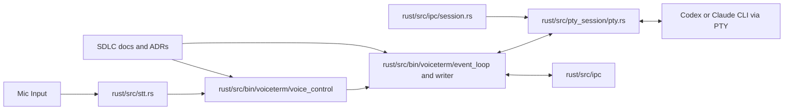

# Engineering Evolution and SDLC Timeline

<!-- markdownlint-disable MD024 -->

**Status:** Draft v4 (historical design and process record)  
**Audience:** users and developers  
**Last Updated:** 2026-03-01

## At a Glance

VoiceTerm is a voice-first HUD overlay for AI CLIs, with primary support for Codex and Claude. It keeps terminal-native workflows and adds better voice input, feedback, and controls.

What makes this hard: VoiceTerm must keep PTY correctness, HUD responsiveness, STT latency trust, and fast release cycles aligned in one local runtime.

**What this repo demonstrates:**

- Architecture growth from MVP assumptions to Rust-first runtime control.
- Reliability growth from reactive fixes to CI guardrails and safe rollback.
- Process growth from ad-hoc iteration to ADR-backed decisions and repeatable checks.

**Key docs to cross-reference:**

- `dev/active/MASTER_PLAN.md`
- `dev/ARCHITECTURE.md`
- `dev/DEVELOPMENT.md`
- `dev/CHANGELOG.md`
- `dev/adr/README.md`

**Appendix quick pointers:**

- ADR crosswalk: [Appendix B](#appendix-b-adr-crosswalk)
- Naming timeline: [Appendix E](#appendix-e-naming-timeline)

## Reader Paths

- [Quick Read (2 min)](#quick-read-2-min)
- [User Path (5 min)](#user-path-5-min)
- [Developer Path (15 min)](#developer-path-15-min)

## Term Quick Reference

- PTY: pseudo-terminal session used to keep CLI context alive.
- STT: speech-to-text processing.
- VAD: voice activity detection for start/stop capture behavior.
- HUD: terminal overlay that shows voice state, controls, and metrics.

## Audit Snapshot (Repo-Verified on 2026-02-17)

Fact: Repository history and tags in this document were re-checked against local git state.

Evidence:

- Commit count and HEAD/date check: `git rev-list --count HEAD`, `git rev-parse --short HEAD`, `git show -s --format='%ad' --date=short HEAD`
- First commit check: `git rev-list --max-parents=0 HEAD`, `git show -s --format='%h %ad %s' --date=short <first-hash>`
- Tag span/count check: `git tag --sort=creatordate | head -n 1`, `git tag --sort=creatordate | tail -n 1`, `git tag --sort=creatordate | wc -l`
- Evidence hash validity check: `git rev-parse --verify <hash>^{commit}`

Fact: This audit confirms:

- First commit is `8aef111` on 2025-11-06.
- Drafting HEAD is `fd0a5c6` on 2026-02-17.
- Tag range is `v0.2.0` to `v1.0.79` with 80 tags.
- All commit hashes cited in this document resolve.
- This timeline includes committed git history only; in-progress working-tree changes (including near-`v1.0.80` scope) are intentionally excluded until commit/tag.

## Scope and Evidence Model

Fact: This timeline covers commit history from `8aef111` (2025-11-06) through `fd0a5c6` (2026-02-17).

Fact: The source range includes 357 commits and tags from `v0.2.0` through `v1.0.79`.

Evidence:

- Original plan: `8aef111:docs/plan.md`
- Architecture docs: `dev/ARCHITECTURE.md`
- ADR index and records: `dev/adr/README.md`, `dev/adr/0001-*.md` through `dev/adr/0023-*.md`
- Release history: `dev/CHANGELOG.md`, git tags
- Full history replay: `git log --reverse`

Fact: Claims in this document follow three labels.

- Fact: Backed by commit hash, ADR, tag, or repo path.
- Inference: Interpretation from facts; not a direct measurement.
- Evidence: Explicit anchor(s) for validation.

## Quick Read (2 min)

Fact: The project moved from an MVP-style plan to production-oriented architecture under real runtime pressure.

Evidence: `8aef111`, `dev/ARCHITECTURE.md`, `39b36e4`, `b6987f5`.

Fact: Decision quality improved once governance became explicit.

Evidence: `b6987f5`, `7f9f585`, `fe48120`, `dev/adr/README.md`.

Fact: Reliability work includes visible rollback discipline, not just feature growth.

Evidence: `c9106de`, `6cb1964`, `fe48120`.

Fact: The team added CI protection for latency and voice-mode behavior.

Evidence: `fe6d79a`, `b60ebc3`.

Fact: Release flow became explicit and traceable.

Evidence: `695b652`, `50f2738`, `05ff790`, `dev/DEVELOPMENT.md`.

Inference: This repo shows full-lifecycle engineering work: runtime design, incident response, governance, and release operations.

## User Path (5 min)

Fact: User-facing quality improved in four waves.

- Era 1: Core voice-to-CLI loop became usable, then stabilized after early PTY and loop fixes.
- Era 2: Install and startup behavior became predictable across common environments.
- Era 3: HUD controls, queueing behavior, and release/install tooling matured quickly.
- Era 4: Heavy-output responsiveness, latency trust semantics, and terminal compatibility were hardened.

Evidence: `55a9c5e`, `39b36e4`, `6fec195`, `c6151d5`, `2ce6fa2`, `d823121`, `c172d9a`, `6741517`, `07b2f90`, `67873d8`, `fe6d79a`, `fe48120`.

Fact: Release cadence was high, but behavior regression handling was explicit.

Evidence: `19371b6`, `6cb1964`, `fe48120`, tags `v1.0.51` to `v1.0.79`.

### HUD Visuals (Current UI)

Inference: These screenshots improve readability for users. They show current UI state, not a historical timeline.


## Developer Path (15 min)

### Where to Look First

- Planning and active scope: `dev/active/MASTER_PLAN.md`
- Architecture and lifecycle: `dev/ARCHITECTURE.md`
- Verification workflow: `dev/DEVELOPMENT.md`
- Decision records: `dev/adr/README.md`
- Latency display logic path: `rust/src/bin/voiceterm/voice_control/drain/message_processing.rs`

### Developer Fast Start

1. Read `Evolution at a Glance`, then scan the era sections for context.
2. Use `Where to Inspect in Repo` blocks to jump to code.
3. Run replay commands below to validate claims from git history.

### Use This During Development

1. Find the era closest to your change scope.
2. Re-check its `Pressure` and `Learning` bullets before coding.
3. Verify you are not reintroducing a previously reverted pattern.
4. Add new evidence (commit, ADR, or docs path) when behavior changes.
5. If SDLC/tooling/CI governance surfaces change (`AGENTS.md`, workflow YAMLs, `dev/scripts/*`, release mechanics), update this file in the same change (`devctl docs-check --strict-tooling` enforces this).

### Recent Governance Update (2026-03-01, v1.0.98 Release Gate Alignment)

Fact: Release `v1.0.98` execution now tracks the stricter docs-governance path
end-to-end: release metadata prep, changelog + active-plan sync, and mandatory
user-facing docs updates before tag/publish gates pass.

Evidence:

- `dev/scripts/devctl/commands/release_prep.py` (release metadata prep for
  version/changelog/master-plan snapshot updates)
- `dev/CHANGELOG.md` (`1.0.98` entry includes JetBrains+Claude HUD rendering
  fixes and release notes)
- `dev/active/MASTER_PLAN.md` (`MP-226` follow-up evidence updated in active
  tracker)
- `guides/TROUBLESHOOTING.md` (user-facing JetBrains+Claude prompt-text
  troubleshooting guidance added)

Inference: Release runs now fail fast when governance/docs evidence is
incomplete, which keeps runtime hotfix releases and user guidance synchronized.

### Recent Governance Update (2026-02-25, Ralph Fix Policy + Escalation)

Fact: CodeRabbit Ralph loop fix execution now mirrors mutation-loop policy
gates, and exhausted unresolved loops now publish a dedicated review-escalation
comment path.

Evidence:

- `dev/scripts/devctl/triage_loop_policy.py` (policy evaluation for
  `AUTONOMY_MODE`, branch allowlist, and fix-command prefix allowlist with
  `TRIAGE_LOOP_ALLOWED_PREFIXES` override)
- `dev/config/control_plane_policy.json` (`triage_loop.allowed_fix_command_prefixes`)
- `dev/scripts/devctl/commands/triage_loop.py` (policy wiring +
  `fix_block_reason` propagation + escalation publish path)
- `dev/scripts/devctl/triage_loop_support.py` (separate escalation marker and
  idempotent escalation upsert helper)
- `dev/scripts/checks/coderabbit_ralph_loop_core.py` (`fix_command_policy_blocked`
  handling and `escalation_needed=true` on max-attempt exhaustion)
- `.github/workflows/coderabbit_ralph_loop.yml` (workflow env wiring for
  `AUTONOMY_MODE` and `TRIAGE_LOOP_ALLOWED_PREFIXES`, plus bounded default fix
  command for workflow-run trigger path)

Inference: The Ralph loop now has the same bounded, policy-first write posture
as mutation automation, and unresolved retry exhaustion creates an explicit,
auditable reviewer handoff instead of silent failure.

### Recent Governance Update (2026-02-25, Naming Cohesion + Policy Dedup)

Fact: The guarded plan-scoped swarm command surface is now consistently exposed
as `swarm_run` in active workflow/operator paths, and duplicated loop
fix-policy logic was consolidated into one shared engine.

Evidence:

- `.github/workflows/autonomy_run.yml` (workflow now executes
  `python3 dev/scripts/devctl.py swarm_run` and publishes `swarm-run` artifacts)
- `.github/workflows/README.md`, `AGENTS.md`, `dev/ARCHITECTURE.md`,
  `dev/DEVELOPMENT.md`, `dev/active/MASTER_PLAN.md`,
  `dev/active/autonomous_control_plane.md` (active command references aligned
  to `swarm_run`, with historical pre-rename evidence explicitly labeled)
- `dev/scripts/devctl/loop_fix_policy.py` (shared fix-policy parser/allowlist
  engine)
- `dev/scripts/devctl/triage_loop_policy.py`,
  `dev/scripts/devctl/mutation_loop_policy.py` (thin wrappers over shared
  engine)
- `dev/scripts/devctl/tests/test_triage_loop_policy.py`,
  `dev/scripts/devctl/tests/test_mutation_loop_policy.py` (policy behavior
  coverage across both loop wrappers)
- `dev/active/naming_api_cohesion.md` (`MP-267` inventory/progress/evidence
  updates for naming + duplicate-helper cleanup)

Inference: Command naming drift in active operator paths is reduced, and future
policy hardening changes can land once in the shared engine instead of diverging
across triage/mutation loop implementations.

### Recent Governance Update (2026-02-25, CI Compatibility Hotfixes)

Fact: Post-push CI compatibility issues were resolved for workflow linting,
latency guard workspace detection, and strict tooling triage preflight checks.

Evidence:

- `.github/workflows/publish_release_binaries.yml` (runner label updated to
  actionlint-supported `macos-15-intel` for darwin/amd64)
- `dev/scripts/tests/measure_latency.sh` (`rust/` workspace detection with
  legacy `src/` fallback)
- `dev/scripts/devctl/commands/triage.py` (explicit `--cihub` opt-in now keeps
  capability probing even when PATH lookup misses the binary)
- `AGENTS.md`, `dev/DEVELOPMENT.md`, `dev/scripts/README.md`,
  `dev/active/MASTER_PLAN.md` (maintainer/governance documentation synced with
  this tooling/CI behavior change)

Inference: CI lanes now stay portable across hosted-runner label catalog
changes and mixed workspace-layout branches without manual rerun-only fixes.

### Recent Governance Update (2026-02-27, Prompt-Occlusion Runtime Cohesion)

Fact: Prompt-occlusion suppression transitions are now centralized under one
event-loop runtime module so output detection, input resolution, and timeout
clear paths share a single side-effect owner.

Evidence:

- `rust/src/bin/voiceterm/event_loop/prompt_occlusion.rs` (shared suppression
  apply/sync/resolve/clear helpers)
- `rust/src/bin/voiceterm/event_loop/output_dispatch.rs` (output-driven
  suppression flow now routed through shared controller)
- `rust/src/bin/voiceterm/event_loop/input_dispatch.rs` (input-side resolve and
  Enter clear paths now routed through shared controller)
- `rust/src/bin/voiceterm/event_loop/periodic_tasks.rs` (timeout clear now uses
  explicit clear-only reconciliation helper)
- `dev/active/MASTER_PLAN.md`, `dev/active/naming_api_cohesion.md`
  (`MP-267` progress/evidence traceability updates)

Inference: Backend/terminal-specific suppression behavior is less likely to
drift across dispatch paths because state transitions are no longer duplicated
in multiple event-loop files.

### Recent Governance Update (2026-02-27, Reports Retention Control Plane)

Fact: `devctl` now has a dedicated reports-retention cleanup command and
automatic hygiene warnings for stale report artifact growth.

Evidence:

- `dev/scripts/devctl/reports_retention.py` (shared retention planner with
  managed-root allowlist, protected-path exclusions, and reclaim estimation)
- `dev/scripts/devctl/commands/reports_cleanup.py` (`reports-cleanup` command
  with dry-run preview and confirmation/`--yes` deletion path)
- `dev/scripts/devctl/reports_cleanup_parser.py`, `dev/scripts/devctl/cli.py`,
  `dev/scripts/devctl/commands/listing.py` (CLI/parser/command inventory
  wiring)
- `dev/scripts/devctl/commands/hygiene.py` (always-on stale report drift
  warnings in hygiene output)
- `dev/scripts/devctl/tests/test_reports_cleanup.py`,
  `dev/scripts/devctl/tests/test_hygiene.py` (parser/retention/delete and
  hygiene-warning regression coverage)
- `dev/scripts/README.md`, `dev/DEVCTL_AUTOGUIDE.md`,
  `dev/active/MASTER_PLAN.md` (`MP-306` execution/docs traceability)

Inference: Report cleanup no longer depends on maintainer memory; routine
`hygiene` runs surface stale growth early, and cleanup remains guarded by
retention policy plus explicit delete confirmation.

### Recent Governance Update (2026-02-25, Release Attestation + Scorecard Workflow Stability)

Fact: Release-post workflow failures were remediated by correcting GitHub-owned
action pins and tightening scorecard permission scope to the least-privilege
shape required by OpenSSF result publishing.

Evidence:

- `.github/workflows/release_attestation.yml` (`actions/attest-build-provenance`
  pin refreshed to a valid 40-character GitHub-owned SHA)
- `.github/workflows/scorecard.yml` (`github/codeql-action/upload-sarif` pin
  refreshed to a valid SHA; workflow-level permissions reduced to read-only;
  `id-token: write` and `security-events: write` scoped to the `analysis` job)
- `AGENTS.md`, `dev/DEVELOPMENT.md`, `dev/scripts/README.md`,
  `dev/active/MASTER_PLAN.md` (maintainer guidance synced with this workflow
  stability fix)

Inference: Release publication and security-posture telemetry lanes now fail
less on policy/pin drift and are easier to keep green during hotfix pushes.

### Recent Governance Update (2026-02-19)

Fact: The active planning model was expanded to include a hardened Memory Studio
track with explicit isolation, compaction validation, acceleration
non-inferiority, and symbolic-compaction reversibility gates.

Evidence:

- `dev/active/MASTER_PLAN.md` (Memory scope extended through `MP-255`)
- `dev/active/memory_studio.md` (added `MS-G14 Isolation`, `MS-G15 Compaction`,
  `MS-G16 Acceleration`, `MS-G17 Symbolic`, execution-isolation profiles,
  compaction A/B evaluation protocol, ZGraph-inspired symbolic compaction audit
  constraints, and Apple Silicon acceleration benchmarking policy)

Inference: Governance focus shifted from "add memory features" to
"prove safety and measurable quality gains before default-on behavior."

### Recent Governance Update (2026-02-20)

Fact: Theme Studio prerequisite planning gates were advanced in the canonical
tracker by marking `MP-175`, `MP-176`, `MP-179`, `MP-180`, and `MP-182` as
completed with implementation evidence.

Evidence:

- `dev/active/MASTER_PLAN.md` (`MP-175`, `MP-176`, `MP-179`, `MP-180`,
  `MP-182` status and gate-evidence notes)
- `rust/src/bin/voiceterm/theme/capability_matrix.rs`
- `rust/src/bin/voiceterm/theme/texture_profile.rs`
- `rust/src/bin/voiceterm/theme/dependency_baseline.rs`
- `rust/src/bin/voiceterm/theme/widget_pack.rs`
- `rust/src/bin/voiceterm/theme/rule_profile.rs`

Inference: The Theme Studio track moved from prerequisite definition to
evidence-backed gate completion, reducing release risk for future Studio
surface migration work.

### Recent Governance Update (2026-02-20, Release Automation)

Fact: Release publication now has a dedicated PyPI distribution lane in GitHub
Actions so published GitHub releases trigger automated PyPI upload for matching
`vX.Y.Z` tags.

Evidence:

- `.github/workflows/publish_pypi.yml` (triggered by `release: published`)
- `dev/scripts/publish-pypi.sh` (non-interactive upload flow)
- `dev/DEVELOPMENT.md` and `dev/scripts/README.md` (release steps updated for
  workflow-first publish path and manual fallback)
- `AGENTS.md` (Release SOP + CI lane mapping updated for `publish_pypi.yml`)
- `dev/active/MASTER_PLAN.md` (`MP-258`)

Inference: Release process now keeps one canonical control plane (`devctl`) but
moves credentialed distribution execution into CI to reduce manual release
friction and repeated local secret handling.

### Recent Governance Update (2026-02-23, Release Automation Hardening)

Fact: Release distribution automation was hardened with a dedicated release
preflight workflow, a Homebrew publish workflow path, and additional guardrails
in `devctl ship`/Homebrew scripting to fail early on version mismatch and bad
tarball downloads.

Evidence:
- `.github/workflows/release_preflight.yml` (manual release gate bundle with
  parity validation + governance checks + distribution dry-run smoke)
- `.github/workflows/publish_homebrew.yml` (triggered by `release: published`
  and `workflow_dispatch`; routes Homebrew updates through `devctl ship`)
- `dev/scripts/devctl/commands/ship.py` (release parity enforcement before
  `pypi`/`homebrew` steps)
- `dev/scripts/update-homebrew.sh` (fail-fast tarball download + archive
  validity check, cross-platform in-place edits, and CI-safe git identity)
- `AGENTS.md`, `dev/DEVELOPMENT.md`, and `dev/scripts/README.md` (release SOP
  and workflow routing updates)
- `dev/active/MASTER_PLAN.md` (`MP-283`)

Inference: The release path remains centered on one control plane (`devctl`)
while reducing publish-time drift risk between requested tag versions,
repository metadata, and downstream Homebrew formula updates.

### Recent Governance Update (2026-02-25, Desktop Operator Surface)

Fact: A new optional PySide6 desktop command-center scaffold was added as an
`MP-340` partial milestone so operators can run and visualize control-plane
commands from a modular tabbed UI while keeping the Rust overlay as runtime
primary.

Evidence:

- `app/pyside6/README.md`
- `app/pyside6/run.py`
- `app/pyside6/voiceterm_command_center/main.py`
- `app/pyside6/voiceterm_command_center/command_catalog.py`
- `app/pyside6/voiceterm_command_center/runner.py`
- `app/pyside6/voiceterm_command_center/tabs/*`
- `dev/active/autonomous_control_plane.md` (Progress Log update)
- `dev/active/MASTER_PLAN.md` (`MP-340` partial note)

Inference: The control-plane strategy now has a concrete desktop implementation
path (PySide6) over existing `devctl`/workflow guardrails, reducing reliance on
ad-hoc terminal-only orchestration for operator flows.

### Recent Governance Update (2026-02-25, Data Science Telemetry Workspace)

Fact: `devctl` now maintains a rolling data-science snapshot so every command
run contributes to measurable productivity and agent-sizing analytics.

Evidence:

- `data_science/README.md`
- `dev/scripts/devctl/data_science_metrics.py`
- `dev/scripts/devctl/commands/data_science.py`
- `dev/scripts/devctl/cli.py` (post-command auto-refresh hook)
- `dev/scripts/devctl/tests/test_data_science.py`
- `dev/scripts/README.md`, `dev/DEVCTL_AUTOGUIDE.md`, `AGENTS.md`
- `dev/active/MASTER_PLAN.md` (`MP-345`)

Inference: The repo now has an always-on, reproducible telemetry loop for
command throughput, success/latency, and swarm-size recommendation scoring,
which reduces ad-hoc "what agent count should we use?" decisions.

### Recent Governance Update (2026-02-25, Workflow Readability Pass)

Fact: Workflow documentation now follows a plain-language format so maintainers
can quickly understand each CI lane without reading full YAML files.

Evidence:

- `.github/workflows/README.md` (one simple guide for every workflow, including
  what it does, when it runs, and first local reproduce commands)
- `.github/workflows/*.yml` (short `Purpose` and `Details` header comments at
  the top of every workflow file)
- `dev/active/MASTER_PLAN.md` (`MP-257` progress note for this readability
  slice)

Inference: This lowers onboarding/debug friction for CI changes and makes
workflow intent obvious at file-open time.

### Recent Governance Update (2026-02-25, Core Dev Docs Plain-Language Pass)

Fact: Core developer entry docs were rewritten in simpler language while
keeping command-level accuracy and policy behavior unchanged.

Evidence:

- `dev/README.md` (simplified active-doc discovery wording)
- `dev/DEVELOPMENT.md` (simplified check-routing and Ralph loop explanations)
- `dev/ARCHITECTURE.md` (simplified operational workflow, loop, and release
  operations language)
- `dev/active/MASTER_PLAN.md` (`MP-257` progress update for this slice)

Inference: New contributors can now find the right commands faster, and
maintainers can scan workflow intent without policy-heavy phrasing.

### Recent Governance Update (2026-02-25, Runtime Hardening Audit Follow-Up)

Fact: Runtime hardening follow-up work for `MP-341` landed additional guard
stability around terminal resize handling, Theme Studio fallback safety, and
writer-queue anomaly diagnostics, while keeping CI/runtime bundles green.

Evidence:

- `rust/src/bin/voiceterm/terminal.rs` (SIGWINCH install path moved from
  `signal()` to `sigaction` + `SA_RESTART`)
- `rust/src/bin/voiceterm/event_loop/overlay_dispatch.rs` (non-home Theme
  Studio branch uses safe fallback text instead of production `unreachable!`)
- `rust/src/bin/voiceterm/event_loop/output_dispatch.rs`,
  `rust/src/bin/voiceterm/event_loop.rs` (unexpected writer-queue variants now
  emit explicit diagnostics)
- `rust/src/bin/voiceterm/event_loop/dev_panel_commands.rs`,
  `rust/src/bin/voiceterm/event_loop/tests.rs` (auto-send runtime guard cached
  once, with test override path removing unsafe env-mutation test usage)
- `dev/active/MASTER_PLAN.md` (`MP-341` partial evidence update)
- `dev/CHANGELOG.md`, `guides/TROUBLESHOOTING.md` (user-facing runtime
  hardening notes and fallback troubleshooting path)

Inference: The audit follow-up reduces panic/silent-drop risk in hot runtime
paths and tightens signal portability without weakening governance checks.

### Recent Governance Update (2026-02-25, Swarm Run Feedback + Naming Cohesion)

Fact: guarded plan-scoped swarm execution now uses canonical command name
`devctl swarm_run` (no legacy alias), and the command supports a closed-loop
feedback controller for continuous runs so swarm size can downshift on repeated
no-signal/stall cycles and upshift on repeated improvement cycles without
manual agent-count tuning.

Evidence:

- `dev/scripts/devctl/autonomy_run_feedback.py` (cycle metrics extraction from
  worker `autonomy-loop` reports, streak tracking, downshift/upshift decisions)
- `dev/scripts/devctl/commands/autonomy_run.py` (feedback-state wiring, cycle
  agent override forwarding, report payload integration)
- `dev/scripts/devctl/autonomy_run_parser.py` (`--feedback-*` control flags)
- `dev/scripts/devctl/autonomy_run_helpers.py` (per-cycle `--agents` override
  support)
- `dev/scripts/devctl/tests/test_autonomy_run_feedback.py`,
  `dev/scripts/devctl/tests/test_autonomy_run.py` (config + behavior coverage)
- `dev/scripts/README.md`, `dev/DEVCTL_AUTOGUIDE.md` (operator-facing usage
  updates)
- `dev/active/naming_api_cohesion.md`, `dev/active/INDEX.md`,
  `dev/active/MASTER_PLAN.md` (`MP-267` execution-plan traceability kickoff)

Inference: Continuous swarm runs can now tune throughput/cost using real cycle
outcomes instead of static one-shot sizing, and naming/API cohesion work now
runs through an explicit active-plan checklist instead of ad-hoc cleanup.

### Recent Governance Update (2026-02-24, External Federation Bridge)

Fact: `codex-voice` now tracks `code-link-ide` and `ci-cd-hub` as pinned
integration links under `integrations/`, with a one-command sync helper and a
documented selective-import governance workflow.

Evidence:

- `.gitmodules` (`integrations/code-link-ide`, `integrations/ci-cd-hub`)
- `dev/scripts/sync_external_integrations.sh`
- `dev/scripts/devctl/commands/integrations_sync.py`
- `dev/scripts/devctl/commands/integrations_import.py`
- `dev/config/control_plane_policy.json` (`integration_federation`)
- `dev/integrations/EXTERNAL_REPOS.md`
- `dev/active/autonomous_control_plane.md` (`Phase 5 - External Repo Federation Bridge`)
- `dev/active/MASTER_PLAN.md` (`MP-334`)

Inference: Cross-repo reuse moved from ad-hoc cloning to an auditable,
version-pinned federation model that supports template extraction work without
memory-only coordination.

### Recent Governance Update (2026-02-24, Audit Remediation Pass)

Fact: A focused post-audit remediation pass resolved the latest high-severity
runtime/tooling findings and tightened regression coverage in shared `devctl`
helpers.

Evidence:

- `rust/src/bin/voiceterm/prompt/claude_prompt_detect.rs` (context buffer uses
  `VecDeque` and removes O(n) `remove(0)` in prompt-detection hot path)
- `rust/src/bin/voiceterm/transcript/delivery.rs` (merge loop now enforces the
  `front`/`pop_front` invariant without dead-branch logic)
- `rust/src/bin/voiceterm/persistent_config.rs` (helper-based deduplication for
  config serialization/apply flow)
- `rust/src/bin/voiceterm/buttons.rs` (test-only dispatch invariant now uses
  `unreachable!` semantics)
- `dev/scripts/devctl/commands/ship_common.py` (TOML-backed version reads with
  Python 3.10 fallback parser)
- `dev/scripts/devctl/commands/check.py` and
  `dev/scripts/devctl/commands/triage.py` (UTC report timestamps)
- `dev/scripts/devctl/tests/test_common.py`,
  `dev/scripts/devctl/tests/test_loop_comment.py`,
  `dev/scripts/devctl/tests/test_ship.py` (new failure-path coverage)

Inference: The remediation pass reduced hidden failure modes in core loop
tooling while improving determinism for release/report pipelines and preserving
strict gate compatibility (`devctl check --profile ci`).

### Recent Governance Update (2026-02-24, Loop Model Docs Clarification)

Fact: Core maintainer docs now explicitly describe the custom repo-owned
Ralph/Wiggum loop implementation and how federated internal repos are consumed
through controlled import rather than direct runtime execution.

Evidence:

- `dev/ARCHITECTURE.md` (new custom-loop architecture section with simple flow
  charts for loop execution and federated import path)
- `dev/DEVELOPMENT.md` (new operator-focused Ralph/Wiggum model section and
  federated-repo wording updates)
- `AGENTS.md` and `dev/scripts/README.md` (terminology alignment for federated
  source pins/import commands)
- `dev/active/MASTER_PLAN.md` (status-snapshot note for documentation
  clarification)
- `dev/integrations/EXTERNAL_REPOS.md` (federated internal repository framing)

Inference: Loop ownership and source-of-truth boundaries are now clearer for
operators and agents, reducing ambiguity between first-party runtime logic and
federated pattern sources.

### Recent Governance Update (2026-02-24, Loop-to-Chat Coordination Runbook)

Fact: Active-plan governance now includes a dedicated loop-output-to-chat
runbook so operator handoffs and loop suggestion decisions are tracked in a
single append-only active doc.

Evidence:

- `dev/active/loop_chat_bridge.md` (new runbook with execution checklist,
  progress log, and audit evidence sections)
- `dev/active/INDEX.md` (registry entry for `loop_chat_bridge.md`, scope
  `MP-338`)
- `dev/active/MASTER_PLAN.md` (`MP-338` and canonical rule/reference updates)
- `AGENTS.md`, `DEV_INDEX.md`, `dev/README.md` (discovery-link routing updates)
- `dev/DEVELOPMENT.md`, `dev/scripts/README.md` (maintainer workflow updates
  for loop handoff evidence)

Inference: Loop guidance can now flow through a visible, auditable markdown
channel instead of ad-hoc chat-only coordination, which reduces decision drift
before enabling higher-autonomy execution.

### Recent Governance Update (2026-02-24, Guarded Plan-Scoped Swarm Pipeline)

Fact: `devctl` now includes a guarded `autonomy-run` command that executes one
plan-scoped swarm pipeline end-to-end: plan-scope load, next-step prompt
derivation, swarm+reviewer execution, governance checks, and plan-doc evidence
append.

Evidence:

- `.github/workflows/autonomy_run.yml`
- `dev/scripts/devctl/commands/autonomy_run.py`
- `dev/scripts/devctl/autonomy_run_parser.py`
- `dev/scripts/devctl/autonomy_run_helpers.py`
- `dev/scripts/devctl/autonomy_run_render.py`
- `dev/scripts/devctl/tests/test_autonomy_run.py`
- `dev/scripts/mutants.py` (shape-budget compaction to restore local
  `check_code_shape` pass state in dirty-tree sessions)
- `AGENTS.md`, `dev/scripts/README.md`, `dev/DEVELOPMENT.md`,
  `dev/ARCHITECTURE.md` (command inventory/workflow contract updates)
- `dev/active/autonomous_control_plane.md`, `dev/active/MASTER_PLAN.md`
  (`MP-338` partial evidence extension)

Inference: The autonomy control plane now has a single guarded operator path
for swarm execution that reduces manual orchestration glue and keeps plan-state
traceability embedded in the run itself.

### Recent Governance Update (2026-02-24, Rust Guardrail Tightening)

Fact: Rust guard scripts were tightened after the `src/` to `rust/` workspace
migration audit to prevent silent check bypass and enforce stricter memory-safety
policy for changed Rust files.

Evidence:

- `dev/scripts/checks/check_rust_audit_patterns.py` (active source-root discovery
  with `rust/src` priority and fail-fast behavior when no Rust files are found)
- `dev/scripts/checks/check_rust_security_footguns.py` (rename-aware baseline
  mapping via `git_change_paths.py` to avoid rename-only false positives)
- `dev/scripts/checks/check_rust_best_practices.py` (new non-regressive
  `std::mem::forget`/`mem::forget` growth guard)
- `dev/scripts/devctl/tests/test_check_rust_best_practices.py`,
  `dev/scripts/devctl/tests/test_check_rust_audit_patterns.py`,
  `dev/scripts/devctl/tests/test_check_rust_security_footguns.py`
- `AGENTS.md`, `dev/DEVELOPMENT.md`, `dev/scripts/README.md` (policy/docs
  wording updated for the tightened best-practices guard)
- `dev/active/rust_workspace_layout_migration.md`, `dev/active/MASTER_PLAN.md`
  (`MP-339` follow-up evidence and scope notes)

Inference: The post-migration toolchain now fails louder when Rust source paths
drift and blocks additional `mem::forget` debt in touched Rust files, reducing
the chance of hidden safety regressions slipping through rename-heavy changes.

### Recent Governance Update (2026-02-24, Strict Remote Release Gates in `devctl check`)

Fact: `devctl check --profile release` now enforces strict remote release
verification instead of local-only checks. The release profile now requires
GitHub CI status reachability and strict CodeRabbit/Ralph gate success.

Evidence:

- `dev/scripts/devctl/commands/check.py` (adds release-only
  `ci-status-gate`, `coderabbit-release-gate`, and
  `coderabbit-ralph-release-gate`)
- `dev/scripts/devctl/commands/check_profile.py` (adds
  `with_ci_release_gate` to release profile wiring)
- `dev/scripts/devctl/commands/check_progress.py` (progress accounting for new
  release gates)
- `dev/scripts/devctl/tests/test_check.py` (release-profile and progress tests
  updated for strict-gate steps)
- `AGENTS.md`, `dev/DEVELOPMENT.md`, `dev/scripts/README.md`,
  `dev/DEVCTL_AUTOGUIDE.md`, `dev/active/MASTER_PLAN.md` (release-lane docs
  updated to reflect strict remote gate behavior)

Inference: Maintainers now get deterministic local release-fail behavior when
remote CI/workflow health is broken, preventing false "green local release"
signals before push/tag.

### Recent Governance Update (2026-02-20, Coverage Automation)

Fact: Coverage publication is now automated through a dedicated CI lane that
generates Rust LCOV output and uploads to Codecov on push/PR events that touch
runtime sources, enabling the README coverage badge to track current reports
instead of remaining `unknown`.

Evidence:

- `.github/workflows/coverage.yml` (stable toolchain + `llvm-tools-preview`,
  `cargo llvm-cov --workspace --all-features --lcov`, artifact upload, and
  `codecov/codecov-action@v5` upload with `use_oidc: true`)
- `README.md` (existing Codecov badge target)
- `AGENTS.md` (CI lane mapping + workflow reference updated with `coverage.yml`)
- `dev/DEVELOPMENT.md` (CI/CD workflow table updated with coverage lane)
- `dev/active/MASTER_PLAN.md` (`MP-259`)

Inference: Coverage reporting moved from badge-only intent to enforceable CI
execution, reducing drift between advertised coverage status and actual upload
activity.

### Recent Governance Update (2026-02-23, Devctl Refactor Hardening)

Fact: `devctl` internals were refactored into shared helper modules to reduce
duplicate process parsing/report rendering and to prevent command drift.
Command execution now returns structured failures when required binaries are
missing, instead of uncaught Python exceptions.

Evidence:

- `dev/scripts/devctl/process_sweep.py`
- `dev/scripts/devctl/status_report.py`
- `dev/scripts/devctl/commands/hygiene_audits.py`
- `dev/scripts/devctl/commands/ship_common.py`
- `dev/scripts/devctl/commands/ship_steps.py`
- `dev/scripts/devctl/common.py`
- `dev/scripts/devctl/tests/test_check.py`
- `dev/scripts/devctl/tests/test_hygiene.py`
- `dev/scripts/devctl/tests/test_report.py`
- `dev/scripts/devctl/tests/test_ship.py`
- `dev/scripts/devctl/tests/test_status.py`
- `dev/active/MASTER_PLAN.md` (`MP-292`)

Inference: The tooling control plane is now easier to maintain because repeated
logic has one shared implementation path with direct regression coverage.

### Recent Governance Update (2026-02-23, Devctl Security Gate)

Fact: `devctl` now has a dedicated `security` command so maintainers can run a
local security gate that mirrors RustSec policy enforcement used in CI, with
an optional strict workflow-scanner path for `zizmor`.

Evidence:

- `dev/scripts/devctl/commands/security.py`
- `dev/scripts/devctl/cli.py`
- `dev/scripts/devctl/security_parser.py`
- `dev/scripts/devctl/commands/listing.py`
- `dev/scripts/devctl/tests/test_security.py`
- `dev/scripts/devctl/process_sweep.py` (plain-language process-sweep context
  expanded for interrupted/stalled test cleanup rationale)
- `AGENTS.md`
- `dev/DEVELOPMENT.md`
- `dev/scripts/README.md`
- `dev/active/MASTER_PLAN.md` (`MP-293`)

Inference: Security validation is now easier to run consistently in local
maintainer workflows, while still allowing stricter optional-tool enforcement
when teams want parity with heavier workflow scanning.

### Recent Governance Update (2026-02-23, Devctl UX/Perf Intake)

Fact: Maintainer review findings for `devctl` were converted into tracked
execution scope in `MASTER_PLAN` so follow-up work lands in short, verifiable
slices rather than ad-hoc command-level edits.

Evidence:

- `dev/active/MASTER_PLAN.md` (`MP-297`, `MP-298`)

Inference: Tooling hardening now has explicit sequencing and traceability for
both UX-facing and performance-facing follow-up changes.

### Recent Governance Update (2026-02-23, Devctl Failure Diagnostics Slice)

Fact: The first `devctl` usability hardening slice (`MP-297 #5`) landed.
`run_cmd` now streams subprocess output while retaining bounded failure excerpts
for non-zero exits, `devctl check` prints explicit failed-step summaries, and
markdown check reports now include a dedicated failure-output section.

Evidence:

- `dev/scripts/devctl/common.py` (live output + bounded failure excerpt capture)
- `dev/scripts/devctl/commands/check.py` (failed-step summary emission)
- `dev/scripts/devctl/steps.py` (markdown failure-output section)
- `dev/scripts/devctl/tests/test_common.py` (new runner/report diagnostics tests)
- `dev/scripts/README.md` (shared runner behavior note)
- `dev/active/MASTER_PLAN.md` (`MP-297` slice status/evidence)

Inference: Maintainers can now diagnose failed `check` steps directly from one
run/report path instead of rerunning commands solely to recover error context.

### Recent Governance Update (2026-02-23, Devctl Check Parallelism Slice)

Fact: The second `devctl` usability/performance slice (`MP-297 #1`) landed.
`devctl check` now runs independent setup gates (`fmt`, `clippy`, AI guard
scripts) and the test/build phase in deterministic parallel batches while
preserving declared report order and fail-fast boundaries between phases.
Maintainers can opt out with `--no-parallel` or tune workers with
`--parallel-workers`.

Evidence:

- `dev/scripts/devctl/commands/check.py` (parallel batch runner + ordered aggregation)
- `dev/scripts/devctl/cli.py` (`--no-parallel`, `--parallel-workers`)
- `dev/scripts/devctl/tests/test_check.py` (parallel-path + ordering coverage)
- `dev/scripts/README.md` (`check` command behavior/flag docs)
- `dev/active/MASTER_PLAN.md` (`MP-297` slice status/evidence)

Inference: Baseline `check` runs now reduce avoidable wall-clock idle while
keeping deterministic reporting and explicit maintainer escape hatches when
local resource constraints require sequential execution.

### Recent Governance Update (2026-02-23, Devctl Release Metadata Prep)

Fact: `devctl` release tooling now supports automated metadata preparation via
`--prepare-release` so maintainers can update Cargo/PyPI/app-plist versions and
roll changelog release headings in one control-plane step before verify/tag.

Evidence:

- `dev/scripts/devctl/cli.py` (`ship`/`release` parser wiring)
- `dev/scripts/devctl/commands/release.py` (legacy release wrapper passthrough)
- `dev/scripts/devctl/commands/ship.py` (step selection includes prepare step)
- `dev/scripts/devctl/commands/release_prep.py` (metadata/changelog updaters)
- `dev/scripts/devctl/commands/ship_steps.py` (`prepare-release` handler)
- `dev/scripts/devctl/tests/test_ship.py`
- `dev/scripts/devctl/tests/test_release_prep.py`
- `AGENTS.md`
- `dev/DEVELOPMENT.md`
- `dev/scripts/README.md`
- `dev/active/MASTER_PLAN.md` (`MP-303`)

Inference: Release preparation now has fewer manual edit points and lower drift
risk between versioned metadata files, while keeping existing verification and
publishing gates unchanged.

### Recent Governance Update (2026-02-23, Master Plan Snapshot Freshness Guard)

Fact: Release-governance tooling now keeps `dev/active/MASTER_PLAN.md` Status
Snapshot metadata synchronized and enforces freshness checks so release-state
drift fails fast. `devctl ship/release --prepare-release` now updates the
snapshot date plus `Last tagged release` and `Current release target`, and
`check_active_plan_sync.py` now validates snapshot structure, branch policy,
and release-tag consistency against git/Cargo release metadata.

Evidence:

- `dev/scripts/devctl/commands/release_prep.py` (Status Snapshot auto-update)
- `dev/scripts/devctl/tests/test_release_prep.py` (snapshot/idempotence coverage)
- `dev/scripts/checks/check_active_plan_sync.py` (snapshot policy validation)
- `AGENTS.md` (release SOP + guard definition update)
- `dev/DEVELOPMENT.md` (check coverage wording update)
- `dev/scripts/README.md` (script behavior update)
- `dev/active/MASTER_PLAN.md` (`MP-304`)

Inference: Maintainers now get one deterministic path to keep release snapshots
current, and CI/local governance catches stale plan snapshots immediately.

### Recent Governance Update (2026-02-23, Active-Plan Phase/Link Enforcement)

Fact: Active-plan governance was tightened so mirrored spec docs must stay
phase-structured and explicitly linked in the master tracker, and strict
tooling docs checks now run this guard through `devctl`.

Evidence:

- `dev/scripts/checks/check_active_plan_sync.py` (required mirrored spec rows now
  include `devctl_reporting_upgrade.md`, MP-scope parsing accepts single IDs,
  and mirrored specs must include phase headings + explicit `MASTER_PLAN`
  links)
- `dev/active/devctl_reporting_upgrade.md` (status marker now uses the
  canonical mirror phrasing)
- `dev/active/MASTER_PLAN.md` (canonical rule now links the phased devctl
  reporting spec)
- `dev/scripts/devctl/commands/docs_check.py` (strict-tooling path now runs
  active-plan sync)
- `dev/scripts/devctl/tests/test_docs_check.py` (strict-tooling failure-path
  coverage for active-plan sync errors)
- `AGENTS.md`
- `dev/DEVELOPMENT.md`
- `dev/scripts/README.md`

Inference: Tooling/process changes now fail fast when active specs drift from
phase governance or lose master-plan traceability, reducing the chance of
"floating" active docs outside canonical execution state.

### Recent Governance Update (2026-02-23, Guarded Branch Sync Automation)

Fact: `devctl` now provides a dedicated `sync` command so maintainers can
repeatably align branch state without ad-hoc git sequences. The command enforces
clean-tree checks by default, validates local/remote branch refs, runs
fast-forward-only pulls, optionally pushes local-ahead branches (`--push`), and
restores the starting branch after execution.

Evidence:

- `dev/scripts/devctl/commands/sync.py`
- `dev/scripts/devctl/cli.py` (`sync` parser + dispatch)
- `dev/scripts/devctl/commands/listing.py` (command inventory includes `sync`)
- `dev/scripts/devctl/tests/test_sync.py`
- `AGENTS.md`
- `dev/DEVELOPMENT.md`
- `dev/scripts/README.md`
- `dev/active/MASTER_PLAN.md` (`MP-306`)

Inference: Branch-sync hygiene now has one guarded control-plane path, reducing
manual drift between `develop`, `master`, and active work branches.

### Recent Governance Update (2026-02-23, Multi-Agent Accountability Guard)

Fact: Multi-agent execution now has enforceable coordination checks instead of
markdown-only conventions. A new guard validates parity between the
`MASTER_PLAN` 3-agent board and `MULTI_AGENT_WORKTREE_RUNBOOK.md`, including
lane/MP scope/worktree/branch alignment, status/date validation, and runbook
ledger traceability. `devctl docs-check --strict-tooling` now runs this guard.

Fact: End-of-cycle signoff is now explicit and machine-checkable. The runbook
includes a required signoff table (`AGENT-1`, `AGENT-2`, `AGENT-3`,
`ORCHESTRATOR`) and the guard enforces populated pass/isolation/bundle/signature
fields when all agent lanes are marked `merged` in `MASTER_PLAN`.

Fact: Accountability is now explicit in both CI and local control-plane usage.
`.github/workflows/tooling_control_plane.yml` runs
`python3 dev/scripts/checks/check_multi_agent_sync.py` as a dedicated workflow step,
and `devctl orchestrate-status` provides a one-command orchestrator summary
for active-plan sync + multi-agent parity state.

Fact: Orchestrator-to-agent communication now has a machine-checked instruction
ledger contract. The runbook now includes an append-only instruction table with
unique instruction IDs, due timestamps, and ACK tokens; the guard validates
target-agent scope, timestamp formatting, status transitions, and ACK metadata.

Fact: Lane-isolation guarantees now include collision controls. The guard now
fails when lane branch/worktree identifiers are reused across agents or when MP
scope overlaps appear without explicit matching handoff tokens.

Fact: SLA enforcement now runs continuously between pushes. `devctl
orchestrate-watch` evaluates stale lane updates and overdue instruction ACKs,
and `.github/workflows/orchestrator_watchdog.yml` runs this lane every 15
minutes (plus manual dispatch).

Evidence:

- `dev/scripts/checks/check_multi_agent_sync.py`
- `dev/scripts/devctl/commands/docs_check.py`
- `.github/workflows/tooling_control_plane.yml`
- `.github/workflows/orchestrator_watchdog.yml`
- `dev/scripts/devctl/commands/orchestrate_status.py`
- `dev/scripts/devctl/commands/orchestrate_watch.py`
- `dev/scripts/devctl/cli.py` (`orchestrate-status` parser + dispatch)
- `dev/scripts/devctl/orchestrate_parser.py`
- `dev/scripts/devctl/commands/listing.py` (command inventory includes `orchestrate-status` and `orchestrate-watch`)
- `dev/scripts/devctl/tests/test_check_multi_agent_sync.py`
- `dev/scripts/devctl/tests/test_docs_check.py`
- `dev/scripts/devctl/tests/test_orchestrate_status.py`
- `dev/scripts/devctl/tests/test_orchestrate_watch.py`
- `dev/active/MULTI_AGENT_WORKTREE_RUNBOOK.md`
- `dev/active/MASTER_PLAN.md` (`MP-306`)
- `AGENTS.md`
- `dev/DEVELOPMENT.md`
- `dev/scripts/README.md`

Inference: The orchestration plane now has full contract coverage: board/runbook
parity, instruction/ack protocol, lane collision controls, and scheduled SLA
watchdog enforcement.

### Recent Governance Update (2026-02-23, Code-Shape Guidance Hardening)

Fact: `check_code_shape.py` violation output now ships explicit remediation
guidance: run a modularization/consolidation audit when limits are crossed, do
not "solve" shape failures with readability-degrading code-golf edits, and use
language-specific best-practice references for Python/Rust during cleanup.
The guard also now tracks `check_active_plan_sync.py` through an explicit
path-level budget (`soft_limit=450`) so remediation can stay refactor-first
instead of forcing readability-hostile shrink edits.

Evidence:

- `dev/scripts/checks/check_code_shape.py` (audit-first guidance + docs links)
- `dev/scripts/devctl/tests/test_check_code_shape_guidance.py`
- `dev/scripts/README.md` (guard behavior update)
- `dev/active/MASTER_PLAN.md` (`MP-305`)

Inference: The shape guard now drives maintainable refactors by default instead
of incentivizing superficial line-count minimization.

### Recent Governance Update (2026-02-23, Check-Script Path Registry)

Fact: Governance check scripts were reorganized under `dev/scripts/checks/`,
and `devctl` now uses one canonical check-path registry
(`dev/scripts/devctl/script_catalog.py`) instead of scattered hardcoded path
strings. New `devctl path-audit` and `devctl path-rewrite` commands plus
strict-tooling docs-check integration (`dev/scripts/devctl/path_audit.py`) now
detect and auto-rewrite stale legacy references after script moves.

Evidence:

- `dev/scripts/checks/` (consolidated `check_*.py` scripts)
- `dev/scripts/devctl/script_catalog.py`
- `dev/scripts/devctl/path_audit.py`
- `dev/scripts/devctl/commands/path_audit.py`
- `dev/scripts/devctl/commands/path_rewrite.py`
- `dev/scripts/devctl/commands/docs_check.py` (strict-tooling stale-path gate)
- `dev/scripts/devctl/tests/test_path_audit.py`
- `dev/scripts/devctl/tests/test_path_rewrite.py`
- `dev/scripts/devctl/tests/test_docs_check.py`
- `dev/active/MASTER_PLAN.md` (`MP-306`)

Inference: Future script reorganizations now scale as one registry change plus
automated stale-reference detection/rewrites, instead of broad manual path
churn.

### Recent Governance Update (2026-02-23, Devctl Triage Integration)

Fact: `devctl` now includes a dedicated `triage` command that outputs both a
human markdown view and an AI-friendly JSON payload, with optional integration
to ingest `cihub triage` artifacts (`triage.json`, `priority.json`, `triage.md`)
and optional bundle emission (`<prefix>.md`, `<prefix>.ai.json`).

Evidence:

- `dev/scripts/devctl/commands/triage.py`
- `dev/scripts/devctl/cli.py` (`triage` parser + dispatch wiring)
- `dev/scripts/devctl/commands/listing.py` (command inventory includes `triage`)
- `dev/scripts/devctl/tests/test_triage.py`
- `dev/scripts/README.md`
- `dev/active/MASTER_PLAN.md` (`MP-299`)

Inference: Project triage can now be standardized into one reproducible artifact
pair that works for both human maintainers and downstream AI automation flows.

### Recent Governance Update (2026-02-23, Devctl Triage Routing Enrichment)

Fact: `devctl triage` now enriches `cihub` artifacts into normalized issue
records with explicit routing fields (`category`, `severity`, `owner`) and
rollup aggregates, including optional category-owner override files and
explicit infra warnings when the `cihub triage` command path fails.

Evidence:

- `dev/scripts/devctl/triage_enrich.py`
- `dev/scripts/devctl/triage_parser.py` (`--owner-map-file`)
- `dev/scripts/devctl/commands/triage.py`
- `dev/scripts/devctl/triage_support.py` (rollup + owner-aware markdown output)
- `dev/scripts/devctl/tests/test_triage.py`
- `dev/scripts/README.md`
- `dev/active/MASTER_PLAN.md` (`MP-302`)

Inference: Triage output is now better suited for cross-project team workflows
because ownership and severity routing can be consumed directly by humans, bots,
and AI agents without ad-hoc post-processing.

### Recent Governance Update (2026-02-23, CodeRabbit Triage Bridge)

Fact: CodeRabbit PR-review signals now flow into the existing `devctl triage`
schema, with blocking policy gates that fail on unresolved medium/high findings.
Release verification now uses one reusable check path (`check_coderabbit_gate`)
across `devctl ship --verify`, release preflight, and release publish lanes
(PyPI/Homebrew/attestation) for the exact tagged commit.

Evidence:

- `.coderabbit.yaml` (repo-level CodeRabbit review profile/path instructions)
- `.github/workflows/coderabbit_triage.yml` (normalizes CodeRabbit
  review/check signals into `.cihub/coderabbit/priority.json`, runs
  `devctl triage --external-issues-file ...`, and fails on medium/high
  severities)
- `.github/workflows/release_preflight.yml` (requires a successful
  `CodeRabbit Triage Bridge` run for the same commit SHA before continuing)
- `.github/workflows/publish_pypi.yml`,
  `.github/workflows/publish_homebrew.yml`,
  `.github/workflows/release_attestation.yml` (all verify CodeRabbit gate
  success for the release tag commit before distribution/attestation actions)
- `.github/workflows/coderabbit_ralph_loop.yml` (bounded remediation loop for
  medium/high backlog artifacts with optional auto-fix command retries)
- `dev/scripts/checks/check_coderabbit_gate.py` (shared commit-SHA gate check
  used by local release tooling and CI release lanes)
- `dev/scripts/checks/run_coderabbit_ralph_loop.py` (loop controller with
  bounded retries, backlog artifact ingestion, and new-run polling)
- `dev/scripts/devctl/commands/ship_steps.py` (`ship --verify` now runs the
  CodeRabbit gate before release/governance checks)
- `dev/scripts/devctl/triage_parser.py` (`--external-issues-file`)
- `dev/scripts/devctl/commands/triage.py` (external issue-file ingestion path)
- `dev/scripts/devctl/triage_enrich.py` (shared payload/file extraction helpers)
- `dev/scripts/devctl/triage_support.py` (external-source markdown rendering)
- `dev/scripts/devctl/tests/test_triage.py` (parser and external-ingest coverage)
- `dev/scripts/devctl/tests/test_ship.py` (release verify gate coverage)
- `.github/workflows/failure_triage.yml` (includes `CodeRabbit Triage Bridge`
  in tracked workflow-run sources)

Inference: AI code-review tooling now feeds one canonical triage pipeline and
acts as an enforceable release-control signal instead of a parallel advisory
comment stream, while default severity handling avoids blocking on purely
informational bot comments.

### Recent Governance Update (2026-02-24, Autonomous Loop Hardening)

Fact: The bounded remediation control plane advanced from planning-only to
implemented loop governance in three lanes: source-run pinning for CodeRabbit
Ralph, real summary/comment upserts, and a new bounded mutation loop with
report-only default plus policy-gated fix mode.

Evidence:

- `dev/scripts/devctl/triage_loop_parser.py` (`--source-run-id`,
  `--source-run-sha`, `--source-event`, `--comment-target`,
  `--comment-pr-number`)
- `dev/scripts/checks/coderabbit_ralph_loop_core.py` (authoritative source-run
  attempt resolution, run/artifact SHA validation, explicit
  `source_run_sha_mismatch` reasons)
- `dev/scripts/devctl/commands/triage_loop.py` (summary/comment publication with
  idempotent marker upsert targeting PR or commit comments)
- `.github/workflows/coderabbit_ralph_loop.yml` (source run id/sha wiring and
  comment target inputs/vars)
- `dev/scripts/devctl/mutation_loop_parser.py`
- `dev/scripts/checks/mutation_ralph_loop_core.py`
- `dev/scripts/devctl/commands/mutation_loop.py`
- `.github/workflows/mutation_ralph_loop.yml`
- `dev/config/control_plane_policy.json` (`AUTONOMY_MODE` baseline, branch and
  command-prefix allowlist policy for mutation fix mode)
- `dev/scripts/checks/check_active_plan_sync.py` (execution-plan marker/section
  enforcement for active autonomy docs)
- `dev/active/autonomous_control_plane.md` and `dev/active/MASTER_PLAN.md`
  (`MP-325` through `MP-329` + `MP-333` status updates)

Inference: The repo now has an auditable, policy-bounded automation path that
can run autonomously inside approved scope while escalating on policy/scope
violations instead of silently mutating state.

### Recent Governance Update (2026-02-24, Autonomy Controller + Queue Packets)

Fact: The autonomy plan now includes a first-pass bounded controller command and
workflow that coordinate repeated `triage-loop` + `loop-packet` rounds, emit
run-scoped checkpoint packets, and write queue-ready artifacts for phone/chat
handoff paths, including a continuously refreshed phone-ready status feed.

Evidence:

- `dev/scripts/devctl/autonomy_loop_parser.py`
- `dev/scripts/devctl/commands/autonomy_loop.py` (round/hour/task caps,
  policy-aware mode gating via `AUTONOMY_MODE`, checkpoint packet schema with
  terminal/action trace payloads, queue inbox artifacts, phone-status snapshots
  at `dev/reports/autonomy/queue/phone/latest.{json,md}`)
- `dev/scripts/devctl/autonomy_loop_helpers.py` (phone-status payload builder +
  markdown renderer with run URL/SHA context and next-action summaries)
- `dev/scripts/devctl/tests/test_autonomy_loop.py` (parser + controller command
  behavior coverage including phone-status artifact assertions)
- `.github/workflows/autonomy_controller.yml` (dispatch/schedule entrypoints,
  controller artifact upload, optional PR promote path gated on remote branch
  existence)
- `dev/config/control_plane_policy.json` (autonomy-loop branch/cap/packet/queue
  policy defaults)
- `dev/active/autonomous_control_plane.md`, `dev/active/MASTER_PLAN.md`,
  `AGENTS.md`, `dev/scripts/README.md`, `dev/DEVELOPMENT.md` (governance and
  operator flow updates)

Inference: The repo now has a concrete controller orchestration lane that can
run bounded autonomous cycles with auditable packetized handoffs, while keeping
promotion/release actions behind explicit guards and follow-up hardening gates.

### Recent Governance Update (2026-02-23, CI Failure Artifact Automation)

Fact: CI now has a dedicated workflow-run failure lane that captures a triage
bundle whenever any core workflow ends non-success, and `devctl` now includes a
guarded local cleanup command for these artifacts.

Evidence:

- `.github/workflows/failure_triage.yml` (workflow-run trigger for core lanes;
  on failure writes triage/context files and uploads artifact bundle)
- `dev/scripts/devctl/commands/failure_cleanup.py` (guarded cleanup with
  optional `--require-green-ci` gate, dry-run, and confirmation)
- `dev/scripts/devctl/failure_cleanup_parser.py`
- `dev/scripts/devctl/cli.py` / `dev/scripts/devctl/commands/listing.py`
- `dev/scripts/devctl/tests/test_failure_cleanup.py`
- `AGENTS.md`, `dev/DEVELOPMENT.md`, `dev/scripts/README.md`

Inference: Failure evidence is now standardized into one artifact path pattern
for both humans and AI agents, while cleanup is intentionally gated so teams do
not erase diagnostics before CI is green.

### Recent Governance Update (2026-02-23, Failure Automation Trust Hardening)

Fact: The failure/security automation lane added stricter trust and determinism
 guards: CI security workflows now force full-repo Python checks, failure-triage
 workflow execution is constrained to trusted same-repo branch contexts (with a
 configurable branch allowlist), and
 `devctl failure-cleanup` now enforces default cleanup-root boundaries, keeps
 override mode constrained to `dev/reports/**`, and adds optional CI run
 filters for auditable scoped cleanup decisions.

Evidence:

- `.github/workflows/security_guard.yml` (`devctl security --python-scope all`)
- `.github/workflows/release_preflight.yml` (`devctl security --python-scope all`)
- `.github/workflows/failure_triage.yml` (same-repo/event/branch guards and
  explicit `GH_TOKEN` export for triage collection; branch allowlist defaults
  to `develop,master` and can be overridden via `FAILURE_TRIAGE_BRANCHES`)
- `dev/scripts/devctl/collect.py` (expanded `gh run list` fields plus fallback
  behavior for older `gh` JSON field support to keep CI-gate collection
  deterministic across mixed developer environments)
- `dev/scripts/devctl/commands/failure_cleanup.py` (default failure-root
  enforcement and `branch`/`workflow`/`event`/`sha` filter-aware CI gating)
- `dev/scripts/devctl/failure_cleanup_parser.py`
- `dev/scripts/devctl/tests/test_failure_cleanup.py`
- `dev/scripts/devctl/tests/test_security.py`
- `dev/active/MASTER_PLAN.md` (`MP-306` hardening sub-item)
- `dev/active/devctl_reporting_upgrade.md` (`MP-306 Hardening Checklist`)

Inference: Automation now fails safer by default: untrusted workflow-run
contexts are skipped, Python checks in CI are deterministic, cleanup scope
requires explicit intent before deleting anything outside failure artifacts, and
branch policy changes can be adopted without workflow rewrites.

### Recent Governance Update (2026-02-24, Ralph Loop Control-Plane Integration)

Fact: The CodeRabbit medium/high remediation loop is now exposed as a first-class
`devctl triage-loop` command with mode controls (`report-only`,
`plan-then-fix`, `fix-only`), optional bundle/proposal artifacts, and a new
release gate (`check_coderabbit_ralph_gate.py`) enforced by local ship verify
and release publish workflows.

Evidence:

- `dev/scripts/devctl/triage_loop_parser.py` (parser wiring for `triage-loop`)
- `dev/scripts/devctl/commands/triage_loop.py` (loop execution, md/json output,
  bundle emission, optional MASTER_PLAN proposal artifact)
- `dev/scripts/devctl/cli.py` /
  `dev/scripts/devctl/commands/listing.py` (`triage-loop` command registration)
- `dev/scripts/checks/check_coderabbit_ralph_gate.py` (commit-SHA release gate
  for the `CodeRabbit Ralph Loop` workflow)
- `dev/scripts/devctl/script_catalog.py` /
  `dev/scripts/devctl/commands/ship_steps.py` (`ship --verify` now runs both
  CodeRabbit gates before release checks)
- `.github/workflows/coderabbit_ralph_loop.yml` (mode-aware loop orchestration
  via `devctl triage-loop` and repo-variable controls)
- `.github/workflows/release_preflight.yml`,
  `.github/workflows/publish_pypi.yml`,
  `.github/workflows/publish_homebrew.yml`,
  `.github/workflows/release_attestation.yml` (all enforce the Ralph gate)
- `dev/scripts/devctl/tests/test_triage_loop.py`,
  `dev/scripts/devctl/tests/test_check_coderabbit_ralph_gate.py`,
  `dev/scripts/devctl/tests/test_ship.py` (parser/loop/gate/release wiring
  coverage)
- `dev/DEVCTL_AUTOGUIDE.md`, `AGENTS.md`, `dev/DEVELOPMENT.md`,
  `dev/scripts/README.md` (operator docs and workflow guidance updates)

Inference: Ralph remediation behavior is now controllable through one canonical
control-plane path with deterministic artifacts and stronger release promotion
guards against unresolved CodeRabbit medium/high backlog risk.

### Recent Governance Update (2026-02-24, Ralph Comment API Transport Hardening)

Fact: Shared workflow-loop GitHub helpers now avoid passing `--repo` to
`gh api` commands, which unblocks summary-and-comment upsert flows for both
CodeRabbit and mutation loop notifications.

Evidence:

- `dev/scripts/checks/workflow_loop_utils.py` (`gh_json` now skips `--repo`
  only for `api` subcommands)
- `dev/scripts/devctl/loop_comment.py` (comment mutation path no longer appends
  `--repo` to `gh api`)
- `dev/scripts/devctl/tests/test_loop_comment.py` (create/update upsert
  regression coverage for `gh api` command construction)
- `dev/scripts/devctl/tests/test_workflow_loop_utils.py` (`gh_json` repo-flag
  behavior coverage for `run list` vs `api`)
- `dev/DEVELOPMENT.md`, `dev/scripts/README.md`, `dev/active/MASTER_PLAN.md`,
  `AGENTS.md` (governance/docs updates for operator expectations)

Inference: Loop notification reliability is now deterministic for API-backed
comment upserts, and future refactors have explicit tests guarding the transport
contract.

### Recent Governance Update (2026-02-24, Hygiene Auto-Fix for Python Cache Drift)

Fact: `devctl hygiene` now supports an optional `--fix` mode that removes
detected `dev/scripts/**/__pycache__` directories after local runs, re-audits
scripts hygiene, and reports removed/skipped/failed cache paths explicitly.

Evidence:

- `dev/scripts/devctl/cli_parser_reporting.py` (new `hygiene --fix` flag)
- `dev/scripts/devctl/commands/hygiene.py` (safe cache-dir removal flow with
  repo-root guardrails and fix report output)
- `dev/scripts/devctl/tests/test_hygiene.py` (parser + cleanup + end-to-end fix
  behavior coverage)
- `AGENTS.md`, `dev/DEVELOPMENT.md`, `dev/scripts/README.md` (operator docs)

Inference: Maintainers can clear Python cache drift with one control-plane
command instead of manual deletion while keeping deletion scope bounded and
auditable.

### Recent Governance Update (2026-02-24, Strict-Tooling Metadata Header Gate)

Fact: `devctl docs-check --strict-tooling` now runs a dedicated markdown
metadata-header guard that enforces canonical formatting for doc metadata
triplets (`Status`, `Last updated`, `Owner`) and surfaces fix guidance when
drift is detected.

Evidence:

- `dev/scripts/checks/check_markdown_metadata_header.py`
  (check/fix gate for metadata header normalization)
- `dev/scripts/devctl/script_catalog.py` (new check-script registry entry)
- `dev/scripts/devctl/commands/docs_check.py`
  (strict-tooling gate execution + report fields)
- `dev/scripts/devctl/commands/docs_check_support.py`
  (failure reasons + next-action guidance)
- `dev/scripts/devctl/commands/docs_check_render.py`
  (markdown output visibility for metadata gate state)
- `dev/scripts/devctl/tests/test_docs_check.py`
  (strict-tooling metadata-gate failure-path coverage)
- `dev/integrations/EXTERNAL_REPOS.md`
  (normalized canonical metadata-header style)
- `AGENTS.md`, `dev/DEVELOPMENT.md`, `dev/scripts/README.md`,
  `dev/active/MASTER_PLAN.md` (governance/docs routing updates)

Inference: Docs-governance now has another deterministic guardrail layer, so
metadata style drift is caught automatically in the same strict-tooling path
that already enforces active-plan sync, multi-agent sync, and stale-path
audits.

### Recent Governance Update (2026-02-24, Scientific Audit Metrics + Repeat-to-Automate Policy)

Fact: Governance now requires repeated manual workarounds to be either
automated or logged as explicit automation debt, and the audit program now
includes KPI+chart instrumentation to measure script-only vs AI-assisted vs
manual execution share over time.

Evidence:

- `AGENTS.md` (`Continuous improvement loop (required)`, source-of-truth map
  additions, documentation governance updates)
- `dev/scripts/checks/check_agents_contract.py` (required markers for
  repeat-to-automate and metrics schema/tool references)
- `dev/audits/README.md`,
  `dev/audits/AUTOMATION_DEBT_REGISTER.md`,
  `dev/audits/2026-02-24-autonomy-baseline-audit.md`,
  `dev/audits/METRICS_SCHEMA.md`,
  `dev/audits/templates/audit_events_template.jsonl`
- `dev/scripts/audits/audit_metrics.py` (JSONL event analysis + optional
  matplotlib chart generation)
- `dev/scripts/devctl/audit_events.py`,
  `dev/scripts/devctl/cli.py`,
  `dev/config/control_plane_policy.json` (`audit_metrics.event_log_path`) for
  automatic per-command event emission
- `dev/active/MASTER_PLAN.md` (`MP-337`)

Inference: Autonomy loops can now be improved like a controlled experiment:
capture event data, quantify automation quality, and iterate scripts toward
higher script-only coverage with lower manual intervention.

### Recent Governance Update (2026-02-24, Human-Readable Autonomy Digest Bundles)

Fact: The control plane now includes `devctl autonomy-report`, a dedicated
operator digest command that converts raw loop/watch artifacts into one dated
bundle with markdown, JSON, copied source artifacts, and chart outputs.

Evidence:

- `dev/scripts/devctl/commands/autonomy_report.py`
- `dev/scripts/devctl/autonomy_report_helpers.py`
- `dev/scripts/devctl/autonomy_report_render.py`
- `dev/scripts/devctl/cli_parser_reporting.py` and
  `dev/scripts/devctl/commands/listing.py` (command wiring + discovery)
- `dev/scripts/devctl/tests/test_autonomy_report.py` (parser + bundle
  generation coverage)
- `dev/scripts/README.md`, `dev/DEVCTL_AUTOGUIDE.md`, `AGENTS.md`,
  `dev/active/autonomous_control_plane.md`, `dev/active/MASTER_PLAN.md`

Inference: This closes the readability gap between machine artifacts and
operator decisions by making autonomy state reviewable in one predictable
folder structure (`dev/reports/autonomy/library/<label>`), which also maps
cleanly to future overlay/mobile consumption paths.

### Recent Governance Update (2026-02-24, One-Command Swarm Review Loop)

Fact: `devctl autonomy-swarm` now executes as a single orchestrated loop:
bounded worker fanout, default reserved reviewer lane (`AGENT-REVIEW`) when
lane count is greater than one, and automatic post-run digest generation.

Evidence:

- `dev/scripts/devctl/commands/autonomy_swarm.py`
  (reviewer-lane reservation + post-audit bundling path)
- `dev/scripts/devctl/cli_parser_reporting.py`
  (`--reviewer-lane` and post-audit argument surface)
- `dev/scripts/devctl/autonomy_swarm_helpers.py`
  (markdown output includes reviewer/post-audit summary fields)
- `dev/scripts/devctl/tests/test_autonomy_swarm.py`
  (reviewer-lane reservation + post-audit behavior coverage)
- `dev/ARCHITECTURE.md`, `dev/DEVELOPMENT.md`, `dev/scripts/README.md`,
  `dev/DEVCTL_AUTOGUIDE.md`, `AGENTS.md`
  (operator and governance contract updates)

Inference: Live swarm operation no longer depends on manually chaining a second
digest command, and every execution run now carries explicit review evidence in
the same artifact contract by default.

### Recent Governance Update (2026-02-24, Active-Plan Swarm Benchmark Matrix)

Fact: The control plane now includes `devctl autonomy-benchmark`, a matrix
runner that validates active-plan scope (`plan-doc`, `INDEX`, `MASTER_PLAN`,
`mp-scope`) and executes swarm-count/tactic tradeoff batches through
`autonomy-swarm` with one consolidated benchmark bundle.

Evidence:

- `dev/scripts/devctl/commands/autonomy_benchmark.py`
- `dev/scripts/devctl/autonomy_benchmark_parser.py`
- `dev/scripts/devctl/autonomy_benchmark_helpers.py`
- `dev/scripts/devctl/autonomy_benchmark_render.py`
- `dev/scripts/devctl/tests/test_autonomy_benchmark.py`
- `dev/scripts/devctl/cli.py`,
  `dev/scripts/devctl/commands/listing.py` (command wiring + discovery)
- `dev/active/autonomous_control_plane.md`,
  `dev/active/MASTER_PLAN.md`,
  `dev/scripts/README.md`,
  `dev/DEVCTL_AUTOGUIDE.md`,
  `AGENTS.md` (execution/doc governance updates)
- Example matrix artifact:
  `dev/reports/autonomy/benchmarks/matrix-10-15-20-30-40-20260224/summary.md`
  (`20` scenarios, `460` swarms, `460` successful in dry-run mode)

Inference: Swarm scale decisions can now be made from comparable evidence
instead of ad-hoc intuition, while still enforcing active-plan scope before
launching high-parallel execution batches.

### Recent Governance Update (2026-02-24, Text-Edit Caret Navigation Backlog Intake)

Fact: A high-impact text-editing regression was captured in the canonical
tracker: left/right arrow-key input is being consumed by tab/button navigation
instead of moving the caret inside staged transcript/input text, preventing
users from correcting recognition mistakes before submit.

Evidence:

- `dev/active/MASTER_PLAN.md` (`MP-323`)

Inference: This closes a planning gap for a blocker-level UX issue and makes
the input-routing fix traceable as explicit backlog scope before implementation.

### Recent Governance Update (2026-02-23, Supply-Chain Lane Expansion)

Fact: CI supply-chain automation expanded with four dedicated lanes: PR
dependency review, workflow linting, scheduled scorecard analysis, and release
source provenance attestation; workflow-governance path coverage was broadened
so any workflow edit now routes through tooling governance checks.

Evidence:

- `.github/workflows/dependency_review.yml` (`actions/dependency-review-action`
  pinned SHA, high-severity PR dependency policy gate)
- `.github/workflows/workflow_lint.yml` (actionlint execution for workflow
  syntax/policy drift)
- `.github/workflows/scorecard.yml` (OpenSSF scorecard SARIF generation and
  upload to code scanning)
- `.github/workflows/release_attestation.yml` (`actions/attest-build-provenance`
  on release-tag source archives)
- `.github/workflows/tooling_control_plane.yml` (workflow path scope expanded
  to `.github/workflows/*.yml`)
- `dev/active/MASTER_PLAN.md` (`MP-306` lane-expansion completion + deferred
  admin backlog for PyPI Trusted Publishing and branch-protection rulesets)

Inference: Supply-chain assurance moved from policy guidance to active CI lanes
that detect dependency/workflow risk earlier and add provenance signals for
release artifacts, while explicitly deferring admin-controlled rollout steps to
tracked backlog items instead of ad-hoc notes.

### Recent Governance Update (2026-02-20, Theme Studio Settings Ownership)

Fact: Theme Studio delivery tracking advanced by completing `MP-165`, which
removes legacy visual controls from the `Ctrl+O` Settings list so Settings
remains focused on non-theme runtime controls.

Evidence:

- `dev/active/MASTER_PLAN.md` (`MP-165` marked complete with landed note)
- `rust/src/bin/voiceterm/settings/items.rs` (`SETTINGS_ITEMS` no longer
  includes `Theme`, `HudStyle`, `HudBorders`, `HudPanel`, `HudAnimate`)
- `guides/USAGE.md` and `guides/TROUBLESHOOTING.md` (updated operator guidance
  for `Ctrl+Y`/`Ctrl+G`/`Ctrl+U` and HUD panel launch flags)
- `dev/CHANGELOG.md` (`Unreleased` UX entry for settings visual-row removal)

Inference: Theme Studio ownership boundaries are now stricter in runtime and
docs, reducing Settings/UI ambiguity ahead of `MP-164` and `MP-166`.

### Recent Governance Update (2026-02-20, Theme Studio Scene Controls)

Fact: Theme Studio delivery tracking advanced by extending `MP-166` control
coverage with voice-scene runtime controls and scene-style routing through the
style-pack resolver path.

Evidence:

- `dev/active/MASTER_PLAN.md` (`MP-166` in-progress note now includes
  `Voice scene` control coverage)
- `rust/src/bin/voiceterm/theme_studio.rs` (new `Voice scene` row + live value
  label)
- `rust/src/bin/voiceterm/theme/style_pack.rs` and
  `rust/src/bin/voiceterm/theme/colors.rs` (runtime `voice_scene_style`
  overrides wired through resolver)
- `rust/src/bin/voiceterm/status_line/format.rs` and
  `rust/src/bin/voiceterm/status_line/buttons.rs` (scene-style-aware
  animation/density behavior in full/minimal right panel rendering)
- `guides/USAGE.md` and `dev/CHANGELOG.md` (user-facing control and behavior
  updates)

Inference: Theme Studio parity moved beyond visual-profile toggles into explicit
voice-scene behavior controls, reducing hardcoded status-line behavior outside
Studio ownership.

### Recent Governance Update (2026-02-23, Theme Studio Border Routing)

Fact: Theme Studio style-pack resolver routing was extended so component-level
border overrides now apply at runtime for both overlay surfaces and Full HUD.

Evidence:

- `dev/active/MASTER_PLAN.md` (`MP-174` in-progress note now includes
  resolver-based routing for `components.overlay_border` and
  `components.hud_border`)
- `rust/src/bin/voiceterm/theme/style_pack.rs` (new resolver helpers for
  overlay/HUD component border sets)
- `rust/src/bin/voiceterm/help.rs`,
  `rust/src/bin/voiceterm/settings/render.rs`,
  `rust/src/bin/voiceterm/theme_picker.rs`,
  `rust/src/bin/voiceterm/theme_studio.rs`,
  `rust/src/bin/voiceterm/toast.rs`,
  `rust/src/bin/voiceterm/custom_help.rs` (overlay renderers now use resolved
  overlay border set)
- `rust/src/bin/voiceterm/status_line/format.rs` (Full HUD now uses resolved
  HUD border set when HUD border mode is `theme`)

Inference: Component-border style-pack fields moved from parse-only schema
coverage into live renderer ownership, reducing residual visual paths outside
Theme Studio control.

### Recent Governance Update (2026-02-20, Senior Engineering Audit Track)

Fact: The project established a measurable senior-level engineering audit
baseline and translated findings into active execution items covering CI
supply-chain hardening, ownership/dependency automation, runtime module shape,
lint/debt burn-down, and naming/API cohesion.

Evidence:

- `dev/archive/2026-02-20-senior-engineering-audit.md` (evidence matrix and
  prioritized findings)
- `dev/active/MASTER_PLAN.md` (`MP-262` through `MP-268`)
- `AGENTS.md` (`Engineering quality contract`)
- `dev/DEVELOPMENT.md` (`Engineering quality review protocol`)

Inference: Governance focus expanded from release-flow consolidation to
continuous engineering-excellence enforcement, with explicit policy linkage
between local coding decisions and long-term scalability/maintainability gates.

### Recent Governance Update (2026-02-20, CI Supply-Chain and Ownership Hardening)

Fact: CI governance now enforces supply-chain baseline controls across all
workflows: pinned action SHAs, explicit permissions, and explicit concurrency.
Repository ownership and dependency automation were also added.

Evidence:

- `.github/workflows/*.yml` (all `uses:` refs pinned to 40-char SHAs,
  explicit `permissions:` and `concurrency:` in each workflow)
- `.github/CODEOWNERS` (path-based review ownership baseline)
- `.github/dependabot.yml` (weekly grouped updates for GitHub Actions, Cargo,
  and PyPI package surfaces)
- `dev/active/MASTER_PLAN.md` (`MP-263`, `MP-264` marked complete)

Inference: Tooling governance moved from "best effort hardening" to explicit
default controls that reduce action-tag risk, token overreach, and dependency
drift latency.

### Recent Governance Update (2026-02-20, Shape Budget Enforcement and Strategy Intake)

Fact: The code-shape guard now enforces path-level growth budgets for the
largest runtime hotspot modules, and strategic follow-up items were added for
theme hot reload, algorithmic palette generation, animation contracts, memory
context injection, and overlay architecture ADR work.

Evidence:

- `dev/scripts/checks/check_code_shape.py` (path-level `PATH_POLICY_OVERRIDES` for
  Phase 3C hotspot files)
- `dev/active/MASTER_PLAN.md` (`MP-265` in-progress note and new `MP-269` ..
  `MP-273` backlog items)
- `AGENTS.md`, `dev/DEVELOPMENT.md`, `dev/scripts/README.md` (updated guard
  policy/operator guidance)

Inference: Execution moved from qualitative decomposition intent to
quantitative enforcement while still keeping strategic architecture choices
explicitly staged behind tracked plan items.

### Recent Governance Update (2026-02-20, Rust Lint-Debt Gate)

Fact: Tooling governance now includes a commit-range lint-debt non-regression
gate for Rust so changed non-test files cannot increase `#[allow(...)]` usage
or non-test `unwrap/expect` call-sites without an explicit CI failure.

Evidence:

- `dev/scripts/checks/check_rust_lint_debt.py` (working-tree + `--since-ref` /
  `--head-ref` commit-range support)
- `.github/workflows/tooling_control_plane.yml` (commit-range enforcement step)
- `AGENTS.md`, `dev/DEVELOPMENT.md`, `dev/scripts/README.md`
  (bundle/docs/operator guidance aligned with the new guard)
- `dev/active/MASTER_PLAN.md` (`MP-266` in-progress evidence)

Inference: Lint-debt management shifted from one-time cleanup intent to
continuous enforcement that blocks silent debt growth during normal delivery.

### Recent Governance Update (2026-02-20, AI Guardrails for Rust Best Practices)

Fact: Tooling governance now includes a Rust best-practices non-regression
gate and a dedicated `devctl` check profile so AI/human contributors can run
one command that enforces shape + lint debt + unsafe/suppression hygiene before
push/release.

Evidence:

- `dev/scripts/checks/check_rust_best_practices.py` (working-tree + `--since-ref` /
  `--head-ref` commit-range support for reason-less `#[allow(...)]`,
  undocumented `unsafe { ... }`, and public `unsafe fn` without `# Safety`
  docs)
- `dev/scripts/devctl/commands/check.py` (`ai-guard` profile plus automatic
  guard steps on `prepush` and `release` profiles)
- `dev/scripts/devctl/cli.py` and `dev/scripts/devctl/commands/listing.py`
  (CLI surface/profile inventory parity)
- `.github/workflows/tooling_control_plane.yml`
  (commit-range enforcement step for the new guard)
- `dev/active/MASTER_PLAN.md` (`MP-274`)

Inference: The project now has a concrete "AI code guard" workflow that fails
early when changed Rust code regresses suppression rationale or unsafe
documentation hygiene, without requiring full historical debt cleanup first.

### Recent Governance Update (2026-02-20, Status-Line Decomposition Progress)

Fact: MP-265 decomposition progressed from planning-only tracking to concrete
runtime extraction in the status-line path, reducing one hotspot file and
moving reusable badge logic into a dedicated module.

Evidence:

- `dev/active/MASTER_PLAN.md` (`MP-265` note updated with concrete extraction
  evidence and line-count reduction)
- `rust/src/bin/voiceterm/status_line/buttons.rs` (reduced module footprint and
  imports rewired to helper module)
- `rust/src/bin/voiceterm/status_line/buttons/badges.rs` (new queue/wake/ready/
  latency badge helper module)
- `dev/CHANGELOG.md` (unreleased code-quality note documenting the extraction)

Inference: The decomposition strategy is now producing measurable code-shape
improvements on live runtime hotspots while preserving behavior gates, instead
of remaining a policy-only target.

### Recent Governance Update (2026-02-20, Mutation Freshness Guardrails)

Fact: Mutation-score tooling now surfaces outcomes freshness metadata by
default and can fail on stale mutation data, so maintainers can distinguish
"current commit signal" from historical snapshot reuse.

Evidence:

- `dev/scripts/checks/check_mutation_score.py` (outcomes source path + updated-at/age
  reporting, stale warning threshold, and `--max-age-hours` fail gate)
- `dev/scripts/devctl/commands/mutation_score.py`,
  `dev/scripts/devctl/cli.py`, `dev/scripts/devctl/commands/check.py`
  (`devctl mutation-score` + release-profile wiring for freshness flags)
- `dev/scripts/mutants.py`, `dev/scripts/devctl/commands/status.py`,
  `dev/scripts/devctl/commands/report.py` (status/report exposure of mutation
  outcomes path + age metadata)
- `dev/active/MASTER_PLAN.md` (`MP-015` execution note)

Inference: Mutation score moved from a threshold-only number to an auditable
quality signal with explicit provenance and freshness semantics, reducing false
confidence during release checks.

### Recent Governance Update (2026-02-22, Orphaned Test Process Auto-Cleanup)

Fact: `devctl check` now performs automatic pre/post cleanup sweeps for detached
`target/*/deps/voiceterm-*` test binaries, so interrupted local runs no longer
accumulate stale runners across parallel worktrees by default.

Evidence:

- `dev/scripts/devctl/commands/check.py` (orphaned-test scan + kill sweep
  helpers wired as `process-sweep-pre` and `process-sweep-post` steps)
- `dev/scripts/devctl/cli.py` (`check --no-process-sweep-cleanup` escape hatch
  for intentionally preserving in-flight runs)
- `dev/scripts/devctl/tests/test_check.py` (coverage for etime parsing and
  orphaned-process cleanup selection behavior)
- `dev/scripts/README.md`, `dev/DEVELOPMENT.md`, `AGENTS.md`
  (operator/governance docs updated with sweep defaults and override guidance)
- `dev/active/MASTER_PLAN.md` (`MP-256` note extended with `devctl check`
  auto-sweep hardening)

Inference: Process-leak handling moved from manual triage to default-safe
maintenance behavior in the primary verification command, reducing repeated
CPU/disk churn incidents during heavy multi-agent test cycles.

### Recent Governance Update (2026-02-23, Runaway Process Containment)

Fact: `devctl` process safety was tightened so interrupted check runs now tear
down entire subprocess trees, and stale long-running `voiceterm-*` test
processes are now treated as actionable drift (not warning-only noise).

Evidence:

- `dev/scripts/devctl/common.py` (check step subprocesses now run in isolated
  process groups/sessions; `KeyboardInterrupt` path performs best-effort tree
  teardown and returns structured exit `130` instead of leaving detached
  children)
- `dev/scripts/devctl/process_sweep.py` (added stale-process splitter with
  explicit age threshold)
- `dev/scripts/devctl/commands/check.py` (`process-sweep-pre`/`post` now clean
  both detached-orphan and stale active test binaries)
- `dev/scripts/devctl/commands/hygiene.py` (stale active test binaries now fail
  hygiene instead of warning-only)
- `dev/scripts/devctl/tests/test_common.py`,
  `dev/scripts/devctl/tests/test_process_sweep.py`,
  `dev/scripts/devctl/tests/test_check.py`,
  `dev/scripts/devctl/tests/test_hygiene.py` (regression coverage)
- `AGENTS.md`, `dev/DEVELOPMENT.md`, `dev/scripts/README.md`,
  `dev/active/MASTER_PLAN.md` (operator/governance guidance aligned to new
  containment semantics)

Inference: Process-leak prevention now covers both common failure paths
(`Ctrl+C` interruption and stale-active leftovers), reducing repeat CPU
saturation incidents during local hardening and multi-agent verification loops.

### Recent Governance Update (2026-02-23, Wake/Send Runtime Semantics)

Fact: Wake-word and insert-mode send behavior were tightened so voice-first
submission flow is explicit and less error-prone under noisy runtime
conditions.

Evidence:

- `dev/active/MASTER_PLAN.md` (`MP-280`, `MP-281` completed)
- `rust/src/bin/voiceterm/wake_word.rs` and
  `rust/src/bin/voiceterm/wake_word/tests.rs` (alias normalization expansion,
  wake-event classification, no-audio retry backoff)
- `rust/src/bin/voiceterm/event_loop/input_dispatch.rs` (wake-trigger handling
  decoupled from auto-voice pause latch, insert-mode `Ctrl+E` finalize-only
  semantics, wake-tail send intent routing)
- `rust/src/bin/voiceterm/voice_control/navigation.rs` (built-in voice submit
  intents: `send`, `send message`, `submit`)
- User docs updated for control behavior: `README.md`, `QUICK_START.md`,
  `guides/USAGE.md`, `guides/CLI_FLAGS.md`, `guides/INSTALL.md`,
  `guides/TROUBLESHOOTING.md`

Inference: Runtime now separates "finalize capture" from "submit prompt"
cleanly in insert mode while keeping wake detection resilient to common STT
aliasing (`code x`, `codecs`, `kodak`) and transient no-audio capture churn.

### Recent Governance Update (2026-02-23, Visual Plan Consolidation)

Fact: Visual-planning documentation was consolidated into one active spec so
Theme Studio architecture, overlay market/UX research, and active redesign
draft details now live in a single canonical doc.

Evidence:

- `dev/active/theme_upgrade.md` (now includes imported overlay/research and
  redesign appendices)
- `dev/active/INDEX.md` (active-doc registry updated to remove standalone
  `overlay.md` entry)
- `dev/active/MASTER_PLAN.md` (`MP-282` completion + reference updates)
- `dev/scripts/checks/check_active_plan_sync.py` (required active-doc registry rows
  aligned with consolidated file set)

Inference: The visual execution track now has one source for design/research
context, which reduces doc sprawl and lowers plan drift risk during Theme
Studio implementation work.

### Recent Governance Update (2026-02-23, Dev CLI Dev-Log Reporting)

Fact: `devctl status` and `devctl report` gained optional guarded Dev Mode log
summaries so maintainers can inspect recent `session-*.jsonl` telemetry without
opening raw files by hand.

Evidence:

- `dev/scripts/devctl/collect.py` (`collect_dev_log_summary` aggregation for
  session files, event-kind counts, parse errors, and latency summaries)
- `dev/scripts/devctl/cli.py` (`--dev-logs`, `--dev-root`,
  `--dev-sessions-limit` for `status`/`report`)
- `dev/scripts/devctl/commands/status.py` and
  `dev/scripts/devctl/commands/report.py` (markdown/json rendering of dev-log
  summary blocks)
- `dev/scripts/devctl/tests/test_collect_dev_logs.py`,
  `dev/scripts/devctl/tests/test_status.py`, and
  `dev/scripts/devctl/tests/test_report.py`
- `dev/active/MASTER_PLAN.md` (`MP-290`)

Inference: Guarded runtime telemetry moved from "written to disk only" to a
repeatable maintainer inspection path in the existing control-plane CLI.

### Recent Governance Update (2026-02-23, AGENTS Coverage + Active-Doc Routing)

Fact: Governance entry docs were tightened so autonomous agents have explicit
coverage for command discovery, active-doc authority boundaries, and
reference-only planning context.

Evidence:

- `AGENTS.md` (source-of-truth map now calls out reference-only `dev/active`
  docs, CI workflow ownership, `devctl` command-semantics location, explicit
  autonomous execution route contract, and full tooling inventory coverage for
  `triage`, `cihub-setup`, and security CodeQL alert-gate flags)
- `DEV_INDEX.md` (added discoverability links for `dev/active/phase2.md` as a
  reference-only doc)
- `dev/README.md` (start-path and task-routing table now include
  reference-only active docs with clear non-execution-state framing)
- `dev/active/MASTER_PLAN.md` (`MP-257` progress note for readability/autonomy
  routing cleanup)

Inference: The planning/process surface remains centralized, but now better
distinguishes execution-state docs from contextual references, reducing agent
misrouting risk during autonomous runs.

### Recent Governance Update (2026-02-23, Guard-Driven Rust Remediation Scaffold)

Fact: Tooling lanes now auto-generate a canonical Rust remediation scaffold when
AI guardrails detect modularity/pattern drift, so humans and agents work from
one active execution document instead of ad-hoc notes.

Evidence:

- `dev/scripts/devctl/commands/audit_scaffold.py` (new `devctl audit-scaffold`
  command with active-root output guard + overwrite confirmation)
- `dev/config/templates/rust_audit_findings_template.md` (canonical scaffold
  template carrying required sources, references, findings, and verification
  checklist structure)
- `dev/scripts/devctl/commands/check.py` (auto-runs scaffold generation when AI
  guard steps fail)
- `.github/workflows/tooling_control_plane.yml` (failure-path scaffold
  generation + artifact upload for `dev/active/RUST_AUDIT_FINDINGS.md`)
- `dev/scripts/devctl/tests/test_audit_scaffold.py` and
  `dev/scripts/devctl/tests/test_check.py`

Inference: Remediation now moves from "manual triage memory" to an enforceable,
repeatable control-plane output that keeps multi-agent follow-up aligned.

### Replay the Evidence Quickly

1. `git log --reverse --date=short --pretty=format:'%ad %h %s'`
2. `git log --merges --date=short --pretty=format:'%ad %h %s'`
3. `git show <hash>`
4. `git log -- <path>` (example: `git log -- rust/src/bin/voiceterm/voice_control/drain/message_processing.rs`)
5. `git tag --sort=creatordate`

### Visual Guide

- SDLC loop: [SDLC Lifecycle Flow (Canonical)](#sdlc-lifecycle-flow-canonical)
- Architecture map: [Architecture Context (Code Map)](#architecture-context-code-map)
- Milestone timeline: [Evolution Timeline](#evolution-timeline)
- Regression handling: [Incident and Rollback Flow](#incident-and-rollback-flow)

### Architecture Context (Code Map)



Inference: The runtime center is the HUD and voice-control loop, with PTY, IPC, and process lifecycle paths connected around it.

### SDLC Lifecycle Flow (Canonical)


Evidence:

- Plan and tracking: `b6987f5`, `2ac54bd`, `dev/active/MASTER_PLAN.md`
- ADR governance: `b6987f5`, `7f9f585`, `fe48120`
- Verification and guardrails: `50f2738`, `05ff790`, `fe6d79a`, `b60ebc3`
- Release loop: `dev/CHANGELOG.md`, tags `v0.2.0` to `v1.0.79`

## Evolution at a Glance

| Era | Date Window | Commit Volume | Primary Shift |
|---|---|---:|---|
| Era 1 | 2025-11-06 to 2025-11-14 | 22 | Core loop proved, then runtime corrections |
| Era 2 | 2026-01-11 to 2026-01-25 | 65 | Install and overlay UX became usable at scale |
| Era 3 | 2026-01-28 to 2026-02-03 | 91 | ADR governance and HUD interaction model expansion |
| Era 4 | 2026-02-06 to 2026-02-15 | 136 | Reliability hardening and process discipline |
| Era 5 | 2026-02-16 to 2026-02-17 | 39 | Release hardening, lifecycle verification, runtime modularization, and tooling signal clarity |

Fact: Commit volume uses `git rev-list --count --since <start> --until <end> HEAD` for each date window.

## Evolution Timeline


## Original Hypothesis and Why It Changed

Fact: The initial strategy in `8aef111:docs/plan.md` prioritized a single-file Python MVP, with Rust UI work planned later.

Fact: Runtime constraints appeared early and forced architecture changes.

Inference: Rust-first runtime control became necessary to keep PTY lifecycle behavior and HUD behavior predictable.

Evidence: `39b36e4`, `b6987f5`, `dev/ARCHITECTURE.md`.

## Era 1: Foundational Build and Early Corrections

Date window: 2025-11-06 to 2025-11-14

### Pressure

Prove the voice-to-CLI loop quickly while resolving low-level PTY and event-loop failures.

### User Track

- Core promise became usable in real terminals.
- Crash and correctness issues were fixed immediately after discovery.
- Early latency visibility started to replace guesswork.

### Developer Track

- PTY and event-loop assumptions were corrected in production code.
- Logging behavior was constrained after real side effects.
- Telemetry and capture-state instrumentation became part of the baseline.
- STT direction shifted away from chunked assumptions.

### Where to Inspect in Repo

- `rust/src/pty_session/pty.rs` (PTY behavior and lifecycle mechanics)
- `rust/src/stt.rs` (STT model/runtime behavior)
- `rust/src/bin/voiceterm/main.rs` (runtime wiring and control loop entrypoint)

### Key Decisions + Evidence

- PTY temporarily disabled for cursor correctness. Evidence: `55a9c5e`.
- UTF-8/audio crash resilience fixes shipped quickly. Evidence: `77e70f4`.
- Job polling decoupled from keyboard-only triggers. Evidence: `39b36e4`.
- Logging containment addressed unsafe disk-write growth. Evidence: `c36e559`.
- Telemetry and capture-state baseline added. Evidence: `42a00a4`.
- Chunked Whisper path was rejected. Evidence: `bf588bd`.
- Latency measurement and PTY health fixes landed. Evidence: `d4ab686`.

### What Changed in the SDLC

- Fast build/correct loops replaced strict roadmap sequencing.
- Measurement hooks started early instead of post-hoc tuning.

### Learning

- Runtime correctness outranks roadmap purity.
- PTY behavior and scheduler behavior are user-facing quality issues.
- Latency trust requires explicit semantics, not only lower numbers.

## Era 2: Product Surface Formation

Date window: 2026-01-11 to 2026-01-25

### Pressure

Move from internal utility behavior to predictable install and launch behavior for users.

### User Track

- Install and launch flow became clearer.
- Homebrew/runtime/model path handling improved.
- Startup/status layout became more consistent.
- Transcript quality and control behavior improved.

### Developer Track

- Repo structure was cleaned up for maintainability.
- Docs became part of the delivery process, tied to behavior changes.
- Release cadence accelerated through smaller, frequent updates.
- Distribution reliability started to shape architecture decisions.

### Where to Inspect in Repo

- `README.md` and `QUICK_START.md` (user install/startup framing)
- `guides/INSTALL.md` and `guides/USAGE.md` (distribution and usage behavior)
- `rust/src/bin/voiceterm/main.rs` (startup/status behavior)

### Key Decisions + Evidence

- Overlay launch and docs baseline established. Evidence: `6fec195`.
- Runtime path and model-dir fixes shipped in sequence. Evidence: `c6151d5`, `2ce6fa2`, `317af52`.
- Public UX/docs refinement and `ts_cli` removal. Evidence: `a1bf531`.
- Startup/status layout polish shipped. Evidence: `d823121`.
- Transcript quality and capture-control improvements landed. Evidence: `1665ab8`, `5629b42`.

### What Changed in the SDLC

- User-facing docs were updated alongside behavior more consistently.
- Packaging and environment fixes were treated as core engineering work.

### Learning

- Installation reliability is a product feature.
- Docs drift creates user friction as fast as runtime bugs.

## Era 3: Governance and Interaction Model Expansion

Date window: 2026-01-28 to 2026-02-03

### Pressure

Feature velocity increased and required explicit architecture governance.

### User Track

- HUD controls and visuals expanded quickly.
- Multi-backend posture grew while preserving Codex/Claude priority.
- Queue behavior and send semantics became visible to users.
- Release/install tooling improved predictability.

### Developer Track

- ADR usage moved decisions from implicit to explicit records.
- Major reorganization reduced structural drift.
- Release and Homebrew flows became script-assisted.
- Queue and IPC behavior gained clearer contracts.

### Where to Inspect in Repo

- `dev/adr/README.md` and `dev/adr/0001-*.md` through `dev/adr/0023-*.md`
- `dev/scripts/release.sh` and `dev/scripts/update-homebrew.sh`
- `dev/active/MASTER_PLAN.md` (execution/governance integration)

### Key Decisions + Evidence

- Initial ADR baseline introduced. Evidence: `b6987f5`.
- UI ADR expansion batch added. Evidence: `7f9f585`.
- Major repository reorganization executed. Evidence: `9961d21`.
- Release/Homebrew automation scripts introduced. Evidence: `1cd85a1`.
- Queue semantics surfaced in UX behavior. Evidence: `c172d9a`, `6741517`.
- HUD architecture expansion progressed. Evidence: `478b9f9`, `1201343`.

### What Changed in the SDLC

- ADR-first or ADR-aligned implementation became normal for broad changes.
- Release operations moved from manual patterns toward scripted workflows.

### Learning

- Governance increases speed when scope expands.
- Explicit contracts reduce regressions in UI/queue/protocol edges.

## Era 4: Reliability Hardening and Process Discipline

Date window: 2026-02-06 to 2026-02-15

### Pressure

Terminal edge cases, heavy PTY output, and high release frequency exposed reliability risk.

### User Track

- Typing and settings responsiveness improved under busy output.
- Terminal-specific rendering failures were reduced, especially in JetBrains terminals.
- Latency display semantics became more trustworthy.
- Voice-mode behavior stabilized after complexity rollback.

### Developer Track

- PTY/input buffering and backpressure handling were hardened.
- CI guardrails expanded for latency and voice-mode regression classes.
- Rollback and republish discipline was used in production.
- Branch policy (`develop` integration, `master` release) became explicit.
- Product identity stabilized to VoiceTerm in code/docs/distribution.

### Where to Inspect in Repo

- `.github/workflows/latency_guard.yml` and `.github/workflows/voice_mode_guard.yml`
- `dev/scripts/tests/measure_latency.sh` and `dev/scripts/devctl.py`
- `rust/src/pty_session/pty.rs` and `rust/src/bin/voiceterm/voice_control/drain/`

### Key Decisions + Evidence

- PTY/parser hardening wave. Evidence: `5f2557a`, `06570a5`, `7773d4e`.
- Busy-output responsiveness and write-queue fixes. Evidence: `07b2f90`, `67873d8`, `4db6a68`.
- Latency guardrails with docs sync. Evidence: `fe6d79a`.
- Governance hygiene automation added. Evidence: `05ff790`.
- Branch model formalized (`develop`/`master`). Evidence: `695b652`.
- Voice-mode guard workflow introduced. Evidence: `b60ebc3`.
- Regression rollback and stable republish path. Evidence: `c9106de`, `6cb1964`, `fe48120`.
- Naming and packaging alignment finalized. Evidence: `dadabf0`, `1a3752a`, `e2c8d4a`.

### What Changed in the SDLC

- Measure -> guardrail -> release -> observe -> rollback/refine became explicit policy.
- CI and docs checks became required release-safety tools, not optional hygiene.

### Learning

- Fast release cycles need rollback readiness.
- CI guardrails must map to known failure classes.
- Naming/distribution consistency reduces release confusion.

## Era 5: Release Hardening and Signal Clarity

Date window: 2026-02-16 to 2026-02-17

### Pressure

Close release-loop ambiguity while validating process-lifecycle hardening and improving public quality signals.

### User Track

- Release notes gained consistent tag-to-tag markdown generation.
- Orphan backend worker cleanup after abrupt terminal death was validated and released.
- Public mutation badge moved from binary workflow state to numeric score signaling.
- Insert-mode capture controls were stabilized (`Ctrl+R` stop/cancel, `Ctrl+E` finalize/submit or send staged text) with matching docs.
- HUD rendering/layout behavior was refined across visualizer placement, recording indicators, and hidden-mode presentation polish.

### Developer Track

- Release workflow now carries generated notes-file handoff through script and docs.
- Release validation guidance expanded to include process churn / CPU leak checks in paired operator runs.
- Active governance was consolidated under `MASTER_PLAN` after archiving dedicated hardening audit artifacts.
- Mutation score reporting was clarified with endpoint-style badge semantics.
- Runtime hot-paths were decomposed into focused modules so behavior changes land in smaller review units.
- IPC session event processing moved into a dedicated submodule so command-loop orchestration and non-blocking job draining can be reviewed independently.
- Session lifecycle hardening expanded with PTY lease cleanup between runs to prevent stale backend carryover.
- Session lifecycle hardening added a detached-backend orphan sweep fallback for stale backend CLIs not covered by active lease records.
- Release gating added repeated forced-crash validation focus for detached backend cleanup behavior (count returns to zero).
- Release hardening included Homebrew `opt` model-path persistence fixes so upgrades keep shared model cache.

### Where to Inspect in Repo

- `dev/scripts/generate-release-notes.sh`
- `dev/scripts/release.sh`
- `.github/workflows/mutation-testing.yml`
- `dev/scripts/render_mutation_badge.py`
- `.github/badges/mutation-score.json`
- `rust/src/pty_session/pty.rs` and `rust/src/pty_session/tests.rs`
- `rust/src/pty_session/session_guard.rs`
- `rust/src/bin/voiceterm/event_loop.rs` and `rust/src/bin/voiceterm/event_loop/`
- `rust/src/bin/voiceterm/voice_control/drain.rs` and `rust/src/bin/voiceterm/voice_control/drain/`
- `rust/src/ipc/session.rs`, `rust/src/ipc/session/loop_runtime.rs`, and `rust/src/ipc/session/event_processing/`

### Key Decisions + Evidence

- Rust hardening audit tracking consolidated into `MASTER_PLAN` and archive reference. Evidence: `fc68982`, `4194dd4`.
- Release-notes automation shipped via script + devctl wrapper + release handoff. Evidence: `4194dd4`.
- Process governance docs were refactored into an index-first user-story router (`AGENTS.md`) with explicit bootstrap/dirty-tree/release-parity/CI-lane mapping and mirrored routing language in `dev/DEVELOPMENT.md`; governance now includes dedicated guard scripts for release version parity (`dev/scripts/checks/check_release_version_parity.py`), AGENTS contract integrity (`dev/scripts/checks/check_agents_contract.py`), and active-plan registry/sync integrity (`dev/scripts/checks/check_active_plan_sync.py` + `dev/active/INDEX.md`) to reduce manual drift before tags/merges. Evidence: `AGENTS.md`, `dev/DEVELOPMENT.md`, `dev/scripts/checks/check_release_version_parity.py`, `dev/scripts/checks/check_agents_contract.py`, `dev/scripts/checks/check_active_plan_sync.py`, `dev/active/INDEX.md`, `dev/active/MASTER_PLAN.md` (MP-245).
- Tooling hygiene now includes a runtime process sweep that errors on detached `target/debug/deps/voiceterm-*` test binaries (`PPID=1`) and warns on active test runners, so leaked local test binaries are caught before governance bundles proceed. Evidence: `dev/scripts/devctl/commands/hygiene.py`, `dev/scripts/devctl/tests/test_hygiene.py`, `dev/scripts/README.md`, `dev/active/MASTER_PLAN.md` (MP-256).
- Docs readability scope now includes an explicit plain-language pass for primary `dev/` entry docs (`dev/README.md`, `dev/DEVELOPMENT.md`, `dev/ARCHITECTURE.md`) so new contributors can follow workflows faster while preserving command and policy accuracy. Evidence: `dev/active/MASTER_PLAN.md` (MP-257), `dev/README.md`, `dev/DEVELOPMENT.md`, `dev/ARCHITECTURE.md`, `AGENTS.md`.
- Maintainer-facing workflow docs were rewritten for faster scanability with an end-to-end lifecycle flowchart plus quick routing sections (`End-to-end lifecycle flow`, `What checks protect us`, `When to push where`) so developers can quickly choose the right local checks and push path, while keeping `AGENTS.md` as the canonical bundle/router source. Evidence: `dev/DEVELOPMENT.md`, `AGENTS.md`, `dev/scripts/README.md`, `dev/active/MASTER_PLAN.md`.
- Active-plan sync governance was hardened to enforce `MP-*` scope parity between `dev/active/INDEX.md` and spec docs (`theme_upgrade.md`, `memory_studio.md`), and the multi-agent worktree runbook was refreshed to current open Theme/Memory/Mutation scope so orchestration instructions remain cycle-correct. Evidence: `dev/scripts/checks/check_active_plan_sync.py`, `dev/active/INDEX.md`, `dev/active/MULTI_AGENT_WORKTREE_RUNBOOK.md`.
- PTY lifeline watchdog hardening shipped to prevent orphan descendants after abrupt parent death. Evidence: `4194dd4`.
- Mutation badge semantics changed to score-based endpoint output (red/orange/green) with `failed` reserved for missing/invalid outcomes. Evidence: `de82d7b`, `ed069f1`.
- Runtime hot-path decomposition (MP-143) split event-loop dispatch and voice-drain helpers into dedicated modules to reduce regression blast radius and review risk. Evidence: `dev/active/MASTER_PLAN.md`, `dev/CHANGELOG.md`, `rust/src/bin/voiceterm/event_loop/`, `rust/src/bin/voiceterm/voice_control/drain/`.
- IPC event-processing decomposition split `run_ipc_loop` orchestration from codex/claude/voice/auth draining handlers and command/loop helper flow. Evidence: `rust/src/ipc/session.rs`, `rust/src/ipc/session/loop_runtime.rs`, `rust/src/ipc/session/event_processing/`, `dev/ARCHITECTURE.md`.
- Process churn / CPU leak validation was formalized in release-test guidance so long-run backend process cleanup regressions are caught before tagging. Evidence: `dev/CHANGELOG.md` (`v1.0.71`), `dev/DEVELOPMENT.md` (`Testing` section).
- PTY session-lease guard added to reap stale VoiceTerm-owned process groups before new backend spawn. Evidence: `5d77a59`.
- Secondary detached-orphan sweep fail-safe added for backend CLIs (`PPID=1`) not tied to active leases and no longer sharing a TTY with a live shell process. Evidence: `rust/src/pty_session/session_guard.rs`, `dev/CHANGELOG.md`, `dev/ARCHITECTURE.md`.
- Session-guard hardening added deterministic coverage for elapsed-time parsing and detached-orphan candidate filtering to keep cleanup heuristics testable. Evidence: `rust/src/pty_session/session_guard.rs` tests.
- HUD responsiveness/layout wave shipped with right-panel anchoring restoration and high-output non-blocking behavior hardening. Evidence: `10f0b49`, `28424bb`, `5d77a59`.
- Insert-mode `Ctrl+R`/`Ctrl+E` semantics were aligned and documented through rapid patch releases. Evidence: `e4170b7`, `4cfc2c2`, `7bd4c2b`, `fd0a5c6`.
- Homebrew launcher path handling was fixed for both `Cellar` and `opt` prefixes to preserve model cache across upgrades. Evidence: `8530132`.

### What Changed in the SDLC

- Release messaging became reproducible from git/tag history instead of manual note assembly.
- Quality signal semantics moved from workflow-pass abstraction to direct score visibility.

### Learning

- Public release signals should report the metric users care about, not only workflow status.
- Lifecycle hardening needs both unit/property tests and physical teardown validation guidance.

## Process Maturity Timeline

### 1. Planning moved to one active execution source

Fact: Work tracking converged on a single active plan.

Evidence: `2ac54bd`, `dev/active/MASTER_PLAN.md`.

### 2. Decision-making moved to ADR-backed records

Fact: Architecture rationale became durable and reviewable.

Evidence: `b6987f5`, `7f9f585`, `fe48120`, `dev/adr/README.md`.

### 3. Branch and merge policy became explicit

Fact: `develop` became integration branch; `master` became release/tag branch.

Evidence: `695b652`, merge chain `32a4faa`, `9878313`, `e125ae9`, `b6a75e8`.

### 4. Verification became profile-based

Fact: `devctl` profiles, docs checks, and hygiene checks reduced manual drift.

Evidence: `50f2738`, `05ff790`, `dev/DEVELOPMENT.md`, `dev/ARCHITECTURE.md`.

### 5. Release operations became script-assisted and traceable

Fact: Release/Homebrew/PyPI paths were documented and automated.

Evidence: `1cd85a1`, `dadabf0`, `e2455c8`.

## Decision Loop (Applied Process Lens)


Evidence:

- Pressure under busy output: `07b2f90`, `67873d8`, `4db6a68`
- Tradeoff then simplification: `2bb2860`, `c2de3ae`, `adac492`
- Validate and ship: `b60ebc3`, `1a3752a`
- Regress and recover: `c9106de`, `6cb1964`, `fe48120`

## Incident and Rollback Flow


Concrete example:

- Change/regression: `19371b6`
- Revert: `6cb1964`
- Stabilization and release: `fe48120`, `b8f07eb`

## Plan vs Reality

| Original Assumption | Reality Observed | Final Decision | Reason |
|---|---|---|---|
| Python MVP first, Rust later | Runtime constraints appeared early | Rust-first runtime control | PTY lifecycle and UI determinism required tighter control |
| One-shot process calls were sufficient | Session continuity became mandatory | Persistent PTY architecture | Context retention and responsiveness |
| STT details could remain loose | Metric ambiguity reduced trust | Explicit non-streaming STT + latency semantics | Predictable behavior and traceable metrics |
| UX tuning could be late | UX behavior drove adoption quality | Continuous HUD/controls iteration | Product value depended on interaction quality |
| Docs could follow later | Rapid releases increased drift risk | Docs and behavior updated together | Reduced user/developer confusion |
| Manual release process was acceptable | Release volume increased error risk | Scripted release/distribution flow | Repeatability and lower release risk |

## Reversed or Corrected Paths

| Date | Commit(s) | Change | Why It Mattered |
|---|---|---|---|
| 2026-02-13 | `2bb2860`, `c2de3ae`, `adac492` | Added command-vs-dictation and review-first modes, then reverted | Reduced mode complexity during stabilization while preserving macro value |
| 2026-02-13 | `19371b6`, `6cb1964`, `fe48120` | Initial HUD scroll-region protection regressed; reverted and republished | Demonstrated containment discipline and safe rollback behavior |

## Latency Semantics and Testing Discipline

Fact: HUD latency is a post-capture processing metric, not full speak-to-final-response time.

Fact: `rust/src/bin/voiceterm/voice_control/drain/message_processing.rs` uses this logic:

- `display_ms = stt_ms` when STT timing exists.
- Else `display_ms = elapsed_ms - capture_ms` when only capture timing exists.
- Else hide latency to avoid false precision.

Inference: Users can perceive response as immediate while still seeing 300-900ms, because recording time and post-capture processing are separate experiences.

Evidence:

- Audit trace format: `latency_audit|display_ms=...|elapsed_ms=...|capture_ms=...|stt_ms=...`
- Guardrail and docs work: `2bd60f3`, `fe6d79a`, `latency_guard.yml`

Recommended verification workflow:

1. `python3 dev/scripts/devctl.py check --profile ci`
2. `python3 dev/scripts/devctl.py check --profile prepush`
3. `./dev/scripts/tests/measure_latency.sh --voice-only --synthetic`
4. `./dev/scripts/tests/measure_latency.sh --ci-guard`
5. Manual spoken tests (short and long utterances) compared against `latency_audit` traces.

## Traceability Matrix (Problem -> Decision -> Proof)

| Problem | Decision | Implementation Evidence | Verification Evidence | User/Release Evidence |
|---|---|---|---|---|
| Job processing stalled unless keyboard input arrived | Decouple polling from key-only path | `39b36e4` | early follow-up stabilization `75f01fe` | reflected in early stabilization releases |
| Logging created unsafe disk growth | Restrict logging defaults and policy | `c36e559`, ADR `0005` | policy codified via ADR/docs | lower release risk in release notes/changelog |
| Busy PTY output stalled typing/settings | Queue writes and keep handling non-blocking | `07b2f90`, `67873d8`, `4db6a68` | PTY/input tests and deflakes `c21bb1b`, `2857380` | shipped across `v1.0.53`+ releases |
| Latency number lacked trust | Define display semantics and add guardrails | `2bd60f3`, `fe6d79a` | `latency_guard.yml`, synthetic scripts | architecture/usage/changelog alignment |
| Voice-mode expansion created ambiguity during stabilization | Revert non-essential mode complexity | `adac492` | voice-mode guard workflow `b60ebc3` | clearer baseline behavior for users |
| JetBrains startup/handoff artifacts | Explicit startup handoff and cleanup | ADR `0023`, `fe48120` | startup behavior tests in same release wave | stabilized release path `v1.0.62`+ |

## Quality Gates Timeline

| Date | Gate Introduced or Formalized | Evidence | Why It Matters |
|---|---|---|---|
| 2026-01-29 | Single active plan + ADR baseline | `b6987f5` | reduced architecture/scope drift |
| 2026-02-02 | Unified `devctl` entrypoint + docs-check command | `50f2738` | repeatable verification |
| 2026-02-13 | Governance hygiene audit command (`devctl hygiene`) | `05ff790` | keeps ADR/archive/script-doc links aligned |
| 2026-02-13 | Explicit `develop`/`master` branch policy | `695b652` | predictable integration and release promotion |
| 2026-02-13 | Latency guardrail workflow | `fe6d79a` | protects latency-sensitive behavior |
| 2026-02-13 | Voice-mode guard workflow | `b60ebc3` | prevents send/macro behavior drift |
| 2026-02-16 | Release-notes generation wired into release flow | `4194dd4` | ensures tag releases carry consistent diff-derived notes |
| 2026-02-16 | Mutation score endpoint badge introduced | `de82d7b`, `ed069f1` | keeps public mutation signal tied to real score, not stale pass/fail |

## Current End State (as of 2026-02-17)

Fact:

- Product/distribution identity is aligned around VoiceTerm.
- Core runtime architecture is Rust-first with ADR evidence.
- Primary support remains Codex and Claude.
- Reliability work shifted from reactive fixes to proactive guardrails.
- Latest tagged release is `v1.0.79`, extending the hardening wave with insert-mode control consistency, latency/HUD polish, and docs alignment.
- Maintainer release/distribution workflow is consolidated around `devctl` (`ship`, `release`, `pypi`, `homebrew`) with compatibility adapters retained and a dedicated tooling CI lane (`tooling_control_plane.yml`).
- Current working tree is active and untagged; new changes are intentionally excluded from this commit-anchored timeline until release/tag.

Inference:

- Remaining risk is concentrated in Theme Studio parity follow-through and memory-governance execution, with core ADR coverage now aligned to shipped runtime behavior.

## Lessons Learned

- PTY and event-loop correctness dominate perceived product quality.
- Latency metrics need clear semantics to maintain user trust.
- High release velocity works only with rollback and guardrails.
- ADRs and docs are release-safety mechanisms, not overhead.
- Distribution/install reliability is architectural work.
- During stabilization, reduce ambiguity first and reintroduce complexity later.

## Appendix A: Era Commit Index (Key Milestones)

<details>
<summary>Show Appendix A</summary>

### Era 1 (2025-11-06 to 2025-11-14)

- `8aef111` initial plan and product goal
- `a77dc3c` expanded architecture options
- `55a9c5e` PTY disable for correctness
- `39b36e4` event-loop polling fix
- `c36e559` logging volume containment
- `42a00a4` capture state and telemetry baseline
- `bf588bd` non-streaming STT direction correction
- `d4ab686` latency measurement and PTY health

### Era 2 (2026-01-11 to 2026-01-25)

- `6fec195` overlay launch/docs baseline
- `c6151d5` brew runtime path and model storage fixes
- `2ce6fa2` user model-dir behavior
- `a1bf531` docs + overlay UX refresh
- `d823121` startup table layout refinement
- `1665ab8` blank-audio transcript filtering
- `5629b42` early-stop capture in insert mode

### Era 3 (2026-01-28 to 2026-02-03)

- `b6987f5` ADR baseline set
- `d64f075` release prep with modular visual ADR introduction
- `7f9f585` UI ADR expansion set
- `9961d21` major codebase reorganization
- `1cd85a1` release/homebrew script automation
- `c172d9a` queued transcripts when busy
- `478b9f9` phase-0 HUD strip/themes/release audit plan

### Era 4 (2026-02-06 to 2026-02-15)

- `c21bb1b` expanded audio/IPC/PTY tests
- `5f2557a` CRLF PTY preservation
- `06570a5` partial PTY escape buffering
- `7773d4e` partial input escape buffering
- `2bd60f3` overlay stabilization + latency audit release
- `67873d8` input stall prevention under backpressure
- `fe6d79a` latency guardrails
- `b60ebc3` voice mode CI guard workflow
- `adac492` feature rollback for stability
- `fe48120` JetBrains startup handoff stabilization
- `dadabf0` rename to VoiceTerm + PyPI
- `1a3752a` release 1.0.66

### Era 5 (2026-02-16 to 2026-02-17)

- `fc68982` hardening track closure and release prep
- `be8c075` release prep for 1.0.68
- `321ef62` release 1.0.69
- `4194dd4` release 1.0.70 with notes automation + PTY lifecycle hardening
- `de82d7b` mutation badge endpoint publishing fix
- `ed069f1` mutation badge synced to latest shard score
- `93343b6` release prep for 1.0.71
- `10f0b49` release 1.0.72 with HUD responsiveness and visualizer fixes
- `5d77a59` release 1.0.73 with session guard and HUD alignment
- `28424bb` HUD right-panel placement + auto-voice rearm hardening
- `e4170b7` release 1.0.75 with insert-mode control updates
- `8530132` release 1.0.76 with Homebrew model-path persistence fixes
- `4cfc2c2` release 1.0.77 with insert-mode `Ctrl+E` stop-and-submit fix
- `7bd4c2b` release 1.0.78 with latency/docs hardening
- `fd0a5c6` release 1.0.79 with `Ctrl+E` and docs consistency updates

</details>

## Appendix B: ADR Crosswalk

<details>
<summary>Show Appendix B</summary>

| ADR | Status | Introduced | Decision Focus |
|---|---|---|---|
| 0001 | Accepted | 2026-01-29 `b41df43` | sensitivity hotkeys and ESC behavior |
| 0002 | Accepted | 2026-01-29 `b6987f5` | PTY passthrough architecture |
| 0003 | Accepted | 2026-01-29 `b6987f5` | non-streaming STT model |
| 0004 | Accepted | 2026-01-29 `b6987f5` | Python fallback chain |
| 0005 | Accepted | 2026-01-29 `b6987f5` | logging opt-in policy |
| 0006 | Accepted | 2026-01-29 `b6987f5` | auto-learn prompt detection |
| 0007 | Accepted | 2026-01-29 `b6987f5` | mono downmixing policy |
| 0008 | Accepted | 2026-01-29 `b6987f5` | transcript queue overflow handling |
| 0009 | Accepted | 2026-01-29 `b6987f5` | serialized output writer |
| 0010 | Accepted | 2026-01-29 `b6987f5` | SIGWINCH handling contract |
| 0011 | Accepted | 2026-01-29 `b6987f5` | auto vs insert send modes |
| 0012 | Accepted | 2026-01-29 `b6987f5` | bounded audio channels |
| 0013 | Accepted | 2026-01-29 `b6987f5` | security hard limits |
| 0014 | Accepted | 2026-01-29 `b6987f5` | JSON IPC protocol |
| 0015 | Accepted | 2026-01-29 `b6987f5` | no hotplug recovery |
| 0016 | Accepted | 2026-01-30 `d64f075` | modular visual styling |
| 0017 | Accepted | 2026-02-23 (working tree) | single active overlay mode and input routing |
| 0019 | Accepted | 2026-02-23 (working tree) | persistent runtime config with CLI-first precedence |
| 0021 | Accepted | 2026-02-23 (working tree) | session transcript history + opt-in memory logging |
| 0022 | Accepted | 2026-02-23 (working tree) | writer render invariants for HUD/overlay safety |
| 0023 | Accepted | 2026-02-13 `fe48120` | JetBrains startup handoff and ghost-frame cleanup |
| 0024 | Accepted | 2026-02-23 (working tree) | wake-word runtime ownership and privacy guardrails |
| 0025 | Accepted | 2026-02-23 (working tree) | voice macro precedence and built-in navigation resolution |
| 0026 | Accepted | 2026-02-23 (working tree) | Claude prompt-safe HUD suppression |

</details>

## Appendix C: Release Wave Timeline

<details>
<summary>Show Appendix C</summary>

| Date Range | Tags | Wave Goal |
|---|---|---|
| 2026-01-22 to 2026-01-24 | `v0.2.0` to `v1.0.2` | initial overlay packaging and install baseline |
| 2026-01-25 | `v1.0.3` to `v1.0.10` | rapid UX and transcript/capture refinements |
| 2026-01-28 to 2026-01-31 | `v1.0.11` to `v1.0.28` | stabilization, modularization, governance bootstrap |
| 2026-02-01 to 2026-02-03 | `v1.0.29` to `v1.0.42` | HUD/theming growth, reorganization, docs alignment |
| 2026-02-06 to 2026-02-09 | `v1.0.43` to `v1.0.50` | compatibility fixes, parser/PTY hardening |
| 2026-02-12 to 2026-02-13 | `v1.0.51` to `v1.0.62` | latency truth, heavy output stability, guardrails |
| 2026-02-14 to 2026-02-15 | `v1.0.63` to `v1.0.66` | VoiceTerm identity alignment, packaging polish, CI deflake |
| 2026-02-16 to 2026-02-17 | `v1.0.67` to `v1.0.79` | hardening governance consolidation, release-notes automation, lifecycle cleanup, control/HUD polish, and mutation signal clarity |

</details>

## Appendix D: Issue Ledger

<details>
<summary>Show Appendix D</summary>

| Problem | First Evidence | Fix/Decision | Status |
|---|---|---|---|
| Event loop processed jobs only on keyboard input | `39b36e4` | corrected polling behavior | Resolved |
| Debug logging generated excessive disk writes | `c36e559` | logging containment and opt-in policy (`ADR 0005`) | Resolved |
| PTY correctness/escape handling glitches | `55a9c5e`, `06570a5`, `7773d4e` | staged PTY/parser hardening | Resolved |
| Busy-output input stalls/backpressure | `67873d8`, `4db6a68` | queued/non-blocking write strategy | Resolved |
| HUD duplication/corruption regression | `19371b6` then `6cb1964` and `fe48120` | rollback + stable handoff approach | Resolved |
| Latency trust gap (display meaning unclear) | release notes around `v1.0.51` and `fe6d79a` | explicit semantics + latency guardrails + tests | Resolved |
| Benchmark-in-CI expansion still pending | `dev/active/MASTER_PLAN.md` MP-033 | planned | Deferred |
| Session metrics dashboard/export path pending | `dev/active/MASTER_PLAN.md` MP-107 | planned | Deferred |

</details>

## Appendix E: Naming Timeline

<details>
<summary>Show Appendix E</summary>

| Date | Commit | Identity Change |
|---|---|---|
| 2025-11-06 | `8aef111` | Codex Voice initial naming |
| 2026-01-28 | `66c4c18` | overlay binary naming cleanup (`codex-voice`) |
| 2026-02-01 | `ab41429` | renamed to VoxTerm |
| 2026-02-14 | `dadabf0` | renamed to VoiceTerm with PyPI alignment |

</details>

## Appendix F: Recommended Companion Docs

<details>
<summary>Show Appendix F</summary>

- `dev/ARCHITECTURE.md`
- `dev/DEVELOPMENT.md`
- `dev/active/MASTER_PLAN.md`
- `dev/CHANGELOG.md`
- `dev/adr/README.md`

</details>

## Appendix G: Technical Showcase (Consolidated)

<details>
<summary>Show Appendix G</summary>

Canonical note: this appendix consolidates content previously stored in `dev/docs/TECHNICAL_SHOWCASE.md`.

## How One Developer Built a Production Rust Application in Months Using AI  And Why the Secret Isn't the AI

### The Thesis

AI doesn't replace engineering discipline. It amplifies whatever system you feed it. Feed it chaos and you get faster chaos. Feed it a deterministic development system with executable guardrails and you get a force multiplier that lets one person operate like a team.

This document explains the system behind **VoiceTerm**  a 20,000+ line Rust application with 17 CI workflows, 28 architecture decision records, mutation testing, security auditing, and automated multi-platform releases  built by a single developer who isn't even out of college yet.

---

### What VoiceTerm Is

VoiceTerm is a voice-first terminal overlay for AI CLI tools. It wraps Codex, Claude Code, and other AI terminals with local speech-to-text (Whisper, running entirely on-device), wake-word detection, voice macros, a theme studio, and transcript history. It uses a PTY passthrough architecture  it doesn't replace the terminal UI, it overlays it.

**Tech stack:** Rust (ratatui, crossterm, whisper-rs, cpal, clap), distributed via Homebrew, PyPI, and a macOS app bundle.

**Scale:**
- ~20K lines of Rust across 32 modules
- 11 built-in themes
- 5 backend integrations (Codex, Claude Code, Gemini, Aider, OpenCode)
- Multi-threaded event loop with bounded channels
- Local-first privacy model (no cloud API keys for STT)

The interesting part isn't the application. It's the system that made it possible for one person to build it.

---

### The Core Insight: Governance Is the Bottleneck, Not Code

When you use AI for development, the bottleneck shifts. Writing code becomes fast. What becomes slow  and what causes failures  is:

1. **Scope drift**  AI happily builds things you didn't ask for
2. **Documentation decay**  Code changes, docs don't
3. **Decision amnesia**  The same architectural debate resurfaces every session
4. **Silent regression**  Changes that break things in ways tests don't catch
5. **Release chaos**  Version mismatches, missing changelogs, broken packages

The solution isn't better prompting. It's building infrastructure that makes these failure modes structurally impossible.

---

### The System: Five Layers That Create a Closed Loop

```

                    MASTER PLAN                          
         (single source of truth for scope)              

                       

                   AGENTS.md                             
     (deterministic SOP + task routing + AI contract)    

                       

                    DevCtl                               
   (executable governance  checks, hygiene, security)   

                       

               CI/CD Workflows                           
    (17 automated guards  latency, memory, mutation,    
     security, docs, code shape, parser fuzz)            

                       

              ADRs + Evolution History                   
      (durable memory  why decisions were made)         

```

Each layer feeds the next. Together they create a feedback loop where every change is scoped, verified, documented, and traceable.

---

### Layer 1: The Master Plan  Scope Control

**Problem:** AI will build whatever you describe. Without a single source of truth for "what are we building right now," scope creeps silently.

**Solution:** `dev/active/MASTER_PLAN.md` is the only place where active work items live. Every feature has:
- An MP-item ID (e.g., `MP-287`)
- Explicit gate criteria (e.g., `TS-G01` through `TS-G15` for the Theme Studio)
- Phase assignment (Phase 2D, 3, 3A, 3B, etc.)
- Status tracking

**How it's enforced:** `check_active_plan_sync.py` runs in CI and validates that the plan's index, registry, and cross-links are consistent. You can't merge a PR that references an MP item that doesn't exist, or skip documenting one that does.

**Why it matters for AI:** When an AI agent starts a session, step 3 of the SOP is "load MASTER_PLAN.md." The agent knows exactly what's in scope and what isn't. No ambiguity, no drift.

---

### Layer 2: AGENTS.md  The AI Execution Contract

This is the key innovation. `AGENTS.md` is not a prompt template. It's a deterministic decision tree that any agent (human or AI) follows for every task.

#### What's in it:

**A mandatory 12-step SOP** that every task follows:
1. Bootstrap checks (read AGENTS.md, load index, load master plan)
2. Scope decision (is this in the master plan?)
3. Task classification (runtime feature? docs-only? tooling? release?)
4. Context pack loading (only load what's relevant)
5. Master Plan scope confirmation
6. Implementation
7. Run the matching test bundle
8. Update documentation
9. Self-review
10. Push audit
11. Post-push verification
12. Handoff capture

**A task router table** that maps every type of change to:
- Which test bundle to run
- Which docs to update
- Which CI lanes will validate it

**Context packs**  predefined sets of files to read based on task class. An AI working on voice features loads the Voice context pack. One working on tooling loads the Tooling pack. This prevents context window pollution and keeps the agent focused.

**Command bundles**  not "suggestions," but exact bash commands:
```bash
## bundle.runtime  what to run for any runtime change
python3 dev/scripts/devctl.py check --profile ci
python3 dev/scripts/devctl.py docs-check --user-facing
```

**A runtime risk matrix** that maps change signals to specialized tests:
- Changed overlay code  run CI check
- Changed perf-sensitive code  run latency guard
- Changed wake-word code  run wake-word soak test
- Changed parser code  run property-based fuzz

**An AI operating contract:**
- Be autonomous by default, ask only when required
- Stay guarded  run the verification bundle, don't skip it
- Keep changes scoped  don't refactor adjacent code
- Capture handoff evidence  document what you did and why

#### Why this works:

Traditional AI-assisted development is: "Hey AI, implement feature X." The AI makes assumptions about scope, testing, documentation, and architecture. Some assumptions are wrong. You catch some in review. Others ship.

With AGENTS.md, the AI doesn't make assumptions. It follows a decision tree. It loads the right context. It runs the right tests. It updates the right docs. If it doesn't, the next layer catches it.

---

### Layer 3: DevCtl  Executable Governance

`devctl` is a Python CLI with 14 subcommands that turns governance policies into runnable checks. It's not documentation about what you should do  it's code that verifies you did it.

#### Key commands:

**`devctl check --profile <profile>`**  Quality gate runner with 6 profiles:
- `ci`: format + clippy + tests (matches what CI runs)
- `prepush`: ci + perf smoke + memory guard + AI guard
- `release`: full suite including mutation score + wake-word soak
- `quick`: format + clippy only (fast iteration)
- `maintainer-lint`: strict clippy subset for hardening
- `ai-guard`: code shape + lint debt + best practices non-regression

**`devctl docs-check`**  Documentation governance:
- Detects what type of change you made (user-facing, tooling, evolution)
- Verifies the matching docs were updated
- Scans for deprecated references to old shell scripts
- `--strict-tooling` mode requires all maintainer docs updated

**`devctl hygiene`**  Process drift detection:
- Validates archive file naming conventions
- Validates ADR metadata (status, dates, index consistency)
- Ensures all scripts are documented in the scripts README
- Detects orphaned test processes from interrupted cargo runs

**`devctl security`**  Dependency auditing:
- Runs `cargo audit` with CVSS threshold (7.0+)
- Fails on yanked or unsound dependencies
- Supports allowlist for acknowledged vulnerabilities
- Optional workflow security scanning with zizmor

**`devctl ship`**  Release control plane:
- Version parity validation (Cargo.toml, PyPI, macOS plist all match)
- Git tag creation with branch/cleanliness guards
- Release notes generation
- GitHub release creation
- PyPI publication with verification
- Homebrew tap update
- Full dry-run support

**`devctl status / report`**  Project health:
- Git state, mutation score, CI run history
- Dev-mode session log summaries (word counts, latency, error rates)
- Machine-readable JSON output for programmatic consumption

#### Design patterns that matter:

1. **Structured results, not exceptions**  Every command returns `{name, returncode, duration_s, skipped, error}`. This makes output parseable by both humans and AI.

2. **Process sweep**  `devctl check` automatically kills orphaned `voiceterm-*` test binaries from interrupted cargo runs. This prevents flaky tests from zombie processes  a problem that's invisible until it wastes hours of debugging.

3. **Profile-based toggling**  Expensive checks (mutation testing, wake-word soak) only run in profiles that need them. Fast iteration stays fast.

4. **CI safety guards**  Publish commands refuse to run in CI without `--allow-ci`. This prevents accidental double-publication from workflow retries.

---

### Layer 4: CI/CD  17 Automated Guards

The CI system isn't just "run tests on push." It's a network of specialized guards, each protecting a different failure mode.

#### The guards:

| Guard | What It Catches | How |
|-------|----------------|-----|
| **Rust CI** | Format violations, lint warnings, test failures | `cargo fmt`, `clippy -D warnings`, `cargo test` |
| **Coverage** | Untested code paths | LCOV generation + Codecov upload |
| **Lint Hardening** | Stricter lint subset regressions | `devctl check --profile maintainer-lint` |
| **Latency Guard** | Performance regressions | Synthetic latency measurement (3 iterations) |
| **Memory Guard** | Thread cleanup leaks | Memory guard test repeated 20 times |
| **Perf Smoke** | Missing voice metrics | Metric emission verification |
| **Voice Mode Guard** | Broken voice mode controls | State toggle + label consistency tests |
| **Wake Word Guard** | Wake detection regressions | Soak testing (4 rounds) |
| **Parser Fuzz** | PTY parser bounds violations | Property-based tests (proptest) |
| **Security Guard** | Vulnerable dependencies | RustSec audit with CVSS policy |
| **Mutation Testing** | Weak test suite | 8-shard parallel mutation testing, 80% threshold |
| **Docs Lint** | Broken markdown | markdownlint validation |
| **Tooling Control Plane** | Governance drift | AGENTS contract, plan sync, version parity, code shape, lint debt, best practices, CLI flags parity, screenshot staleness |
| **Release Preflight** | Broken releases | Full verification + dry-run of ship commands |
| **Publish PyPI** | Package distribution | Automated on GitHub release |
| **Publish Homebrew** | Formula distribution | Automated on GitHub release |

#### What makes this different from "just having CI":

**Layered defense.** A format check catches style issues. Clippy catches lint issues. Tests catch logic issues. Mutation testing catches *test effectiveness* issues. Security auditing catches dependency issues. The tooling control plane catches *governance* issues. Each layer catches what the previous layers miss.

**Specialized guards for specialized risks.** Most projects run tests and call it done. This project has guards specifically for:
- **Latency**  because a voice app with latency is unusable
- **Memory**  because thread cleanup bugs are silent until they're catastrophic
- **Wake words**  because false positive/negative detection degrades UX
- **Parser bounds**  because PTY parsing with off-by-one errors corrupts terminal output
- **Mutation score**  because 100% line coverage with 0% mutation coverage means your tests don't actually verify behavior

**Governance as code.** The Tooling Control Plane workflow runs `check_agents_contract.py` to verify that AGENTS.md still has the required SOP sections. It runs `check_active_plan_sync.py` to verify the master plan index is consistent. It runs `check_code_shape.py` to block God-file growth. These aren't optional  they're merge-blocking CI checks.

---

### Layer 5: ADRs + Evolution History  Durable Memory

**Problem:** AI agents have no memory between sessions. Every new session, the same architectural debates resurface. "Why don't we use streaming STT?" "Why not use a cloud API?" "Why is legacy_tui a separate module?"

**Solution:** 28 Architecture Decision Records that capture context, decision, and consequences for every significant choice. Plus an Engineering Evolution document that captures the *why* behind process changes.

#### ADR examples:

- **ADR-0003: Non-streaming STT**  Context: Streaming STT adds complexity and latency tracking burden. Decision: Use batch transcription. Consequence: Simpler pipeline, but user must wait for full utterance.
- **ADR-0015: Single overlay mode**  Context: Multiple overlays competing for screen space causes rendering bugs. Decision: Only one overlay active at a time. Consequence: Simpler render logic, explicit mode switching.
- **ADR-0025: Security hard limits**  Context: Need policy for dependency vulnerabilities. Decision: CVSS 7.0+ threshold with allowlist. Consequence: Automated enforcement in CI and local checks.

#### Engineering Evolution:

`dev/history/ENGINEERING_EVOLUTION.md` documents five eras of the project's evolution:

1. **Era 1**  Core loop proved, PTY/event-loop corrections
2. **Era 2**  Install/overlay UX became usable at scale
3. **Era 3**  ADR governance and HUD expansion
4. **Era 4**  Reliability hardening and process discipline
5. **Era 5**  Release hardening, lifecycle verification, runtime modularization

Each era documents the pressure that forced change, what was learned, and what decisions resulted. This gives new agents (or the developer after a break) full historical context without re-investigation.

#### How this completes the loop:

When an AI agent encounters a question like "should we switch to streaming STT?", the AGENTS.md SOP directs it to check ADRs first. The agent reads ADR-0003, understands the tradeoffs that were already evaluated, and either works within the existing decision or proposes a new ADR to supersede it. The debate doesn't repeat.

---

### The Feedback Loop in Practice

Here's what a typical development cycle looks like:

```
1. Developer identifies feature need
    Creates MP item in MASTER_PLAN.md
    Links to phase and gate criteria

2. AI agent starts session
    Reads AGENTS.md (step 1 of SOP)
    Loads MASTER_PLAN.md (step 3)
    Classifies task type (step 4)
    Loads matching context pack (step 5)

3. Implementation
    Agent writes code within scoped MP item
    Agent follows task-class-specific patterns from AGENTS.md

4. Verification
    Agent runs matching command bundle (e.g., bundle.runtime)
    devctl check catches format, lint, test, perf issues
    devctl docs-check catches missing documentation updates
    Agent fixes issues before committing

5. Push
    CI runs 17 guard workflows
    Tooling control plane validates governance compliance
    Any regression caught  feedback to developer

6. Documentation
    docs-check enforcement ensures docs match code
    ADR captures any new architectural decision
    MASTER_PLAN gate criteria updated

7. Release
    devctl ship --verify runs full preflight
    Version parity checked across all artifacts
    Automated publication to PyPI + Homebrew
    Post-release verification confirms packages

8. Next cycle
    Status report shows project health
    MASTER_PLAN updated with completed items
    Engineering Evolution updated if process changed
    Agent reads updated state on next session start
```

Every step feeds the next. Documentation produced in step 6 becomes context loaded in step 2 of the next cycle. Regressions caught in step 5 become test cases in step 4. Decisions made in step 3 become ADRs read in future step 2s.

**This is the feedback loop.** It's not a one-time setup  it's a system that gets better with each iteration because each iteration produces artifacts that improve the next one.

---

### Why This Matters: The Results

#### What one developer accomplished:

- **~20,000 lines of Rust**  multi-threaded, real-time audio, PTY management, terminal rendering
- **17 CI workflows**  covering performance, security, mutation testing, governance
- **28 ADRs**  every significant decision documented and discoverable
- **14 devctl commands**  a complete maintainer control plane
- **3 distribution channels**  Homebrew, PyPI, macOS app
- **11 themes**  with a theme studio for customization
- **5 backend integrations**  Codex, Claude Code, Gemini, Aider, OpenCode
- **80%+ mutation testing threshold**  tests actually verify behavior
- **Automated security auditing**  RustSec with CVSS policy enforcement
- **Zero manual release steps**  full pipeline from tag to published packages

#### Why this didn't require a team:

The developer didn't write 20,000 lines of code by hand. They designed an architecture, built a governance system, and then used AI as an executor within that system. The key decisions were:

1. **Invest in governance infrastructure first.** Before building features, build the system that makes features safe to build.
2. **Make governance executable.** Not documents that say "you should test"  code that verifies you tested.
3. **Give AI a deterministic contract.** Not "be helpful"  a 12-step SOP with exact commands and decision trees.
4. **Make decisions durable.** ADRs prevent re-litigation. Evolution history prevents context loss.
5. **Automate verification exhaustively.** 17 CI guards means regressions are caught before they compound.

The developer's role shifted from "write code" to "design architecture, define scope, verify results." AI handled the implementation within guardrails. The guardrails ensured the implementation was correct, documented, and consistent.

---

### How to Replicate This

You don't need all 17 CI workflows on day one. The system was built incrementally (documented in ENGINEERING_EVOLUTION.md). Here's the minimum viable version:

#### Start with three things:

1. **A scope document**  One file that says what you're building. Every feature links to an item here. This prevents drift.

2. **An agent contract**  One file that tells AI agents (and yourself) exactly what to do for each type of change. Include:
   - Task classification (what kind of change is this?)
   - Required verification (what commands must pass?)
   - Required documentation (what docs must be updated?)

3. **One governance check**  One automated command that verifies the contract was followed. Even if it's just "did you update the changelog?"  make it executable, not aspirational.

#### Then iterate:

- Add CI workflows as you discover failure modes
- Add ADRs as you make architectural decisions
- Add devctl commands as you find yourself repeating verification steps
- Add guards as you discover what regressions look like in your domain

The system in this codebase wasn't designed upfront. It evolved through five eras of pressure, learning, and response. The Engineering Evolution document is the proof. But it started with the same three things: scope control, an execution contract, and one automated check.

---

### Closing

The narrative around AI-assisted development is usually about prompting techniques or model capabilities. This project demonstrates that the real leverage is in the system around the AI  the governance infrastructure that turns AI from an unpredictable assistant into a reliable executor.

One developer. Not yet out of college. A few months. A production Rust application with enterprise-grade CI, security auditing, mutation testing, and automated releases.

The secret isn't the AI. The secret is the feedback loop.

---

*VoiceTerm is open source. The governance system described here  AGENTS.md, devctl, CI workflows, ADRs  is all in the repository and can be adapted for any project.*

</details>

## Appendix H: LinkedIn Post Draft (Consolidated)

<details>
<summary>Show Appendix H</summary>

Canonical note: this appendix consolidates content previously stored in `dev/docs/LINKEDIN_POST.md`.

## LinkedIn Post Draft

---

### Short Version (for the main post)

**I built a 20,000-line production Rust application in a few months. I'm one developer and I haven't graduated college yet. Here's what actually made that possible  and it's not what you think.**

Everyone talks about AI making developers faster. But faster at what? If your process is broken, AI just makes it break faster.

I built VoiceTerm  a voice-first terminal overlay for AI coding tools (Codex, Claude Code). It does local speech-to-text with Whisper, wake-word detection, voice macros, a theme studio, and transcript history. All in Rust. Multi-threaded. Real-time audio processing.

The codebase has:
- 17 CI/CD workflows
- 28 architecture decision records
- Mutation testing at 80%+ threshold
- Automated security auditing
- Automated releases to Homebrew, PyPI, and macOS
- A complete developer control plane with 14 commands

One person built all of this. Here's how.

**I didn't focus on writing code. I focused on building the system that makes code safe to write.**

Three things made the difference:

**1. A deterministic AI contract (AGENTS.md)**

Not a prompt. A 12-step standard operating procedure that every AI agent follows for every task. It includes:
- Task classification (what kind of change is this?)
- Context packs (what files should the agent read?)
- Command bundles (what exact commands must pass?)
- A risk matrix (what specialized tests does this change require?)

The AI doesn't guess what to do. It follows a decision tree.

**2. Executable governance (devctl)**

I built a CLI tool that turns policies into automated checks. "Did you update the docs?" isn't a reminder  it's a command that fails your commit if you didn't. "Are your dependencies secure?" isn't a quarterly review  it's a CI gate with a CVSS threshold.

Commands like `devctl check --profile prepush` run format checks, linting, tests, performance smoke tests, memory guards, and AI-specific code shape guards. One command. Every push.

**3. Durable decision records (ADRs)**

AI agents have no memory between sessions. Every new session, the same questions come up. "Why don't we use streaming STT?" "Why is this module structured this way?"

28 Architecture Decision Records capture the context, decision, and consequences for every significant choice. When an AI agent encounters a question, it reads the ADR first. Debates don't repeat.

**The result: a feedback loop.**

The master plan defines scope. AGENTS.md defines how to execute within scope. DevCtl verifies execution was correct. CI catches anything that slips through. ADRs capture what was learned. The master plan updates. Next cycle starts with better context.

Each iteration produces artifacts that improve the next iteration. The system gets better every cycle.

**This isn't about AI replacing developers. It's about one developer designing the architecture and governance, and AI executing within guardrails.**

My role shifted from "write code" to "design systems, define scope, verify results." That's why one person could do it.

The entire governance system is open source in the VoiceTerm repo. If you want to replicate it, start with three things:
1. A scope document (what are we building?)
2. An agent contract (how do we build it?)
3. One automated governance check (did we build it correctly?)

Then iterate. My system evolved through five documented eras. It wasn't designed upfront. It was built through pressure, learning, and response.

The secret to AI-assisted development isn't better prompting. It's better systems.

---

### Shorter Version (if LinkedIn cuts you off)

I built a 20K-line production Rust app in months. One developer. Still in college.

The secret? Not AI prompting. Governance infrastructure.

Three things:
1. AGENTS.md  a deterministic 12-step SOP that AI agents follow. Not "be helpful." Exact decision trees, command bundles, and risk matrices.
2. DevCtl  a CLI that turns policies into automated checks. Docs not updated? Build fails. Dependencies insecure? CI blocks merge.
3. ADRs  28 architecture decision records so AI agents don't re-litigate old debates every session.

Together: a feedback loop. Plan  Execute  Verify  Document  Plan. Each cycle's output improves the next cycle's input.

17 CI workflows. Mutation testing. Security auditing. Automated releases. One person.

AI doesn't replace engineering discipline. It amplifies whatever system you give it.

The whole system is open source. Full technical writeup in the comments.

---

### Comment / Follow-up for technical depth

For those who want the details, here's what the system looks like under the hood:

**CI/CD (17 workflows):**
- Rust CI (fmt + clippy + tests)
- Coverage with Codecov
- Latency guard (synthetic measurement)
- Memory guard (20-iteration stress test)
- Performance smoke (metric emission verification)
- Voice mode guard (state machine correctness)
- Wake word guard (soak testing)
- Parser fuzz guard (property-based testing with proptest)
- Security guard (RustSec + CVSS policy)
- Mutation testing (8 parallel shards, 80% threshold)
- Documentation lint
- Tooling control plane (AGENTS contract, plan sync, version parity, code shape, lint debt, CLI flags parity)
- Release preflight (full verification + dry-run)
- Publish PyPI + Publish Homebrew (automated on release)

**DevCtl commands:**
- `check` (6 profiles: ci, prepush, release, quick, maintainer-lint, ai-guard)
- `docs-check` (user-facing and tooling doc governance)
- `hygiene` (ADR, archive, script documentation auditing)
- `security` (RustSec + optional workflow scanning)
- `ship` (unified release: verify  tag  notes  GitHub  PyPI  Homebrew)
- `status` / `report` (project health with mutation scores, CI history, dev logs)
- Process sweep (automatic orphaned test binary cleanup)

**AGENTS.md includes:**
- 12-step mandatory SOP
- Task router table (6 task classes  test bundles)
- 4 context packs (Runtime, Voice, PTY, Tooling)
- 6 command bundles with exact bash commands
- Runtime risk matrix
- AI operating contract
- Engineering quality contract

The full technical showcase is consolidated above in Appendix G of this document.

---

### Hashtag suggestions

#SoftwareEngineering #AI #RustLang #DeveloperTools #OpenSource #AIAssistedDevelopment #DevOps #CICD #SoloDev

### 2026-02-26 - Rust-Only Control-Plane Simplification

- Retired the exploratory `app/pyside6` command-center path and removed
  `app/pyside6/` from the repository to keep active execution Rust-first.
- Updated `MP-340` and `dev/active/autonomous_control_plane.md` so active scope
  is Rust overlay + `devctl` + phone/SSH projections (no active desktop GUI
  client track).
- Marked prior PySide6 evidence rows as historical/archived and added a dated
  de-scope note so old validation evidence remains auditable without implying
  current support.
- Updated `app/README.md` to reflect the Rust-first operator/control direction.

</details>
