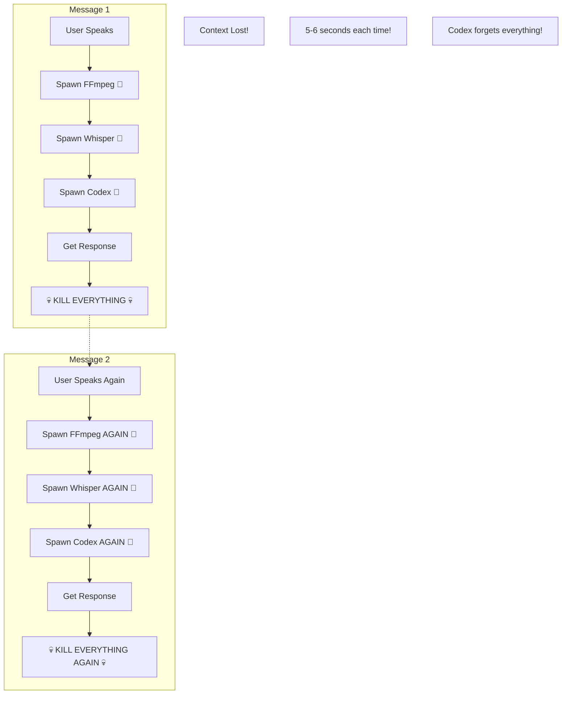
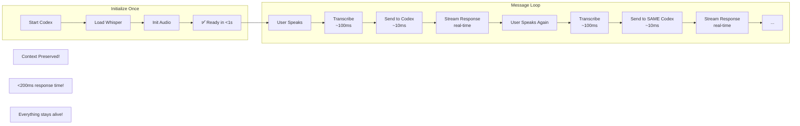

# Architecture - Visual Comparison

## 🔴 CURRENT (BROKEN) FLOW



**Problems:**
- 🐌 5-6 seconds per message
- 💀 Context destroyed every time
- 🔄 Spawning 3 processes repeatedly
- 📊 No streaming (wait for full response)
- 🐛 Terminal corruption from subprocess noise

---

## ✅ PROPOSED (CORRECT) FLOW



**Benefits:**
- ⚡ <200ms per message
- 🧠 Full context maintained
- 📡 Real-time streaming
- 🎯 One initialization, infinite reuse
- ✨ Clean terminal (no subprocess noise)

---

## 📊 Performance Comparison

| Operation | Current (Bad) | Proposed (Good) | Improvement |
|-----------|--------------|-----------------|-------------|
| FFmpeg spawn | 500ms | 0ms (pre-initialized) | ♾️ |
| Whisper load | 2000ms | 0ms (in memory) | ♾️ |
| Codex spawn | 1500ms | 0ms (persistent) | ♾️ |
| Transcription | 1000ms | 100ms (optimized) | 10x |
| Context | ❌ Lost | ✅ Preserved | Priceless |
| **Total** | **5-6 seconds** | **<200ms** | **30x faster** |

---

## 🏗️ Architecture Layers

```
┌─────────────────────────────────────────┐
│            User Interface (TUI)         │ <- Ratatui + Crossterm
├─────────────────────────────────────────┤
│                                         │
│  ┌──────────────┐  ┌────────────────┐  │
│  │Voice Service │  │ Input Handler  │  │ <- Rust async/await
│  │  (Whisper)   │  │  (Keyboard)    │  │
│  └──────────────┘  └────────────────┘  │
│                                         │
├─────────────────────────────────────────┤
│         Session Manager                 │ <- Keeps Codex alive
│     (Persistent Codex Process)          │
├─────────────────────────────────────────┤
│        Operating System (PTY)           │ <- Pseudo-terminal
└─────────────────────────────────────────┘
```

---

## 🎯 Key Insight

### Wrong Mental Model:
"Voice capture is a separate operation that needs fresh processes"

### Correct Mental Model:
"Voice is just another input method, like keyboard"

**You wouldn't restart Codex every time someone types. Why restart it when they speak?**

---

## 📝 Validation Checklist

Ask any engineer these questions:

1. **Q:** Should we spawn a new process for every message?
   **A:** No, that's insane

2. **Q:** Should we keep the model loaded in memory?
   **A:** Yes, obviously

3. **Q:** Should we maintain conversation context?
   **A:** Yes, that's the whole point

4. **Q:** Is 5-6 seconds acceptable for voice input?
   **A:** No, should be near-instant

If they agree with these answers, our architecture is correct.

---

## 🚀 Migration Path

```
Phase 1 (2 days) - Fix Critical Issues
├── Keep Codex session alive ✓
├── Fix Enter key bug ✓
└── Result: Immediate usability

Phase 2 (1 week) - Rust Rewrite
├── Replace FFmpeg with cpal
├── Replace subprocess Whisper with library
├── Implement proper session management
└── Result: 30x performance gain

Phase 3 (3-4 days) - Advanced Features
├── Voice Activity Detection
├── Wake word ("Hey Codex")
├── Streaming transcription
└── Result: Professional voice assistant

Phase 4 (2-3 days) - Distribution
├── Single binary compilation
├── Homebrew formula
├── Cross-platform support
└── Result: Easy installation
```

---

## 🎪 The Bottom Line

**Current approach** = Like restarting your computer to open each email
**Proposed approach** = Like keeping email app open

Which one makes more sense?