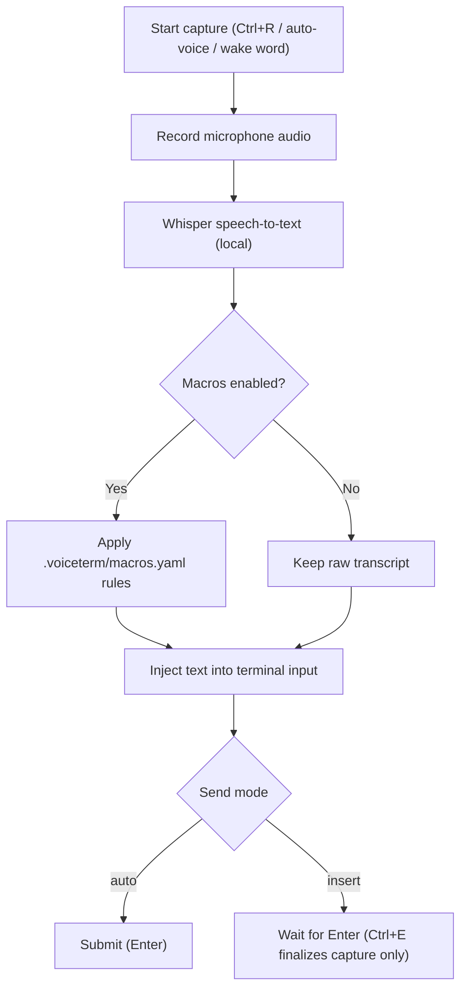
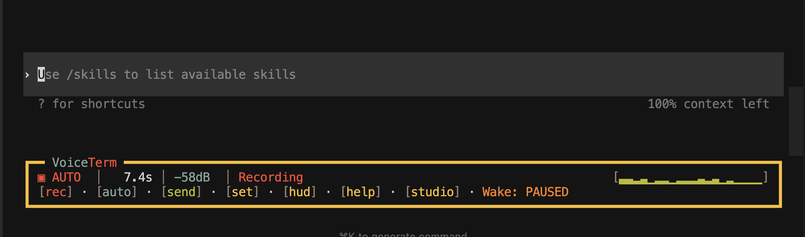
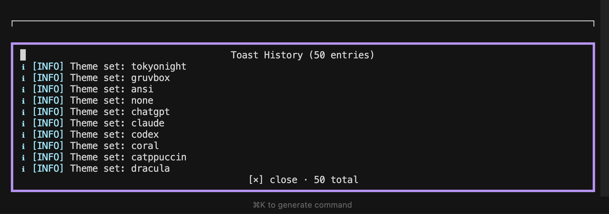
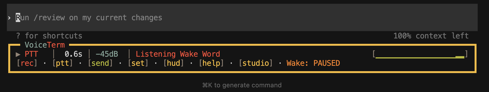
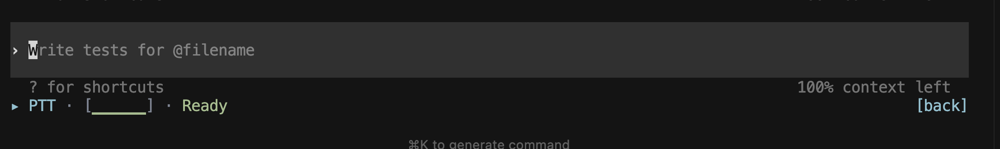

# Usage Guide

VoiceTerm is a voice helper for AI CLIs.
It listens to your mic, transcribes locally, and types text into your terminal.

Primary support: Codex and Claude Code.

Docs map:

- [Guides Index](README.md)
- [Quick Start](../QUICK_START.md)
- [Install](INSTALL.md)
- [CLI Flags](CLI_FLAGS.md)
- [Troubleshooting](TROUBLESHOOTING.md)


## Recommended Reading Paths

| Goal | Read in this order |
|---|---|
| First run | [Start in 60 Seconds](#start-in-60-seconds) -> [Core Controls](#core-controls) -> [Settings Menu](#settings-menu) |
| Daily use | [Voice Modes](#voice-modes) -> [Common Tasks](#common-tasks) -> [Status Line Reference](#status-line-reference) |
| Custom workflows | [Customization](#customization) -> [Project Voice Macros](#project-voice-macros) -> [Launch Recipes](#launch-recipes) |
| Debug behavior | [Status Line Reference](#status-line-reference) -> [TROUBLESHOOTING.md](TROUBLESHOOTING.md) |

## Start in 60 Seconds

1. Launch VoiceTerm in your project folder:

   ```bash
   voiceterm
   ```

2. Press `Ctrl+R`, speak, then pause.
3. VoiceTerm transcribes and types text into the CLI input.

Default send behavior is `auto`:

- `auto`: VoiceTerm types text and presses Enter.
- `insert`: VoiceTerm types text and waits for you to press Enter.

If you have not authenticated your backend CLI yet:

```bash
voiceterm --login --codex
voiceterm --login --claude
```

Hands-free wake flow (optional):

```bash
voiceterm --auto-voice --wake-word --voice-send-mode insert
```

Say your wake phrase, then speak your prompt. In `insert` mode, say `send`,
`send message`, or `submit` to deliver without touching the keyboard.

## Backend Support

| Backend | Run command | Status |
|---------|-------------|--------|
| Codex | `voiceterm` or `voiceterm --codex` | Supported |
| Claude Code | `voiceterm --claude` | Supported |
| Gemini CLI | `voiceterm --gemini` | Experimental (supported) |
| Aider | `voiceterm --backend aider` | Experimental (untested) |
| OpenCode | `voiceterm --backend opencode` | Experimental (untested) |

## How Voice Input Works

VoiceTerm handles voice capture and text injection.
It does not replace your backend CLI.



Simple flow:

1. Record: VoiceTerm listens while you speak.
2. Transcribe: local Whisper converts speech to text.
3. Expand (optional): macro rules from `.voiceterm/macros.yaml` apply when enabled.
4. Inject: final text is typed into terminal input.
5. Send:
   - `auto`: press Enter automatically.
   - `insert`: wait for manual Enter.



## Core Controls

### Capture and send

| Key | Action |
|-----|--------|
| `Ctrl+R` | Trigger voice capture |
| `Ctrl+X` | Capture one screenshot prompt |
| `Ctrl+E` | Finalize active capture early (stage text only, never sends Enter) |
| `Ctrl+V` | Toggle auto-voice |
| `Ctrl+T` | Toggle send mode (`auto` <-> `insert`) |
| `Enter` | In `insert` mode: send staged prompt text |
| `Ctrl+]` | Increase threshold (less sensitive mic) |
| `Ctrl+\` | Decrease threshold (more sensitive mic) |
| `Ctrl+/` | Alias for threshold down |

### HUD and overlays

| Key | Action |
|-----|--------|
| `Ctrl+G` | Quick cycle theme |
| `Ctrl+H` | Open history (`mic`/`you`/`ai`) |
| `Ctrl+N` | Open notifications history |
| `Ctrl+O` | Open settings |
| `Ctrl+D` | Toggle Dev panel (`--dev` only; otherwise EOF goes to backend CLI) |
| `Ctrl+Y` | Open Theme Studio |
| `Ctrl+U` | Cycle HUD style (Full -> Minimal -> Hidden) |
| `?` | Open shortcut help overlay |

### Session control

| Key | Action |
|-----|--------|
| `Ctrl+C` | Forward interrupt to backend CLI |
| `Ctrl+Q` | Quit VoiceTerm |

Mouse and overlay behavior:

- When Mouse is enabled, HUD buttons are clickable. Keyboard HUD focus still
  works with Left/Right + Enter.
- In Cursor terminal, wheel/touchpad scrolling may not move chat history while
  Mouse is ON. The scrollbar can still be dragged.
- If you want touchpad/wheel scrolling in Cursor, set `Mouse` to `OFF` and use
  keyboard HUD navigation (Left/Right or `Tab` + `Enter`) for controls.
- If help/settings/theme overlays are open, unmatched input closes the overlay
  and replays the key/action into normal input handling.
- Help overlay includes clickable Docs/Troubleshooting links (terminals that
  support clickable links).

## Settings Menu

Open with `Ctrl+O`.

- Navigate rows: Up/Down
- Change values: Left/Right
- Toggle/activate: Enter
- Mouse: click a settings row to select it and apply the next toggle/cycle action
- Close: Esc


Common settings:

- Auto-voice
- Wake word (`OFF`/`ON`, sensitivity, cooldown; default `OFF`)
- Send mode (`auto` or `insert`)
- Image mode (`OFF`/`ON`; ON makes HUD `[rec]` persistently capture image prompts)
- Macros toggle
- Mic threshold
- Latency display (`Off`, `Nms`, `Latency: Nms`)
- Mouse support
- `Backend` / `Pipeline` rows are read-only session diagnostics

Visual controls are now in Theme Studio:

- Press `Ctrl+Y` to open Theme Studio.
- Use `Theme picker` (or `Ctrl+G`) to change themes.
- Theme Studio is a multi-page tabbed editor. Press `Tab`/`Shift+Tab` to switch pages:

| Page | Purpose |
|------|---------|
| **Home** | Cycle-button controls for HUD style, borders, right panel, animation, glyphs, indicators, spinners, progress bars, voice scene, toast, startup, banner, undo/redo/rollback |
| **Colors** | Edit all 10 semantic colors (Recording, Processing, Success, Warning, Error, Info, Dim, Bg Primary, Bg Secondary, Border) with an inline RGB color picker. Changes apply live. Indicator set and glyph set selectors at the bottom (Left/Right to cycle) |
| **Borders** | Pick border style (Single, Rounded, Double, Heavy, None) with live mini-box previews. Press Enter to apply |
| **Components** | Browse 54 component IDs grouped by category (HUD, Buttons, Toast, Overlay, etc.) with color swatches showing which semantic color each component uses |
| **Preview** | Read-only live preview of HUD status line colors, indicators, toast severity, and border chrome using the active theme |
| **Export** | Export current theme to TOML file (`~/.config/voiceterm/themes/`), copy to clipboard via OSC 52, or import from file |

- Use `Undo edit`, `Redo edit`, and `Rollback edits` on the Home page if you want to revert visual changes.
- `Ctrl+U` is still the fastest way to cycle HUD styles.
- You can still set visuals with launch flags such as `--hud-border-style` and `--hud-right-panel`.

Settings persistence:

- Settings are saved to `~/.config/voiceterm/config.toml`.
- CLI flags always override persisted values for the current launch.

## Image Mode (Picture Prompts)

Use this mode when you want HUD `[rec]` to capture an image prompt while keeping
`Ctrl+R` dedicated to voice capture.

1. Open Settings with `Ctrl+O`.
2. Set `Image mode` to `ON`.
3. Press `Ctrl+X` for one-shot screenshot capture, or click `[rec]` for persistent mode.

Behavior:

- Captures are saved to `<project>/.voiceterm/captures/capture-<timestamp>.png`.
- Full HUD shows `IMG` while image mode is active.
- In `auto` send mode, VoiceTerm inserts and sends the image prompt line.
- In `insert` send mode, VoiceTerm inserts the image prompt and waits for Enter.

Capture command:

- macOS default: uses `screencapture`.
- Other platforms: set `--image-capture-command` (or `VOICETERM_IMAGE_CAPTURE_COMMAND`).
- Custom commands receive output path via `VOICETERM_IMAGE_PATH`.

## Developer Guard Mode

Use `--dev` (or `--dev-mode` / `-D`) for guarded developer-only tools in one
launch. Normal default behavior stays unchanged when this flag is off.

```bash
voiceterm --dev
voiceterm --dev --dev-log
voiceterm --dev --dev-log --dev-path ~/.voiceterm/dev
```

What you get:

- Default launch stays unchanged when the flag is not present.
- Full HUD shows `DEV` when guard mode is active.
- `Ctrl+D` toggles the in-session Dev panel.
- Without `--dev`, `Ctrl+D` is forwarded as EOF (`0x04`) to the backend CLI and may close/exit that session.
- The panel shows live counters plus `Dev Tools` commands (`status`, `report`, `triage`, `security`, `sync`) through an allowlisted async broker.
- `sync` is mutating and requires a second `Enter` confirmation before it runs.
- `--dev-log` writes per-session JSONL event logs to `<dev-path>/sessions/`.
- `--dev-path` requires `--dev --dev-log`.
- Mutating commands like `sync` require explicit confirmation before execution.

Detailed Dev panel command guide:
[DEV_MODE.md](DEV_MODE.md)

## Transcript History

Open with `Ctrl+H`.

- Type to filter transcript history entries (newest first).
- `Up`/`Down` moves selection.
- `Backspace` removes one search character.
- Search input ignores terminal control/focus escape noise.
- `Enter` replays selected replayable entries (`mic` and `you`) into active CLI input.
- `ai` rows are output-only and are not replayable.
- Mouse: click a row to select it; click footer `[×] close` (or `[x]` in ASCII glyph mode) to close.
- The overlay shows 7 rows at a time, plus a 2-line preview pane for the selected row.
- `Esc` closes the overlay.
- Optional memory logging: `--session-memory` writes `user` + `assistant` lines to markdown (`<cwd>/.voiceterm/session-memory.md` by default).
- Override the memory-log path with `--session-memory-path <PATH>` when needed.
- Session memory lines append to a markdown file and persist across runs in that project.

## Notification History

Open with `Ctrl+N`.

- Shows recent status notifications with severity labels (`INFO`, `OK`, `WARN`, `ERR`).
- Notifications are captured from runtime status events and auto-dismiss from the active toast lane.
- Overlay borders and rows keep alignment in both Unicode and ASCII glyph modes (including long history lists).
- Use `Esc` (or `Ctrl+N` again) to close the overlay.



## Voice Modes

Three controls define runtime behavior:

- Auto-voice (`Ctrl+V`)
- Send mode (`Ctrl+T`)
- Macros toggle (Settings -> Macros)

### Wake + Voice Send flow (hands-free)

This is the most hands-free mode:

1. Open Settings with `Ctrl+O` and set `Wake word` to `ON`.
2. Press `Ctrl+T` until send mode is `insert`.
3. Press `Ctrl+V` to turn auto-voice on.
4. Say the wake phrase (`hey codex` or `hey claude`).
5. Speak your prompt.
6. Say `send` (or `submit`) to submit it.

Optional startup command:

```bash
voiceterm --auto-voice --wake-word --voice-send-mode insert
```



You can also do one-shot submit with:

- `hey codex send`
- `hey claude send`

### Auto-voice x send mode

| Auto-voice | Send mode | Behavior |
|------------|-----------|----------|
| Off | `auto` | Press `Ctrl+R` to record. Transcript is injected and sent. |
| Off | `insert` | Press `Ctrl+R` to record. Transcript is injected and waits for Enter. |
| On | `auto` | Speak when ready. Transcript is injected and sent. |
| On | `insert` | Speak when ready. Transcript is injected and waits for Enter. |

### Practical notes

- In `insert` mode, Enter submits staged text.
- In `insert` mode, saying `send`, `send message`, or `submit` also submits staged text.
- One-shot wake submit works: `hey codex send` or `hey claude send` (in `insert` mode).
- `Ctrl+R` toggles voice recording start/stop without sending.
- `Ctrl+X` captures one screenshot prompt into the terminal.
- `Ctrl+E` finalizes only. It never sends.
- Wake state labels in Full HUD:
  `Wake: ON` (listening), `Wake: PAUSED` (temporarily paused), `Wake: ERR` (startup failed).
- If auto-voice does not trigger as expected, try `--prompt-regex`.

### Built-in voice navigation commands

If a transcript exactly matches one phrase below, VoiceTerm runs a local action
instead of typing raw text.

- `scroll up` - sends terminal PageUp
- `scroll down` - sends terminal PageDown
- `send` / `send message` / `submit` - submits staged `insert`-mode text (same behavior as Enter)
- `show last error` - surfaces the most recent error-like terminal line in HUD status
- `copy last error` - copies the most recent error-like terminal line to clipboard
- `explain last error` - sends an "explain this error" prompt to the active backend

Priority:

- If a voice macro matches first, macro wins.
- Use `voice scroll up` or `voice scroll down` for explicit built-in navigation
  phrases when you also keep overlapping macro triggers.

### Long dictation (`auto-voice` + `insert`)

Capture is chunked by duration (default 30s, max 60s via
`--voice-max-capture-ms`). Each chunk is transcribed and injected.
Press Enter when ready to submit, or use `Ctrl+E` to stop early and stage text.

## Common Tasks

| Task | Fastest path |
|---|---|
| Adjust mic sensitivity | `Ctrl+]`, `Ctrl+\`, `Ctrl+/`, or `voiceterm --mic-meter` |
| Select an input device | `voiceterm --list-input-devices` |
| Use wrapped/pasted device names | `--input-device` normalizes whitespace/newlines before lookup |
| Run diagnostics | `voiceterm --doctor` |
| Tune auto-voice timing | `--auto-voice-idle-ms`, `--transcript-idle-ms` |
| Configure startup splash | `VOICETERM_STARTUP_SPLASH_MS`, `VOICETERM_NO_STARTUP_BANNER` |
| Configure sounds | `--sounds`, `--sound-on-complete`, `--sound-on-error` |

### Adjust microphone sensitivity

- `Ctrl+]`: less sensitive (higher threshold)
- `Ctrl+\` or `Ctrl+/`: more sensitive (lower threshold)
- Range:
  - Hotkeys: `-80 dB` to `-10 dB`
  - CLI flag: `-120 dB` to `0 dB`
  - Default: `-55 dB`

Calibration helper:

```bash
voiceterm --mic-meter
```

### Check or select audio devices

```bash
voiceterm --list-input-devices
voiceterm --input-device "MacBook Pro Microphone"
```

### Run diagnostics

```bash
voiceterm --doctor
```

### Tune auto-voice timing

```bash
voiceterm --auto-voice-idle-ms 1200
voiceterm --transcript-idle-ms 250
```

### Startup splash behavior

```bash
VOICETERM_STARTUP_SPLASH_MS=0 voiceterm
VOICETERM_STARTUP_SPLASH_MS=900 voiceterm
VOICETERM_NO_STARTUP_BANNER=1 voiceterm
```

### Notification sounds

```bash
voiceterm --sounds
voiceterm --sound-on-complete
voiceterm --sound-on-error
```

## Customization

### Themes

Open Theme Studio with `Ctrl+Y`, then choose `Theme picker`.


Available themes:

- `chatgpt`
- `claude`
- `codex`
- `coral`
- `catppuccin`
- `dracula`
- `nord`
- `tokyonight`
- `gruvbox`
- `ansi`
- `none`

Tips:

- Set at startup: `voiceterm --theme catppuccin`
- Disable color: `voiceterm --no-color` or `NO_COLOR=1`
- Default theme depends on backend (`codex`, `claude`, or `coral`)
- On `xterm-256color` terminals, selected themes are preserved; ANSI fallback
  applies only on ANSI16 terminals.

Advanced theme options (optional):

- **TOML theme files**: Export a theme from Theme Studio (Export page) or create a `.toml` file manually in `~/.config/voiceterm/themes/`. Load with `--theme-file <path>` or set `VOICETERM_THEME_FILE=<path>`. Themes can inherit from built-in palettes via `base_theme` and define custom hex colors, border styles, indicator sets, and glyph profiles.
- **Hot-reload**: When using `--theme-file`, VoiceTerm watches the file for changes and applies updates live (within ~500ms).
- Use `VOICETERM_STYLE_PACK_JSON` to load a custom style-pack with overrides for borders, indicators, glyphs, progress bars, and voice scene styles.
- `components.overlay_border` in style-pack JSON controls overlay frame borders (help/settings/theme-picker/theme-studio/toast/history overlays).
- `components.hud_border` controls Full HUD borders when `--hud-border-style theme` (or Theme Studio `HUD borders` set to Theme) is active.
- `Glyph profile: ASCII` now forces ASCII separators in startup banner variants and keeps explicit spinner-style animations ASCII-safe.
- When a style-pack sets `base_theme`, theme switching is locked to that theme until the env var is unset.
- Visual controls (HUD style, borders, right panel, animation, glyphs, indicators, spinners, progress bars, voice scene, toast position/severity, startup splash, banner style) are all adjustable in Theme Studio.
- For full env var and flag details, see [CLI_FLAGS.md](CLI_FLAGS.md#environment-variables).

### HUD styles

| Style | Flag | Summary |
|-------|------|---------|
| Full | default | Multi-row HUD with detailed controls and telemetry |
| Minimal | `--hud-style minimal` or `--minimal-hud` | Single-line strip |
| Hidden | `--hud-style hidden` | Muted launcher row when idle (`open` + `hide` controls), muted recording indicator when active |

Runtime layout note:

- Full HUD row policy is unified across Codex, Claude, and Gemini.
- For Codex/Claude prompt safety, HUD suppression now targets high-confidence interactive approval cards instead of generic composer/hint text.

Hidden launcher controls:

- `hide` collapses the idle launcher to `[open]` only.
- In collapsed mode, first `open` restores the hidden launcher, next `open` switches HUD style.
- Mouse clicks on `[open]`/`[hide]` redraw launcher state immediately (same behavior as Left/Right + Enter).

Full HUD border style options:

- `theme`, `single`, `rounded`, `double`, `heavy`, `none`

Right panel options:

- `off`, `ribbon`, `dots`, `heartbeat`
- Optional recording-only animation via `--hud-right-panel-recording-only`
- Recording-only mode pauses animated motion while idle but keeps the panel
  visible so layout stays stable between idle and recording states.
- Scene animation semantics are consistent across Full and Minimal HUD right-panel
  renderers.
- In Full HUD, right-panel telemetry is rendered on the main status row
  (top-right lane).
- Theme Studio `Voice scene` cycles scene policy (`theme`, `pulse`, `static`,
  `minimal`) for right-panel animation and visual density in Full/Minimal HUD.

Examples:

```bash
voiceterm --minimal-hud
voiceterm --hud-style hidden
voiceterm --hud-style full --hud-border-style none
voiceterm --hud-right-panel off
```

Minimal HUD example:



Hidden HUD example:


Hidden HUD while recording:


## Project Voice Macros

Voice macros let you map spoken phrases to commands.

Macros are stored in:

`<project>/.voiceterm/macros.yaml`

By default, macros are `OFF` at startup. Turn `Settings -> Macros` to `ON`
when you want phrase matching and expansion.

Setup:

```bash
# Interactive wizard (recommended)
./scripts/macros.sh wizard

# Non-interactive install from a starter pack
./scripts/macros.sh install --pack safe-core
./scripts/macros.sh install --pack power-git --overwrite
./scripts/macros.sh install --pack full-dev --overwrite
```

Macro shortcuts:
[Macro script reference](../scripts/README.md#macrossh) |
[Flags/env reference](CLI_FLAGS.md)
<details>
<summary><strong>More macro details (starter packs, wizard extras, file format)</strong></summary>

Starter packs:

- `safe-core`: low-risk git/GitHub inspection commands
- `power-git`: write actions (commit/push/PR/issue), default `insert` mode
- `full-dev`: safe-core + power-git + project checks and release helpers

Wizard extras:

- Auto-fills repo placeholders:
  `__GITHUB_REPO__`, `__GITHUB_OWNER__`, `__DEFAULT_BRANCH__`,
  `__GITHUB_USER__`, `__CURRENT_BRANCH__`
- For GitHub macros, checks that `gh` is installed/authenticated and warns if
  `gh auth login` is needed.

Example macro file:

```yaml
macros:
  run tests: cargo test --all-features
  commit with message:
    template: "git commit -m '{TRANSCRIPT}'"
    mode: insert
```

Rules:

- Matching ignores case and extra whitespace.
- Use `{TRANSCRIPT}` to capture the rest of what you say.
- `mode` is optional (`auto` or `insert`).
- Expansion runs only when `Settings -> Macros` is `ON`.
- This repo ships a starter pack at `.voiceterm/macros.yaml` with expanded
  git/GitHub workflows plus codex-voice check/release commands.

</details>

## Status Line Reference

Example:

`◎ AUTO | -35dB | Auto-voice enabled`

Main areas:

- mode indicator
- mode lane (`PTT` (push-to-talk), `AUTO`, `IDLE`) with active color transitions
- mic threshold
- status message lane (`Ready`, `Recording`, `Processing`, `Responding`, warnings/errors)
- shortcut hints (space permitting)
- optional telemetry/right-panel modules

`responding` appears only when VoiceTerm submits text to the backend (for
example, `auto` send mode or `explain last error`), then returns to idle when
backend output arrives.

Latency badge behavior:

- shows post-capture STT delay (`stt_ms`) when reliable metrics exist
- larger `ms` values on longer utterances are expected for non-streaming STT
- severity color follows real-time factor (`rtf = stt_ms / speech_ms` — how fast transcription runs compared to speech length; lower is faster)
- recording duration is shown separately while speaking
- both manual/PTT and auto modes hide latency while actively recording/processing
- the badge returns after capture/transcription completes with the latest reliable STT sample
- hides automatically when latency metrics are incomplete (no synthetic elapsed/capture fallback)
- stale idle badges auto-expire after a short window
- full and compact button rows share the same queue/wake/latency badge rules and thresholds

Common statuses:

| Status | Meaning |
|--------|---------|
| `Auto-voice enabled` | VoiceTerm will start listening when prompt is ready |
| `Listening Manual Mode` | Recording from manual trigger |
| `Processing ...` | Transcription is in progress |
| `Ready` | Idle/success state after transcript delivery |
| `Transcript queued (N)` | Backend was busy; transcript is queued |
| `Macros: OFF` | Raw transcript injection, no macro expansion |
| `No speech detected` | Capture ended without enough detected speech (manual/PTT mode now includes a short extra grace window before silence stop) |

You can check or change the active voice pipeline in Settings (`Ctrl+O`).

## Launch Recipes

| Goal | Command |
|---|---|
| Claude backend | `voiceterm --claude` |
| Hands-free + immediate send | `voiceterm --auto-voice --voice-send-mode auto` |
| Hands-free + manual review/send | `voiceterm --auto-voice --voice-send-mode insert` |
| Specific microphone | `voiceterm --input-device "USB Microphone"` |
| Less sensitive mic | `voiceterm --voice-vad-threshold-db -35` |
| Force transcription language | `voiceterm --lang en` |

## See Also

| Document | Purpose |
|----------|---------|
| [README.md](../README.md) | Project overview and quick entry |
| [QUICK_START.md](../QUICK_START.md) | Fast setup checklist |
| [CLI_FLAGS.md](CLI_FLAGS.md) | Complete flag and env reference |
| [INSTALL.md](INSTALL.md) | Installation methods |
| [TROUBLESHOOTING.md](TROUBLESHOOTING.md) | Troubleshooting hub |
| [TROUBLESHOOTING.md#backend-issues](TROUBLESHOOTING.md#backend-issues) | Backend troubleshooting |
| [TROUBLESHOOTING.md#terminal-and-ide-issues](TROUBLESHOOTING.md#terminal-and-ide-issues) | Terminal/IDE troubleshooting |
| [TROUBLESHOOTING.md#install-and-update-issues](TROUBLESHOOTING.md#install-and-update-issues) | Install/update troubleshooting |
| [ARCHITECTURE.md](../dev/ARCHITECTURE.md) | Internal design and module flow |
