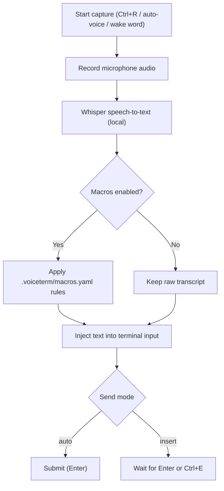
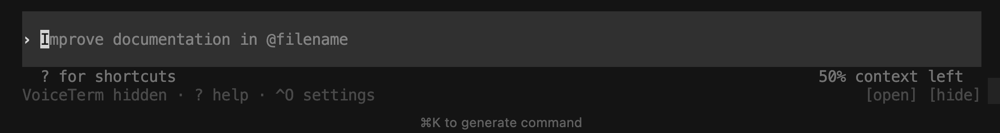

# Usage Guide

VoiceTerm is a voice-first terminal overlay for AI CLIs. It transcribes speech
locally and injects text into your terminal input.
Current stable release: `v1.0.87` (2026-02-20). Full release notes: [../dev/CHANGELOG.md](../dev/CHANGELOG.md).

Primary support: Codex and Claude Code.

Docs map:

- [Guides Index](README.md)
- [Quick Start](../QUICK_START.md)
- [Install](INSTALL.md)
- [CLI Flags](CLI_FLAGS.md)
- [Troubleshooting](TROUBLESHOOTING.md)


## Recommended Reading Paths

| Goal | Read in this order |
|---|---|
| First run | [Start in 60 Seconds](#start-in-60-seconds) -> [Core Controls](#core-controls) -> [Settings Menu](#settings-menu) |
| Daily use | [Voice Modes](#voice-modes) -> [Common Tasks](#common-tasks) -> [Status Line Reference](#status-line-reference) |
| Custom workflows | [Customization](#customization) -> [Project Voice Macros](#project-voice-macros) -> [Launch Recipes](#launch-recipes) |
| Debug behavior | [Status Line Reference](#status-line-reference) -> [TROUBLESHOOTING.md](TROUBLESHOOTING.md) |

## Start in 60 Seconds

1. Launch VoiceTerm in your project folder:

   ```bash
   voiceterm
   ```

2. Press `Ctrl+R`, speak, then pause.
3. VoiceTerm transcribes and types text into the CLI input.

Default send behavior is `auto`:

- `auto`: VoiceTerm types text and presses Enter.
- `insert`: VoiceTerm types text and waits for you to press Enter.

If you have not authenticated your backend CLI yet:

```bash
voiceterm --login --codex
voiceterm --login --claude
```

## Backend Support

| Backend | Run command | Status |
|---------|-------------|--------|
| Codex | `voiceterm` or `voiceterm --codex` | Supported |
| Claude Code | `voiceterm --claude` | Supported |
| Gemini CLI | `voiceterm --gemini` | Experimental (currently not working) |
| Aider | `voiceterm --backend aider` | Experimental (untested) |
| OpenCode | `voiceterm --backend opencode` | Experimental (untested) |

## How Voice Input Works

VoiceTerm only handles voice capture and text injection. It does not replace your
backend CLI.



Flow:

1. Record: VoiceTerm listens while you speak.
2. Transcribe: local Whisper converts speech to text.
3. Expand (optional): macro rules from `.voiceterm/macros.yaml` apply if enabled.
4. Inject: final text is typed into terminal input.
5. Send decision:
   - `auto`: press Enter automatically.
   - `insert`: wait for manual Enter.


## Core Controls

### Capture and send

| Key | Action |
|-----|--------|
| `Ctrl+R` | Toggle recording (start / stop early) |
| `Ctrl+E` | Send staged text (or stop recording and send) |
| `Ctrl+V` | Toggle auto-voice |
| `Ctrl+T` | Toggle send mode (`auto` <-> `insert`) |
| `Enter` | In `insert` mode: send staged prompt text |
| `Ctrl+]` | Increase threshold (less sensitive mic) |
| `Ctrl+\` | Decrease threshold (more sensitive mic) |
| `Ctrl+/` | Alias for threshold down |

### HUD and overlays

| Key | Action |
|-----|--------|
| `Ctrl+G` | Quick cycle theme |
| `Ctrl+H` | Open history (`mic`/`you`/`ai`) |
| `Ctrl+N` | Open notifications history |
| `Ctrl+O` | Open settings |
| `Ctrl+Y` | Open Theme Studio |
| `Ctrl+U` | Cycle HUD style (Full -> Minimal -> Hidden) |
| `?` | Open shortcut help overlay |

### Session control

| Key | Action |
|-----|--------|
| `Ctrl+C` | Forward interrupt to backend CLI |
| `Ctrl+Q` | Quit VoiceTerm |

Mouse and overlay behavior:

- When Mouse is enabled, HUD buttons are clickable. Keyboard HUD focus still
  works with Left/Right + Enter.
- If help/settings/theme overlays are open, unmatched input closes the overlay
  and replays the key/action into normal input handling.
- Help overlay includes clickable Docs/Troubleshooting links (terminals that
  support clickable links).

## Settings Menu

Open with `Ctrl+O`.

- Navigate rows: Up/Down
- Change values: Left/Right
- Toggle/activate: Enter
- Mouse: click a settings row to select it and apply the next toggle/cycle action
- Close: Esc


Common settings:

- Auto-voice
- Wake word (`OFF`/`ON`, sensitivity, cooldown; default `OFF`)
- Send mode (`auto` or `insert`)
- Macros toggle
- Mic threshold
- Latency display (`Off`, `Nms`, `Latency: Nms`)
- Mouse support
- `Backend` / `Pipeline` rows are read-only session diagnostics

Visual controls are now in Theme Studio:

- Theme: use `Ctrl+Y` (Theme Studio -> Theme picker) or `Ctrl+G` (quick cycle)
- HUD style/borders/right panel/panel animation: use `Ctrl+Y` and select the matching Theme Studio row (each row shows its current live value)
- Glyph/indicator/progress/theme-border/scene profiles: use `Ctrl+Y` and adjust `Glyph profile`, `Indicator set`, `Progress spinner`, `Progress bars`, `Theme borders`, and `Voice scene` rows
- `Ctrl+U` remains a quick shortcut for cycling HUD style
- Launch flags are still supported: `--hud-border-style`, `--hud-right-panel`, `--hud-right-panel-recording-only`
- Theme Studio glyph/indicator/spinner/progress-bar/theme-border/voice-scene overrides apply at runtime for the current session and reset on restart.

Settings persistence:

- Runtime settings are saved to `~/.config/voiceterm/config.toml`.
- CLI flags always override persisted values for the current launch.

## Transcript History

Open with `Ctrl+H`.

- Type to filter transcript history entries (newest first).
- `Up`/`Down` moves selection.
- `Backspace` removes one search character.
- Search input ignores terminal control/focus escape noise.
- `Enter` replays selected replayable entries (`mic` and `you`) into active CLI input.
- `ai` rows are output-only and are not replayable.
- Mouse: click a row to select it; click footer `[×] close` (or `[x]` in ASCII glyph mode) to close.
- The overlay shows 7 rows at a time, plus a 2-line preview pane for the selected row.
- `Esc` closes the overlay.
- Optional memory logging: `--session-memory` writes `user` + `assistant` lines to markdown (`<cwd>/.voiceterm/session-memory.md` by default).
- Override the memory-log path with `--session-memory-path <PATH>` when needed.
- Session memory is stored reliably for later retrieval.

## Notification History

Open with `Ctrl+N`.

- Shows recent status notifications with severity labels (`INFO`, `OK`, `WARN`, `ERR`).
- Notifications are captured from runtime status events and auto-dismiss from the active toast lane.
- Overlay borders and rows keep alignment in both Unicode and ASCII glyph modes (including long history lists).
- Use `Esc` (or `Ctrl+N` again) to close the overlay.

## Voice Modes

Three controls define runtime behavior:

- Auto-voice (`Ctrl+V`)
- Send mode (`Ctrl+T`)
- Macros toggle (Settings -> Macros)

### Auto-voice x send mode

| Auto-voice | Send mode | Behavior |
|------------|-----------|----------|
| Off | `auto` | Press `Ctrl+R` to record. Transcript is injected and sent. |
| Off | `insert` | Press `Ctrl+R` to record. Transcript is injected and waits for Enter. |
| On | `auto` | Speak when ready. Transcript is injected and sent. |
| On | `insert` | Speak when ready. Transcript is injected and waits for Enter. |

### Practical notes

- In `insert` mode, Enter is submit-only for staged text.
- `Ctrl+R` stops recording without sending.
- `Ctrl+E` sends staged text immediately; with no staged text it finalizes+submits only while recording, otherwise it shows `Nothing to send`.
- Wake-word detections route through the same capture-start path as `Ctrl+R`; while wake listening is ON, detections do not force-stop an already active recording.
- In Full HUD, wake privacy state is explicit: `Wake: ON` (theme-matched pulse) means always-listening is active, and `Wake: PAUSED` means wake listening is temporarily suspended during active capture/transcription.
- In auto-voice mode, VoiceTerm waits for prompt readiness before listening again.
- If prompt detection is unusual, set `--prompt-regex`.

### Built-in voice navigation commands

When a transcript exactly matches one of these phrases, VoiceTerm runs a local
navigation action instead of typing the raw text.

- `scroll up` - sends terminal PageUp
- `scroll down` - sends terminal PageDown
- `show last error` - surfaces the most recent error-like terminal line in HUD status
- `copy last error` - copies the most recent error-like terminal line to clipboard
- `explain last error` - sends an "explain this error" prompt to the active backend

Precedence:

- If a voice macro matches first, the macro wins.
- Use `voice scroll up` or `voice scroll down` for explicit built-in navigation
  phrases when you also keep overlapping macro triggers.

### Long dictation (`auto-voice` + `insert`)

Capture is chunked by duration (default 30s, max 60s via
`--voice-max-capture-ms`). Each chunk is transcribed and injected; press Enter
once when ready to submit, or use `Ctrl+E` while recording to stop early and submit immediately.

## Common Tasks

| Task | Fastest path |
|---|---|
| Adjust mic sensitivity | `Ctrl+]`, `Ctrl+\`, `Ctrl+/`, or `voiceterm --mic-meter` |
| Select an input device | `voiceterm --list-input-devices` |
| Run diagnostics | `voiceterm --doctor` |
| Tune auto-voice timing | `--auto-voice-idle-ms`, `--transcript-idle-ms` |
| Configure startup splash | `VOICETERM_STARTUP_SPLASH_MS`, `VOICETERM_NO_STARTUP_BANNER` |
| Configure sounds | `--sounds`, `--sound-on-complete`, `--sound-on-error` |
| Validate an RC build | [Release checks in `dev/DEVELOPMENT.md`](../dev/DEVELOPMENT.md) |

### Adjust microphone sensitivity

- `Ctrl+]`: less sensitive (higher threshold)
- `Ctrl+\` or `Ctrl+/`: more sensitive (lower threshold)
- Range:
  - Hotkeys: `-80 dB` to `-10 dB`
  - CLI flag: `-120 dB` to `0 dB`
  - Default: `-55 dB`

Calibration helper:

```bash
voiceterm --mic-meter
```

### Check or select audio devices

```bash
voiceterm --list-input-devices
voiceterm --input-device "MacBook Pro Microphone"
```

### Run diagnostics

```bash
voiceterm --doctor
```

### Tune auto-voice timing

```bash
voiceterm --auto-voice-idle-ms 1200
voiceterm --transcript-idle-ms 250
```

### Startup splash behavior

```bash
VOICETERM_STARTUP_SPLASH_MS=0 voiceterm
VOICETERM_STARTUP_SPLASH_MS=900 voiceterm
VOICETERM_NO_STARTUP_BANNER=1 voiceterm
```

### Notification sounds

```bash
voiceterm --sounds
voiceterm --sound-on-complete
voiceterm --sound-on-error
```

## Customization

### Themes

Open Theme Studio with `Ctrl+Y`, then choose `Theme picker`.


Available themes:

- `chatgpt`
- `claude`
- `codex`
- `coral`
- `catppuccin`
- `dracula`
- `nord`
- `tokyonight`
- `gruvbox`
- `ansi`
- `none`

Tips:

- Set at startup: `voiceterm --theme catppuccin`
- Disable color: `voiceterm --no-color` or `NO_COLOR=1`
- Default theme depends on backend (`codex`, `claude`, or `coral`)
- On `xterm-256color` terminals, selected themes are preserved; ANSI fallback
  applies only on ANSI16 terminals.

Advanced theme options:

- Use `VOICETERM_STYLE_PACK_JSON` to load a custom style-pack with overrides for borders, indicators, glyphs, progress bars, and voice scene styles.
- When a style-pack sets `base_theme`, theme switching is locked to that theme until the env var is unset.
- Visual controls (HUD style, borders, right panel, animation, glyphs, indicators, spinners, progress bars, voice scene) are all adjustable in Theme Studio.
- For full env var and flag details, see [CLI_FLAGS.md](CLI_FLAGS.md#environment-variables).

### HUD styles

| Style | Flag | Summary |
|-------|------|---------|
| Full | default | Multi-row HUD with detailed controls and telemetry |
| Minimal | `--hud-style minimal` or `--minimal-hud` | Single-line strip |
| Hidden | `--hud-style hidden` | Muted launcher row when idle (`open` + `hide` controls), muted recording indicator when active |

Hidden launcher controls:

- `hide` collapses the idle launcher to `[open]` only.
- In collapsed mode, first `open` restores the hidden launcher, next `open` switches HUD style.
- Mouse clicks on `[open]`/`[hide]` redraw launcher state immediately (same behavior as Left/Right + Enter).

Full HUD border style options:

- `theme`, `single`, `rounded`, `double`, `heavy`, `none`

Right panel options:

- `off`, `ribbon`, `dots`, `heartbeat`
- Optional recording-only animation via `--hud-right-panel-recording-only`
- Recording-only mode pauses animated motion while idle but keeps the panel
  visible so layout stays stable between idle and recording states.
- Scene animation semantics are consistent across Full and Minimal HUD right-panel
  renderers.
- In Full HUD, right-panel telemetry is rendered on the main status row
  (top-right lane).
- Theme Studio `Voice scene` cycles scene policy (`theme`, `pulse`, `static`,
  `minimal`) for right-panel animation and visual density in Full/Minimal HUD.

Examples:

```bash
voiceterm --minimal-hud
voiceterm --hud-style hidden
voiceterm --hud-style full --hud-border-style none
voiceterm --hud-right-panel off
```

Minimal HUD example:


Hidden HUD example:



## Project Voice Macros

Voice macros let you map spoken phrases to commands.

Macros are stored in:

`<project>/.voiceterm/macros.yaml`

By default, macros are `OFF` at startup. Turn `Settings -> Macros` to `ON`
when you want phrase matching and expansion.

Setup:

```bash
# Interactive wizard (recommended)
./scripts/macros.sh wizard

# Non-interactive install from a starter pack
./scripts/macros.sh install --pack safe-core
./scripts/macros.sh install --pack power-git --overwrite
./scripts/macros.sh install --pack full-dev --overwrite
```

Macro shortcuts:
[Macro script reference](../scripts/README.md#macrossh) |
[Flags/env reference](CLI_FLAGS.md)
<details>
<summary><strong>More macro details (starter packs, wizard extras, file format)</strong></summary>

Starter packs:

- `safe-core`: low-risk git/GitHub inspection commands
- `power-git`: write actions (commit/push/PR/issue), default `insert` mode
- `full-dev`: safe-core + power-git + project checks and release helpers

Wizard extras:

- Auto-fills repo placeholders:
  `__GITHUB_REPO__`, `__GITHUB_OWNER__`, `__DEFAULT_BRANCH__`,
  `__GITHUB_USER__`, `__CURRENT_BRANCH__`
- For GitHub macros, checks that `gh` is installed/authenticated and warns if
  `gh auth login` is needed.

Example macro file:

```yaml
macros:
  run tests: cargo test --all-features
  commit with message:
    template: "git commit -m '{TRANSCRIPT}'"
    mode: insert
```

Rules:

- Matching ignores case and extra whitespace.
- Use `{TRANSCRIPT}` to capture the rest of what you say.
- `mode` is optional (`auto` or `insert`).
- Expansion runs only when `Settings -> Macros` is `ON`.
- This repo ships a starter pack at `.voiceterm/macros.yaml` with expanded
  git/GitHub workflows plus codex-voice check/release commands.

</details>

## Status Line Reference

Example:

`◎ AUTO | -35dB | Auto-voice enabled`

Main areas:

- mode indicator
- mode lane (`PTT` (push-to-talk), `AUTO`, `IDLE`) with active color transitions
- mic threshold
- status message lane (`Ready`, `Recording`, `Processing`, `Responding`, warnings/errors)
- shortcut hints (space permitting)
- optional telemetry/right-panel modules

`responding` appears only when VoiceTerm submits text to the backend (for
example, `auto` send mode or `explain last error`), then returns to idle when
backend output arrives.

Latency badge behavior:

- shows post-capture STT delay (`stt_ms`) when reliable metrics exist
- larger `ms` values on longer utterances are expected for non-streaming STT
- severity color follows real-time factor (`rtf = stt_ms / speech_ms` — how fast transcription runs compared to speech length; lower is faster)
- recording duration is shown separately while speaking
- hides automatically when latency metrics are incomplete (no synthetic elapsed/capture fallback)
- stale idle badges auto-expire after a short window
- full and compact button rows share the same queue/wake/latency badge rules and thresholds

Common statuses:

| Status | Meaning |
|--------|---------|
| `Auto-voice enabled` | VoiceTerm will start listening when prompt is ready |
| `Listening Manual Mode` | Recording from manual trigger |
| `Processing ...` | Transcription is in progress |
| `Ready` | Idle/success state after transcript delivery |
| `Transcript queued (N)` | Backend was busy; transcript is queued |
| `Macros: OFF` | Raw transcript injection, no macro expansion |
| `No speech detected` | Capture ended without enough detected speech |

You can check or change the active voice pipeline in Settings (`Ctrl+O`).

## Launch Recipes

| Goal | Command |
|---|---|
| Claude backend | `voiceterm --claude` |
| Hands-free + immediate send | `voiceterm --auto-voice --voice-send-mode auto` |
| Hands-free + manual review/send | `voiceterm --auto-voice --voice-send-mode insert` |
| Specific microphone | `voiceterm --input-device "USB Microphone"` |
| Less sensitive mic | `voiceterm --voice-vad-threshold-db -35` |
| Force transcription language | `voiceterm --lang en` |

## See Also

| Document | Purpose |
|----------|---------|
| [README.md](../README.md) | Project overview and quick entry |
| [QUICK_START.md](../QUICK_START.md) | Fast setup checklist |
| [CLI_FLAGS.md](CLI_FLAGS.md) | Complete flag and env reference |
| [INSTALL.md](INSTALL.md) | Installation methods |
| [TROUBLESHOOTING.md](TROUBLESHOOTING.md) | Troubleshooting hub |
| [TROUBLESHOOTING.md#backend-issues](TROUBLESHOOTING.md#backend-issues) | Backend troubleshooting |
| [TROUBLESHOOTING.md#terminal-and-ide-issues](TROUBLESHOOTING.md#terminal-and-ide-issues) | Terminal/IDE troubleshooting |
| [TROUBLESHOOTING.md#install-and-update-issues](TROUBLESHOOTING.md#install-and-update-issues) | Install/update troubleshooting |
| [ARCHITECTURE.md](../dev/ARCHITECTURE.md) | Internal design and module flow |
